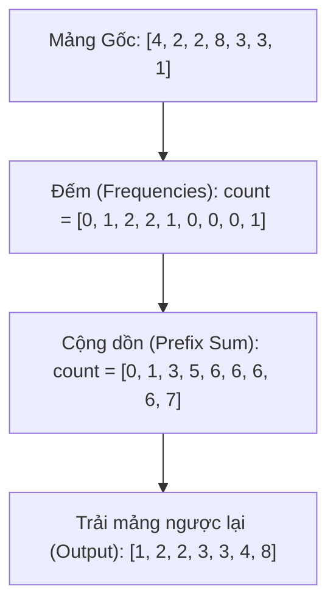
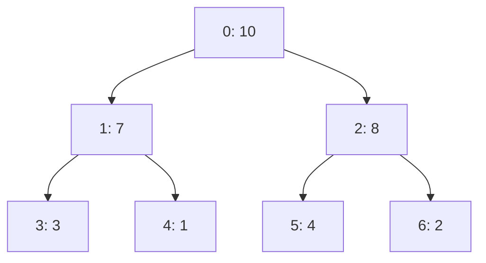
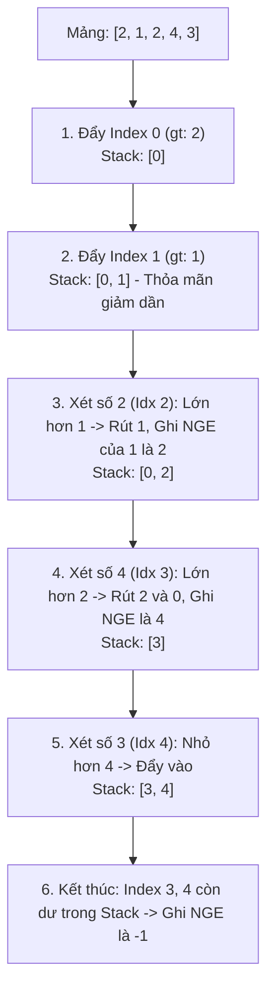
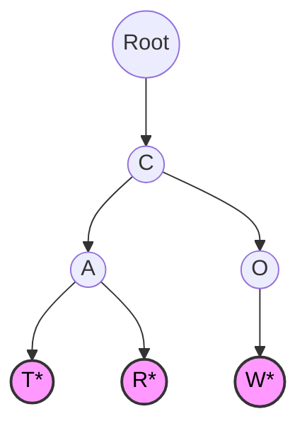
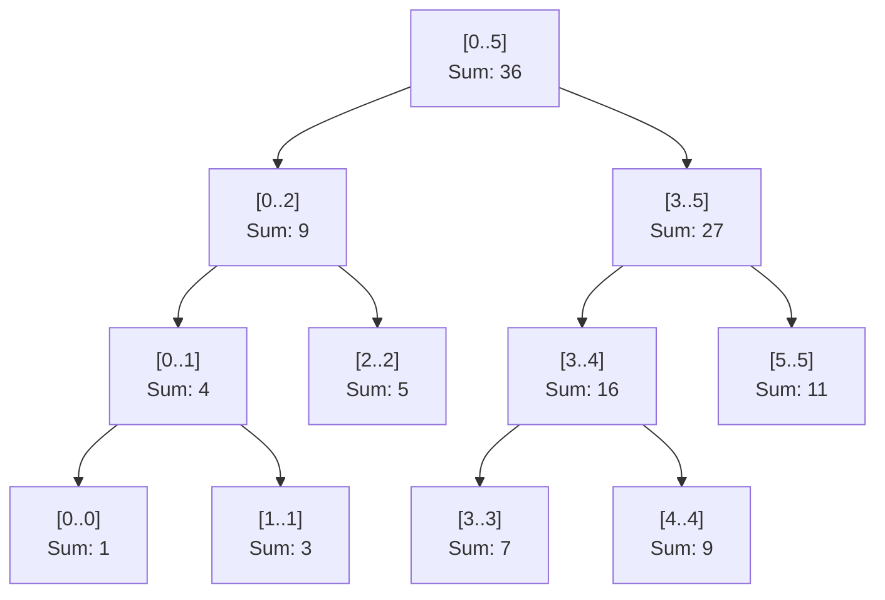

---
title: Các mẫu nâng cao (Advanced DI)
description: Đi sâu vào những ngóc ngách hắc búa nhất của Dependency Injection như Circular Dependency, truyền tham số động lúc chạy, và quét dịch vụ tự động (Scrutor).
---

# Các mẫu nâng cao (Advanced DI) {#di-advanced}

DI cơ bản giúp bạn làm 90% công việc hàng ngày. Nhưng để sống sót qua 10% các "ca đẻ khó" trong các hệ thống doanh nghiệp (Enterprise), bạn cần trang bị thêm một vài tiểu xảo cao cấp. Bài viết này sẽ giải phẫu những lỗi khét tiếng nhất và cách DI Container hiện đại giải quyết chúng.

## 1. Lỗi Phụ thuộc Vòng tròn (Circular Dependency) {#circular-dependency}

Đây là lỗi phổ biến nhất khiến ứng dụng của bạn không thể khởi động.

**Kịch bản:**
- Class `OrderService` cần gọi `UserService` để kiểm tra quyền người dùng trước khi đặt hàng. Nó Inject `UserService`.
- Class `UserService` cần gọi `OrderService` để xem người này đã đặt bao nhiêu đơn. Nó Inject `OrderService`.

**Chuyện gì xảy ra?**
Khi DI Container cố gắng tạo `OrderService`, nó thấy cần `UserService`. Nó bèn chạy đi tạo `UserService`. Nhưng để tạo `UserService`, nó lại thấy cần `OrderService`. Nó lại quay về tạo `OrderService`... Một vòng lặp vô hạn (Infinite Loop) xảy ra! Ứng dụng ném ra lỗi `System.InvalidOperationException: A circular dependency was detected`.

**Cách khắc phục:**
1. **Thiết kế lại (Khuyên dùng):** Thường thì lỗi này chỉ ra kiến trúc của bạn đang bị sai (Vi phạm SRP). Thay vì A gọi B, B gọi A, hãy tách phần logic chung ra một Class thứ 3 là `UserOrderValidator`.
2. **Dùng `Lazy<T>`:** Thay vì bắt Framework khởi tạo ngay lập tức lúc gọi Constructor, hãy nhét đối tượng vào lớp bọc `Lazy<T>`. Nó sẽ chỉ khởi tạo khi bạn gọi `.Value`.
3. **Property/Method Injection:** Thay vì Inject vào Constructor (bắt buộc phải có ngay lúc tạo), hãy tạo xong đối tượng rồi mới gán qua hàm `SetUserService()`. C# mặc định không khuyến khích cách này.

## 2. Factory Pattern kết hợp với DI {#factory-di}

DI rất giỏi trong việc tạo đối tượng, nhưng nó chỉ có thể cung cấp các đối tượng **Cố định (Static dependencies)** được đăng ký lúc đầu. Điều gì xảy ra nếu bạn muốn tạo ra `PaymentService` loại A hay B tùy thuộc vào **dữ liệu người dùng nhập vào lúc Runtime**?

DI không thể làm điều đó trực tiếp. Bạn phải kết hợp DI với [Factory Pattern](/docs/patterns/factory).

**Cách làm:**
Đừng Inject thẳng `IPaymentService`. Hãy Inject một cái xưởng `IPaymentFactory`.

```csharp
public class PaymentFactory : IPaymentFactory
{
    private readonly IServiceProvider _serviceProvider;

    // Inject IServiceProvider (chính là DI Container) vào xưởng
    public PaymentFactory(IServiceProvider serviceProvider)
    {
        _serviceProvider = serviceProvider;
    }

    public IPaymentService Create(string paymentType)
    {
        // Tùy vào biến Runtime mà Factory tự quyết định kéo Class nào ra từ DI Container
        if (paymentType == "Credit")
            return _serviceProvider.GetRequiredService<CreditCardPayment>();
        if (paymentType == "Momo")
            return _serviceProvider.GetRequiredService<MomoPayment>();
            
        throw new Exception("Unknown Type");
    }
}
```

Bằng cách này, bạn vừa giữ được tính động (Dynamic) của ứng dụng, vừa vẫn hưởng lợi từ việc quản lý vòng đời của DI Container.

## 3. Cạm bẫy DI (DI Pitfalls) và Background Services {#di-pitfalls}

Dù DI rất mạnh, nhưng nếu dùng sai cách, nó sẽ trở thành "sát thủ" thầm lặng giết chết hiệu năng ứng dụng. Dưới đây là 2 cạm bẫy cực kỳ nguy hiểm:

**Cạm bẫy 1: Inject IServiceProvider vào Constructor**
Nhiều người lười suy nghĩ, thay vì Inject đúng những Service mình cần (ví dụ `IUserService`, `IOrderService`), họ lại Inject thẳng cái DI Container (`IServiceProvider`) rồi thích lấy gì ra thì lấy.
Việc này bị coi là **Anti-pattern (Service Locator Pattern)**. Nó che giấu sự phụ thuộc của Class (nhìn vào Constructor không biết Class đó cần những gì), làm việc viết Unit Test trở thành ác mộng, và phá vỡ kiến trúc Dependency Inversion.

**Cạm bẫy 2: Dùng Scoped Services bên trong Background Service**
Background Services (như HostedService chạy ngầm quét dọn rác, gửi email) thường có vòng đời là **Singleton**. Nếu bạn Inject một dịch vụ `Scoped` (như DbContext) vào Background Service, ứng dụng sẽ Crash ngay lúc khởi động!
Để giải quyết, bạn KHÔNG ĐƯỢC Inject DbContext trực tiếp. Thay vào đó, hãy Inject `IServiceScopeFactory`, sau đó tự mở một Scope cục bộ:

```csharp
public class EmailBackgroundService : BackgroundService
{
    private readonly IServiceScopeFactory _scopeFactory;
    
    public EmailBackgroundService(IServiceScopeFactory scopeFactory)
    {
        _scopeFactory = scopeFactory;
    }

    protected override async Task ExecuteAsync(CancellationToken stoppingToken)
    {
        // Tự tạo ra một Scope độc lập (Giống như 1 Request giả lập)
        using (var scope = _scopeFactory.CreateScope())
        {
            // Lấy DbContext an toàn, dùng xong sẽ tự động Dispose!
            var dbContext = scope.ServiceProvider.GetRequiredService<MyDbContext>();
            await dbContext.Emails.AddAsync(new Email());
            await dbContext.SaveChangesAsync();
        }
    }
}
```

## 4. Tự động hóa đăng ký với Scrutor (Assembly Scanning) {#scrutor}

Nếu hệ thống của bạn có 500 cái Services, việc gõ tay 500 dòng `services.AddScoped<IA, A>()` ở file cấu hình là một cực hình. Nó không chỉ mệt mỏi mà còn dễ bị sót (Quên đăng ký = Lỗi sập hệ thống).

Trong thế giới .NET, có một thư viện mã nguồn mở cực kỳ nổi tiếng tên là **Scrutor**. Nó giúp bạn tự động "cào" (scan) toàn bộ mã nguồn để tìm và tự đăng ký các Class.

```csharp
// Thay vì viết 500 dòng, bạn chỉ cần viết 5 dòng
services.Scan(scan => scan
    .FromAssemblyOf<Program>() // Quét toàn bộ Assembly chứa file Program
    .AddClasses(classes => classes.Where(type => type.Name.EndsWith("Service"))) // Tìm các class có đuôi là "Service"
    .AsImplementedInterfaces() // Đăng ký nó với Interface mà nó kế thừa
    .WithScopedLifetime()); // Gán vòng đời Scoped cho toàn bộ!
```

Kỹ thuật này được gọi là **Convention-based Registration** (Đăng ký theo Quy ước). Nhờ nó, các dự án nghìn file vẫn sạch sẽ tinh tươm.

:::tip Lời kết khóa học
Bạn đã đi từ những khái niệm thô sơ nhất về Mảng (Big O, Stack, Queue), qua các thuật toán cân não (Sorting, Searching, Tree, Graph), lột xác tư duy với các nguyên lý thiết kế (OOP, SOLID, Design Patterns) và cuối cùng chạm đến cảnh giới của Kiến trúc sư (Dependency Injection).

Mọi ứng dụng khổng lồ như Facebook, Netflix hay chính dự án **VisualizationDSA** mà bạn đang tương tác, đều được ghép lại từ những mảnh ghép nhỏ bé đó. Vũ khí đã sẵn sàng, giờ là lúc bạn tự tay viết lên những dòng code xoay chuyển thế giới!
:::
---
title: Cơ bản về Dependency Injection (DI) & IoC
description: Bắt đầu tìm hiểu Dependency Injection và Inversion of Control. Kỹ thuật giúp các kỹ sư C# dẹp bỏ từ khóa "new" và xây dựng các hệ thống khổng lồ.
---

# Cơ bản về DI & IoC {#di-basics}

Nếu bạn đã đọc xong phần [Nguyên lý DIP (Dependency Inversion Principle)](/docs/solid/dip) trong chuỗi bài SOLID, bạn đã hiểu tại sao chúng ta không nên để các Class tự khởi tạo (gọi `new`) các thành phần phụ thuộc của chúng.

Thay vì một Class tự đi tìm và tạo ra đồ nghề cho mình, nó chỉ cần "há miệng chờ sung": khai báo những thứ nó cần ở hàm khởi tạo (Constructor), và sẽ có một thế lực bí ẩn bên ngoài tự động "nhét" (Inject) đồ nghề vào cho nó. 

Kỹ thuật đó gọi là **Dependency Injection (DI)** - Tiêm chích sự phụ thuộc.

## Inversion of Control (IoC) là gì? {#what-is-ioc}

**IoC (Đảo ngược quyền điều khiển)** là một khái niệm trừu tượng. Trong lập trình truyền thống, luồng chạy của chương trình (Control Flow) do Code của bạn điều khiển. Bạn gọi hàm A, hàm A gọi hàm B.

Với IoC, bạn "giao nộp" quyền điều khiển đó cho một **Framework (hoặc Container)**. Framework sẽ tự động biết khi nào cần tạo ra đối tượng nào, tiêm nó vào đâu, và bao giờ thì tiêu hủy nó.

**Dependency Injection (DI)** chính là cách phổ biến nhất để hiện thực hóa khái niệm IoC!

## Hình ảnh thực tế (Pha cà phê) {#real-world}

Tưởng tượng bạn là một chiếc Máy pha cà phê (`CoffeeMachine`). Để pha cà phê, bạn cần Nước (`Water`) và Hạt cà phê (`Beans`).

**Lập trình không có DI (Tự cung tự cấp):**
Chiếc máy tự chạy ra siêu thị mua hạt, tự chạy ra vòi hứng nước. 
Nếu siêu thị đổi loại hạt cà phê, hoặc vòi nước bị hỏng, chiếc Máy pha cà phê cũng hỏng theo! Nó phải gánh vác quá nhiều trách nhiệm (Vi phạm SRP).

**Lập trình có DI (Phục vụ tận răng):**
Chiếc máy pha cà phê có một cái phễu (Constructor). Buổi sáng, người Chủ quán (DI Container) sẽ tự động đổ Nước và Hạt cà phê vào phễu cho nó. Chiếc máy chả cần quan tâm Nước lấy từ đâu, nó chỉ việc bấm nút Pha là xong!

## Cài đặt DI Cơ bản trong C# (Code Example) {#code-example}

Đây là cách chúng ta áp dụng Constructor Injection (Tiêm qua hàm khởi tạo) - phương pháp DI phổ biến và an toàn nhất hiện nay.

```csharp
// 1. Định nghĩa "Đồ nghề" qua Interface
public interface ICoffeeBeans { string GetFlavor(); }
public interface IWaterSupply { void Pour(); }

// 2. Chi tiết của Đồ nghề
public class ArabicaBeans : ICoffeeBeans 
{ 
    public string GetFlavor() => "Cà phê Arabica thơm nhẹ"; 
}
public class TapWater : IWaterSupply 
{ 
    public void Pour() => Console.WriteLine("Đang đổ nước máy..."); 
}

// 3. Class Cấp cao (Máy pha cà phê)
public class CoffeeMachine
{
    private readonly ICoffeeBeans _beans;
    private readonly IWaterSupply _water;

    // CONSTRUCTOR INJECTION
    // Tôi cần Hạt và Nước! Ai gọi tôi thì làm ơn truyền vào dùm!
    public CoffeeMachine(ICoffeeBeans beans, IWaterSupply water)
    {
        _beans = beans;
        _water = water;
    }

    public void Brew()
    {
        _water.Pour();
        Console.WriteLine($"Đang pha... {_beans.GetFlavor()}");
    }
}
```

**Thế lực bí ẩn (DI Container) ở bên ngoài sẽ làm gì?**
Trong các ứng dụng .NET (ASP.NET Core), bạn không cần tự tay viết code khởi tạo này. Bạn chỉ cần cấu hình (Config) 1 lần duy nhất ở file `Program.cs`.

```csharp
// Đăng ký với hệ thống (DI Container)
var services = new ServiceCollection();
services.AddTransient<ICoffeeBeans, ArabicaBeans>();
services.AddTransient<IWaterSupply, TapWater>();
services.AddTransient<CoffeeMachine>();

var provider = services.BuildServiceProvider();

// Yêu cầu Framework lấy ra một cái Máy pha cà phê
var machine = provider.GetService<CoffeeMachine>();
machine.Brew(); 
// Framework sẽ tự động new Arabica, new TapWater, rồi nhét vào new CoffeeMachine!
```

:::info Tại sao gọi _biến bằng tiền tố gạch dưới?
Bạn sẽ thấy biến private `_beans` và `_water` có dấu gạch dưới `_`. Đây là Coding Convention (Quy ước gõ code) chuẩn mực của hệ sinh thái C#. Nó giúp lập trình viên phân biệt ngay lập tức đâu là biến nội bộ của Class (Field), đâu là tham số truyền vào (Parameter) mà không cần phải dùng từ khóa `this.beans = beans` lằng nhằng.
:::

## Next Steps {#next-steps}

Việc đăng ký dịch vụ vào DI Container (như `services.AddTransient`) trông thật kỳ diệu. Nhưng có bao giờ bạn tự hỏi, nếu 10 cái máy pha cà phê cùng hoạt động, Framework sẽ tạo ra **1 cái vòi nước dùng chung** cho cả 10 máy, hay tạo ra **10 cái vòi nước độc lập**?

Câu trả lời nằm ở khái niệm **Lifecycles (Vòng đời)**. Hãy cùng tìm hiểu 3 loại vòng đời quan trọng nhất của DI: **Transient, Scoped, và Singleton**.

<div class="vt-box-container next-steps">
  <a class="vt-box" href="/docs/di/lifecycles">
    <p class="next-steps-link">Vòng đời DI (Lifecycles)</p>
    <p class="next-steps-caption">Phân biệt Transient, Scoped, Singleton và cách quản lý bộ nhớ triệt để.</p>
  </a>
</div>
---
title: Keyed Services (.NET 8)
description: Khám phá Keyed Services - tính năng đột phá của .NET 8 giúp giải quyết bài toán Inject nhiều cài đặt (implementations) của cùng một Interface cực kỳ tinh tế.
---

# Keyed Services (.NET 8) {#keyed-services}

Trong bài [Factory Pattern với DI](/docs/di/advanced#factory-di), chúng ta đã thảo luận về một hạn chế cổ điển của DI Container mặc định trong .NET: Nó rất tệ trong việc phân biệt **nhiều cài đặt (implementations)** của **cùng một Interface**.

Nếu bạn có `CreditCardPayment` và `MomoPayment` cùng kế thừa `IPaymentService`, và bạn tiêm (inject) `IPaymentService` vào Constructor, DI Container sẽ luôn lấy cái class được đăng ký **cuối cùng** đưa cho bạn. Để giải quyết, trước đây chúng ta phải viết một cái Factory lằng nhằng hoặc dùng thư viện bên thứ ba (như Autofac).

Nhưng từ **.NET 8**, Microsoft đã chính thức tung ra một "vũ khí tối thượng": **Keyed Services**.

## Keyed Services là gì? {#what-is-it}

Keyed Services cho phép bạn gán một "chìa khóa" (Key - thường là một chuỗi string hoặc một Enum) cho mỗi Implementation khi bạn đăng ký chúng vào DI Container. Sau đó, khi cần sử dụng, bạn chỉ cần báo cho hệ thống biết bạn muốn chiếc chìa khóa nào.

## Cách đăng ký (Registration) {#registration}

Thay vì dùng `AddScoped`, `AddTransient`, bạn thêm chữ `Keyed` vào giữa: `AddKeyedScoped`, `AddKeyedTransient`.

```csharp
var builder = WebApplication.CreateBuilder(args);

// Đăng ký IPaymentService với key "Credit"
builder.Services.AddKeyedScoped<IPaymentService, CreditCardPayment>("Credit");

// Đăng ký IPaymentService với key "Momo"
builder.Services.AddKeyedScoped<IPaymentService, MomoPayment>("Momo");
```

## Cách sử dụng (Injection) {#injection}

Để lấy Service ra, bạn sử dụng Attribute `[FromKeyedServices(key)]` ngay trong Constructor của class cần dùng.

```csharp
public class CheckoutController : ControllerBase
{
    private readonly IPaymentService _creditPayment;
    private readonly IPaymentService _momoPayment;

    // Chỉ định rõ Key cho từng Interface!
    public CheckoutController(
        [FromKeyedServices("Credit")] IPaymentService creditPayment,
        [FromKeyedServices("Momo")] IPaymentService momoPayment)
    {
        _creditPayment = creditPayment;
        _momoPayment = momoPayment;
    }

    [HttpPost("pay-credit")]
    public IActionResult PayCredit()
    {
        _creditPayment.Process();
        return Ok();
    }
}
```

### Lấy động tại Runtime (Runtime Resolution)

Nếu Key được người dùng gửi lên từ giao diện (ví dụ người dùng chọn nút Momo trên Web), bạn không thể nhét cứng chữ "Momo" vào constructor bằng Attribute. Khi đó, bạn sẽ Inject một `IServiceProvider` (hoặc dùng `FromServices` trong tham số hàm) và lấy động:

```csharp
[HttpPost("pay-dynamic")]
// "type" có thể là "Credit" hoặc "Momo" do Frontend gửi lên
public IActionResult PayDynamic(string type, [FromServices] IServiceProvider serviceProvider)
{
    // Sử dụng GetRequiredKeyedService thay vì GetRequiredService
    var paymentService = serviceProvider.GetRequiredKeyedService<IPaymentService>(type);
    
    paymentService.Process();
    return Ok();
}
```

:::tip Cạm bẫy Service Locator
Mặc dù ở ví dụ trên, chúng ta tiêm `IServiceProvider` để lấy ra service động (điều mà bài trước vừa chê bai là Anti-pattern), nhưng trong trường hợp lấy theo Key từ Request của người dùng, đây là một trong những ngoại lệ được chấp nhận. Tuy nhiên, cách sạch sẽ nhất vẫn là tạo một **Factory** và để Factory đó gọi `GetRequiredKeyedService`.
:::

## Keyed Any (Bắt mọi Key) {#any-key}

Đôi khi bạn muốn inject một service "mặc định" cho bất kỳ Key nào không được đăng ký. .NET 8 cung cấp tính năng `KeyedService.AnyKey`. Tuy nhiên, tính năng này thường dùng ở mức độ thư viện nền tảng (Framework level) chứ ít khi dùng ở logic ứng dụng thông thường.

## Tóm lược {#summary}

Sự ra đời của **Keyed Services** trong .NET 8 đã đánh dấu sự kết thúc của việc phải viết hàng đống Factory thủ công chỉ để switch (chuyển đổi) giữa các Implementation. Nó làm cho code DI của C# trở nên gọn gàng, thanh lịch và mạnh mẽ không kém cạnh gì các DI Framework đình đám nhất.

Và đến đây, hành trình khám phá thế giới Lập trình Hướng đối tượng, SOLID, Design Patterns và Kiến trúc Dependency Injection của bạn đã chính thức **Viên mãn**. Chúc mừng bạn đã lên một tầm cao mới trong sự nghiệp Kỹ sư phần mềm!
---
title: Vòng đời DI (Lifecycles)
description: Khám phá bí quyết quản lý bộ nhớ của DI Container thông qua 3 vòng đời kinh điển Singleton, Scoped, và Transient. Khi nào dùng cái nào?
---

# Vòng đời DI (Lifecycles) {#lifecycles}

Khi bạn giao phó quyền khởi tạo đối tượng (gọi hàm `new`) cho một **DI Container**, bạn phải chỉ định rõ cho Framework biết: *"Đối tượng này sau khi được tạo ra sẽ sống được bao lâu?"*

Nếu đối tượng nào cũng sống vĩnh viễn (như Singleton), RAM của bạn sẽ nhanh chóng bị quá tải. Nếu đối tượng nào cũng tạo mới liên tục, CPU sẽ chạy kiệt sức vì chi phí dọn rác (Garbage Collector).

Để giải bài toán này, .NET Core thiết kế 3 cấp độ vòng đời kinh điển: **Transient**, **Scoped**, và **Singleton**.

## 1. Transient (Thoáng qua) {#transient}

**Quy tắc:** Tạo MỚI mỗi khi được yêu cầu.

Bất cứ khi nào có một Class yêu cầu đối tượng này thông qua Constructor, DI Container sẽ ngay lập tức gọi lệnh `new` để tạo ra một phiên bản hoàn toàn mới cứng. Kể cả khi 2 Class cùng xin trong 1 HTTP Request, hệ thống cũng tạo ra 2 bản sao độc lập.

- **Đăng ký:** `services.AddTransient<IService, MyService>();`
- **Hình ảnh thực tế:** Giống như tờ khăn giấy dùng 1 lần ở quán ăn. Ai cần cũng được phát 1 tờ mới tinh, xài xong vứt (bị GC thu hồi ngay).
- **Khi nào nên dùng?**
  - Dành cho các Class chứa logic tính toán nhẹ nhàng, không lưu trạng thái (Stateless).
  - Dành cho các Service chạy đa luồng cực nhanh mà không muốn bị đụng độ biến.

## 2. Scoped (Phạm vi) {#scoped}

**Quy tắc:** Tạo MỘT LẦN duy nhất trong MỖI PHẠM VI (Một Request).

Khái niệm "Phạm vi" (Scope) trong lập trình Web thường ám chỉ 1 HTTP Request. Khi người dùng A gửi yêu cầu lên Web API, hệ thống mở một Scope. Nếu trong quá trình xử lý yêu cầu đó, có 5 Class cùng xin đối tượng này, DI Container chỉ tạo `new` đúng 1 lần ở Class đầu tiên, 4 Class sau sẽ xài ké. Khi Request kết thúc trả về cho Client, Scope bị hủy, đối tượng cũng chết theo. Nếu người dùng B gửi request khác, một đối tượng mới lại được sinh ra.

- **Đăng ký:** `services.AddScoped<IService, MyService>();`
- **Hình ảnh thực tế:** Giống như một bàn tiệc (Request). Bàn số 1 gọi một chai nước mắm (Scoped Service). Tất cả mọi người ở Bàn 1 xài chung chai nước mắm đó. Bàn số 2 sẽ có chai nước mắm khác. Không ai xài chung của ai.
- **Khi nào nên dùng?**
  - CỰC KỲ QUAN TRỌNG cho **Database Context (EF Core)**. Mọi thao tác lưu/xóa/sửa trong 1 request cần dùng chung 1 kết nối DB để đảm bảo tính toàn vẹn Giao dịch (Transaction).
  - Các Service liên quan đến xác thực người dùng (User Session / Claims) trong cùng 1 request.

## 3. Singleton (Duy nhất) {#singleton}

**Quy tắc:** Tạo MỘT LẦN DUY NHẤT trong suốt vòng đời của Ứng dụng.

Ngay khi đối tượng được yêu cầu lần đầu tiên, DI Container sẽ khởi tạo nó và giữ nó sống mãi trong RAM. Tất cả mọi Request từ tất cả người dùng, mọi Class đều được phát cho ĐÚNG CÙNG MỘT đối tượng đó.

- **Đăng ký:** `services.AddSingleton<IService, MyService>();`
- **Hình ảnh thực tế:** Giống như ông Chủ quán. Cả ngàn khách hàng đến quán đều chỉ giao tiếp với đúng 1 ông chủ đó.
- **Khi nào nên dùng?**
  - Cấu hình ứng dụng (App Configs), File ghi log (Logger).
  - Các Dịch vụ lưu Cache (MemoryCache) dùng chung cho mọi người.
  - Các kết nối tốn rất nhiều tài nguyên để mở (như Connection Pool của Redis, RabbitMQ).

## Bảng so sánh nhanh (Cheat Sheet) {#cheat-sheet}

| Vòng đời | Tần suất tạo mới | Khả năng chia sẻ | Rủi ro Đa luồng (Multi-threading) |
| :--- | :--- | :--- | :--- |
| **Transient** | Gọi là tạo mới ngay | Không chia sẻ | Thấp nhất (Ai xài nấy chịu) |
| **Scoped** | 1 lần / 1 Request | Chia sẻ trong cùng 1 Request | Trung bình |
| **Singleton** | 1 lần duy nhất từ lúc chạy App | Chia sẻ cho TOÀN BỘ ứng dụng | RẤT CAO! (Bắt buộc phải dùng Lock, hoặc Class không được lưu biến thay đổi) |

:::warning Lỗi kinh điển: Captive Dependency
Đây là lỗi 99% các Lập trình viên .NET mới vào nghề đều dính.
**Luật thép:** Một Service có vòng đời DÀI HƠN không bao giờ được phép Consume (Nuốt) một Service có vòng đời NGẮN HƠN.

**Ví dụ:** Nếu bạn lấy một `Singleton` (Sống vĩnh viễn) mà Inject một thằng `Scoped` (DB Context) vào hàm khởi tạo của nó. Thằng Singleton sẽ "giam cầm" (Captive) thằng Scoped đó mãi mãi! Kết quả? Kết nối Database không bao giờ bị đóng lại, ứng dụng của bạn sẽ chết ngắc vì rò rỉ bộ nhớ (Memory Leak) và cạn kiệt Connection Pool.
:::

## Next Steps {#next-steps}

Quản lý tốt Vòng đời là bạn đã nắm được 80% sức mạnh của DI. Thế nhưng, đời không như là mơ. Sẽ có những lúc bạn gặp phải tình trạng "Gà và Trứng": Class A yêu cầu Class B, Class B lại yêu cầu Class A. Hoặc bạn muốn tự quyết định sẽ Inject lớp nào tùy thuộc vào biến môi trường chạy lúc đó.

Làm thế nào để xử lý các ca khó đẻ này? Hãy bước sang bài viết cuối cùng của toàn bộ giáo trình: **Các mẫu nâng cao (Advanced DI)**.

<div class="vt-box-container next-steps">
  <a class="vt-box" href="/docs/di/advanced">
    <p class="next-steps-link">Mẫu Nâng cao DI (Advanced DI)</p>
    <p class="next-steps-caption">Giải quyết Circular Dependency, Factory DI, và Scrutor Scanning.</p>
  </a>
</div>
---
title: Độ phức tạp Thuật toán & Ký hiệu O Lớn
description: Tìm hiểu cách đo lường hiệu suất và mức độ mở rộng của mã nguồn C# bằng ký hiệu Big O.
---

# Độ phức tạp & Ký hiệu O Lớn {#big-o}

Khi viết code, đặc biệt là trong các dự án thực tế, một thuật toán không chỉ cần "chạy đúng" mà còn phải "chạy nhanh" và "tiết kiệm tài nguyên". Để đo lường điều này một cách khoa học mà không phụ thuộc vào sức mạnh của CPU hay RAM của từng máy tính, các Kỹ sư phần mềm sử dụng **Ký hiệu O Lớn (Big O Notation)**.

Big O mô tả **tốc độ tăng trưởng** của một thuật toán khi **kích thước dữ liệu đầu vào ($N$)** ngày càng lớn.

## Thời gian (Time) vs Không gian (Space) {#time-vs-space}

Khi đánh giá một thuật toán, chúng ta quan tâm đến hai yếu tố chính:
1. **Độ phức tạp Thời gian (Time Complexity):** Thuật toán sẽ mất bao nhiêu bước để hoàn thành khi $N$ tăng lên? (Thường được ưu tiên hàng đầu).
2. **Độ phức tạp Không gian (Space Complexity):** Thuật toán sẽ ngốn thêm bao nhiêu bộ nhớ RAM khi $N$ tăng lên?

## Các Độ phức tạp phổ biến trong C# {#common-complexities}

Dưới đây là các loại Big O phổ biến nhất xếp từ hiệu suất tốt nhất đến kém nhất.

### 1. O(1) – Thời gian Hằng số (Constant Time)

Thuật toán thực thi với một lượng thời gian cố định, **bất kể** dữ liệu đầu vào có 10 phần tử hay 1 tỷ phần tử. Đây là mức hiệu suất mơ ước.

```csharp
int[] numbers = { 10, 20, 30, 40, 50 };

// Lấy phần tử ở vị trí index = 2
// C# biết chính xác ô nhớ của phần tử này, không cần phải duyệt mảng.
int x = numbers[2]; 
```

**Ví dụ phổ biến:** 
- Truy cập phần tử của mảng qua Index.
- Đọc/Ghi dữ liệu vào `Dictionary<K, V>` hoặc `HashSet<T>`.

### 2. O(log N) – Thời gian Logarit (Logarithmic Time)

Khi dữ liệu tăng lên, số bước thực hiện cũng tăng, nhưng **tăng rất rất chậm**. Đây là đặc trưng của các thuật toán "chia để trị" (thường cắt đôi dữ liệu sau mỗi bước).

```csharp
// Tìm kiếm nhị phân (Binary Search) trên mảng đã sắp xếp
while (left <= right)
{
    int mid = left + (right - left) / 2;
    if (array[mid] == target) return mid;
    
    // Bỏ qua một nửa mảng không cần thiết!
    if (array[mid] < target) left = mid + 1;
    else right = mid - 1;
}
```

**Ví dụ phổ biến:** 
- Tìm kiếm nhị phân (Binary Search).
- Các thao tác trên Cây Nhị Phân Tìm Kiếm (BST) cân bằng.

### 3. O(N) – Thời gian Tuyến tính (Linear Time)

Số bước thực hiện tăng **tỉ lệ thuận** với số lượng dữ liệu đầu vào. Nếu bạn có 1,000 phần tử, vòng lặp sẽ chạy 1,000 lần.

```csharp
string[] names = { "Nam", "Lan", "Hương", "Tuấn" };

// Phải kiểm tra từng người một
foreach (var name in names)
{
    if (name == "Tuấn") 
    {
        Console.WriteLine("Tìm thấy!");
        break;
    }
}
```

**Ví dụ phổ biến:** 
- Vòng lặp `for` / `foreach` duyệt mảng hoặc `List<T>`.
- Các phương thức LINQ như `.Where()`, `.Select()`, `.ToList()`.

### 4. O(N²) – Thời gian Bậc hai (Quadratic Time)

Số bước thực hiện tăng theo **bình phương** của dữ liệu đầu vào. Nếu $N = 1,000$, số bước sẽ là $1,000,000$. Thuật toán sẽ cực kỳ chậm chạp và làm treo ứng dụng nếu dữ liệu lớn.

```csharp
int[] numbers = { 1, 2, 3, 4, 5 };

// Hai vòng lặp lồng nhau (Nested loops)
for (int i = 0; i < numbers.Length; i++)
{
    for (int j = 0; j < numbers.Length; j++)
    {
        Console.WriteLine($"{numbers[i]} - {numbers[j]}");
    }
}
```

**Ví dụ phổ biến:** 
- Sắp xếp Nổi bọt (Bubble Sort), Sắp xếp Chèn (Insertion Sort).
- Các vòng lặp lồng nhau vô tội vạ.

:::warning Lưu ý khi code C#
Khi đi phỏng vấn hoặc viết code hệ thống lớn, nếu bạn thấy mình đang viết 2 vòng `for` lồng nhau để tìm kiếm dữ liệu, hãy dừng lại và tự hỏi: *"Liệu mình có thể chuyển một mảng thành `Dictionary` để giảm độ phức tạp từ $O(N^2)$ xuống $O(N)$ hay không?"*.
:::

## Trực quan hóa tốc độ tăng trưởng {#growth-chart}

Để dễ hình dung, dưới đây là sự so sánh số lượng phép tính cần làm khi $N$ thay đổi:

| $N$ (Dữ liệu) | O(1) | O(log N) | O(N) | O(N²) |
| --- | --- | --- | --- | --- |
| **10** | 1 bước | ~3 bước | 10 bước | 100 bước |
| **100** | 1 bước | ~6 bước | 100 bước | 10,000 bước |
| **1,000** | 1 bước | ~9 bước | 1,000 bước | 1,000,000 bước |
| **1,000,000** | 1 bước | ~19 bước | 1,000,000 bước | 1,000,000,000,000 bước (Treo máy) |

## Next Steps {#next-steps}

Việc hiểu Big O là nền tảng để bạn chọn đúng cấu trúc dữ liệu. Ở bài tiếp theo, chúng ta sẽ lặn sâu xuống tầng thấp nhất của máy tính để xem **Bộ nhớ (Stack/Heap)** thực sự hoạt động ra sao khi code C# của bạn được thực thi.

<div class="vt-box-container next-steps">
  <a class="vt-box" href="/docs/intro/memory">
    <p class="next-steps-link">Bộ nhớ & Luồng thực thi</p>
    <p class="next-steps-caption">Phân biệt Stack và Heap, Reference type và Value type trong .NET.</p>
  </a>
</div>
---
title: Giới thiệu & Tổng quan
description: Bắt đầu hành trình khám phá Lập trình Hướng đối tượng, SOLID, Design Patterns và Dependency Injection trong C# và .NET.
---

# Lập trình Hướng đối tượng trong C# {#introduction}

Chào mừng bạn đến với tài liệu hướng dẫn Lập trình Hướng đối tượng (OOP) và Kiến trúc phần mềm với C#. 

Tài liệu này không chỉ dạy bạn cú pháp, mà còn hướng dẫn bạn **cách tư duy** như một Kỹ sư phần mềm (Software Engineer). Bạn sẽ học cách thiết kế những hệ thống lớn, dễ bảo trì, dễ mở rộng thông qua các nguyên lý thiết kế kinh điển đã được chứng minh qua thời gian.

## Lập trình Hướng đối tượng (OOP) là gì? {#what-is-oop}

Lập trình Hướng đối tượng (Object-Oriented Programming) là một mô hình lập trình dựa trên khái niệm về **"Đối tượng" (Objects)**. Thay vì tổ chức chương trình thành một chuỗi các hàm và logic (như lập trình thủ tục), OOP chia nhỏ thế giới thực thành các đối tượng có **Trạng thái (Dữ liệu/Thuộc tính)** và **Hành vi (Phương thức)**.

Ví dụ: Một đối tượng `User` có thể chứa trạng thái (Tên, Email, Tuổi) và hành vi (Đăng nhập, Đổi mật khẩu, Gửi tin nhắn).

**Lưu ý:** C# là một ngôn ngữ thuần OOP. Mọi thứ trong C# (ngoại trừ một số kiểu nguyên thủy đặc biệt) đều là đối tượng. Nếu bạn muốn trở thành một chuyên gia C# hay .NET Developer, việc làm chủ OOP là bắt buộc.

## 4 Trụ cột của Lập trình Hướng đối tượng {#four-pillars}

Để một ngôn ngữ được coi là hỗ trợ OOP, nó phải cung cấp các cơ chế cho 4 nguyên lý cốt lõi sau. Chúng tôi gọi đây là "4 Trụ cột của OOP":

1. **[Đóng gói (Encapsulation)](/docs/oop/encapsulation):** Che giấu trạng thái nội bộ của đối tượng và yêu cầu mọi tương tác phải thông qua các phương thức của đối tượng đó.
2. **[Kế thừa (Inheritance)](/docs/oop/inheritance):** Cho phép tạo một lớp mới dựa trên một lớp đã có, tái sử dụng code và thiết lập quan hệ "is-a" (là một).
3. **[Đa hình (Polymorphism)](/docs/oop/polymorphism):** Cho phép các đối tượng thuộc các lớp khác nhau phản hồi cùng một lời gọi hàm theo những cách riêng biệt.
4. **[Trừu tượng (Abstraction)](/docs/oop/abstraction):** Che giấu sự phức tạp của quá trình thực thi, chỉ bộc lộ những giao diện và tính năng cần thiết nhất.

## Vượt ra ngoài OOP: Kiến trúc phần mềm {#beyond-oop}

Viết được code OOP không có nghĩa là bạn viết ra code "tốt". Một lớp có thể chứa 10,000 dòng code, trộn lẫn đủ thứ logic từ truy xuất database đến giao diện người dùng. Để tránh thảm họa đó, chúng ta sẽ tiếp tục học:

- **[Nguyên lý SOLID](/docs/solid/srp):** 5 nguyên lý thiết kế đỉnh cao của Robert C. Martin (Uncle Bob) giúp code trở nên "Sạch" (Clean Code).
- **[Design Patterns](/docs/patterns/singleton):** Các giải pháp đã được tiêu chuẩn hóa cho các vấn đề lặp đi lặp lại trong thiết kế phần mềm (Gang of Four).
- **[Dependency Injection (DI)](/docs/di/basics):** Kỹ thuật tiêm sự phụ thuộc, linh hồn của ASP.NET Core hiện đại, giúp hệ thống lỏng lẻo (loosely coupled) và dễ dàng viết Unit Test.

## Prerequisites (Yêu cầu đầu vào) {#prerequisites}

Để có thể theo dõi tốt loạt tài liệu này, bạn cần:

- Đã cài đặt [Visual Studio 2022](https://visualstudio.microsoft.com/) hoặc [Rider](https://www.jetbrains.com/rider/) / VS Code.
- Đã cài đặt [.NET 8.0 SDK](https://dotnet.microsoft.com/en-us/download/dotnet/8.0) trở lên.
- Có kiến thức cơ bản về cú pháp C# (biến, vòng lặp `for`, `while`, câu lệnh điều kiện `if`, `switch`).

:::tip Bắt đầu nhanh
Nếu bạn muốn thực hành ngay các đoạn code trong giáo trình này, hãy mở Terminal (hoặc Command Prompt) và tạo một Project C# Console rỗng bằng các lệnh sau:

```bash
# 1. Tạo thư mục mới và khởi tạo project
dotnet new console -n DSA_Practice
cd DSA_Practice

# 2. Bạn có thể paste code ví dụ vào file Program.cs sau đó chạy thử bằng lệnh:
dotnet run
```
:::

**Tích hợp cùng Visualization:**
Tài liệu này được đi kèm với các mô-đun **Trực quan hóa (Visualization)**. Bất cứ khi nào bạn thấy một khái niệm khó hiểu, hãy bấm sang tab "Trực quan hóa" để xem thuật toán hoặc vòng đời đối tượng hoạt động ra sao trên màn hình.

## Next Steps {#next-steps}

Hãy cùng bắt đầu hành trình bằng việc tìm hiểu trụ cột đầu tiên và quan trọng nhất để bảo vệ dữ liệu của bạn: Tính Đóng gói.

<div class="vt-box-container next-steps">
  <a class="vt-box" href="/docs/oop/encapsulation">
    <p class="next-steps-link">Đóng gói (Encapsulation)</p>
    <p class="next-steps-caption">Tìm hiểu cách bảo vệ trạng thái của đối tượng và che giấu chi tiết triển khai bên trong.</p>
  </a>
</div>
---
title: Bộ nhớ & Luồng thực thi chương trình
description: Khám phá cách .NET quản lý bộ nhớ, phân biệt Stack vs Heap, và hiểu rõ Value Type so với Reference Type trong C#.
---

# Bộ nhớ & Luồng thực thi {#memory}

Để trở thành một lập trình viên C# xuất sắc, bạn không chỉ cần biết cách viết code chạy được, mà còn phải hiểu **chương trình của mình sống ở đâu và tiêu thụ bộ nhớ như thế nào**. 

Trong C# và .NET, bộ nhớ RAM được chia thành hai khu vực chính để lưu trữ dữ liệu khi chương trình đang chạy: **Stack** (Ngăn xếp) và **Heap** (Đống).

## 1. Vùng nhớ Stack (Ngăn xếp) {#stack}

**Stack** là một vùng nhớ đặc biệt dùng để quản lý luồng thực thi (execution flow) của các phương thức và lưu trữ các dữ liệu tạm thời.

- **Cấu trúc LIFO (Last-In, First-Out):** Giống như một chồng đĩa. Đĩa nào đặt vào sau cùng sẽ được lấy ra đầu tiên. Khi một hàm được gọi, nó được "đẩy" (push) vào Stack. Khi hàm chạy xong, nó bị "lấy ra" (pop) và bộ nhớ được giải phóng ngay lập tức.
- **Tốc độ cực nhanh:** Vì cấu trúc đơn giản, việc cấp phát và thu hồi bộ nhớ trên Stack diễn ra gần như tức thời.
- **Kích thước giới hạn:** Stack có giới hạn dung lượng khá nhỏ (thường là 1MB mỗi thread). Nếu bạn dùng đệ quy vô hạn, Stack sẽ bị tràn, gây ra lỗi khét tiếng `StackOverflowException`.
- **Chứa gì?** Local variables (Biến cục bộ) và các **Value Types** (Kiểu tham trị) như `int`, `double`, `bool`, `struct`.

## 2. Vùng nhớ Heap (Đống) {#heap}

**Heap** là một vùng nhớ rộng lớn dùng để lưu trữ các dữ liệu có vòng đời phức tạp hơn, không bị ràng buộc bởi việc hàm kết thúc hay chưa.

- **Cấu trúc tự do:** Dữ liệu được cấp phát rải rác.
- **Tốc độ chậm hơn:** Phải mất công tìm khoảng trống phù hợp để cấp phát, và việc truy cập dữ liệu thông qua con trỏ (pointer) từ Stack làm tốc độ chậm hơn một chút.
- **Dọn rác tự động (Garbage Collector - GC):** Khi một hàm kết thúc, dữ liệu trên Heap KHÔNG tự động biến mất. Thay vào đó, bộ thu gom rác (GC) của .NET sẽ thỉnh thoảng đi tuần tra. Nếu phát hiện dữ liệu nào không còn ai sử dụng (không còn biến nào ở Stack trỏ tới), nó mới dọn dẹp để trả lại RAM.
- **Chứa gì?** Các **Reference Types** (Kiểu tham chiếu) như `class`, `string`, `interface`, `delegate`, `array`.

## Trực quan hóa qua ví dụ Code {#code-example}

Hãy xem đoạn code sau và phân tích bộ nhớ:

```csharp
public class Person 
{
    public string Name; // Thuộc tính
}

public void MyMethod()
{
    int x = 10;                     // (1)
    Person p = new Person();        // (2)
    p.Name = "VisualizationDSA";    // (3)
}
```

**Chuyện gì xảy ra trong bộ nhớ?**
1. **Dòng (1):** Biến `x` là một `int` (Value Type) và là biến cục bộ. Nó được lưu trực tiếp trên **Stack**.
2. **Dòng (2):** 
   - Toán tử `new Person()` tạo ra một đối tượng thực sự. Vì `Person` là một `class` (Reference Type), toàn bộ đối tượng này được đặt vào **Heap**.
   - Biến `p` đóng vai trò là "con trỏ" (Reference). Bản thân biến `p` nằm trên **Stack**, và nó chứa **địa chỉ bộ nhớ** trỏ tới đối tượng trên Heap.
3. **Dòng (3):** Gán chuỗi vào thuộc tính. Chuỗi (`string`) cũng là Reference Type, nên nội dung chuỗi nằm trên Heap.

:::warning "Cú lừa" kinh điển về Value Type
Rất nhiều tài liệu cũ nói rằng: *"Value Types luôn nằm trên Stack"*. **Đây là thông tin sai lệch!**
Nếu một Value Type (như `int`) là **thuộc tính của một Class**, thì nó sẽ "đi theo" Class đó. Ví dụ: Nếu `Person` có thêm `public int Age;`, thì biến `Age` này sẽ nằm sát cạnh tên người dùng trên **Heap**, chứ không phải Stack!

Quy tắc chuẩn xác là: **"Biến nằm ở đâu thì dữ liệu của nó ở đó. Trừ khi nó là đối tượng của Class/Array, thì đối tượng luôn ném lên Heap."**
:::

## Tại sao bạn cần phải quan tâm? {#why-care}

Hiểu về Stack và Heap giúp bạn giải thích được hiện tượng Tham chiếu (Reference).

```csharp
Person p1 = new Person();
p1.Name = "Alice";

Person p2 = p1; // p2 không sao chép dữ liệu, nó chỉ sao chép "ĐỊA CHỈ"
p2.Name = "Bob";

Console.WriteLine(p1.Name); // In ra "Bob"! Vì p1 và p2 cùng trỏ chung một đối tượng trên Heap.
```

Nếu bạn không muốn điều này xảy ra, bạn cần hiểu và sử dụng `struct` thay vì `class` cho những cấu trúc dữ liệu nhỏ và bất biến, vì `struct` là Value Type và sẽ được copy thực sự (Deep Copy) khi gán.

## Next Steps {#next-steps}

Chúc mừng bạn đã hoàn thành phần Nền tảng! Bạn đã nắm trong tay tư duy đánh giá thuật toán và cách máy tính phân bổ bộ nhớ. Bây giờ, hãy tiến vào thế giới của Thuật toán bằng cách mổ xẻ phương pháp sắp xếp đơn giản nhất: **Sắp xếp Nổi bọt (Bubble Sort)**.

<div class="vt-box-container next-steps">
  <a class="vt-box" href="/docs/sorting/bubble-sort">
    <p class="next-steps-link">Sắp xếp Nổi bọt (Bubble Sort)</p>
    <p class="next-steps-caption">Mô phỏng cách các bọt khí nổi lên mặt nước để sắp xếp dữ liệu.</p>
  </a>
</div>
---
title: Tính Trừu tượng (Abstraction)
description: Khái niệm Trừu tượng hóa trong Lập trình Hướng đối tượng và cách ẩn đi các chi tiết phức tạp, chỉ bộc lộ những tính năng cốt lõi.
---

# Tính Trừu tượng (Abstraction) {#abstraction}

Trong thế giới thực, khi bạn lái một chiếc xe ô tô, bạn chỉ cần biết cách sử dụng vô lăng, chân ga và chân phanh. Bạn không cần phải hiểu chính xác cách động cơ đốt trong hoạt động, hệ thống phun xăng điện tử bơm nhiên liệu ra sao. Sự che giấu những chi tiết phức tạp đó và chỉ bộc lộ giao diện dễ sử dụng được gọi là **Tính Trừu tượng (Abstraction)**.

Trong Lập trình Hướng đối tượng (OOP), Trừu tượng hóa là quá trình **ẩn các chi tiết cài đặt bên trong** và chỉ hiển thị **những tính năng thiết yếu nhất** cho người dùng (hoặc các lớp khác).

## Đóng gói (Encapsulation) vs Trừu tượng (Abstraction) {#encapsulation-vs-abstraction}

Rất nhiều người mới học OOP nhầm lẫn giữa hai khái niệm này. Đây là cách phân biệt cốt lõi:
- **Đóng gói (Encapsulation):** Che giấu **Dữ liệu** và bảo vệ trạng thái nội bộ. Nó tập trung vào việc *"Ai có quyền truy cập và thay đổi biến này?"*.
- **Trừu tượng (Abstraction):** Che giấu **Sự phức tạp**. Nó tập trung vào việc *"Lớp này cung cấp những dịch vụ (hành vi) gì, mà không cần phơi bày cách nó làm điều đó"*.

**Tóm tắt ngắn gọn:**
- Encapsulation: Dấu dữ liệu (Hide Data).
- Abstraction: Dấu sự phức tạp (Hide Complexity).

## Cài đặt Trừu tượng bằng Abstract Class trong C# {#abstract-classes}

Trong C#, cách phổ biến nhất để thực hiện Tính Trừu tượng là sử dụng **lớp trừu tượng (abstract class)** và **phương thức trừu tượng (abstract method)**.

Lớp trừu tượng là một lớp không thể được khởi tạo (bạn không thể dùng từ khóa `new` với nó). Mục đích duy nhất của nó là đóng vai trò làm lớp cơ sở cho các lớp khác kế thừa.

### Ví dụ về Abstract Class

Giả sử chúng ta đang xây dựng phần mềm quản lý hình học:

```csharp
// Lớp trừu tượng: Không thể khởi tạo bằng 'new Shape()'
public abstract class Shape
{
    // Một thuộc tính bình thường, có thể kế thừa
    public string Color { get; set; }

    // Phương thức trừu tượng: KHÔNG CÓ THÂN HÀM!
    // Buộc TẤT CẢ các lớp con phải cung cấp chi tiết cài đặt
    public abstract double CalculateArea();

    // Phương thức thông thường: Lớp con có thể dùng ngay
    public void DisplayColor()
    {
        Console.WriteLine($"Hình này có màu {Color}");
    }
}
```

Ở ví dụ trên, phương thức `CalculateArea()` không có thân hàm (không có dấu `{}`). Lý do là: `Shape` là một khái niệm quá trừu tượng, chúng ta không thể biết công thức tính diện tích của một "hình" chung chung là gì.

### Triển khai (Implementation) bởi Lớp con

Các lớp con kế thừa từ lớp `Shape` **bắt buộc** phải ghi đè (`override`) phương thức trừu tượng:

```csharp
public class Circle : Shape
{
    public double Radius { get; set; }

    public Circle(double radius, string color)
    {
        Radius = radius;
        Color = color;
    }

    // BẮT BUỘC phải override CalculateArea()
    public override double CalculateArea()
    {
        return Math.PI * Radius * Radius;
    }
}

public class Rectangle : Shape
{
    public double Width { get; set; }
    public double Height { get; set; }

    // BẮT BUỘC phải override CalculateArea()
    public override double CalculateArea()
    {
        return Width * Height;
    }
}
```

### Sử dụng Lớp Trừu tượng

Nhờ có Tính Đa hình (Polymorphism) mà chúng ta học ở bài trước, chúng ta có thể sử dụng lớp trừu tượng `Shape` làm kiểu dữ liệu tham chiếu:

```csharp
// Shape s = new Shape(); // LỖI BIÊN DỊCH! Không thể khởi tạo abstract class

Shape myCircle = new Circle(5.0, "Đỏ");
Shape myRectangle = new Rectangle(4.0, 6.0, "Xanh");

// Sử dụng phương thức chung đã được code sẵn ở lớp cha
myCircle.DisplayColor(); // Output: Hình này có màu Đỏ

// Sử dụng phương thức trừu tượng, C# sẽ tự động gọi logic ở lớp con
Console.WriteLine($"Diện tích hình tròn: {myCircle.CalculateArea()}");
Console.WriteLine($"Diện tích hình chữ nhật: {myRectangle.CalculateArea()}");
```

## Khi nào nên dùng Abstract Class? {#when-to-use}

- Khi bạn muốn nhóm các hành vi chung (đã có code) và chia sẻ cho các lớp con.
- Khi bạn muốn thiết lập một "khuôn mẫu" bắt buộc các lớp con phải thực thi một số phương thức nhất định, nhưng không biết chi tiết lúc này.
- Khi có mối quan hệ "is-a" (là một) mạnh mẽ. (VD: `Dog` is an `Animal`).

## Next Steps {#next-steps}

Mặc dù `abstract class` rất mạnh mẽ, nhưng C# chỉ cho phép một lớp kế thừa từ **duy nhất một** lớp cha. Để vượt qua giới hạn này và đạt đến mức độ trừu tượng cao nhất (trừu tượng 100%), C# cung cấp khái niệm **Interface (Giao diện)**.

<div class="vt-box-container next-steps">
  <a class="vt-box" href="/docs/oop/interface">
    <p class="next-steps-link">Interface & Abstract Class</p>
    <p class="next-steps-caption">Sự khác biệt giữa Giao diện và Lớp trừu tượng, kỹ thuật đa kế thừa trong C#.</p>
  </a>
</div>
---
title: Tính Đóng gói (Encapsulation)
description: Tìm hiểu cách bảo vệ trạng thái của đối tượng và che giấu chi tiết triển khai bên trong bằng Tính Đóng gói trong C#.
---

# Tính Đóng gói (Encapsulation) {#encapsulation}

Tính Đóng gói là một trong bốn trụ cột cơ bản của Lập trình Hướng đối tượng (OOP). Nó đề cập đến việc **đóng gói (gói gọn) dữ liệu (thuộc tính)** và **hành vi (phương thức)** hoạt động trên dữ liệu đó vào trong một đơn vị duy nhất (thường là một Class). 

Đồng thời, nó cũng dùng để **che giấu (hide)** trạng thái bên trong của đối tượng ra khỏi thế giới bên ngoài, ngăn chặn các đoạn code bên ngoài trực tiếp can thiệp và thay đổi dữ liệu một cách không hợp lệ.

## Tại sao chúng ta cần Đóng gói? {#why-encapsulation}

**Lợi ích chính của Đóng gói:**
- **Kiểm soát dữ liệu:** Bạn có thể thiết lập quy tắc hợp lệ (validation) trước khi cho phép thay đổi dữ liệu.
- **Che giấu thông tin (Information Hiding):** Các lớp bên ngoài không cần biết cấu trúc dữ liệu bên trong của bạn được cài đặt như thế nào.
- **Dễ bảo trì:** Bạn có thể thay đổi cấu trúc bên trong (ví dụ đổi từ mảng sang List) mà không làm ảnh hưởng đến mã nguồn sử dụng lớp này.

Hãy tưởng tượng một chiếc máy pha cà phê: Bạn chỉ cần nhấn nút (giao diện công khai), máy sẽ tự động đun nước, xay hạt, lọc bã (chi tiết triển khai bị che giấu). Bạn không thể (và không nên) tự tay thọc vào thanh gia nhiệt bên trong máy.

## Access Modifiers trong C# {#access-modifiers}

Để thực hiện Tính Đóng gói, C# cung cấp các **Access Modifiers** (Từ khóa chỉ định truy cập) nhằm điều khiển mức độ hiển thị của các thành viên trong class:

- `public`: Truy cập được từ bất kỳ đâu.
- `private`: **Chỉ** truy cập được từ bên trong chính class đó. Đây là mức bảo vệ mặc định.
- `protected`: Truy cập được từ class đó và các class kế thừa (derived classes).
- `internal`: Truy cập được từ bất kỳ đâu trong cùng một Assembly (Project).

:::warning Chú ý
Một thói quen lập trình tốt là luôn đặt các trường dữ liệu (fields) là `private` và chỉ cung cấp các cách truy cập chúng thông qua các phương thức `public` hoặc Properties.
:::

## Ví dụ: Không Đóng gói (Bad Practice) {#no-encapsulation}

Dưới đây là một ví dụ về một lớp không sử dụng tính đóng gói, nơi dữ liệu bị phơi bày hoàn toàn:

```csharp
public class BankAccount
{
    // Dữ liệu public, bất kỳ ai cũng có thể sửa đổi tùy ý
    public decimal Balance;
}

// Bất kỳ đoạn code nào cũng có thể làm phá sản bạn
BankAccount account = new BankAccount();
account.Balance = -1000000; // Hoàn toàn không hợp lệ, nhưng code vẫn chạy!
```

## Cài đặt Đóng gói với Properties {#encapsulation-with-properties}

C# có một tính năng vô cùng mạnh mẽ gọi là **Properties (Thuộc tính)**. Nó là sự kết hợp giữa một biến (field) và hai phương thức `get` (lấy giá trị) và `set` (gán giá trị), giúp việc đóng gói trở nên tự nhiên và ngắn gọn.

```csharp
public class BankAccount
{
    // 1. Dữ liệu private, che giấu khỏi bên ngoài
    private decimal _balance;

    // 2. Property public để truy cập có kiểm soát
    public decimal Balance
    {
        get 
        {
            return _balance;
        }
        private set 
        {
            // Ngăn chặn gán giá trị âm
            if (value >= 0)
            {
                _balance = value;
            }
        }
    }

    public BankAccount(decimal initialBalance)
    {
        Balance = initialBalance;
    }

    // 3. Phương thức public để thay đổi trạng thái một cách hợp lệ
    public void Deposit(decimal amount)
    {
        if (amount > 0)
        {
            Balance += amount;
            Console.WriteLine($"Đã nạp: {amount}");
        }
    }
}
```

**Auto-Implemented Properties:**
Nếu bạn không cần logic kiểm tra (validation), C# cho phép bạn viết Properties cực kỳ ngắn gọn:
```csharp
public string AccountHolder { get; set; }
```
C# compiler sẽ tự động tạo ra một biến `private` ngầm định ở dưới nền.

## Đóng gói hành vi (Behavior Encapsulation) {#behavior-encapsulation}

Không chỉ dữ liệu, những hành vi (logic tính toán phức tạp) cũng cần được đóng gói. Nếu một phương thức chỉ phục vụ mục đích tính toán trung gian nội bộ cho class, nó nên được đánh dấu là `private`.

```csharp
public class ShoppingCart
{
    private List<Item> _items = new List<Item>();

    public void AddItem(Item item)
    {
        _items.Add(item);
    }

    // Giao diện public đơn giản
    public decimal GetTotalAmount()
    {
        return CalculateSum() + CalculateTax();
    }

    // Các chi tiết tính toán phức tạp bị che giấu bên trong
    private decimal CalculateSum()
    {
        // Logic tính toán...
        return _items.Sum(i => i.Price);
    }

    private decimal CalculateTax()
    {
        // Logic thuế phức tạp...
        return CalculateSum() * 0.1m;
    }
}
```

Bằng cách ẩn đi `CalculateSum` và `CalculateTax`, lớp `ShoppingCart` của bạn đã giảm bớt sự rườm rà đối với lập trình viên sử dụng nó. Họ chỉ việc gọi `GetTotalAmount()` và nhận kết quả chính xác mà không cần bận tâm làm thế nào class đó tính ra được con số.

## Next Steps {#next-steps}

Giờ đây bạn đã hiểu cách bảo vệ trạng thái của đối tượng với Tính Đóng gói. Bước tiếp theo, hãy cùng khám phá cách tái sử dụng code thông qua Kế thừa.

<div class="vt-box-container next-steps">
  <a class="vt-box" href="/docs/oop/inheritance">
    <p class="next-steps-link">Kế thừa (Inheritance)</p>
    <p class="next-steps-caption">Tìm hiểu cách tái sử dụng cấu trúc và hành vi giữa các lớp.</p>
  </a>
</div>
---
title: Tính Kế thừa (Inheritance)
description: Tìm hiểu cách tạo ra các lớp mới tái sử dụng, mở rộng hoặc sửa đổi hành vi của các lớp hiện có trong C#.
---

# Tính Kế thừa (Inheritance) {#inheritance}

Tính Kế thừa (Inheritance) cho phép chúng ta định nghĩa một lớp mới dựa trên một lớp đã tồn tại. Đây là một cơ chế mạnh mẽ để tái sử dụng mã nguồn và thiết lập mối quan hệ phân cấp **"is-a" (là một)** giữa các đối tượng.

Lớp mà có các thành viên được kế thừa được gọi là **Lớp cơ sở (Base class / Parent class)**, và lớp kế thừa các thành viên đó được gọi là **Lớp dẫn xuất (Derived class / Child class)**.

## Tại sao chúng ta cần Kế thừa? {#why-inheritance}

**Lợi ích chính:**
- **Tái sử dụng code (Code Reusability):** Bạn không cần phải viết lại các trường dữ liệu và phương thức đã có ở lớp cha.
- **Tính hệ thống:** Tổ chức các lớp theo một cấu trúc phân cấp logic từ tổng quát đến chi tiết.
- **Tiền đề cho Đa hình (Polymorphism):** Kế thừa là điều kiện bắt buộc để thực hiện tính đa hình (chúng ta sẽ tìm hiểu ở bài sau).

Ví dụ: Bạn có một hệ thống quản lý xe cộ. Tất cả các xe đều có thuộc tính `Speed` (Tốc độ) và phương thức `StartEngine()` (Khởi động). Thay vì viết lại những thứ này ở các lớp `Car` (Ô tô), `Motorcycle` (Xe máy), và `Truck` (Xe tải), bạn có thể tạo một lớp chung là `Vehicle` để các lớp kia kế thừa.

## Cú pháp Kế thừa trong C# {#syntax}

Trong C#, chúng ta sử dụng dấu hai chấm `:` để thể hiện sự kế thừa.

```csharp
// 1. Lớp cơ sở (Base class)
public class Vehicle
{
    public string Brand { get; set; }
    
    public void StartEngine()
    {
        Console.WriteLine("Động cơ đã khởi động. Vroom vroom!");
    }
}

// 2. Lớp dẫn xuất (Derived class)
// Car "kế thừa từ" Vehicle
public class Car : Vehicle 
{
    public int NumberOfDoors { get; set; }

    public void Honk()
    {
        Console.WriteLine("Beep! Beep!");
    }
}
```

Bây giờ, đối tượng của lớp `Car` không chỉ có thuộc tính `NumberOfDoors` mà còn tự động có thuộc tính `Brand` và phương thức `StartEngine` từ `Vehicle`.

```csharp
Car myCar = new Car();

// Kế thừa từ Vehicle
myCar.Brand = "Toyota";
myCar.StartEngine();

// Sở hữu riêng của Car
myCar.NumberOfDoors = 4;
myCar.Honk();
```

## Constructor trong Kế thừa {#constructors-in-inheritance}

Một quy tắc quan trọng cần nhớ: **Constructors (hàm khởi tạo) không được kế thừa**. Tuy nhiên, khi bạn khởi tạo một đối tượng của lớp con, constructor của lớp cha sẽ luôn được gọi **trước tiên**.

Nếu lớp cha có constructor nhận tham số, bạn phải gọi nó từ lớp con bằng từ khóa `base`:

```csharp
public class Animal
{
    public string Name { get; set; }

    // Constructor của lớp cha yêu cầu truyền Name
    public Animal(string name)
    {
        Name = name;
        Console.WriteLine("Animal Constructor called");
    }
}

public class Dog : Animal
{
    public string Breed { get; set; }

    // Dùng : base() để truyền dữ liệu lên lớp cha
    public Dog(string name, string breed) : base(name)
    {
        Breed = breed;
        Console.WriteLine("Dog Constructor called");
    }
}
```

:::warning Lưu ý về Đa Kế Thừa (Multiple Inheritance)
Khác với C++, C# **KHÔNG** hỗ trợ đa kế thừa đối với Class. Một lớp con chỉ có thể kế thừa từ **duy nhất một** lớp cha trực tiếp. Để giải quyết vấn đề cần đa kế thừa, C# sử dụng `Interfaces` (chúng ta sẽ thảo luận ở phần sau).
:::

## Từ khóa `sealed` (Niêm phong lớp) {#sealed-classes}

Đôi khi, bạn xây dựng một lớp hoàn chỉnh và không muốn bất kỳ ai khác kế thừa (và có thể phá vỡ logic) của lớp đó. Bạn có thể sử dụng từ khóa `sealed`.

```csharp
public sealed class SecuritySystem
{
    // Không một lớp nào có thể kế thừa từ SecuritySystem
}

// LỖI BIÊN DỊCH: 'AdvancedSecurity' cannot derive from sealed type 'SecuritySystem'
// public class AdvancedSecurity : SecuritySystem { }
```

Việc niêm phong class cũng giúp trình biên dịch của C# thực hiện một số tối ưu hóa hiệu suất vi mô (micro-optimizations).

## Next Steps {#next-steps}

Sau khi đã tạo được hệ thống phân cấp các lớp, sức mạnh thực sự của OOP nằm ở việc có thể tương tác với các đối tượng thuộc các lớp con khác nhau thông qua một giao diện chung. Đó chính là **Tính Đa hình**.

<div class="vt-box-container next-steps">
  <a class="vt-box" href="/docs/oop/polymorphism">
    <p class="next-steps-link">Đa hình (Polymorphism)</p>
    <p class="next-steps-caption">Cách các đối tượng con cư xử khác nhau dưới cùng một tên gọi hàm.</p>
  </a>
</div>
---
title: Interface và Abstract Class
description: Tìm hiểu chi tiết về Interface (Giao diện) trong C#, cách nó giải quyết vấn đề đa kế thừa, và phân biệt khi nào nên sử dụng Interface thay vì Abstract Class.
---

# Interface & Abstract Class {#interface}

Trong Lập trình Hướng đối tượng (OOP), nếu Abstract Class (Lớp trừu tượng) là một bản nháp chung cung cấp "Khuôn mẫu cốt lõi" (Core Identity) cho một đối tượng, thì **Interface (Giao diện)** lại là một "Bản hợp đồng" (Contract) cam kết những "Khả năng" (Capabilities) mà đối tượng đó có thể làm được.

Tính Trừu tượng (Abstraction) đạt được mức cao nhất (100% trừu tượng) thông qua Interface.

## Interface (Giao diện) là gì? {#what-is-interface}

Interface trong C# giống như một lớp hoàn toàn rỗng. Nó chỉ định nghĩa các **chữ ký phương thức (method signatures)**, thuộc tính (properties), và sự kiện (events), nhưng **tuyệt đối không chứa bất kỳ logic cài đặt nào** (trước C# 8.0).

Bất kỳ class hay struct nào "kế thừa" (trong C# gọi là triển khai - implement) interface đó thì BẮT BUỘC phải viết mã thực thi cho tất cả các phương thức mà interface đã định nghĩa.

### Cú pháp cơ bản của Interface

Theo quy ước đặt tên chuẩn trong C# (.NET), tên của Interface luôn bắt đầu bằng chữ `I` in hoa (ví dụ: `IAnimal`, `IMovable`, `IPlayable`).

```csharp
// Khai báo một Interface
public interface IMovable
{
    // Chỉ có khai báo, không có thân hàm
    // Mặc định các thành viên trong Interface là public
    void Move();
    double Speed { get; set; }
}

// Lớp Car triển khai (implements) IMovable
public class Car : IMovable
{
    public double Speed { get; set; } // Phải triển khai property

    public void Move() // Phải triển khai phương thức
    {
        Console.WriteLine("Ô tô đang di chuyển bằng 4 bánh trên đường bộ.");
    }
}

// Lớp Bird triển khai IMovable
public class Bird : IMovable
{
    public double Speed { get; set; }

    public void Move()
    {
        Console.WriteLine("Chim đang bay trên bầu trời.");
    }
}
```

## Giải quyết bài toán Đa Kế Thừa (Multiple Inheritance) {#multiple-inheritance}

Như đã đề cập ở bài [Kế thừa](/docs/oop/inheritance), C# không cho phép một class kế thừa từ nhiều class cha cùng lúc (để tránh vấn đề "Diamond Problem"). Tuy nhiên, một class có thể triển khai **vô số** Interfaces!

Điều này cho phép bạn cung cấp nhiều "khả năng" khác nhau cho một đối tượng mà không phá vỡ cây phân cấp kế thừa.

```csharp
public interface IFlyable
{
    void Fly();
}

public interface ISwimmable
{
    void Swim();
}

// Lớp Duck kế thừa từ lớp cha Animal (chỉ được 1)
// và triển khai cùng lúc 2 Interfaces (được nhiều)
public class Duck : Animal, IFlyable, ISwimmable
{
    public void Fly()
    {
        Console.WriteLine("Vịt đang bay là là mặt nước...");
    }

    public void Swim()
    {
        Console.WriteLine("Vịt đang bơi bằng chân màng...");
    }
}
```

**Lợi ích của Interface:** Nhờ việc duck-typing (nếu nó kêu như vịt, bơi như vịt thì nó là vịt), các hàm của bạn có thể chấp nhận tham số kiểu `IFlyable` mà không cần biết đối tượng truyền vào là con chim, con vịt, hay một chiếc máy bay!

## So sánh Interface và Abstract Class {#interface-vs-abstract-class}

Đây là câu hỏi phỏng vấn kinh điển nhất trong lập trình C#. Hiểu rõ sự khác biệt giữa hai khái niệm này sẽ giúp bạn thiết kế hệ thống phần mềm (System Design) tốt hơn rất nhiều.

| Tiêu chí | Abstract Class (Lớp trừu tượng) | Interface (Giao diện) |
| --- | --- | --- |
| **Bản chất** | Thiết lập quan hệ **"is-a"** (là một). Ví dụ: Chó *là một* Động vật. | Thiết lập quan hệ **"can-do"** (có thể làm). Ví dụ: Chó *có thể* Bơi (`ISwimmable`). |
| **Logic cài đặt** | Có thể chứa phương thức đã được code sẵn, biến, và constructor. | Chỉ chứa tên phương thức (trước C# 8.0, từ 8.0 có hỗ trợ Default Implementation nhưng ít dùng). Không có biến hay constructor. |
| **Đa kế thừa** | Một class chỉ kế thừa được **1** Abstract Class. | Một class có thể triển khai **nhiều** Interface. |
| **Access Modifiers** | Hỗ trợ `public`, `protected`, `private`, v.v. | Mặc định mọi thứ là `public`. |
| **Tốc độ thực thi** | Thường nhanh hơn một chút do tra cứu bảng ảo (v-table) trực tiếp hơn. | Thường chậm hơn một chút xíu do phải tra cứu bảng giao diện. (Gần như không đáng kể trong ứng dụng hiện đại). |

### Khi nào nên dùng cái nào?

- **Dùng Abstract Class khi:**
  1. Các lớp con chia sẻ nhiều mã nguồn chung. (Bạn viết code 1 lần ở lớp cha, các lớp con xài chung).
  2. Các lớp có mối quan hệ hệ thống chặt chẽ từ trên xuống (Hierarchical relationship).
  
- **Dùng Interface khi:**
  1. Bạn muốn định nghĩa các "vai trò" (roles) hoặc "khả năng" (capabilities) mà nhiều đối tượng khác nhau (thậm chí không liên quan gì tới nhau) có thể thực hiện. (Ví dụ: `IComparable` để so sánh, `IEnumerable` để duyệt mảng, `IDisposable` để dọn rác).
  2. Bạn cần vượt qua giới hạn đa kế thừa.
  3. Xây dựng kiến trúc lỏng lẻo (Loosely Coupled), rất quan trọng cho Dependency Injection (DI) sau này.

## Next Steps {#next-steps}

Bây giờ bạn đã nắm vững 4 trụ cột của Lập trình Hướng đối tượng: Đóng gói, Kế thừa, Đa hình và Trừu tượng. Để viết ra những phần mềm cấp Doanh nghiệp dễ bảo trì và mở rộng, chúng ta cần tuân thủ các nguyên tắc thiết kế SOLID!

<div class="vt-box-container next-steps">
  <a class="vt-box" href="/docs/solid/srp">
    <p class="next-steps-link">Nguyên lý SOLID</p>
    <p class="next-steps-caption">Bắt đầu với Nguyên lý Đơn trách nhiệm (Single Responsibility Principle).</p>
  </a>
</div>
---
title: Tính Đa hình (Polymorphism)
description: Khám phá cách các đối tượng khác nhau có thể thực thi các hành vi riêng biệt thông qua cùng một giao diện trong C#.
---

# Tính Đa hình (Polymorphism) {#polymorphism}

Thuật ngữ **Polymorphism** xuất phát từ tiếng Hy Lạp, có nghĩa là "nhiều hình thái" (poly = nhiều, morph = hình thái). Trong OOP, Tính Đa hình cho phép bạn đối xử với các đối tượng thuộc các lớp dẫn xuất (con) khác nhau như thể chúng là đối tượng của lớp cơ sở (cha) chung, nhưng khi gọi phương thức, hành vi cụ thể của từng lớp con sẽ được thực thi.

Đa hình giúp mã nguồn của bạn linh hoạt, dễ mở rộng và tuân thủ nguyên tắc "Open-Closed" (Mở để mở rộng, Đóng để sửa đổi).

## Hai loại Đa hình trong C# {#types-of-polymorphism}

Tính đa hình thường được chia thành 2 loại chính:
1. **Compile-time Polymorphism (Đa hình lúc biên dịch):** Đạt được thông qua Method Overloading (Nạp chồng phương thức).
2. **Runtime Polymorphism (Đa hình lúc chạy):** Đạt được thông qua Method Overriding (Ghi đè phương thức) kết hợp với Kế thừa.

---

## 1. Nạp chồng phương thức (Method Overloading) {#method-overloading}

Nạp chồng phương thức xảy ra khi bạn có **nhiều phương thức cùng tên nhưng khác tham số** (khác số lượng hoặc khác kiểu dữ liệu) trong cùng một lớp. Trình biên dịch sẽ quyết định gọi hàm nào dựa trên danh sách đối số được truyền vào lúc viết code.

```csharp
public class MathOperations
{
    // Cùng tên Add, nhưng nhận 2 số nguyên
    public int Add(int a, int b)
    {
        return a + b;
    }

    // Cùng tên Add, nhưng nhận 3 số nguyên
    public int Add(int a, int b, int c)
    {
        return a + b + c;
    }

    // Cùng tên Add, nhưng nhận 2 số thực
    public double Add(double a, double b)
    {
        return a + b;
    }
}
```

**Lợi ích:**
Overloading giúp tên hàm nhất quán và dễ nhớ. Bạn không cần phải tạo ra các hàm như `AddTwoInts()`, `AddThreeInts()`, `AddDoubles()` một cách rườm rà.

---

## 2. Ghi đè phương thức (Method Overriding) {#method-overriding}

Đây là hình thái đa hình mạnh mẽ nhất. Nó xảy ra khi lớp con định nghĩa lại (cung cấp một bản triển khai mới) cho một phương thức đã có ở lớp cha. 

Để làm được điều này trong C#, lớp cha phải đánh dấu phương thức bằng từ khóa `virtual` (nghĩa là cho phép lớp con ghi đè), và lớp con phải dùng từ khóa `override`.

### Bước 1: Khai báo lớp cha với từ khóa `virtual`

```csharp
public class Animal
{
    // Từ khóa virtual báo hiệu: "Các lớp con CÓ THỂ thay đổi cách chạy của hàm này"
    public virtual void MakeSound()
    {
        Console.WriteLine("Con vật tạo ra một âm thanh chung...");
    }
}
```

### Bước 2: Ghi đè ở lớp con với từ khóa `override`

```csharp
public class Dog : Animal
{
    // Ghi đè (thay thế) hành vi của lớp cha
    public override void MakeSound()
    {
        Console.WriteLine("Gâu! Gâu! Gâu!");
    }
}

public class Cat : Animal
{
    public override void MakeSound()
    {
        Console.WriteLine("Meo meo meo...");
    }
}
```

### Bước 3: Phép thuật Đa hình lúc Runtime

Đa hình thực sự tỏa sáng khi bạn sử dụng một danh sách các đối tượng thuộc kiểu của lớp cha, nhưng chứa các instance của lớp con:

```csharp
// Mảng kiểu Animal (Lớp cha)
List<Animal> myPets = new List<Animal> 
{
    new Animal(),
    new Dog(),
    new Cat()
};

foreach (Animal pet in myPets)
{
    // ĐA HÌNH: Cùng là gọi hàm MakeSound() trên biến kiểu Animal, 
    // nhưng kết quả in ra sẽ khác nhau tùy thuộc vào đối tượng thực sự trong bộ nhớ lúc chạy!
    pet.MakeSound();
}

// Kết quả Output:
// Con vật tạo ra một âm thanh chung...
// Gâu! Gâu! Gâu!
// Meo meo meo...
```

**Nguyên tắc hoạt động:**
Khi chương trình chạy (Runtime), CLR (Môi trường thực thi của C#) sẽ nhìn vào kiểu đối tượng **thực sự** nằm trong bộ nhớ (ví dụ `Dog`), chứ không phải kiểu của biến tham chiếu (`Animal`). CLR sau đó sẽ tìm hàm `MakeSound()` được `override` gần nhất để gọi.

## Sức mạnh của Đa hình trong thực tế {#real-world-power}

Giả sử bạn đang làm game, bạn có danh sách hàng ngàn thực thể (Enemies, NPCs, Players). Thay vì phải viết hàng ngàn câu lệnh `if (entity is Zombie) { ... } else if (entity is Vampire) { ... }`, bạn chỉ cần gọi `entity.Render()` và `entity.Attack()`. Mỗi con quái vật sẽ tự biết cách vẽ nó lên màn hình và cách tấn công người chơi nhờ Đa hình!

## Next Steps {#next-steps}

Đôi khi, lớp cha không biết (và không nên biết) cách thực thi một hành vi, nó chỉ muốn **bắt buộc** các lớp con phải thực thi hành vi đó. Đó là lúc chúng ta cần đến **Tính Trừu tượng**.

<div class="vt-box-container next-steps">
  <a class="vt-box" href="/docs/oop/abstraction">
    <p class="next-steps-link">Trừu tượng (Abstraction)</p>
    <p class="next-steps-caption">Abstract Classes và Interfaces trong C#.</p>
  </a>
</div>
---
title: Decorator Pattern
description: Khám phá mẫu thiết kế Decorator - cách "mặc thêm áo giáp" cho đối tượng lúc Runtime mà không làm thay đổi mã nguồn gốc, ứng dụng cực nhiều trong .NET Middleware.
---

# Decorator Pattern {#decorator}

**Decorator Pattern** (Mẫu thiết kế Trang trí) là một trong những mẫu thiết kế Cấu trúc (Structural) phổ biến nhất, giúp bạn thêm hành vi hoặc trạng thái mới vào một đối tượng **tại thời điểm chạy (Runtime)** một cách linh hoạt, mà không cần sử dụng tính kế thừa (Inheritance).

Nguyên lý của Decorator chính là tôn chỉ của **Open-Closed Principle (OCP)**: Mở để mở rộng, nhưng đóng để sửa đổi.

## Tại sao Kế thừa (Inheritance) lại có hại? {#why-not-inheritance}

Giả sử bạn đang làm một ứng dụng quán Cà phê. Bạn có lớp `Coffee` cơ bản. 
Khách hàng muốn thêm Sữa -> Bạn tạo lớp `MilkCoffee : Coffee`.
Khách hàng muốn thêm Đường -> Bạn tạo lớp `SugarCoffee : Coffee`.

Điều gì xảy ra nếu khách muốn Cà phê + Sữa + Đường? Bạn lại phải tạo `MilkSugarCoffee`. Nếu menu có 10 loại topping, bạn sẽ phải tạo ra hàng trăm lớp con để bao phủ mọi sự kết hợp! Sự bùng nổ lớp (Class Explosion) này là cơn ác mộng bảo trì.

## Giải pháp của Decorator {#solution}

Thay vì dùng kế thừa để sinh ra một giống loài mới, Decorator sử dụng nguyên lý **Composition (Gộp nhóm)**. Bạn sẽ tạo ra một lớp "Vỏ bọc" (Decorator). Lớp Vỏ bọc này có cùng Interface với lõi Cà phê, và nó "nuốt" cái lõi Cà phê vào trong bụng nó.

**Cấu trúc kinh điển:**
1. **Component:** Giao diện chung (`ICoffee`).
2. **ConcreteComponent:** Lõi cơ bản (`SimpleCoffee`).
3. **Decorator:** Lớp vỏ bọc trừu tượng (kế thừa `ICoffee` và chứa một đối tượng `ICoffee` bên trong).
4. **ConcreteDecorator:** Các lớp vỏ bọc cụ thể (`MilkDecorator`, `SugarDecorator`).

## Cài đặt bằng C# {#code-example}

```csharp
// 1. Interface chung
public interface ICoffee
{
    string GetDescription();
    double GetCost();
}

// 2. Lõi Cà phê đen cơ bản (ConcreteComponent)
public class SimpleCoffee : ICoffee
{
    public string GetDescription() => "Cà phê đen";
    public double GetCost() => 10.0;
}

// 3. Lớp Vỏ bọc trừu tượng (Decorator)
public abstract class CoffeeDecorator : ICoffee
{
    protected readonly ICoffee _innerCoffee;

    public CoffeeDecorator(ICoffee innerCoffee)
    {
        _innerCoffee = innerCoffee;
    }

    public virtual string GetDescription() => _innerCoffee.GetDescription();
    public virtual double GetCost() => _innerCoffee.GetCost();
}

// 4. Topping Sữa (ConcreteDecorator)
public class MilkDecorator : CoffeeDecorator
{
    public MilkDecorator(ICoffee innerCoffee) : base(innerCoffee) { }

    public override string GetDescription() => $"{base.GetDescription()} + Sữa tươi";
    public override double GetCost() => base.GetCost() + 5.0; // Phụ thu 5k
}

// 5. Topping Đường (ConcreteDecorator)
public class SugarDecorator : CoffeeDecorator
{
    public SugarDecorator(ICoffee innerCoffee) : base(innerCoffee) { }

    public override string GetDescription() => $"{base.GetDescription()} + Đường";
    public override double GetCost() => base.GetCost() + 2.0; // Phụ thu 2k
}
```

### Cách sử dụng (Xếp hình Lego)

```csharp
// 1. Khách gọi 1 ly cà phê đen (10k)
ICoffee myCoffee = new SimpleCoffee();

// 2. Khách đổi ý, muốn thêm Sữa (10k + 5k = 15k)
// Ta lấy Vỏ Sữa bọc ra ngoài Lõi Cà phê
myCoffee = new MilkDecorator(myCoffee); 

// 3. Khách lại đổi ý, muốn thêm Đường (15k + 2k = 17k)
// Ta lấy Vỏ Đường bọc ra ngoài (Vỏ Sữa + Lõi Cà phê)
myCoffee = new SugarDecorator(myCoffee);

Console.WriteLine(myCoffee.GetDescription()); // Cà phê đen + Sữa tươi + Đường
Console.WriteLine($"Tổng tiền: {myCoffee.GetCost()}k"); // Tổng tiền: 17k
```

Bạn có thể bọc bao nhiêu lớp vỏ tùy thích, theo bất kỳ thứ tự nào lúc Runtime!

## Decorator trong thế giới .NET (Thực tế) {#dotnet-reality}

Bạn có thể không nhận ra, nhưng bạn đang dùng Decorator mỗi ngày khi code C#.

**1. Streams trong C# (System.IO)**
`FileStream`, `MemoryStream`, `NetworkStream` đều kế thừa từ `Stream` (Component).
Khi bạn muốn nén một file, bạn không tìm lớp `CompressedFileStream`. Bạn bọc `GZipStream` (Decorator) ra ngoài `FileStream`!
```csharp
using var fileStream = new FileStream("data.txt", FileMode.Open);
// GZipStream nuốt fileStream vào bụng nó
using var gzipStream = new GZipStream(fileStream, CompressionMode.Compress); 
```

**2. Middleware trong ASP.NET Core**
Pipeline của ASP.NET Core chính là mô hình Russian Doll (Búp bê Nga) của Decorator Pattern. Mỗi Middleware (ví dụ: Logging, Authentication) bọc lấy `RequestDelegate` (Lõi), thực hiện công việc của nó, rồi gọi `next()` để nhường quyền cho lớp vỏ bên trong.

## Next Steps {#next-steps}

Decorator giải quyết bài toán thêm hành vi lúc Runtime cực kỳ thanh lịch. Kế tiếp, hãy tìm hiểu một mẫu thiết kế giúp bạn đóng gói các thuật toán khác nhau (ví dụ: thuật toán giảm giá, thuật toán thanh toán) và hoán đổi chúng một cách mượt mà: **Strategy Pattern**.

<div class="vt-box-container next-steps">
  <a class="vt-box" href="/docs/patterns/strategy">
    <p class="next-steps-link">Strategy Pattern</p>
    <p class="next-steps-caption">Thay đổi chiến thuật thuật toán tại Runtime.</p>
  </a>
</div>
---
title: Factory Method Pattern
description: Tìm hiểu mẫu thiết kế Nhà máy - Giải pháp tuyệt vời để ẩn giấu toàn bộ logic khởi tạo phức tạp và giải phóng chữ "new" khỏi mã nguồn của bạn.
---

# Factory Method Pattern {#factory}

Bạn đã bao giờ nghe câu châm ngôn: *"Từ khóa `new` là nguồn gốc của mọi tội lỗi"* trong lập trình Hướng đối tượng chưa?

Mỗi khi bạn viết `var obj = new ConcreteClass()`, bạn đang trực tiếp **buộc chặt (Tightly Coupled)** lớp hiện tại vào một lớp cụ thể. Nếu sau này logic khởi tạo thay đổi, hoặc bạn muốn thay đổi loại đối tượng được tạo ra dựa trên điều kiện, bạn sẽ phải lùng sục khắp nơi trong mã nguồn để sửa từng chữ `new`.

**Factory Method** (Mẫu thiết kế Nhà máy) ra đời để giải quyết vấn đề đó. Nó thuộc nhóm **Creational Patterns** (Mẫu khởi tạo), đóng vai trò như một phân xưởng: Bạn chỉ cần đưa yêu cầu, xưởng sẽ tự động lắp ráp và trả về đối tượng hoàn chỉnh.

## Nguyên lý hoạt động {#how-it-works}

Thay vì gọi trực tiếp lệnh `new`, bạn giao nhiệm vụ đó cho một phương thức đặc biệt (Factory Method). 

**Cấu trúc cốt lõi:**
1. **Product Interface:** Một giao diện chung (hoặc Abstract Class) cho tất cả các đối tượng mà nhà máy sẽ sản xuất.
2. **Concrete Products:** Các sản phẩm cụ thể triển khai giao diện trên.
3. **Creator (Factory):** Lớp chứa phương thức Factory để sinh ra Product. Lớp gọi (Client) chỉ giao tiếp với Factory và Product Interface, hoàn toàn không biết đến sự tồn tại của Concrete Products.

## Cài đặt bằng C# (Code Example) {#code-example}

Hãy tưởng tượng bạn đang viết một ứng dụng Logistics vận chuyển hàng hóa. Ban đầu, công ty chỉ có vận chuyển bằng Xe tải (Truck).

```csharp
// Giao diện chung cho mọi phương tiện
public interface ITransport
{
    void Deliver();
}

// Sản phẩm cụ thể: Xe tải
public class Truck : ITransport
{
    public void Deliver() => Console.WriteLine("Giao hàng bằng Đường bộ trong thùng xe tải.");
}
```

Hôm sau, công ty mở rộng sang Vận tải biển (Ship). Nếu code cũ của bạn đầy rẫy lệnh `new Truck()`, bạn sẽ phải sửa rất mệt mỏi. Hãy áp dụng **Factory Method**:

```csharp
// Thêm sản phẩm mới dễ dàng
public class Ship : ITransport
{
    public void Deliver() => Console.WriteLine("Giao hàng bằng Đường thủy trong container chở hàng.");
}

// Nhà máy sản xuất phương tiện
public class TransportFactory
{
    // Đây chính là Factory Method!
    // Trả về Interface, ẩn giấu hoàn toàn các Class cụ thể.
    public ITransport CreateTransport(string type)
    {
        if (type.ToLower() == "road")
        {
            return new Truck();
        }
        else if (type.ToLower() == "sea")
        {
            return new Ship();
        }
        
        throw new ArgumentException("Loại vận chuyển không hợp lệ");
    }
}
```

**Cách Client sử dụng:**

```csharp
public class LogisticsApp
{
    public void ProcessOrder(string transportType)
    {
        TransportFactory factory = new TransportFactory();
        
        // Client không hề có chữ "new Truck()" hay "new Ship()" nào!
        ITransport transport = factory.CreateTransport(transportType);
        
        // Đa hình phát huy sức mạnh
        transport.Deliver();
    }
}
```

## Lợi ích vô giá của Factory {#benefits}

1. **Che giấu sự phức tạp:** Đôi khi việc khởi tạo một đối tượng cần tới 10 bước cài đặt (kết nối mạng, đọc file config...). Factory sẽ gom tất cả logic rác rưởi đó vào một chỗ, giữ cho code của Client sạch sẽ.
2. **Tuân thủ OCP (Open-Closed):** Khi công ty mở thêm dịch vụ Hàng không (`Airplane`), bạn chỉ việc tạo Class `Airplane` và thêm 1 dòng vào Factory. Lớp `LogisticsApp` (Client) **không cần sửa một dòng nào!**
3. **Tuân thủ DIP (Dependency Inversion):** Client giờ đây chỉ phụ thuộc vào sự trừu tượng (`ITransport`), không còn dính líu đến các Class chi tiết cấp thấp.

:::tip Simple Factory vs Factory Method
Ví dụ ở trên thực chất là **Simple Factory** (Nhà máy đơn giản) - dùng mệnh đề `if/switch` để quyết định loại đối tượng. 
**Factory Method** thực thụ theo chuẩn GoF sẽ nâng cấp thành một Abstract Class `Logistics` chứa hàm ảo `CreateTransport()`. Sau đó tạo ra `RoadLogistics` và `SeaLogistics` ghi đè hàm đó. 
Tuy nhiên, trong 90% dự án thực tế, Simple Factory là quá đủ để giải quyết vấn đề và giữ cho kiến trúc không bị phình to (Over-engineering).
:::

## Next Steps {#next-steps}

Singleton và Factory là những kỹ thuật liên quan đến việc *Sinh ra đối tượng* (Creational). 
Phần tiếp theo, chúng ta sẽ bước sang nhóm *Hành vi (Behavioral)*, nơi các đối tượng giao tiếp với nhau. Làm thế nào để hàng ngàn người dùng YouTube nhận được thông báo ngay lập tức khi Idol của họ đăng video mới? 

Chào mừng bạn đến với Mẫu thiết kế nổi tiếng bậc nhất thế giới Frontend: **Observer Pattern**.

<div class="vt-box-container next-steps">
  <a class="vt-box" href="/docs/patterns/observer">
    <p class="next-steps-link">Observer Pattern</p>
    <p class="next-steps-caption">Sự kỳ diệu của cơ chế Lắng nghe và Phát sự kiện (Event-driven).</p>
  </a>
</div>
---
title: Observer Pattern
description: Khám phá Mẫu thiết kế Quan sát viên - Trái tim của mọi hệ thống lập trình hướng sự kiện (Event-driven) và công nghệ Web thời gian thực.
---

# Observer Pattern {#observer}

Nếu có một Mẫu thiết kế (Design Pattern) nào thống trị toàn bộ thế giới Frontend (như Vue, React, Angular) và các hệ thống thời gian thực, thì đó chắc chắn là **Observer Pattern** (Mẫu Quan sát viên).

Thuộc nhóm **Behavioral Patterns** (Mẫu Hành vi), Observer Pattern định nghĩa một mối quan hệ **Một-Nhiều (One-to-Many)** giữa các đối tượng. Khi một đối tượng (Subject) thay đổi trạng thái, tất cả những kẻ phụ thuộc vào nó (Observers) sẽ tự động được thông báo và cập nhật.

## Hình ảnh thực tế {#real-world}

Cách dễ hiểu nhất về Observer chính là **Nút Đăng ký (Subscribe)** trên YouTube!
1. Kênh YouTube (Channel) đóng vai trò là **Subject** (Nguồn phát).
2. Người xem (Viewer) đóng vai trò là **Observer** (Người quan sát).
3. Hàng vạn Viewer bấm nút *Subscribe* vào Channel đó.
4. Khi Channel đăng Video mới, nó không cần phải chạy đến gõ cửa từng nhà người xem để báo tin. Nó chỉ cần phát ra một "Sự kiện" (Event). Hệ thống sẽ tự động quét danh sách những ai đã Subscribe và đẩy thông báo (Notify) về điện thoại của họ.

Bạn cũng có thể thấy mô hình này ở các bài đăng Facebook, Cảm biến nhiệt độ nhà thông minh, hay hệ thống gửi Email Newsletter.

## Tại sao phải dùng Observer? {#why-observer}

Nếu không có Observer, để biết Channel có Video mới hay không, người xem sẽ phải liên tục mở kênh YouTube lên kiểm tra mỗi phút một lần. Kỹ thuật này gọi là **Polling** (Hỏi vòng liên tục). Nó làm sập Server vì hàng tỷ request Vô nghĩa!

Observer biến mô hình **Kéo (Pull)** tốn kém thành mô hình **Đẩy (Push)** thanh lịch. Người xem cứ đi ngủ, khi nào có Video thì Subject sẽ tự đánh thức bạn.

## Cài đặt bằng C# (Code Example) {#code-example}

Dưới đây là mô hình Observer truyền thống kinh điển.

**Bước 1: Định nghĩa Giao diện (Interfaces)**

```csharp
// Giao diện cho người quan sát
public interface IObserver
{
    void Update(string videoTitle);
}

// Giao diện cho Kênh phát
public interface ISubject
{
    void Subscribe(IObserver observer);
    void Unsubscribe(IObserver observer);
    void NotifyAll(string videoTitle);
}
```

**Bước 2: Xây dựng Kênh YouTube (Subject)**

```csharp
using System.Collections.Generic;

public class YouTubeChannel : ISubject
{
    // Danh sách những người đã Đăng ký kênh
    private List<IObserver> _subscribers = new List<IObserver>();

    public void Subscribe(IObserver observer)
    {
        _subscribers.Add(observer);
    }

    public void Unsubscribe(IObserver observer)
    {
        _subscribers.Remove(observer);
    }

    // Đẩy thông báo cho toàn bộ danh sách
    public void NotifyAll(string videoTitle)
    {
        foreach (var sub in _subscribers)
        {
            sub.Update(videoTitle);
        }
    }

    // Hành động kích hoạt sự kiện
    public void UploadVideo(string title)
    {
        Console.WriteLine($"\n[KÊNH] Đã upload video: {title}");
        NotifyAll(title); // Gửi thông báo!
    }
}
```

**Bước 3: Xây dựng Người xem (Observer)**

```csharp
public class Subscriber : IObserver
{
    private string _name;

    public Subscriber(string name)
    {
        _name = name;
    }

    // Hành động xảy ra khi nhận được thông báo
    public void Update(string videoTitle)
    {
        Console.WriteLine($"- {_name} nhận được thông báo: Video mới '{videoTitle}'!");
    }
}
```

**Bước 4: Chạy thử**

```csharp
YouTubeChannel channel = new YouTubeChannel();

Subscriber alice = new Subscriber("Alice");
Subscriber bob = new Subscriber("Bob");

// Đăng ký nhận thông báo
channel.Subscribe(alice);
channel.Subscribe(bob);

// Upload video 1
channel.UploadVideo("Học C# trong 10 phút"); 
// Output: Alice nhận thông báo, Bob nhận thông báo

// Bob hủy đăng ký
channel.Unsubscribe(bob);

// Upload video 2
channel.UploadVideo("Design Patterns nâng cao");
// Output: Chỉ còn Alice nhận thông báo
```

:::info Observer trong C# và Frontend hiện đại
Trong C# hiện đại, người ta hiếm khi viết Interface thủ công như trên. Ngôn ngữ C# hỗ trợ sẵn từ khóa **`event`** và **`delegate`** (hoặc `Action`, `Func`) để làm Observer trong đúng 1 dòng code!
Ở mảng Frontend (Vue, React), Observer Pattern biến hình thành khái niệm **Reactivity** (Phản ứng). Khi biến số Data (Subject) thay đổi, Giao diện UI (Observer) tự động render lại mà không cần bạn phải viết code cập nhật màn hình.
:::

## Next Steps {#next-steps}

Observer lo liệu việc báo tin. Nhưng khi hệ thống có rất nhiều cách khác nhau để thực thi cùng một công việc (Ví dụ: Thanh toán bằng Momo, ZaloPay, Thẻ tín dụng, PayPal...), và bạn muốn đổi cách thanh toán một cách linh hoạt lúc chương trình đang chạy, bạn sẽ làm thế nào để tránh viết hàng chục câu lệnh `if-else`?

Chìa khóa nằm ở Mẫu Hành vi vĩ đại nhất: **Strategy Pattern**.

<div class="vt-box-container next-steps">
  <a class="vt-box" href="/docs/patterns/strategy">
    <p class="next-steps-link">Strategy Pattern</p>
    <p class="next-steps-caption">Sự kỳ diệu của Đa hình: Đổi thuật toán linh hoạt lúc Runtime.</p>
  </a>
</div>
---
title: Singleton Pattern
description: Khám phá Singleton - Mẫu thiết kế khởi tạo giúp đảm bảo một Class chỉ có duy nhất một thực thể tồn tại trong suốt vòng đời của ứng dụng.
---

# Singleton Pattern {#singleton}

Trong thế giới thực, có những thứ mà sự tồn tại của nó là **duy nhất**. Một đất nước chỉ có một Tổng thống. Hệ thống máy tính của bạn chỉ có một File System (Hệ thống tập tin).

Trong lập trình, có những đối tượng mà nếu bạn tạo ra nhiều hơn một bản sao (Instance) của nó, hệ thống sẽ gặp rắc rối lớn. Ví dụ:
- Kết nối tới Cơ sở dữ liệu (Database Connection Pool).
- File ghi Log lỗi hệ thống.
- Cấu hình (Configuration) của toàn bộ ứng dụng.

Để ngăn chặn việc các lập trình viên khác trong team gọi lệnh `new Database()` bừa bãi, chúng ta sử dụng **Singleton Pattern**.

## Nguyên lý hoạt động {#how-it-works}

Singleton thuộc nhóm **Creational Patterns** (Mẫu khởi tạo). Ý tưởng của nó rất đơn giản:
1. **Khóa chặt Constructor:** Biến hàm khởi tạo (Constructor) thành `private`, không cho phép bên ngoài dùng từ khóa `new`.
2. **Lưu trữ tĩnh (Static):** Khai báo một biến tĩnh bên trong chính Class đó để chứa bản sao duy nhất.
3. **Mở cửa sau:** Viết một hàm (hoặc Property) `public static` để trả về bản sao duy nhất đó. Nếu chưa có thì khởi tạo, nếu có rồi thì trả về đồ cũ.

## Cài đặt bằng C# (Code Example) {#code-example}

### 1. Phiên bản Cơ bản (Dành cho Ứng dụng Đơn luồng)

```csharp
public class ConfigurationManager
{
    // 1. Biến tĩnh lưu giữ thực thể duy nhất
    private static ConfigurationManager _instance;

    // 2. Chặn không cho ai gọi new ConfigurationManager()
    private ConfigurationManager()
    {
        Console.WriteLine("Đang load file cấu hình từ ổ cứng...");
    }

    // 3. Cung cấp cổng truy cập toàn cầu
    public static ConfigurationManager Instance
    {
        get
        {
            // Kỹ thuật Lazy Loading (Khởi tạo lười biếng)
            // Chỉ khi nào ai đó gọi tới, mới thực sự tạo mới
            if (_instance == null)
            {
                _instance = new ConfigurationManager();
            }
            return _instance;
        }
    }
    
    public string GetConfig(string key) => "DummyValue";
}
```

### 2. Thảm họa Đa luồng (Multi-threading) và Cách khắc phục

Phiên bản cơ bản trên sẽ sụp đổ trong môi trường Đa luồng (Web API). Giả sử hai luồng (Thread A và Thread B) cùng nhảy vào lệnh `if (_instance == null)` cùng một lúc milli-giây. Cả hai đều thấy `null`, và cả hai sẽ gọi lệnh `new` tạo ra tận 2 đối tượng!

Để giải quyết, ta dùng **Lock (Khóa luồng)** hoặc dùng công cụ mạnh mẽ của C# là `Lazy<T>`.

**Cài đặt Singleton an toàn tuyệt đối (Thread-safe) trong C#:**

```csharp
public sealed class ConfigurationManager
{
    // Sử dụng Lazy<T> của .NET để tự động xử lý khóa đa luồng
    private static readonly Lazy<ConfigurationManager> _lazyInstance =
        new Lazy<ConfigurationManager>(() => new ConfigurationManager());

    private ConfigurationManager()
    {
        // Khởi tạo
    }

    public static ConfigurationManager Instance => _lazyInstance.Value;
}
```

## Mặt tối của Singleton (Anti-pattern?) {#anti-pattern}

Dù rất phổ biến, Singleton ngày nay thường bị nhiều kỹ sư kỳ cựu gọi là một **Anti-pattern (Mẫu phản diện)** vì hai lý do chính:
1. **Nó là Biến Toàn Cục (Global Variable) ngụy trang:** Bất cứ class nào, ở bất cứ đâu cũng có thể gọi `ConfigurationManager.Instance`. Điều này tạo ra sự phụ thuộc ngầm (Hidden Dependency), trái ngược hoàn toàn với nguyên lý **Dependency Inversion (DIP)**.
2. **Cực kỳ khó viết Unit Test:** Vì nó là một đối tượng tĩnh tồn tại suốt vòng đời ứng dụng, các Test Case sẽ bị chia sẻ trạng thái chung, dẫn đến việc test A chạy đúng nhưng test B lại chạy sai.

:::tip Giải pháp thời hiện đại: Dependency Injection (DI)
Trong các dự án C# / ASP.NET Core hiện đại, người ta KHÔNG TỰ VIẾT Singleton bằng tay nữa.
Thay vào đó, họ khai báo một Class bình thường (`public constructor`), sau đó nhường quyền sinh sát cho **DI Container**.
Chỉ cần gọi lệnh: `services.AddSingleton<ConfigurationManager>();`
Hệ thống sẽ tự động đảm bảo chỉ có 1 instance duy nhất được truyền đi khắp nơi. Việc test lại vô cùng dễ dàng!
:::

## Next Steps {#next-steps}

Singleton sinh ra khi ta chỉ muốn tạo ĐÚNG MỘT đối tượng. Nhưng nếu ta muốn tạo ra rất nhiều đối tượng, nhưng quá trình tạo ra chúng lại rất phức tạp (ví dụ: Tùy vào loại file mà khởi tạo đối tượng PdfReader hay ExcelReader), ta sẽ làm thế nào?

Hãy trao công việc nặng nhọc đó cho một nhà máy chuyên sản xuất đối tượng: **Factory Method**.

<div class="vt-box-container next-steps">
  <a class="vt-box" href="/docs/patterns/factory">
    <p class="next-steps-link">Factory Method</p>
    <p class="next-steps-caption">Nhà máy sản xuất đối tượng - Kỹ thuật ẩn giấu logic khởi tạo (new).</p>
  </a>
</div>
---
title: Strategy Pattern
description: Tìm hiểu mẫu thiết kế Chiến lược - Vũ khí tối thượng đánh bay những câu lệnh if-else cồng kềnh, bằng cách đóng gói thuật toán vào các Class có thể thay thế nóng.
---

# Strategy Pattern {#strategy}

Strategy Pattern (Mẫu thiết kế Chiến lược) có lẽ là mẫu thiết kế được sử dụng nhiều nhất, hữu ích nhất và trực quan nhất trong nhóm **Behavioral Patterns** (Mẫu Hành vi). 

Nếu bạn thấy mã nguồn của mình bắt đầu xuất hiện những khối lệnh `if - else if - else` khổng lồ kéo dài hàng chục dòng để kiểm tra xem "Nên áp dụng thuật toán/logic nào cho dữ liệu này?", thì đã đến lúc bạn phải gọi Strategy ra ứng cứu.

Nguyên lý của Strategy cực kỳ đơn giản: **Đóng gói mỗi một Thuật toán (hoặc logic xử lý) vào một Class riêng biệt (gọi là một Chiến lược). Các Class này phải triển khai chung một Interface. Nhờ đó, bạn có thể dễ dàng hoán đổi các thuật toán này vào thời điểm chạy (Runtime) mà không ảnh hưởng đến Class chính đang sử dụng chúng.**

## Hình ảnh thực tế {#real-world}

Tưởng tượng bạn đang thiết kế một Ứng dụng Bản đồ (như Google Maps). Người dùng nhập điểm A và điểm B để tìm đường.
- Nếu người dùng đi xe máy $\rightarrow$ Tính đường theo Lộ trình Xe máy.
- Nếu người dùng đi ô tô $\rightarrow$ Tránh đường cấm ô tô, đường hẹp.
- Nếu người dùng đi bộ $\rightarrow$ Cho phép đi vào ngõ ngách, đường ngược chiều.

Thuật toán tìm đường của 3 phương tiện trên hoàn toàn khác nhau. Nếu nhét tất cả vào một Class `Navigator`, Class này sẽ phình to ra hàng nghìn dòng code và trở thành một bãi rác không thể bảo trì.

Strategy Pattern sẽ tách 3 thuật toán tìm đường đó ra thành 3 Class riêng biệt: `MotorbikeStrategy`, `CarStrategy`, `WalkingStrategy`. Cái điện thoại (Navigator) chỉ làm nhiệm vụ duy nhất: Gắn Chiến lược người dùng chọn vào và bấm nút "Run"!

## Cài đặt bằng C# (Code Example) {#code-example}

Hãy lấy một ví dụ kinh điển trong lập trình Web: **Hệ thống thanh toán (Payment System)**.

**Bước 1: Định nghĩa Interface Chiến lược chung**

```csharp
// Mọi chiến lược thanh toán đều phải có hàm Pay
public interface IPaymentStrategy
{
    void Pay(double amount);
}
```

**Bước 2: Xây dựng các Chiến lược cụ thể (Concrete Strategies)**

```csharp
// Thanh toán bằng Thẻ tín dụng
public class CreditCardStrategy : IPaymentStrategy
{
    private string _cardNumber;
    public CreditCardStrategy(string cardNumber) { _cardNumber = cardNumber; }

    public void Pay(double amount)
    {
        Console.WriteLine($"Đã thanh toán {amount}$ bằng Thẻ tín dụng xxxx-{_cardNumber.Substring(12)}");
    }
}

// Thanh toán bằng PayPal
public class PayPalStrategy : IPaymentStrategy
{
    private string _email;
    public PayPalStrategy(string email) { _email = email; }

    public void Pay(double amount)
    {
        Console.WriteLine($"Đã thanh toán {amount}$ thông qua tài khoản PayPal: {_email}");
    }
}
```

**Bước 3: Class Context (Người sử dụng Chiến lược)**

Lớp Giỏ hàng (`ShoppingCart`) không hề biết đến Thẻ tín dụng hay PayPal. Nó chỉ chứa một biến kiểu `IPaymentStrategy` và gọi hàm `Pay()` một cách mù quáng. (Đỉnh cao của Kế thừa và Đa hình).

```csharp
using System.Collections.Generic;

public class ShoppingCart
{
    private List<double> _items = new List<double>();
    
    // Biến lưu giữ Chiến lược hiện tại
    private IPaymentStrategy _paymentStrategy;

    public void AddItem(double price) => _items.Add(price);

    // Cho phép "thay đạn" (đổi chiến lược) linh hoạt
    public void SetPaymentStrategy(IPaymentStrategy strategy)
    {
        _paymentStrategy = strategy;
    }

    public void Checkout()
    {
        double total = 0;
        foreach (var item in _items) total += item;

        // Nếu chưa chọn phương thức thanh toán
        if (_paymentStrategy == null)
            throw new Exception("Vui lòng chọn phương thức thanh toán!");

        // Gọi chiến lược thực thi
        _paymentStrategy.Pay(total);
    }
}
```

**Bước 4: Sử dụng linh hoạt ở phía Client**

```csharp
ShoppingCart cart = new ShoppingCart();
cart.AddItem(15.5);
cart.AddItem(30.0);

// Khách chọn trả bằng Thẻ
cart.SetPaymentStrategy(new CreditCardStrategy("1234567890123456"));
cart.Checkout(); // Output: Đã thanh toán 45.5$ bằng Thẻ...

// Khách đổi ý, chuyển sang xài PayPal
cart.SetPaymentStrategy(new PayPalStrategy("teo@email.com"));
cart.Checkout(); // Output: Đã thanh toán 45.5$ thông qua PayPal...
```

:::tip OCP + Strategy = Sức mạnh tuyệt đối
Hãy nhìn lại lớp `ShoppingCart`. Nếu ngày mai công ty bổ sung thanh toán bằng Ví MoMo, bạn có phải sửa code của `ShoppingCart` không? **Hoàn toàn không!**
Bạn chỉ việc tạo lớp `MoMoStrategy`, truyền nó vào hàm `SetPaymentStrategy`. Đây chính là minh chứng sống động nhất cho nguyên lý **Mở-Đóng (Open-Closed Principle - OCP)**. Design Patterns thực chất chính là những công cụ để hiện thực hóa các nguyên lý SOLID.
:::

## Next Steps {#next-steps}

Chúc mừng bạn đã hoàn thành chương về **Design Patterns**! Những mẫu thiết kế này (Singleton, Factory, Observer, Strategy) là bộ xương sống của nền công nghiệp phần mềm.

Đến đây, bạn có thắc mắc: Các Class Cấp thấp (`Strategies`) được lắp ráp vào các Class Cấp cao (`ShoppingCart`) bằng cách nào trong một dự án siêu lớn với hàng vạn Class? Không lẽ ta cứ phải tự tay gõ lệnh `new` để lắp ráp chúng lại?

Chào mừng bạn đến với chương cuối cùng, chương quan trọng nhất đưa bạn từ một Coder bình thường lên tầm Kiến trúc sư (Architect): **Dependency Injection & IoC**.

<div class="vt-box-container next-steps">
  <a class="vt-box" href="/docs/di/basics">
    <p class="next-steps-link">Bắt đầu Chương DI: Cơ bản về Dependency Injection</p>
    <p class="next-steps-caption">Nghệ thuật tiêm chích các thành phần phụ thuộc tự động.</p>
  </a>
</div>
---
title: Tổng kết & Lộ trình tiếp theo
description: Chúc mừng bạn đã hoàn tất khóa học VisualizationDSA. Khám phá những bước đi tiếp theo để chinh phục con đường trở thành Software Engineer thực thụ.
---

# Lời Kết & Lộ trình trở thành Software Engineer {#final-roadmap}

Chúc mừng bạn! Việc đọc và hiểu đến những dòng chữ này chứng tỏ bạn đã có một sự kiên trì đáng nể. Bạn đã chính thức đi hết một chặng đường dài và gian nan nhất mà bất kỳ lập trình viên nào cũng phải trải qua để chuyển mình từ "người thợ code" thành **Kỹ sư Phần mềm (Software Engineer)**.

## 1. Nhìn lại những gì đã học {#recap}

Hãy tự hào về những hành trang bạn đang sở hữu:
- **Tư duy Thuật toán:** Không còn sợ hãi trước Big O. Nắm vững nghệ thuật chia để trị (Merge Sort, Quick Sort), và kỹ năng duyệt phi tuyến tính (BST, DFS, BFS, Dijkstra).
- **Trụ cột OOP:** Hiểu rõ giá trị của việc Đóng gói dữ liệu, tái sử dụng qua Kế thừa, linh hoạt với Đa hình và Trừu tượng hóa.
- **Tiêu chuẩn Thiết kế (SOLID):** Viết ra những đoạn code "sạch", dễ bảo trì, dễ mở rộng mà không làm phá vỡ hệ thống cũ.
- **Giải pháp Hệ thống (Design Patterns & DI):** Nắm trong tay bí quyết cấu trúc các hệ thống doanh nghiệp lớn bằng Factory, Strategy, Decorator và Dependency Injection.

Đó không phải là những thứ ngôn ngữ lập trình cụ thể như C#, Java hay Python. Đó là **Nguyên lý bất biến** - thứ sẽ đi theo bạn suốt cả thập kỷ tới, bất chấp sự thay đổi chóng mặt của công nghệ.

## 2. Bước đi tiếp theo (The Next Steps) {#what-is-next}

Học xong bộ tài liệu này không có nghĩa là bạn đã biết mọi thứ, mà nó có nghĩa là **bạn đã có đủ nền tảng để tự học mọi thứ**. Dưới đây là lộ trình gợi ý cho bạn:

### Giai đoạn 1: Master C# & .NET Core
- Đọc cuốn sách kinh điển: **"C# in Depth"** của Jon Skeet.
- Học về Lập trình Bất đồng bộ: `async / await`, `Task`, Threading.
- Học Entity Framework Core, LINQ, và cách kết nối với SQL Server / PostgreSQL.
- Học xây dựng RESTful API chuẩn mực.

### Giai đoạn 2: Architecture & Clean Code
- Hãy đọc ngay quyển **"Clean Code"** và **"Clean Architecture"** của Robert C. Martin (Uncle Bob).
- Tìm hiểu về Domain-Driven Design (DDD).
- Viết Unit Test bằng xUnit / NUnit kết hợp với thư viện Moq.

### Giai đoạn 3: System Design & Microservices
Khi bạn hướng tới cấp độ Senior / Tech Lead, bạn phải giải quyết bài toán "Làm sao để hệ thống chịu được 1 triệu người truy cập cùng lúc?".
- Học về Docker, Kubernetes (K8s).
- Học cơ chế giao tiếp qua Message Broker (RabbitMQ, Kafka).
- Tìm hiểu Redis Caching.
- Đọc quyển sách gối đầu giường của mọi kỹ sư hệ thống: **"Designing Data-Intensive Applications"** (DDIA) của Martin Kleppmann.

## 3. Lời kêu gọi đóng góp (Contribute) {#contribute}

Dự án **VisualizationDSA** được tạo ra với sứ mệnh dân chủ hóa kiến thức Thuật toán và Kiến trúc phần mềm thông qua sức mạnh của **Trực quan hóa (Visualization)**.

Tài liệu này, và cả những Animation sinh động bạn thấy trên màn hình, đều là mã nguồn mở (Open Source). Nếu bạn phát hiện một lỗi chính tả, có một cách giải thích hay hơn, hoặc muốn bổ sung một thuật toán mới (A*, Bellman-Ford...), chúng tôi luôn luôn chào đón bạn!

Hãy truy cập kho lưu trữ GitHub của dự án (hoặc mã nguồn trên máy của bạn), tạo một nhánh mới (Branch), thực hiện các cải tiến và gửi một Pull Request. Việc đóng góp cho mã nguồn mở cũng là một điểm cộng khổng lồ trong mắt các nhà tuyển dụng.

---

> *"Programs must be written for people to read, and only incidentally for machines to execute."*  
> (Chương trình phải được viết cho con người đọc, và chỉ tiện thể để cho máy móc chạy)  
> — **Hal Abelson**

Cảm ơn bạn đã đồng hành cùng **VisualizationDSA**. Chúc bạn vạn dặm bình an và gặt hái nhiều thành công trên con đường trở thành một Kỹ sư Phần mềm xuất chúng! 🚀
---
title: Giải mẫu 6 bài toán LeetCode
description: Áp dụng kiến thức thuật toán và cấu trúc dữ liệu để "đè bẹp" 6 bài toán kinh điển nhất trên nền tảng LeetCode bằng C#.
---

# Giải mẫu 6 bài toán LeetCode Kinh điển {#leetcode-examples}

Bạn đã học xong lý thuyết (Big O, Sorting, Searching, Stack, Queue, Tree, Graph). Giờ là lúc mang vũ khí ra chiến trường! **LeetCode** là nền tảng luyện tập thuật toán phổ biến nhất thế giới, được hầu hết các tập đoàn công nghệ lớn (FAANG) sử dụng để phỏng vấn ứng viên.

Dưới đây là 6 bài toán "Kinh điển của Kinh điển", bao phủ các dạng kỹ thuật quan trọng nhất mà bạn bắt buộc phải biết giải.

---

## 1. Two Sum (Bài số 1) {#two-sum}
**Dạng bài:** Mảng (Array), Bảng băm (Hash Table)
**Độ khó:** Dễ

**Đề bài:** Cho một mảng các số nguyên `nums` và một số nguyên `target`. Hãy trả về *chỉ số (index)* của 2 số trong mảng có tổng bằng `target`. Chắc chắn luôn có 1 đáp án duy nhất.

**Phân tích:** 
- Cách trâu bò (Brute Force): Dùng 2 vòng lặp lồng nhau $O(N^2)$. Quá chậm!
- Cách tối ưu: Dùng `Dictionary` (Hash Table) để lưu trữ giá trị đã duyệt. Với mỗi số `x`, ta tìm xem `target - x` đã có trong Dictionary chưa.

**Code C#:**
```csharp
public int[] TwoSum(int[] nums, int target) 
{
    // Dictionary lưu { Giá trị số : Vị trí (Index) }
    Dictionary<int, int> dict = new Dictionary<int, int>();
    
    for (int i = 0; i < nums.Length; i++)
    {
        int complement = target - nums[i]; // Số còn thiếu
        
        // Tìm thấy mảnh ghép!
        if (dict.ContainsKey(complement))
        {
            return new int[] { dict[complement], i };
        }
        
        // Nếu chưa thấy, lưu số này vào từ điển để các số sau tìm kiếm
        // Dùng TryAdd để tránh lỗi nếu mảng có phần tử trùng lặp
        dict.TryAdd(nums[i], i);
    }
    
    return new int[0];
}
```
**Độ phức tạp:** Thời gian $O(N)$, Không gian $O(N)$.

---

## 2. Valid Parentheses (Bài số 20) {#valid-parentheses}
**Dạng bài:** Ngăn xếp (Stack)
**Độ khó:** Dễ

**Đề bài:** Cho một chuỗi `s` chỉ chứa các ký tự `'('`, `')'`, `'{'`, `'}'`, `'['` và `']'`. Kiểm tra xem chuỗi có hợp lệ hay không (Mở ngoặc nào phải đóng đúng ngoặc đó).

**Phân tích:**
Bất cứ khi nào bài toán yêu cầu kiểm tra tính đối xứng, ghép cặp đóng/mở theo thứ tự đảo ngược, hãy nghĩ ngay đến **Stack (LIFO)**.

**Code C#:**
```csharp
public bool IsValid(string s) 
{
    Stack<char> stack = new Stack<char>();
    
    foreach (char c in s)
    {
        // Gặp ngoặc mở -> Đẩy ngoặc ĐÓNG TƯƠNG ỨNG vào Stack
        if (c == '(') stack.Push(')');
        else if (c == '{') stack.Push('}');
        else if (c == '[') stack.Push(']');
        // Gặp ngoặc đóng -> Kiểm tra xem có khớp với đỉnh Stack không
        else
        {
            if (stack.Count == 0 || stack.Pop() != c)
            {
                return false;
            }
        }
    }
    
    // Nếu Stack rỗng nghĩa là mọi ngoặc đã được ghép cặp hoàn hảo
    return stack.Count == 0;
}
```
**Độ phức tạp:** Thời gian $O(N)$, Không gian $O(N)$.

---

## 3. Maximum Subarray (Bài số 53) {#max-subarray}
**Dạng bài:** Mảng (Array), Quy hoạch động (Dynamic Programming), Kadane's Algorithm
**Độ khó:** Trung bình

**Đề bài:** Cho mảng số nguyên `nums`. Tìm một mảng con liên tiếp (chứa ít nhất 1 số) có tổng lớn nhất và trả về tổng đó.

**Phân tích:**
Đây là nơi thuật toán **Kadane** tỏa sáng rực rỡ. Ý tưởng của Kadane: Tại mỗi bước `i`, bạn phải đưa ra lựa chọn: "Kéo dài mảng con hiện tại bằng cách cộng thêm `nums[i]`" HAY "Vứt bỏ quá khứ đau thương, bắt đầu một mảng con hoàn toàn mới từ chính `nums[i]`". Bạn sẽ chọn phương án nào cho tổng lớn hơn!

**Code C#:**
```csharp
public int MaxSubArray(int[] nums) 
{
    int currentSum = nums[0];
    int maxSum = nums[0];
    
    for (int i = 1; i < nums.Length; i++)
    {
        // So sánh: Cộng dồn vs Làm lại từ đầu
        currentSum = Math.Max(nums[i], currentSum + nums[i]);
        
        // Cập nhật kỷ lục
        maxSum = Math.Max(maxSum, currentSum);
    }
    
    return maxSum;
}
```
**Độ phức tạp:** Thời gian $O(N)$, Không gian $O(1)$.

---

## 4. Number of Islands (Bài số 200) {#number-of-islands}
**Dạng bài:** Ma trận (Matrix), Đồ thị (Graph), DFS / BFS
**Độ khó:** Trung bình

**Đề bài:** Cho một ma trận 2D chứa ký tự `'1'` (Đất liền) và `'0'` (Nước). Một hòn đảo là các vùng đất liền kết nối với nhau theo chiều ngang hoặc dọc. Đếm số lượng hòn đảo.

**Phân tích:**
Đây là bài toán tìm Số thành phần liên thông (Connected Components). Thuật toán: Duyệt qua từng ô. Nếu gặp `'1'`, tăng biến đếm Đảo lên 1. Sau đó gọi hàm **DFS (Duyệt theo chiều sâu)** để loang ra xung quanh, biến tất cả `'1'` kề nó thành `'0'` (Đánh chìm hòn đảo để tránh đếm trùng ở vòng lặp sau).

**Code C#:**
```csharp
public int NumIslands(char[][] grid) 
{
    if (grid == null || grid.Length == 0) return 0;
    
    int numIslands = 0;
    int rows = grid.Length;
    int cols = grid[0].Length;
    
    for (int r = 0; r < rows; r++)
    {
        for (int c = 0; c < cols; c++)
        {
            if (grid[r][c] == '1')
            {
                numIslands++;
                DFS(grid, r, c); // Đánh chìm toàn bộ hòn đảo này
            }
        }
    }
    
    return numIslands;
}

private void DFS(char[][] grid, int r, int c)
{
    int rows = grid.Length;
    int cols = grid[0].Length;
    
    // Kiểm tra ranh giới và kiểm tra xem có phải Đất liền không
    if (r < 0 || c < 0 || r >= rows || c >= cols || grid[r][c] == '0')
        return;
        
    // Đánh chìm (Sửa '1' thành '0')
    grid[r][c] = '0';
    
    // Loang ra 4 hướng: Lên, Xuống, Trái, Phải
    DFS(grid, r - 1, c);
    DFS(grid, r + 1, c);
    DFS(grid, r, c - 1);
    DFS(grid, r, c + 1);
}
```
**Độ phức tạp:** Thời gian $O(M \times N)$, Không gian $O(M \times N)$ cho Call Stack (Đệ quy).

---

## 5. Merge Intervals (Bài số 56) {#merge-intervals}
**Dạng bài:** Sắp xếp (Sorting), Tham lam (Greedy)
**Độ khó:** Trung bình

**Đề bài:** Cho một mảng các khoảng thời gian (intervals), gộp tất cả các khoảng thời gian bị chồng chéo lên nhau.
Ví dụ: `[[1,3], [2,6], [8,10]]` => Gộp thành `[[1,6], [8,10]]`.

**Phân tích:**
Bạn không thể gộp một mảng lộn xộn. Nguyên tắc vàng của bài toán dạng khoảng (Interval) là: **Phải SẮP XẾP chúng theo thứ tự điểm bắt đầu trước!** Sau khi sắp xếp, bạn chỉ cần so sánh điểm kết thúc của khoảng trước với điểm bắt đầu của khoảng sau để xem chúng có giao nhau không.

**Code C#:**
```csharp
public int[][] Merge(int[][] intervals) 
{
    if (intervals.Length <= 1) return intervals;
    
    // Sắp xếp các đoạn dựa trên phần tử đầu tiên (Start point)
    Array.Sort(intervals, (a, b) => a[0].CompareTo(b[0]));
    
    List<int[]> merged = new List<int[]>();
    int[] currentInterval = intervals[0];
    merged.Add(currentInterval);
    
    foreach (var interval in intervals)
    {
        int currentEnd = currentInterval[1];
        int nextBegin = interval[0];
        int nextEnd = interval[1];
        
        // Nếu chồng chéo (End của đoạn này >= Begin của đoạn kia)
        if (currentEnd >= nextBegin)
        {
            // Gộp lại bằng cách lấy End lớn nhất
            currentInterval[1] = Math.Max(currentEnd, nextEnd);
        }
        else
        {
            // Không chồng chéo, thêm đoạn mới vào kết quả
            currentInterval = interval;
            merged.Add(currentInterval);
        }
    }
    
    return merged.ToArray();
}
```
**Độ phức tạp:** Thời gian $O(N \log N)$ (vì phải Sorting), Không gian $O(N)$ (Lưu kết quả).

---

## 6. Course Schedule (Bài số 207) {#course-schedule}
**Dạng bài:** Đồ thị (Graph), DFS, Sắp xếp Topo (Topological Sort)
**Độ khó:** Trung bình

**Đề bài:** Bạn phải hoàn thành `numCourses` khóa học. Một số khóa học có yêu cầu tiên quyết, ví dụ muốn học khóa 0 phải học khóa 1 trước, biểu diễn là `[0, 1]`. Cho danh sách các yêu cầu tiên quyết, kiểm tra xem bạn có thể hoàn thành tất cả các khóa học không?

**Phân tích:**
Đây là bài toán tìm **Chu trình (Cycle)** trong đồ thị có hướng. Nếu khóa A yêu cầu khóa B, khóa B yêu cầu khóa C, và khóa C lại yêu cầu khóa A -> Bạn bị kẹt trong một vòng luẩn quẩn (Deadlock) và không bao giờ tốt nghiệp được!
Thuật toán: Xây dựng đồ thị (Adjacency List). Dùng DFS để duyệt. Dùng một mảng trạng thái để đánh dấu: `0` (Chưa thăm), `1` (Đang thăm - nằm trong nhánh đệ quy hiện tại), `2` (Đã thăm xong an toàn). Nếu DFS chạm vào một node đang có trạng thái `1`, tức là đã phát hiện Chu trình!

**Code C#:**
```csharp
public bool CanFinish(int numCourses, int[][] prerequisites) 
{
    // Xây dựng đồ thị (Danh sách kề)
    List<int>[] graph = new List<int>[numCourses];
    for (int i = 0; i < numCourses; i++) graph[i] = new List<int>();
    
    foreach (var pre in prerequisites)
    {
        graph[pre[1]].Add(pre[0]); // pre[1] phải học trước pre[0]
    }
    
    // Mảng trạng thái: 0 = Chưa thăm, 1 = Đang thăm, 2 = Đã thăm an toàn
    int[] state = new int[numCourses];
    
    for (int i = 0; i < numCourses; i++)
    {
        if (state[i] == 0)
        {
            if (HasCycleDFS(graph, state, i))
                return false; // Nếu có chu trình -> Không thể hoàn thành
        }
    }
    
    return true; // Không có chu trình nào
}

private bool HasCycleDFS(List<int>[] graph, int[] state, int node)
{
    if (state[node] == 1) return true;  // Đụng trúng node ĐANG thăm -> Có chu trình!
    if (state[node] == 2) return false; // Đã thăm an toàn từ trước -> Bỏ qua
    
    state[node] = 1; // Đánh dấu ĐANG thăm
    
    foreach (int neighbor in graph[node])
    {
        if (HasCycleDFS(graph, state, neighbor))
            return true;
    }
    
    state[node] = 2; // Đánh dấu ĐÃ thăm xong an toàn
    return false;
}
```
**Độ phức tạp:** Thời gian $O(V + E)$ (Duyệt toàn bộ đỉnh và cạnh), Không gian $O(V + E)$ để lưu đồ thị.

## Next Steps {#next-steps}

Chúc mừng bạn đã chinh phục 6 bài toán cốt lõi. Hãy mang hành trang này lên nền tảng LeetCode và tự rèn luyện thêm. Ở bài viết cuối cùng tiếp theo, chúng ta sẽ nhìn lại toàn bộ hành trình và thiết lập mục tiêu cho tương lai.

<div class="vt-box-container next-steps">
  <a class="vt-box" href="/docs/practice/final-roadmap">
    <p class="next-steps-link">Tổng kết Lộ trình</p>
    <p class="next-steps-caption">Bức tranh toàn cảnh và con đường trở thành Senior.</p>
  </a>
</div>
---
title: Tìm kiếm Nhị phân (Binary Search)
description: Học cách chia đôi không gian tìm kiếm liên tục, một kỹ thuật quyền năng giúp bạn tìm thấy dữ liệu trong 1 tỷ bản ghi chỉ với 30 phép tính.
---

# Tìm kiếm Nhị phân (Binary Search) {#binary-search}

Bạn hãy thử tưởng tượng đang mở một cuốn từ điển dày cộp để tìm chữ "P". Chẳng ai lại lật từng trang từ đầu sách (Linear Search). Bản năng của chúng ta là mở toang ra giữa cuốn sách. Nếu trang đó đang ở chữ "M", ta biết chắc chữ "P" nằm ở nửa sau. Ta lờ đi toàn bộ nửa đầu và tiếp tục mở đôi nửa sau. 

Đó chính xác là cách **Tìm kiếm Nhị phân (Binary Search)** hoạt động. 

Điều kiện tiên quyết và bắt buộc của Binary Search là: **Dữ liệu đầu vào PHẢI ĐƯỢC SẮP XẾP từ trước!**

## Nguyên lý hoạt động {#how-it-works}

Giả sử ta cần tìm `target = 37` trong mảng đã sắp xếp: `[11, 23, 29, 37, 41, 58, 62, 70]`.

Ta dùng hai con trỏ `left` (bắt đầu ở 0) và `right` (bắt đầu ở cuối mảng).

**Lần 1:**
- `left` = 0, `right` = 7.
- Tính điểm giữa `mid` = (0 + 7) / 2 = 3. 
- Phần tử ở `mid` là `array[3] = 37`.
- So sánh `37` với `target` (37) -> Khớp hoàn toàn! 
Thuật toán trả về vị trí `3` chỉ sau đúng 1 bước!

**Ví dụ khác: Tìm `target = 62`**
- **Lần 1:** `mid` = 3 (Giá trị `37`). Vì `62 > 37`, ta biết `62` nằm ở nửa phải. Cập nhật `left = mid + 1 = 4`.
- **Lần 2:** `left` = 4, `right` = 7. `mid` = (4 + 7) / 2 = 5 (Giá trị `58`). Vì `62 > 58`, ta tiếp tục thu hẹp vào nửa phải. Cập nhật `left = mid + 1 = 6`.
- **Lần 3:** `left` = 6, `right` = 7. `mid` = (6 + 7) / 2 = 6 (Giá trị `62`). Khớp! Trả về vị trí `6`.

## Độ phức tạp Thuật toán {#complexity}

| Đặc tính | Phân tích Big O |
| :--- | :--- |
| **Thời gian (Tốt nhất)** | **O(1)** - Phần tử cần tìm nằm ngay đúng ở giữa mảng ở lần chia đầu tiên. |
| **Thời gian (Xấu nhất)** | **O(log N)** - Nhờ việc vứt bỏ một nửa số lượng phần tử mỗi lần so sánh, tốc độ là logarit. Nếu $N = 1.000.000$, bạn chỉ mất tối đa 20 phép thử! |
| **Không gian bộ nhớ** | **O(1)** - Nếu dùng vòng lặp (Iterative). Còn nếu dùng Đệ quy (Recursive) sẽ mất `O(log N)` bộ nhớ cho Call Stack. |

## Cài đặt bằng C# (Code Example) {#code-example}

Dưới đây là cách cài đặt bằng vòng lặp `while`, cách tiếp cận tiết kiệm RAM nhất.

```csharp
public int BinarySearch(int[] array, int target)
{
    int left = 0;
    int right = array.Length - 1;

    while (left <= right)
    {
        // Tránh lỗi tràn số (Integer Overflow) khi mảng quá lớn
        // Không dùng (left + right) / 2
        int mid = left + (right - left) / 2;

        // Nếu tìm thấy
        if (array[mid] == target)
        {
            return mid;
        }

        // Nếu target lớn hơn phần tử giữa, vứt bỏ nửa bên trái
        if (array[mid] < target)
        {
            left = mid + 1;
        }
        // Nếu target nhỏ hơn, vứt bỏ nửa bên phải
        else
        {
            right = mid - 1;
        }
    }

    // Không tìm thấy
    return -1;
}
```

:::warning Lỗi kinh điển của Lập trình viên
Bạn có để ý dòng code `int mid = left + (right - left) / 2;` không?
Tại sao không viết `int mid = (left + right) / 2;` cho gọn? 
Đó là bởi vì nếu mảng cực kỳ lớn (ví dụ kích thước gần 2 tỷ phần tử của Max Int), phép cộng `left + right` sẽ vượt quá giới hạn tối đa của biến số nguyên (`Integer Overflow`), dẫn đến kết quả ra số âm và làm sập ứng dụng! Cú pháp trên là một Best Practice khi viết Binary Search.
:::

## Next Steps {#next-steps}

Mặc dù có tốc độ khủng khiếp, Binary Search lại mắc phải điểm yếu là **"Dữ liệu phải được sắp xếp"**. Nếu cơ sở dữ liệu của bạn thêm/xóa/sửa liên tục, chi phí để sắp xếp lại dữ liệu trước khi tìm kiếm sẽ xóa sạch ưu thế của Binary Search.

Tiếp theo, chúng ta sẽ làm quen với một kỹ thuật tìm kiếm/duyệt mảng nâng cao, chuyên trị các bài toán tìm kiếm "chuỗi con" hoặc "mảng con thỏa mãn điều kiện" liên tục: **Kỹ thuật Cửa sổ trượt (Sliding Window)**.

<div class="vt-box-container next-steps">
  <a class="vt-box" href="/docs/searching/sliding-window">
    <p class="next-steps-link">Kỹ thuật Cửa sổ trượt (Sliding Window)</p>
    <p class="next-steps-caption">Kéo một khung cửa sổ linh hoạt để giải quyết bài toán mảng con trong O(N).</p>
  </a>
</div>
---
title: Tìm kiếm Tuần tự (Linear Search)
description: Khám phá phương pháp tìm kiếm cơ bản và tự nhiên nhất của con người - duyệt qua từng phần tử một cho đến khi tìm thấy kết quả.
---

# Tìm kiếm Tuần tự (Linear Search) {#linear-search}

Tìm kiếm Tuần tự (Linear Search) là thuật toán tìm kiếm cơ bản, trực quan và dễ hiểu nhất trong khoa học máy tính. Cách thức hoạt động của nó giống hệt như cách bạn tìm một cuốn sách cụ thể trên một kệ sách không được sắp xếp: Bạn nhìn vào cuốn đầu tiên, nếu không phải, bạn nhìn sang cuốn thứ hai, rồi cuốn thứ ba... cho đến khi tìm thấy, hoặc đi đến cuối kệ sách.

## Nguyên lý hoạt động {#how-it-works}

Cho một mảng có $N$ phần tử và một giá trị cần tìm (gọi là `target`).
1. Bắt đầu từ phần tử đầu tiên (vị trí `0`).
2. So sánh phần tử hiện tại với `target`.
3. Nếu khớp, trả về vị trí hiện tại (Tìm kiếm thành công).
4. Nếu không khớp, tiến sang phần tử tiếp theo.
5. Lặp lại bước 2. Nếu đã duyệt hết mảng mà vẫn không khớp, trả về `-1` (Tìm kiếm thất bại).

**Ví dụ:** Tìm `target = 8` trong mảng `[5, 2, 8, 4, 1]`.
- Vị trí 0 (Số `5`): Khác `8` ❌
- Vị trí 1 (Số `2`): Khác `8` ❌
- Vị trí 2 (Số `8`): Bằng `8` ✅. Trả về vị trí `2`.

## Độ phức tạp Thuật toán {#complexity}

| Đặc tính | Phân tích Big O |
| :--- | :--- |
| **Thời gian (Tốt nhất)** | **O(1)** - Phần tử cần tìm nằm ngay ở vị trí đầu tiên của mảng. |
| **Thời gian (Xấu nhất)** | **O(N)** - Phần tử cần tìm nằm ở cuối mảng, hoặc không tồn tại trong mảng. Bạn phải duyệt qua toàn bộ $N$ phần tử. |
| **Không gian bộ nhớ** | **O(1)** - Chỉ cần một biến đếm vòng lặp, không tiêu tốn thêm RAM. |

## Cài đặt bằng C# (Code Example) {#code-example}

Thuật toán này chỉ đơn giản là một vòng lặp `for`.

```csharp
public int LinearSearch(int[] array, int target)
{
    // Duyệt qua từng phần tử trong mảng
    for (int i = 0; i < array.Length; i++)
    {
        // Nếu tìm thấy, trả về ngay vị trí (index)
        if (array[i] == target)
        {
            return i;
        }
    }
    
    // Đã duyệt hết mảng mà không tìm thấy
    return -1;
}
```

:::tip Ứng dụng thực tế
Mặc dù bị chê là chậm (O(N)), Linear Search vẫn được sử dụng cực kỳ phổ biến trong lập trình thực tế (ví dụ hàm `.Contains()` hay `.FirstOrDefault()` của LINQ thường dùng thuật toán này). 
Lý do là vì: Nó **không yêu cầu dữ liệu phải được sắp xếp trước**. Khi bạn làm việc với một tập dữ liệu nhỏ (vài nghìn phần tử) hoặc dữ liệu ngẫu nhiên thường xuyên thay đổi, việc bỏ ra $O(N \log N)$ để sắp xếp mảng rồi tìm kiếm nhị phân sẽ tốn thời gian hơn rất nhiều so với việc chỉ việc chạy Linear Search $O(N)$.
:::

## Next Steps {#next-steps}

Mặc dù Linear Search tốt cho các mảng nhỏ và chưa được sắp xếp, nhưng hãy tưởng tượng bạn phải tìm một cái tên trong danh bạ điện thoại có 1 triệu số. Bạn không thể lật từng trang một từ đầu đến cuối được!

Đó là lúc chúng ta cần đến một thuật toán tìm kiếm "chia để trị", có khả năng loại bỏ một nửa số phần tử chỉ trong 1 lần thử nghiệm. Chào mừng bạn đến với **Tìm kiếm Nhị phân (Binary Search)**.

<div class="vt-box-container next-steps">
  <a class="vt-box" href="/docs/searching/binary-search">
    <p class="next-steps-link">Tìm kiếm Nhị phân (Binary Search)</p>
    <p class="next-steps-caption">Kỹ năng tìm kiếm xé dọc mảng dữ liệu với tốc độ O(log N).</p>
  </a>
</div>
---
title: Tổng hợp Tìm kiếm
description: Nhìn lại các thuật toán tìm kiếm cốt lõi, so sánh hiệu suất thực tế và cách nhận diện dạng bài toán trong các buổi phỏng vấn.
---

# Tổng hợp: Ứng dụng Tìm kiếm {#searching-summary}

Nhóm thuật toán Tìm kiếm (Searching) thường bị xem nhẹ vì chúng ta đã quá quen với các hàm có sẵn như `.IndexOf()` hay `.Find()` trong C#. Tuy nhiên, hiểu thấu đáo bản chất của chúng là chìa khóa để giải quyết các bài toán thao tác trên mảng phức tạp và nâng cao hiệu năng hệ thống.

Dưới đây là bức tranh tổng thể về 3 kỹ thuật Tìm kiếm và Duyệt mảng mà chúng ta vừa đi qua.

## Bảng So sánh Tổng hợp {#comparison-table}

| Thuật toán | Big O Thời gian | Big O Không gian | Yêu cầu Dữ liệu | Khi nào nên dùng? |
| :--- | :--- | :--- | :--- | :--- |
| **Linear Search** (Tìm kiếm Tuần tự) | O(N) | O(1) | Bất kỳ (Không cần sắp xếp) | Mảng dữ liệu ngẫu nhiên, danh sách nhỏ, hoặc khi bạn lười viết code. C# dùng nó cho hàm `.Contains()`. |
| **Binary Search** (Tìm kiếm Nhị phân) | O(log N) | O(1) | **Bắt buộc Đã sắp xếp** | Mảng dữ liệu cực lớn, mảng tĩnh (ít biến động), tìm kiếm trong cơ sở dữ liệu có Index (Chỉ mục). |
| **Sliding Window** (Cửa sổ trượt) | O(N) | O(1) | Mảng số nguyên, chuỗi (String) | Các bài toán tìm "Dãy con", "Chuỗi con" (Sub-array/Substring) liên tiếp nhau. |

## Nhận diện "Mùi" bài toán (Pattern Matching) {#pattern-matching}

Để trở thành một lập trình viên nhạy bén, bạn cần phải có khả năng "ngửi" thấy mùi của thuật toán đằng sau những câu chữ yêu cầu. 

Dưới đây là một số dấu hiệu (red flags) giúp bạn chọn đúng vũ khí:

### 1. Dấu hiệu gọi tên "Binary Search"
Nếu trong mô tả bài toán có xuất hiện một trong hai cụm từ sau:
- *"Cho một mảng **đã sắp xếp**..."* (Sorted array)
- *"Yêu cầu giải bài toán với độ phức tạp thời gian là **O(log N)**"*
👉 **99% khả năng bạn phải dùng Binary Search.** Đừng cố nghĩ giải pháp nào khác. Thậm chí nếu dữ liệu chưa sắp xếp nhưng bài toán bắt buộc O(log N), đôi khi bạn cũng phải Binary Search trên kết quả (Binary Search on Answer).

### 2. Dấu hiệu gọi tên "Sliding Window"
Nếu bài toán yêu cầu tìm:
- *"Chuỗi con (Substring) / Mảng con (Subarray) **liền kề** / **liên tiếp**..."*
- Đi kèm với từ khóa: *"Dài nhất" (Longest)*, *"Ngắn nhất" (Shortest)*, *"Lớn nhất" (Maximum)*, *"Tổng bằng X"*
👉 **Hãy vẽ ngay một cái cửa sổ (Window) trong đầu.** Việc duy trì một khung nhìn 2 con trỏ (Trái/Phải) và kéo giãn nó sẽ dẹp tan O(N²) thành O(N).

### 3. Dấu hiệu gọi tên "Two Pointers" (Hai con trỏ)
Khá giống Sliding Window, nhưng Two Pointers linh hoạt hơn (có thể 1 con trỏ ở đầu, 1 con trỏ ở đuôi đi ngược chiều nhau).
Dấu hiệu:
- *"Tìm 2 phần tử trong mảng (đã sắp xếp) có tổng bằng X."*
- *"Đảo ngược chuỗi."*
- *"Palindrome (Chuỗi đối xứng)."*

## Ứng dụng trong Thực tế (Real-world Use Cases) {#real-world}

1. **Database Indexing:** Khi bạn tạo một `Index` trên cột `Email` trong cơ sở dữ liệu SQL, DB Engine sẽ ngầm sắp xếp cột `Email` đó (thường bằng cấu trúc B-Tree) để từ đó về sau, mọi thao tác tìm kiếm tài khoản theo Email sẽ được diễn ra bằng tốc độ chớp nhoáng của Binary Search (O(log N)), thay vì Full Table Scan (Linear Search O(N)).
2. **Streaming Data:** Giao thức mạng TCP phân tích các gói tin (packets) đến và đi liên tục. Việc duy trì một "Cửa sổ" (Window) để theo dõi các gói tin nào đã nhận/chưa nhận là xương sống của luồng truyền dẫn TCP. Kỹ thuật này chính xác là Sliding Window!

## Next Steps {#next-steps}

Chúc mừng bạn! Chúng ta vừa xử lý xong hai nền tảng thuật toán lớn nhất và cơ bản nhất: Sắp xếp (Sorting) và Tìm kiếm (Searching) trên cấu trúc mảng 1 chiều đơn giản.

Nhưng thế giới lập trình không chỉ có mảng một chiều nằm ngang. 
Tiếp theo, chúng ta sẽ bẻ cong cấu trúc dữ liệu, xếp chúng đè lên nhau, và liên kết chúng lại trong nhóm bài học về **Cấu trúc dữ liệu tuyến tính**: **Ngăn xếp (Stack) & Hàng đợi (Queue)**.

<div class="vt-box-container next-steps">
  <a class="vt-box" href="/docs/stack-queue/stack">
    <p class="next-steps-link">Ngăn xếp (Stack) – Nguyên lý LIFO</p>
    <p class="next-steps-caption">Cấu trúc vào sau ra trước, chìa khóa của bộ nhớ thực thi và lệnh Undo.</p>
  </a>
</div>
---
title: Kỹ thuật Cửa sổ trượt (Sliding Window)
description: Khám phá bí quyết giải quyết các bài toán mảng con liên tiếp (sub-arrays) trong thời gian O(N) thông qua việc tái sử dụng kết quả thay vì tính toán lại từ đầu.
---

# Kỹ thuật Cửa sổ trượt (Sliding Window) {#sliding-window}

Khi đối mặt với các bài toán yêu cầu tìm "Tổng lớn nhất của $K$ phần tử liên tiếp", "Chuỗi con dài nhất không chứa ký tự lặp", hay "Dãy số liên tục có tổng bằng $S$" trên một mảng/chuỗi, tư duy ngây ngô nhất là dùng hai vòng lặp lồng nhau $O(N^2)$. 

Tuy nhiên, với **Kỹ thuật Cửa sổ trượt (Sliding Window)**, bạn có thể giải quyết các bài toán này chỉ với một lần lướt qua mảng, đưa độ phức tạp về mức **O(N)**. 

Bí mật của Cửa sổ trượt là **tái sử dụng kết quả của tính toán trước đó**.

## Nguyên lý hoạt động {#how-it-works}

Hãy tưởng tượng bạn có một khung cửa sổ bằng bìa các-tông bị khoét một lỗ vừa vặn để nhìn thấy $K$ phần tử cạnh nhau. Bạn đặt cửa sổ đó ở đầu mảng, tính toán, sau đó trượt nó sang phải 1 bước.

**Bài toán:** Tìm tổng lớn nhất của 3 phần tử liên tiếp trong mảng `[2, 1, 5, 1, 3, 2]`. ($K = 3$).

**Cách ngây ngô (Brute Force):**
- Tính `2 + 1 + 5 = 8`
- Tính `1 + 5 + 1 = 7` (Để ý bạn lại phải cộng số `1` và `5` một lần nữa)
- Tính `5 + 1 + 3 = 9` (Lại tính lại số `5` và `1`)
- Lãng phí phép tính!

**Cách dùng Cửa sổ trượt:**
1. Tính tổng cửa sổ đầu tiên (vị trí 0, 1, 2): `sum = 2 + 1 + 5 = 8`.
2. Trượt cửa sổ sang phải 1 bước (Bỏ số `2`, nạp số `1` mới ở vị trí 3):
   `sum_mới = sum_cũ - 2 + 1 = 8 - 2 + 1 = 7`.
3. Trượt tiếp (Bỏ số `1` đầu tiên, nạp số `3`):
   `sum_mới = 7 - 1 + 3 = 9`.

Thay vì cộng lại từ đầu, ta chỉ cần **cộng thêm phần tử mới vừa lọt vào cửa sổ, và trừ đi phần tử cũ vừa bị rơi ra khỏi cửa sổ**.

## Các loại Cửa sổ trượt {#types}

Có hai dạng Sliding Window chính:
1. **Cửa sổ kích thước cố định (Fixed Window):** Kích thước của sổ luôn là $K$ (như ví dụ tính tổng 3 phần tử ở trên).
2. **Cửa sổ co giãn (Dynamic Window):** Cửa sổ có thể phình to hoặc thu nhỏ tùy theo điều kiện bài toán (ví dụ: Tìm mảng con NGẮN NHẤT có tổng >= $S$). Khi chưa đủ tổng, mở rộng cửa sổ bên phải. Khi đã đủ tổng, từ từ co cửa sổ bên trái lại để tìm đoạn ngắn nhất.

## Độ phức tạp Thuật toán {#complexity}

| Đặc tính | Phân tích Big O |
| :--- | :--- |
| **Thời gian (Mọi trường hợp)** | **O(N)** - Dù là cửa sổ tĩnh hay động, mỗi phần tử trong mảng chỉ lọt vào cửa sổ 1 lần và rơi ra ngoài 1 lần. Thuật toán chỉ thực hiện tối đa 2N thao tác. |
| **Không gian bộ nhớ** | **O(1)** - Chỉ tốn vài biến đếm vòng lặp và biến lưu tổng, không cần cấp phát mảng phụ. |

## Cài đặt bằng C# (Code Example) {#code-example}

Dưới đây là cài đặt C# cho dạng **Cửa sổ cố định (Fixed Window)**.

```csharp
public int MaxSumSubarrayOfSizeK(int[] array, int k)
{
    if (array.Length < k) return 0; // Mảng bé hơn cửa sổ

    int maxSum = 0;
    int windowSum = 0;

    // Bước 1: Tính tổng cho cửa sổ đầu tiên
    for (int i = 0; i < k; i++)
    {
        windowSum += array[i];
    }
    maxSum = windowSum;

    // Bước 2: Trượt cửa sổ từ đầu đến cuối mảng
    for (int i = k; i < array.Length; i++)
    {
        // Cộng thêm phần tử mới bên phải, trừ đi phần tử cũ bên trái
        windowSum = windowSum + array[i] - array[i - k];
        
        // Cập nhật lại kỷ lục (max) nếu tổng mới lớn hơn
        maxSum = Math.Max(maxSum, windowSum);
    }

    return maxSum;
}
```

:::info "Tuyệt chiêu" Phỏng vấn Thuật toán
Cửa sổ trượt là một trong những pattern (mẫu) thường xuyên xuất hiện nhất trong các cuộc phỏng vấn LeetCode của các tập đoàn công nghệ lớn (FAANG). Nếu bài toán có nhắc đến các từ khóa như: *"Mảng con liền kề" (Contiguous subarray)*, *"Chuỗi con" (Substring)*, *"Liên tiếp" (Consecutive)* đi kèm với yêu cầu *"Tối đa/Tối thiểu/Dài nhất/Ngắn nhất"*, hãy tự động bật radar và nghĩ ngay đến Sliding Window!
:::

## Next Steps {#next-steps}

Từ Linear Search nguyên thủy duyệt từng phần tử một, đến Binary Search chặt nửa mảng, và cuối cùng là Sliding Window để vét cạn chuỗi con trong thời gian tuyến tính. Các công cụ tìm kiếm đã nằm trong tay bạn.

Tiếp theo, chúng ta sẽ xem xét cách phối hợp và chọn lựa thuật toán trong bài **Tổng hợp: Ứng dụng các thuật toán tìm kiếm**.

<div class="vt-box-container next-steps">
  <a class="vt-box" href="/docs/searching/summary">
    <p class="next-steps-link">Tổng hợp Ứng dụng Tìm kiếm</p>
    <p class="next-steps-caption">Phân tích ưu nhược điểm và nhận diện các dạng bài tập Tìm kiếm.</p>
  </a>
</div>
---
title: Dependency Inversion Principle (DIP)
description: Khám phá chữ D cuối cùng trong SOLID - Nguyên lý Đảo ngược Phụ thuộc. Cách để giải phóng các Class cấp cao khỏi sự trói buộc của các Class cấp thấp.
---

# Dependency Inversion Principle (DIP) {#dip}

Chúng ta đã đến với chữ cái cuối cùng và cũng là nguyên lý có tầm ảnh hưởng sâu rộng nhất đến kiến trúc phần mềm hiện đại: **D - Dependency Inversion Principle** (Nguyên lý Đảo ngược Phụ thuộc).

Nguyên lý này được chia làm hai mệnh đề sắc bén:
> 1. *"High-level modules should not depend on low-level modules. Both should depend on abstractions."* (Các module cấp cao không nên phụ thuộc vào các module cấp thấp. Cả hai nên phụ thuộc vào sự trừu tượng - Interface/Abstract Class).
> 2. *"Abstractions should not depend on details. Details should depend on abstractions."* (Sự trừu tượng không nên phụ thuộc vào chi tiết. Các chi tiết nên phụ thuộc vào sự trừu tượng).

## Tại sao phải "Đảo ngược"? {#why-dip}

Trong lập trình kiểu cũ (Truyền thống), một Class chứa logic nghiệp vụ quan trọng (Cấp cao) thường sẽ tự tay khởi tạo (`new`) và gọi trực tiếp các Class phụ trợ như Ghi file, Kết nối Database (Cấp thấp). 

Mô hình truyền thống:
`Module Cấp cao` $\rightarrow$ phụ thuộc vào $\rightarrow$ `Module Cấp thấp`

**Hậu quả:** Khi Module Cấp thấp thay đổi (ví dụ: Đổi từ lưu SQL Server sang MongoDB), Module Cấp cao cũng bị hỏng theo và phải sửa code. Chúng bị "cột chặt" vào nhau (Tightly Coupled).

DIP đảo ngược luồng phụ thuộc đó. Nó nhét một cái Interface vào giữa:
`Module Cấp cao` $\rightarrow$ phụ thuộc vào $\rightarrow$ `Interface` $\leftarrow$ phụ thuộc vào $\leftarrow$ `Module Cấp thấp`

Lúc này, Module Cấp cao là người đặt ra "Luật chơi" (Interface), còn Module Cấp thấp chỉ là kẻ phải tuân theo luật đó. Cấp cao không còn thèm bận tâm Cấp thấp là ai nữa!

## Ví dụ vi phạm DIP (Bóng Đèn và Công Tắc) {#bad-code}

Hãy xem xét một ví dụ thực tế. Bạn có một cái Công tắc (`Switch`) và một Bóng đèn (`LightBulb`). 

```csharp
// Module Cấp thấp (Chi tiết thiết bị)
public class LightBulb 
{
    public void TurnOn() => Console.WriteLine("Bóng đèn Sáng!");
    public void TurnOff() => Console.WriteLine("Bóng đèn Tắt!");
}

// Module Cấp cao (Logic điều khiển)
public class Switch 
{
    private LightBulb _bulb; // Cấp cao phụ thuộc CỨNG vào Cấp thấp!

    public Switch()
    {
        // Tự tay khởi tạo (Cực kỳ nguy hiểm)
        _bulb = new LightBulb(); 
    }

    public void Toggle(bool on) 
    {
        if (on) _bulb.TurnOn();
        else _bulb.TurnOff();
    }
}
```

Đoạn code trên **vi phạm DIP**. Tại sao?
Chiếc công tắc (`Switch`) đang bị hàn chết cứng vào chiếc Bóng đèn (`LightBulb`). Điều gì sẽ xảy ra nếu ngày mai bạn muốn dùng cái công tắc này để bật Quạt trần (`Fan`) hoặc Điều hòa (`AC`)? Bạn sẽ phải đập nát code của `Switch` để sửa `LightBulb` thành `Fan`. Một cái công tắc tốt ngoài đời thực có thể nối vào bất cứ thiết bị điện nào, chứ không phải chỉ một cái bóng đèn!

## Cách khắc phục tuân thủ DIP (Good Code) {#good-code}

Chúng ta sẽ nhét một Abstraction (Interface) vào giữa có tên là `ISwitchable` (Thiết bị có thể Bật/Tắt).

**Bước 1: Tạo Interface (Sự trừu tượng)**
```csharp
public interface ISwitchable 
{
    void TurnOn();
    void TurnOff();
}
```

**Bước 2: Các Module Cấp thấp phụ thuộc vào Interface**
```csharp
// Bóng đèn tuân theo luật ISwitchable
public class LightBulb : ISwitchable 
{
    public void TurnOn() => Console.WriteLine("Bóng đèn Sáng!");
    public void TurnOff() => Console.WriteLine("Bóng đèn Tắt!");
}

// Quạt trần cũng tuân theo luật ISwitchable
public class Fan : ISwitchable 
{
    public void TurnOn() => Console.WriteLine("Quạt trần Quay!");
    public void TurnOff() => Console.WriteLine("Quạt trần Dừng!");
}
```

**Bước 3: Module Cấp cao cũng phụ thuộc vào Interface, KHÔNG `new` đối tượng**
```csharp
public class Switch 
{
    // Chỉ nói chuyện qua Interface! Không quan tâm ruột nó là Bóng Đèn hay Quạt.
    private readonly ISwitchable _device; 

    // Constructor Injection: Ai đó bên ngoài sẽ nhét thiết bị vào đây!
    public Switch(ISwitchable device)
    {
        _device = device; 
    }

    public void Toggle(bool on) 
    {
        if (on) _device.TurnOn();
        else _device.TurnOff();
    }
}
```

**Bước 4: Nối dây ở ngoài cùng (Composition Root)**
```csharp
// Bây giờ công tắc có thể bật bất cứ thứ gì!
ISwitchable myBulb = new LightBulb();
Switch switch1 = new Switch(myBulb);
switch1.Toggle(true); // Bóng đèn Sáng!

ISwitchable myFan = new Fan();
Switch switch2 = new Switch(myFan);
switch2.Toggle(true); // Quạt trần Quay!
```

:::tip Mối liên hệ giữa DIP và DI (Dependency Injection)
- **DIP (Dependency Inversion Principle)** là một **Nguyên lý** (Theory) nói rằng "Hãy đảo ngược luồng phụ thuộc đi".
- **DI (Dependency Injection)** là **Hành động/Kỹ thuật** (Practice) để hiện thực hóa nguyên lý đó. Việc ta truyền đối tượng `ISwitchable device` qua ngoặc tròn `Switch(ISwitchable device)` chính là kỹ thuật "Tiêm sự phụ thuộc" (DI).
Dự án VisualizationDSA của chúng ta sống sót được nhờ áp dụng DI triệt để cho mọi Backend Services!
:::

## Next Steps {#next-steps}

Tuyệt vời! Bạn đã hoàn tất hành trình khai phá 5 nguyên lý **SOLID**:
- **S**RP: Mỗi class chỉ làm 1 việc.
- **O**CP: Đóng code cũ, Mở rộng qua interface mới.
- **L**SP: Con thay thế cha không được lỗi.
- **I**SP: Interface chẻ nhỏ, đừng làm cái đa năng.
- **D**IP: Dùng Interface để các class không bị dính chặt vào nhau.

Kiến thức này đủ để bạn kiến trúc mọi hệ thống phần mềm lớn. Và để chứng minh sức mạnh của những nguyên lý này, chúng ta sẽ bắt đầu tìm hiểu về **Mẫu Thiết kế (Design Patterns)** - những "bài văn mẫu" cực hay mà các kỹ sư thế hệ trước đã dùng SOLID để sáng tạo ra.

<div class="vt-box-container next-steps">
  <a class="vt-box" href="/docs/patterns/singleton">
    <p class="next-steps-link">Bắt đầu Chương Design Patterns: Singleton</p>
    <p class="next-steps-caption">Mẫu thiết kế tạo ra một và chỉ một thực thể duy nhất trên toàn cầu.</p>
  </a>
</div>
---
title: Interface Segregation Principle (ISP)
description: Khám phá nguyên lý Phân tách Giao diện. Tại sao các Interface nhỏ, gọn gàng và chuyên biệt lại tốt hơn một Interface khổng lồ ôm đồm mọi thứ?
---

# Interface Segregation Principle (ISP) {#isp}

Nguyên lý thứ tư trong SOLID là chữ **I - Interface Segregation Principle** (Nguyên lý Phân tách Giao diện). 

Được phát biểu bởi Robert C. Martin, nguyên lý này cảnh báo chúng ta về sự nguy hiểm của những Interface khổng lồ (Fat Interfaces). Nó tuyên bố rằng:

> *"Clients should not be forced to depend upon interfaces that they do not use."*
> (Khách hàng không bao giờ bị ép buộc phải phụ thuộc vào các giao diện mà họ không sử dụng.)

Hình dung bạn vào một nhà hàng để ăn phở, nhưng nhà hàng lại ép bạn phải cầm theo một cái menu dày 50 trang chứa đủ các món từ nướng, lẩu, đồ Tây, sushi... Việc phải lật tìm tô phở giữa hàng trăm món bạn không bao giờ gọi thực sự là một sự phiền toái. ISP khuyên nhà hàng nên xé nhỏ menu ra: Menu ăn sáng, Menu đồ uống, Menu ăn tối.

## Ví dụ vi phạm ISP (Máy in Đa năng) {#bad-code}

Giả sử công ty bạn sản xuất các thiết bị văn phòng. Bạn thiết kế một Interface `IMachine` đại diện cho mọi cái máy in.

```csharp
public interface IMachine
{
    void Print(Document d);
    void Scan(Document d);
    void Fax(Document d);
}
```

Với chiếc máy in Đa năng đời mới (Multi-Function Printer), việc cài đặt Interface này hoàn toàn hợp lý:

```csharp
public class MultiFunctionPrinter : IMachine
{
    public void Print(Document d) { /* In tài liệu */ }
    public void Scan(Document d)  { /* Quét tài liệu */ }
    public void Fax(Document d)   { /* Gửi Fax */ }
}
```

Tuy nhiên, hôm sau công ty quyết định sản xuất thêm một dòng **Máy in Cũ kỹ giá rẻ (OldPrinter)**. Nó chỉ có độc một chức năng là In trắng đen. Vì hệ thống bắt buộc các loại máy đều phải dùng `IMachine`, bạn cắn răng cài đặt nó:

```csharp
public class OldPrinter : IMachine
{
    public void Print(Document d) 
    { 
        Console.WriteLine("Đang in trắng đen..."); 
    }

    public void Scan(Document d)  
    { 
        // Máy này không có Scan, phải làm sao? 
        throw new NotImplementedException("Máy này không hỗ trợ Scan!"); 
    }

    public void Fax(Document d)   
    { 
        throw new NotImplementedException("Máy này không hỗ trợ Fax!"); 
    }
}
```

Bạn đã **vi phạm ISP**! (Và hệ lụy kéo theo là vi phạm luôn cả nguyên lý Liskov - LSP vì quăng Exception bừa bãi). Lớp `OldPrinter` đã bị ép phải mang trên lưng những hàm mà nó không bao giờ dùng tới (`Scan`, `Fax`).

## Cách khắc phục tuân thủ ISP (Good Code) {#good-code}

Giải pháp của ISP cực kỳ đơn giản: **Chẻ nhỏ các Interface mập mạp thành nhiều Interface nhỏ, chuyên biệt theo từng vai trò (Role-based Interfaces).**

```csharp
// Tách riêng chức năng In
public interface IPrinter
{
    void Print(Document d);
}

// Tách riêng chức năng Quét
public interface IScanner
{
    void Scan(Document d);
}

// Tách riêng chức năng Fax
public interface IFaxer
{
    void Fax(Document d);
}
```

Bây giờ, sự lắp ghép trở nên linh hoạt như trò chơi Lego:

```csharp
// Máy in đa năng sẽ Kế thừa (Implement) nhiều Interface cùng lúc
public class MultiFunctionPrinter : IPrinter, IScanner, IFaxer
{
    public void Print(Document d) { /* In tài liệu */ }
    public void Scan(Document d)  { /* Quét tài liệu */ }
    public void Fax(Document d)   { /* Gửi Fax */ }
}

// Máy in cũ kỹ chỉ cần Implement đúng thứ nó cần! Không dư thừa 1 dòng code nào.
public class OldPrinter : IPrinter
{
    public void Print(Document d) 
    { 
        Console.WriteLine("Đang in trắng đen..."); 
    }
}
```

## Role Interface (Giao diện theo vai trò) trong Thực tế {#role-interface}

Khái niệm chia nhỏ Interface của ISP dẫn đến một nguyên lý rất nổi tiếng trong **Domain-Driven Design (DDD)** gọi là **Role Interface**.

Thay vì tạo Interface dựa trên *Bản chất của đối tượng* (ví dụ `IUser`, `IVehicle`), hãy tạo Interface dựa trên *Vai trò mà đối tượng đó đang đóng* trong một ngữ cảnh cụ thể (ví dụ `IAuthenticatable`, `IDrivable`).

- Một đối tượng `User` có thể đóng vai trò `IAuthenticatable` khi nó đi qua module Đăng nhập.
- Cùng đối tượng `User` đó có thể đóng vai trò `IOrderCreator` khi nó đi qua module Đặt hàng.

Việc thiết kế theo Role Interface giúp các hàm (hệ thống) chỉ cần đòi hỏi đúng thứ nó cần. Hàm Đăng nhập chỉ cần một thứ "có thể xác thực được", nó không thèm quan tâm thứ đó có chứa thuộc tính `Address` hay `PurchaseHistory` hay không!

:::info ISP trong thế giới .NET
Microsoft là bậc thầy về ISP. Nếu bạn để ý các thư viện của C#, họ thiết kế Interface rất nhỏ gọn. 
Ví dụ: Thay vì tạo một Interface `ICollection` khổng lồ chứa đủ trò `Add, Remove, Sort, Count, Iterate`, họ tách ra thành:
- `IEnumerable` (Chỉ để duyệt qua phần tử bằng `foreach`)
- `ICollection` (Kế thừa IEnumerable, có thêm thuộc tính Count)
- `IList` (Có thêm Indexer `[i]` để truy cập ngẫu nhiên)

Nhờ vậy, khi bạn viết một mảng chỉ-đọc (Read-only list), bạn chỉ cần triển khai `IEnumerable`, không bị ép phải viết các hàm `Add` hay `Remove` vô nghĩa!
:::

## Next Steps {#next-steps}

ISP giúp chúng ta tạo ra các giao diện thanh thoát, vừa vặn như may đo cho từng đối tượng. Nhưng việc các Lớp (Classes) giao tiếp với nhau qua các Interface thay vì nói chuyện trực tiếp với nhau mang lại một lợi ích vĩ đại hơn nhiều. 

Đó là nền tảng của kiến trúc lỏng lẻo (Loosely Coupled), được định nghĩa bởi chữ D cuối cùng trong SOLID: **Dependency Inversion Principle (DIP)**.

<div class="vt-box-container next-steps">
  <a class="vt-box" href="/docs/solid/dip">
    <p class="next-steps-link">Dependency Inversion Principle (DIP)</p>
    <p class="next-steps-caption">Nguyên lý Đảo ngược Phụ thuộc: Đỉnh cao của nghệ thuật lập trình linh hoạt.</p>
  </a>
</div>
---
title: Liskov Substitution Principle (LSP)
description: Khám phá chữ L trong SOLID - Nguyên lý thay thế Liskov. Đảm bảo rằng việc kế thừa của bạn không phá vỡ logic chương trình khi đối xử lớp con như lớp cha.
---

# Liskov Substitution Principle (LSP) {#lsp}

Liskov Substitution Principle (Nguyên lý thay thế Liskov) là chữ **L** trong SOLID, được đặt theo tên của nhà khoa học máy tính Barbara Liskov. Nguyên lý này phát biểu rằng:

> *"If S is a subtype of T, then objects of type T may be replaced with objects of type S without altering any of the desirable properties of the program."*
> (Nếu S là lớp con của T, thì các đối tượng kiểu T có thể được thay thế bằng các đối tượng kiểu S mà không làm thay đổi tính đúng đắn của chương trình.)

Nói một cách dân dã: **Lớp con phải có thể đứng vào chỗ của Lớp cha và hoạt động bình thường, mà người gọi không cần biết (hoặc không cần quan tâm) đó là cha hay con.**

Nếu bạn truyền một đối tượng Lớp con vào hàm đang mong đợi Lớp cha, và chương trình bị Crash hoặc trả ra kết quả sai lệch hoàn toàn, bạn đã vi phạm LSP!

## Ví dụ vi phạm LSP (Vịt Cao Su) {#bad-code}

Hãy xem một ví dụ kinh điển về việc "Cố đấm ăn xôi" khi dùng tính Kế thừa (Inheritance).

Giả sử bạn thiết kế lớp `Duck` (Con Vịt) có khả năng kêu "Quạc quạc" và biết bơi.

```csharp
public class Duck
{
    public virtual void Quack() => Console.WriteLine("Quạc quạc!");
    public virtual void Swim() => Console.WriteLine("Vịt đang bơi...");
}
```

Hệ thống hoạt động tốt. Hôm sau, sếp yêu cầu bạn lập trình thêm một con Vịt Cao Su (`RubberDuck`) để bán đồ chơi. Vì Vịt Cao Su cũng là một loại Vịt, bạn quyết định cho nó kế thừa từ `Duck` để tái sử dụng code. Tuy nhiên, Vịt cao su kêu "Chíp chíp" chứ không kêu "Quạc quạc", và nó không biết tự bơi (Nó nổi).

```csharp
public class RubberDuck : Duck
{
    public override void Quack() => Console.WriteLine("Chíp chíp!");
    
    // Vịt cao su không biết tự bơi, nên bạn quyết định ném lỗi!
    public override void Swim() 
    {
        throw new NotSupportedException("Vịt cao su không biết bơi!");
    }
}
```

Đến đây, bạn đã chính thức **vi phạm nguyên lý Liskov!** Tại sao?
Hãy nhìn vào đoạn code sử dụng các con vịt:

```csharp
public void MakeDucksSwim(List<Duck> ducks)
{
    foreach (var duck in ducks)
    {
        // Chương trình sẽ CRASH ngay lập tức khi vòng lặp chạm tới con Vịt Cao Su!
        duck.Swim(); 
    }
}
```
Hàm `MakeDucksSwim` mong đợi một danh sách những con vịt `Duck` (Lớp cha). Theo nguyên lý LSP, nó phải có quyền giả định rằng mọi con vịt đều có thể gọi hàm `Swim()` một cách an toàn. Nhưng `RubberDuck` (Lớp con) lại tự ý phá vỡ khế ước này bằng cách ném ra lỗi `NotSupportedException`. Lớp con đã không thể thay thế được lớp cha!

## Cách khắc phục tuân thủ LSP (Good Code) {#good-code}

Lỗi vi phạm LSP thường bắt nguồn từ việc **Kế thừa sai bản chất**. Vịt cao su không phải là Vịt thật, nó chỉ giống Vịt thôi. 

Để khắc phục, ta nên tách các hành vi (Behavior) ra thành các **Interface** riêng biệt, thay vì dồn tất cả vào một Lớp cha ép các Lớp con phải kế thừa.

```csharp
// Tách hành vi ra
public interface IQuackable
{
    void Quack();
}

public interface ISwimmable
{
    void Swim();
}

// Vịt thật: Biết cả kêu và bơi
public class RealDuck : IQuackable, ISwimmable
{
    public void Quack() => Console.WriteLine("Quạc quạc!");
    public void Swim() => Console.WriteLine("Vịt đang bơi...");
}

// Vịt đồ chơi: Chỉ biết kêu, KHÔNG triển khai ISwimmable
public class RubberDuck : IQuackable
{
    public void Quack() => Console.WriteLine("Chíp chíp!");
}
```

Bây giờ, nếu một hàm bắt buộc các con vật phải bơi, hàm đó sẽ nhận tham số là `ISwimmable`.

```csharp
public void MakeDucksSwim(List<ISwimmable> ducks)
{
    foreach (var duck in ducks)
    {
        duck.Swim(); // An toàn tuyệt đối 100%
    }
}
```
Bạn sẽ không bao giờ có thể truyền nhầm `RubberDuck` vào hàm này được nữa, vì trình biên dịch C# sẽ báo lỗi ngay từ lúc gõ code!

## Thiết kế theo Khế ước (Design by Contract) {#design-by-contract}

Để hiểu sâu hơn về LSP ở góc độ học thuật, Bertrand Meyer đã định nghĩa nguyên lý này thông qua **Khế ước (Contract)**. Khi lớp con kế thừa lớp cha, nó phải tuân thủ 3 điều kiện khắt khe:

1. **Preconditions (Điều kiện tiên quyết) không được thắt chặt hơn:** 
   Nếu lớp cha yêu cầu tham số đầu vào `(int age)` chỉ cần `age > 0`, thì lớp con không được phép ném lỗi khi `age < 18`. Lớp con bắt buộc phải chấp nhận tất cả những gì lớp cha chấp nhận.
2. **Postconditions (Điều kiện hậu quả) không được nới lỏng hơn:**
   Nếu lớp cha cam kết trả về một số dương `> 0`, lớp con không được phép trả về `0` hoặc `-1`. Nó phải tuân thủ cam kết kết quả đầu ra của cha.
3. **Invariants (Bất biến) phải được giữ nguyên:**
   Nếu lớp cha có một thuộc tính luôn đúng (ví dụ: `Balance >= 0` trong tài khoản ngân hàng), lớp con không được phép thực hiện bất cứ hành động nào làm cho `Balance` bị âm.

LSP không chỉ là việc gọi hàm không bị lỗi, mà còn là việc **Logic nghiệp vụ** phải được giữ nguyên vẹn!

:::tip LSP và Hình vuông/Hình chữ nhật
Một ví dụ vi phạm LSP cực kỳ nổi tiếng khác trong giới học thuật là việc cho lớp `Square` (Hình vuông) kế thừa lớp `Rectangle` (Hình chữ nhật).
Trong toán học, hình vuông là một hình chữ nhật đặc biệt. Nhưng trong lập trình, nếu `Rectangle` có `SetWidth()` và `SetHeight()` độc lập, thì `Square` không thể kế thừa chúng (vì đổi Width của hình vuông thì Height cũng phải đổi theo, phá vỡ logic tính diện tích của Rectangle).
**Bài học:** Thế giới thực (Toán học) không phải lúc nào cũng map 1:1 sang thiết kế Hướng đối tượng!
:::

## Next Steps {#next-steps}

Việc ép một lớp con phải thừa kế những phương thức mà nó không bao giờ xài tới (như hàm `Swim()` của Vịt cao su) không chỉ vi phạm LSP mà còn vi phạm một nguyên lý khác của SOLID.

Nguyên lý tiếp theo sẽ dạy bạn nghệ thuật "chia nhỏ" các Interface khổng lồ để không làm nghẹn các Lớp triển khai nó. Chào mừng đến với chữ I: **Interface Segregation Principle (ISP)**.

<div class="vt-box-container next-steps">
  <a class="vt-box" href="/docs/solid/isp">
    <p class="next-steps-link">Interface Segregation (ISP)</p>
    <p class="next-steps-caption">Nguyên lý Phân tách Giao diện: Đừng ép khách hàng ăn món họ không gọi.</p>
  </a>
</div>
---
title: Open-Closed Principle (OCP)
description: Khám phá nguyên lý Đóng - Mở. Tại sao mã nguồn nên mở rộng để thêm tính năng mới, nhưng lại đóng kín để tránh sửa đổi mã cũ?
---

# Open-Closed Principle (OCP) {#ocp}

Nguyên lý thứ hai trong bộ 5 nguyên lý SOLID là chữ **O - Open-Closed Principle** (Nguyên lý Đóng - Mở). 

Được phát biểu bởi Bertrand Meyer vào năm 1988, nguyên lý này khẳng định:
> *"Software entities (classes, modules, functions, etc.) should be open for extension, but closed for modification."*
> (Các thực thể phần mềm nên được MỞ để mở rộng, nhưng ĐÓNG đối với việc sửa đổi).

Nghe có vẻ mâu thuẫn? Làm sao bạn có thể thêm một tính năng mới vào hệ thống mà không động vào dòng code cũ nào? Bí quyết nằm ở tính Đa hình (Polymorphism) và Kế thừa (Inheritance).

## Tại sao phải Đóng - Mở? {#why-ocp}

Mỗi khi bạn sửa đổi một đoạn code cũ đã hoạt động ổn định trên Production (để thêm tính năng mới), bạn đang đánh cược với số phận! Việc sửa code cũ có thể vô tình gây ra lỗi (bug) ảnh hưởng dây chuyền đến những tính năng khác đang sử dụng đoạn code đó.

Với OCP, khi có yêu cầu thêm tính năng mới:
- **Mở (Open):** Bạn tha hồ viết thêm các Class mới, Interface mới để phục vụ tính năng đó.
- **Đóng (Closed):** Bạn không được phép sửa mã nguồn của các Class cũ (ngoại trừ sửa bug).

## Ví dụ vi phạm OCP (Bad Code) {#bad-code}

Giả sử bạn đang viết tính năng kết xuất báo cáo (Export Report). Ban đầu, công ty chỉ yêu cầu xuất ra file `PDF` và `Word`.

```csharp
public class ReportGenerator
{
    public void Export(string reportType)
    {
        if (reportType == "PDF")
        {
            Console.WriteLine("Đang xuất báo cáo ra file PDF...");
        }
        else if (reportType == "Word")
        {
            Console.WriteLine("Đang xuất báo cáo ra file Word...");
        }
    }
}
```

Đoạn code trên hoạt động hoàn hảo. Tuy nhiên, sếp đột nhiên yêu cầu: *"Tuần sau, hệ thống phải hỗ trợ xuất ra file Excel và CSV nhé!"*.

Bạn sẽ làm gì? Thêm 2 cái `else if` vào class `ReportGenerator`?
Nếu làm vậy, bạn đã **vi phạm OCP**! Bạn đang phải mổ xẻ một Class cũ ra để thêm code mới. Ngày mai sếp đòi thêm 10 định dạng nữa, hàm `Export` của bạn sẽ biến thành một đống rác ngập ngụa câu lệnh `if-else`.

## Cách khắc phục tuân thủ OCP (Good Code) {#good-code}

Để giải quyết, chúng ta hãy áp dụng **Tính Đa hình (Polymorphism)**. *(Nếu bạn chưa nắm vững Đa hình, hãy xem bài [Tính Đa hình](/docs/oop/polymorphism) trước khi tiếp tục)*. 

Chúng ta sẽ "đóng" class xử lý chung lại, và "mở" không gian để tạo ra các class định dạng mới.

**Bước 1: Tạo một Abstraction (Giao diện chung)**

```csharp
// Đóng gói hành vi xuất báo cáo vào một Interface
public interface IReportExporter
{
    void Export();
}
```

**Bước 2: Tạo các Class cụ thể triển khai (Mở để mở rộng)**

```csharp
public class PdfExporter : IReportExporter
{
    public void Export() => Console.WriteLine("Đang xuất báo cáo ra file PDF...");
}

public class WordExporter : IReportExporter
{
    public void Export() => Console.WriteLine("Đang xuất báo cáo ra file Word...");
}
```

**Bước 3: Class chính chỉ phụ thuộc vào Abstraction**

```csharp
public class ReportGenerator
{
    // Class này giờ đã được ĐÓNG. Nó không quan tâm có bao nhiêu loại báo cáo.
    public void Generate(IReportExporter exporter)
    {
        // Chạy đa hình
        exporter.Export();
    }
}
```

Bây giờ, khi sếp yêu cầu thêm định dạng `Excel`:
Bạn **KHÔNG CẦN** đụng vào `ReportGenerator`. Bạn chỉ việc tạo một class mới tinh:

```csharp
// MỞ rộng dễ dàng
public class ExcelExporter : IReportExporter
{
    public void Export() => Console.WriteLine("Đang xuất báo cáo ra file Excel...");
}
```

Và sử dụng:
```csharp
ReportGenerator generator = new ReportGenerator();
generator.Generate(new ExcelExporter()); // Chạy hoàn hảo!
```

:::tip OCP trong thực tế
Trong dự án **VisualizationDSA** của chúng ta, mỗi thuật toán sắp xếp (Bubble, Quick, Merge) là một Class riêng biệt kế thừa chung một Interface `ISortingAlgorithm`.
Mỗi khi thêm một thuật toán mới, chúng ta chỉ việc tạo Class mới, hoàn toàn không đụng vào `AnimationEngine` (động cơ vẽ hình gốc). Đó chính là OCP!
:::

## Next Steps {#next-steps}

OCP giúp hệ thống mở rộng dễ dàng thông qua Kế thừa và Interface. Tuy nhiên, việc Kế thừa một cách vô tội vạ lại sinh ra một loại lỗi cực kỳ ức chế: Lớp con kế thừa lớp cha nhưng lại "phá hỏng" quy tắc của cha.

Đó là lý do chúng ta cần đến chữ L trong SOLID. Hãy cùng chuyển sang **Liskov Substitution Principle (LSP)**.

<div class="vt-box-container next-steps">
  <a class="vt-box" href="/docs/solid/lsp">
    <p class="next-steps-link">Liskov Substitution Principle (LSP)</p>
    <p class="next-steps-caption">Kế thừa sao cho đúng: Con phải có thể thay thế hoàn toàn cho Cha.</p>
  </a>
</div>
---
title: Nguyên lý Đơn trách nhiệm (SRP)
description: Khám phá Single Responsibility Principle - nguyên lý nền tảng nhất để viết mã nguồn dễ đọc, dễ bảo trì và dễ test trong C#.
---

# Nguyên lý Đơn trách nhiệm (SRP) {#srp}

**Single Responsibility Principle (SRP)** là chữ cái **S** trong cụm từ viết tắt **S.O.L.I.D** do Robert C. Martin (Uncle Bob) giới thiệu. 

Nguyên lý này phát biểu rằng:
> *"Một class (lớp) chỉ nên có **duy nhất một lý do để thay đổi**."*
> (A class should have one, and only one, reason to change.)

## Diễn giải thực tế {#explanation}

Hãy hiểu đơn giản: Mỗi class chỉ nên chịu trách nhiệm cho **một công việc duy nhất**. 

Nếu một class đảm nhiệm quá nhiều chức năng (Ví dụ: Vừa tính toán logic nghiệp vụ, vừa kết nối database, vừa in dữ liệu ra file PDF), thì nó được gọi là một **"God Class" (Lớp Chúa tể)**. Khi đó, nếu yêu cầu định dạng PDF thay đổi, hoặc database đổi từ SQL Server sang MongoDB, bạn đều phải vào sửa cùng một class. Sự phụ thuộc chéo này khiến code của bạn cực kỳ mỏng manh (fragile) và dễ sinh lỗi (bugs).

## Ví dụ vi phạm SRP (Bad Practice) {#bad-practice}

Dưới đây là một class `Invoice` ôm đồm quá nhiều việc:

```csharp
public class Invoice
{
    public decimal Amount { get; set; }
    public string CustomerName { get; set; }

    public Invoice(decimal amount, string customerName)
    {
        Amount = amount;
        CustomerName = customerName;
    }

    // 1. Trách nhiệm: Tính toán nghiệp vụ
    public decimal CalculateTax()
    {
        return Amount * 0.1m;
    }

    // 2. Trách nhiệm: Lưu trữ dữ liệu (Database)
    public void SaveToDatabase()
    {
        Console.WriteLine($"Đang kết nối SQL Server và lưu hóa đơn của {CustomerName}...");
    }

    // 3. Trách nhiệm: Định dạng báo cáo (UI/Export)
    public void PrintInvoice()
    {
        Console.WriteLine($"--- HÓA ĐƠN ---");
        Console.WriteLine($"Khách hàng: {CustomerName}");
        Console.WriteLine($"Tổng tiền: {Amount + CalculateTax()}");
    }
}
```

:::warning Vấn đề ở đây là gì?
Lớp `Invoice` trên có tới **3 lý do để thay đổi**:
1. Thuế suất thay đổi (Logic nghiệp vụ).
2. Sếp yêu cầu lưu vào File thay vì SQL (Logic lưu trữ).
3. Đội Marketing muốn đổi màu sắc và thiết kế của hóa đơn in ra (Logic hiển thị).
:::

## Refactor tuân thủ SRP (Good Practice) {#good-practice}

Để tuân thủ SRP, chúng ta sẽ tách 3 trách nhiệm đó ra thành 3 class độc lập. Class `Invoice` giờ đây chỉ làm đúng 1 việc: chứa dữ liệu và tính toán logic thuộc về hóa đơn.

```csharp
// 1. Chỉ chứa dữ liệu và logic cốt lõi của Hóa đơn
public class Invoice
{
    public decimal Amount { get; set; }
    public string CustomerName { get; set; }

    public Invoice(decimal amount, string customerName)
    {
        Amount = amount;
        CustomerName = customerName;
    }

    public decimal CalculateTax()
    {
        return Amount * 0.1m;
    }
}

// 2. Chỉ chịu trách nhiệm lưu trữ (Repository)
public class InvoiceRepository
{
    public void Save(Invoice invoice)
    {
        // Code kết nối DB và lưu trữ...
        Console.WriteLine($"Đã lưu hóa đơn của {invoice.CustomerName} vào DB.");
    }
}

// 3. Chỉ chịu trách nhiệm in ấn/hiển thị (Printer)
public class InvoicePrinter
{
    public void Print(Invoice invoice)
    {
        // Code xuất ra máy in, PDF, hoặc HTML...
        Console.WriteLine($"--- HÓA ĐƠN ---");
        Console.WriteLine($"Khách: {invoice.CustomerName}");
        Console.WriteLine($"Thuế: {invoice.CalculateTax()}");
    }
}
```

**Cách kiểm tra nhanh SRP:**
Hãy thử miêu tả class của bạn bằng lời nói. Nếu trong câu miêu tả có chứa chữ **"VÀ"** (ví dụ: "Lớp này dùng để quản lý User **VÀ** gửi email"), thì 99% class của bạn đang vi phạm SRP.

## Ưu điểm của SRP {#benefits}

- **Dễ đọc, dễ hiểu:** Mỗi class rất ngắn gọn và tập trung vào một việc.
- **Dễ bảo trì:** Lỗi ở chức năng gửi email thì vào tìm class `EmailSender`, lỗi ở DB thì tìm class `Repository`. Không phải mò mẫm trong 1 class hàng ngàn dòng code.
- **Dễ Unit Test:** Test một chức năng duy nhất luôn dễ dàng hơn test một cục code rối rắm trộn lẫn nhiều thứ.

:::tip Mẹo phỏng vấn
Khi được yêu cầu review một đoạn code trong buổi phỏng vấn, dấu hiệu đầu tiên để bạn chỉ trích đoạn code đó là độ dài của Class. Nếu một Class dài hơn 500 dòng, hãy mạnh dạn tuyên bố: *"Class này có vẻ đang vi phạm nguyên lý Single Responsibility. Tôi đề xuất chúng ta nên tách nó ra..."*
:::

<details class="vt-quiz">
<summary>📝 Kiểm tra nhanh: `UserController` có được phép kết nối Database không?</summary>

**Đáp án:** KHÔNG! Trách nhiệm của `Controller` chỉ là nhận Request từ HTTP và trả về Response. Việc kết nối Database là trách nhiệm của `Repository` hoặc `DbContext`. Nếu nhét chung vào Controller, bạn đang vi phạm SRP trầm trọng!
</details>

## Next Steps {#next-steps}

Sau khi đã chia nhỏ các class thành từng chức năng riêng biệt, làm sao để thêm tính năng mới vào ứng dụng mà không cần phải "mổ xẻ" các class cũ ra sửa? Hãy tìm hiểu nguyên lý thứ 2: **Open-Closed Principle (OCP)**.

<div class="vt-box-container next-steps">
  <a class="vt-box" href="/docs/solid/ocp">
    <p class="next-steps-link">Open-Closed Principle</p>
    <p class="next-steps-caption">Mở để mở rộng, Đóng để sửa đổi.</p>
  </a>
</div>
---
title: Sắp xếp Nổi bọt (Bubble Sort)
description: Khám phá cách thuật toán Bubble Sort hoạt động bằng cách đẩy dần các phần tử lớn nhất về cuối mảng như những bọt khí nổi lên mặt nước.
---

# Sắp xếp Nổi bọt (Bubble Sort) {#bubble-sort}

Thuật toán Sắp xếp Nổi bọt (Bubble Sort) có lẽ là thuật toán sắp xếp nổi tiếng nhất đối với người mới học lập trình, không phải vì nó nhanh, mà vì nó cực kỳ dễ hiểu và dễ cài đặt.

Ý tưởng đằng sau Bubble Sort rất trực quan: **So sánh từng cặp phần tử liền kề nhau và đổi chỗ chúng nếu chúng đang đứng sai thứ tự**. Giống như những bọt khí trong một cốc nước có ga, phần tử nặng nhất sẽ "chìm" xuống đáy (cuối mảng), trong khi các phần tử nhẹ hơn sẽ dần dần "nổi" lên trên (đầu mảng).

## Nguyên lý hoạt động (Từng bước) {#how-it-works}

Giả sử chúng ta muốn sắp xếp mảng `[5, 3, 8, 4, 2]` theo thứ tự tăng dần.

**Lượt chạy (Pass) 1:**
1. So sánh `5` và `3` -> Sai thứ tự -> Đổi chỗ -> `[3, 5, 8, 4, 2]`
2. So sánh `5` và `8` -> Đúng thứ tự -> Giữ nguyên -> `[3, 5, 8, 4, 2]`
3. So sánh `8` và `4` -> Sai thứ tự -> Đổi chỗ -> `[3, 5, 4, 8, 2]`
4. So sánh `8` và `2` -> Sai thứ tự -> Đổi chỗ -> `[3, 5, 4, 2, 8]`
*👉 Kết thúc Lượt 1, phần tử lớn nhất là `8` đã "nổi" về đúng vị trí cuối cùng của mảng.*

**Lượt chạy (Pass) 2:**
Bây giờ chúng ta lặp lại quá trình, nhưng bỏ qua số `8` ở cuối vì nó đã đúng chỗ.
1. So sánh `3` và `5` -> Đúng thứ tự
2. So sánh `5` và `4` -> Đổi chỗ -> `[3, 4, 5, 2, 8]`
3. So sánh `5` và `2` -> Đổi chỗ -> `[3, 4, 2, 5, 8]`
*👉 Kết thúc Lượt 2, số `5` đã về đúng vị trí áp chót.*

Quá trình tiếp tục lặp lại cho đến khi mảng được sắp xếp hoàn toàn.

## Độ phức tạp Thuật toán (Complexity) {#complexity}

| Đặc tính | Phân tích Big O |
| :--- | :--- |
| **Thời gian (Tốt nhất)** | **O(N)** - Nếu mảng đã được sắp xếp sẵn (và bạn có dùng cờ tối ưu `isSwapped`). |
| **Thời gian (Trung bình & Xấu nhất)** | **O(N²)** - Phải duyệt qua mảng N lần, mỗi lần lại duyệt thêm N phần tử nữa. |
| **Không gian bộ nhớ** | **O(1)** - Sắp xếp tại chỗ (In-place), chỉ cần một biến tạm để đổi chỗ, không tốn thêm RAM. |
| **Tính ổn định (Stable)** | **Có** - Các phần tử bằng nhau sẽ không bị đảo lộn vị trí ban đầu. |

## Cài đặt bằng C# (Code Example) {#code-example}

Dưới đây là phiên bản Bubble Sort đã được tối ưu bằng một cờ `isSwapped`. Nếu trong suốt một lượt duyệt không có bất kỳ cặp nào phải đổi chỗ, mảng đã được sắp xếp và ta có thể dừng sớm!

```csharp
public void BubbleSort(int[] array)
{
    int n = array.Length;
    bool isSwapped;
    
    // Duyệt qua từng lượt
    for (int i = 0; i < n - 1; i++)
    {
        isSwapped = false;
        
        // So sánh các cặp liền kề. 
        // Bỏ qua i phần tử cuối cùng vì chúng đã về đúng vị trí
        for (int j = 0; j < n - i - 1; j++)
        {
            if (array[j] > array[j + 1])
            {
                // Đổi chỗ hai phần tử
                int temp = array[j];
                array[j] = array[j + 1];
                array[j + 1] = temp;
                
                isSwapped = true;
            }
        }
        
        // Nếu không có phần tử nào đổi chỗ, mảng đã được sắp xếp xong!
        if (!isSwapped)
        {
            break;
        }
    }
}
```

:::info Khi nào nên sử dụng Bubble Sort?
Thành thật mà nói, trong thực tế sản xuất phần mềm, **người ta hiếm khi sử dụng Bubble Sort** vì nó quá chậm với O(N²). Tuy nhiên, nó là một công cụ sư phạm tuyệt vời. Bạn nên dùng nó để làm quen với các khái niệm vòng lặp lồng nhau (nested loops) và thao tác hoán vị (swap) cơ bản trước khi tiến tới các thuật toán phức tạp hơn.
:::

:::tip Mẹo phỏng vấn
Nếu người phỏng vấn hỏi bạn: *"Hãy tối ưu Bubble Sort hết mức có thể"*, đừng chỉ trả lời việc dùng vòng lặp `for` lùi (bỏ qua các phần tử đã sort). Hãy nhắc đến cờ `isSwapped`. Cờ này giúp biến thuật toán từ $O(N^2)$ trở thành $O(N)$ trong trường hợp dữ liệu đã được sắp xếp gần hết!
:::

<details class="vt-quiz">
<summary>📝 Kiểm tra nhanh: Tại sao không dùng Bubble Sort cho mảng 1 triệu phần tử?</summary>

**Đáp án:** Vì độ phức tạp là $O(N^2)$. Với mảng 1 triệu ($10^6$) phần tử, thuật toán sẽ cần thực hiện khoảng $10^{12}$ (1 nghìn tỷ) phép so sánh. CPU thông thường sẽ mất hàng chục phút, thậm chí hàng giờ chỉ để sắp xếp mảng này!
</details>

## Next Steps {#next-steps}

Đừng chỉ đọc lý thuyết! Hãy truy cập bảng điều khiển tương tác (Sandbox) bên phải màn hình. Bấm nút "Play" và xem từng vòng lặp được thực thi, các khối màu hoán đổi vị trí cho nhau để thực sự củng cố kiến thức này.

Sau khi đã nắm vững, chúng ta sẽ bước sang một phiên bản sắp xếp tiên tiến hơn, phức tạp hơn, nhưng tốc độ xé gió: **Sắp xếp Nhanh (Quick Sort)**.

<div class="vt-box-container next-steps">
  <a class="vt-box" href="/docs/sorting/quick-sort">
    <p class="next-steps-link">Sắp xếp Nhanh (Quick Sort)</p>
    <p class="next-steps-caption">Sức mạnh của thuật toán Chia để trị (Divide and Conquer).</p>
  </a>
</div>
---
title: Sắp xếp theo Xô (Bucket Sort)
description: Khám phá Bucket Sort - phương pháp sắp xếp hoạt động tốt nhất khi dữ liệu được phân bố đồng đều, bằng cách xé nhỏ dữ liệu vào các xô độc lập.
---

# Sắp xếp theo Xô (Bucket Sort) {#bucket-sort}

Thuật toán Sắp xếp theo Xô (Bucket Sort) là một kỹ thuật sắp xếp áp dụng tư duy "Chia để trị" (Divide and Conquer) nhưng theo một cách hoàn toàn khác biệt so với Quick Sort hay Merge Sort. 

Thay vì chia mảng dựa trên chỉ số (index), Bucket Sort **chia mảng dựa trên phạm vi giá trị (value range)**. Nó đặc biệt tỏa sáng khi bạn có một tập dữ liệu **được phân bố đều (uniformly distributed)** trong một khoảng nhất định, chẳng hạn như các số thập phân từ 0.0 đến 1.0.

## Nguyên lý hoạt động {#how-it-works}

Ý tưởng của Bucket Sort cực kỳ dễ hiểu qua 4 bước:

1. **Chuẩn bị Xô:** Tạo ra một danh sách chứa n cái "xô" rỗng (thường n bằng với số lượng phần tử của mảng). Mỗi xô sẽ phụ trách một khoảng giá trị nhất định.
2. **Ném vào Xô (Scatter):** Quét qua mảng ban đầu. Dựa vào công thức tính toán, bỏ từng phần tử vào đúng chiếc xô của nó.
3. **Sắp xếp từng Xô:** Sắp xếp dữ liệu bên trong từng xô. (Người ta thường dùng Sắp xếp Chèn - Insertion Sort cho bước này vì các xô lúc này thường có số lượng phần tử rất nhỏ).
4. **Gộp lại (Gather):** Đổ tất cả các xô ra (theo thứ tự từ xô nhỏ đến xô lớn). Ta sẽ thu được mảng đã sắp xếp!

**Ví dụ:** Sắp xếp mảng số thập phân `[0.78, 0.17, 0.39, 0.26, 0.72, 0.94, 0.21, 0.12, 0.23, 0.68]`

- Ta chuẩn bị 10 cái xô (index từ 0 đến 9).
- Bỏ `0.78` vào xô số 7 (vì $10 \times 0.78 = 7.8$).
- Bỏ `0.17` vào xô số 1.
- Bỏ `0.21`, `0.23`, `0.26` vào xô số 2...
- Sắp xếp độc lập bên trong từng xô.
- Nối các xô lại với nhau từ 0 đến 9, ta có mảng hoàn chỉnh!

## Độ phức tạp Thuật toán {#complexity}

| Đặc tính | Phân tích Big O |
| :--- | :--- |
| **Thời gian (Tốt nhất/Trung bình)** | **O(N + K)** - Nếu dữ liệu phân bố đều, mỗi xô chỉ có vài phần tử, việc sắp xếp bên trong xô diễn ra cực nhanh. K là số lượng xô. |
| **Thời gian (Xấu nhất)** | **O(N²)** - Thảm họa xảy ra khi toàn bộ dữ liệu bị dồn vào **chỉ 1 cái xô duy nhất**. Lúc này, việc sắp xếp xô đó (bằng Insertion Sort) sẽ làm thuật toán trở nên chậm chạp. |
| **Không gian bộ nhớ** | **O(N + K)** - Cần bộ nhớ để tạo K cái xô và chứa N phần tử. |
| **Tính ổn định (Stable)** | **Có (Tùy thuộc)** - Bucket Sort sẽ là Stable nếu thuật toán sắp xếp cục bộ bên trong từng xô (ví dụ: Insertion Sort) là Stable. |

## Cài đặt bằng C# (Code Example) {#code-example}

Dưới đây là cài đặt Bucket Sort kinh điển dành cho các số thập phân có giá trị từ 0.0 đến nhỏ hơn 1.0.

```csharp
public void BucketSort(float[] array)
{
    int n = array.Length;
    if (n <= 0) return;

    // 1. Khởi tạo n cái xô (dùng List vì số lượng phần tử trong mỗi xô không cố định)
    List<float>[] buckets = new List<float>[n];
    for (int i = 0; i < n; i++)
    {
        buckets[i] = new List<float>();
    }

    // 2. Phân tán (Scatter): Cho các phần tử vào đúng xô
    for (int i = 0; i < n; i++)
    {
        // Công thức tính index xô: n * giá_trị (vì giá trị nằm trong khoảng [0, 1))
        int bucketIndex = (int)(n * array[i]); 
        buckets[bucketIndex].Add(array[i]);
    }

    // 3. Sắp xếp từng xô (Sử dụng Sort mặc định của List - Introsort)
    for (int i = 0; i < n; i++)
    {
        buckets[i].Sort(); 
    }

    // 4. Gộp lại (Gather): Nối các xô lại với nhau
    int index = 0;
    for (int i = 0; i < n; i++)
    {
        for (int j = 0; j < buckets[i].Count; j++)
        {
            array[index++] = buckets[i][j];
        }
    }
}
```

:::info Mẹo lập trình
Bucket Sort rất linh hoạt. Bạn hoàn toàn có thể tùy chỉnh công thức chia xô (Hash function) sao cho phù hợp với dữ liệu của mình. Ví dụ, nếu bạn cần sắp xếp nhân viên theo tháng sinh, bạn có thể tạo đúng 12 cái xô, ném nhân viên vào xô tháng sinh tương ứng rồi sắp xếp tên bên trong từng xô.
:::

## Next Steps {#next-steps}

Chúc mừng bạn! Chúng ta đã hoàn thành chuyến hành trình dài đi qua 7 thuật toán sắp xếp nổi tiếng nhất thế giới. Từ những gã khổng lồ vụng về (Bubble Sort) đến những thiên tài toán học (Quick Sort, Merge Sort) và cả những kẻ lách luật bằng trí thông minh không gian (Counting, Radix, Bucket Sort).

Giờ là lúc để gom tất cả kiến thức lại. Đứng trước một bài toán thực tế của doanh nghiệp, bạn sẽ chọn thuật toán nào? Hãy cùng tìm câu trả lời tại bài **Tổng hợp: Chọn thuật toán sắp xếp phù hợp**.

<div class="vt-box-container next-steps">
  <a class="vt-box" href="/docs/sorting/summary">
    <p class="next-steps-link">Tổng hợp: Chọn Thuật toán Sắp xếp</p>
    <p class="next-steps-caption">Bảng so sánh tối thượng và bí quyết chọn thuật toán trong môi trường Production.</p>
  </a>
</div>
---
title: Sắp xếp Đếm (Counting Sort)
description: Khám phá Counting Sort - thuật toán đếm tần suất xuất hiện cực nhanh nhưng đòi hỏi sự trả giá bằng dung lượng bộ nhớ.
---

# Sắp xếp Đếm (Counting Sort) {#counting-sort}

Thuật toán Sắp xếp Đếm (Counting Sort) là một kỹ thuật sắp xếp **không dựa trên so sánh (Non-comparison based)**. Thay vì so sánh xem phần tử nào lớn hơn, nó chỉ đơn giản là... đếm xem mỗi con số xuất hiện bao nhiêu lần, sau đó rải chúng ra theo thứ tự.

Điểm làm nên sức mạnh tuyệt đối của thuật toán này là tốc độ tiệm cận **O(N)**. Tuy nhiên, cái giá phải trả là bạn cần một lượng bộ nhớ bổ sung phụ thuộc vào **giá trị lớn nhất** trong mảng.

## Nguyên lý hoạt động {#how-it-works}

Giả sử chúng ta cần sắp xếp một mảng các điểm số thi: `[4, 2, 2, 8, 3, 3, 1]`.

**Bước 1: Tìm khoảng giá trị (Range)**
Mảng có giá trị lớn nhất (Max) là `8`. Vậy ta cần tạo một mảng phụ trợ (mảng `count`) có kích thước là `8 + 1 = 9` (chứa các index từ 0 đến 8) để đếm.

**Bước 2: Đếm tần suất xuất hiện**
Duyệt qua mảng gốc, số nào xuất hiện thì tăng giá trị ở index tương ứng trong mảng đếm lên 1.
`count` = `[0, 1, 2, 2, 1, 0, 0, 0, 1]`
- Index 1 có giá trị 1 (số 1 xuất hiện 1 lần)
- Index 2 có giá trị 2 (số 2 xuất hiện 2 lần)...

**Bước 3: Tính toán vị trí tích lũy (Prefix Sum)**
Để biết chính xác mỗi con số sẽ được đặt ở vị trí (index) nào trong mảng kết quả cuối cùng, ta cộng dồn mảng `count`:
`count` = `[0, 1, 3, 5, 6, 6, 6, 6, 7]`

**Bước 4: Trải dữ liệu ra mảng kết quả (Output)**
Duyệt mảng gốc từ phải sang trái (để duy trì Tính Ổn định - Stability). Đặt phần tử vào mảng kết quả dựa trên vị trí tích lũy trong mảng đếm, sau đó giảm giá trị tích lũy đi 1.




## Độ phức tạp Thuật toán {#complexity}

| Đặc tính | Phân tích Big O |
| :--- | :--- |
| **Thời gian (Mọi trường hợp)** | **O(N + K)** - Trong đó N là số lượng phần tử, K là giá trị lớn nhất trong mảng. Vô cùng nhanh nếu K không quá lớn! |
| **Không gian bộ nhớ** | **O(N + K)** - Cần mảng `count` kích thước K và mảng `output` kích thước N. |
| **Tính ổn định (Stable)** | **Có** - Cực kỳ quan trọng để Counting Sort có thể được dùng làm thuật toán lõi hỗ trợ cho Radix Sort. |

## Cài đặt bằng C# (Code Example) {#code-example}

```csharp
public void CountingSort(int[] array)
{
    int n = array.Length;
    if (n == 0) return;

    // Tìm giá trị lớn nhất (K)
    int max = array.Max();

    int[] output = new int[n];
    int[] count = new int[max + 1];

    // Khởi tạo mảng đếm bằng 0
    for (int i = 0; i <= max; ++i)
        count[i] = 0;

    // Bước 2: Đếm tần suất
    for (int i = 0; i < n; i++)
        count[array[i]]++;

    // Bước 3: Tính mảng cộng dồn (Prefix Sum)
    for (int i = 1; i <= max; i++)
        count[i] += count[i - 1];

    // Bước 4: Xây dựng mảng output (Duyệt ngược để giữ tính ổn định)
    for (int i = n - 1; i >= 0; i--)
    {
        output[count[array[i]] - 1] = array[i];
        count[array[i]]--;
    }

    // Sao chép lại vào mảng gốc
    for (int i = 0; i < n; i++)
        array[i] = output[i];
}
```

:::warning Cạm bẫy của Counting Sort
Hãy tưởng tượng bạn cần sắp xếp 3 con số: `[1, 5, 1_000_000_000]`. 
Mặc dù $N = 3$, nhưng $K = 1,000,000,000$. Mảng `count` của bạn sẽ phải khai báo với kích thước 1 tỷ phần tử, tiêu tốn ngay lập tức **4GB RAM** chỉ để đếm 3 con số!
Đây là một sự lãng phí thảm họa. Counting Sort **chỉ thực sự hữu dụng khi khoảng giá trị phân bố của dữ liệu (K) xấp xỉ bằng hoặc nhỏ hơn N**, ví dụ: tuổi của học sinh (0 - 100), hay điểm thi (0.0 - 10.0).
:::

## Next Steps {#next-steps}

Qua bài này, bạn có thể thấy rằng không có thuật toán nào hoàn hảo. Nếu bạn có một mảng dữ liệu với khoảng giá trị hẹp, Counting Sort là số 1. Nhưng nếu khoảng giá trị quá lớn hoặc phân tán, nó trở thành "kẻ ngốn RAM".

Tiếp theo, chúng ta sẽ xem xét một cách tiếp cận chia để trị theo giá trị thay vì vị trí: **Sắp xếp theo Xô (Bucket Sort)**.

<div class="vt-box-container next-steps">
  <a class="vt-box" href="/docs/sorting/bucket-sort">
    <p class="next-steps-link">Sắp xếp theo Xô (Bucket Sort)</p>
    <p class="next-steps-caption">Phân tán dữ liệu thành các xô để giảm tải bài toán.</p>
  </a>
</div>
---
title: Sắp xếp Đống (Heap Sort)
description: Đi sâu vào một trong những thuật toán sắc sảo nhất, sử dụng cấu trúc cây nhị phân hoàn hảo bên trong một mảng một chiều tuyến tính để sắp xếp.
---

# Sắp xếp Đống (Heap Sort) {#heap-sort}

Nếu Quick Sort bị chê vì trường hợp tồi tệ nhất là O(N²), còn Merge Sort thì bị phiền lòng vì "ăn dặm" thêm bộ nhớ O(N), thì **Heap Sort** xuất hiện như một "hiệp sĩ" dung hòa được cả hai điểm yếu này!

Heap Sort **luôn luôn** chạy trong O(N log N) và nó sắp xếp **tại chỗ (In-place)**, nghĩa là độ phức tạp không gian chỉ là O(1) – không hề tốn kém thêm dung lượng RAM. Bí quyết của nó nằm ở việc tận dụng cấu trúc dữ liệu **Max Heap** (Đống cực đại).

## Max Heap là gì? {#what-is-max-heap}

**Max Heap** là một dạng Cây nhị phân (Mỗi nút có tối đa 2 con) thỏa mãn hai điều kiện:
1. **Cây hoàn chỉnh (Complete Binary Tree):** Cây phải được điền kín từ trên xuống dưới, từ trái qua phải.
2. **Tính chất Max Heap:** Giá trị của Nút cha **luôn luôn lớn hơn hoặc bằng** giá trị của các Nút con.

Điều thú vị nhất là: **Chúng ta không cần dùng Class hay Pointer (Con trỏ) để biểu diễn Cây này!** Nó có thể được biểu diễn hoàn hảo 100% bằng một Mảng 1 chiều (Array) đơn giản:
- Nút con trái của `i` là: `2 * i + 1`
- Nút con phải của `i` là: `2 * i + 2`
- Nút cha của `i` là: `(i - 1) / 2`



## Nguyên lý hoạt động {#how-it-works}

Quá trình Heap Sort được chia làm 2 giai đoạn:

**Giai đoạn 1: Build Max Heap (Xây đống)**
Biến mảng lộn xộn ban đầu thành một cấu trúc Max Heap. Quá trình này sẽ gọi hàm `Heapify` ngược từ dưới lên. **Tại sao lại bắt đầu từ vị trí `i = n/2 - 1`?** Bởi vì trong một cây nhị phân hoàn chỉnh, tất cả các node từ vị trí `n/2` trở về cuối đều là **Node lá (Leaf nodes)**. Vì không có con, chúng nghiễm nhiên đã là một Max Heap hợp lệ! Ta chỉ cần vun đống cho các Node cha (từ `n/2 - 1` ngược về `0`). Sau khi xây xong, phần tử lớn nhất của toàn bộ mảng chắc chắn sẽ nằm ở **vị trí đầu tiên `array[0]`** (Gốc của cây).

**Giai đoạn 2: Sắp xếp**
1. Lấy phần tử lớn nhất ở đầu mảng (gốc cây), tráo đổi (Swap) với phần tử ở **cuối mảng chưa sắp xếp**. Giờ thì số lớn nhất đã yên vị ở cuối cùng.
2. Giảm kích thước của cây đi 1 (loại bỏ phần tử vừa chuyển về cuối).
3. Vì vừa đưa phần tử mới lên gốc cây nên tính chất Max Heap đã bị phá vỡ. Chúng ta gọi hàm **Heapify** để kéo phần tử đó "chìm" xuống đúng vị trí, khôi phục lại Max Heap.
4. Lặp lại bước 1 cho đến khi cây chỉ còn 1 phần tử.

## Độ phức tạp Thuật toán {#complexity}

| Đặc tính | Phân tích Big O |
| :--- | :--- |
| **Thời gian (Tốt/Xấu/Trung bình)** | **O(N log N)** - Hàm Heapify mất O(log N) và nó phải được gọi N lần. |
| **Không gian bộ nhớ** | **O(1)** - Mọi thao tác tráo đổi diễn ra trực tiếp trên mảng gốc, không cần mảng phụ. |
| **Tính ổn định (Stable)** | **Không** - Quá trình kéo thả trong cây có thể phá vỡ thứ tự ban đầu của các số bằng nhau. |

## Cài đặt bằng C# (Code Example) {#code-example}

```csharp
public void HeapSort(int[] array)
{
    int n = array.Length;

    // Giai đoạn 1: Build Max Heap
    // Bắt đầu từ node cha cuối cùng (n/2 - 1) ngược lên gốc (0)
    for (int i = n / 2 - 1; i >= 0; i--)
    {
        Heapify(array, n, i);
    }

    // Giai đoạn 2: Sắp xếp (Trích xuất từng phần tử khỏi Heap)
    for (int i = n - 1; i > 0; i--)
    {
        // Tráo đổi Gốc (max) với phần tử cuối cùng của Heap hiện tại
        int temp = array[0];
        array[0] = array[i];
        array[i] = temp;

        // Gọi Heapify trên Gốc vừa bị thay đổi để phục hồi tính chất Max Heap.
        // Chú ý: Kích thước Heap bây giờ chỉ còn i
        Heapify(array, i, 0);
    }
}

// Hàm vun đống (Heapify): Kéo một phần tử nhỏ chìm xuống đúng vị trí
private void Heapify(int[] array, int n, int i)
{
    int largest = i;       // Khởi tạo cha là phần tử lớn nhất
    int left = 2 * i + 1;  // Con trái
    int right = 2 * i + 2; // Con phải

    // Nếu con trái lớn hơn cha
    if (left < n && array[left] > array[largest])
        largest = left;

    // Nếu con phải lớn hơn phần tử lớn nhất hiện tại
    if (right < n && array[right] > array[largest])
        largest = right;

    // Nếu cha không phải là lớn nhất -> Cần Swap và Heapify tiếp
    if (largest != i)
    {
        int swap = array[i];
        array[i] = array[largest];
        array[largest] = swap;

        // Đệ quy Heapify cho nhánh bị ảnh hưởng
        Heapify(array, n, largest);
    }
}
```

:::tip Quick Sort vs Heap Sort
Nếu Heap Sort luôn đảm bảo O(N log N), tại sao thế giới lại cuồng Quick Sort?
Câu trả lời nằm ở **Bộ nhớ đệm CPU (CPU Cache)**. Heap Sort thao tác nhảy cóc liên tục (từ chỉ số `i` sang `2*i+1`), khiến tỉ lệ trượt cache (Cache miss) rất cao. Trong khi đó, Quick Sort và Merge Sort lại duyệt mảng một cách tuần tự liền kề, rất thân thiện với kiến trúc vi xử lý hiện đại.
:::

## Next Steps {#next-steps}

Đến đây, bạn đã trải qua những thuật toán sắp xếp kinh điển dựa trên việc "So sánh" hai phần tử với nhau (Comparison-based Sorting). Khoa học máy tính chứng minh rằng: **Thuật toán so sánh không thể nhanh hơn O(N log N).**

Thế nhưng, điều kỳ diệu là vẫn có những thuật toán sắp xếp vượt qua được giới hạn đó và tiệm cận tốc độ **O(N)**. Bí mật của chúng là gì? Hãy khám phá ở bài viết tiếp theo: **Sắp xếp theo Cơ số (Radix Sort)**.

<div class="vt-box-container next-steps">
  <a class="vt-box" href="/docs/sorting/radix-sort">
    <p class="next-steps-link">Sắp xếp theo Cơ số (Radix Sort)</p>
    <p class="next-steps-caption">Phép màu phá vỡ giới hạn O(N log N) bằng cách ngừng so sánh.</p>
  </a>
</div>
---
title: Sắp xếp Trộn (Merge Sort)
description: Khám phá cách thuật toán Merge Sort chia nhỏ mảng liên tục cho đến khi chỉ còn một phần tử, sau đó khéo léo gộp chúng lại với nhau theo đúng thứ tự.
---

# Sắp xếp Trộn (Merge Sort) {#merge-sort}

Nếu bạn yêu thích chiến lược "Chia để trị" (Divide and Conquer) ở Quick Sort nhưng ghét việc nó thỉnh thoảng bị chậm đi vào những ngày đẹp trời (rơi vào trường hợp xấu nhất O(N²)), thì **Merge Sort** chính là chân ái dành cho bạn.

Thuật toán này **đảm bảo** tốc độ thực thi luôn luôn là **O(N log N)** trong mọi tình huống, bất chấp mảng ban đầu có lộn xộn ra sao. Tuy nhiên, nó có một điểm yếu nhỏ: cần phải vay mượn thêm một chút bộ nhớ ngoài (O(N)).

## Nguyên lý hoạt động {#how-it-works}

Merge Sort hoạt động qua hai giai đoạn chính: **Chia (Divide)** và **Trộn (Merge)**.

**1. Giai đoạn Chia:**
Chẻ đôi mảng liên tục thành hai nửa bằng nhau, cho đến khi mỗi nửa chỉ còn duy nhất một phần tử. (Một mảng có 1 phần tử thì luôn luôn được coi là đã sắp xếp).

Ví dụ với mảng `[38, 27, 43, 3, 9, 82, 10]`:
- Chia lần 1: `[38, 27, 43, 3]` và `[9, 82, 10]`
- Chia lần 2: `[38, 27]`, `[43, 3]`, `[9, 82]`, `[10]`
- Chia lần 3: `[38]`, `[27]`, `[43]`, `[3]`, `[9]`, `[82]`, `[10]`

**2. Giai đoạn Trộn:**
Bắt đầu gộp dần các mảng nhỏ lại với nhau. Vì mỗi mảng nhỏ đều đã được sắp xếp, ta chỉ cần dùng hai con trỏ trỏ vào đầu 2 mảng nhỏ, so sánh ai nhỏ hơn thì bốc vào mảng lớn.

- Trộn 1: `[27, 38]`, `[3, 43]`, `[9, 82]`, `[10]`
- Trộn 2: `[3, 27, 38, 43]`, `[9, 10, 82]`
- Trộn 3 (Cuối): `[3, 9, 10, 27, 38, 43, 82]`

## Độ phức tạp Thuật toán {#complexity}

| Đặc tính | Phân tích Big O |
| :--- | :--- |
| **Thời gian (Tốt/Xấu/Trung bình)** | **O(N log N)** - Quá trình chia đôi mất log N bước. Mỗi bước phải trộn N phần tử. Ổn định tuyệt đối. |
| **Không gian bộ nhớ** | **O(N)** - Cần một mảng phụ để lưu trữ dữ liệu trong quá trình trộn. |
| **Tính ổn định (Stable)** | **Có** - Cực kỳ quan trọng! Nếu bạn sắp xếp danh sách nhân viên theo "Tuổi", những người bằng tuổi sẽ giữ nguyên thứ tự ban đầu của họ. |

## Cài đặt bằng C# (Code Example) {#code-example}

```csharp
public void MergeSort(int[] array, int left, int right)
{
    if (left < right)
    {
        // Tìm điểm chính giữa
        int mid = left + (right - left) / 2;

        // Đệ quy chia nửa trái
        MergeSort(array, left, mid);
        
        // Đệ quy chia nửa phải
        MergeSort(array, mid + 1, right);

        // Trộn hai nửa đã sắp xếp lại
        Merge(array, left, mid, right);
    }
}

private void Merge(int[] array, int left, int mid, int right)
{
    int n1 = mid - left + 1;
    int n2 = right - mid;

    // Tạo mảng tạm
    int[] leftArray = new int[n1];
    int[] rightArray = new int[n2];

    // Copy dữ liệu sang mảng tạm
    Array.Copy(array, left, leftArray, 0, n1);
    Array.Copy(array, mid + 1, rightArray, 0, n2);

    int i = 0, j = 0;
    int k = left; // Vị trí bắt đầu ghi đè vào mảng gốc

    // Trộn 2 mảng lại theo thứ tự tăng dần
    while (i < n1 && j < n2)
    {
        if (leftArray[i] <= rightArray[j])
        {
            array[k] = leftArray[i];
            i++;
        }
        else
        {
            array[k] = rightArray[j];
            j++;
        }
        k++;
    }

    // Nếu nửa trái còn dư, copy nốt vào
    while (i < n1) { array[k++] = leftArray[i++]; }
    
    // Nếu nửa phải còn dư, copy nốt vào
    while (j < n2) { array[k++] = rightArray[j++]; }
}
```

:::info Quick Sort vs Merge Sort
Mặc dù đều có độ phức tạp O(N log N), Quick Sort thường chạy nhanh hơn Merge Sort trên các mảng tĩnh (Array) do cách quản lý bộ nhớ đệm (Cache) của CPU tốt hơn. Ngược lại, Merge Sort được ưu tiên sử dụng nhiều hơn trên các **Danh sách liên kết (Linked List)** vì đặc thù không cần truy xuất mảng ngẫu nhiên.
:::

## Next Steps {#next-steps}

Đừng quên bấm Play trên Sandbox bên cạnh! Xem các mảng bị bẻ đôi và gộp lại liên tục sẽ giúp bạn hiểu sâu sắc về cách thức hoạt động của Đệ quy (Recursion) - kỹ năng tối thượng của lập trình viên.

Sau khi tận hưởng Merge Sort, hãy cùng chuyển sang thuật toán tận dụng một Cấu trúc dữ liệu hình cây vô cùng độc đáo để sắp xếp dữ liệu tại chỗ: **Sắp xếp Đống (Heap Sort)**.

<div class="vt-box-container next-steps">
  <a class="vt-box" href="/docs/sorting/heap-sort">
    <p class="next-steps-link">Sắp xếp Đống (Heap Sort)</p>
    <p class="next-steps-caption">Kỹ thuật "nhổ cây" mảng tuyến tính.</p>
  </a>
</div>
---
title: Sắp xếp Nhanh (Quick Sort)
description: Khám phá nguyên lý Chia để trị (Divide and Conquer) và sức mạnh đệ quy đằng sau một trong những thuật toán sắp xếp nhanh nhất thế giới.
---

# Sắp xếp Nhanh (Quick Sort) {#quick-sort}

Nếu Bubble Sort là một bài tập làm quen, thì **Quick Sort** lại là một vũ khí hạng nặng. Đây là một trong những thuật toán sắp xếp phổ biến và hiệu quả nhất trong khoa học máy tính, được sử dụng làm thuật toán mặc định trong rất nhiều ngôn ngữ lập trình (bao gồm cả hàm `Array.Sort()` của C# trong nhiều trường hợp).

Quick Sort hoạt động dựa trên chiến lược **Chia để trị (Divide and Conquer)**:
1. **Chọn một phần tử làm "Chốt" (Pivot).**
2. **Phân vùng (Partition):** Đưa tất cả các phần tử nhỏ hơn Chốt về bên trái, và các phần tử lớn hơn Chốt về bên phải.
3. Lúc này, Chốt đã nằm ở đúng vị trí cuối cùng của nó.
4. **Đệ quy (Recursion):** Lặp lại quá trình trên cho hai mảng con ở bên trái và bên phải Chốt.

## Nguyên lý Phân vùng (Partition) {#partitioning}

Trái tim của Quick Sort chính là bước Phân vùng. Có nhiều cách chọn Chốt (phần tử đầu, phần tử cuối, phần tử ngẫu nhiên, hoặc phần tử trung vị). Trong ví dụ này, chúng ta sẽ chọn **phần tử cuối cùng làm Chốt (Lomuto partition scheme)**.

Giả sử mảng: `[3, 8, 2, 5, 1, 4]` (Chốt là `4`).
Chúng ta sẽ dùng một con trỏ `i` để đánh dấu ranh giới của các phần tử nhỏ hơn `4`.

1. Duyệt `3`: Nhỏ hơn `4` -> Giữ ở bên trái.
2. Duyệt `8`: Lớn hơn `4` -> Bỏ qua.
3. Duyệt `2`: Nhỏ hơn `4` -> Đổi chỗ với `8` -> `[3, 2, 8, 5, 1, 4]`
4. Duyệt `5`: Lớn hơn `4` -> Bỏ qua.
5. Duyệt `1`: Nhỏ hơn `4` -> Đổi chỗ với `8` -> `[3, 2, 1, 5, 8, 4]`
6. Kết thúc duyệt, đổi chỗ Chốt `4` với phần tử lớn hơn đầu tiên (`5`) -> `[3, 2, 1, 4, 8, 5]`

Lúc này, `4` đã nằm chính giữa. Bên trái toàn số nhỏ hơn (`3, 2, 1`), bên phải toàn số lớn hơn (`8, 5`). Thuật toán tiếp tục đệ quy cho hai nửa này.

## Độ phức tạp Thuật toán (Complexity) {#complexity}

| Đặc tính | Phân tích Big O |
| :--- | :--- |
| **Thời gian (Tốt nhất & Trung bình)** | **O(N log N)** - Nhờ việc chia đôi mảng liên tục (log N cấp độ), mỗi cấp độ duyệt N phần tử. |
| **Thời gian (Xấu nhất)** | **O(N²)** - Xảy ra khi mảng ĐÃ sắp xếp sẵn nhưng lại chọn phần tử cuối làm chốt (mảng không bị chia đôi mà bị chia thành kích thước N-1 và 0). |
| **Không gian bộ nhớ** | **O(log N)** - Nhờ Stack đệ quy (Recursive Call Stack). |
| **Tính ổn định (Stable)** | **Không** - Phép đổi chỗ nhảy cóc có thể làm đảo lộn thứ tự các phần tử bằng nhau ban đầu. |

## Cài đặt bằng C# (Code Example) {#code-example}

```csharp
public void QuickSort(int[] array, int low, int high)
{
    if (low < high)
    {
        // Phân vùng mảng, nhận lại chỉ số của Chốt đã nằm đúng vị trí
        int pivotIndex = Partition(array, low, high);

        // Đệ quy sắp xếp nửa bên trái
        QuickSort(array, low, pivotIndex - 1);
        
        // Đệ quy sắp xếp nửa bên phải
        QuickSort(array, pivotIndex + 1, high);
    }
}

private int Partition(int[] array, int low, int high)
{
    int pivot = array[high]; // Chọn phần tử cuối làm Chốt
    int i = (low - 1); // Con trỏ ranh giới cho các phần tử nhỏ hơn chốt

    for (int j = low; j < high; j++)
    {
        if (array[j] <= pivot)
        {
            i++;
            // Hoán vị array[i] và array[j]
            Swap(ref array[i], ref array[j]);
        }
    }

    // Đưa Chốt vào đúng vị trí ranh giới
    Swap(ref array[i + 1], ref array[high]);
    
    return i + 1; // Trả về vị trí của Chốt
}

private void Swap(ref int a, ref int b)
{
    int temp = a;
    a = b;
    b = temp;
}
```

:::tip Cách tránh trường hợp O(N²)
Trong môi trường thực tế, để tránh rơi vào trường hợp xấu nhất $O(N^2)$, các Kỹ sư thường chọn Chốt một cách ngẫu nhiên (Randomized Quick Sort), hoặc sử dụng kỹ thuật "Median-of-three" (lấy phần tử trung vị của Đầu, Giữa, Cuối làm Chốt).
:::

## Next Steps {#next-steps}

Để cảm nhận rõ sức mạnh "chia để trị", hãy bấm Play ở Sandbox bên cạnh. Bạn sẽ thấy Quick Sort chạy đa luồng ảo diệu như thế nào khi nó liên tục xẻ nhỏ mảng ra và giải quyết từng phần độc lập.

Tiếp theo, chúng ta sẽ tìm hiểu một thuật toán sắp xếp cũng dùng chiến lược "Chia để trị" tương tự với O(N log N), nhưng đảm bảo hiệu suất cực kỳ ổn định mà không bị sụt giảm trong trường hợp xấu nhất: **Sắp xếp Trộn (Merge Sort)**.

<div class="vt-box-container next-steps">
  <a class="vt-box" href="/docs/sorting/merge-sort">
    <p class="next-steps-link">Sắp xếp Trộn (Merge Sort)</p>
    <p class="next-steps-caption">Kỹ thuật liên tục chia đôi mảng và trộn lại một cách hoàn hảo.</p>
  </a>
</div>
---
title: Sắp xếp theo Cơ số (Radix Sort)
description: Khám phá cách thuật toán Radix Sort phá vỡ giới hạn O(N log N) bằng cách phân nhóm các con số từ hàng đơn vị, chục đến trăm thay vì so sánh trực tiếp.
---

# Sắp xếp theo Cơ số (Radix Sort) {#radix-sort}

Khoa học máy tính đã chứng minh toán học rằng: **Mọi thuật toán sắp xếp dựa trên sự so sánh (Comparison-based sorting) như Quick, Merge, hay Heap Sort đều bị giới hạn ở tốc độ giới hạn (lower bound) là O(N log N).** Bạn không thể so sánh nhanh hơn được nữa.

Tuy nhiên, **Radix Sort** đã lách luật! Nó thuộc nhóm các thuật toán sắp xếp **KHÔNG so sánh (Non-comparison based)**. Thay vì đặt câu hỏi "A có lớn hơn B không?", Radix Sort ném các con số vào các "xô" (buckets) dựa trên từng chữ số (cơ số) của nó. Nhờ vậy, tốc độ của nó có thể vươn tới mức tiệm cận **O(N)**.

## Nguyên lý hoạt động {#how-it-works}

Ý tưởng của Radix Sort cực kỳ đơn giản: 
1. Quét qua tất cả các con số, chỉ nhìn vào chữ số ở **hàng đơn vị**. Xếp chúng vào 10 cái xô (từ xô số `0` đến xô số `9`). Xong, đổ các xô ra theo thứ tự.
2. Lặp lại bước 1, nhưng nhìn vào chữ số ở **hàng chục**.
3. Lặp lại bước 1, nhưng nhìn vào chữ số ở **hàng trăm**... Cứ thế cho đến khi duyệt hết chữ số lớn nhất.

**Ví dụ:** Sắp xếp mảng `[170, 45, 75, 90, 802, 24, 2, 66]`

**Vòng 1 (Hàng đơn vị):**
- Xô 0: `170, 90`
- Xô 2: `802, 2`
- Xô 4: `24`
- Xô 5: `45, 75`
- Xô 6: `66`
👉 Ghép lại: `[170, 90, 802, 2, 24, 45, 75, 66]`

**Vòng 2 (Hàng chục):** (Số nào thiếu hàng chục thì coi như là số 0)
- Xô 0: `802, 2` (Số 802 coi hàng chục là 0)
- Xô 2: `24`
- Xô 4: `45`
- Xô 6: `66`
- Xô 7: `170, 75`
- Xô 9: `90`
👉 Ghép lại: `[802, 2, 24, 45, 66, 170, 75, 90]`

**Vòng 3 (Hàng trăm):**
- Xô 0: `2, 24, 45, 66, 75, 90`
- Xô 1: `170`
- Xô 8: `802`
👉 Ghép lại cuối cùng: `[2, 24, 45, 66, 75, 90, 170, 802]`. Sắp xếp hoàn tất!

## Độ phức tạp Thuật toán {#complexity}

| Đặc tính | Phân tích Big O |
| :--- | :--- |
| **Thời gian (Mọi trường hợp)** | **O(d × (N + k))** - Trong đó `d` là số lượng chữ số của con số lớn nhất, `N` là số phần tử, `k` là hệ cơ số (với số thập phân thì `k = 10`). Nếu `d` nhỏ, tốc độ gần như là tuyến tính O(N). |
| **Không gian bộ nhớ** | **O(N + k)** - Cần bộ nhớ phụ cho các xô chứa và mảng đầu ra. Trả giá bằng dung lượng RAM để lấy tốc độ. |
| **Tính ổn định (Stable)** | **Bắt buộc Có** - Nếu xô ở vòng trước không giữ nguyên thứ tự tương đối, thuật toán sẽ sụp đổ. (Counting Sort thường được dùng làm thuật toán ném xô nội bộ vì nó Stable). |

## Cài đặt bằng C# (Code Example) {#code-example}

Để cài đặt Radix Sort, chúng ta thường dùng **Counting Sort** làm thuật toán hỗ trợ để "chia xô" cho từng chữ số.

```csharp
public void RadixSort(int[] array)
{
    int n = array.Length;
    if (n == 0) return;

    // Tìm số lớn nhất để biết số vòng lặp tối đa (d)
    int max = array.Max();

    // Duyệt qua từng chữ số: Hàng đơn vị (exp=1), Hàng chục (exp=10)...
    for (int exp = 1; max / exp > 0; exp *= 10)
    {
        CountingSortByDigit(array, n, exp);
    }
}

// Hàm chia xô dựa trên 1 chữ số cố định (exp)
private void CountingSortByDigit(int[] array, int n, int exp)
{
    int[] output = new int[n];
    int[] count = new int[10]; // 10 xô từ 0 đến 9

    // Khởi tạo mảng đếm
    for (int i = 0; i < 10; i++) count[i] = 0;

    // Đếm số lượng phần tử rơi vào từng xô
    for (int i = 0; i < n; i++)
    {
        int digit = (array[i] / exp) % 10;
        count[digit]++;
    }

    // Tính vị trí tích lũy (Prefix Sum) để xác định vị trí thực tế trong mảng output
    for (int i = 1; i < 10; i++)
    {
        count[i] += count[i - 1];
    }

    // Xây dựng mảng output. 
    // Duyệt ngược từ cuối mảng gốc để duy trì Tính Ổn định (Stability)!
    for (int i = n - 1; i >= 0; i--)
    {
        int digit = (array[i] / exp) % 10;
        output[count[digit] - 1] = array[i];
        count[digit]--;
    }

    // Copy lại vào mảng gốc
    for (int i = 0; i < n; i++)
    {
        array[i] = output[i];
    }
}
```

:::warning Tại sao không dùng Radix Sort cho mọi thứ?
Mặc dù nghe có vẻ nhanh thần tốc O(N), nhưng Radix Sort có nhược điểm lớn: Nó **chỉ chơi với các con số nguyên (Integer) hoặc chuỗi (String) cùng độ dài**. Bạn sẽ khóc ròng nếu cố dùng Radix Sort để sắp xếp một mảng các đối tượng `Student` phức tạp, hoặc sắp xếp số thập phân (Floating point). Đó là lý do Quick Sort vẫn là vua của tính linh hoạt.
:::

## Next Steps {#next-steps}

Thuật toán Radix Sort nhìn trên màn hình mô phỏng sẽ vô cùng thú vị. Các con số sẽ nhảy múa ra vào các xô với nhịp điệu cực kỳ đều đặn. Hãy bấm xem Sandbox nhé!

Sau khi chứng kiến cả 5 thuật toán vừa qua, ắt hẳn bạn đang bị rối não: *"Rốt cục thì dự án thực tế nên xài cái nào?"*. Đừng lo, bài học tiếp theo sẽ giải đáp hoàn toàn thắc mắc đó: **Bảng Tổng hợp & Chọn thuật toán sắp xếp phù hợp**.
---
title: Tổng hợp Thuật toán Sắp xếp
description: Bảng so sánh toàn diện 7 thuật toán sắp xếp kinh điển và bí quyết lựa chọn thuật toán chuẩn kỹ sư phần mềm trong môi trường thực tế.
---

# Tổng hợp: Chọn Thuật toán Sắp xếp {#sorting-summary}

Chúng ta đã cùng nhau phân tích 7 thuật toán sắp xếp phổ biến nhất. Đứng trước một mảng dữ liệu lộn xộn, không có một thuật toán nào là "tuyệt đối tốt nhất" cho mọi trường hợp. Việc lựa chọn phụ thuộc vào **kích thước dữ liệu, bản chất dữ liệu, và giới hạn phần cứng**.

Dưới đây là bảng tổng hợp "kim chỉ nam" giúp bạn dễ dàng đưa ra quyết định.

## Bảng So sánh Tổng hợp Big O {#comparison-table}

| Thuật toán | Tốt nhất | Trung bình | Xấu nhất | Bộ nhớ (Space) | Ổn định (Stable) | Dựa trên So sánh? |
| :--- | :--- | :--- | :--- | :--- | :--- | :--- |
| **Bubble Sort** | O(N) | O(N²) | O(N²) | O(1) | ✅ Có | ✅ Có |
| **Quick Sort** | O(N log N) | O(N log N) | O(N²) | O(log N) | ❌ Không | ✅ Có |
| **Merge Sort** | O(N log N) | O(N log N) | O(N log N) | O(N) | ✅ Có | ✅ Có |
| **Heap Sort** | O(N log N) | O(N log N) | O(N log N) | O(1) | ❌ Không | ✅ Có |
| **Counting Sort**| O(N + K) | O(N + K) | O(N + K) | O(N + K) | ✅ Có | ❌ Không |
| **Radix Sort** | O(d(N+K)) | O(d(N+K)) | O(d(N+K)) | O(N + K) | ✅ Có | ❌ Không |
| **Bucket Sort** | O(N + K) | O(N + K) | O(N²) | O(N + K) | ✅ Có | ❌ Không |

## Bí quyết Lựa chọn (Best Practices) {#how-to-choose}

### 1. Dữ liệu rất nhỏ ($N < 50$)
Đừng dùng thuật toán phức tạp. Cài đặt **Insertion Sort (Sắp xếp chèn)** hoặc dùng luôn **Bubble Sort**. Mã nguồn ngắn gọn, không tốn chi phí gọi đệ quy (overhead) sẽ giúp CPU xử lý nhanh hơn cả Quick Sort.

### 2. Dữ liệu cực lớn, bộ nhớ dư dả, cần Tính Ổn định (Stable)
**Merge Sort** là vua. Nó hoàn hảo khi bạn phải sắp xếp cơ sở dữ liệu lớn, đọc ghi từ ổ cứng ngoài (External Sorting), hoặc khi bạn thao tác với cấu trúc Danh sách liên kết (Linked List).

### 3. Cần tốc độ tối đa, không cần Tính Ổn định
Sử dụng **Quick Sort**. Đây là lý do tại sao nó là thuật toán mặc định trong hầu hết các ngôn ngữ lập trình. Mặc dù có O(N²) ở trường hợp xấu, nhưng nhờ khai thác cực tốt CPU Cache, nó chạy nhanh hơn Merge và Heap trên thực tế. C# giải quyết O(N²) của Quick Sort bằng cách kết hợp nó với Heap Sort!

### 4. Thiết bị nhúng, bộ nhớ cực kỳ eo hẹp (Memory constraint)
Sử dụng **Heap Sort**. Nó đảm bảo O(N log N) tuyệt đối mà không cần dùng đến 1 byte mảng phụ hay Stack đệ quy nào. Hoàn hảo cho các hệ thống phần cứng giới hạn.

### 5. Dữ liệu có khoảng giá trị nhỏ và hẹp (K nhỏ)
Sử dụng **Counting Sort**. Ví dụ: Sắp xếp học sinh toàn trường theo điểm thi (từ 0 đến 10), hoặc tuổi (từ 1 đến 100). Thuật toán O(N) này sẽ thổi bay Quick Sort.

### 6. Dữ liệu thập phân phân bố đồng đều
Sử dụng **Bucket Sort**. Các điểm số thập phân từ 0.0 đến 1.0 sẽ được phân vào các xô và sắp xếp nội bộ cực kỳ hiệu quả.

## Sự thật thú vị: C# sử dụng thuật toán nào? {#csharp-sort}

Bạn có biết hàm `Array.Sort()` hay `.OrderBy()` quen thuộc trong C# dùng thuật toán gì không?
Thực tế, Microsoft (và phần lớn ngôn ngữ khác như C++, Python) không dùng một thuật toán đơn lẻ. Họ dùng các **Thuật toán lai (Hybrid Algorithms)**!

Trong .NET (C#), thuật toán được sử dụng gọi là **Introsort (Introspective Sort)**. Nó hoạt động như sau:
1. Nó khởi đầu bằng **Quick Sort** để lấy tốc độ tối đa.
2. Nó liên tục theo dõi độ sâu của đệ quy (Recursion depth). Nếu nó thấy Quick Sort đang chạy quá sâu (nguy cơ rơi vào O(N²)), nó lập tức "quay xe" chuyển sang **Heap Sort** để đảm bảo thời gian O(N log N).
3. Nếu ở vòng lặp nào đó, mảng con bị chia nhỏ chỉ còn dưới 16 phần tử, nó chuyển sang **Insertion Sort** vì với mảng nhỏ, Insertion Sort vô đối về tốc độ!

:::tip Bài học rút ra
Kỹ sư phần mềm giỏi không phải là người tự tay viết lại thuật toán Quick Sort vào dự án công ty (hãy dùng hàm có sẵn của ngôn ngữ). Kỹ sư giỏi là người **hiểu rõ chi phí thời gian và bộ nhớ** của dữ liệu mình đang nắm giữ để gọi đúng hàm, chọn đúng cấu trúc dữ liệu!
:::

## Next Steps {#next-steps}

Chúc mừng bạn đã chinh phục thành công chương Nhóm Sắp xếp! Kiến thức này đã đủ để bạn vượt qua mọi câu hỏi phỏng vấn về độ phức tạp thời gian.

Bây giờ, chúng ta sẽ chuyển sang một nhóm thuật toán có tính ứng dụng cao hơn rất nhiều trong việc thao tác với Cơ sở dữ liệu: **Nhóm Tìm kiếm (Searching Algorithms)**. Bài đầu tiên: **Tìm kiếm Tuần tự (Linear Search)**.

<div class="vt-box-container next-steps">
  <a class="vt-box" href="/docs/searching/linear-search">
    <p class="next-steps-link">Tìm kiếm Tuần tự (Linear Search)</p>
    <p class="next-steps-caption">Cách đơn giản nhất để tìm kim trong đáy bể.</p>
  </a>
</div>
---
title: Hàng đợi hai đầu (Deque)
description: Khám phá Deque (Double-ended Queue) - cấu trúc dữ liệu lai giữa Stack và Queue, chìa khóa để giải quyết bài toán Sliding Window cực kỳ tối ưu.
---

# Hàng đợi hai đầu (Deque) {#deque}

Nếu **Stack** chỉ cho phép thêm/xóa ở một đầu (LIFO), và **Queue** chỉ cho phép thêm một đầu xóa một đầu (FIFO), thì **Deque** (đọc là "deck" - viết tắt của *Double-ended Queue*) là sự kết hợp hoàn hảo của cả hai.

Deque cho phép bạn **Thêm và Xóa phần tử ở CẢ HAI ĐẦU** (đầu và cuối) với độ phức tạp $O(1)$.

## Đặc điểm của Deque {#characteristics}

Bạn có thể tưởng tượng Deque giống như một hàng rạp chiếu phim mà bảo vệ cho phép khách VIP chen ngang vào đầu hàng, đồng thời những người ở cuối hàng thấy đợi lâu quá có thể bỏ cuộc và đi về.

- **Thêm vào đầu (AddFirst):** $O(1)$
- **Thêm vào cuối (AddLast):** $O(1)$
- **Xóa ở đầu (RemoveFirst):** $O(1)$
- **Xóa ở cuối (RemoveLast):** $O(1)$

Trong C#, từ .NET 6 trở lên, chúng ta đã có sẵn class tĩnh nhưng vô cùng mạnh mẽ: `LinkedList<T>` thường được dùng làm Deque trong các phiên bản cũ, nhưng .NET đã cung cấp cấu trúc tối ưu hơn để làm việc này. Mặc dù vậy, trong các bài toán thuật toán (LeetCode), người ta thường dùng `LinkedList<T>` hoặc một mảng tự chế để biểu diễn Deque.

## Cài đặt cơ bản bằng C# {#code-example}

Cách phổ biến nhất để dùng Deque trong C# là sử dụng `LinkedList<T>`:

```csharp
LinkedList<int> deque = new LinkedList<int>();

// Thêm vào cuối (Giống Queue)
deque.AddLast(1);
deque.AddLast(2); 
// deque: [1, 2]

// Thêm vào đầu (Giống Stack)
deque.AddFirst(0); 
// deque: [0, 1, 2]

// Xóa ở đầu
deque.RemoveFirst(); 
// deque: [1, 2]

// Xóa ở cuối
deque.RemoveLast(); 
// deque: [1]
```

## Ứng dụng thực tế: Cửa sổ trượt (Sliding Window Maximum) {#sliding-window}

Sức mạnh thực sự của Deque được thể hiện qua bài toán kinh điển: **"Sliding Window Maximum"** (Tìm giá trị lớn nhất trong cửa sổ trượt).

**Bài toán:** Cho một mảng `nums = [1,3,-1,-3,5,3,6,7]`, và một cửa sổ có kích thước `k = 3`. Cửa sổ này trượt từ trái sang phải. Hãy tìm giá trị lớn nhất trong cửa sổ ở mỗi bước.
Kết quả mong muốn: `[3, 3, 5, 5, 6, 7]`.

Nếu dùng cách duyệt trâu (Brute Force), với mỗi bước trượt bạn phải tìm lại max trong `k` phần tử. Độ phức tạp là $O(N \times k)$.
Nhưng với **Deque**, chúng ta có thể tối ưu thuật toán xuống $O(N)$!

**Bí quyết:** 
Chúng ta lưu trữ *vị trí (index)* của các phần tử trong Deque. Deque luôn duy trì các phần tử theo thứ tự **giảm dần**. Nếu phần tử mới đưa vào lớn hơn các phần tử ở đuôi Deque, ta đá chúng ra (vì chúng vĩnh viễn không thể làm Max được nữa).

```csharp
public int[] MaxSlidingWindow(int[] nums, int k) 
{
    if (nums == null || nums.Length == 0) return new int[0];
    
    int[] result = new int[nums.Length - k + 1];
    LinkedList<int> deque = new LinkedList<int>();
    
    for (int i = 0; i < nums.Length; i++)
    {
        // 1. Loại bỏ các phần tử đã trượt ra khỏi cửa sổ (ở đầu Deque)
        if (deque.Count > 0 && deque.First.Value < i - k + 1)
        {
            deque.RemoveFirst();
        }
        
        // 2. Duy trì tính giảm dần: 
        // Đá các phần tử nhỏ hơn phần tử mới ra khỏi đuôi Deque
        while (deque.Count > 0 && nums[deque.Last.Value] < nums[i])
        {
            deque.RemoveLast();
        }
        
        // 3. Thêm phần tử mới vào đuôi
        deque.AddLast(i);
        
        // 4. Ghi nhận kết quả khi cửa sổ đã đủ kích thước k
        if (i >= k - 1)
        {
            result[i - k + 1] = nums[deque.First.Value]; // Max luôn nằm ở đầu Deque
        }
    }
    
    return result;
}
```

:::tip Mẹo phỏng vấn
Khi người phỏng vấn hỏi bài toán liên quan đến "Cửa sổ trượt" (Sliding Window) và yêu cầu tìm Max/Min, 99% câu trả lời được mong đợi là **Deque**. Hãy nhớ kỹ câu thần chú: *"Deque lưu trữ index, duy trì tính đơn điệu, Max nằm ở đầu, loại bỏ đuôi nếu nhỏ hơn"*.
:::

## Next Steps {#next-steps}

Đừng quên thực hành lại bài toán Sliding Window trên [LeetCode (Bài 239)](https://leetcode.com/problems/sliding-window-maximum/). Cấu trúc dữ liệu tuyến tính đã kết thúc, hãy bước sang thế giới rẽ nhánh phức tạp hơn: **Cây và Đồ thị (Trees & Graphs)**.

<div class="vt-box-container next-steps">
  <a class="vt-box" href="/docs/tree-graph/summary">
    <p class="next-steps-link">Tổng quan về Tree và Graph</p>
    <p class="next-steps-caption">Thế giới của dữ liệu phi tuyến tính.</p>
  </a>
</div>
---
title: Ngăn xếp Đơn điệu (Monotonic Stack)
description: Khám phá kỹ thuật nâng cao kết hợp giữa Stack và việc duy trì một trật tự đơn điệu để giải quyết các bài toán "Tìm phần tử tiếp theo" (Next Greater Element) trong nháy mắt.
---

# Ngăn xếp Đơn điệu (Monotonic Stack) {#monotonic-stack}

Bạn đã nắm vững cách Stack hoạt động (LIFO). Vậy thì **Monotonic Stack (Ngăn xếp Đơn điệu)** thực chất chỉ là một chiếc Stack bình thường, nhưng bị áp đặt thêm một quy tắc nghiêm ngặt: **Các phần tử nằm trong Stack phải luôn giữ một trật tự tăng dần hoặc giảm dần (đơn điệu).**

Nghe có vẻ đơn giản, nhưng sự ràng buộc này lại sinh ra một "siêu năng lực": Nó có thể giúp bạn giải quyết mượt mà họ bài toán *"Tìm phần tử lớn hơn/nhỏ hơn đầu tiên ở bên trái/phải"* với độ phức tạp thời gian **O(N)** thay vì O(N²).

## Nguyên lý hoạt động {#how-it-works}

Hãy lấy bài toán kinh điển: **Next Greater Element (Tìm số lớn hơn gần nhất bên phải)**.
Cho mảng: `[2, 1, 2, 4, 3]`. Yêu cầu: Với mỗi số, tìm số đầu tiên nằm bên phải mà lớn hơn nó.
*Cách làm ngây ngô O(N²):* Đứng ở mỗi số, dùng vòng lặp for chạy tới cuối mảng để dò tìm. Rất chậm!

**Cách giải bằng Monotonic Stack (Giảm dần):**
Quy tắc: Stack này chỉ cho phép các con số xếp chồng lên nhau nếu số mới **nhỏ hơn hoặc bằng** số đang nằm trên Đỉnh (Top). Nếu số mới **lớn hơn** Đỉnh, Đỉnh bị "đá" ra ngoài! Số mới chính là "Thủ phạm" lớn hơn gần nhất của những kẻ bị đá.

Hãy xem quy trình (Ta sẽ lưu *Vị trí (Index)* vào Stack thay vì giá trị để dễ cập nhật kết quả):

1. Xét `2` (Index 0). Stack rỗng -> Đẩy `0` vào Stack.
2. Xét `1` (Index 1). `1` < `2` (Thỏa mãn quy tắc giảm dần) -> Đẩy `1` vào Stack. Tình trạng: `[0, 1]`.
3. Xét `2` (Index 2). `2` > `1`. Phạm quy! 
   - Rút `1` ra khỏi Stack. Thủ phạm đánh bật nó chính là số `2` (Index 2). Ghi nhận: Số lớn hơn bên phải của `1` là `2`.
   - Giờ Đỉnh stack là `0` (giá trị `2`). `2` không lớn hơn `2`, nên hòa. Đẩy `2` vào Stack. Tình trạng: `[0, 2]`.
4. Xét `4` (Index 3). `4` > `2`. Phạm quy!
   - Rút `2` ra. Số lớn hơn của `2` là `4`.
   - Rút tiếp `0` (giá trị `2`). Lại bị `4` đánh bật. Số lớn hơn của `2` (ban đầu) cũng là `4`.
   - Stack rỗng, đẩy `3` vào. Tình trạng: `[3]`.
5. Xét `3` (Index 4). `3` < `4`. Thỏa mãn. Đẩy `4` vào Stack. Tình trạng: `[3, 4]`.
6. Duyệt xong mảng. Những kẻ còn kẹt lại trong Stack là những kẻ "vô đối", không có ai bên phải lớn hơn chúng. Kết quả của chúng là `-1`.




## Hai loại Monotonic Stack {#types}

- **Monotonic Decreasing Stack (Ngăn xếp giảm dần):** 
  - Phần tử dưới đáy là lớn nhất, đỉnh là nhỏ nhất. 
  - Ứng dụng: Tìm phần tử **Lớn hơn tiếp theo** (Next Greater Element).
- **Monotonic Increasing Stack (Ngăn xếp tăng dần):** 
  - Phần tử dưới đáy là nhỏ nhất, đỉnh là lớn nhất. 
  - Ứng dụng: Tìm phần tử **Nhỏ hơn tiếp theo** (Next Smaller Element / Previous Smaller Element). Ví dụ bài toán "Diện tích hình chữ nhật lớn nhất trong Biểu đồ Histogram".

## Độ phức tạp Thuật toán {#complexity}

| Đặc tính | Phân tích Big O |
| :--- | :--- |
| **Thời gian (Mọi trường hợp)** | **O(N)** - Mặc dù có vòng lặp `while` lồng bên trong vòng lặp `for`, nhưng nhìn kỹ lại: Mỗi phần tử chỉ được `Push` vào Stack đúng 1 lần, và bị `Pop` ra tối đa 1 lần. Thuật toán luôn kết thúc sau tối đa 2N phép toán. |
| **Không gian bộ nhớ** | **O(N)** - Cần một Stack để lưu trữ tạm thời các chỉ số (index), và một mảng kết quả. |

## Cài đặt bằng C# (Code Example) {#code-example}

Dưới đây là Code C# cho bài toán **Next Greater Element**:

```csharp
public int[] FindNextGreaterElements(int[] array)
{
    int n = array.Length;
    int[] result = new int[n];
    
    // Khởi tạo toàn bộ kết quả là -1 (Phòng trường hợp không tìm thấy)
    Array.Fill(result, -1);
    
    // Stack lưu trữ VỊ TRÍ (Index) của phần tử, không lưu giá trị trực tiếp
    Stack<int> stack = new Stack<int>();

    for (int i = 0; i < n; i++)
    {
        // Khi phần tử mới lọt vào LỚN HƠN phần tử ở Đỉnh Stack
        // Nó chính là "Thủ phạm" - Kẻ lớn hơn tiếp theo mà Đỉnh đang tìm kiếm!
        while (stack.Count > 0 && array[i] > array[stack.Peek()])
        {
            // Bốc Đỉnh ra và ghi nhận kết quả
            int topIndex = stack.Pop();
            result[topIndex] = array[i];
        }

        // Sau khi dọn dẹp xong những kẻ yếu hơn, đẩy phần tử mới vào chờ thời
        stack.Push(i);
    }

    return result;
}
```

:::warning Kinh nghiệm xương máu
Khi thao tác với Monotonic Stack, **hãy luôn luôn lưu trữ CHỈ SỐ (Index) vào Stack**, thay vì lưu trực tiếp giá trị (`array[i]`). Việc lưu Index không chỉ giúp bạn tra ngược ra giá trị bất cứ lúc nào (`array[index]`), mà còn cho phép bạn tính toán được **Khoảng cách** giữa hai phần tử (bằng phép trừ `i - index`), điều mà bài toán Histogram rất cần.
:::

## Next Steps {#next-steps}

Monotonic Stack là một minh chứng tuyệt vời cho việc chúng ta có thể làm những thứ kinh ngạc như thế nào khi áp đặt một "luật lệ" lên một cấu trúc dữ liệu đơn giản. Mặc dù khó hiểu hơn Stack và Queue thông thường, nhưng nó là vũ khí bí mật giúp bạn ăn điểm tuyệt đối trong các buổi phỏng vấn.

Đến đây, bạn đã chinh phục xong các loại tuyến tính. Hãy cùng bước sang bài **Tổng hợp: Bài tập Stack – Queue** để xâu chuỗi toàn bộ kỹ năng.

<div class="vt-box-container next-steps">
  <a class="vt-box" href="/docs/stack-queue/summary">
    <p class="next-steps-link">Tổng hợp Ứng dụng Stack & Queue</p>
    <p class="next-steps-caption">Phân tích ưu nhược điểm và nhận diện các dạng bài tập Cấu trúc tuyến tính.</p>
  </a>
</div>
---
title: Hàng đợi (Queue) – Nguyên lý FIFO
description: Khám phá Queue, cấu trúc dữ liệu mô phỏng lại cách thế giới thực vận hành sự công bằng: Người đến trước luôn được phục vụ trước.
---

# Hàng đợi (Queue) {#queue}

Nếu Ngăn xếp (Stack) là sự bất công "Kẻ đến sau, được ăn trước", thì **Hàng đợi (Queue)** đại diện cho sự công bằng tuyệt đối. Nó phản ánh chính xác hình ảnh một hàng người đứng chờ mua vé xem phim, hay đoàn xe xếp hàng chờ qua trạm thu phí.

Queue hoạt động theo nguyên lý **FIFO (First-In, First-Out)** - Cái gì đưa vào đầu tiên thì sẽ được lấy ra đầu tiên.

## Nguyên lý hoạt động {#how-it-works}

Một Queue luôn có hai đầu: một đầu chuyên dùng để nạp dữ liệu vào (Rear/Back), và một đầu chuyên dùng để rút dữ liệu ra (Front/Head).

Các thao tác cơ bản trên một Queue bao gồm:
1. **Enqueue (Xếp hàng):** Thêm một phần tử vào đuôi (Rear) của Queue.
2. **Dequeue (Phục vụ):** Lấy (và xóa) phần tử ở đầu (Front) của Queue ra khỏi hàng.
3. **Peek / Front:** Xem giá trị của phần tử ở đầu hàng (người chuẩn bị được phục vụ) mà không xóa nó.
4. **IsEmpty:** Kiểm tra xem Queue có đang rỗng hay không.

Tương tự như Stack, tất cả các thao tác cơ bản này đều có độ phức tạp thời gian là **O(1)**.

## Cài đặt bằng C# (Code Example) {#code-example}

Trong C#, .NET cung cấp sẵn class `Queue<T>` được cài đặt cực kỳ tinh vi dưới dạng một mảng vòng (Circular Array) để đảm bảo cả thao tác `Enqueue` và `Dequeue` đều đạt tốc độ O(1) mà không bị lãng phí bộ nhớ.

```csharp
using System.Collections.Generic;

public void QueueExample()
{
    // Khởi tạo một Hàng đợi chứa các chuỗi
    Queue<string> supportTickets = new Queue<string>();

    // Enqueue: Khách hàng gửi yêu cầu hỗ trợ (Ai gửi trước, xếp trước)
    supportTickets.Enqueue("Khách A: Lỗi nạp tiền");
    supportTickets.Enqueue("Khách B: Quên mật khẩu");
    supportTickets.Enqueue("Khách C: Tài khoản bị khóa");

    // Peek: Xem yêu cầu của khách hàng đang đứng đầu hàng
    Console.WriteLine($"Đang chuẩn bị xử lý: {supportTickets.Peek()}"); 
    // In ra: "Khách A: Lỗi nạp tiền"

    // Dequeue: Nhân viên hỗ trợ lấy yêu cầu đầu tiên ra để xử lý
    string currentTicket = supportTickets.Dequeue();
    Console.WriteLine($"Đã giải quyết xong: {currentTicket}"); 

    // Kiểm tra hàng đợi còn lại ai đứng đầu?
    Console.WriteLine($"Tiếp theo là: {supportTickets.Peek()}"); 
    // In ra: "Khách B: Quên mật khẩu"
}
```

:::tip Queue vs List
Nhiều bạn mới học thường dùng `List<T>` để giả lập Queue bằng cách gọi `list.Add()` và `list.RemoveAt(0)`. **Đừng bao giờ làm thế!** 
Khi bạn gọi `RemoveAt(0)` trên một List, toàn bộ các phần tử phía sau sẽ phải dịch chuyển lên 1 ô để lấp chỗ trống, khiến thao tác đó tốn **O(N)** thời gian. Nếu danh sách có hàng triệu phần tử, server của bạn sẽ bị "treo". Hãy luôn dùng `Queue<T>` chuẩn của C#.
:::

## Ứng dụng thực tế {#real-world}

Bất cứ nơi nào có sự "xếp hàng chờ đợi", nơi đó có Queue:

1. **Hàng chờ in ấn (Print Spooler):** Khi bạn gửi 10 tài liệu ra máy in, hệ điều hành đưa chúng vào một Queue. Máy in sẽ in lần lượt từng tài liệu theo đúng thứ tự bạn đã bấm in.
2. **Xử lý bất đồng bộ (Message Queues):** Các hệ thống backend khổng lồ sử dụng RabbitMQ, Kafka hay AWS SQS để tạo ra các Queue. User gửi hàng nghìn request, server đưa hết vào Queue và thong thả "Dequeue" ra xử lý dần mà không bị quá tải.
3. **Duyệt Cây & Đồ thị:** Thuật toán duyệt theo chiều rộng (BFS - Breadth First Search) sử dụng Queue làm trái tim điều phối để đảm bảo các đỉnh gần nhau sẽ được thăm trước.
4. **Quản lý Event Loop (Vòng lặp sự kiện):** Trong JavaScript hay các UI Framework, các sự kiện click chuột, gõ phím được đưa vào một Queue (Event Queue) để xử lý tuần tự không bị xung đột.

## Next Steps {#next-steps}

Stack và Queue ở dạng nguyên thủy nhất thì rất dễ dùng. Nhưng chuyện gì sẽ xảy ra nếu ta nâng cấp Stack lên một tầm cao mới: Yêu cầu Stack không chỉ lưu dữ liệu, mà còn phải **tự động sắp xếp hoặc giữ lại một trật tự nhất định** mỗi khi Push phần tử mới vào?

Kỹ thuật nâng cao này xuất hiện cực kỳ nhiều trong các bài toán tối ưu hóa, và nó được gọi là **Ngăn xếp đơn điệu (Monotonic Stack)**.

<div class="vt-box-container next-steps">
  <a class="vt-box" href="/docs/stack-queue/monotonic-stack">
    <p class="next-steps-link">Ngăn xếp đơn điệu (Monotonic Stack)</p>
    <p class="next-steps-caption">Sự kết hợp hoàn hảo giữa Stack và trật tự giá trị để giải bài toán trong O(N).</p>
  </a>
</div>
---
title: Tổng hợp Stack & Queue
description: Nhìn lại các cấu trúc dữ liệu tuyến tính cốt lõi, so sánh đặc tính và học cách nhận diện dạng bài toán trong các buổi phỏng vấn thuật toán.
---

# Tổng hợp: Ứng dụng Stack – Queue {#stack-queue-summary}

Ngăn xếp (Stack) và Hàng đợi (Queue) là hai cấu trúc dữ liệu nền tảng, xuất hiện từ thời sơ khai của khoa học máy tính. Khác với Mảng (Array) hay Danh sách liên kết (Linked List) nơi bạn có thể truy cập bất cứ phần tử nào tùy thích, Stack và Queue là những cấu trúc bị "khóa cứng" (Restricted Data Structures). Bạn chỉ được phép lấy dữ liệu ở đúng vị trí mà quy tắc cho phép.

Chính sự gò bó đó lại là sức mạnh, giúp đảm bảo tính nhất quán của hệ thống và giải quyết những bài toán lịch sử/tuần tự một cách hiệu quả.

## Bảng So sánh Tổng hợp {#comparison-table}

| Tiêu chí | Stack (Ngăn xếp) | Queue (Hàng đợi) | Monotonic Stack |
| :--- | :--- | :--- | :--- |
| **Nguyên lý** | LIFO (Vào sau Ra trước) | FIFO (Vào trước Ra trước) | Tăng dần / Giảm dần |
| **Vị trí thao tác**| Thêm Đỉnh, Xóa Đỉnh | Thêm Đuôi, Xóa Đầu | Thêm Đỉnh, Rút ruột (khi phạm quy) |
| **Độ phức tạp (Thêm/Xóa)** | O(1) | O(1) | O(1) (Amortized) |
| **Cấu trúc C# hỗ trợ** | `Stack<T>` | `Queue<T>` | Không có (Dùng `Stack<T>` kết hợp logic) |
| **Hình ảnh thực tế**| Chồng đĩa, Nút Undo/Back | Xếp hàng mua vé, Lò vi sóng | Xếp hàng theo chiều cao, ai lùn bị đẩy ra |
| **Bản chất ý nghĩa**| **Lịch sử:** Trở về quá khứ gần nhất | **Công bằng:** Xử lý theo thứ tự đến trước | **Tầm nhìn:** Tìm vật cản gần nhất |

## Nhận diện "Mùi" bài toán (Pattern Matching) {#pattern-matching}

Khi đi phỏng vấn thuật toán (như LeetCode hay HackerRank), bạn hiếm khi gặp câu hỏi "Hãy cài đặt Stack". Thay vào đó, bạn phải tự nhận ra khi nào cần dùng chúng. Dưới đây là các dấu hiệu:

### 1. Dấu hiệu gọi tên "Stack" thông thường
Nếu bài toán liên quan đến:
- *"Nút Back", "Undo/Redo", "Lịch sử trình duyệt"*.
- *"Đảo ngược một chuỗi/dãy số"*.
- **"Kiểm tra tính hợp lệ của cặp ký hiệu"**: Dấu hiệu siêu kinh điển. Bất cứ bài toán nào bắt bạn kiểm tra sự cân bằng của ngoặc tròn `()`, ngoặc vuông `[]`, ngoặc nhọn `{}` hay các thẻ HTML `<div>...</div>`, đáp án 100% là Stack.
- *"Đánh giá biểu thức toán học"* (Chuyển đổi từ Trung tố Infix sang Hậu tố Postfix bằng thuật toán Shunting-yard).

### 2. Dấu hiệu gọi tên "Queue"
Nếu bài toán yêu cầu:
- *"Xử lý tuần tự", "Ai gửi request trước thì làm trước"*.
- *"Mô phỏng máy in, hệ thống luồng sự kiện (Event Loop)"*.
- **"Tìm đường đi ngắn nhất trên ma trận/đồ thị không có trọng số"**: Queue là trái tim của thuật toán Duyệt theo chiều rộng (BFS). Nó giúp loan vết (spread) ra các điểm lân cận từng lớp một một cách công bằng.
- *"Kỹ thuật Sliding Window Max/Min"*: Thường dùng **Deque** (Queue hai đầu - Double-ended Queue).

### 3. Dấu hiệu gọi tên "Monotonic Stack"
Nếu bạn thấy cụm từ:
- *"Tìm số LỚN HƠN / NHỎ HƠN ĐẦU TIÊN nằm ở bên trái / phải"*.
- *"Diện tích hình chữ nhật lớn nhất trong Biểu đồ Histogram"*.
- *"Lượng nước mưa đọng lại giữa các cột (Trapping Rain Water)"*.
- *"Tính toán thời gian chờ đợi cho đến ngày ấm hơn (Daily Temperatures)"*.

👉 **Chiến lược:** Duyệt qua mảng, đẩy Index vào Stack. Khi gặp phần tử mới, so sánh liên tục với Đỉnh Stack. Nếu nó "vi phạm" luật (ví dụ: nó lớn hơn đỉnh khi ta đang cần tìm số lớn hơn), bốc Đỉnh ra làm kết quả và tiếp tục so sánh cho đến khi thỏa mãn!

## Next Steps {#next-steps}

Từ việc sắp xếp mảng (Sorting), tìm kiếm mảng (Searching), rồi uốn cong mảng thành ngăn xếp và hàng đợi (Stack/Queue). Bạn đã làm chủ được toàn bộ các kỹ thuật dữ liệu Tuyến tính (Linear Data Structures).

Nhưng trong thế giới tự nhiên, không phải dữ liệu nào cũng xếp hàng thẳng đứng. Gia phả dòng họ, cơ cấu tổ chức công ty, mạng lưới đường đi giữa các quốc gia... đòi hỏi một cấu trúc Phi Tuyến Tính (Non-linear). 

Hãy hít một hơi thật sâu, vì chúng ta chuẩn bị tiến vào nhóm dữ liệu quyền năng nhất và cũng là nỗi ác mộng của lập trình viên: **Nhóm Cây & Đồ thị (Tree & Graph)**. Bài đầu tiên: **Cây Nhị phân tìm kiếm (BST)**.

<div class="vt-box-container next-steps">
  <a class="vt-box" href="/docs/tree-graph/bst">
    <p class="next-steps-link">Cây nhị phân tìm kiếm (Binary Search Tree)</p>
    <p class="next-steps-caption">Sự kết hợp hoàn hảo giữa Cấu trúc liên kết và tốc độ O(log N).</p>
  </a>
</div>
---
title: Ngăn xếp (Stack) – Nguyên lý LIFO
description: Tìm hiểu cấu trúc dữ liệu cơ bản nhất nhưng lại đóng vai trò tối quan trọng trong việc quản lý bộ nhớ và lịch sử thao tác của mọi phần mềm.
---

# Ngăn xếp (Stack) {#stack}

Ngăn xếp (Stack) là một cấu trúc dữ liệu tuyến tính vô cùng đơn giản nhưng lại là "xương sống" của Khoa học máy tính. Mọi chương trình máy tính (kể cả trình duyệt web bạn đang dùng, hay phần mềm bạn đang code) đều dựa vào Stack để hoạt động.

Stack hoạt động theo một nguyên lý duy nhất: **LIFO (Last-In, First-Out)** - Cái gì đưa vào sau cùng thì sẽ được lấy ra đầu tiên.

## Nguyên lý hoạt động {#how-it-works}

Hãy tưởng tượng bạn có một chồng đĩa trong nhà hàng. Khi bạn cất đĩa sau khi rửa xong, bạn đặt chiếc đĩa mới lên **đỉnh** của chồng đĩa. Khi có khách đến và cần lấy đĩa, nhân viên cũng chỉ lấy chiếc đĩa ở **đỉnh** ra. Sẽ thật thảm họa nếu ai đó cố gắng rút chiếc đĩa ở tận cùng dưới đáy!

Các thao tác cơ bản trên một Stack bao gồm:
1. **Push:** Thêm một phần tử vào Đỉnh (Top) của Stack.
2. **Pop:** Lấy (và xóa) phần tử ở Đỉnh của Stack ra.
3. **Peek / Top:** Xem giá trị của phần tử ở Đỉnh mà không xóa nó.
4. **IsEmpty:** Kiểm tra xem Stack có đang rỗng hay không.

Tất cả các thao tác trên đều có độ phức tạp thời gian là **O(1)**.

## Cài đặt bằng C# (Code Example) {#code-example}

Trong C#, bạn hiếm khi phải tự viết lại Stack bằng mảng hay Linked List, vì .NET đã cung cấp sẵn class `Stack<T>` cực kỳ tối ưu.

```csharp
using System.Collections.Generic;

public void StackExample()
{
    // Khởi tạo một Stack chứa các chuỗi
    Stack<string> history = new Stack<string>();

    // Push: Người dùng truy cập các trang web
    history.Push("google.com");
    history.Push("facebook.com");
    history.Push("github.com");

    // Peek: Xem trang hiện tại (Trang cuối cùng vừa vào)
    Console.WriteLine(history.Peek()); // In ra: "github.com"

    // Pop: Người dùng bấm nút "Back" trên trình duyệt
    string lastPage = history.Pop();
    Console.WriteLine($"Vừa thoát khỏi: {lastPage}"); // In ra: "github.com"

    // Kiểm tra trang hiện tại sau khi Back
    Console.WriteLine(history.Peek()); // In ra: "facebook.com"
}
```

:::warning Lưu ý về Exception
Nếu bạn gọi hàm `.Pop()` hoặc `.Peek()` trên một Stack đang rỗng rỗng (Empty), C# sẽ ném ra lỗi `InvalidOperationException`. Hãy luôn kiểm tra `history.Count > 0` hoặc dùng hàm `.TryPop(out var result)` ở các phiên bản C# mới.
:::

## Ứng dụng thực tế {#real-world}

Vì tính chất "Nhớ lại quá khứ gần nhất" (Remembering the immediate past), Stack được sử dụng ở khắp mọi nơi:

1. **Nút Back của Trình duyệt:** Mỗi khi bạn sang trang mới, URL hiện tại được Push vào Stack. Khi bấm Back, URL được Pop ra.
2. **Tính năng Undo / Redo:** Trong Word, Photoshop hay Visual Studio. Mỗi thao tác bạn gõ phím hay vẽ một nét cọ đều được Push vào Stack "Lịch sử". Bấm `Ctrl + Z` chính là gọi lệnh Pop!
3. **Call Stack của Hệ điều hành:** Khi Hàm A gọi Hàm B, hệ thống "Push" vị trí của Hàm A vào bộ nhớ Stack để nhớ đường quay về. Khi Hàm B chạy xong (Pop), hệ thống lấy vị trí của Hàm A ra và tiếp tục chạy. (Đó là lý do ta có lỗi `StackOverflow` nếu đệ quy vô hạn).
4. **Kiểm tra dấu ngoặc hợp lệ (Valid Parentheses):** Dùng để parse các biểu thức toán học hoặc biên dịch mã nguồn.

## Next Steps {#next-steps}

Stack là cấu trúc "Vào sau, Ra trước". Nhưng trong cuộc sống thực tế, sự bất công đó ít khi được chấp nhận. Xếp hàng mua vé mà người đến sau lại được phục vụ trước thì thật là thảm họa!

Vậy nên, chúng ta có một người anh em của Stack, chuyên xử lý những tình huống "Công bằng" hơn: **Hàng đợi (Queue)**.

<div class="vt-box-container next-steps">
  <a class="vt-box" href="/docs/stack-queue/queue">
    <p class="next-steps-link">Hàng đợi (Queue) – Nguyên lý FIFO</p>
    <p class="next-steps-caption">Người đến trước, phục vụ trước - Cấu trúc dữ liệu của sự công bằng.</p>
  </a>
</div>
---
title: Cấu trúc Cây nâng cao (Trie & Segment Tree)
description: Khám phá hai cấu trúc dữ liệu dạng cây nâng cao Trie (Prefix Tree) và Segment Tree, vũ khí tối thượng cho các bài toán xử lý chuỗi và truy vấn đoạn (Range Query).
---

# Cấu trúc Cây nâng cao: Trie & Segment Tree {#advanced-trees}

Trong các bài trước, chúng ta đã làm quen với [Cây nhị phân tìm kiếm (BST)](/docs/tree-graph/bst) dùng để tra cứu dữ liệu. Tuy nhiên, trong thực tế, các Kỹ sư phần mềm thường phải đối mặt với những bài toán vô cùng đặc thù mà BST không thể giải quyết tối ưu. 

Đó là lúc chúng ta cần triệu hồi hai "vũ khí hạng nặng": **Trie** (Cây tiền tố) và **Segment Tree** (Cây phân đoạn).

---

## 1. Trie (Prefix Tree - Cây Tiền tố) {#trie}

Bạn đã bao giờ thắc mắc tính năng **Gợi ý tìm kiếm (Autocomplete)** của Google, hay tính năng kiểm tra chính tả (Spell Checker) trong Microsoft Word hoạt động như thế nào chưa? Làm sao họ có thể tra cứu hàng triệu từ vựng chỉ trong chớp mắt? Câu trả lời chính là **Trie**.

### Trie là gì?
Trie (đọc là "Try") là một loại cây tìm kiếm đặc biệt, trong đó các **cạnh (edges)** nối giữa các Node biểu diễn các **Ký tự (Characters)**. 

Thay vì mỗi Node lưu trữ một chuỗi hoàn chỉnh, một chuỗi sẽ được biểu diễn bằng **đường đi từ Gốc (Root) xuống Lá (Leaf)**. Các chuỗi có chung tiền tố (Prefix) sẽ dùng chung các nhánh ở phía trên!

Ví dụ: Nếu ta chèn 3 từ `CAT`, `CAR`, và `COW` vào Trie:
- `CAT` và `CAR` có chung tiền tố `CA`, nên chúng sẽ dùng chung 2 node đầu tiên là `C` và `A`. Từ `A` sẽ tẻ ra 2 nhánh `T` và `R`.
- `COW` có chung tiền tố `C`, nên nó chung node `C` nhưng rẽ sang nhánh `O` và `W`.



### Tại sao Trie lại nhanh?
Nếu dùng `HashSet<string>` để kiểm tra một từ có tồn tại hay không, bạn sẽ mất $O(1)$ trung bình, nhưng trong trường hợp xấu nhất (băm va chạm), có thể lên tới $O(N)$ (N là số lượng từ).
Nhưng với Trie, thời gian tìm kiếm một từ có độ dài $L$ LUÔN LUÔN là **$O(L)$**, hoàn toàn không phụ thuộc vào việc từ điển của bạn có 10 từ hay 10 triệu từ!

### Cài đặt Trie bằng C#

```csharp
public class TrieNode
{
    // Mảng 26 ký tự (nếu chỉ dùng chữ cái in thường a-z)
    // Có thể dùng Dictionary<char, TrieNode> nếu cần hỗ trợ mọi ký tự (UTF-8)
    public TrieNode[] Children = new TrieNode[26];
    public bool IsEndOfWord = false; // Đánh dấu điểm kết thúc của một từ
}

public class Trie
{
    private readonly TrieNode root;

    public Trie()
    {
        root = new TrieNode();
    }

    // Chèn một từ vào Trie
    public void Insert(string word)
    {
        TrieNode current = root;
        foreach (char c in word)
        {
            int index = c - 'a';
            if (current.Children[index] == null)
            {
                current.Children[index] = new TrieNode();
            }
            current = current.Children[index];
        }
        current.IsEndOfWord = true; // Đánh dấu từ đã hoàn chỉnh
    }

    // Tìm kiếm một từ có nằm trong Trie không
    public bool Search(string word)
    {
        TrieNode current = root;
        foreach (char c in word)
        {
            int index = c - 'a';
            if (current.Children[index] == null)
                return false;
            current = current.Children[index];
        }
        return current.IsEndOfWord;
    }

    // Kiểm tra xem có từ nào bắt đầu bằng tiền tố (prefix) này không
    public bool StartsWith(string prefix)
    {
        TrieNode current = root;
        foreach (char c in prefix)
        {
            int index = c - 'a';
            if (current.Children[index] == null)
                return false;
            current = current.Children[index];
        }
        return true; // Tìm thấy tiền tố!
    }
}
```

---

## 2. Segment Tree (Cây Phân đoạn) {#segment-tree}

### Bài toán truy vấn đoạn (Range Query)
Hãy tưởng tượng bạn có một mảng $N$ phần tử: `[1, 3, 5, 7, 9, 11]`. Bạn liên tục nhận được 2 loại yêu cầu (truy vấn):
1. **Update:** Đổi giá trị của mảng tại vị trí `i` thành một số mới `X`.
2. **Query:** Tính tổng (hoặc tìm Max/Min) của các phần tử từ vị trí `L` đến vị trí `R`.

Nếu dùng mảng thông thường:
- Lệnh Update tốn $O(1)$.
- Lệnh Query (dùng vòng lặp `for` chạy từ `L` đến `R`) tốn $O(N)$.
Nếu có 1 triệu lệnh Query, hệ thống của bạn sẽ sập vì quá chậm!

Nếu dùng mảng cộng dồn (Prefix Sum Array):
- Lệnh Query tốn $O(1)$.
- Lệnh Update tốn $O(N)$ (vì cập nhật 1 phần tử làm toàn bộ tổng phía sau sai bét).

**Làm sao để cả Update và Query đều cực kỳ nhanh?** Đó là lúc Segment Tree xuất hiện!

### Segment Tree là gì?
Segment Tree là một cây nhị phân, trong đó:
- **Node Lá (Leaf):** Biểu diễn chính các phần tử gốc của mảng.
- **Node Cành (Internal Node):** Biểu diễn **Kết quả gộp (Tổng, Max, Min)** của các node con dưới nó.
- Node Gốc (Root) sẽ chứa Tổng (hoặc Max/Min) của TOÀN BỘ mảng.



### Đặc tính hiệu năng
- Xây dựng cây (Build): $O(N)$
- Cập nhật 1 phần tử (Update): $O(\log N)$
- Truy vấn một đoạn (Query): $O(\log N)$

Nhờ chia nhỏ mảng thành các "phân đoạn" (segments) chồng lên nhau theo kiểu cây nhị phân, Segment Tree giúp truy xuất dữ liệu cực kỳ nhanh chóng.

### Khung sườn Segment Tree (Tính Tổng) bằng C#

```csharp
public class SegmentTree
{
    private int[] tree;
    private int n;

    public SegmentTree(int[] arr)
    {
        n = arr.Length;
        // Kích thước an toàn cho Segment Tree thường là 4 * N
        tree = new int[4 * n];
        BuildTree(arr, 0, 0, n - 1);
    }

    // NodeIndex: Vị trí của Node hiện tại trên mảng tree
    // Left, Right: Phạm vi mảng con mà Node hiện tại đang quản lý
    private void BuildTree(int[] arr, int nodeIndex, int left, int right)
    {
        if (left == right)
        {
            tree[nodeIndex] = arr[left]; // Node lá
            return;
        }

        int mid = left + (right - left) / 2;
        int leftChild = 2 * nodeIndex + 1;
        int rightChild = 2 * nodeIndex + 2;

        BuildTree(arr, leftChild, left, mid);
        BuildTree(arr, rightChild, mid + 1, right);

        // Gộp kết quả (Tính Tổng)
        tree[nodeIndex] = tree[leftChild] + tree[rightChild];
    }

    // Hàm cập nhật giá trị tại vị trí index thành newValue
    public void Update(int index, int newValue)
    {
        Update(0, 0, n - 1, index, newValue);
    }

    private void Update(int nodeIndex, int left, int right, int index, int newValue)
    {
        if (left == right) 
        { 
            tree[nodeIndex] = newValue; 
            return; 
        }
        
        int mid = (left + right) / 2;
        int leftChild = nodeIndex * 2 + 1;
        int rightChild = nodeIndex * 2 + 2;
        
        if (index <= mid) 
            Update(leftChild, left, mid, index, newValue);
        else 
            Update(rightChild, mid + 1, right, index, newValue);
            
        // Gộp lại (Tính tổng) sau khi cập nhật con
        tree[nodeIndex] = tree[leftChild] + tree[rightChild];
    }

    // Hàm truy vấn tổng trong khoảng [L, R]
    public int Query(int L, int R)
    {
        return Query(0, 0, n - 1, L, R);
    }

    private int Query(int nodeIndex, int left, int right, int L, int R)
    {
        if (R < left || L > right) 
            return 0; // Ngoài vùng truy vấn
            
        if (L <= left && right <= R) 
            return tree[nodeIndex]; // Nằm gọn trong vùng
            
        int mid = (left + right) / 2;
        int leftChild = nodeIndex * 2 + 1;
        int rightChild = nodeIndex * 2 + 2;
        
        return Query(leftChild, left, mid, L, R) +
               Query(rightChild, mid + 1, right, L, R);
    }
}
```

:::tip Ứng dụng của Segment Tree
Segment Tree rất thường xuyên xuất hiện trong các kỳ thi Lập trình thi đấu (Competitive Programming) hoặc Phỏng vấn Thuật toán vòng khó. Nó được dùng cho các bài báo cáo thống kê trực tuyến (Real-time Analytics) nơi dữ liệu (chứng khoán, lượng truy cập) liên tục được cập nhật và liên tục bị truy vấn lấy tổng/max/min trong một khoảng thời gian (Range).
:::

## Next Steps {#next-steps}

Đến đây, bạn đã nắm trong tay những kiến thức thuật toán phức tạp nhất. Để thực sự biến những kiến thức này thành "võ công" của riêng mình, hãy cùng bước sang chương cuối cùng: **Thực hành giải LeetCode**.

<div class="vt-box-container next-steps">
  <a class="vt-box" href="/docs/practice/leetcode-examples">
    <p class="next-steps-link">Giải mẫu LeetCode</p>
    <p class="next-steps-caption">Thực hành 5 bài toán kinh điển bằng C#.</p>
  </a>
</div>
---
title: Duyệt theo chiều rộng (BFS)
description: Khám phá thuật toán Breadth-First Search (BFS) - kỹ thuật quét ngang dữ liệu theo từng tầng, từng lớp, chuyên trị bài toán tìm đường đi ngắn nhất.
---

# Duyệt theo chiều rộng (BFS) {#bfs}

Như đã đề cập ở bài trước, Đệ quy (Recursion) mang bản chất của Stack (vào sâu và lùi lại), nên nó luôn cắm đầu đi sâu xuống nhánh cây tạo ra kiểu quét **Theo chiều sâu (DFS)**. 

Nhưng nếu bài toán yêu cầu: *"Hãy tìm bạn bè của tôi (Lớp thứ 1), sau đó tìm bạn của bạn tôi (Lớp thứ 2)"* trên mạng xã hội Facebook? Việc đi đâm xuyên một mạch từ một người bạn xuống thẳng một người lạ hoắc ở Châu Phi (theo kiểu DFS) là vô nghĩa.

Chúng ta cần một thuật toán mở rộng vùng tìm kiếm dần dần, quét sạch tầng hiện tại rồi mới xuống tầng tiếp theo. Đó là **Breadth-First Search (Duyệt theo chiều rộng)**. 

Trái tim của BFS không phải là Đệ quy (Stack), mà là **Hàng đợi (Queue)**!

## Nguyên lý hoạt động {#how-it-works}

Luật chơi của BFS cực kỳ đơn giản: **Dùng một Queue để chứa những đỉnh/node sắp được thăm.**

1. Bắt đầu ở Root. Bỏ Root vào Queue.
2. Lặp lại quá trình sau cho đến khi Queue RỖNG:
   - **Rút (Dequeue)** Node đang đứng ở đầu Hàng đợi ra. (Thăm Node này).
   - Hỏi xem Node này có Node con/hàng xóm nào không?
   - Nếu có, đẩy (Enqueue) TẤT CẢ con/hàng xóm của nó vào cuối Hàng đợi, bắt chúng xếp hàng chờ đến lượt.
3. Kết thúc!

Nhờ nguyên lý công bằng (FIFO) của Queue, những Node ở Tầng 1 được bỏ vào Queue trước, nên chúng sẽ được Rút ra thăm trước. Những Node ở Tầng 2 do được nạp vào sau, phải xếp hàng đợi Tầng 1 quét xong mới đến lượt!

## Ứng dụng thực tế: Tại sao lại là BFS? {#use-cases}

Đặc sản lớn nhất của BFS là: **Nó luôn tìm ra đường đi NGẮN NHẤT trên đồ thị không có trọng số (Unweighted Graph).**

Giả sử bạn chơi game giải đố mê cung. BFS giống như việc bạn đổ một xô nước vào điểm bắt đầu. Nước sẽ loang ra xung quanh (tỏa ra mọi hướng cùng lúc). Giọt nước nào chạm đích đầu tiên, đó CỨNG ĐẢM là con đường ngắn nhất!

**Các bài toán kinh điển:**
- Tìm đường đi ngắn nhất từ A đến B trên lưới 2D (Bài toán ma trận).
- Tính số bước tối thiểu để biến đổi chuỗi (Word Ladder).
- Crawl (Cào) dữ liệu Web: Quét các link ở trang chủ (Tầng 1), rồi quét các trang con (Tầng 2).

## Độ phức tạp Thuật toán {#complexity}

| Đặc tính | Cây (Tree) | Đồ thị (Graph) |
| :--- | :--- | :--- |
| **Thời gian** | **O(N)** - N là tổng số Node. | **O(V + E)** - Phải duyệt qua số Đỉnh (V) và số Cạnh (E). |
| **Không gian (Space)** | **O(W)** - W là chiều rộng tối đa của cây (Số lượng phần tử nhiều nhất trên một tầng). | **O(V)** - Queue có thể chứa tối đa V đỉnh cùng lúc. |

## Cài đặt BFS cho Cây (Code Example) {#code-example}

Dưới đây là cách cài đặt vòng lặp `while` kinh điển của BFS (còn gọi là Level-Order Traversal):

```csharp
using System.Collections.Generic;

public void BreadthFirstSearch(TreeNode root)
{
    if (root == null) return;

    // Trái tim của BFS: Queue
    Queue<TreeNode> queue = new Queue<TreeNode>();
    
    // Bỏ gốc vào hàng đợi
    queue.Enqueue(root);

    while (queue.Count > 0)
    {
        // 1. Rút người đầu tiên ra khỏi hàng đợi
        TreeNode current = queue.Dequeue();
        
        // 2. "Thăm" người đó (Ví dụ: In ra)
        Console.Write(current.Value + " ");

        // 3. Cho các con của người đó xếp hàng
        if (current.Left != null)
        {
            queue.Enqueue(current.Left);
        }
        
        if (current.Right != null)
        {
            queue.Enqueue(current.Right);
        }
    }
}
```

:::warning Lưu ý khi áp dụng BFS cho Đồ thị (Graph)
Cây (Tree) luôn đi từ trên xuống dưới, không có đường quay ngược lại. Nhưng Đồ thị (Graph) thì có vòng lặp (Cycle)! Nếu A nối B, B nối A. Nếu bạn dùng code ở trên, A sẽ cho B vào hàng đợi, B lại cho A vào, tạo thành vòng lặp vô hạn.
**Với Đồ thị:** Bạn BẮT BUỘC phải cấp thêm một mảng `bool[] visited` hoặc `HashSet` để đánh dấu những Đỉnh đã từng vào Queue, tránh việc 1 đỉnh xếp hàng 2 lần.
:::

## Next Steps {#next-steps}

Đến đây, bạn đã thấy sự kỳ diệu của việc thay thế "LIFO (Đệ quy/Stack)" bằng "FIFO (Queue)" để thay đổi hoàn toàn cục diện tìm kiếm.

Vậy rốt cuộc **DFS (Duyệt theo chiều sâu)** trông như thế nào nếu ta không dùng Đệ quy mà viết bằng vòng lặp? Ưu nhược điểm của nó so với BFS là gì? Hãy sang bài tiếp theo: **Duyệt theo chiều sâu (DFS)** để làm rõ.

<div class="vt-box-container next-steps">
  <a class="vt-box" href="/docs/tree-graph/dfs">
    <p class="next-steps-link">Duyệt theo chiều sâu (DFS)</p>
    <p class="next-steps-caption">Sức mạnh của thuật toán cắm đầu đi sâu tìm lối thoát.</p>
  </a>
</div>
---
title: Cây Nhị phân Tìm kiếm (BST)
description: Khám phá Cây nhị phân tìm kiếm (Binary Search Tree) - một trong những cấu trúc dữ liệu thanh lịch và hiệu quả nhất để lưu trữ và truy xuất dữ liệu động.
---

# Cây Nhị phân Tìm kiếm (BST) {#bst}

Mảng (Array) giúp tìm kiếm nhanh (Binary Search) nhưng lại tốn thời gian khi thêm/xóa dữ liệu. Danh sách liên kết (Linked List) giúp thêm/xóa nhanh nhưng tìm kiếm lại chậm chạp như rùa bò. Liệu có cách nào kết hợp được ưu điểm của cả hai cấu trúc trên không? 

Câu trả lời chính là **Cây Nhị phân Tìm kiếm (Binary Search Tree - BST)**.

## Cấu trúc của Cây Nhị phân {#structure}

Khác với mảng là đường thẳng nằm ngang, Cây (Tree) phát triển từ trên xuống dưới.
- **Node (Nút):** Chứa dữ liệu (Value) và tối đa 2 con trỏ chỉ tới 2 Node con.
- **Root (Gốc):** Node trên cùng của cây. Mọi hành trình đều bắt đầu từ Root.
- **Leaf (Lá):** Những Node tận cùng ở dưới đáy, không có Node con nào.
- Mọi Node chỉ có duy nhất **MỘT Node cha** (ngoại trừ Root). Nếu một Node có 2 cha, đó không còn là Cây nữa mà gọi là Đồ thị (Graph).

**Quy tắc Vàng của BST:**
Đối với BẤT KỲ một Node nào trên cây:
1. Mọi giá trị ở **nhánh bên TRÁI** đều phải **NHỎ HƠN** giá trị của Node đó.
2. Mọi giá trị ở **nhánh bên PHẢI** đều phải **LỚN HƠN** giá trị của Node đó.

## Nguyên lý hoạt động {#how-it-works}

Nhờ Quy tắc Vàng, mỗi lần ta di chuyển xuống 1 tầng của cây, ta đã vứt bỏ được một nửa số lượng dữ liệu (giống hệt tư duy Binary Search).

**1. Tìm kiếm (Search):**
Giả sử gốc là `50`. Bạn cần tìm `30`. 
Vì `30 < 50`, bạn lập tức rẽ sang trái, lờ đi toàn bộ nhánh bên phải. Tiếp tục so sánh và rẽ cho đến khi tìm thấy hoặc đi vào ngõ cụt (null).

**2. Thêm mới (Insert):**
Cũng làm y hệt quá trình Tìm kiếm. Khi đi đến ngõ cụt (null), bạn tạo một Node mới và gắn nó vào ngõ cụt đó. Dữ liệu mới luôn trở thành Node Lá (Leaf).

## Độ phức tạp Thuật toán {#complexity}

| Đặc tính | Phân tích Big O |
| :--- | :--- |
| **Thời gian (Trung bình)** | **O(log N)** - Dành cho các thao tác Thêm, Xóa, Tìm kiếm. Chiều cao của cây là log N. |
| **Thời gian (Xấu nhất)** | **O(N)** - Xảy ra khi bạn nhét một mảng *đã sắp xếp sẵn* (`1, 2, 3, 4, 5`) vào BST. Cây sẽ bị mọc lệch hẳn sang bên phải, biến thành một đường thẳng (Linked List). |
| **Không gian bộ nhớ** | **O(N)** - Cần bộ nhớ để lưu trữ N Node. |

## Cài đặt bằng C# (Code Example) {#code-example}

Đầu tiên, ta cần định nghĩa Cấu trúc của một Node:

```csharp
public class TreeNode 
{
    public int Value;
    public TreeNode Left;
    public TreeNode Right;

    public TreeNode(int value) 
    {
        Value = value;
        Left = null;
        Right = null;
    }
}
```

Sau đó là thuật toán **Thêm mới (Insert)** bằng đệ quy cực kỳ thanh lịch:

```csharp
public class BinarySearchTree 
{
    public TreeNode Root;

    public void Insert(int value) 
    {
        Root = InsertRecursive(Root, value);
    }

    private TreeNode InsertRecursive(TreeNode current, int value) 
    {
        // 1. Điểm dừng: Tìm thấy ngõ cụt, tạo Node mới ở đây
        if (current == null) 
        {
            return new TreeNode(value);
        }

        // 2. Rẽ trái nếu nhỏ hơn
        if (value < current.Value) 
        {
            current.Left = InsertRecursive(current.Left, value);
        }
        // 3. Rẽ phải nếu lớn hơn
        else if (value > current.Value) 
        {
            current.Right = InsertRecursive(current.Right, value);
        }

        // 4. Trả về Node hiện tại để các Node cha nối lại dây chỉ
        return current;
    }
}
```

:::warning Cây cân bằng (Balanced Tree)
Như đã nói ở bảng Big O, nhược điểm lớn nhất của BST là nguy cơ bị "mọc lệch" thành O(N). Trong các hệ cơ sở dữ liệu thực tế (như SQL, MySQL), người ta không dùng BST thuần túy. Họ sử dụng các biến thể của nó như **AVL Tree** hay **Red-Black Tree** (Cây Đỏ Đen). 
Các loại cây này có tính năng tự xoay (Rotate) mỗi khi bị lệch để ép chiều cao cây luôn cân đối ở mức O(log N). Lớp `SortedDictionary<TKey, TValue>` trong C# chính là được cài đặt ngầm bằng một Cây Đỏ Đen!
:::

## Next Steps {#next-steps}

Vẽ cây, thêm node, tìm node... tất cả đều theo chiều dọc. Nhưng làm thế nào để chúng ta có thể "in" toàn bộ các giá trị trên cây ra màn hình thành một hàng ngang?

Kỹ thuật lướt qua mọi ngóc ngách của cây mà không bỏ sót Node nào được gọi là **Duyệt Cây (Tree Traversal)**. Hãy chuyển sang bài tiếp theo để khám phá 3 chiến thuật duyệt cây kinh điển: **Pre-order, In-order và Post-order**.

<div class="vt-box-container next-steps">
  <a class="vt-box" href="/docs/tree-graph/tree-traversal">
    <p class="next-steps-link">Duyệt Cây (Tree Traversal)</p>
    <p class="next-steps-caption">Kỹ thuật đệ quy in ra toàn bộ cây theo 3 thứ tự khác nhau.</p>
  </a>
</div>
---
title: Duyệt theo chiều sâu (DFS)
description: Khám phá Depth-First Search (DFS) - thuật toán thám hiểm mê cung bằng cách đâm xuyên tận đáy, dựa trên sức mạnh của Ngăn xếp (Stack) hoặc Đệ quy.
---

# Duyệt theo chiều sâu (DFS) {#dfs}

Trái ngược hoàn toàn với người anh em BFS "thận trọng" (quét xong tầng này mới xuống tầng kia), **Depth-First Search (Duyệt theo chiều sâu)** là một kẻ thích phiêu lưu mạo hiểm. 

Phong cách của DFS là: **Cắm đầu đi sâu mãi theo một nhánh duy nhất, cho đến khi chạm đáy (không còn đường đi). Khi đó, nó mới chịu lùi lại một bước (Backtrack) để rẽ sang một nhánh khác.**

Trái tim của DFS chính là **Ngăn xếp (Stack)**. Bạn có thể sử dụng Stack có sẵn trong bộ nhớ của HĐH (thông qua hàm Đệ quy), hoặc tự tạo ra một `Stack` cục bộ để duyệt bằng vòng lặp.

## Nguyên lý hoạt động {#how-it-works}

Hình ảnh sinh động nhất của DFS là việc bạn thám hiểm một cái mê cung. Bạn luôn rẽ trái ở mọi ngã tư, đi mãi cho đến khi đụng tường (ngõ cụt). Khi đụng tường, bạn lấy viên phấn gạch dấu `X`, lùi lại ngã tư gần nhất, và thử rẽ phải. 

Luật chơi của DFS sử dụng Stack:
1. Bắt đầu ở Root. Bỏ Root vào Stack.
2. Lặp lại quá trình sau cho đến khi Stack RỖNG:
   - **Rút (Pop)** Node đang đứng ở đỉnh Stack ra. (Thăm Node này).
   - Đẩy (Push) TẤT CẢ con/hàng xóm của nó vào Stack.
3. Kết thúc!

Vì Stack hoạt động theo nguyên lý LIFO (vào sau ra trước), nên những Node con *vừa mới được đẩy vào* sẽ nằm ngay trên Đỉnh. Ở vòng lặp tiếp theo, chúng sẽ lập tức bị Rút ra. Kết quả là thuật toán cứ đi tuột xuống một dây duy nhất mà không quan tâm đến các Node cắm rễ trước đó ở đáy Stack.

## Ứng dụng thực tế: Tại sao lại là DFS? {#use-cases}

Khác với BFS (tìm đường đi ngắn nhất), DFS tỏa sáng trong các bài toán yêu cầu **vét cạn (Exhaustive Search)** hoặc tìm kiếm các thành phần liên thông.

**Các bài toán kinh điển:**
- **Giải quyết Mê cung (Maze Solver) / Backtracking:** Chơi cờ vua (minimax), giải Sudoku, bài toán 8 quân hậu. DFS cho phép bạn lùi lại (backtrack) khi đi sai nước.
- **Phát hiện chu trình (Cycle Detection):** Tìm xem đồ thị có bị "tuần hoàn" không (rất quan trọng trong xử lý Dependency hay Deadlock).
- **Sắp xếp Topo (Topological Sort):** Lên lịch trình môn học, công việc (việc A phải làm trước việc B).
- **Đếm số hòn đảo (Number of Islands):** Quét qua mảng 2D để gom nhóm các phần tử liên thông với nhau.

## Độ phức tạp Thuật toán {#complexity}

| Đặc tính | Cây (Tree) | Đồ thị (Graph) |
| :--- | :--- | :--- |
| **Thời gian** | **O(N)** - N là tổng số Node. | **O(V + E)** - V là số Đỉnh, E là số Cạnh. |
| **Không gian (Space)** | **O(H)** - H là chiều cao (chiều sâu lớn nhất) của cây. Tốt hơn bộ nhớ O(W) của BFS nếu cây quá mập mạp. | **O(V)** - Kích thước Stack tối đa lưu vết các đỉnh. |

## Cài đặt DFS cho Đồ thị (Code Example) {#code-example}

Ở bài [Duyệt Cây](/docs/tree-graph/tree-traversal), chúng ta đã dùng Đệ quy để thực hiện DFS. Lần này, ta sẽ dùng **vòng lặp (Iterative)** kết hợp với `Stack<T>` thủ công. Ta cũng sẽ xử lý bài toán khó hơn là **Đồ thị (Graph)** bằng cách thêm mảng `visited` để chống lặp vô hạn.

```csharp
using System.Collections.Generic;

// Đỉnh đồ thị có chứa danh sách kề (Neighbors)
public class GraphNode 
{
    public int Value;
    public List<GraphNode> Neighbors;
    public GraphNode(int val) { Value = val; Neighbors = new List<GraphNode>(); }
}

public void DepthFirstSearch(GraphNode startNode)
{
    if (startNode == null) return;

    // 1. Dùng HashSet để đánh dấu các Node đã thăm
    HashSet<GraphNode> visited = new HashSet<GraphNode>();
    
    // 2. Trái tim của DFS: Stack
    Stack<GraphNode> stack = new Stack<GraphNode>();
    
    stack.Push(startNode);
    visited.Add(startNode);

    while (stack.Count > 0)
    {
        // 3. Rút phần tử trên đỉnh Stack
        GraphNode current = stack.Pop();
        Console.Write(current.Value + " ");

        // 4. Quét qua hàng xóm. Chú ý: Ta duyệt ngược danh sách hàng xóm
        // để khi đẩy vào Stack, hàng xóm đầu tiên sẽ nằm ở Đỉnh Stack (chạy trước).
        for (int i = current.Neighbors.Count - 1; i >= 0; i--)
        {
            GraphNode neighbor = current.Neighbors[i];
            
            // Nếu hàng xóm chưa từng xếp hàng, cho vào Stack
            if (!visited.Contains(neighbor))
            {
                visited.Add(neighbor);
                stack.Push(neighbor);
            }
        }
    }
}
```

:::info DFS bằng Đệ quy vs Vòng lặp
DFS dùng hàm đệ quy (Recursive) viết cực kỳ ngắn và thanh lịch. Tuy nhiên, nếu đồ thị hoặc cây của bạn sâu tới 100,000 tầng, đệ quy sẽ bắn ra lỗi `StackOverflowException` làm sập Server ngay lập tức!
Ngược lại, DFS dùng Stack thủ công (Vòng lặp `while`) sẽ lưu trữ dữ liệu trên vùng nhớ **Heap**. Bộ nhớ Heap rộng lớn tới hàng GigaBytes, vì thế code của bạn sẽ không bao giờ bị Crash dù cây có sâu tới hàng triệu tầng.
:::

## Next Steps {#next-steps}

Đến lúc này, bạn đã trang bị đủ thanh gươm (DFS) và khiên chắn (BFS) để đương đầu với những bài toán cấu trúc Phi tuyến tính.

Để giúp bạn không bị "tẩu hỏa nhập ma" khi nhận đề bài, hãy cùng đến với bài tổng hợp cuối cùng của phần Cấu trúc dữ liệu và Giải thuật: **Tổng hợp: Bảng so sánh và kinh nghiệm làm bài Đồ thị & Cây**.

<div class="vt-box-container next-steps">
  <a class="vt-box" href="/docs/tree-graph/summary">
    <p class="next-steps-link">Tổng hợp Ứng dụng Cây & Đồ thị</p>
    <p class="next-steps-caption">Bí quyết nhận dạng BFS/DFS và vượt qua bài kiểm tra thuật toán Graph.</p>
  </a>
</div>
---
title: Thuật toán Dijkstra
description: Tìm đường đi ngắn nhất trên đồ thị có trọng số với thuật toán Dijkstra và cấu trúc dữ liệu Priority Queue cực kỳ tối ưu.
---

# Thuật toán Dijkstra {#dijkstra}

Nếu thuật toán [Tìm kiếm theo chiều rộng (BFS)](/docs/tree-graph/bfs) giúp bạn tìm đường đi ngắn nhất (ít bước nhất) trên một mê cung không có khái niệm khoảng cách, thì **Thuật toán Dijkstra** chính là phiên bản tiến hóa của BFS dành cho thế giới thực.

Trong thế giới thực, các con đường không dài bằng nhau. Từ Hà Nội đi Hải Phòng có thể mất 100km (trọng số 100), trong khi đi Đà Nẵng mất 800km (trọng số 800). Dijkstra giúp chúng ta tìm ra lộ trình tiêu tốn **ít chi phí nhất** (thời gian, khoảng cách, tiền bạc) để đi từ điểm A đến điểm B.

> Thuật toán này được đặt theo tên nhà khoa học máy tính người Hà Lan, Edsger W. Dijkstra, người đã nghĩ ra nó trong vỏn vẹn 20 phút khi đang uống cà phê vào năm 1956.

## Nguyên lý hoạt động {#how-it-works}

Dijkstra hoạt động theo tư tưởng **Tham lam (Greedy)**: Ở mỗi bước, nó luôn chọn đi đến đỉnh (Node) có khoảng cách gần nhất mà nó đã biết, sau đó cập nhật khoảng cách tới các đỉnh lân cận của đỉnh đó.

**Các bước cơ bản:**
1. Khởi tạo khoảng cách từ đỉnh gốc (Start) đến chính nó bằng `0`. Các đỉnh khác bằng Vô cực `∞`.
2. Sử dụng một **Hàng đợi Ưu tiên (Priority Queue / Min Heap)** để lưu trữ các đỉnh đang xét, ưu tiên đỉnh có khoảng cách nhỏ nhất lấy ra trước.
3. Rút đỉnh có khoảng cách nhỏ nhất ra khỏi hàng đợi. Gọi đó là đỉnh `U`.
4. Duyệt qua các đỉnh kề `V` của `U`. Nếu (Khoảng cách đến `U` + Chi phí từ `U` đến `V`) < (Khoảng cách hiện tại của `V`), ta cập nhật lại khoảng cách cho `V` và ném `V` vào Hàng đợi Ưu tiên.
5. Lặp lại bước 3 và 4 cho đến khi Hàng đợi Ưu tiên rỗng (Đã xét hết các đỉnh).

## Dijkstra vs BFS {#dijkstra-vs-bfs}

| Tiêu chí | BFS | Dijkstra |
| :--- | :--- | :--- |
| **Loại đồ thị** | Không trọng số (Đồng nhất) | Có trọng số (Không âm) |
| **Cấu trúc lưu trữ** | `Queue<T>` (FIFO) | `PriorityQueue<T, TPriority>` (Min Heap) |
| **Bản chất** | Tìm số cạnh (bước) ít nhất | Tìm tổng chi phí (trọng số) ít nhất |

*Lưu ý: Dijkstra sẽ **thất bại** nếu đồ thị có trọng số âm (Negative weights). Với trường hợp đó, bạn phải dùng thuật toán Bellman-Ford.*

## Cài đặt bằng C# (Priority Queue) {#code-example}

Kể từ .NET 6, Microsoft đã cung cấp cấu trúc dữ liệu `PriorityQueue<TElement, TPriority>`, giúp việc cài đặt thuật toán Dijkstra trở nên dễ dàng và chuẩn xác hơn bao giờ hết.

```csharp
public class Graph
{
    // Adjacency List: Đỉnh -> Danh sách các (Đỉnh kề, Trọng số)
    private Dictionary<int, List<(int node, int weight)>> adjList = new();

    public void AddEdge(int u, int v, int weight)
    {
        if (!adjList.ContainsKey(u)) adjList[u] = new List<(int, int)>();
        adjList[u].Add((v, weight));
    }

    public int[] Dijkstra(int startNode, int totalNodes)
    {
        // Khởi tạo mảng khoảng cách bằng Vô cực (int.MaxValue)
        int[] distances = new int[totalNodes];
        Array.Fill(distances, int.MaxValue);
        distances[startNode] = 0;

        // Khởi tạo PriorityQueue (Phần tử là đỉnh, Độ ưu tiên là khoảng cách)
        var pq = new PriorityQueue<int, int>();
        pq.Enqueue(startNode, 0);

        while (pq.Count > 0)
        {
            // Lấy ra đỉnh có khoảng cách NHỎ NHẤT hiện tại
            pq.TryDequeue(out int u, out int currentDist);

            // Tối ưu: Nếu tìm thấy đường đi dài hơn khoảng cách đã ghi nhận, bỏ qua
            if (currentDist > distances[u]) continue;

            if (!adjList.ContainsKey(u)) continue;

            // Xét các đỉnh kề của u
            foreach (var edge in adjList[u])
            {
                int v = edge.node;
                int weight = edge.weight;

                // Nếu tìm thấy đường đi NGẮN HƠN tới v
                if (distances[u] + weight < distances[v])
                {
                    distances[v] = distances[u] + weight;
                    // Đẩy v vào hàng đợi với độ ưu tiên mới
                    pq.Enqueue(v, distances[v]);
                }
            }
        }

        return distances;
    }
}
```

## Độ phức tạp (Complexity) {#complexity}

Với việc sử dụng `PriorityQueue` (dựa trên Heap), độ phức tạp thuật toán cực kỳ tối ưu:

- **Thời gian:** $O((V + E) \log V)$ trong đó $V$ là số lượng Đỉnh (Vertices) và $E$ là số lượng Cạnh (Edges). Khâu rút đỉnh từ Heap mất $O(\log V)$.
- **Không gian:** $O(V + E)$ để lưu trữ đồ thị (Adjacency List) và $O(V)$ cho mảng khoảng cách và Priority Queue. Tổng là $O(V + E)$.

<details class="vt-quiz">
<summary>📝 Kiểm tra nhanh: Tại sao không dùng thuật toán Dijkstra cho bản đồ có "đường tắt thời gian" (trọng số âm)?</summary>

**Đáp án:** Dijkstra giả định rằng "đi càng nhiều bước thì tổng quãng đường chỉ có thể TĂNG LÊN hoặc không đổi (vì trọng số >= 0)". Nhờ giả định này, khi một đỉnh được rút ra khỏi hàng đợi ưu tiên, nó chốt luôn kết quả ngắn nhất cho đỉnh đó. Nếu có trọng số âm, việc đi thêm một bước có thể làm tổng chi phí GIẢM XUỐNG, phá vỡ hoàn toàn nguyên lý Tham lam (Greedy) của Dijkstra, dẫn đến việc bỏ sót đường đi ngắn hơn.
</details>

## Next Steps {#next-steps}

Thuật toán đồ thị là xương sống của mọi hệ thống bản đồ (Google Maps), định tuyến mạng (Routing), và logic AI. Hãy bật Sandbox bên phải để quan sát Dijkstra lan tỏa tìm đường đi ngắn nhất. Tiếp theo, chúng ta sẽ bước sang một chương mới, khám phá các khái niệm nâng cao trong lập trình Kiến trúc.

<div class="vt-box-container next-steps">
  <a class="vt-box" href="/docs/oop/summary">
    <p class="next-steps-link">Trở về OOP</p>
    <p class="next-steps-caption">Bắt đầu học nguyên lý thiết kế Kiến trúc phần mềm.</p>
  </a>
</div>
---
title: Tổng hợp Cây & Đồ thị
description: Cẩm nang sinh tồn khi đối mặt với các bài toán Cây và Đồ thị, cung cấp bí quyết chọn lựa giữa BFS, DFS và nhận diện các pattern kinh điển.
---

# Tổng hợp: Ứng dụng Cây & Đồ thị {#tree-graph-summary}

Mảng (Array) hay Ngăn xếp (Stack) giống như con đường một chiều, bạn chỉ việc nhắm mắt đi thẳng. Nhưng Cây (Tree) và Đồ thị (Graph) lại giống như một mạng lưới giao thông chằng chịt các ngã rẽ. Đó là lý do tại sao các bài toán liên quan đến nhóm cấu trúc phi tuyến tính này luôn được xếp vào hàng khó nhất trong các buổi phỏng vấn thuật toán (Hard LeetCode).

Bài viết này sẽ đóng vai trò như một chiếc la bàn, giúp bạn "đọc vị" đề bài và chọn ngay vũ khí chính xác giữa BFS và DFS.

## Bảng so sánh BFS và DFS {#comparison-table}

| Tiêu chí | BFS (Duyệt chiều rộng) | DFS (Duyệt chiều sâu) |
| :--- | :--- | :--- |
| **Bản chất** | Tỏa ra mọi hướng cùng lúc (như vết dầu loang) | Đâm xuyên một mạch đến tận cùng (như đào giếng) |
| **Cấu trúc lõi**| Hàng đợi (Queue) | Ngăn xếp (Stack) hoặc Đệ quy (Recursion) |
| **Không gian bộ nhớ** | Tốn kém nếu Đồ thị rất "rộng" (nhiều hàng xóm ở mỗi tầng) | Tốn kém nếu Đồ thị rất "sâu" (đi được rất xa mới chạm đáy) |
| **Rủi ro sập hệ thống**| Hết bộ nhớ (Out of Memory) do Queue phình to | Tràn bộ nhớ (StackOverflow) nếu dùng Đệ quy cho đồ thị siêu sâu |
| **Ưu điểm độc tôn**| **Luôn tìm ra đường đi ngắn nhất** (với mảng 2D/đồ thị ko trọng số) | Code đệ quy cực kỳ ngắn gọn, dễ triển khai |

## Nhận diện "Mùi" bài toán (Pattern Matching) {#pattern-matching}

Chỉ cần nhìn thấy những từ khóa sau trong đề bài, bạn có thể đoán ngay đến 90% giải pháp!

### 1. Dấu hiệu Gọi tên BFS
- *"Tìm **đường đi ngắn nhất** (Shortest path)..."*
- *"Số bước **tối thiểu** (Minimum steps)..."*
- *"Thoát khỏi mê cung **nhanh nhất**..."*
- *"Khoảng cách gần nhất từ điểm A đến B..."*

👉 **Chiến lược:** BFS là lựa chọn DUY NHẤT cho các bài toán yêu cầu tìm "sự ngắn nhất" hoặc "số bước ít nhất" trên một đồ thị không có trọng số (ví dụ: mảng 2D chỉ có 0 và 1). Việc dùng DFS cho các bài này là cực kỳ ngớ ngẩn vì DFS có thể đi lòng vòng quanh thế giới rồi mới tới điểm B, trong khi điểm B nằm ngay cạnh điểm A!

### 2. Dấu hiệu Gọi tên DFS
- *"Liệt kê **tất cả** các con đường (Find all paths)..."*
- *"Liệu **có tồn tại** một đường đi từ A đến B không?"*
- *"Giải mê cung / Backtracking (Sudoku, 8 Hậu)..."*
- *"Tính **tổng** các nhánh trên cây..."*
- *"Bài toán đếm số Hòn đảo (Number of Islands) hoặc tìm Vùng Liên thông (Connected Components)"* (Bài này BFS làm cũng được, nhưng DFS viết đệ quy nhàn hơn nhiều).

👉 **Chiến lược:** DFS tỏa sáng khi bạn cần Vét cạn (Exhaustive search) tất cả các khả năng, hoặc khi bạn chỉ cần câu trả lời "CÓ hay KHÔNG" (đụng phải đích là ngưng luôn). Đệ quy của DFS giúp bạn bảo toàn trạng thái (backtrack) mỗi khi đi vào ngõ cụt.

### 3. Dấu hiệu Gọi tên Cây nhị phân tìm kiếm (BST)
- *"Thiết kế một hệ thống cho phép **Thêm (Insert), Xóa (Delete) và Tìm kiếm (Search)** liên tục, đều đặn"*
- *"Mỗi thao tác phải diễn ra trong khoảng $O(\log N)$"*
- *"Tìm số lớn thứ $K$ trong một mảng thay đổi liên tục"* (Gợi ý duyệt In-order)

👉 **Chiến lược:** BST sinh ra để thay thế mảng tĩnh khi dữ liệu biến động quá nhiều. Hãy nhớ rằng duyệt In-order trên BST sẽ cho ra một danh sách luôn Sắp xếp Tăng dần hoàn hảo.

## Lưu ý sống còn: "Visited" trong Đồ thị {#visited-set}

Lỗi ngớ ngẩn nhất nhưng lại làm rớt phỏng vấn nhiều nhất khi làm bài Đồ thị là quên **đánh dấu các đỉnh đã thăm (Visited)**. 

Khác với Cây là dòng thác chảy một chiều, Đồ thị chứa các chu trình (Cycles) — A nối B, B nối A. Nếu bạn không tạo một mảng `bool[] visited` hoặc `HashSet<int>` để đánh dấu, BFS/DFS của bạn sẽ chạy qua lại giữa A và B tạo thành vòng lặp vô hạn (Infinite Loop).
- Với BFS: Bỏ vào Queue $\rightarrow$ Ghi `Visited` ngay lập tức.
- Với DFS: Đẩy vào Stack $\rightarrow$ Ghi `Visited` ngay lập tức.

## Next Steps {#next-steps}

Chúc mừng bạn! Bạn đã hoàn thành 100% giáo trình thuật toán cấu trúc dữ liệu nền tảng (Sorting, Searching, Tuyến tính, và Cây đồ thị). Lượng kiến thức này đã biến bạn thành một chiến binh thực thụ, sẵn sàng bẻ khóa mọi cấu trúc code khó nhằn.

Và bây giờ, hãy tháo bỏ chiếc mũ "Thuật toán học", đội lên đầu chiếc nón "Kỹ sư kiến trúc phần mềm". Chúng ta sẽ bước vào thế giới trừu tượng nhất nhưng cũng thực dụng nhất: **Lập trình Hướng Đối Tượng (OOP)**.

<div class="vt-box-container next-steps">
  <a class="vt-box" href="/docs/oop/encapsulation">
    <p class="next-steps-link">Bắt đầu Chương OOP: Tính Đóng Gói (Encapsulation)</p>
    <p class="next-steps-caption">Xây tường bảo vệ dữ liệu và nghệ thuật giấu kín sự phức tạp.</p>
  </a>
</div>
---
title: Duyệt Cây (Tree Traversal)
description: Khám phá 3 kỹ thuật duyệt cây đệ quy kinh điển - In-order, Pre-order và Post-order - để thao tác với mọi Node trên cây mà không bỏ sót bất cứ thứ gì.
---

# Duyệt Cây Nhị phân {#tree-traversal}

Duyệt (Traversal) có nghĩa là đi qua và "thăm" (ví dụ: in ra màn hình) tất cả các Node trên Cây đúng một lần. 

Với mảng 1 chiều, duyệt rất đơn giản: dùng một vòng lặp `for` chạy từ trái sang phải. Nhưng Cây là một cấu trúc phi tuyến tính (non-linear) 2 chiều. Từ một Node, bạn có thể rẽ trái hoặc rẽ phải. Bạn sẽ ưu tiên rẽ hướng nào trước? 

Nhờ vào Đệ quy (Recursion), chúng ta có 3 chiến thuật duyệt cây theo Chiều sâu (Depth-First) vô cùng ngắn gọn và thanh lịch.

Tên gọi của các phương pháp duyệt phụ thuộc vào thời điểm bạn "Thăm" **Node Hiện Tại (N)** so với việc duyệt nhánh **Trái (L)** và nhánh **Phải (R)**.

## 1. Duyệt Tiền thứ tự (Pre-order: N - L - R) {#pre-order}

Ở phương pháp này, ta thăm Node hiện tại TRƯỚC, rồi mới duyệt nhánh con trái, sau cùng là nhánh con phải.
**Cách nhớ:** Chữ **"Pre"** nghĩa là "Trước". Node hiện tại nằm ở Trước.

**Đặc điểm:** Root sẽ luôn là phần tử đầu tiên được in ra.
**Ứng dụng:** Dùng để tạo ra một bản sao (Copy) của Cây, hoặc dùng để Serialize cây thành một chuỗi văn bản.

```csharp
public void PreOrderTraversal(TreeNode node)
{
    if (node == null) return;

    // 1. N: Thăm Node hiện tại
    Console.Write(node.Value + " ");
    
    // 2. L: Đệ quy duyệt toàn bộ nhánh Trái
    PreOrderTraversal(node.Left);
    
    // 3. R: Đệ quy duyệt toàn bộ nhánh Phải
    PreOrderTraversal(node.Right);
}
```

## 2. Duyệt Trung thứ tự (In-order: L - N - R) {#in-order}

Ta duyệt toàn bộ nhánh Trái đến tận cùng đáy, sau đó quay lên thăm Node hiện tại, rồi mới qua nhánh Phải.
**Cách nhớ:** Chữ **"In"** nghĩa là "Ở giữa". Node hiện tại nằm kẹp Giữa nhánh Trái và Phải.

**Đặc điểm tuyệt diệu:** Nếu bạn áp dụng In-order lên một Cây Nhị phân Tìm kiếm (BST), kết quả in ra sẽ là một dãy số **đã được sắp xếp tăng dần hoàn hảo!**
**Ứng dụng:** Xuất dữ liệu BST theo thứ tự tăng dần. (Nếu muốn in giảm dần, chỉ cần đổi thành R - N - L).

```csharp
public void InOrderTraversal(TreeNode node)
{
    if (node == null) return;

    // 1. L: Đệ quy duyệt nhánh Trái
    InOrderTraversal(node.Left);

    // 2. N: Thăm Node hiện tại
    Console.Write(node.Value + " ");
    
    // 3. R: Đệ quy duyệt nhánh Phải
    InOrderTraversal(node.Right);
}
```

## 3. Duyệt Hậu thứ tự (Post-order: L - R - N) {#post-order}

Ta duyệt nát cả nhánh Trái và nhánh Phải, xong xuôi hết rồi mới "xử lý" Node cha hiện tại.
**Cách nhớ:** Chữ **"Post"** nghĩa là "Sau cùng". Node hiện tại nằm ở Sau cùng.

**Đặc điểm:** Root sẽ luôn là phần tử cuối cùng được in ra.
**Ứng dụng:** 
- Xóa một cây (Delete Tree): Bạn không thể xóa Node cha khi các con của nó vẫn còn sống lơ lửng trong bộ nhớ. Bạn phải xóa hết con Trái, con Phải, rồi mới xóa Cha.
- Tính toán dung lượng/kích thước của thư mục (Bạn phải tính tổng dung lượng các thư mục con bên trong rồi mới biết thư mục gốc nặng bao nhiêu).

```csharp
public void PostOrderTraversal(TreeNode node)
{
    if (node == null) return;

    // 1. L: Đệ quy nhánh Trái
    PostOrderTraversal(node.Left);
    
    // 2. R: Đệ quy nhánh Phải
    PostOrderTraversal(node.Right);

    // 3. N: Cuối cùng mới thăm Node hiện tại
    Console.Write(node.Value + " ");
}
```

:::info Điều kỳ diệu của Đệ quy
Bạn có nhận ra 3 đoạn code trên hoàn toàn giống nhau 100%, chỉ khác đúng **vị trí của dòng code in ra màn hình** không?
Chỉ bằng cách thay đổi vị trí dòng xử lý (trước, giữa, hay sau lời gọi hàm đệ quy), luồng chạy của chương trình thay đổi một cách kinh ngạc. Đó chính là sự thanh lịch tuyệt đỉnh của Cấu trúc dữ liệu phi tuyến.
:::

## Next Steps {#next-steps}

Cả 3 phương pháp trên đều có chung một đặc tính: **Cắm đầu đi sâu xuống tận đáy rồi mới vòng lên**. Do đó, chúng được xếp chung vào nhóm thuật toán **DFS (Duyệt theo chiều sâu)**.

Vậy nếu chúng ta không muốn cắm đầu đi sâu, mà muốn duyệt Cây theo từng tầng, từng lớp (ví dụ: quét ngang Tầng 1, xong xuống quét ngang Tầng 2)? Kỹ thuật đó gọi là **BFS (Duyệt theo chiều rộng)**, và để làm được nó, ta sẽ phải mời lại một người bạn cũ: **Hàng đợi (Queue)**.

<div class="vt-box-container next-steps">
  <a class="vt-box" href="/docs/tree-graph/bfs">
    <p class="next-steps-link">Duyệt theo chiều rộng (BFS)</p>
    <p class="next-steps-caption">Kỹ thuật quét ngang qua cây theo từng tầng bằng Queue.</p>
  </a>
</div>
