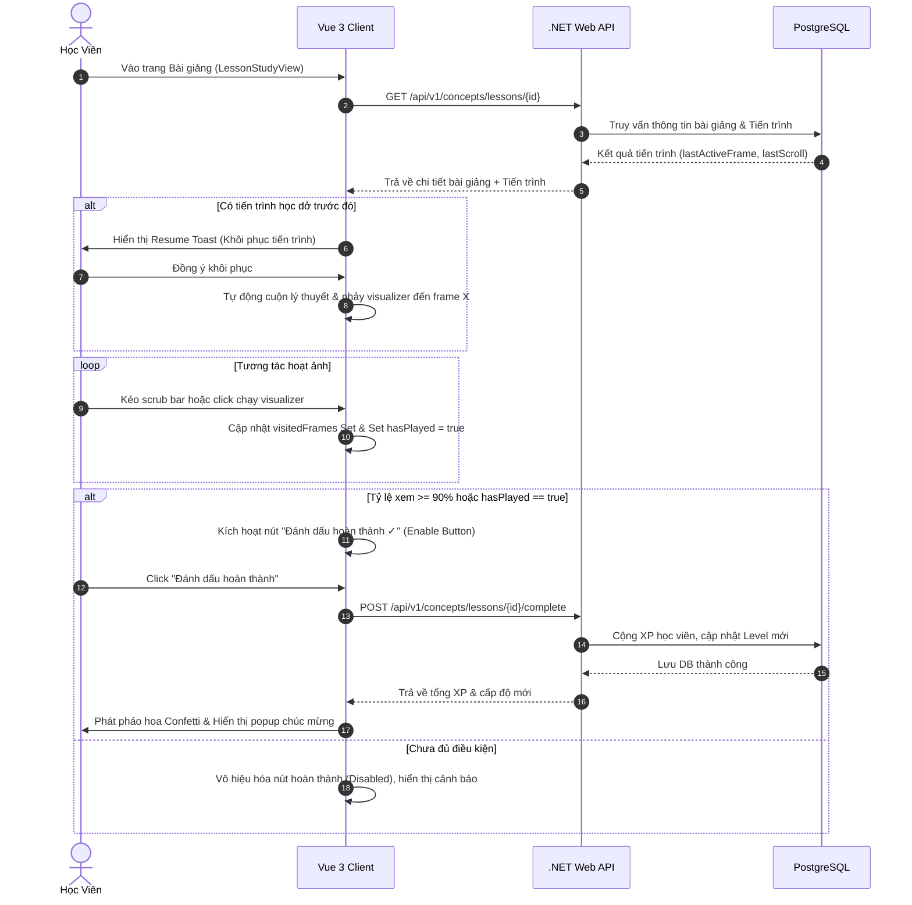
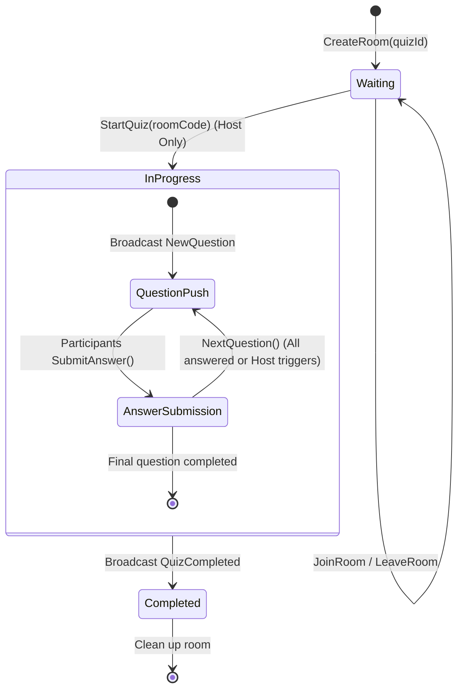
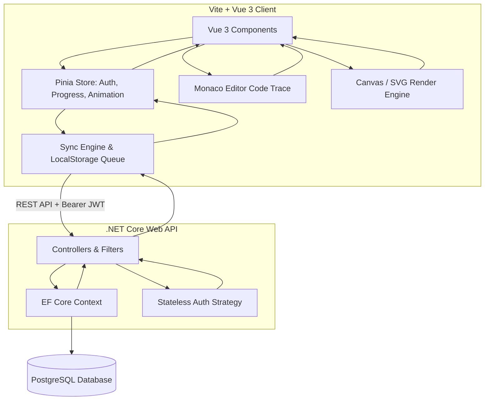

# 🌌 VisualizationDSA - Đặc Tả Nghiệp Vụ & Thiết Kế Kỹ Thuật Chi Tiết (System Specification)

Tài liệu này đặc tả chi tiết toàn bộ quy trình nghiệp vụ, quy tắc ràng buộc dữ liệu, thiết kế kiến trúc hệ thống và cách thức hiện thực kỹ thuật (Technical Implementation) của dự án **VisualizationDSA**.

---

## 🧭 1. Tổng Quan Hệ Thống & Phân Quyền (System Overview & Actor Roles)

Hệ thống được thiết kế với sự phân quyền chặt chẽ thông qua phân hệ API RESTful bảo mật bằng mã thông báo JWT.

| Vai Trò | Phạm Vi Quyền Hạn | Mô Tả Nghiệp Vụ |
|---|---|---|
| **Khách (Guest)** | Xem trang Landing Page, tham quan danh mục khóa học cơ bản. | Chưa đăng nhập hệ thống. Có thể trải nghiệm thử một số visualizer cơ bản để kích thích nhu cầu đăng ký học tập. |
| **Học Viên (Student)** | Xem bài giảng lý thuyết, tương tác với visualizer, làm bài trắc nghiệm (quiz), tích lũy XP, xem bảng xếp hạng, thăng cấp, và nâng cấp tài khoản Premium. | Học viên chính thức của nền tảng, có tài khoản cá nhân, được theo dõi toàn bộ tiến trình học tập trên Dashboard và tích lũy phần thưởng. |
| **Giảng Viên (Teacher)** | Xem danh sách và tiến độ học tập chi tiết của học viên đăng ký; quản lý CRUD khóa học, bài học và quiz do mình sở hữu; xem báo cáo phân tích hiệu suất làm quiz. | Người tạo nội dung khóa học và đánh giá học lực của học viên. Không thể chỉnh sửa hay can thiệp vào khóa học của Giảng viên khác. |
| **Quản Trị Viên (Admin)** | Toàn quyền kiểm soát hệ thống, quản lý danh sách người dùng (CRUD, Reset mật khẩu, Khóa/Mở khóa tài khoản, thay đổi quyền hạn). | Quản trị cấp cao nhất, chịu trách nhiệm vận hành hệ thống, cấp quyền Teacher hoặc giải quyết các vấn đề tài khoản. |

---

## 🛠️ 2. Đặc Tả Nghiệp Vụ & Luồng Thao Tác (Business Workflows & User Journeys)

### 2.1. Phân Hệ Học Viên (Student Experience)

#### 2.1.1. Duyệt và Chọn Khóa Học
*   **Trải nghiệm người dùng**: Học viên truy cập trang danh sách khóa học. Danh sách được lọc linh hoạt theo các nhóm chủ đề: **Sorting** (Thuật toán sắp xếp), **Graph** (Đồ thị), **OOP** (Hướng đối tượng), **SOLID** (Nguyên lý SOLID), **Design Patterns** (Mẫu thiết kế), **System Design** (Thiết kế hệ thống), và theo độ khó (**Easy**, **Medium**, **Hard**).
*   **Chi tiết giao diện**: Mỗi khóa học hiển thị dưới dạng thẻ (Card) bao gồm: Tiêu đề, Mô tả ngắn, Ảnh bìa, Tác giả (Giảng viên tạo), nhãn Premium (nếu là khóa nâng cao) và **Tiến trình hoàn thành dạng thanh (Progress Bar %)**.
*   **Luồng hoạt động**: Hệ thống truy vấn CSDL và tính số bài học đã hoàn thành của người dùng hiện tại chia cho tổng số bài học trong khóa học để sinh ra số phần trăm tiến độ cập nhật tức thời:
    $$\text{Tiến độ (\%)} = \left( \frac{\text{Số bài học đã click Hoàn thành}}{\text{Tổng số bài học trong khóa}} \right) \times 100$$

#### 2.1.2. Học Tập Tương Tác Qua Bài Giảng & Sandbox (Lesson Study Flow)
*   **Trải nghiệm người dùng**: Giao diện chia đôi màn hình thông minh (Split Screen layout):
    *   **Bên trái (Bài giảng)**: Hiển thị nội dung lý thuyết định dạng Markdown (hỗ trợ code block, bảng biểu, danh sách). Học viên có thể click vào nút "Đã hoàn thành bài học" ở cuối trang để nhận điểm XP thưởng (mặc định 20 XP) và lưu tiến độ.
        -   *Cơ chế chống gian lận (Anti-cheat Button)*: Nút "Đã hoàn thành bài học" mặc định sẽ bị vô hiệu hóa (Disabled) và có độ mờ nhẹ. Để kích hoạt nút này, hệ thống yêu cầu học viên phải có tương tác thực tế với visualizer ở khung bên phải: đã bấm nút Play để chạy hoạt họa, hoặc đã xem qua ít nhất 90% số lượng khung hình (`FrameDTO[]`) của giải thuật. Để tránh việc học viên trượt thanh Scrub Bar thật nhanh để gian lận, hệ thống áp dụng ràng buộc **thời gian hiển thị tối thiểu (dwell time) là 500ms** cho mỗi frame; chỉ khi học viên dừng lại ở một bước ít nhất 500ms thì frame đó mới được ghi nhận là "đã xem". Khi điều kiện này được đáp ứng (đối chiếu qua dữ liệu `useAnimationStore`), nút hoàn thành mới chuyển sang trạng thái sẵn sàng để click, ngăn chặn việc click hoàn thành đối phó.
    -   **Bên phải (Visualizer Sandbox)**: Trình trực quan hóa hoạt ảnh của thuật toán được liên kết tương ứng.
*   **Tương tác hai chiều Lý thuyết - Visualizer (Two-way Highlight Sync)**:
    Hệ thống tích hợp liên kết hai chiều chặt chẽ giữa phần chữ lý thuyết Markdown và giải thuật đang chạy:
    1.  *Lý thuyết sang Visualizer*: Các đoạn giải thích từng bước thuật toán trong văn bản Markdown được gắn thuộc tính neo `data-frame-index="X"`. Khi học viên rê chuột hoặc click vào dòng lý thuyết này, visualizer bên phải sẽ tự động nhảy đến đúng frame hoạt họa số X.
    2.  *Visualizer sang Lý thuyết*: Khi hoạt họa chạy tự động hoặc khi học viên kéo thanh Scrub Bar, store phát ra chỉ số frame hiện tại. Đoạn văn lý thuyết có `data-frame-index` trùng khớp sẽ tự động được tô sáng (highlight màu hổ phách nhẹ) và tự động cuộn (scroll-into-view) mượt mà vào chính giữa màn hình đọc, tạo sự liên kết học thuật trực quan cao nhất.
*   **Khôi phục tiến trình đa thiết bị (Cross-device Sync Toast)**:
    Do các giá trị `LastActiveFrameIndex` và `LastScrollPercent` được tự động đồng bộ thời gian thực về database theo UserId (chứ không lưu cục bộ ở Client), khi học viên đăng nhập hệ thống từ một thiết bị khác (ví dụ chuyển từ điện thoại sang máy tính), hệ thống sẽ đối chiếu và hiện một pop-up thông báo nhỏ ở góc màn hình: *"Hệ thống ghi nhận bạn đang học dở bài học này tại bước X (vị trí đọc Y%). Tiếp tục học từ vị trí này?"* kèm nút "Đồng ý" để người dùng khôi phục trạng thái học ngay lập tức.
*   **Trình điều khiển VCR (VCR Control Panel)**:
    -   **Play/Pause**: Chạy tự động hoặc tạm dừng hoạt ảnh.
    -   **Step Forward / Step Backward**: Di chuyển chính xác từng bước một trong luồng thực thi của thuật toán, giúp học viên hiểu rõ vị trí con trỏ biến và sự thay đổi dữ liệu (ví dụ: quá trình hoán đổi `Swap` hai phần tử trong mảng).
    -   **Speed Slider**: Thanh trượt điều chỉnh tốc độ chạy hoạt ảnh (từ 0.25x đến 3x).
    -   **Scrub Bar**: Thanh dòng thời gian (Scrub Bar) cho phép kéo thả để chuyển nhanh đến các trạng thái trước hoặc sau của hoạt ảnh.
*   **Môi trường giả lập code (Monaco Editor)**: Học viên có thể xem mã nguồn giả lập bên dưới visualizer, code chạy đến dòng nào thì dòng code tương ứng trong trình soạn thảo sẽ được highlight (sáng lên) đồng bộ.


#### 2.1.3. Hệ Thống Làm Bài Trắc Nghiệm (Interactive Quiz System)
*   **Trải nghiệm người dùng**: Cuối mỗi bài học hoặc khóa học sẽ có bài kiểm tra (Quiz) để đánh giá học viên.
*   **Các loại câu hỏi**:
    -   *Trắc nghiệm chọn một*: Chọn 1 đáp án đúng duy nhất.
    -   *Trắc nghiệm chọn nhiều*: Chọn nhiều đáp án chính xác.
        -   *Phản hồi sư phạm từng phần*: Khi học viên nộp bài câu hỏi chọn nhiều, hệ thống không chỉ báo Đúng/Sai tuyệt đối mà hiển thị thêm thông báo gợi ý sư phạm như: *"Bạn chọn đúng 2/3 đáp án chính xác"* để học viên tiếp tục tư duy tìm kiếm đáp án còn thiếu.
    -   *Điền khuyết mã nguồn (Code Fill-in-the-blank)*: Học viên điền đoạn code còn thiếu vào ô trống để hoàn thành hàm thuật toán.
        -   *Quy tắc so khớp code (Data Normalization)*: Để tránh lỗi chấm sai do các ký tự không đồng nhất, hệ thống chuẩn hóa chuỗi người dùng nhập trước khi đối chiếu ở backend: loại bỏ tất cả khoảng trắng dư thừa, chuẩn hóa dấu cách quanh các ký tự đặc biệt (như `=`, `(`, `)`, `{`, `}`, `,`), và quy đổi toàn bộ dấu nháy đơn `'` thành nháy kép `"`. Đồng thời, hệ thống sử dụng Regex (Biểu thức chính quy) để chấp nhận nhiều cú pháp viết tương đương và hiển thị tooltip hướng dẫn cụ thể quy tắc nhập code cho người học.
*   **Chấm điểm & Phản hồi tức thì**: Sau khi bấm nộp bài, hệ thống hiển thị bảng kết quả:
    -   Số câu trả lời đúng/sai.
    -   Trạng thái **Đạt (Pass)** hoặc **Không đạt (Fail)** dựa trên **Ngưỡng điểm Đạt (Pass Threshold)** được giảng viên cấu hình riêng cho từng bài quiz (mặc định là 50% số câu đúng).
    -   Giải thích chi tiết đáp án cho từng câu hỏi.
    -   Hiệu ứng **Confetti pháo hoa** ăn mừng nếu đạt điểm tối đa.
    -   *Quy tắc trao điểm XP (Anti-grinding XP)*: Học viên được phép làm lại quiz không giới hạn số lần để luyện tập, nhưng điểm XP tích lũy chỉ được trao **một lần duy nhất** cho lần làm bài đạt điểm cao nhất đầu tiên. Các lần làm tiếp theo sẽ hiển thị thông báo rõ ràng *"Học viên đã nhận XP từ bài kiểm tra này"* để ngăn chặn hành vi cày điểm XP ảo.
    -   Lưu lịch sử làm bài vào PostgreSQL (lịch sử thi bao gồm: Tên Quiz, Điểm số, Thời gian hoàn thành, Danh sách đáp án đã chọn).
*   **Lịch sử thi**: Học viên có thể xem lại toàn bộ lịch sử các lần làm quiz trên trang hồ sơ cá nhân (`ProfileView`).


#### 2.1.4. Hệ Thống Gamification (XP, Leveling & Leaderboard)
*   **Công thức tính cấp độ (Leveling Logic)**: Cấp độ được tính toán động từ tổng số XP tích lũy trong PostgreSQL:
    $$\text{Level} = 1 + \left\lfloor\sqrt{\frac{\text{TotalXP}}{100}}\right\rfloor$$
    *Điều kiện thăng cấp kép*: Bên cạnh điều kiện về điểm XP tích lũy, hệ thống áp dụng điều kiện hoàn thành khóa học tối thiểu đối với các cấp độ trung và cao (ví dụ: để lên Level 5, học viên cần đạt ít nhất 2000 XP **và** phải hoàn thành 100% nội dung của ít nhất 2 khóa học chính thức). Điều này khuyến khích học viên học sâu thay vì chỉ làm đi làm lại các bài quiz dễ kiếm XP (cày điểm).
*   **Phân khúc bảng xếp hạng (Segmented Leaderboard)**: Bảng xếp hạng hiển thị danh sách top học viên thúc đẩy thi đua học tập. Để tránh gây nản lòng cho người học mới, bảng xếp hạng được chia làm 3 bộ lọc:
    1.  **Top tuần này**: Xếp hạng dựa trên lượng XP kiếm được trong tuần hiện tại (reset vào 0:00 thứ Hai hàng tuần).
    2.  **Top theo Level**: Chỉ hiển thị các học viên trong cùng một khung cấp độ (ví dụ các học viên cùng Level 2).
    3.  **Bảng xếp hạng Bạn bè**: Thi đua trực tiếp giữa danh sách bạn bè đã kết nối.
*   **Hệ thống Huy hiệu & Chia sẻ (Badges Showcase & Share)**:
    -   *Bộ sưu tập huy hiệu*: Trang Profile cá nhân cung cấp tab "Bộ sưu tập huy hiệu" trực quan hóa dưới dạng lưới (Grid) 3D mờ kính. Mỗi huy hiệu hiển thị tiến trình đạt được (ví dụ: "Đạt 3/5 bài quiz điểm tối đa để nhận huy hiệu Sorting Wizard").
    -   *Khoe thành tựu*: Cho phép học viên click chia sẻ huy hiệu nhanh lên mạng xã hội (Facebook, LinkedIn) thông qua Web Share API tích hợp trên trình duyệt.
    -   *Định danh xã hội*: Huy hiệu nổi bật nhất do người dùng chọn sẽ hiển thị ngay bên cạnh tên và avatar của họ trong các bình luận thảo luận Q&A của bài giảng.
*   **Chuỗi ngày học & Đóng băng chuỗi (Streak & Streak Freeze)**:
    -   *Chuỗi ngày học (Streak Days)*: Theo dõi số ngày đăng nhập và học tập liên tục. Khi đạt mốc 7, 30, 100 ngày liên tiếp, màn hình Dashboard của học viên sẽ kích hoạt hiệu ứng hoạt họa Neon ăn mừng rực rỡ.
    -   *Đóng băng chuỗi (Streak Freeze)*: Để tránh trường hợp học viên bỏ học vì vô tình đứt chuỗi dài, hệ thống tích hợp "Streak Freeze". Học viên được tặng 1 lượt đóng băng miễn phí mỗi tuần hoặc có thể mua trong cửa hàng XP với giá 500 XP (giới hạn tích trữ tối đa 1 lượt đóng băng). Khi học viên quên đăng nhập vào một ngày bất kỳ, lượt đóng băng sẽ tự động kích hoạt để bảo toàn chuỗi ngày.


#### 2.1.5. Nâng Cấp Tài Khoản Premium (Premium Subscription via SePay)
*   **Trải nghiệm trước khi mua (Locked Preview)**:
    -   Các khóa học hoặc bài học Premium sẽ hiển thị biểu tượng **ổ khóa** trên các thẻ bài học.
    -   Học viên chưa mua vẫn có thể truy cập để đọc bài viết lý thuyết và **trải nghiệm thử 30 giây hoạt họa visualizer**. Sau khi hết 30 giây, trình phát hoạt họa sẽ tự động tạm dừng và một màn hình mờ (Glassmorphism Overlay) với lời mời gọi nâng cấp tài khoản Premium sẽ hiện lên, giúp tăng tỉ lệ chuyển đổi người dùng.
*   **Quy trình thanh toán thực tế (SePay + VietQR)**:
    -   Học viên bấm "Nâng cấp Premium", hệ thống gọi API `POST /api/v1/payments/order` để tạo hóa đơn mới trong CSDL với mã thanh toán độc nhất dạng `VDSAxxxxxx`.
    -   Hệ thống sinh **mã QR thanh toán VietQR thực tế** kèm nội dung chuyển khoản tự động qua cổng thanh toán **SePay** (tích hợp MBBank). Học viên sử dụng ứng dụng ngân hàng bất kỳ để quét mã QR và chuyển khoản.
    -   *Giao diện chờ thanh toán*: Màn hình thanh toán hiển thị vòng xoay tải dữ liệu (loading spinner), đồng hồ đếm ngược thời gian chờ tối đa (5 phút) và nút **"Tôi đã chuyển khoản"** để học viên có thể chủ động kích hoạt request check trạng thái ngay lập tức thay vì đợi chu kỳ polling.
    -   *Ăn mừng và Cập nhật tức thời*: Ngay khi cổng thanh toán SePay đẩy webhook xác nhận giao dịch thành công, Frontend nhận tín hiệu và hiển thị hiệu ứng **pháo hoa confetti động** rực rỡ toàn màn hình. Trạng thái người dùng được tự động cập nhật sang "Premium" trong Pinia auth store và các bài học VIP được mở khóa lập tức mà không yêu cầu người dùng phải reload (tải lại) trang web.
*   **Chăm sóc sau khi mua**:
    -   Hệ thống gửi một thông báo đẩy trong app và một **Email hóa đơn xác nhận** thông qua SendGrid/SMTP đến email của học viên.
    -   Đối với gói Premium có thời hạn (ví dụ gói 1 tháng/1 năm), trang Profile cá nhân bổ sung tab **"Quản lý gói dịch vụ"** hiển thị rõ thời hạn sử dụng còn lại, lịch sử thanh toán và tự động nhắc nhở gia hạn trước khi hết hạn 3 ngày.
*   **Idempotency & Bảo mật**: Hệ thống lưu `TransactionReference` của SePay kèm Unique Constraint ở mức DB để tránh xử lý trùng lặp webhook.
*   **Chế độ mô phỏng (Development)**: Trong môi trường phát triển, nút "Thanh toán mô phỏng" gửi HTTP POST trực tiếp tới endpoint webhook kèm Header `Authorization: Apikey` hợp lệ (chỉ active ở môi trường local debug) để giả lập webhook.


#### 2.1.6. Hệ Thống Thông Báo Thời Gian Thực (Notification Center)
*   **Trải nghiệm người dùng**: Biểu tượng chuông thông báo trên Header chính hiển thị số lượng thông báo chưa đọc. Khi nhấp vào, Dropdown danh sách thông báo hiện ra kèm thời gian tương đối ("5 phút trước", "2 giờ trước").
*   **Tự động sinh thông báo**: Khi Học viên A trả lời bình luận của Học viên B trong tab Thảo luận Q&A, hệ thống tự động tạo thông báo gửi tới Học viên B với nội dung "[Tên A] đã trả lời bình luận của bạn trong bài học [Tên bài]". Khi nhấp vào thông báo sẽ chuyển hướng đến bài học tương ứng.
*   **API**:
    -   `GET /api/v1/concepts/notifications` — Lấy danh sách thông báo của người dùng hiện tại (sắp xếp mới nhất trước).
    -   `PUT /api/v1/concepts/notifications/{id}/read` — Đánh dấu một thông báo là đã đọc.
    -   `PUT /api/v1/concepts/notifications/read-all` — Đánh dấu tất cả thông báo là đã đọc.

### 2.2. Phân Hệ Giảng Viên (Teacher Panel)

#### 2.2.1. Quản Lý Khóa Học & Bài Học (Course & Lesson CRUD)
*   **Tạo mới/Chỉnh sửa Khóa học**: Giảng viên điền form nhập: Tiêu đề, Mô tả chi tiết, Danh mục (Category), Độ khó (Difficulty), Trạng thái phát hành (IsPublished), ảnh bìa khóa học, và đánh dấu khóa học này là Premium hay miễn phí.
    -   *Bảo mật Tải ảnh bìa khóa học*: API tải ảnh lên xác thực định dạng qua chữ ký tệp tin (Magic Numbers), chỉ chấp nhận đuôi thực tế là PNG/JPG/WEBP có dung lượng `≤ 2MB` để ngăn chặn virus mã độc. Ảnh được lưu trữ bằng tên ngẫu nhiên UUID trên Cloud Storage bảo mật.
*   **Sắp xếp & Tạo bài học (Lessons)**:
    -   Giảng viên viết nội dung bài giảng bằng Markdown ngay trên trình soạn thảo WYSIWYG tích hợp sẵn.
    -   *Hỗ trợ LaTeX và Sơ đồ*: Trình hiển thị lý thuyết tích hợp **MathJax** để kết xuất các công thức toán học/độ phức tạp thời gian Big-O ($\mathcal{O}(N \log N)$), và tích hợp **Mermaid.js** cho phép giảng viên vẽ trực tiếp sơ đồ cây, sơ đồ khối thuật toán bằng cú pháp code text.
    -   Liên kết bài học với một Visualizer thích hợp bằng cách cấu hình tham số (ví dụ: `bubble-sort`, `bst`, `system-design`).
    -   Quy định số điểm XP thưởng khi học viên hoàn thành bài học này.
    -   Thay đổi thứ tự bài học (`OrderIndex`) dễ dàng.
*   **Bản tin Khóa học (Course Announcements)**: Giảng viên có thể đăng các thông báo cập nhật, tài liệu bổ sung trực tiếp trong khóa học. Thông báo sẽ tự động gửi qua SignalR đến toàn bộ học viên đã đăng ký khóa học đó.
*   **Quy tắc nghiệp vụ (Ownership Guard)**:
    -   *Chỉ chủ sở hữu (Giảng viên đã tạo khóa học đó) mới có quyền chỉnh sửa, thêm bài giảng hoặc xóa khóa học đó*. Mọi hành vi vi phạm sẽ bị từ chối bằng lỗi `403 Forbidden`.

#### 2.2.2. Ngân Hàng Câu Hỏi & Thiết Kế Quiz (Quiz CRUD)
*   **Giao diện soạn thảo Quiz**: Giảng viên có thể thiết lập tiêu đề quiz, mô tả, thời gian làm bài dự kiến, và thêm trực tiếp các câu hỏi.
*   **Nhập hàng loạt bằng Excel (Bulk Import)**:
    -   Giảng viên tải xuống **tệp tin Excel mẫu chuẩn** (`quiz_template.xlsx`) có hướng dẫn điền cột.
    -   Khi import tệp Excel, hệ thống thực hiện kiểm tra cấu trúc từng hàng và cột ở client-side; nếu phát hiện dữ liệu lỗi, hệ thống không import mà trả về danh sách **dòng lỗi cụ thể** (ví dụ: *"Dòng 14: Lựa chọn đáp án đúng không khớp với bất kỳ đáp án A/B/C/D nào"*) để giảng viên dễ dàng điều chỉnh.
*   **Quy tắc nghiệp vụ**: Mỗi câu hỏi trắc nghiệm tối thiểu phải có 2 lựa chọn đáp án và bắt buộc phải có ít nhất 1 đáp án được đánh dấu là đúng.

#### 2.2.3. Thống Kê & Báo Cáo Học Tập (Teacher Analytics Dashboard)
*   **Danh sách Học viên & Tiến độ**: Hiển thị bảng toàn bộ học viên đã đăng ký học các khóa của giảng viên đó. Khi click vào tên một học viên, mở modal chi tiết: hiển thị tỷ lệ % hoàn thành từng khóa học cụ thể và bảng điểm lịch sử làm quiz.
*   **Báo cáo Hiệu suất bài tập (Quiz Analytics)**: Cung cấp thống kê tổng quan của từng bài quiz bao gồm: Tổng số lượt làm bài, Điểm số trung bình của lớp, Tỷ lệ phần trăm học viên vượt qua (Pass Rate) và trượt.
*   **Bản đồ câu hỏi sai & Phân phối đáp án**: Liệt kê danh sách các câu hỏi có tỷ lệ học viên chọn đáp án sai cao nhất. Đồng thời hiển thị chi tiết **biểu đồ phân phối đáp án sai** (ví dụ: hiển thị rõ 60% chọn đáp án nhiễu B, 20% chọn C, 10% chọn A chính xác). Điều này giúp giảng viên nắm bắt chính xác ngộ nhận hoặc bẫy tư duy mà đa số học viên đang mắc phải để giảng giải lại.


### 2.3. Phân Hệ Quản Trị (Admin Panel)

*   **Quản lý người dùng toàn diện (User Administration)**:
    -   *Thêm tài khoản*: Admin có thể tạo nhanh tài khoản mới cho Giảng viên hoặc Học viên, mật khẩu được băm tự động bằng thư viện BCrypt bảo mật.
    -   *Chỉnh sửa*: Thay đổi Username, Email, nâng cấp trạng thái Premium hoặc thay đổi vai trò (Role) từ Student lên Teacher hoặc Admin.
    -   *Khóa tài khoản (Ban)*: Vô hiệu hóa tài khoản vi phạm chính sách của hệ thống, chặn đăng nhập API.
    -   *Xóa tài khoản*: Xóa vĩnh viễn tài khoản khỏi PostgreSQL.
    -   *Đặt lại mật khẩu (Reset Password)*: Thay đổi mật khẩu nhanh cho người dùng trực tiếp từ trang Admin.
    -   *Đóng vai người dùng (Impersonation)*: Admin có thể đăng nhập vào tài khoản của bất kỳ học viên nào để khắc phục sự cố hoặc kiểm tra trải nghiệm, với khả năng quay trở lại phiên Admin bất cứ lúc nào.
        -   *Cảnh báo trực quan (Impersonation Banner)*: Trong suốt thời gian Admin đang trong phiên đóng vai người dùng khác, hệ thống sẽ hiển thị một **thanh Banner màu đỏ nổi bật ở đầu trang** (ghim cố định) ghi rõ *"Bạn đang đóng vai tài khoản [Username] | [Thoát đóng vai]"*. Điều này ngăn ngừa hoàn toàn các thao tác nhầm lẫn. Khi click nút "Thoát đóng vai", phiên giả lập bị hủy và cookie/token Admin được phục hồi tức thì. Mọi hành động trong thời gian đóng vai được log riêng biệt vào CSDL `AuditLog`.
*   **Bảng điều khiển thống kê nâng cao (Admin Analytics Dashboard)**:
    -   *Tổng quan hệ thống*: Hiển thị thẻ thống kê tổng số người dùng (phân tách Student/Teacher/Admin), số thành viên Premium, tổng Quiz, tỷ lệ chuyển đổi đơn hàng.
        -   *Bộ lọc thời gian (Time Range Filters)*: Tích hợp bộ lọc dropdown cho phép Admin chuyển đổi xem dữ liệu thống kê theo: *Hôm nay, 7 ngày qua, 30 ngày qua, hoặc Khoảng ngày tùy chọn*.
    -   *Biểu đồ cột SVG — Lượng đăng ký mới*: Trực quan hóa lịch sử đăng ký hàng ngày theo bộ lọc thời gian bằng biểu đồ cột SVG tự vẽ siêu nhẹ (không phụ thuộc thư viện ngoài), có hiệu ứng hover và nhãn số lượng.
    -   *Bảng xếp hạng khóa học phổ biến*: Hiển thị top khóa học có lượt tương tác cao nhất kèm CSS Progress Bar động tính theo tỷ lệ phần trăm so với khóa học đứng đầu.
    -   *Bảng xếp hạng Top 5 học viên tích cực nhất (XP)*.
    -   *Nhật ký hoạt động hệ thống* hiển thị theo dạng console log phân loại màu.


### 2.4. Trình Phát Nhúng Hoạt Ảnh (Embed Player)

*   **Tính năng nhúng (Iframe Embedding)**: Giảng viên hoặc Blogger công nghệ có thể nhúng trực tiếp trình phát visualizer thuật toán của VisualizationDSA vào trang web bất kỳ bằng thẻ `<iframe>` qua route `/embed?algo=...`.
*   **Chế độ tối giản (Minimal Mode)**:
    -   Khi phát hiện có query parameter `algo` trên đường dẫn `/embed`, ứng dụng kích hoạt chế độ nhúng.
    -   Toàn bộ layout bao gồm Header, Footer, Sidebar, các phần chữ lý thuyết rườm rà được ẩn hoàn toàn bằng CSS. Canvas hoạt ảnh tự động giãn rộng bao phủ toàn bộ kích thước iframe (100vw, 100vh).
*   **Bảo vệ Premium (Embed Premium Guard)**: Các thuật toán cao cấp (như `system-design` hoặc `dijkstra`) được bảo vệ bằng lớp lọc quyền hạn. Nếu iframe nhúng được tải mà không có phiên đăng nhập Premium hợp lệ, hệ thống sẽ hiển thị Premium Overlay Card yêu cầu đăng nhập và chặn kết xuất Visualizer.


### 2.5. Luồng Nghiệp Vụ và Quy Trình Hoạt Động Chi Tiết Của Các Tính Năng Cốt Lõi (Core Workflows)

Dưới đây mô tả chi tiết quy tắc nghiệp vụ, điều kiện biên, luồng dữ liệu và trạng thái chuyển đổi của các tính năng mới bổ sung:

#### 1. Quy trình Học tập Tương tác & Chống gian lận (Lesson Interaction & Anti-Cheat Flow)
*   **Mục tiêu**: Ngăn chặn học viên nhấn nút "Đánh dấu hoàn thành" mà không thực sự đọc lý thuyết hoặc xem hoạt họa thuật toán.
*   **Luồng hoạt động & Điều kiện biên**:
    1. Khi tải chi tiết bài học (`loadLessonDetail`), client gửi yêu cầu lên API backend để lấy thông tin bài học và trạng thái tiến trình học tập của người dùng.
    2. Nếu backend phản hồi có tiến trình học dở (`lastActiveFrameIndex > 0` hoặc `lastScrollPercent > 0`), client hiển thị một **Resume Toast** góc màn hình để hỏi ý kiến học viên.
    3. Học viên chọn:
        *   **Đồng ý**: Phục hồi vị trí cuộn màn hình lý thuyết và đồng bộ visualizer đến đúng frame dừng chân trước đó.
        *   **Bỏ qua**: Bắt đầu bài học từ đầu.
    4. Trong quá trình học, hệ thống theo dõi:
        *   **visitedFrames**: Một tập hợp `Set<number>` lưu trữ các index của frame hoạt họa mà học viên đã đi qua.
        *   **hasPlayed**: Cờ boolean đánh dấu nếu học viên đã bấm nút chạy tự động hoạt họa (`isPlaying` chuyển sang `true`).
    5. **Điều kiện kích hoạt hoàn thành**:
        *   Nếu bài giảng không liên kết visualizer sandbox hoặc tổng số frame hoạt họa $\le 1$: Điều kiện chống gian lận được bỏ qua (bypass).
        *   Nếu có hoạt họa thuật toán: Nút hoàn thành chỉ mở khóa khi và chỉ khi:
            $$\text{Tỷ lệ xem} = \left( \frac{\text{visitedFrames.size}}{\text{totalSteps}} \right) \times 100 \ge 90\% \quad \text{HOẶC} \quad \text{hasPlayed} = \text{true}$$
        *   Khi chưa đạt điều kiện, hiển thị thông báo cảnh báo màu cam kèm phần trăm đã xem thực tế.
    6. Khi thỏa mãn điều kiện và học viên bấm "Hoàn thành ✓", client gửi yêu cầu `POST` tới `/api/v1/concepts/lessons/{id}/complete`. Backend cộng điểm XP, cập nhật cấp độ trong database và trả về XP mới. Client phát pháo hoa Confetti và hiện popup thành công.



#### 2. Quy trình Tương tác Hai chiều Lý thuyết - Hoạt ảnh (Two-Way Sync Flow)
*   **Mục tiêu**: Đồng bộ trực quan tối đa giúp học viên đối chiếu dòng lý thuyết đang đọc với hình ảnh trực quan đang diễn ra.
*   **Luồng hoạt động**:
    1.  **Lý thuyết ➔ Hoạt ảnh (Click & Hover)**:
        *   Trong bài giảng Markdown, giảng viên sử dụng cú pháp `[Chú thích](frame:X)` hoặc chèn thẻ có thuộc tính `data-frame-index="X"`.
        *   Client biên dịch Markdown này thành mã HTML với thẻ `span` có class `.theory-step` và `data-frame-index="X"`.
        *   Khi học viên click vào neo này, hoặc hover chuột lên neo (sau 150ms debounce để lọc nhiễu di chuyển chuột), client gọi phương thức `goToFrame(X)` của `useAnimationStore` để đồng bộ visualizer bên phải.
    2.  **Hoạt ảnh ➔ Lý thuyết (Auto-scroll & Highlight)**:
        *   Khi giải thuật chạy tự động hoặc khi học viên kéo Scrub Bar, `useAnimationStore.currentIndex` thay đổi.
        *   Client lắng nghe (watch) thay đổi chỉ số frame này.
        *   Client tìm phần tử HTML có `data-frame-index` khớp với chỉ số mới trong container lý thuyết.
        *   If tìm thấy: Reset toàn bộ highlight cũ ➔ Áp dụng class CSS nổi bật `.bg-amber-500/20 .text-amber-300` cho phần tử mới ➔ Gọi `scrollIntoView({ behavior: 'smooth', block: 'center' })` để cuộn mượt mà đưa dòng lý thuyết này vào tiêu điểm đọc của màn hình.

#### 3. Quy trình Đồng bộ Tiến trình Học tập (Autosave & Restoration Flow)
*   **Mục tiêu**: Lưu vết tiến trình đọc lý thuyết và vị trí hoạt ảnh tự động để đồng bộ trên mọi thiết bị.
*   **Luồng hoạt động**:
    1.  **Lưu vết tự động (Autosave)**:
        *   Khi học viên cuộn lý thuyết, listener tính toán tỷ lệ cuộn:
            $$\text{scrollPercent} = \left( \frac{\text{scrollTop}}{\text{scrollHeight} - \text{clientHeight}} \right) \times 100$$
        *   Khi học viên thay đổi index hoạt ảnh, hệ thống gọi hàm `saveProgressDebounced(frameIndex, scrollPercent)`.
        *   Hàm sử dụng **Debounce 5 giây** để giảm tần suất gửi HTTP request dồn dập về server, tránh quá tải database. Trạng thái tiến độ cũng đồng thời ghi vào `sessionStorage` để lưu vết tức thời.
    2.  **Lưu vết khi tắt trình duyệt (Page Unload Recovery)**:
        *   Khi học viên tắt tab, F5 hoặc điều hướng thoát nhanh khỏi trang, listener bắt sự kiện `beforeunload`.
        *   Client đọc trạng thái tiến độ mới nhất từ `sessionStorage` và gửi một request `POST` lưu tiến độ tức thời về API. Request này bắt buộc cấu hình tham số `{ keepalive: true }` để đảm bảo trình duyệt vẫn gửi thành công gói tin ngay cả khi tab đã bị hủy.

#### 4. Quy trình Tải động MathJax & Mermaid (Dynamic Script Loading Flow)
*   **Mục tiêu**: Tối ưu tốc độ tải trang ban đầu (chỉ tải thư viện toán và vẽ sơ đồ khi học viên vào bài học lý thuyết).
*   **Luồng hoạt động**:
    1. Khi Component `LessonStudyView` được mount (`onMounted`), client kiểm tra sự tồn tại của đối tượng global `window.MathJax` và `window.mermaid`.
    2. Nếu chưa có, client dynamically tạo và chèn các thẻ `<script>` trỏ đến các CDN công cộng uy tín để nạp thư viện:
        *   **MathJax 3** (tex-svg.js) để kết xuất công thức LaTeX.
        *   **Mermaid.js 10** để kết xuất biểu đồ khối thuật toán.
    3. Khi Markdown bài học được tải và biên dịch:
        *   Các khối toán học `$formula$` hoặc các khối mã ```mermaid được chuyển đổi thành các thẻ HTML tương ứng.
        *   Client bắt watcher của nội dung hiển thị lý thuyết (`renderedContent`) để gọi lệnh biên dịch lại trong `nextTick`:
            *   `window.MathJax.typesetPromise()` để dịch công thức toán học.
            *   `window.mermaid.run()` để dựng các sơ đồ khối trực quan.

#### 5. Quy trình Phòng thi trắc nghiệm Multiplayer thời gian thực (Multiplayer Quiz Room Flow via SignalR)
*   **Mục tiêu**: Hỗ trợ học viên tham gia các phòng thi đấu trắc nghiệm kiến thức DSA/OOP thời gian thực cùng bạn bè, tạo tính tương tác xã hội.
*   **Luồng hoạt động**:



*   **Các bước chi tiết**:
    1.  **Kết nối & Xác thực**:
        *   Học viên truy cập phân hệ thi đấu, client khởi tạo kết nối SignalR (`HubConnectionBuilder`) đến `/hubs/quiz-room`.
        *   Do phòng thi yêu cầu xác thực, Access Token (JWT) được đính kèm vào tham số query string (`?access_token=...`). Backend kiểm tra và map claim định danh học viên.
    2.  **Khởi tạo phòng (Create Room)**:
        *   Chủ phòng (Host) chọn một bộ quiz đề thi và gửi lệnh `CreateRoom(quizId)`.
        *   Backend sinh ngẫu nhiên mã phòng gồm 6 chữ cái (`roomCode`), lưu trạng thái phòng vào một `ConcurrentDictionary` ở RAM server, đưa Host vào phòng, và phản hồi sự kiện `RoomCreated` kèm chi tiết phòng thi.
    3.  **Tham gia phòng (Join Room)**:
        *   Các học viên khác nhập `roomCode` và gửi lệnh `JoinRoom(roomCode)`.
        *   Backend kiểm tra: nếu mã phòng tồn tại và trạng thái đang là `Waiting`, backend sẽ thêm học viên vào danh sách thành viên phòng thi, đưa kết nối của học viên vào Group SignalR của phòng đó, đồng thời phát sự kiện `ParticipantJoined` đến toàn bộ người trong phòng và phát danh sách phòng trống về cho toàn bộ client ở sảnh chờ (`ActiveRooms`).
    4.  **Bắt đầu thi (Start Quiz)**:
        *   Host nhấn bắt đầu, gửi lệnh `StartQuiz(roomCode)`.
        *   Trạng thái phòng chuyển sang `InProgress`. Backend phát sự kiện `QuizStarted` và bắt đầu phát câu hỏi đầu tiên `NewQuestion` đến toàn Group phòng thi bao gồm: nội dung câu hỏi, danh sách đáp án lựa chọn và thời gian đếm ngược (mặc định 30 giây).
    5.  **Tương tác làm bài (Submit Answers)**:
        *   Mỗi học viên bấm chọn đáp án và gửi lệnh `SubmitAnswer(roomCode, questionIndex, answerIndex)`.
        *   Backend kiểm tra tính đúng đắn của câu trả lời, tính điểm thưởng tương ứng và cập nhật cờ `HasAnswered` của học viên đó. Backend đẩy phản hồi kết quả câu hỏi `AnswerResult` (gồm đáp án đúng, giải thích sư phạm chi tiết) và bảng cập nhật điểm số `ScoreUpdate` cho cả phòng thi đấu cùng xem.
    6.  **Chuyển câu hỏi & Hoàn thành**:
        *   Khi toàn bộ thành viên nộp bài hoặc khi hết thời gian, Host có thể kích hoạt chuyển câu hỏi tiếp theo (`NextQuestion`).
        *   Khi hoàn thành câu hỏi cuối cùng, trạng thái phòng chuyển sang `Completed`. Backend thực hiện tính toán thứ hạng chung cuộc, gửi bảng tổng sắp cuối cùng `QuizCompleted`, và cộng điểm XP thưởng trực tiếp vào database cho các học viên đạt thứ hạng cao. Phòng thi sau đó được giải phóng khỏi bộ nhớ RAM server.

---

## 💻 3. Thiết Kế Kiến Trúc & Hiện Thực Kỹ Thuật (Technical Architecture & Implementation)

Nền tảng được xây dựng trên mô hình phân tách rõ ràng giữa **Backend (Brain & Persistence)** và **Frontend (Canvas Player & Client State)**.

### 3.1. Sơ Đồ Kiến Trúc Hệ Thống (System Architecture)



### 3.2. Thiết Kế Database & Mối Quan Hệ Thực Thể (EF Core)
CSDL PostgreSQL lưu trữ đồng bộ trạng thái học tập và thông tin nội dung thông qua lược đồ quan hệ:
*   **User**: Lưu thông tin định danh, hash mật khẩu, tổng XP (có đánh index `IX_Users_TotalXp` phục vụ truy vấn), cấp độ hiện tại, vai trò (Role), và trạng thái Premium.
*   **Course**: Lưu thông tin khóa học. Quan hệ $1-N$ với **Lesson**. Chứa trường `TeacherId` để thực thi quyền sở hữu.
*   **Enrollment**: Bảng ghi nhận học viên đăng ký khóa học. Nhằm tối ưu hóa hiệu năng tính `% tiến độ` học tập real-time, bảng được bổ sung cột **CompletedLessonCount (Counter Cache)**. Giá trị này tự động cộng dồn/giảm trừ thông qua database trigger hoặc transaction block khi bản ghi `UserLessonProgress` chuyển sang trạng thái `Completed`, loại bỏ thao tác `JOIN` nặng nề khi kết xuất danh sách khóa học.
*   **Lesson**: Lưu nội dung Markdown bài học, loại sandbox liên kết (`SandboxType`), cấu hình json (`SandboxConfig`), và điểm thưởng XP. Liên kết khóa ngoại với **Quiz** (nếu bài học có bài kiểm tra đính kèm).
*   **UserLessonProgress**: Lưu vết tiến trình học tập của học viên đối với từng bài học (Trạng thái: "NotStarted", "InProgress", "Completed"). Thêm trường `LastActiveFrameIndex` (lưu index frame visualizer dừng dở) và `LastScrollPercent` (lưu vị trí cuộn trang lý thuyết) để khôi phục chính xác trạng thái học dở.
*   **LessonComment**: Lưu vết bình luận thảo luận Q&A của học viên/giảng viên tại từng bài học cụ thể, hỗ trợ lồng ghép phân cấp cây (ParentId / Replies). API hỗ trợ tham số `search` để lọc tìm kiếm bình luận theo từ khóa.
*   **Notification**: Lưu trữ thông báo hệ thống gửi tới người dùng, bao gồm nội dung (`Content`), đường dẫn liên kết (`LinkUrl`), trạng thái đã đọc (`IsRead`), và thời gian tạo. Được sắp xếp theo index `IX_Notifications_UserId_CreatedAt` để tối ưu truy vấn theo người dùng.
*   **Order**: Lưu trữ hóa đơn thanh toán Premium, bao gồm mã thanh toán duy nhất (`PaymentCode` dạng `VDSAxxxxxx`), số tiền (`Amount`), trạng thái (`Status`: Pending/Completed/Cancelled), tham chiếu giao dịch SePay (`TransactionReference`). Cột `TransactionReference` được thiết lập **Unique Constraint** bắt buộc để chặn hoàn toàn lỗi race condition hoặc xử lý webhook trùng lặp.
*   **AuditLog**: Nhật ký lưu trữ các tác vụ thay đổi hệ thống nhạy cảm của Admin. Phân hệ tự động ghi nhận riêng biệt các sự kiện: **Bắt đầu đóng vai (Impersonation Start)** và **Kết thúc đóng vai (Impersonation End)** kèm theo thông tin chi tiết của quản trị viên thực thi (Admin ID) và tài khoản bị đóng vai (Target User ID) để đảm bảo tính minh bạch tối đa.
*   **Quiz** & **Question**: Chứa đề thi và các câu hỏi (bao gồm đáp án nhiễu, đáp án đúng và giải thích).
*   **UserQuizHistory**: Lưu trữ điểm số và danh sách đáp án học viên đã nộp để kết xuất báo cáo hiệu suất cho Giảng viên.

#### ⚡ Chiến lược Caching & Tối ưu hóa hiệu năng Database
1.  **Redis Cache cho Tiến trình học viên**: Tiến độ phần trăm hoàn thành của từng `User` đối với `Course` được lưu tạm thời trên Redis với TTL 10 phút. Hệ thống chỉ cập nhật lại bộ nhớ đệm này khi có sự kiện thay đổi trạng thái bài học.
2.  **Redis Sorted Set cho Bảng xếp hạng (Leaderboard)**: Toàn bộ thứ hạng học viên theo XP được quản lý qua cấu trúc Redis Sorted Set (sử dụng lệnh `ZADD` để cập nhật XP và `ZREVRANGE` để lấy top học viên). Điều này giúp thao tác kết xuất bảng xếp hạng đạt tốc độ $O(\log N)$ bất kể số lượng người dùng lớn, thay vì chạy câu lệnh `ORDER BY TotalXp DESC` đắt đỏ trên PostgreSQL.
3.  **Bảng tổng hợp định kỳ cho Analytics (Cron-based Summary Tables)**: Các báo cáo lớn của Giảng viên (Quiz Analytics, bản đồ câu hỏi sai) và Admin Dashboard được xử lý tổng hợp định kỳ (mỗi đêm lúc 2:00 AM qua một Background Worker/Cron Job) và ghi vào các bảng kết quả tĩnh (`QuizSummaryAnalytics`, `DailyRegistrationSummary`), thay vì tính toán ad-hoc thời gian thực trên hàng triệu bản ghi lịch sử làm quiz.


### 3.3. Bộ Lọc Phân Quyền Tập Trung (Centralized Role Authorization)
Thay vì kiểm tra token thủ công trong từng hàm API, hệ thống sử dụng custom action filter `RequireJwtRoleAttribute`:
```csharp
[AttributeUsage(AttributeTargets.Class | AttributeTargets.Method, AllowMultiple = false)]
public class RequireJwtRoleAttribute : ActionFilterAttribute
{
    private readonly string[] _allowedRoles;
    
    public RequireJwtRoleAttribute(string? roles = null)
    {
        _allowedRoles = string.IsNullOrWhiteSpace(roles)
            ? Array.Empty<string>()
            : roles.Split(',', StringSplitOptions.RemoveEmptyEntries | StringSplitOptions.TrimEntries);
    }

    public override void OnActionExecuting(ActionExecutingContext context)
    {
        // 1. Giải mã và xác thực chữ ký token JWT từ Header Authorization
        var tokenResult = JwtHelper.RequireToken(context.HttpContext.Request);
        if (tokenResult != null)
        {
            context.Result = tokenResult; // Trả về 401 Unauthorized nếu token lỗi/hết hạn
            return;
        }

        // 2. Kiểm tra tài khoản bị khóa/thu hồi quyền lực ngay lập tức (Token Revocation Check)
        // Action filter chuyển sang cơ chế không đồng bộ (OnActionExecutionAsync) để truy vấn CSDL
        // và kiểm tra trường IsActive của User. Nếu IsActive == false, hệ thống trả về 403 Forbidden ngay tức khắc
        // để thu hồi quyền truy cập dù token JWT vẫn chưa hết hạn.

        // 3. Kiểm tra vai trò của người dùng
        if (_allowedRoles.Length > 0)
        {
            var userRole = JwtHelper.ExtractRoleFromToken(context.HttpContext.Request);
            if (userRole == null || !_allowedRoles.Contains(userRole, StringComparer.OrdinalIgnoreCase))
            {
                context.Result = new ObjectResult(new { error = "FORBIDDEN", message = "Không đủ quyền truy cập." }) { StatusCode = 403 };
                return;
            }
        }
        base.OnActionExecuting(context);
    }
}
```

#### 🔑 Cơ chế Cặp Access/Refresh Token & Xoay Vòng (Token Rotation)
Để mang lại trải nghiệm liền mạch cho học viên mà vẫn bảo đảm an toàn bảo mật, hệ thống triển khai cơ chế xác thực Token dạng cặp:
1.  **Access Token (JWT)**: Có thời hạn sống ngắn (15 phút), được đính kèm vào header `Authorization: Bearer <token>` ở mỗi request.
2.  **Refresh Token**: Có thời hạn sống dài (7 ngày), được lưu trữ an toàn trong secure storage hoặc Cookie thuộc tính `HttpOnly` và `Secure` (phía client).
3.  **Xoay vòng Refresh Token (Refresh Token Rotation)**: Khi Access Token hết hạn, client gửi Refresh Token cũ lên route `/api/v1/auth/refresh`. Backend kiểm tra tính hợp lệ của Refresh Token trong Database. Nếu hợp lệ, hệ thống sẽ:
    *   Hủy bỏ (Revoke) ngay lập tức Refresh Token cũ đó.
    *   Tự động sinh ra một **Access Token mới** và một **Refresh Token mới** trả về cho client.
    Cơ chế này ngăn chặn tuyệt đối cuộc tấn công phát lại (Replay attack) khi Refresh Token cũ bị đánh cắp và tái sử dụng, giúp giảm thiểu rủi ro rò rỉ phiên làm việc.

### 3.4. Cơ Chế Bảo Vệ Quyền Sở Hữu Khóa Học (Course Ownership Guard)
Trong `CourseController.cs`, cơ chế kiểm soát truy cập dựa trên thuộc tính được triển khai chặt chẽ bằng cách so khớp ID định danh người dùng (`sub` claim) với `TeacherId` của khóa học:
```csharp
private bool IsOwnerOrAdmin(Course course, Guid currentUserId)
{
    // Admin có quyền bypass toàn bộ hệ thống
    if (JwtHelper.IsAdmin(Request)) return true;
    return course.TeacherId == currentUserId;
}

[HttpPut("courses/{id}")]
[RequireJwtRole("Teacher,Admin")]
public async Task<IActionResult> UpdateCourse(Guid id, [FromBody] CreateCourseDto dto)
{
    var userIdStr = JwtHelper.ExtractSubFromToken(Request);
    if (userIdStr == null || !Guid.TryParse(userIdStr, out var currentUserId))
        return Unauthorized();

    var course = await _dbContext.Courses.FindAsync(id);
    if (course == null) return NotFound();

    // Thực thi chặn cập nhật trái phép
    if (!IsOwnerOrAdmin(course, currentUserId))
    {
        return StatusCode(403, new { error = "FORBIDDEN", message = "Bạn không có quyền chỉnh sửa khóa học này. Chỉ chủ sở hữu hoặc Admin mới được phép." });
    }

    course.Update(dto.Title, dto.Description, dto.Category, dto.Difficulty, dto.IsPremium, dto.CoverImageUrl, dto.IsPublished);
    await _dbContext.SaveChangesAsync();
    return Ok(new { message = "Cập nhật khóa học thành công!", course });
}
```
*Tương tự, các API xóa khóa học (`DeleteCourse`), tạo bài học (`CreateLesson`), chỉnh sửa/xóa bài học (`UpdateLesson`/`DeleteLesson`) đều truy vấn thực thể cha và gọi hàm `IsOwnerOrAdmin()` để loại bỏ hoàn toàn lỗ hổng leo thang đặc quyền ngang.*

### 3.5. Trình Phát Hoạt Họa Trực Quan Hóa (VCR Playback Engine)
Trực quan hóa được quản lý tập trung thông qua Pinia Store `useAnimationStore.ts` nhằm tối ưu bộ nhớ RAM và duy trì trạng thái mượt mà:
*   **Sử dụng shallowRef**: Mảng các cấu trúc khung hình hoạt họa (`FrameDTO[]`) được lưu trữ bằng `shallowRef` thay vì `ref` thông thường trong Vue. Điều này ngăn chặn Vue theo dõi đệ quy sâu (deep reactivity) từng thuộc tính nhỏ trong hàng ngàn frame hoạt ảnh của thuật toán lớn, giải phóng tài nguyên CPU đáng kể.
*   **VCR Loop & Step Controls**:
    -   Hàm `play()` kích hoạt đệ quy có kiểm soát thông qua hàm `tick()`.
    -   Thời gian delay giữa mỗi frame được tính toán động dựa trên tốc độ phát: `currentDelay = baseDelay / playbackSpeed`.
    -   Các nút `stepForward()` và `stepBackward()` dịch chuyển chỉ số `currentIndex` trực tiếp, tạm dừng tiến trình tự động phát và cập nhật ngay lập tức khung hình hiện tại lên giao diện.
*   **Truyền tải và tải từng phần hoạt ảnh (Lazy Loading & Frame Streaming)**:
    Đối với các giải thuật đồ thị lớn hoặc mảng dữ liệu khổng lồ sinh ra hàng chục ngàn frame hoạt ảnh, việc trả về toàn bộ mảng `FrameDTO[]` trong một payload JSON duy nhất sẽ gây tắc nghẽn mạng và tràn RAM trình duyệt. Hệ thống triển khai giải pháp:
    -   *Lazy Loading*: Frontend tải trước 200 frame đầu tiên để người dùng xem ngay lập tức.
    -   *Frame Streaming*: Khi người phát kéo thanh trượt Scrub Bar hoặc phát gần hết mảng hiện tại, store sẽ tự động gọi API `GET /api/v1/algorithms/frames?executionId=...&offset=...&limit=...` để tải gối đầu (buffer) các frame tiếp theo theo lô (batch size 100), giải phóng đáng kể bộ nhớ cho client.


### 3.6. Trực Quan Hóa Mảng & Hoạt Ảnh (CSS Morphing Engine)
Trong các visualizer mảng (như `BubbleSortVisualizer.vue`), hoạt ảnh hoán đổi (Swap) hoặc so sánh được tăng tốc phần cứng bằng GPU:
*   **Vue `<transition-group>`**: Phần tử mảng được render kèm theo khóa `:key="item.id"` duy nhất, không thay đổi theo chỉ số mảng.
*   **GPU-accelerated Layout Transitions**: Lớp CSS `.sort-list-move` được gán thuộc tính `transition: transform 0.4s cubic-bezier(0.25, 0.8, 0.25, 1)`. Khi thứ tự các phần tử trong mảng thay đổi, Vue tự động áp dụng kỹ thuật FLIP (First, Last, Inverse, Play) để tính toán ma trận dịch chuyển và kích hoạt chuyển động dịch chuyển mượt mà thông qua CSS `transform: translate()` thay vì vẽ lại (reflow) layout DOM.
*   **Phân lớp trạng thái bằng class CSS**:
    -   *So sánh*: Thêm viền màu hổ phách, hiệu ứng phóng to nhẹ `scale-[1.03]`.
    -   *Hoán đổi*: Viền hồng, hiệu ứng `scale-[1.04]` kèm nhịp đập `animate-pulse`.
    -   *Đã sắp xếp*: Viền ngọc lục bảo bền vững.

### 3.7. Engine Vật Lý Đồ Thị Lực Đẩy (Force-Directed Graph Physics Engine)
Sân chơi đồ thị sử dụng engine vật lý tự viết `ForceDirectedEngine.ts` để tự động sắp xếp các đỉnh (nodes) trên Canvas:
*   **Lực đẩy Coulomb (Repulsion Force)**: Đẩy tất cả các đỉnh ra xa nhau để tránh đè lên nhau, tỷ lệ nghịch với bình phương khoảng cách giữa hai đỉnh:
    $$F_{\text{repulsion}} = \frac{C_{\text{repulsion}}}{d^2}$$
*   **Lực kéo Hooke (Spring Attraction Force)**: Co kéo các đỉnh có kết nối cạnh (edge) lại gần nhau như một chiếc lò xo đàn hồi:
    $$F_{\text{attraction}} = K_{\text{spring}} \times (d - L_{\text{desired}})$$
    *Trong đó: $d$ là khoảng cách thực tế giữa hai node, $L_{\text{desired}}$ là độ dài lò xo mong muốn (mặc định 150px).*
*   **Cập nhật Vị trí & Damping**:
    -   Mỗi tick của vòng lặp hoạt họa (`requestAnimationFrame`), vận tốc của đỉnh được nhân với hệ số suy giảm ma sát `damping = 0.85` để triệt tiêu dao động dư thừa, đưa đồ thị về trạng thái cân bằng ổn định.
    -   Áp dụng ràng buộc biên (Boundary Constraint) để giữ các đỉnh không trượt ra ngoài kích thước khung Canvas:
        $$x = \max(\text{radius}, \min(\text{width} - \text{radius}, x + v_x))$$
*   **Tối ưu hóa đồ thị lớn bằng thuật toán Barnes-Hut và Web Worker**:
    Khi số lượng đỉnh trên đồ thị vượt quá 50, việc tính toán lực đẩy giữa từng cặp đỉnh riêng lẻ theo công thức Coulomb thông thường sẽ tăng độ phức tạp thuật toán lên $O(N^2)$, gây sụt giảm khung hình nghiêm trọng. Để giải quyết:
    1.  **Mô phỏng Barnes-Hut**: Hệ thống xây dựng một Quadtree (Cây tứ phân) phân vùng không gian. Các đỉnh ở khoảng cách đủ xa sẽ được gộp nhóm lại thành một thực thể đại diện có khối lượng tương đương trọng tâm cụm đỉnh đó. Giải pháp này giúp giảm thiểu độ phức tạp tính toán xuống mức $O(N \log N)$.
    2.  **Luồng Worker nền (Web Worker)**: Toàn bộ quá trình tính toán lực tương tác vật lý và tọa độ mới của các node được đóng gói để chạy độc lập bên trong một Web Worker riêng biệt. Worker gửi mảng tọa độ đỉnh đã tính toán xong về luồng chính (Main Thread) chỉ để render, giúp giao diện người dùng luôn phản hồi lập tức và loại bỏ tình trạng đơ/lag trình duyệt.


### 3.8. Nhập Quiz Hàng Loạt từ Client (Excel Bulk Parsing)
*   Hệ thống tích hợp thư viện `xlsx` ở client để xử lý tệp Excel mà không cần gửi tệp lên server để phân tích cú pháp, giảm tải tài nguyên backend.
*   Frontend đọc tệp Excel dưới dạng `ArrayBuffer`, chuyển đổi sheet dữ liệu thành mảng JSON, kiểm tra tính hợp lệ của cấu trúc cột (câu hỏi, đáp án A, B, C, D, đáp án đúng, lời giải thích) trước khi gửi danh sách câu hỏi đã được làm sạch qua API.

### 3.9. Hàng Đợi Đồng Bộ XP Ngoại Tuyến (Offline Progress Sync Engine)
Được triển khai trong `useUserProgressStore.ts` nhằm mục tiêu bảo vệ điểm số và tiến trình học tập của học viên:
*   **Sử dụng IndexedDB (localforage)**: Thay vì lưu trữ hàng đợi đồng bộ trong `LocalStorage` (vốn bị giới hạn dung lượng 5–10MB và hoạt động theo cơ chế đồng bộ đồng bộ - blocking I/O gây lag UI), hệ thống sử dụng **IndexedDB** thông qua thư viện wrapper `localforage`. IndexedDB hỗ trợ không gian lưu trữ không giới hạn (lên tới 50% dung lượng đĩa trống) và các tác vụ I/O hoàn toàn bất đồng bộ (Async/Await), đảm bảo an toàn dữ liệu học tập nhạy cảm.
*   **Gom lô gửi đồng loạt (Batch Synchronization)**: Khi hàng đợi tích lũy lớn hơn 50 phần tử (ví dụ sau một thời gian dài mất mạng), thay vì gửi hàng chục HTTP request `POST` riêng lẻ làm nghẽn băng thông và quá tải IIS/Kestrel, hệ thống tự động gộp tất cả các bản ghi tiến trình vào một payload duy nhất và gửi qua API gom lô: `POST /api/v1/users/progress/bulk-sync`.
*   **Đồng bộ khi có mạng (Auto-flush)**: Khi store khởi tạo, đăng ký lắng nghe sự kiện:
    ```ts
    window.addEventListener('online', () => _flushPendingQueue(token));
    ```
*   **Retry Exponential Backoff kèm Jitter ngẫu nhiên**:
    Để tránh hiện tượng nhiều thiết bị đồng loạt "tấn công" server ngay khi mạng phục hồi (hiệu ứng Thundering Herd), hệ thống áp dụng thuật toán tăng thời gian chờ luỹ tiến kết hợp độ lệch ngẫu nhiên (Jitter). Thời gian chờ được tính bằng công thức:
    $$T_{\text{wait}} = (1000 \text{ms} \times 2^{\text{attempt} - 1}) + \text{random}(0, 1000) \text{ ms}$$
    ```ts
    for (let attempt = 1; attempt <= 5; attempt++) {
      try {
        await syncXPToServer(token, payload);
        success = true;
        break; // Thành công -> thoát vòng lặp retry
      } catch (error) {
        if (error instanceof ApiError && error.status >= 400 && error.status < 500) {
          // Lỗi nghiệp vụ (ví dụ token hết hạn) -> không retry, bỏ qua và phục hồi
          success = true; 
          break;
        }
        // Lỗi mạng -> Chờ tăng dần theo cấp số nhân kèm jitter ngẫu nhiên từ 0-1000ms
        const backoffMs = (1000 * Math.pow(2, attempt - 1)) + Math.random() * 1000;
        await new Promise(resolve => setTimeout(resolve, backoffMs));
      }
    }
    ```
*   **Rollback trạng thái**: Nếu server trả về lỗi `4xx` (reject do vi phạm nghiệp vụ), frontend hủy bỏ optimistic state và gọi hàm `loadProgress()` để tải lại dữ liệu chuẩn xác từ Database.


### 3.10. Các Tính Năng Nâng Cao Ở Giai Đoạn Hoàn Thiện (Sprint F)
*   **Thảo luận & Hỏi đáp lồng nhau (Q&A Threads)**:
    - *API*: `GET /lessons/{lessonId}/comments` và `POST /lessons/{lessonId}/comments` dùng liên kết tự quy chiếu `ParentId` để lưu cấu trúc cây thảo luận. Nhằm bảo đảm tính tường minh về mặt giao diện và tối ưu hóa hiệu năng câu truy vấn đệ quy trong Database, **hệ thống giới hạn nghiêm ngặt tối đa 2 cấp bình luận** (Bình luận gốc và 1 cấp Phản hồi thụt lề). Tất cả các lượt trả lời tiếp theo cho phản hồi sẽ được gộp chung vào cấp 2.
    - *Tính năng điều duyệt (Moderation & Flagging)*:
        1.  **Báo cáo vi phạm (Flagging)**: Mỗi bình luận có nút gắn cờ báo cáo. Khi học viên click báo cáo, API `POST /api/v1/comments/{id}/report` ghi nhận trạng thái và đẩy về dashboard phê duyệt của Admin.
        2.  **Lọc bình luận của Giảng viên**: Bổ sung bộ lọc nhanh trên giao diện để chỉ hiển thị các câu trả lời chính thống từ giáo viên giảng dạy.
        3.  **Điều hướng nhóm chat**: Để tránh các chuỗi tranh luận quá dài gây nhiễu, hệ thống tự động chèn nút *"Tiếp tục thảo luận tại kênh cộng đồng"* dẫn link đến nhóm Discord/Telegram nội bộ của khóa học.
    - *Giao diện*: Tab "Thảo Luận Q&A" trong `LessonStudyView.vue` tích hợp component `LessonDiscussionPanel.vue` hiển thị avatar, thẻ vai trò và khung soạn thảo lồng nhau.
*   **Tự động lưu và khôi phục tiến trình (Autosave & Restoration)**:
    - *API*: `POST /lessons/{lessonId}/progress` lưu `LastActiveFrameIndex` và `LastScrollPercent`.
    - *Hiệu năng Autosave*: Việc gửi API lưu vị trí liên tục mỗi giây tạo ra gánh nặng ghi (Write-heavy load) cực kỳ lớn cho PostgreSQL. Để tối ưu:
        1.  **Debounce 5 giây**: Frontend áp dụng bộ lọc trễ (Debounce) nâng tần suất gửi yêu cầu lên 5 giây một lần đối với các thay đổi thông thường.
        2.  **Bộ nhớ tạm sessionStorage**: Vị trí scroll trang lý thuyết và frame hoạt ảnh hiện tại được lưu liên tục vào `sessionStorage` của trình duyệt dưới dạng cache cục bộ siêu tốc.
        3.  **Đồng bộ khi đóng trang (beforeunload)**: Khi học viên đóng Tab hoặc F5 tải lại trang, một sự kiện `beforeunload` được kích hoạt. Frontend sử dụng Fetch API kết hợp cấu hình thuộc tính **`keepalive: true`** (hoặc `navigator.sendBeacon`) để đẩy bất đồng bộ tiến trình học tập cuối cùng về Server. Trình duyệt đảm bảo thực thi request này thành công kể cả khi tab đã bị đóng, loại bỏ hoàn toàn nguy cơ mất dấu lịch sử học của học viên.
*   **Ghi chú & Bookmark cá nhân (Personal Lesson Notes)**:
    - Frontend tích hợp thanh Sidebar ghi chú riêng tư cho học viên trong giao diện bài học. Học viên có thể tự do ghi lại tóm tắt kiến thức.
    - Đặc biệt, hệ thống hỗ trợ **Bookmark trạng thái Visualizer** (lưu lại ID bài học kèm theo FrameIndex cụ thể). Khi click vào bookmark, visualizer lập tức khôi phục chính xác trạng thái hoạt ảnh đã lưu, hỗ trợ ôn tập hiệu quả.
*   **Gợi ý lộ trình liên tục (Course Recommendations)**:
    - Sau khi hoàn thành một bài học hoặc khóa học, hệ thống tự động tính toán dựa trên danh mục học tập hiện tại để hiển thị danh sách các khóa học liên quan tiếp theo (ví dụ: sau khi hoàn thành Bubble Sort, đề xuất Quick Sort hoặc Merge Sort có độ khó lớn hơn), duy trì mạch học tập liên tục.
*   **Báo cáo tổng hợp khóa học (Course Analytics)**:
    - *API*: `GET /teacher/courses/{courseId}/analytics` tính toán số học viên, tỷ lệ hoàn thành trung bình khóa học, điểm thi trung bình và phân bố học lực của học viên đăng ký trên từng bài.
    - *Giao diện*: Tab "Báo cáo & Phân tích" trong `TeacherPanelView.vue` trực quan hóa bằng biểu đồ thanh ngang CSS.
*   **Nhật ký kiểm toán hệ thống (Admin Audit Logs)**:
    - *API*: `GET /admin/audit-logs` trích xuất thông tin truy vết.
    - *Giao diện*: Tab "Nhật ký Quản trị" hiển thị chi tiết lịch sử phân loại màu cho các thao tác đổi vai trò, reset mật khẩu, xóa/tạo tài khoản, impersonate.


### 3.11. Các Tính Năng Nâng Cao Ở Giai Đoạn Hoàn Thiện (Sprint G)
*   **Tích hợp cổng thanh toán SePay thực tế (SePay + VietQR)**:
    - *Backend*: `PaymentsController.cs` cung cấp ba endpoint: `POST /order` (tạo hóa đơn), `GET /orders/{id}/status` (polling trạng thái), `POST /sepay-webhook` (tiếp nhận callback từ SePay). `PaymentService.cs` xử lý đối soát mã thanh toán bằng Regex (`VDSA[A-Z0-9]{6}`), kiểm tra Idempotency bằng `TransactionReference`, và kích hoạt Premium trong Database Transaction nguyên tử.
    - *Đảm bảo Idempotency & Tránh Race Condition*: Cột `TransactionReference` trong bảng `Orders` được thiết lập **Unique Constraint** ở mức database. Quá trình xử lý webhook được bọc trong một `DbTransaction` (Isolation Level: `ReadCommitted`). Nếu SePay gửi webhook trùng lặp đồng thời, thao tác chèn giao dịch thứ hai sẽ vi phạm ràng buộc duy nhất và bị rollback lập tức, ngăn ngừa lỗi cấp Premium hai lần cho một hóa đơn.
    - *Bảo mật Webhook*: Chữ ký HMAC-SHA256 (`X-SePay-Signature`) được đối sánh bắt buộc bằng phép so sánh chuỗi thời gian không đổi `CryptographicOperations.FixedTimeEquals` để triệt tiêu lỗ hổng Timing Attack. Cơ chế xác thực dự phòng API Key (`Authorization: Apikey ...`) chỉ được kích hoạt trong môi trường phát triển (Development) và bị vô hiệu hóa hoàn toàn trên Production.
    - *Frontend*: `usePaymentStore.ts` hỗ trợ chế độ kép (Stateless demo + Stateful thực tế). Trong chế độ Stateful, store kích hoạt cơ chế **Auto Polling mỗi 8–10 giây** (thay vì 5 giây để giảm tải API) và tự động ngắt kết nối giải phóng tài nguyên sau **Timeout 5 phút**. Hàm `simulateWebhook()` giả lập webhook chỉ khả dụng ở môi trường local debug.
*   **Hệ thống thông báo thời gian thực (Notification Center)**:
    - *Backend*: Thực thể `Notification.cs` được lưu trong bảng `Notifications` với index tối ưu truy vấn theo UserId. `NotificationsController.cs` cung cấp API đọc/đánh dấu đã đọc. `CourseController.cs` tự động sinh thông báo khi có học viên trả lời bình luận của người khác. Để tối ưu hóa trải nghiệm, hệ thống tích hợp **SignalR Hub (WebSockets)**, tự động đẩy (push) thông báo real-time tới thiết bị của học viên ngay khi có sự kiện phát sinh, loại bỏ hoàn toàn cơ chế Polling đắt đỏ trên dropdown.
    - *Frontend*: Component `NotificationBell.vue` được nhúng vào Header chính (`App.vue`), hiển thị badge số lượng chưa đọc kèm hiệu ứng chuông rung, Dropdown danh sách thông báo với thời gian tương đối và điều hướng khi click.
*   **Tìm kiếm trong thảo luận Q&A (Discussion Search)**:
    - *Backend*: Endpoint `GET /lessons/{lessonId}/comments` bổ sung tham số `?search=` để lọc bình luận theo nội dung từ CSDL.
    - *Frontend*: `LessonDiscussionPanel.vue` thêm ô tìm kiếm với cơ chế **Debounce 400ms** gọi API, kèm nút xóa tìm kiếm.
*   **Thống kê Admin nâng cao (Admin Analytics Dashboard)**:
    - *Backend*: Endpoint `GET /admin/dashboard` mở rộng trả về `registrationsLast7Days` (mảng ngày-số lượng đăng ký) và `popularCourses` (top 3 khóa học có nhiều lượt tương tác nhất).
    - *Frontend*: `AdminPanelView.vue` trực quan hóa bằng **biểu đồ cột SVG tự vẽ** (không phụ thuộc thư viện Chart.js) với gradient màu Cyan-Blue và **CSS Progress Bar** động cho khóa học phổ biến.
*   **Hệ thống cấp Chứng chỉ Tự động (Automated Course Certificate)**:
    - *Backend*: Tích hợp service sinh tệp tin PDF tự động (ví dụ sử dụng `QuestPDF` hoặc render HTML-to-PDF). Endpoint `GET /api/v1/courses/{courseId}/certificate` xác thực điều kiện: học viên đã hoàn thành 100% số bài học trong khóa học (`CompletedLessonCount` đạt max) và điểm số làm quiz trung bình đạt tối thiểu 70%. Chứng chỉ sinh ra có chứa tên học viên, tên khóa học, ngày cấp, và **Mã xác thực duy nhất (SHA256 hash)** lưu trong CSDL để chống làm giả, cho phép tải xuống hoặc truy cập trực tuyến.
    - *Frontend*: Hiển thị thông báo chúc mừng kèm nút "Tải chứng chỉ PDF" và "Chia sẻ lên LinkedIn" ngay khi tiến trình học tập đạt điều kiện hoàn thành.


---

### 3.12. Các Cải Tiến Bảo Mật, Hiệu Năng & Quy Trình (Sprint H)
*   **Bảo mật Webhook thanh toán**: Nâng cấp so sánh chữ ký HMAC-SHA256 và mã thông báo xác thực API Key bằng cách sử dụng phép so sánh thời gian không đổi `CryptographicOperations.FixedTimeEquals` tránh timing attacks.
*   **Thu hồi Token khi khóa tài khoản**: Action filter phân quyền `RequireJwtRoleAttribute` được chuyển sang chế độ không đồng bộ (`OnActionExecutionAsync`) và truy vấn cơ sở dữ liệu kiểm tra cờ `IsActive` của người dùng. Nếu tài khoản bị khóa, truy cập sẽ bị từ chối ngay lập tức bất chấp token JWT còn hạn.
*   **Tối ưu hóa Tiến trình học (Autosave)**: Tăng khoảng thời gian debounce lưu tiến trình lên 5 giây. Áp dụng lưu vết trạng thái tức thời vào `sessionStorage` và gửi đồng bộ khôi phục bằng `keepalive: true` của Fetch API khi có sự kiện `beforeunload` (đóng/tải lại trang), loại bỏ hoàn toàn nguy cơ mất dấu vị trí học của học viên.
*   **Bảo vệ hàng đợi đồng bộ XP**: Tăng số lần thử lại tối đa lên 5 lần và áp dụng thêm **Jitter ngẫu nhiên** vào thời gian chờ Exponential Backoff, giảm thiểu tải đỉnh đột ngột cho máy chủ khi mạng phục hồi.
*   **Timeout cho Polling đơn hàng**: Thiết lập giới hạn thời gian polling tối đa 5 phút trong `usePaymentStore.ts` để tự động ngắt kết nối tuần hoàn và giải phóng tài nguyên.
*   **Giới Hạn Tệp Tin Quiz Excel**: Áp dụng kiểm tra kích thước file (`≤ 5MB`) và số lượng dòng dữ liệu (`≤ 2000 câu hỏi`) trực tiếp trên client để tránh làm treo trình duyệt hoặc quá tải RAM.
*   **Bảo mật tải tệp tin (Course Cover Upload Security)**:
    Để bảo vệ backend khỏi các cuộc tấn công upload mã độc (Malicious File Upload), API tải ảnh bìa khóa học được thiết lập các chính sách nghiêm ngặt:
    - *Kích thước tối đa*: Giới hạn kích thước file `≤ 2MB`.
    - *Định dạng cho phép*: Chỉ chấp nhận các MIME types chuẩn `image/png`, `image/jpeg`, `image/webp`.
    - *Xác thực Signature (Magic Numbers)*: Kiểm tra các byte đầu tiên của file để xác định định dạng thực tế, chặn đứng hành vi đổi đuôi file mã độc `.exe`/`.php` thành `.jpg`.
    - *Lưu trữ an toàn*: Lưu file bằng tên ngẫu nhiên (UUID) trong thư mục không có quyền thực thi script (non-executable folder) hoặc lưu trực tiếp trên Cloud Storage (Supabase Storage / AWS S3) kết hợp quét virus tự động trước khi lưu.
*   **Ghi log cấu trúc (Structured Logging với Serilog)**:
    Backend tích hợp thư viện **Serilog** thay cho logging mặc định:
    - *Đầu ra*: Ghi log dưới định dạng JSON có cấu trúc để phục vụ phân tích. Cấu hình hai Sinks: `Console` (dành cho phát triển) và `File` (quay vòng theo ngày - Rolling File tại thư mục `logs/`).
    - *Nội dung log*: Tự động thu thập ID yêu cầu (`CorrelationId`), thời gian phản hồi, mã lỗi (HTTP status code), và thông tin truy vết ngăn xếp (Stack Trace) khi xảy ra exception.
*   **Health Check & Giám sát hệ thống (Monitoring)**:
    - *Endpoint /health*: Tích hợp `Microsoft.Extensions.Diagnostics.HealthChecks` cung cấp endpoint `/health` kiểm tra sức khỏe của dịch vụ chính, khả năng kết nối DB Context của EF Core, dung lượng đĩa và ngưỡng sử dụng RAM/CPU của server.
    - *Giám sátTelemetry*: Expose định dạng số liệu (Metrics) tương thích với **Prometheus** để thu thập dữ liệu định kỳ, từ đó hiển thị trực quan thông tin hiệu năng (Request Rates, Error rates, RAM leaks) lên dashboard của **Grafana** (hoặc tích hợp qua **Azure Application Insights**).
*   **Đa giao diện Sáng/Tối (Dark/Light Mode Theme Toggle)**:
    Frontend hỗ trợ chuyển đổi giao diện động bằng CSS Custom Properties (CSS Variables):
    - *Quản lý trạng thái*: Lựa chọn chủ đề của người dùng được lưu trữ trong `localStorage` (khóa `theme`). Mặc định tự động nhận diện theo thiết lập hệ điều hành của người dùng qua `window.matchMedia('(prefers-color-scheme: dark)')`.
    - *Cách thức hoạt động*: Thay đổi class `light` hoặc `dark` trên thẻ `<html>` gốc để định vị lại bảng màu CSS tương ứng toàn bộ hệ thống.
*   **Thiết kế đáp ứng di động (Mobile Responsive Layout Stacking)**:
    Giao diện bài học tích hợp thanh visualizer và bài đọc lý thuyết được thiết kế lại tối ưu trên thiết bị di động (màn hình `< 768px`):
    - *Stacking Layout*: Chuyển đổi từ bố cục hai cột bên cạnh nhau (Split-pane) sang bố cục một cột xếp chồng (Stacked Layout).
    - *Toggle View*: Bổ sung thanh tab chuyển đổi nhanh (Tab Toggle) giữa chế độ "Đọc lý thuyết" và "Xem hoạt ảnh trực quan" để người học không bị che khuất màn hình hoặc phải cuộn trang quá nhiều trên thiết bị màn hình nhỏ.
*   **Hỗ trợ tiếp cận người khuyết tật (Accessibility - a11y)**:
    - *Nhãn ARIA*: Cung cấp thuộc tính `aria-label`, `aria-live` cho các thành phần động như thanh trượt tiến trình (Seekbar), trạng thái đang phát (Playing/Paused), và các modal thông báo.
    - *Điều hướng bàn phím (Keyboard Navigation)*: Cho phép điều khiển toàn bộ trình phát hoạt họa VCR bằng phím tắt (phím `Space` để Play/Pause, các phím mũi tên `Left`/`Right` để dịch chuyển khung hình trước/sau).
    - *Độ tương phản màu*: Tuân thủ tiêu chuẩn tương phản WCAG 2.1 AA đối với các phần tử chữ đọc trên nền tối neon.

### 3.13. Kịch Bản Kiểm Thử & Đảm Bảo Chất Lượng (Testing Strategy)
Để đảm bảo toàn bộ hệ thống hoạt động ổn định, chính xác và không bị lỗi hồi quy (regression) khi nâng cấp, quy trình kiểm thử được thiết lập qua 3 cấp độ:
1.  **Kiểm thử đơn vị (Unit Tests)**:
    *   *Backend (xUnit + Moq + FluentAssertions)*: Xây dựng bộ test suite bao phủ các logic nghiệp vụ cốt lõi: thuật toán tính cấp độ và điểm thưởng (`GamificationService.CalculateLevel`), logic xác thực chữ ký Webhook SePay bằng thuật toán so sánh thời gian không đổi, và bộ lọc phân quyền sở hữu khóa học/bài giảng (`CourseOwnershipGuard`).
    *   *Frontend (Vitest + Happy DOM)*: Kiểm thử hoạt động của Pinia Stores. Đặc biệt là `useAnimationStore.ts` để kiểm định tính đúng đắn của logic tính toán khung hình (VCR Timeline Playback, Forward/Backward, Seek) và `useUserProgressStore.ts` kiểm thử hàng đợi IndexedDB.
2.  **Kiểm thử tích hợp (Integration Tests)**:
    *   Sử dụng `WebApplicationFactory` trong ASP.NET Core để khởi dựng máy chủ ảo trong bộ nhớ (In-memory Test Server).
    *   Thực hiện gửi yêu cầu HTTP giả lập tới các endpoint (`AuthController`, `CourseController`, `PaymentsController`) và đối chiếu dữ liệu phản hồi cùng sự thay đổi trạng thái trong CSDL SQLite In-Memory (hoặc Testcontainers PostgreSQL), bảo đảm các middleware và EF Core hoạt động ăn khớp với nhau.
3.  **Kiểm thử đầu-cuối (End-to-End Tests - E2E)**:
    *   Sử dụng **Playwright** để tự động hóa các luồng kịch bản người dùng thực tế trên trình duyệt ảo:
        *   *Luồng học tập*: Học viên đăng ký tài khoản -> vào bài học -> điều khiển phát hoạt ảnh VCR -> làm bài quiz trắc nghiệm -> nộp bài và nhận điểm XP tương ứng -> bảng xếp hạng hiển thị thứ hạng mới.
        *   *Luồng thanh toán*: Học viên chọn nâng cấp Premium -> sinh mã thanh toán VietQR -> giả lập Webhook SePay gọi tới Backend -> tài khoản được mở khóa trạng thái Premium tức thì -> kiểm tra giao diện học viên ẩn quảng cáo và mở quyền bài học VIP.

---

## 🚀 4. Hướng Dẫn Vận Hành & Khởi Chạy (Developer Operations Guide)

### 4.1. Khởi chạy nhanh đồng thời cả hai phân hệ (Khuyến nghị)
Bạn chỉ cần mở terminal tại thư mục gốc của dự án và chạy duy nhất lệnh sau để khởi chạy song song cả Backend và Frontend:
```bash
# Khởi chạy song hành cả Backend .NET và Frontend Vue 3 + Vite
npm run dev
```

### 4.2. Khởi chạy riêng biệt từng phân hệ (Thủ công)

#### Khởi chạy Backend (.NET Core Web API)
Yêu cầu cài đặt .NET SDK 8 LTS hoặc .NET 9 LTS và PostgreSQL (hoặc SQLite cho môi trường phát triển).
```bash
# 1. Di chuyển vào thư mục backend
cd backend

# 2. Khởi tạo Database và chạy Migrations
dotnet ef database update --project src/Infrastructure/Infrastructure.csproj --startup-project src/WebApi/WebApi.csproj

# 3. Biên dịch và chạy server (mặc định cổng http://localhost:5055)
dotnet run --project src/WebApi/WebApi.csproj
```

#### Khởi chạy Frontend (Vue 3 + Vite)
Yêu cầu cài đặt Node.js (phiên bản 18 trở lên).
```bash
# 1. Di chuyển vào thư mục frontend
cd frontend

# 2. Cài đặt các thư viện phụ thuộc
npm install

# 3. Chạy môi trường phát triển (Development Server)
npm run dev

# 4. Biên dịch đóng gói sản phẩm sản xuất (Production Build)
npm run build
```

---

## 🔮 5. Định Hướng Phát Triển Tương Lai (Future Roadmap)

Nhằm sẵn sàng mở quy mô khi hệ thống đạt lượng người dùng lớn, các định hướng kiến trúc tiếp theo được đề xuất bao gồm:
1.  **Lưu trữ Client lớn**: Chuyển đổi hàng đợi offline và tiến trình từ `LocalStorage` sang `IndexedDB` (sử dụng thư viện `localforage`) nhằm tăng dung lượng lưu trữ (>50MB) và xử lý bất đồng bộ mượt mà hơn.
2.  **Bộ nhớ đệm & Bảng xếp hạng**: Tích hợp **Redis Sorted Set** để cập nhật bảng xếp hạng XP thời gian thực và cache điểm số/tiến độ học tập của các học viên.
3.  **Thông báo thời gian thực**: **[ĐÃ TRIỂN KHAI]** Tích hợp **SignalR (WebSockets)** Hubs trong backend để tự động đồng bộ hóa thông báo, cập nhật thứ hạng bảng xếp hạng thời gian thực, và quản lý các phòng thi trắc nghiệm multiplayer.
4.  **Vật lý Đồ thị nâng cao**: Áp dụng mô phỏng **Barnes-Hut** O(N log N) cho Engine Đồ thị vật lý khi số lượng đỉnh vượt quá 50 nhằm tránh block Main Thread.
5.  **Tự động hóa Kiểm thử**: Xây dựng bộ Unit Test chuyên sâu cho logic cấp độ và Webhook, cùng kiểm thử tự động E2E bằng **Playwright** cho luồng học tập và thanh toán.
6.  **Giao diện đáp ứng & Hỗ trợ tiếp cận (a11y)**: **[ĐÃ TRIỂN KHAI MOBILE LAYOUT TOGGLE]** Thiết lập tính năng chuyển đổi tab lý thuyết và trực quan trên di động, hỗ trợ đầy đủ phím tắt bàn phím và nhãn ARIA.
7.  **Đa giao diện Sáng/Tối (Dark/Light mode)**: Tích hợp nút chuyển đổi chủ đề sử dụng CSS Custom Properties lưu trữ trạng thái tại client.
8.  **Tích hợp MathJax & Mermaid**: **[ĐÃ TRIỂN KHAI]** Frontend tự động nhận dạng và biên dịch động các ký tự LaTeX toán học/Big-O và các sơ đồ cấu trúc dữ liệu Mermaid trực tiếp trong văn bản lý thuyết.


