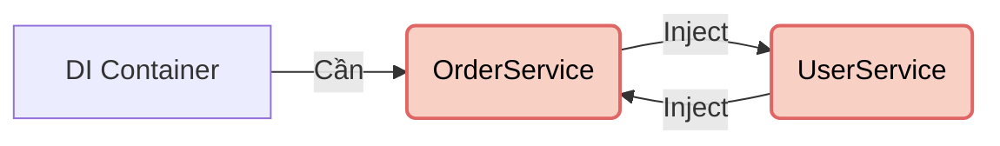
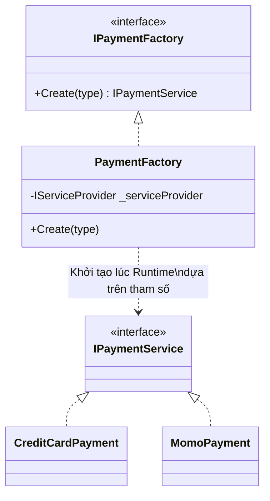

# Các mẫu nâng cao (Advanced DI) {#di-advanced}

DI cơ bản giúp bạn làm 90% công việc hàng ngày. Nhưng để sống sót qua 10% các "ca đẻ khó" trong các hệ thống doanh nghiệp (Enterprise), bạn cần trang bị thêm một vài tiểu xảo cao cấp. Bài viết này sẽ giải phẫu những lỗi khét tiếng nhất và cách DI Container hiện đại giải quyết chúng.

## 1. Lỗi Phụ thuộc Vòng tròn (Circular Dependency) {#circular-dependency}

Đây là lỗi phổ biến nhất khiến ứng dụng của bạn không thể khởi động.

**Kịch bản:**
- Class `OrderService` cần gọi `UserService` để kiểm tra quyền người dùng trước khi đặt hàng. Nó Inject `UserService`.
- Class `UserService` cần gọi `OrderService` để xem người này đã đặt bao nhiêu đơn. Nó Inject `OrderService`.

**Chuyện gì xảy ra?**
Khi DI Container cố gắng tạo `OrderService`, nó thấy cần `UserService`. Nó bèn chạy đi tạo `UserService`. Nhưng để tạo `UserService`, nó lại thấy cần `OrderService`. Nó lại quay về tạo `OrderService`... Một vòng lặp vô hạn (Infinite Loop) xảy ra! Ứng dụng ném ra lỗi `System.InvalidOperationException: A circular dependency was detected`.



**Cách khắc phục:**
1. **Thiết kế lại (Khuyên dùng):** Thường thì lỗi này chỉ ra kiến trúc của bạn đang bị sai (Vi phạm SRP). Thay vì A gọi B, B gọi A, hãy tách phần logic chung ra một Class thứ 3 là `UserOrderValidator`.
2. **Dùng `Lazy<T>`:** Thay vì bắt Framework khởi tạo ngay lập tức lúc gọi Constructor, hãy nhét đối tượng vào lớp bọc `Lazy<T>`. Nó sẽ chỉ khởi tạo khi bạn gọi `.Value`.
3. **Property/Method Injection:** Thay vì Inject vào Constructor (bắt buộc phải có ngay lúc tạo), hãy tạo xong đối tượng rồi mới gán qua hàm `SetUserService()`. C# mặc định không khuyến khích cách này.

## 2. Factory Pattern kết hợp với DI {#factory-di}

DI rất giỏi trong việc tạo đối tượng, nhưng nó chỉ có thể cung cấp các đối tượng **Cố định (Static dependencies)** được đăng ký lúc đầu. Điều gì xảy ra nếu bạn muốn tạo ra `PaymentService` loại A hay B tùy thuộc vào **dữ liệu người dùng nhập vào lúc Runtime**?

DI không thể làm điều đó trực tiếp. Bạn phải kết hợp DI với [Factory Pattern](/docs/patterns/factory).

**Cách làm:**
Đừng Inject thẳng `IPaymentService`. Hãy Inject một cái xưởng `IPaymentFactory`.

```csharp
public class PaymentFactory : IPaymentFactory
{
    private readonly IServiceProvider _serviceProvider;

    // Inject IServiceProvider (chính là DI Container) vào xưởng
    public PaymentFactory(IServiceProvider serviceProvider)
    {
        _serviceProvider = serviceProvider;
    }

    public IPaymentService Create(string paymentType)
    {
        // Tùy vào biến Runtime mà Factory tự quyết định kéo Class nào ra từ DI Container
        if (paymentType == "Credit")
            return _serviceProvider.GetRequiredService<CreditCardPayment>();
        if (paymentType == "Momo")
            return _serviceProvider.GetRequiredService<MomoPayment>();
            
        throw new Exception("Unknown Type");
    }
}
```



Bằng cách này, bạn vừa giữ được tính động (Dynamic) của ứng dụng, vừa vẫn hưởng lợi từ việc quản lý vòng đời của DI Container.

## 3. Cạm bẫy DI (DI Pitfalls) và Background Services {#di-pitfalls}

Dù DI rất mạnh, nhưng nếu dùng sai cách, nó sẽ trở thành "sát thủ" thầm lặng giết chết hiệu năng ứng dụng. Dưới đây là 2 cạm bẫy cực kỳ nguy hiểm:

**Cạm bẫy 1: Inject IServiceProvider vào Constructor**
Nhiều người lười suy nghĩ, thay vì Inject đúng những Service mình cần (ví dụ `IUserService`, `IOrderService`), họ lại Inject thẳng cái DI Container (`IServiceProvider`) rồi thích lấy gì ra thì lấy.
Việc này bị coi là **Anti-pattern (Service Locator Pattern)**. Nó che giấu sự phụ thuộc của Class (nhìn vào Constructor không biết Class đó cần những gì), làm việc viết Unit Test trở thành ác mộng, và phá vỡ kiến trúc Dependency Inversion.

**Cạm bẫy 2: Dùng Scoped Services bên trong Background Service**
Background Services (như HostedService chạy ngầm quét dọn rác, gửi email) thường có vòng đời là **Singleton**. Nếu bạn Inject một dịch vụ `Scoped` (như DbContext) vào Background Service, ứng dụng sẽ Crash ngay lúc khởi động!
Để giải quyết, bạn KHÔNG ĐƯỢC Inject DbContext trực tiếp. Thay vào đó, hãy Inject `IServiceScopeFactory`, sau đó tự mở một Scope cục bộ:

```csharp
public class EmailBackgroundService : BackgroundService
{
    private readonly IServiceScopeFactory _scopeFactory;
    
    public EmailBackgroundService(IServiceScopeFactory scopeFactory)
    {
        _scopeFactory = scopeFactory;
    }

    protected override async Task ExecuteAsync(CancellationToken stoppingToken)
    {
        // Tự tạo ra một Scope độc lập (Giống như 1 Request giả lập)
        using (var scope = _scopeFactory.CreateScope())
        {
            // Lấy DbContext an toàn, dùng xong sẽ tự động Dispose!
            var dbContext = scope.ServiceProvider.GetRequiredService<MyDbContext>();
            await dbContext.Emails.AddAsync(new Email());
            await dbContext.SaveChangesAsync();
        }
    }
}
```

## 4. Tự động hóa đăng ký với Scrutor (Assembly Scanning) {#scrutor}

Nếu hệ thống của bạn có 500 cái Services, việc gõ tay 500 dòng `services.AddScoped<IA, A>()` ở file cấu hình là một cực hình. Nó không chỉ mệt mỏi mà còn dễ bị sót (Quên đăng ký = Lỗi sập hệ thống).

Trong thế giới .NET, có một thư viện mã nguồn mở cực kỳ nổi tiếng tên là **Scrutor**. Nó giúp bạn tự động "cào" (scan) toàn bộ mã nguồn để tìm và tự đăng ký các Class.

```csharp
// Thay vì viết 500 dòng, bạn chỉ cần viết 5 dòng
services.Scan(scan => scan
    .FromAssemblyOf<Program>() // Quét toàn bộ Assembly chứa file Program
    .AddClasses(classes => classes.Where(type => type.Name.EndsWith("Service"))) // Tìm các class có đuôi là "Service"
    .AsImplementedInterfaces() // Đăng ký nó với Interface mà nó kế thừa
    .WithScopedLifetime()); // Gán vòng đời Scoped cho toàn bộ!
```

Kỹ thuật này được gọi là **Convention-based Registration** (Đăng ký theo Quy ước). Nhờ nó, các dự án nghìn file vẫn sạch sẽ tinh tươm.

:::tip Lời kết khóa học
Bạn đã đi từ những khái niệm thô sơ nhất về Mảng (Big O, Stack, Queue), qua các thuật toán cân não (Sorting, Searching, Tree, Graph), lột xác tư duy với các nguyên lý thiết kế (OOP, SOLID, Design Patterns) và cuối cùng chạm đến cảnh giới của Kiến trúc sư (Dependency Injection).

Mọi ứng dụng khổng lồ như Facebook, Netflix hay chính dự án **VisualizationDSA** mà bạn đang tương tác, đều được ghép lại từ những mảnh ghép nhỏ bé đó. Vũ khí đã sẵn sàng, giờ là lúc bạn tự tay viết lên những dòng code xoay chuyển thế giới!
:::
