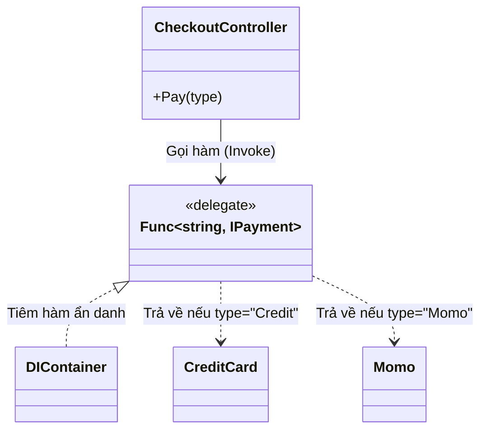

# Mẫu thiết kế DI Nâng cao (Advanced DI Patterns) {#di-advanced}

:::info Mục tiêu bài học
- Xử lý triệt để căn bệnh **Over-injection** (Tiêm quá liều) khi một Constructor phình to với hàng tá Services.
- Cứu vãn hiệu năng của ứng dụng (RAM & CPU) bằng tuyệt kỹ **Tải Lười Biếng (`Lazy<T>`)**.
- Phối hợp sức mạnh của DI Container với [Factory Pattern](/docs/patterns/factory) thông qua **`Func<T>` Delegate**.
- Nhận diện và tiêu diệt Anti-pattern tàn phá kiến trúc nhất mọi thời đại: **Service Locator**.
:::

## 1. Lời mở đầu: Trái đắng của Inversion of Control {#introduction}

Trong bài [Cơ bản về DI & IoC](/docs/di/basics), chúng ta đã giác ngộ được phép màu của việc giao phó quyền khởi tạo Object cho "Người nội trợ" Container. Tuy nhiên, khi một ứng dụng Web (ví dụ ASP.NET Core) phình to đến mức Khổng lồ (Enterprise level), việc lạm dụng DI sẽ sinh ra những hệ lụy vô cùng khủng khiếp về mặt hiệu năng.

Hãy tưởng tượng bạn gọi một bát phở (Request). Để nấu bát phở, Đầu bếp (Container) tự động chuẩn bị Hành, Tiêu, Tỏi, Ớt, Nước mắm, Giấm, Tương đen, Tương đỏ, Chanh, Khăn lạnh... Mặc dù cuối cùng bạn chỉ vắt đúng một miếng Chanh.
Sự chuẩn bị dư thừa đó làm chậm tốc độ phục vụ của quán phở (Chậm tốc độ phản hồi Request). 

Trong lập trình, đó gọi là bệnh **Over-injection (Tiêm quá liều)**.

---

## 2. Bệnh viện quá tải: Hội chứng Over-injection {#over-injection}

Đây là đoạn code cực kỳ phổ biến ở các công ty Outsourcing, nơi các Junior Dev "tiêm" mọi thứ họ nghĩ là cần thiết vào một Controller duy nhất.

```csharp
public class OrderController
{
    private readonly IDatabase _db;
    private readonly IEmailService _email;
    private readonly ILogger _logger;
    private readonly ISmsService _sms;
    private readonly IPdfGenerator _pdf; // Khởi tạo thằng này mất 2 giây!
    private readonly ICacheService _cache;

    // CONSTRUCTOR KHỔNG LỒ (Code Smell)
    public OrderController(
        IDatabase db, 
        IEmailService email, 
        ILogger logger, 
        ISmsService sms, 
        IPdfGenerator pdf,
        ICacheService cache)
    {
        _db = db; _email = email; _logger = logger; 
        _sms = sms; _pdf = pdf; _cache = cache;
    }

    public void ViewOrder(int id)
    {
        // Hàm này CHỈ truy vấn DB và Trả về Cache.
        // Nó KHÔNG HỀ xài Email, SMS, hay PDF.
        var data = _db.GetOrder(id);
        _cache.Set(id, data);
    }
}
```

**Thảm họa hiệu năng:**
Khi User gọi API `ViewOrder()`, DI Container phải lóc cóc chạy đi khởi tạo cả 6 món đồ nghề kia (kể cả thằng `IPdfGenerator` khởi tạo mất 2 giây). Mặc dù hàm `ViewOrder` hoàn toàn không xài tới PDF! 
Kết quả: API phản hồi mất hơn 2 giây thay vì 10 mili-giây. RAM máy chủ nổ tung vì chứa hàng ngàn Object không bao giờ được dùng tới.

---

## 3. Liều thuốc tiên: Tải Lười Biếng với `Lazy<T>` {#lazy-injection}

Ngôn ngữ C# hỗ trợ một Generic Class tuyệt vời mang tên `Lazy<T>`. 
Ý nghĩa của nó là: *"Hãy chuẩn bị cho tôi một BẢN CAM KẾT (Proxy). Khi nào tôi thực sự gọi hàm `.Value`, anh hẵng chạy đi tạo cái Object đó cho tôi. Còn nếu tôi không xài, thì đừng tạo!"*

Chúng ta sẽ bọc những Service nặng nề (Ví dụ: `IPdfGenerator`) vào bên trong `Lazy<>`.

```csharp
public class OrderController
{
    private readonly IDatabase _db;
    private readonly Lazy<IPdfGenerator> _lazyPdf; // Chỉ tiêm cái BẢN CAM KẾT

    public OrderController(IDatabase db, Lazy<IPdfGenerator> lazyPdf)
    {
        _db = db;
        _lazyPdf = lazyPdf; // Lúc này, đối tượng PdfGenerator THỰC SỰ CHƯA ĐƯỢC TẠO RA! Tốc độ 0ms.
    }

    public void ViewOrder(int id)
    {
        // Không gọi _lazyPdf.Value -> Tránh được án phạt 2 giây! Tốc độ API cực nhanh.
        _db.GetOrder(id);
    }

    public void ExportInvoice()
    {
        // Lúc này mới thực sự CẦN. 
        // Khi gọi .Value, hệ thống mới giật mình chạy đi khởi tạo IPdfGenerator.
        IPdfGenerator realPdf = _lazyPdf.Value; 
        realPdf.Generate();
    }
}
```

**Cấu hình trong ASP.NET Core:**
Theo mặc định, DI Container của Microsoft KHÔNG tự động hiểu `Lazy<T>`. Bạn phải đăng ký một thủ thuật nhỏ trong `Program.cs` để dạy nó cách bơm `Lazy`:

```csharp
// Đăng ký dịch vụ bình thường
builder.Services.AddTransient<IPdfGenerator, PdfGenerator>();

// Dạy Container cách tự động giải quyết mọi yêu cầu xin Lazy<T>
builder.Services.AddTransient(typeof(Lazy<>), typeof(LazyInstance<>));

// Lớp hỗ trợ ngầm (Nằm đâu đó trong hệ thống của bạn)
public class LazyInstance<T> : Lazy<T> where T : class
{
    // Bắt Container phải tự dùng hàm GetRequiredService khi nào người dùng gọi .Value
    public LazyInstance(IServiceProvider provider) 
        : base(() => provider.GetRequiredService<T>()) 
    { }
}
```

---

## 4. Cuộc hôn nhân hoàn hảo: DI x Factory Pattern {#di-factory}

Trong bài [Factory Pattern](/docs/patterns/factory), chúng ta tự tay viết các câu lệnh `switch-case` lồng ghép. Nhưng trong thời đại DI, chúng ta có thể lợi dụng **C# Delegates (`Func<T>`)** để biến chính DI Container thành một Cỗ máy Factory khổng lồ.

Bài toán: Hệ thống Thanh toán lúc thì cần `CreditCard`, lúc thì cần `Momo` (Quyết định lúc Runtime, tùy thuộc User bấm nút nào). 



**Mã nguồn tinh hoa:**

```csharp
// 1. CẤU HÌNH Ở PROGRAM.CS
builder.Services.AddTransient<CreditCardPayment>();
builder.Services.AddTransient<MomoPayment>();

// Đăng ký một HÀM (Func) đẻ ra IPayment dựa trên chuỗi string 'type'
builder.Services.AddTransient<Func<string, IPaymentService>>(serviceProvider => key =>
{
    switch (key)
    {
        case "Credit": return serviceProvider.GetRequiredService<CreditCardPayment>();
        case "Momo":   return serviceProvider.GetRequiredService<MomoPayment>();
        default:       throw new ArgumentException("Loại thanh toán không tồn tại");
    }
});

// 2. SỬ DỤNG TRONG CONTROLLER
public class CheckoutController
{
    // Yêu cầu DI Container bơm cho tôi MỘT CÁI HÀM, chứ không phải một Đối tượng!
    private readonly Func<string, IPaymentService> _paymentFactory;

    public CheckoutController(Func<string, IPaymentService> paymentFactory)
    {
        _paymentFactory = paymentFactory;
    }

    public void ProcessPayment(string userChoiceType) // userChoiceType = "Momo"
    {
        // Khi cần xài, tôi mới GỌI HÀM (Invoke) để yêu cầu Container đẻ ra đúng loại tôi cần!
        IPaymentService payment = _paymentFactory(userChoiceType);
        payment.Pay();
    }
}
```
Nhờ cách này, Controller **hoàn toàn sạch bóng** các lệnh `if/else` (Tuân thủ OCP tuyệt đối) và cũng không bị khởi tạo thừa thãi các dịch vụ không xài đến.

---

## 5. Sát thủ Kiến trúc: Service Locator Anti-Pattern {#service-locator}

Khi mới học DI, rất nhiều người sẽ cảm thấy mệt mỏi với việc phải tiêm chục cái Service vào Constructor. Họ sẽ khôn lỏi tìm ra một "lối tắt" ma quỷ: Tiêm BẢN THÂN CÁI CONTAINER vào Controller!

Cái Container đó trong .NET được gọi là `IServiceProvider`.

```csharp
// MÃ CỰC KỲ XẤU - ĐỪNG BAO GIỜ VIẾT THẾ NÀY (ANTI-PATTERN)
public class BadController
{
    private readonly IServiceProvider _container;

    // Chỉ tiêm đúng 1 cái Cặp Da chứa vạn vật
    public BadController(IServiceProvider container)
    {
        _container = container;
    }

    public void DoSomething()
    {
        // Thích xài cái gì thì thò tay vào Cặp Da bới ra (Service Locator)
        var db = _container.GetService<IDatabase>();
        var email = _container.GetService<IEmailService>();
        
        db.Save("Data");
        email.SendWelcome("User");
    }
}
```

**Tại sao đây là Tội ác?**
1. **Dối trá về Phụ thuộc (Hidden Dependencies):** Nhìn từ bên ngoài, `BadController` có vẻ như chẳng phụ thuộc vào cái gì ngoài cái Container. Nhưng nếu bạn xóa mất `IDatabase` trong hệ thống, hàm tạo vẫn chạy trơn tru, và nó sẽ NỔ TUNG BẤT THÌNH LÌNH ở giữa hàm `DoSomething()`. Điều này đi ngược lại hoàn toàn triết lý của DI là "Khai báo phụ thuộc rõ ràng" (Explicit Dependencies).
2. **Kẻ thù của Unit Test:** Để viết Test cho Class này, bạn không thể tạo một `FakeDatabase` đơn giản được nữa. Bạn phải thiết lập giả mạo (Mock) cho TOÀN BỘ cái `IServiceProvider` cực kỳ phức tạp.

:::tip Tóm tắt nhanh (Key Takeaways)
- Đừng biến Constructor thành cái "thùng rác" nhồi nhét quá 5 Services. Đó là dấu hiệu của việc vi phạm Nguyên lý Trách nhiệm Đơn lẻ (SRP).
- Hãy dùng **`Lazy<T>`** để bọc các Service có cấu trúc nặng nề. Container sẽ chỉ nạp chúng vào RAM khi bạn gọi `.Value`.
- Phối hợp DI Container và Factory Pattern bằng cách tiêm **`Func<T>`**. Quyết định khởi tạo cái gì sẽ được hoãn lại cho đến lúc Runtime.
- Tránh xa **Service Locator Pattern** (Tiêm `IServiceProvider`). Đừng bao giờ giấu giếm sự phụ thuộc bên trong các thân hàm!
:::

---

## Next Steps {#next-steps}

Bạn đã vượt qua giới hạn của DI Container với `Lazy<T>`, biến Container thành cỗ máy Factory nhờ `Func<T>` và học cách tránh xa Service Locator. Chặng tiếp theo là khám phá Keyed Services của .NET 8 — cách thanh lịch để tiêm nhiều thực thi cho cùng một Interface mà không cần tự tay viết Factory.

<div class="vt-box-container next-steps">
  <a class="vt-box" href="/docs/di/keyed-services">
    <p class="next-steps-link">Keyed Services (.NET 8)</p>
    <p class="next-steps-caption">Đăng ký nhiều Implementations cho cùng một Interface bằng những chiếc Chìa khóa.</p>
  </a>
  <a class="vt-box" href="/docs/di/lifecycles">
    <p class="next-steps-link">Vòng đời (Lifecycles)</p>
    <p class="next-steps-caption">Phân biệt Transient, Scoped, Singleton và tránh bẫy Captive Dependency khi kết hợp Lazy&lt;T&gt;.</p>
  </a>
</div>

## 📚 Tham khảo lý thuyết {#references}

Nguồn lý thuyết chính được dùng để biên soạn bài viết này:

- **Mark Seemann – *Dependency Injection in .NET* (Manning Publications):** Cuốn sách kinh điển giải thích chi tiết các mẫu DI nâng cao như Lazy Injection, Factory Delegate và cách nhận diện Service Locator Anti-pattern.
- **Microsoft Learn – *Dependency injection in .NET*:** Tài liệu chính thức của ASP.NET Core về DI Container, cách đăng ký Open Generic và mở rộng Container. (https://learn.microsoft.com/en-us/dotnet/core/extensions/dependency-injection)
- **Martin Fowler – *Inversion of Control Containers and the Dependency injection pattern*:** Bài viết kinh điển phân tích lý do ưu tiên DI hơn Service Locator. (https://martinfowler.com/articles/injection.html)
- **Wikipedia – *Dependency injection*:** Tổng quan về DI, mối quan hệ với IoC và các ví dụ minh họa. (https://en.wikipedia.org/wiki/Dependency_injection)
