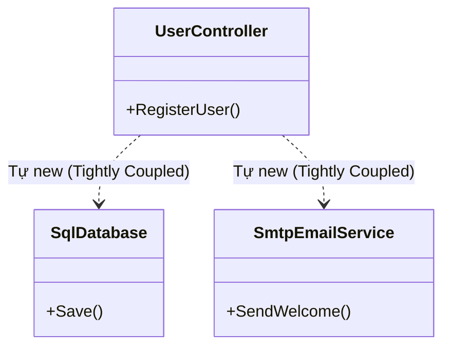

# Cơ bản về Dependency Injection (DI) & Inversion of Control (IoC) {#di-basics}

:::info Mục tiêu bài học
- Xóa mù mờ ranh giới giữa 2 thuật ngữ thường bị nhầm lẫn: **IoC (Tư tưởng)** và **DI (Cách làm)**.
- Hiểu được thảm họa Tightly Coupled khi các Lớp tự ý "Đi chợ" mua các phụ thuộc bằng từ khóa `new`.
- Từng bước mô phỏng và xây dựng một **IoC Container (Người Nội Trợ)** bằng C# nguyên thủy.
- Đạt cảnh giới Tối thượng: Thay vì tự tay cấp phát tài nguyên, hãy để Hệ thống làm điều đó giùm bạn (Don't call us, we'll call you).
:::

## 1. Lời mở đầu: Nguyên lý Hollywood {#introduction}

Trong toàn bộ lịch sử OOP, mọi vấn đề bảo trì thảm họa đều bắt nguồn từ một chỗ: **Sự gắn kết chặt chẽ (Tightly Coupled)**. Khi Class A gọi hàm `new ClassB()`, chúng bị dính với nhau bằng keo 502, không thể tách rời để test, không thể nâng cấp riêng biệt. (Xem lại bài [Nguyên lý SOLID - DIP](/docs/solid/dip) và [Factory Pattern](/docs/patterns/factory)).

Để giải quyết vấn đề này, các Kiến trúc sư phần mềm sáng chế ra Nguyên lý **Inversion of Control (IoC - Đảo ngược Điều khiển)**, còn được gọi vui là **Nguyên lý Hollywood**: 
> *"Đừng gọi cho chúng tôi, chúng tôi sẽ gọi cho bạn!" (Don't call us, we'll call you).*

**Ví dụ thực tế (Real-world analogy): Đứa trẻ và Bữa ăn**
- **Kiểu cũ (Không IoC):** Thằng bé (Class `Child`) đói bụng. Nó tự phi ra chợ, tự mua gạo (`new Rice()`), mua thịt (`new Meat()`), rồi tự nấu ăn. Đứa bé này đang kiểm soát (Control) toàn bộ vòng đời của đĩa cơm. Quá mệt mỏi!
- **Kiểu mới (Có IoC):** Thằng bé đói bụng. Nó chỉ ngồi há miệng chờ. Bà Mẹ (IoC Container) đã nấu xong tất cả mọi thứ, và khi nào đến giờ ăn, Bà Mẹ sẽ **TIÊM (Inject)** đồ ăn vào miệng nó. Quyền kiểm soát đồ ăn đã bị ĐẢO NGƯỢC (Đẩy từ tay đứa bé sang tay Bà Mẹ).

**Dependency Injection (DI - Tiêm sự phụ thuộc)** chính là hành động Bà Mẹ đút cơm cho thằng bé. DI là công cụ thực tế (Thực hành), còn IoC là Triết lý thiết kế (Lý thuyết).

---

## 2. Giải phẫu Anti-pattern: Đứa bé đi chợ {#anti-pattern}

Đây là cách code quen thuộc của các Newbie khi xây dựng một `UserController`. Để xử lý logic Đăng ký tài khoản, Controller này tự ý gọi `new` để tạo kết nối Database và gửi Email.

```csharp
// MÃ XẤU - ĐỨA BÉ TỰ ĐI CHỢ
public class UserController
{
    private SqlDatabase _db;
    private SmtpEmailService _email;

    public UserController()
    {
        // 1. Controller tự khởi tạo sự phụ thuộc
        _db = new SqlDatabase("Server=myServerAddress;Database=myDataBase;");
        _email = new SmtpEmailService("smtp.gmail.com", 587);
    }

    public void RegisterUser(string email)
    {
        _db.Save(email);
        _email.SendWelcome(email);
    }
}
```



**Tại sao đây là Thảm họa?**
1. **Chết Unit Test:** Bạn muốn test hàm `RegisterUser` xem nó chạy đúng luồng không. Nhưng mỗi lần test, nó lại chọc thẳng vào CSDL thật (`SqlDatabase`) và spam rác vào Email thật! Bạn không có cách nào chặn nó lại vì biến đã bị `new` chết cứng trong bụng Controller.
2. **Kéo lê Sự phụ thuộc (Dependency Hell):** Nếu `SmtpEmailService` cần thay đổi hàm tạo, thêm tham số `Password`, bạn phải đè ngửa file `UserController` ra sửa lại. Nếu có 100 Controller đang xài Email, bạn phải đi sửa 100 file!

---

## 3. Phẫu thuật DI: Xây dựng Người Nội Trợ (IoC Container) {#refactoring}

Quy trình giải thoát diễn ra trong 3 bước kinh điển.

### Bước 1: Trừu tượng hóa (Tạo Hợp Đồng Interface)
Tách rời khái niệm Gửi Email và Lưu DB ra thành Interface. Lớp `UserController` giờ đây chỉ quan tâm tới Hợp đồng, không quan tâm tới Con người cụ thể nữa.

```csharp
public interface IDatabase { void Save(string data); }
public interface IEmailService { void SendWelcome(string to); }

public class SqlDatabase : IDatabase { public void Save(string data) => Console.WriteLine("Lưu SQL."); }
public class SmtpEmailService : IEmailService { public void SendWelcome(string to) => Console.WriteLine("Gửi SMTP."); }
```

### Bước 2: Hé miệng chờ cơm (Constructor Injection)
`UserController` xóa vĩnh viễn mọi từ khóa `new`. Nó yêu cầu ai đó khởi tạo xong đồ nghề thì nhét vào Constructor cho nó xài.

```csharp
// MÃ ĐẸP - SẴN SÀNG CHO TIÊM PHỤ THUỘC (DI)
public class UserController
{
    private readonly IDatabase _db;
    private readonly IEmailService _email;

    // HÉ MIỆNG CHỜ BÀ MẸ BỚI CƠM (Constructor Injection)
    public UserController(IDatabase db, IEmailService email)
    {
        _db = db;
        _email = email;
    }

    public void RegisterUser(string email)
    {
        _db.Save(email);
        _email.SendWelcome(email);
    }
}
```

### Bước 3: Cỗ máy vĩ đại (IoC Container)
Bây giờ ai sẽ là người tạo ra `SqlDatabase` và `SmtpEmailService` rồi tiêm vào Controller? Trong ứng dụng Desktop ngày xưa, Lập trình viên phải tự viết mã lắp ráp (Poor Man's DI) ở hàm `Main()`.

Nhưng ở các Framework hiện đại (ASP.NET Core), chúng ta được cấp phát một Cỗ Máy Thần Kỳ gọi là **IoC Container**. Bạn chỉ cần truyền cho nó 1 bản Danh Sách Đăng Ký (Service Collection).

```csharp
// ĐÂY CHÍNH LÀ ĐOẠN CODE KINH ĐIỂN BẠN THẤY TRONG PROGRAM.CS CỦA .NET CORE
public void ConfigureServices(IServiceCollection services)
{
    // 1. Dạy Container: "Hễ ai hỏi xin IDatabase, mày đẻ ra SqlDatabase cho tao!"
    services.AddTransient<IDatabase, SqlDatabase>();

    // 2. Dạy Container: "Hễ ai hỏi xin IEmail, đẻ ra SmtpEmailService!"
    services.AddTransient<IEmailService, SmtpEmailService>();

    // 3. Đăng ký Controller
    services.AddTransient<UserController>();
}
```

**Sự Ma Thuật Xảy Ra:**
Khi một người dùng Gửi Request lên Web, Framework sẽ tự động làm những bước cực kỳ đáng sợ sau lưng bạn:
1. Thấy Request đòi gọi `UserController`.
2. Container quét hàm tạo của `UserController` và giật mình: *"Á à, thằng này đòi 2 món là IDatabase và IEmailService"*.
3. Container lục sổ đăng ký (ConfigureServices), thấy khớp. Nó tự động lôi `SqlDatabase` ra `new`.
4. Nó tự động lôi `SmtpEmailService` ra `new`.
5. Cuối cùng, nó chích (Inject) 2 cái đối tượng vừa tạo vào bụng của `UserController`, và trả Controller về cho hệ thống chạy bình thường.

Bạn không hề gõ một chữ `new` nào! Đó chính là quyền năng của **Inversion of Control**.

---

## 4. Tác dụng phụ 100 điểm: Unit Test thần thánh {#unit-test-bonus}

Quay lại bài toán Test, giờ đây biến `UserController` thành cực kỳ trong sạch. Để test hàm Đăng ký, bạn không cần gọi Database thật. Bạn chỉ cần tự tạo một Class Giả (Mock Object) và TIÊM nó vào Controller.

```csharp
// TẠO ĐỒ GIẢ (Mock)
public class FakeDatabase : IDatabase { 
    public void Save(string data) => Console.WriteLine("ĐÃ CHẶN! Không đụng tới SQL thật."); 
}
public class FakeEmail : IEmailService { 
    public void SendWelcome(string to) => Console.WriteLine("ĐÃ CHẶN! Không gửi spam mail."); 
}

// Bắt đầu chạy Test: Tiêm đồ giả vào bụng Controller
var fakeDb = new FakeDatabase();
var fakeEmail = new FakeEmail();

var controller = new UserController(fakeDb, fakeEmail);
controller.RegisterUser("test@mail.com");

// Kết quả Console in ra:
// ĐÃ CHẶN! Không đụng tới SQL thật.
// ĐÃ CHẶN! Không gửi spam mail.
// BẠN ĐÃ TEST THÀNH CÔNG LOGIC CONTROLLER MÀ KHÔNG GÂY HẬU QUẢ VẬT LÝ NÀO!
```

:::tip Tóm tắt nhanh (Key Takeaways)
- **IoC (Inversion of Control)** là Nguyên lý thiết kế: Tước đoạt quyền tự khởi tạo Object của một Class, giao cho hệ thống làm việc đó giùm.
- **DI (Dependency Injection)** là Công cụ thực hành nguyên lý IoC. Bằng cách chích (Inject) các biến phụ thuộc vào qua Constructor.
- Tác dụng cốt lõi 1: Xóa sổ từ khóa `new`, đập tan sự gắn kết Tightly Coupled. Thêm bớt dịch vụ chỉ cần sửa ở 1 nơi duy nhất (`ConfigureServices`).
- Tác dụng cốt lõi 2: Mở đường cho Unit Test bằng kỹ thuật Mocks/Stubs.
- Để sử dụng DI thành thạo, bạn bắt buộc phải hiểu rành rẽ về các Vòng đời (Lifecycles) của Container. Xem lại bài [DI Lifecycles](/docs/di/lifecycles) để tránh lỗi bắt cóc phụ thuộc (Captive Dependency).
:::
