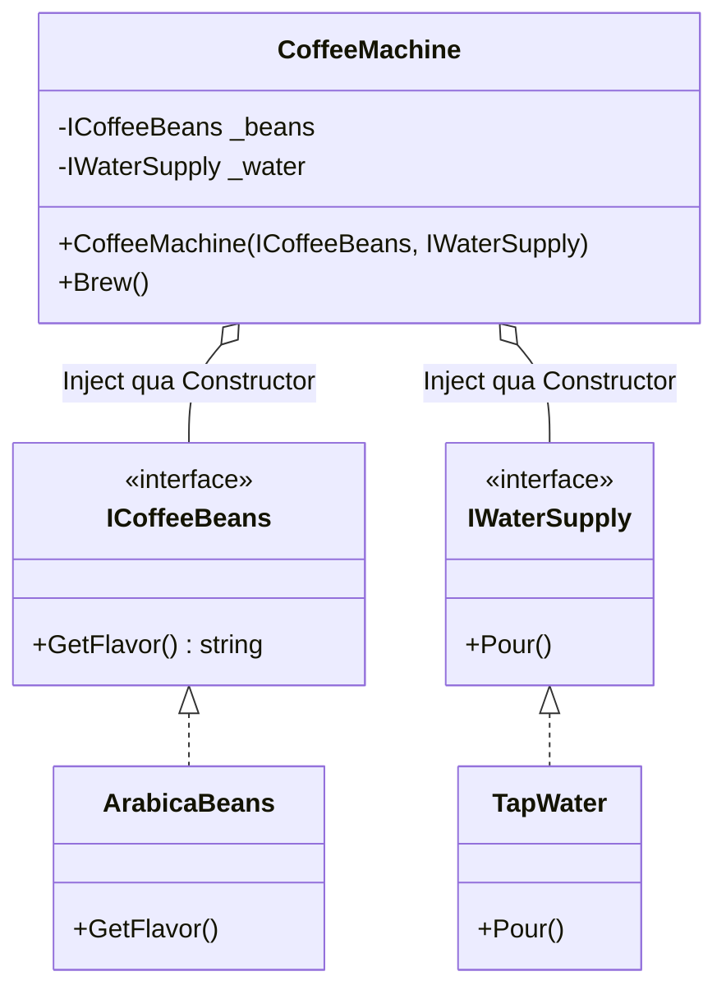

# Cơ bản về DI & IoC {#di-basics}

Nếu bạn đã đọc xong phần [Nguyên lý DIP (Dependency Inversion Principle)](/docs/solid/dip) trong chuỗi bài SOLID, bạn đã hiểu tại sao chúng ta không nên để các Class tự khởi tạo (gọi `new`) các thành phần phụ thuộc của chúng.

Thay vì một Class tự đi tìm và tạo ra đồ nghề cho mình, nó chỉ cần "há miệng chờ sung": khai báo những thứ nó cần ở hàm khởi tạo (Constructor), và sẽ có một thế lực bí ẩn bên ngoài tự động "nhét" (Inject) đồ nghề vào cho nó. 

Kỹ thuật đó gọi là **Dependency Injection (DI)** - Tiêm chích sự phụ thuộc.

## Inversion of Control (IoC) là gì? {#what-is-ioc}

**IoC (Đảo ngược quyền điều khiển)** là một khái niệm trừu tượng. Trong lập trình truyền thống, luồng chạy của chương trình (Control Flow) do Code của bạn điều khiển. Bạn gọi hàm A, hàm A gọi hàm B.

Với IoC, bạn "giao nộp" quyền điều khiển đó cho một **Framework (hoặc Container)**. Framework sẽ tự động biết khi nào cần tạo ra đối tượng nào, tiêm nó vào đâu, và bao giờ thì tiêu hủy nó.

**Dependency Injection (DI)** chính là cách phổ biến nhất để hiện thực hóa khái niệm IoC!

## Hình ảnh thực tế (Pha cà phê) {#real-world}

Tưởng tượng bạn là một chiếc Máy pha cà phê (`CoffeeMachine`). Để pha cà phê, bạn cần Nước (`Water`) và Hạt cà phê (`Beans`).

**Lập trình không có DI (Tự cung tự cấp):**
Chiếc máy tự chạy ra siêu thị mua hạt, tự chạy ra vòi hứng nước. 
Nếu siêu thị đổi loại hạt cà phê, hoặc vòi nước bị hỏng, chiếc Máy pha cà phê cũng hỏng theo! Nó phải gánh vác quá nhiều trách nhiệm (Vi phạm SRP).

**Lập trình có DI (Phục vụ tận răng):**
Chiếc máy pha cà phê có một cái phễu (Constructor). Buổi sáng, người Chủ quán (DI Container) sẽ tự động đổ Nước và Hạt cà phê vào phễu cho nó. Chiếc máy chả cần quan tâm Nước lấy từ đâu, nó chỉ việc bấm nút Pha là xong!

## Cài đặt DI Cơ bản trong C# (Code Example) {#code-example}

Đây là cách chúng ta áp dụng Constructor Injection (Tiêm qua hàm khởi tạo) - phương pháp DI phổ biến và an toàn nhất hiện nay.

```csharp
// 1. Định nghĩa "Đồ nghề" qua Interface
public interface ICoffeeBeans { string GetFlavor(); }
public interface IWaterSupply { void Pour(); }

// 2. Chi tiết của Đồ nghề
public class ArabicaBeans : ICoffeeBeans 
{ 
    public string GetFlavor() => "Cà phê Arabica thơm nhẹ"; 
}
public class TapWater : IWaterSupply 
{ 
    public void Pour() => Console.WriteLine("Đang đổ nước máy..."); 
}

// 3. Class Cấp cao (Máy pha cà phê)
public class CoffeeMachine
{
    private readonly ICoffeeBeans _beans;
    private readonly IWaterSupply _water;

    // CONSTRUCTOR INJECTION
    // Tôi cần Hạt và Nước! Ai gọi tôi thì làm ơn truyền vào dùm!
    public CoffeeMachine(ICoffeeBeans beans, IWaterSupply water)
    {
        _beans = beans;
        _water = water;
    }

    public void Brew()
    {
        _water.Pour();
        Console.WriteLine($"Đang pha... {_beans.GetFlavor()}");
    }
}
```



**Thế lực bí ẩn (DI Container) ở bên ngoài sẽ làm gì?**
Trong các ứng dụng .NET (ASP.NET Core), bạn không cần tự tay viết code khởi tạo này. Bạn chỉ cần cấu hình (Config) 1 lần duy nhất ở file `Program.cs`.

```csharp
// Đăng ký với hệ thống (DI Container)
var services = new ServiceCollection();
services.AddTransient<ICoffeeBeans, ArabicaBeans>();
services.AddTransient<IWaterSupply, TapWater>();
services.AddTransient<CoffeeMachine>();

var provider = services.BuildServiceProvider();

// Yêu cầu Framework lấy ra một cái Máy pha cà phê
var machine = provider.GetService<CoffeeMachine>();
machine.Brew(); 
// Framework sẽ tự động new Arabica, new TapWater, rồi nhét vào new CoffeeMachine!
```

:::info Tại sao gọi _biến bằng tiền tố gạch dưới?
Bạn sẽ thấy biến private `_beans` và `_water` có dấu gạch dưới `_`. Đây là Coding Convention (Quy ước gõ code) chuẩn mực của hệ sinh thái C#. Nó giúp lập trình viên phân biệt ngay lập tức đâu là biến nội bộ của Class (Field), đâu là tham số truyền vào (Parameter) mà không cần phải dùng từ khóa `this.beans = beans` lằng nhằng.
:::

## Next Steps {#next-steps}

Việc đăng ký dịch vụ vào DI Container (như `services.AddTransient`) trông thật kỳ diệu. Nhưng có bao giờ bạn tự hỏi, nếu 10 cái máy pha cà phê cùng hoạt động, Framework sẽ tạo ra **1 cái vòi nước dùng chung** cho cả 10 máy, hay tạo ra **10 cái vòi nước độc lập**?

Câu trả lời nằm ở khái niệm **Lifecycles (Vòng đời)**. Hãy cùng tìm hiểu 3 loại vòng đời quan trọng nhất của DI: **Transient, Scoped, và Singleton**.

<div class="vt-box-container next-steps">
  <a class="vt-box" href="/docs/di/lifecycles">
    <p class="next-steps-link">Vòng đời DI (Lifecycles)</p>
    <p class="next-steps-caption">Phân biệt Transient, Scoped, Singleton và cách quản lý bộ nhớ triệt để.</p>
  </a>
</div>
