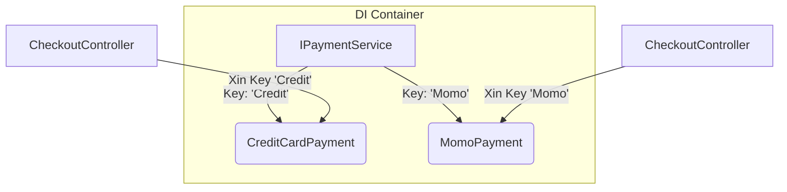

# Keyed Services (.NET 8) {#keyed-services}

Trong bài [Factory Pattern với DI](/docs/di/advanced#factory-di), chúng ta đã thảo luận về một hạn chế cổ điển của DI Container mặc định trong .NET: Nó rất tệ trong việc phân biệt **nhiều cài đặt (implementations)** của **cùng một Interface**.

Nếu bạn có `CreditCardPayment` và `MomoPayment` cùng kế thừa `IPaymentService`, và bạn tiêm (inject) `IPaymentService` vào Constructor, DI Container sẽ luôn lấy cái class được đăng ký **cuối cùng** đưa cho bạn. Để giải quyết, trước đây chúng ta phải viết một cái Factory lằng nhằng hoặc dùng thư viện bên thứ ba (như Autofac).

Nhưng từ **.NET 8**, Microsoft đã chính thức tung ra một "vũ khí tối thượng": **Keyed Services**.

## Keyed Services là gì? {#what-is-it}

Keyed Services cho phép bạn gán một "chìa khóa" (Key - thường là một chuỗi string hoặc một Enum) cho mỗi Implementation khi bạn đăng ký chúng vào DI Container. Sau đó, khi cần sử dụng, bạn chỉ cần báo cho hệ thống biết bạn muốn chiếc chìa khóa nào.



## Cách đăng ký (Registration) {#registration}

Thay vì dùng `AddScoped`, `AddTransient`, bạn thêm chữ `Keyed` vào giữa: `AddKeyedScoped`, `AddKeyedTransient`.

```csharp
var builder = WebApplication.CreateBuilder(args);

// Đăng ký IPaymentService với key "Credit"
builder.Services.AddKeyedScoped<IPaymentService, CreditCardPayment>("Credit");

// Đăng ký IPaymentService với key "Momo"
builder.Services.AddKeyedScoped<IPaymentService, MomoPayment>("Momo");
```

## Cách sử dụng (Injection) {#injection}

Để lấy Service ra, bạn sử dụng Attribute `[FromKeyedServices(key)]` ngay trong Constructor của class cần dùng.

```csharp
public class CheckoutController : ControllerBase
{
    private readonly IPaymentService _creditPayment;
    private readonly IPaymentService _momoPayment;

    // Chỉ định rõ Key cho từng Interface!
    public CheckoutController(
        [FromKeyedServices("Credit")] IPaymentService creditPayment,
        [FromKeyedServices("Momo")] IPaymentService momoPayment)
    {
        _creditPayment = creditPayment;
        _momoPayment = momoPayment;
    }

    [HttpPost("pay-credit")]
    public IActionResult PayCredit()
    {
        _creditPayment.Process();
        return Ok();
    }
}
```

### Lấy động tại Runtime (Runtime Resolution)

Nếu Key được người dùng gửi lên từ giao diện (ví dụ người dùng chọn nút Momo trên Web), bạn không thể nhét cứng chữ "Momo" vào constructor bằng Attribute. Khi đó, bạn sẽ Inject một `IServiceProvider` (hoặc dùng `FromServices` trong tham số hàm) và lấy động:

```csharp
[HttpPost("pay-dynamic")]
// "type" có thể là "Credit" hoặc "Momo" do Frontend gửi lên
public IActionResult PayDynamic(string type, [FromServices] IServiceProvider serviceProvider)
{
    // Sử dụng GetRequiredKeyedService thay vì GetRequiredService
    var paymentService = serviceProvider.GetRequiredKeyedService<IPaymentService>(type);
    
    paymentService.Process();
    return Ok();
}
```

:::tip Cạm bẫy Service Locator
Mặc dù ở ví dụ trên, chúng ta tiêm `IServiceProvider` để lấy ra service động (điều mà bài trước vừa chê bai là Anti-pattern), nhưng trong trường hợp lấy theo Key từ Request của người dùng, đây là một trong những ngoại lệ được chấp nhận. Tuy nhiên, cách sạch sẽ nhất vẫn là tạo một **Factory** và để Factory đó gọi `GetRequiredKeyedService`.
:::

## Keyed Any (Bắt mọi Key) {#any-key}

Đôi khi bạn muốn inject một service "mặc định" cho bất kỳ Key nào không được đăng ký. .NET 8 cung cấp tính năng `KeyedService.AnyKey`. Tuy nhiên, tính năng này thường dùng ở mức độ thư viện nền tảng (Framework level) chứ ít khi dùng ở logic ứng dụng thông thường.

## Tóm lược {#summary}

Sự ra đời của **Keyed Services** trong .NET 8 đã đánh dấu sự kết thúc của việc phải viết hàng đống Factory thủ công chỉ để switch (chuyển đổi) giữa các Implementation. Nó làm cho code DI của C# trở nên gọn gàng, thanh lịch và mạnh mẽ không kém cạnh gì các DI Framework đình đám nhất.

Và đến đây, hành trình khám phá thế giới Lập trình Hướng đối tượng, SOLID, Design Patterns và Kiến trúc Dependency Injection của bạn đã chính thức **Viên mãn**. Chúc mừng bạn đã lên một tầm cao mới trong sự nghiệp Kỹ sư phần mềm!
