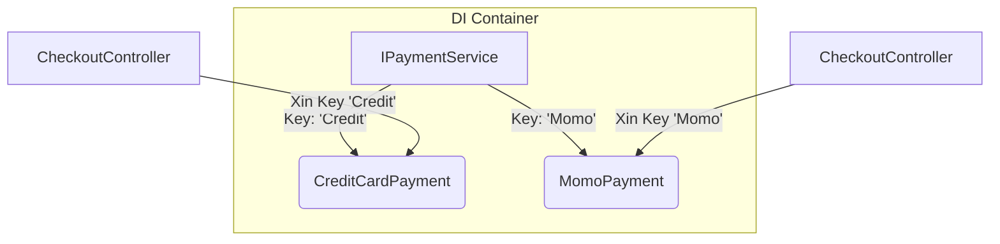

# Keyed Services (.NET 8) {#keyed-services}

:::info Mục tiêu bài học
- Giải quyết bài toán kinh điển của DI: Làm sao để đăng ký nhiều Thực thi (Implementations) cho cùng MỘT Giao diện (Interface)?
- Sử dụng cú pháp mới nhất của .NET 8: **Keyed Dependency Injection**.
- Xóa bỏ hoàn toàn cách viết [Factory Pattern kết hợp Func](/docs/di/advanced) rườm rà.
- Phân biệt sự khác nhau giữa `[FromKeyedServices]` và `[FromServices]`.
:::

## 1. Lời mở đầu: Sự bế tắc của Interface dùng chung {#introduction}

Hãy quay lại một kịch bản cực kỳ quen thuộc: Bạn xây dựng một hệ thống thanh toán. Bạn thiết kế một bản hợp đồng `IPaymentService`. Phía dưới, bạn có 2 nhóm coder viết ra 2 tính năng: Thanh toán Thẻ tín dụng (`CreditCardPayment`) và Thanh toán Ví Momo (`MomoPayment`).

Theo tư duy DI cơ bản, bạn đăng ký chúng vào `Program.cs` như sau:
```csharp
builder.Services.AddTransient<IPaymentService, CreditCardPayment>();
builder.Services.AddTransient<IPaymentService, MomoPayment>();
```

**Bi kịch xảy ra!** 
Khi `CheckoutController` hé miệng xin Container tiêm cho nó cái `IPaymentService`:
```csharp
public CheckoutController(IPaymentService payment) 
{ ... }
```
Container sẽ bối rối: *"Tôi đang cầm trên tay 2 cái IPaymentService lận! Cái CreditCard và cái Momo. Mày muốn tao tiêm cái nào cho mày???"*
Theo luật ngầm định của ASP.NET Core trước đây, nó sẽ **tiêm cái được đăng ký sau cùng** (Tức là `MomoPayment`). 

Vậy làm sao để cái Controller thứ nhất xin tiêm Momo, còn cái Controller thứ hai xin tiêm CreditCard?

Trong bài [DI Nâng cao](/docs/di/advanced), chúng ta phải lách luật bằng cách viết một hàm `Func<string, IPaymentService>` lằng nhằng dài mười mấy dòng. Nhưng Microsoft đã lắng nghe tiếng khóc của Lập trình viên. Năm 2023, họ tung ra **.NET 8** với tính năng **Keyed Services**!

---

## 2. Giải pháp vĩ đại: Đánh chìa khóa cho dịch vụ {#keyed-solution}

Ý tưởng của Keyed Services vô cùng đơn giản: Bạn dán một cái Nhãn (Key) lên từng dịch vụ lúc đăng ký. Khi xin tiêm, bạn chỉ cần đọc tên cái Nhãn đó ra.



### Bước 1: Đăng ký với Chìa khóa (Key)

Trong `Program.cs`, thay vì dùng hàm `AddTransient<T, U>()`, bạn đổi sang `AddKeyedTransient<T, U>(key)`.

```csharp
// Đăng ký dịch vụ kèm theo chìa khóa định danh
builder.Services.AddKeyedTransient<IPaymentService, CreditCardPayment>("CreditKey");
builder.Services.AddKeyedTransient<IPaymentService, MomoPayment>("MomoKey");

// Hỗ trợ cả 3 vòng đời: AddKeyedTransient, AddKeyedScoped, AddKeyedSingleton
```

### Bước 2: Xin tiêm bằng Thuộc tính (Attribute)

Bây giờ, tại các Controller hoặc Service cần sử dụng, bạn dùng thuộc tính `[FromKeyedServices]` đính kèm ngay trước tham số trong Constructor.

```csharp
public class CheckoutController
{
    private readonly IPaymentService _creditPayment;
    private readonly IPaymentService _momoPayment;

    // Chỉ định đích danh chìa khóa muốn mượn
    public CheckoutController(
        [FromKeyedServices("CreditKey")] IPaymentService creditPayment,
        [FromKeyedServices("MomoKey")] IPaymentService momoPayment)
    {
        _creditPayment = creditPayment;
        _momoPayment = momoPayment;
    }

    public void PayByCreditCard()
    {
        _creditPayment.Pay(); // Chắc chắn 100% chạy code của CreditCardPayment
    }
}
```

Mọi dòng code `Func` rườm rà hay `switch-case` đã bị xóa sổ hoàn toàn! Code của bạn trở nên tinh khiết (Clean) và cực kỳ dễ đọc.

---

## 3. Ứng dụng thực chiến: Hệ thống Multi-Tenant (Đa khách thuê) {#multi-tenant}

**Keyed Services** không chỉ để giải quyết bài toán thanh toán. Nơi nó thực sự tỏa sáng là trong các ứng dụng SaaS (Software as a Service - Đa khách thuê).

Giả sử bạn bán phần mềm quản lý cho 2 siêu thị: Vinmart và Coopmart. 
- Vinmart yêu cầu lưu dữ liệu vào cơ sở dữ liệu `VinmartDB`.
- Coopmart yêu cầu lưu vào cơ sở dữ liệu `CoopDB`.

Họ cùng dùng chung một bộ Source code, cùng chung một Interface là `IDatabase`.

**Cách .NET 8 xử lý cực ngọt ngào:**

```csharp
// 1. Đăng ký DB cho từng khách hàng
builder.Services.AddKeyedScoped<IDatabase, SqlDatabase>("Tenant_Vinmart");
builder.Services.AddKeyedScoped<IDatabase, MongoDatabase>("Tenant_Coopmart");

// 2. Controller xử lý động bằng IServiceProvider
public class TenantController
{
    private readonly IServiceProvider _serviceProvider;

    public TenantController(IServiceProvider serviceProvider)
    {
        _serviceProvider = serviceProvider;
    }

    public void ProcessData(string tenantName) // Ví dụ: tenantName = "Tenant_Vinmart"
    {
        // 3. Tự động moi đúng kết nối DB của ông khách đó ra!
        // Tính năng mới của .NET 8: GetKeyedService
        var db = _serviceProvider.GetKeyedService<IDatabase>(tenantName);
        
        db.Save();
    }
}
```
*(Lưu ý: Bạn thấy ở đây tôi dùng `IServiceProvider` giống với Anti-Pattern [Service Locator](/docs/di/advanced)? Đúng, đôi khi để xử lý dữ liệu Động (Dynamic Runtime) như Tenant, việc dùng Locator là sự thỏa hiệp chấp nhận được trong vùng biên của hệ thống).*

:::tip Tóm tắt nhanh (Key Takeaways)
- **Keyed Services** là tính năng "bắt buộc phải biết" nếu bạn đang làm việc với C# 12 và .NET 8 trở lên.
- Nó thay thế hoàn toàn cho các thư viện DI bên thứ ba (như Autofac hay Ninject) vốn dĩ đã có tính năng này từ lâu.
- Dùng từ khóa **`AddKeyedScoped`** (hoặc Transient/Singleton) để đăng ký dịch vụ kèm theo Key (String hoặc Enum đều được).
- Dùng attribute **`[FromKeyedServices("MyKey")]`** để yêu cầu Container bơm chính xác đối tượng mong muốn.
- Cuối cùng, nếu không rành .NET 8, bạn vẫn hoàn toàn có thể giải quyết bài toán đa thực thi (Multiple implementations) bằng Mẫu thiết kế [Strategy Pattern](/docs/patterns/strategy) hoặc [Factory Delegate](/docs/di/advanced).
:::

---

## Next Steps {#next-steps}

Bạn đã nắm được cách đánh Chìa khóa để Container tiêm đúng Implementation mình muốn. Để hiểu rõ hơn bức tranh tổng thể của DI, hãy khám phá những bài tiếp theo:

<div class="vt-box-container next-steps">
  <a class="vt-box" href="/docs/patterns/strategy">
    <p class="next-steps-link">Strategy Pattern</p>
    <p class="next-steps-caption">Bài toán đa thực thi cho cùng một Interface được giải quyết bằng cách nào trước khi Keyed Services ra đời.</p>
  </a>
  <a class="vt-box" href="/docs/di/advanced">
    <p class="next-steps-link">Các mẫu nâng cao trong DI</p>
    <p class="next-steps-caption">Factory Delegate, Method/Property Injection và các kỹ thuật tiêm tiên tiến khác trong ASP.NET Core.</p>
  </a>
  <a class="vt-box" href="/docs/di/lifecycles">
    <p class="next-steps-link">Vòng đời (Lifecycles) trong DI</p>
    <p class="next-steps-caption">Phân biệt Singleton, Scoped và Transient để đăng ký dịch vụ kèm Key đúng đắn.</p>
  </a>
</div>

## 📚 Tham khảo lý thuyết

- Sách **Dependency Injection in .NET** (Mark Seemann) — Nền tảng kinh điển về DI, IoC Container và cách tổ chức Composition Root; là cơ sở lý thuyết cho toàn bộ nhóm bài DI/IoC.
- Microsoft Learn — [Dependency injection in .NET](https://learn.microsoft.com/en-us/dotnet/core/extensions/dependency-injection): đăng ký và tiêm dịch vụ thông qua `IServiceCollection`.
- Microsoft Learn — [Keyed services](https://learn.microsoft.com/en-us/dotnet/core/extensions/dependency-injection#keyed-services): tài liệu chính thức về đăng ký theo chìa khóa, `AddKeyedTransient/Scoped/Singleton`, `[FromKeyedServices]` và `GetKeyedService`.
- Wikipedia — [Dependency injection](https://en.wikipedia.org/wiki/Dependency_injection): định nghĩa và các hình thức tiêm phụ thuộc, đặt Keyed Services vào đúng bối cảnh của DI.
- Martin Fowler — [Inversion of Control Containers and the Dependency Injection pattern](https://martinfowler.com/articles/injection.html): bài viết kinh điển phân biệt IoC Container với mẫu DI.
