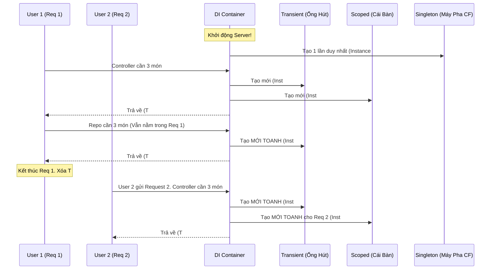

# Vòng đời Dependency Injection (DI Lifecycles) {#di-lifecycles}

:::info Mục tiêu bài học
- Thấu hiểu 3 vòng đời cấu thành nên toàn bộ hệ thống ASP.NET Core (và các Framework web hiện đại): **Transient**, **Scoped**, **Singleton**.
- Dùng tư duy "Cuộc đời con người" (Analogies) để cắt nghĩa triệt để sự khác nhau giữa chúng.
- Vẽ sơ đồ Mermaid mô phỏng luồng chảy của HTTP Request xuyên qua các Vòng đời.
- Bóc trần thảm họa **Captive Dependency (Bắt cóc phụ thuộc)**: Lý do phổ biến nhất khiến máy chủ web bị rò rỉ RAM (Memory Leak) và Crash.
:::

## 1. Lời mở đầu: Thế lực thứ 3 kiểm soát sự sống {#introduction}

Trong bài viết [Nguyên lý DIP (Dependency Inversion)](/docs/solid/dip), chúng ta đã biết rằng các Class tuyệt đối không được dùng từ khóa `new` để tạo ra đối tượng. Vậy thì ai tạo?
Câu trả lời là: **DI Container** (Được gọi thân thương là Bộ điều phối / IoC Container).

Khi ứng dụng Web (Ví dụ ASP.NET Core) vừa khởi động, bạn (Kiến trúc sư) sẽ nộp cho DI Container một bản danh sách đăng ký:
*"Này Container, nếu có một Controller nào đó đòi xin cái Interface `IDatabase`, thì mầy hãy đẻ ra cho nó cái Class `SqlDatabase` nhé."*

Nhưng DI Container sẽ hỏi ngược lại bạn một câu chí mạng: 
> *"Ok, tôi sẽ đẻ ra con `SqlDatabase` đó. Nhưng **VÒNG ĐỜI** của nó sẽ như thế nào? Đẻ ra xong rồi giết ngay, hay giữ lại cho người khác xài chung?"*

Bạn bắt buộc phải chỉ định vòng đời (Lifecycle) thông qua 3 cấu hình: `AddTransient`, `AddScoped`, hoặc `AddSingleton`. Chọn sai 1 cái, ứng dụng của bạn sẽ nổ tung khi có hàng ngàn User truy cập cùng lúc.

---

## 2. Giải mã 3 Cảnh giới Vòng đời (Lifecycles) {#lifecycles}

Hãy tưởng tượng bạn đang vào một Quán Cà Phê (Máy chủ Web). Bạn là một HTTP Request (Request 1). Bạn order một ly Trà Sữa (Đối tượng A).

### 2.1. Transient (Kẻ qua đường)

**Khái niệm:** Dùng một lần rồi vứt (Tạo mới liên tục).
- Cứ mỗi lần bất kỳ Class nào xin Đối tượng, DI Container sẽ gọi `new` để tạo ra một bản sao mới cáu cạnh.
- Xin 10 lần $\rightarrow$ Đẻ ra 10 Object khác nhau. Xài xong thì thùng rác thu dọn (Garbage Collector).

**Analogy Quán Cà phê:** Cái Ống Hút. Bất cứ khách nào gọi nước, nhân viên đều bóc một cái Ống Hút mới tinh đưa cho khách. Khách khác tới, đưa ống hút mới. Hút xong quăng sọt rác, tuyệt đối không ai xài lại ống hút của ai.

**Cấu hình ASP.NET Core:**
```csharp
builder.Services.AddTransient<ITaxCalculator, TaxCalculator>();
// Ứng dụng: Chuyên dùng cho các Class chứa logic toán học nhẹ nhàng, 
// không lưu trữ State (không có biến private chứa dữ liệu).
```

### 2.2. Scoped (Người đồng hành)

**Khái niệm:** Sống chết cùng một Request. Chia sẻ trong nội bộ Request đó.
- Khi User A bấm Gửi Request (Click Submit). HTTP Request 1 bắt đầu. 
- Trong suốt quá trình xử lý Request 1 này, dù Controller xin 1 lần, hay Repository xin 10 lần, DI Container chỉ đẻ ra **ĐÚNG 1** Object và cho tất cả xài chung. 
- Khi Request 1 kết thúc (Trả về Response cho User A), Object đó sẽ bị phá hủy. 
- Nhưng, nếu User B bắn Request 2 tới, User B sẽ có một Object mới tinh của riêng họ. Tình anh em (Scope) chỉ nằm trong nội bộ một Request.

**Analogy Quán Cà phê:** Cái Bàn. Bạn và đám bạn đi chung (1 Request) sẽ ngồi chung 1 cái Bàn. Mấy bạn làm gì trên cái Bàn đó (chia sẻ đồ ăn) thì tùy. Khách bàn khác (Request 2) không được phép qua ngồi chung hay ăn chung đồ trên Bàn của bạn. Khi các bạn đứng dậy đi về, nhân viên dọn dẹp sạch Bàn (Hủy Object).

**Cấu hình ASP.NET Core:**
```csharp
builder.Services.AddScoped<IUserRepository, UserRepository>();
// Ứng dụng quan trọng nhất: DbContext (Kết nối Database) của Entity Framework!
// Việc xài chung DbContext trong 1 Request giúp bạn chạy nhiều hàm Save(), Delete(), 
// nhưng cuối cùng chỉ tạo đúng 1 Transaction Database. Cực kỳ an toàn!
```

### 2.3. Singleton (Bậc đế vương)

**Khái niệm:** Trường sinh bất tử. (Đã phân tích kỹ trong bài [Singleton Pattern](/docs/patterns/singleton)).
- DI Container đẻ nó ra đúng 1 lần đầu tiên và GIỮ MÃI MÃI TRONG RAM.
- User A xin, User B xin, Request 1 hay Request 1 triệu... tất cả đều lấy chung ĐÚNG 1 Object đó ra xài. Chỉ khi nào tắt Server (Tắt Terminal), Object đó mới chết.

**Analogy Quán Cà phê:** Cái Máy Pha Cà Phê. Cả quán bự chỉ có 1 cái máy pha. Tất cả mọi nhân viên đều phải xài chung cái máy đó để pha cho mọi khách hàng.

**Cấu hình ASP.NET Core:**
```csharp
builder.Services.AddSingleton<ICacheManager, RedisCacheManager>();
// Ứng dụng: Cache, Biến cấu hình (Configuration), File Logger. 
// Khởi tạo rất nặng và tốn thời gian nên chỉ tạo 1 lần.
```

**Lưu ý về HttpClient:** Đừng bao giờ tự `new HttpClient()` khắp nơi trong code (tạo mới mỗi Request sẽ làm cạn kiệt Socket) mà cũng đừng nhốt nó thành Singleton (cấu hình DNS sẽ không bao giờ được làm mới). Hãy dùng `IHttpClientFactory` — được đăng ký sẵn vào DI Container qua `builder.Services.AddHttpClient()` — vì nó quản lý và tái sử dụng `HttpMessageHandler` theo vòng đời đúng đắn.

---

## 3. Hoạt ảnh Request Flow (Mermaid Trace) {#visualizer}

Cùng nhìn dòng chảy của 3 loại Vòng đời này khi có 2 User (HTTP Request 1 và 2) cùng gửi tới Server.



---

## 4. Sát thủ kiến trúc: Captive Dependency (Bắt cóc phụ thuộc) {#captive-dependency}

Đây là lỗi kinh điển nhất mà ngay cả Lập trình viên đi làm nhiều năm vẫn gặp phải, gây ra hiện tượng sập máy chủ vô cớ.

**Quy tắc sinh tồn của DI:**
> *"Một Class có Vòng đời DÀI (Ví dụ Singleton) KHÔNG BAO GIỜ được phép Inject một Class có Vòng đời NGẮN (Ví dụ Scoped/Transient) vào bụng nó!"*

**Kịch bản Bắt Cóc:**
Bạn đăng ký `EmailService` là **Singleton** (Tồn tại vĩnh viễn).
Nhưng trong hàm tạo (Constructor) của EmailService, bạn lại xin (Inject) thằng `DbContext` (Kết nối Database) vốn là hàng **Scoped** (Sống ngắn).

Chuyện gì xảy ra khi Request 1 chạy?
1. DI Container cấp phát `DbContext` (Inst #1) cho `EmailService`.
2. `EmailService` cất `DbContext` (Inst #1) vào bụng nó (Thành biến toàn cục).
3. Request 1 kết thúc. Lẽ ra thằng `DbContext` (Inst #1) phải chết (Hủy kết nối DB). Nhưng không, nó đang bị `EmailService` "bắt cóc" giữ chặt lại trong bụng. Rò rỉ (Leak) kết nối thứ nhất!
4. Request 2, 3, 4 chạy tới. DI Container không cấp `DbContext` mới cho Email, vì Email là Singleton nó chỉ Inject hàm tạo đúng 1 lần đầu. 
5. Hậu quả: Toàn bộ ngàn Request tiếp theo sẽ Đâm Dầu vào xài chung ĐÚNG 1 CÁI `DbContext` (Inst #1) bị kẹt đó. `DbContext` của Entity Framework **KHÔNG PHẢI LÀ THREAD-SAFE (Không hỗ trợ Đa luồng)**. Hàng ngàn Request chọc vào chung 1 cái DbContext cùng lúc sẽ gây ra lỗi `InvalidOperationException: A second operation was started on this context instance before a previous operation completed`.

**Máy chủ sụp đổ!**

### Sơ đồ Quy tắc bắt cóc (Cheat sheet)

Ai được phép tiêm ai? (Ai bọc được ai?)

| Lớp ngoài (Người bọc) | Tiêm Singleton vào | Tiêm Scoped vào | Tiêm Transient vào |
| :--- | :---: | :---: | :---: |
| **Singleton** | ✅ Tốt | ❌ CHẾT NGƯỜI (Captive) | ⚠️ Nguy hiểm (Biến Transient thành Singleton) |
| **Scoped** | ✅ Tốt | ✅ Tốt | ✅ Tốt |
| **Transient** | ✅ Tốt | ✅ Tốt | ✅ Tốt |

*(Rất may mắn, kể từ ASP.NET Core 2.0 trở đi, Microsoft đã bổ sung tính năng Tự Động Quét Lỗi Captive Dependency trong quá trình khởi động ở môi trường `Development`. DI Container sẽ lập tức ném ra ngoại lệ (throw) ngay lúc khởi động, ngăn không cho Server chạy nếu bạn lỡ tay tiêm lộn xộn!)*

:::tip Tóm tắt nhanh (Key Takeaways)
- Vòng đời DI kiểm soát sự phát nổ của RAM trong máy chủ Web.
- **Transient:** Dễ dãi nhất, xin là cho mới. Rất an toàn, nhưng xin nhiều quá tốn bộ nhớ dọn rác (GC).
- **Scoped:** Người hùng của Web. Bảo toàn 1 trạng thái nhất quán trong suốt vòng đời của 1 HTTP Request. Bắt buộc dùng cho `DbContext`.
- **Singleton:** Lãnh chúa độc tôn. Dùng cho Bộ Đệm (Cache), Cấu hình (Config). Phải tự viết Code chống Đa luồng (Thread-safe) cực cẩn thận.
- TUYỆT ĐỐI không Inject Scoped vào Singleton. Nếu không, máy chủ của bạn sẽ sập trong ngày đầu tiên lên Production.
:::

---

## Next Steps {#next-steps}

- [Cơ bản về DI & IoC](/docs/di/basics): Quay lại nền tảng, hiểu cách DI Container đăng ký hợp đồng (Interface) và tự động lắp ráp hệ thống.
- [Các mẫu nâng cao trong DI](/docs/di/advanced): Khám phá Constructor Injection, Factory/Delegate registration và các kỹ thuật tiêm tiên tiến khác.
- [Keyed Services (.NET 8)](/docs/di/keyed-services): Đăng ký nhiều cài đặt cho cùng một hợp đồng và chọn đúng cái cần thiết khi runtime.

## 📚 Tham khảo lý thuyết

- Sách **Dependency Injection in .NET** (Mark Seemann) — Tác phẩm kinh điển giải thích triệt để các khái niệm Lifetime, Composition Root và Captive Dependency.
- Microsoft Learn — [Dependency injection in .NET](https://learn.microsoft.com/en-us/dotnet/core/extensions/dependency-injection): tài liệu chính thức về vòng đời `Transient`, `Scoped`, `Singleton` trong .NET.
- Microsoft Learn — [Dependency injection guidelines](https://learn.microsoft.com/en-us/dotnet/core/extensions/dependency-injection-guidelines): khuyến nghị chính thức về Captive Dependency, scoped trong singleton và kiểm soát vòng đời service.
- Wikipedia — [Dependency injection](https://en.wikipedia.org/wiki/Dependency_injection): tổng quan lý thuyết về DI và các kiểu tiêm phụ thuộc.
- Martin Fowler — [Inversion of Control Containers and the Dependency Injection pattern](https://martinfowler.com/articles/injection.html): bài kinh điển phân tích sâu về IoC Container và mối quan hệ với DI.
