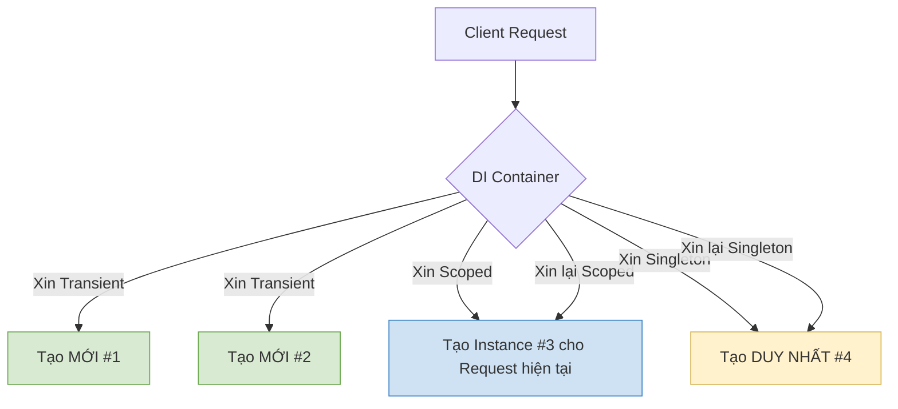

# Vòng đời DI (Lifecycles) {#lifecycles}

Khi bạn giao phó quyền khởi tạo đối tượng (gọi hàm `new`) cho một **DI Container**, bạn phải chỉ định rõ cho Framework biết: *"Đối tượng này sau khi được tạo ra sẽ sống được bao lâu?"*

Nếu đối tượng nào cũng sống vĩnh viễn (như Singleton), RAM của bạn sẽ nhanh chóng bị quá tải. Nếu đối tượng nào cũng tạo mới liên tục, CPU sẽ chạy kiệt sức vì chi phí dọn rác (Garbage Collector).

Để giải bài toán này, .NET Core thiết kế 3 cấp độ vòng đời kinh điển: **Transient**, **Scoped**, và **Singleton**.

## 1. Transient (Thoáng qua) {#transient}

**Quy tắc:** Tạo MỚI mỗi khi được yêu cầu.

Bất cứ khi nào có một Class yêu cầu đối tượng này thông qua Constructor, DI Container sẽ ngay lập tức gọi lệnh `new` để tạo ra một phiên bản hoàn toàn mới cứng. Kể cả khi 2 Class cùng xin trong 1 HTTP Request, hệ thống cũng tạo ra 2 bản sao độc lập.

- **Đăng ký:** `services.AddTransient<IService, MyService>();`
- **Hình ảnh thực tế:** Giống như tờ khăn giấy dùng 1 lần ở quán ăn. Ai cần cũng được phát 1 tờ mới tinh, xài xong vứt (bị GC thu hồi ngay).
- **Khi nào nên dùng?**
  - Dành cho các Class chứa logic tính toán nhẹ nhàng, không lưu trạng thái (Stateless).
  - Dành cho các Service chạy đa luồng cực nhanh mà không muốn bị đụng độ biến.

## 2. Scoped (Phạm vi) {#scoped}

**Quy tắc:** Tạo MỘT LẦN duy nhất trong MỖI PHẠM VI (Một Request).

Khái niệm "Phạm vi" (Scope) trong lập trình Web thường ám chỉ 1 HTTP Request. Khi người dùng A gửi yêu cầu lên Web API, hệ thống mở một Scope. Nếu trong quá trình xử lý yêu cầu đó, có 5 Class cùng xin đối tượng này, DI Container chỉ tạo `new` đúng 1 lần ở Class đầu tiên, 4 Class sau sẽ xài ké. Khi Request kết thúc trả về cho Client, Scope bị hủy, đối tượng cũng chết theo. Nếu người dùng B gửi request khác, một đối tượng mới lại được sinh ra.

- **Đăng ký:** `services.AddScoped<IService, MyService>();`
- **Hình ảnh thực tế:** Giống như một bàn tiệc (Request). Bàn số 1 gọi một chai nước mắm (Scoped Service). Tất cả mọi người ở Bàn 1 xài chung chai nước mắm đó. Bàn số 2 sẽ có chai nước mắm khác. Không ai xài chung của ai.
- **Khi nào nên dùng?**
  - CỰC KỲ QUAN TRỌNG cho **Database Context (EF Core)**. Mọi thao tác lưu/xóa/sửa trong 1 request cần dùng chung 1 kết nối DB để đảm bảo tính toàn vẹn Giao dịch (Transaction).
  - Các Service liên quan đến xác thực người dùng (User Session / Claims) trong cùng 1 request.

## 3. Singleton (Duy nhất) {#singleton}

**Quy tắc:** Tạo MỘT LẦN DUY NHẤT trong suốt vòng đời của Ứng dụng.

Ngay khi đối tượng được yêu cầu lần đầu tiên, DI Container sẽ khởi tạo nó và giữ nó sống mãi trong RAM. Tất cả mọi Request từ tất cả người dùng, mọi Class đều được phát cho ĐÚNG CÙNG MỘT đối tượng đó.

- **Đăng ký:** `services.AddSingleton<IService, MyService>();`
- **Hình ảnh thực tế:** Giống như ông Chủ quán. Cả ngàn khách hàng đến quán đều chỉ giao tiếp với đúng 1 ông chủ đó.
- **Khi nào nên dùng?**
  - Cấu hình ứng dụng (App Configs), File ghi log (Logger).
  - Các Dịch vụ lưu Cache (MemoryCache) dùng chung cho mọi người.
  - Các kết nối tốn rất nhiều tài nguyên để mở (như Connection Pool của Redis, RabbitMQ).

## Bảng so sánh nhanh (Cheat Sheet) {#cheat-sheet}

| Vòng đời | Tần suất tạo mới | Khả năng chia sẻ | Rủi ro Đa luồng (Multi-threading) |
| :--- | :--- | :--- | :--- |
| **Transient** | Gọi là tạo mới ngay | Không chia sẻ | Thấp nhất (Ai xài nấy chịu) |
| **Scoped** | 1 lần / 1 Request | Chia sẻ trong cùng 1 Request | Trung bình |
| **Singleton** | 1 lần duy nhất từ lúc chạy App | Chia sẻ cho TOÀN BỘ ứng dụng | RẤT CAO! (Bắt buộc phải dùng Lock, hoặc Class không được lưu biến thay đổi) |

:::warning Lỗi kinh điển: Captive Dependency
Đây là lỗi 99% các Lập trình viên .NET mới vào nghề đều dính.
**Luật thép:** Một Service có vòng đời DÀI HƠN không bao giờ được phép Consume (Nuốt) một Service có vòng đời NGẮN HƠN.

**Ví dụ:** Nếu bạn lấy một `Singleton` (Sống vĩnh viễn) mà Inject một thằng `Scoped` (DB Context) vào hàm khởi tạo của nó. Thằng Singleton sẽ "giam cầm" (Captive) thằng Scoped đó mãi mãi! Kết quả? Kết nối Database không bao giờ bị đóng lại, ứng dụng của bạn sẽ chết ngắc vì rò rỉ bộ nhớ (Memory Leak) và cạn kiệt Connection Pool.
:::

## Next Steps {#next-steps}

Quản lý tốt Vòng đời là bạn đã nắm được 80% sức mạnh của DI. Thế nhưng, đời không như là mơ. Sẽ có những lúc bạn gặp phải tình trạng "Gà và Trứng": Class A yêu cầu Class B, Class B lại yêu cầu Class A. Hoặc bạn muốn tự quyết định sẽ Inject lớp nào tùy thuộc vào biến môi trường chạy lúc đó.

Làm thế nào để xử lý các ca khó đẻ này? Hãy bước sang bài viết cuối cùng của toàn bộ giáo trình: **Các mẫu nâng cao (Advanced DI)**.

  <a class="vt-box" href="/docs/di/advanced">
    
Mẫu Nâng cao DI (Advanced DI)

    
Giải quyết Circular Dependency, Factory DI, và Scrutor Scanning.

  </a>

