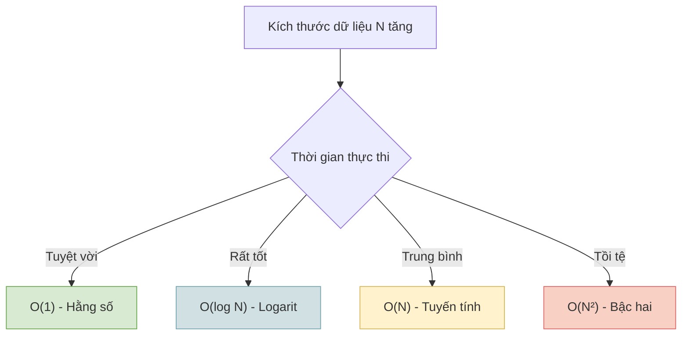

# Độ phức tạp & Ký hiệu O Lớn {#big-o}

Khi viết code, đặc biệt là trong các dự án thực tế, một thuật toán không chỉ cần "chạy đúng" mà còn phải "chạy nhanh" và "tiết kiệm tài nguyên". Để đo lường điều này một cách khoa học mà không phụ thuộc vào sức mạnh của CPU hay RAM của từng máy tính, các Kỹ sư phần mềm sử dụng **Ký hiệu O Lớn (Big O Notation)**.

Big O mô tả **tốc độ tăng trưởng** của một thuật toán khi **kích thước dữ liệu đầu vào ($N$)** ngày càng lớn.

## Thời gian (Time) vs Không gian (Space) {#time-vs-space}

Khi đánh giá một thuật toán, chúng ta quan tâm đến hai yếu tố chính:
1. **Độ phức tạp Thời gian (Time Complexity):** Thuật toán sẽ mất bao nhiêu bước để hoàn thành khi $N$ tăng lên? (Thường được ưu tiên hàng đầu).
2. **Độ phức tạp Không gian (Space Complexity):** Thuật toán sẽ ngốn thêm bao nhiêu bộ nhớ RAM khi $N$ tăng lên?

## Các Độ phức tạp phổ biến trong C# {#common-complexities}

Dưới đây là các loại Big O phổ biến nhất xếp từ hiệu suất tốt nhất đến kém nhất.



### 1. O(1) – Thời gian Hằng số (Constant Time)

Thuật toán thực thi với một lượng thời gian cố định, **bất kể** dữ liệu đầu vào có 10 phần tử hay 1 tỷ phần tử. Đây là mức hiệu suất mơ ước.

```csharp
int[] numbers = { 10, 20, 30, 40, 50 };

// Lấy phần tử ở vị trí index = 2
// C# biết chính xác ô nhớ của phần tử này, không cần phải duyệt mảng.
int x = numbers[2]; 
```

**Ví dụ phổ biến:** 
- Truy cập phần tử của mảng qua Index.
- Đọc/Ghi dữ liệu vào `Dictionary<K, V>` hoặc `HashSet<T>`.

### 2. O(log N) – Thời gian Logarit (Logarithmic Time)

Khi dữ liệu tăng lên, số bước thực hiện cũng tăng, nhưng **tăng rất rất chậm**. Đây là đặc trưng của các thuật toán "chia để trị" (thường cắt đôi dữ liệu sau mỗi bước).

```csharp
// Tìm kiếm nhị phân (Binary Search) trên mảng đã sắp xếp
while (left <= right)
{
    int mid = left + (right - left) / 2;
    if (array[mid] == target) return mid;
    
    // Bỏ qua một nửa mảng không cần thiết!
    if (array[mid] < target) left = mid + 1;
    else right = mid - 1;
}
```

**Ví dụ phổ biến:** 
- Tìm kiếm nhị phân (Binary Search).
- Các thao tác trên Cây Nhị Phân Tìm Kiếm (BST) cân bằng.

### 3. O(N) – Thời gian Tuyến tính (Linear Time)

Số bước thực hiện tăng **tỉ lệ thuận** với số lượng dữ liệu đầu vào. Nếu bạn có 1,000 phần tử, vòng lặp sẽ chạy 1,000 lần.

```csharp
string[] names = { "Nam", "Lan", "Hương", "Tuấn" };

// Phải kiểm tra từng người một
foreach (var name in names)
{
    if (name == "Tuấn") 
    {
        Console.WriteLine("Tìm thấy!");
        break;
    }
}
```

**Ví dụ phổ biến:** 
- Vòng lặp `for` / `foreach` duyệt mảng hoặc `List<T>`.
- Các phương thức LINQ như `.Where()`, `.Select()`, `.ToList()`.

### 4. O(N²) – Thời gian Bậc hai (Quadratic Time)

Số bước thực hiện tăng theo **bình phương** của dữ liệu đầu vào. Nếu $N = 1,000$, số bước sẽ là $1,000,000$. Thuật toán sẽ cực kỳ chậm chạp và làm treo ứng dụng nếu dữ liệu lớn.

```csharp
int[] numbers = { 1, 2, 3, 4, 5 };

// Hai vòng lặp lồng nhau (Nested loops)
for (int i = 0; i < numbers.Length; i++)
{
    for (int j = 0; j < numbers.Length; j++)
    {
        Console.WriteLine($"{numbers[i]} - {numbers[j]}");
    }
}
```

**Ví dụ phổ biến:** 
- Sắp xếp Nổi bọt (Bubble Sort), Sắp xếp Chèn (Insertion Sort).
- Các vòng lặp lồng nhau vô tội vạ.

:::warning Lưu ý khi code C#
Khi đi phỏng vấn hoặc viết code hệ thống lớn, nếu bạn thấy mình đang viết 2 vòng `for` lồng nhau để tìm kiếm dữ liệu, hãy dừng lại và tự hỏi: *"Liệu mình có thể chuyển một mảng thành `Dictionary` để giảm độ phức tạp từ $O(N^2)$ xuống $O(N)$ hay không?"*.
:::

## Trực quan hóa tốc độ tăng trưởng {#growth-chart}

Để dễ hình dung, dưới đây là sự so sánh số lượng phép tính cần làm khi $N$ thay đổi:

| $N$ (Dữ liệu) | O(1) | O(log N) | O(N) | O(N²) |
| --- | --- | --- | --- | --- |
| **10** | 1 bước | ~3 bước | 10 bước | 100 bước |
| **100** | 1 bước | ~6 bước | 100 bước | 10,000 bước |
| **1,000** | 1 bước | ~9 bước | 1,000 bước | 1,000,000 bước |
| **1,000,000** | 1 bước | ~20 bước | 1,000,000 bước | 1,000,000,000,000 bước (Treo máy) |

## Next Steps {#next-steps}

Việc hiểu Big O là nền tảng để bạn chọn đúng cấu trúc dữ liệu. Ở bài tiếp theo, chúng ta sẽ lặn sâu xuống tầng thấp nhất của máy tính để xem **Bộ nhớ (Stack/Heap)** thực sự hoạt động ra sao khi code C# của bạn được thực thi.

<div class="vt-box-container next-steps">
  <a class="vt-box" href="/docs/intro/memory">
    <p class="next-steps-link">Bộ nhớ & Luồng thực thi</p>
    <p class="next-steps-caption">Phân biệt Stack và Heap, Reference type và Value type trong .NET.</p>
  </a>
</div>

## 📚 Tham khảo lý thuyết {#references}

Nguồn lý thuyết chính được dùng để biên soạn bài viết này:

- **Cormen, Leiserson, Rivest, Stein (CLRS) – *Introduction to Algorithms*, 3rd Edition (MIT Press):**
  - Chương 3 *Growth of Functions* — định nghĩa chặt chẽ về Ký hiệu O Lớn cùng khái niệm độ phức tạp thời gian và không gian.
  - Chương 2.3 *Designing Algorithms* — phân tích chi phí của Thuật toán Tìm kiếm Nhị phân, điển hình cho họ O(log N).
- **Dasgupta, Papadimitriou, Vazirani – *Algorithms* (McGraw-Hill, 2006):** Chương 0 *Prologue* — nền tảng đo lường chi phí thuật toán theo số bước thực thi thay vì thời gian đồng hồ trên từng máy tính.
- **Wikipedia – *Big O notation*:** Giải thích trực quan định nghĩa O Lớn, cách đọc ký hiệu và so sánh giữa các họ độ phức tạp O(1), O(log N), O(N), O(N²).
- **Wikipedia – *Binary search algorithm*:** Xác nhận số phép so sánh tối đa của Tìm kiếm Nhị phân là ⌊log₂(N)⌋ + 1, tức thuộc họ O(log N).
- **Wikipedia – *Bubble sort*:** Xác nhận độ phức tạp thời gian trung bình O(N²) của các thuật toán sắp xếp so sánh đơn giản.
- **Microsoft Learn – *System.Collections.Generic.Dictionary<TKey,TValue>*:** Tài liệu chính thức của .NET về thao tác truy cập trung bình O(1) của từ điển băm, được nhắc đến trong phần O(1).
- **Microsoft Learn – *Language Integrated Query (LINQ)*:** Tài liệu chính thức về các toán tử `.Where()`, `.Select()` duyệt tuyến tính danh sách với độ phức tạp O(N).
