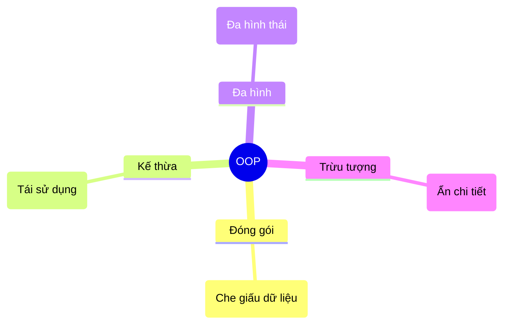

# Lập trình Hướng đối tượng trong C# {#introduction}

Chào mừng bạn đến với tài liệu hướng dẫn Lập trình Hướng đối tượng (OOP) và Kiến trúc phần mềm với C#. 

Tài liệu này không chỉ dạy bạn cú pháp, mà còn hướng dẫn bạn **cách tư duy** như một Kỹ sư phần mềm (Software Engineer). Bạn sẽ học cách thiết kế những hệ thống lớn, dễ bảo trì, dễ mở rộng thông qua các nguyên lý thiết kế kinh điển đã được chứng minh qua thời gian.

## Lập trình Hướng đối tượng (OOP) là gì? {#what-is-oop}

Lập trình Hướng đối tượng (Object-Oriented Programming) là một mô hình lập trình dựa trên khái niệm về **"Đối tượng" (Objects)**. Thay vì tổ chức chương trình thành một chuỗi các hàm và logic (như lập trình thủ tục), OOP chia nhỏ thế giới thực thành các đối tượng có **Trạng thái (Dữ liệu/Thuộc tính)** và **Hành vi (Phương thức)**.

Ví dụ: Một đối tượng `User` có thể chứa trạng thái (Tên, Email, Tuổi) và hành vi (Đăng nhập, Đổi mật khẩu, Gửi tin nhắn).

Dưới đây là một ví dụ C# chạy được, minh họa cách một Class gom nhóm Trạng thái (thuộc tính) và Hành vi (phương thức) vào một Đối tượng duy nhất:

```csharp
using System;

public class User
{
    // Trạng thái (Thuộc tính)
    public string Name { get; set; }
    public string Email { get; set; }

    // Hành vi (Phương thức)
    public void SendMessage(string message)
    {
        Console.WriteLine($"{Name} nhận tin nhắn: {message}");
    }
}

public class Program
{
    public static void Main()
    {
        // Tạo và sử dụng Đối tượng
        var user = new User { Name = "Lan", Email = "lan@example.com" };
        user.SendMessage("Xin chào!");
    }
}
```

**Lưu ý:** C# là một ngôn ngữ thuần OOP. Mọi thứ trong C# (ngoại trừ một số kiểu nguyên thủy đặc biệt) đều là đối tượng. Nếu bạn muốn trở thành một chuyên gia C# hay .NET Developer, việc làm chủ OOP là bắt buộc.

## 4 Trụ cột của Lập trình Hướng đối tượng {#four-pillars}

Để một ngôn ngữ được coi là hỗ trợ OOP, nó phải cung cấp các cơ chế cho 4 nguyên lý cốt lõi sau. Chúng tôi gọi đây là "4 Trụ cột của OOP":



1. **[Đóng gói (Encapsulation)](/docs/oop/encapsulation):** Che giấu trạng thái nội bộ của đối tượng và yêu cầu mọi tương tác phải thông qua các phương thức của đối tượng đó.
2. **[Kế thừa (Inheritance)](/docs/oop/inheritance):** Cho phép tạo một lớp mới dựa trên một lớp đã có, tái sử dụng code và thiết lập quan hệ "is-a" (là một).
3. **[Đa hình (Polymorphism)](/docs/oop/polymorphism):** Cho phép các đối tượng thuộc các lớp khác nhau phản hồi cùng một lời gọi hàm theo những cách riêng biệt.
4. **[Trừu tượng (Abstraction)](/docs/oop/abstraction):** Che giấu sự phức tạp của quá trình thực thi, chỉ bộc lộ những giao diện và tính năng cần thiết nhất.

## Vượt ra ngoài OOP: Kiến trúc phần mềm {#beyond-oop}

Viết được code OOP không có nghĩa là bạn viết ra code "tốt". Một lớp có thể chứa 10,000 dòng code, trộn lẫn đủ thứ logic từ truy xuất database đến giao diện người dùng. Để tránh thảm họa đó, chúng ta sẽ tiếp tục học:

- **[Nguyên lý SOLID](/docs/solid/srp):** 5 nguyên lý thiết kế đỉnh cao của Robert C. Martin (Uncle Bob) giúp code trở nên "Sạch" (Clean Code).
- **[Design Patterns](/docs/patterns/singleton):** Các giải pháp đã được tiêu chuẩn hóa cho các vấn đề lặp đi lặp lại trong thiết kế phần mềm (Gang of Four).
- **[Dependency Injection (DI)](/docs/di/basics):** Kỹ thuật tiêm sự phụ thuộc, linh hồn của ASP.NET Core hiện đại, giúp hệ thống lỏng lẻo (loosely coupled) và dễ dàng viết Unit Test.

## Prerequisites (Yêu cầu đầu vào) {#prerequisites}

Để có thể theo dõi tốt loạt tài liệu này, bạn cần:

- Đã cài đặt [Visual Studio 2022](https://visualstudio.microsoft.com/) hoặc [Rider](https://www.jetbrains.com/rider/) / VS Code.
- Đã cài đặt [.NET 8.0 SDK](https://dotnet.microsoft.com/en-us/download/dotnet/8.0) trở lên.
- Có kiến thức cơ bản về cú pháp C# (biến, vòng lặp `for`, `while`, câu lệnh điều kiện `if`, `switch`).

:::tip Bắt đầu nhanh
Nếu bạn muốn thực hành ngay các đoạn code trong giáo trình này, hãy mở Terminal (hoặc Command Prompt) và tạo một Project C# Console rỗng bằng các lệnh sau:

```bash
# 1. Tạo thư mục mới và khởi tạo project
dotnet new console -n DSA_Practice
cd DSA_Practice

# 2. Bạn có thể paste code ví dụ vào file Program.cs sau đó chạy thử bằng lệnh:
dotnet run
```
:::

**Tích hợp cùng Visualization:**
Tài liệu này được đi kèm với các mô-đun **Trực quan hóa (Visualization)**. Bất cứ khi nào bạn thấy một khái niệm khó hiểu, hãy bấm sang tab "Trực quan hóa" để xem thuật toán hoặc vòng đời đối tượng hoạt động ra sao trên màn hình.

## Next Steps {#next-steps}

Hãy cùng bắt đầu hành trình bằng việc tìm hiểu trụ cột đầu tiên và quan trọng nhất để bảo vệ dữ liệu của bạn: Tính Đóng gói.

<div class="vt-box-container next-steps">
  <a class="vt-box" href="/docs/oop/encapsulation">
    <p class="next-steps-link">Đóng gói (Encapsulation)</p>
    <p class="next-steps-caption">Tìm hiểu cách bảo vệ trạng thái của đối tượng và che giấu chi tiết triển khai bên trong.</p>
  </a>
</div>

## 📚 Tham khảo lý thuyết

Để đào sâu hơn từng khái niệm trong bài, bạn có thể tham khảo các nguồn uy tín sau:

- **Lập trình Hướng đối tượng (OOP) & 4 trụ cột:** [Microsoft Learn — Object-Oriented programming (C#)](https://learn.microsoft.com/en-us/dotnet/csharp/fundamentals/tutorials/oop) và [Wikipedia — Object-oriented programming](https://en.wikipedia.org/wiki/Object-oriented_programming).
- **Nguyên lý SOLID:** Robert C. Martin (Uncle Bob), *Clean Architecture: A Craftsman's Guide to Software Structure and Design* (Prentice Hall, 2017) và [Wikipedia — SOLID](https://en.wikipedia.org/wiki/SOLID).
- **Design Patterns (Gang of Four):** Erich Gamma, Richard Helm, Ralph Johnson, John Vlissides, *Design Patterns: Elements of Reusable Object-Oriented Software* (Addison-Wesley, 1994) và [Wikipedia — Design Patterns](https://en.wikipedia.org/wiki/Design_Patterns).
- **Dependency Injection (DI) & IoC:** [Microsoft Learn — Dependency injection in ASP.NET Core](https://learn.microsoft.com/en-us/aspnet/core/fundamentals/dependency-injection) và Mark Seemann, *Dependency Injection in .NET* (Manning, 2019).
