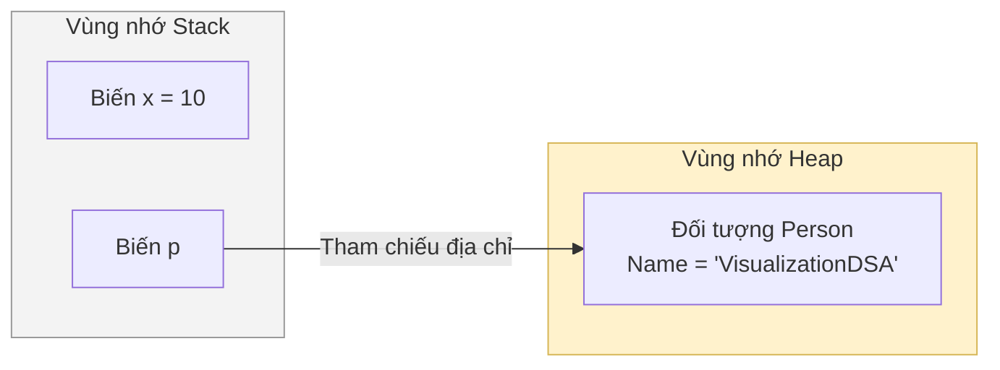

# Bộ nhớ & Luồng thực thi {#memory}

Để trở thành một lập trình viên C# xuất sắc, bạn không chỉ cần biết cách viết code chạy được, mà còn phải hiểu **chương trình của mình sống ở đâu và tiêu thụ bộ nhớ như thế nào**. 

Trong C# và .NET, bộ nhớ RAM được chia thành hai khu vực chính để lưu trữ dữ liệu khi chương trình đang chạy: **Stack** (Ngăn xếp) và **Heap** (Đống).

## 1. Vùng nhớ Stack (Ngăn xếp) {#stack}

**Stack** là một vùng nhớ đặc biệt dùng để quản lý luồng thực thi (execution flow) của các phương thức và lưu trữ các dữ liệu tạm thời.

- **Cấu trúc LIFO (Last-In, First-Out):** Giống như một chồng đĩa. Đĩa nào đặt vào sau cùng sẽ được lấy ra đầu tiên. Khi một hàm được gọi, nó được "đẩy" (push) vào Stack. Khi hàm chạy xong, nó bị "lấy ra" (pop) và bộ nhớ được giải phóng ngay lập tức.
- **Tốc độ cực nhanh:** Vì cấu trúc đơn giản, việc cấp phát và thu hồi bộ nhớ trên Stack diễn ra gần như tức thời.
- **Kích thước giới hạn:** Stack có giới hạn dung lượng khá nhỏ (thường là 1MB mỗi thread). Nếu bạn dùng đệ quy vô hạn, Stack sẽ bị tràn, gây ra lỗi khét tiếng `StackOverflowException`.
- **Chứa gì?** Local variables (Biến cục bộ) và các **Value Types** (Kiểu tham trị) như `int`, `double`, `bool`, `struct`.

## 2. Vùng nhớ Heap (Đống) {#heap}

**Heap** là một vùng nhớ rộng lớn dùng để lưu trữ các dữ liệu có vòng đời phức tạp hơn, không bị ràng buộc bởi việc hàm kết thúc hay chưa.

- **Cấu trúc tự do:** Dữ liệu được cấp phát rải rác.
- **Tốc độ chậm hơn:** Phải mất công tìm khoảng trống phù hợp để cấp phát, và việc truy cập dữ liệu thông qua con trỏ (pointer) từ Stack làm tốc độ chậm hơn một chút.
- **Dọn rác tự động (Garbage Collector - GC):** Khi một hàm kết thúc, dữ liệu trên Heap KHÔNG tự động biến mất. Thay vào đó, bộ thu gom rác (GC) của .NET sẽ thỉnh thoảng đi tuần tra. Nếu phát hiện dữ liệu nào không còn ai sử dụng (không còn biến nào ở Stack trỏ tới), nó mới dọn dẹp để trả lại RAM.
- **Chứa gì?** Các **Reference Types** (Kiểu tham chiếu) như `class`, `string`, `interface`, `delegate`, `array`.

## Trực quan hóa qua ví dụ Code {#code-example}

Hãy xem đoạn code sau và phân tích bộ nhớ:

```csharp
public class Person 
{
    public string Name; // Thuộc tính
}

public void MyMethod()
{
    int x = 10;                     // (1)
    Person p = new Person();        // (2)
    p.Name = "VisualizationDSA";    // (3)
}
```



**Chuyện gì xảy ra trong bộ nhớ?**
1. **Dòng (1):** Biến `x` là một `int` (Value Type) và là biến cục bộ. Nó được lưu trực tiếp trên **Stack**.
2. **Dòng (2):** 
   - Toán tử `new Person()` tạo ra một đối tượng thực sự. Vì `Person` là một `class` (Reference Type), toàn bộ đối tượng này được đặt vào **Heap**.
   - Biến `p` đóng vai trò là "con trỏ" (Reference). Bản thân biến `p` nằm trên **Stack**, và nó chứa **địa chỉ bộ nhớ** trỏ tới đối tượng trên Heap.
3. **Dòng (3):** Gán chuỗi vào thuộc tính. Chuỗi (`string`) cũng là Reference Type, nên nội dung chuỗi nằm trên Heap.

:::warning "Cú lừa" kinh điển về Value Type
Rất nhiều tài liệu cũ nói rằng: *"Value Types luôn nằm trên Stack"*. **Đây là thông tin sai lệch!**
Nếu một Value Type (như `int`) là **thuộc tính của một Class**, thì nó sẽ "đi theo" Class đó. Ví dụ: Nếu `Person` có thêm `public int Age;`, thì biến `Age` này sẽ nằm sát cạnh tên người dùng trên **Heap**, chứ không phải Stack!

Quy tắc chuẩn xác là: **"Biến nằm ở đâu thì dữ liệu của nó ở đó. Trừ khi nó là đối tượng của Class/Array, thì đối tượng luôn ném lên Heap."**
:::

## Tại sao bạn cần phải quan tâm? {#why-care}

Hiểu về Stack và Heap giúp bạn giải thích được hiện tượng Tham chiếu (Reference).

```csharp
Person p1 = new Person();
p1.Name = "Alice";

Person p2 = p1; // p2 không sao chép dữ liệu, nó chỉ sao chép "ĐỊA CHỈ"
p2.Name = "Bob";

Console.WriteLine(p1.Name); // In ra "Bob"! Vì p1 và p2 cùng trỏ chung một đối tượng trên Heap.
```

Nếu bạn không muốn điều này xảy ra, bạn cần hiểu và sử dụng `struct` thay vì `class` cho những cấu trúc dữ liệu nhỏ và bất biến, vì gán `struct` là **sao chép theo giá trị (copy by value)**: toàn bộ field được copy nguyên vẹn sang biến mới (nếu struct chứa field tham chiếu như `string`, thì bản sao của con trỏ được tạo ra chứ **không** phải Deep Copy). Điều này trái ngược với `class`: gán biến `class` chỉ copy **tham chiếu** — cả hai biến cùng trỏ về một đối tượng duy nhất trên Heap.

## Next Steps {#next-steps}

Chúc mừng bạn đã hoàn thành phần Nền tảng! Bạn đã nắm trong tay tư duy đánh giá thuật toán và cách máy tính phân bổ bộ nhớ. Bây giờ, hãy tiến vào thế giới của Thuật toán bằng cách mổ xẻ phương pháp sắp xếp đơn giản nhất: **Sắp xếp Nổi bọt (Bubble Sort)**.

<div class="vt-box-container next-steps">
  <a class="vt-box" href="/docs/sorting/bubble-sort">
    <p class="next-steps-link">Sắp xếp Nổi bọt (Bubble Sort)</p>
    <p class="next-steps-caption">Mô phỏng cách các bọt khí nổi lên mặt nước để sắp xếp dữ liệu.</p>
  </a>
</div>

## 📚 Tham khảo lý thuyết {#references}

Nội dung bài viết được biên soạn dựa trên các nguồn tài liệu uy tín dưới đây. Bạn có thể đào sâu thêm từng khái niệm chính bằng cách đọc theo từng mục:

- **Stack (Ngăn xếp), cấu trúc LIFO và quản lý bộ nhớ:** Wikipedia — [Stack (abstract data type)](https://en.wikipedia.org/wiki/Stack_(abstract_data_type)) mô tả nguyên lý Last-In, First-Out; [Memory management](https://en.wikipedia.org/wiki/Memory_management) giải thích sự khác biệt giữa cấp phát trên Stack (nhanh, giới hạn) và Heap (chậm hơn, linh hoạt hơn).
- **Cơ chế Garbage Collector (GC) trong .NET:** Microsoft Learn — [Fundamentals of garbage collection](https://learn.microsoft.com/en-us/dotnet/standard/garbage-collection/fundamentals) giải thích cách GC truy vết tham chiếu từ Stack tới Heap và dọn dẹp các đối tượng không còn được sử dụng.
- **Value Type và Reference Type trong C#:** Microsoft Learn — [Value types](https://learn.microsoft.com/en-us/dotnet/csharp/language-reference/builtin-types/value-types) và [Structure types (struct)](https://learn.microsoft.com/en-us/dotnet/csharp/language-reference/builtin-types/struct) trình bày quy tắc sao chép và phân bổ bộ nhớ của từng loại; cuốn sách kinh điển [CLR via C# (Jeffrey Richter)](https://www.microsoftpressstore.com/store/clr-via-c-sharp-9780735667457) là nguồn tham khảo sâu về mô hình bộ nhớ và cách thức hoạt động bên trong .NET.
- **Lỗi tràn Stack (StackOverflowException):** Microsoft Learn — [StackOverflowException Class](https://learn.microsoft.com/en-us/dotnet/api/system.stackoverflowexception) mô tả nguyên nhân tràn ngăn xếp xảy ra khi đệ quy quá sâu hoặc vô hạn.
