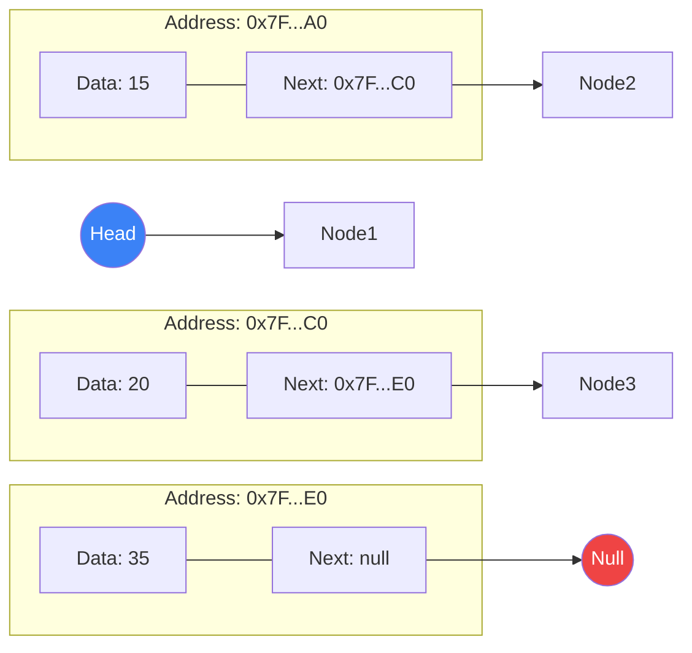
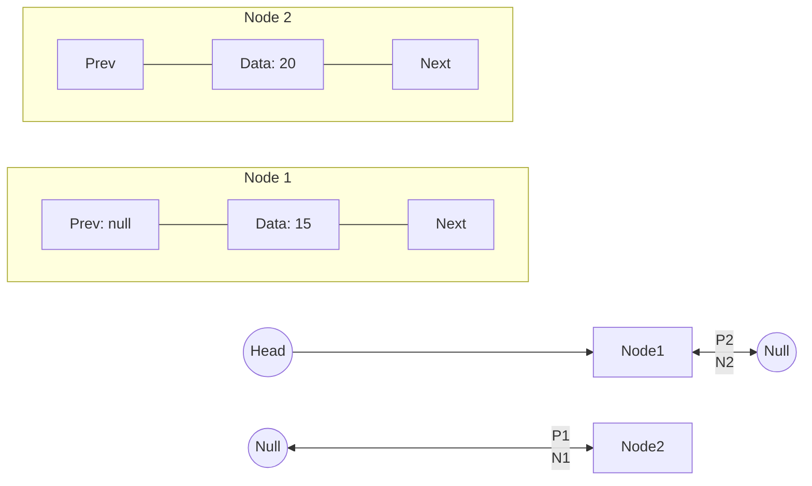
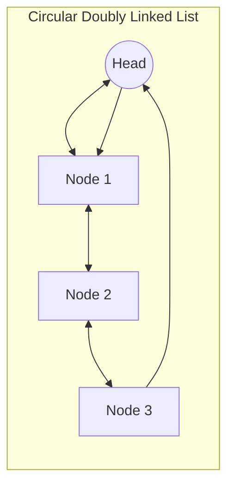
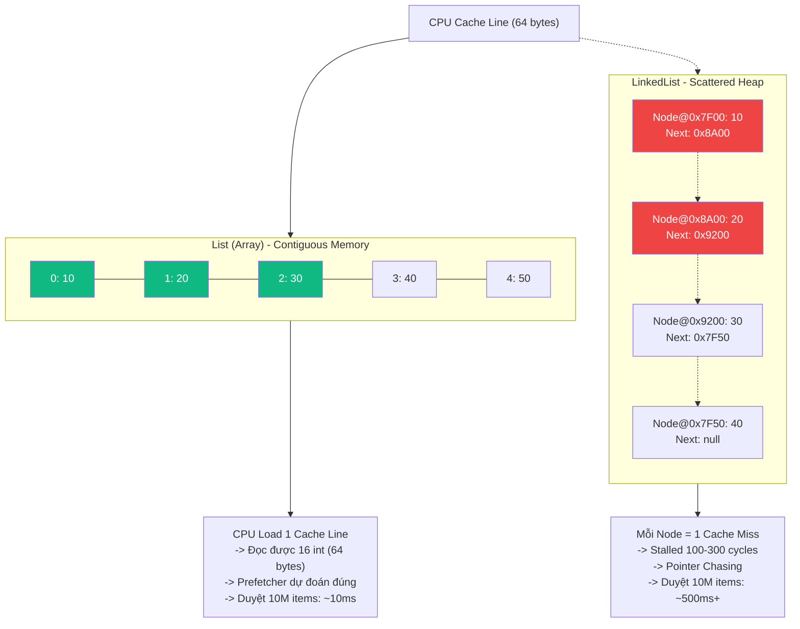

# Khái niệm & Phân loại Linked List {#linked-list-basics}

:::info Mục tiêu bài học
- Hiểu được khái niệm Danh sách Liên kết và sự khác biệt cốt lõi giữa nó với Mảng (Array) về mặt **Memory Layout** và **Cache Behavior**.
- Nắm được cách cấp phát bộ nhớ động của Linked List trên Heap.
- Phân biệt 3 loại Linked List phổ biến nhất: Singly, Doubly, và Circular.
- Hiểu tại sao `List<T>` (Array-based) thường nhanh hơn `LinkedList<T>` trong thực tế (Cache Locality).
- Nắm các thao tác cơ bản: Insert, Delete, Search, Reverse (Iterative & Recursive).
:::

## 1. Linked List là gì? {#what-is-linked-list}

Hãy tưởng tượng bạn cùng nhóm bạn đi xem phim. Nếu dùng **Mảng (Array)**, các bạn bắt buộc phải mua được một dãy ghế liền kề nhau. Nếu rạp phim còn trống 10 ghế nhưng nằm rải rác ở khắp các hàng, Mảng sẽ báo lỗi "Hết chỗ" (Hết bộ nhớ liên tục - Contiguous Memory).

Nhưng nếu dùng **Danh sách Liên kết (Linked List)**, các bạn không cần ngồi cạnh nhau. Mỗi người sẽ cầm một tờ giấy ghi lại **Số ghế của người tiếp theo**. Người thứ nhất chỉ chỗ cho người thứ hai, người thứ hai chỉ cho người thứ ba... Cứ như vậy, cả nhóm vẫn kết nối với nhau dù ngồi rải rác khắp rạp phim!

Về mặt kỹ thuật, Linked List là một cấu trúc dữ liệu tuyến tính, trong đó các phần tử (gọi là **Node**) **không được lưu trữ ở các vị trí bộ nhớ liền kề nhau**. Thay vào đó, mỗi Node sẽ chứa 2 phần thông tin:
1. **Dữ liệu (Data):** Thông tin cần lưu (ví dụ: con số 15).
2. **Con trỏ (Pointer / Next):** Địa chỉ bộ nhớ chỉ tới Node tiếp theo trong danh sách.



---

## 2. So sánh Sâu: Linked List vs Array (Mảng) {#deep-comparison}

Đây là phần **QUAN TRỌNG NHẤT** để quyết định khi nào dùng cái nào.

| Tiêu chí | Mảng (Array / `List<T>`) | Danh sách Liên kết (Linked List / `LinkedList<T>`) |
| :--- | :--- | :--- |
| **Cấp phát bộ nhớ** | **Liền kề (Contiguous)**. Cấp phát 1 block lớn. Kích thước cố định (Array) hoặc gấp đôi khi đầy (`List`). | **Phân tán (Scattered/Non-contiguous)**. Mỗi Node `new` riêng trên Heap. Kích thước linh hoạt. |
| **Truy cập phần tử (Random Access)** | **O(1)**. `array[index]` = `base_address + index * sizeof(T)`. CPU tính toán địa chỉ trực tiếp. | **O(N)**. Phải duyệt từ Head theo con trỏ `Next` lần lượt. Không thể nhảy tới index `i` ngay lập tức. |
| **Thêm/Xóa ở ĐẦU (Head)** | **O(N)**. Phải dịch chuyển toàn bộ phần tử sang phải/trái (`Array.Copy`). | **O(1)**. Chỉ tạo Node mới, trỏ `Next` -> Head cũ, cập nhật Head. |
| **Thêm/Xóa ở GIỮA (Known Node)** | **O(N)**. Dịch chuyển phần tử phía sau. | **O(1)**. Chỉ cần nối lại con trỏ `prev.Next = newNode; newNode.Next = next`. |
| **Thêm/Xóa ở CUỐI (Tail)** | **O(1) Amortized** (`List.Add`). | **O(1)** nếu có Tail pointer. **O(N)** nếu chỉ có Head (phải duyệt hết). |
| **Tốn bộ nhớ phụ (Overhead)** | **Thấp**. Chỉ dữ liệu. `List` thừa ~0-100% capacity. | **Cao**. Mỗi Node: Data + 1-2 Pointers (8/16 bytes trên 64-bit) + Object Header (16 bytes) + GC overhead. |
| **Cache Locality (QUAN TRỌNG)** | **Tuyệt vời**. Dữ liệu liền kề -> CPU Prefetcher load 64-byte Cache Line đọc nhiều item cùng lúc. Sequential scan cực nhanh. | **Kém**. Node phân tán RAM -> Mỗi `Next` là **Cache Miss** tốn ~100-300 cycles. Pointer chasing giết hiệu năng. |
| **Duyệt tuần tự (Foreach)** | **Rất nhanh** (Vectorization, Prefetch). | **Chậm** (Pointer chasing, Branch misprediction). |
| **Memory Fragmentation** | Không (1 block lớn). | **Có**. Rác nhựa (fragmentation) làm Heap phân mảnh, GC chậm hơn. |

> **Kết luận thực tế:** Trong 95% trường hợp trên C#/.NET, **`List<T>` nhanh hơn `LinkedList<T>`** dù Big O "xấu hơn" ở Insert/Delete middle. Chỉ dùng `LinkedList` khi: Cần Insert/Delete **RẤT NHIỀU** ở giữa, **KHÔNG** duyệt tuần tự nhiều, và N **RẤT LỚN** (triệu phần tử) để overhead dịch chuyển mảng thực sự thành vấn đề.

---

## 3. Các loại Danh sách Liên kết {#types}

### 3.1. Danh sách Liên kết Đơn (Singly Linked List)
Là loại cơ bản nhất. Mỗi Node chỉ biết đường đi tới Node **tiếp theo (Next)**. Bạn chỉ có thể đi một chiều từ đầu (Head) đến cuối (Tail). Nếu đi lố, bạn không thể quay lại!

```csharp
public class SinglyNode<T>
{
    public T Data;
    public SinglyNode<T> Next;
    public SinglyNode(T data) { Data = data; }
}
```

**Ứng dụng:** Stack, Queue (chỉ cần Head/Tail), Hash Table Chaining, Forward-only traversal.

### 3.2. Danh sách Liên kết Đôi (Doubly Linked List)
Bổ sung thêm con trỏ **Prev (Previous)**. Mỗi Node giờ đây biết cả đường đi tới Node phía trước và phía sau. Đánh đổi: ngốn bộ nhớ gấp ~1.5-2 lần Singly.

```csharp
public class DoublyNode<T>
{
    public T Data;
    public DoublyNode<T> Next;
    public DoublyNode<T> Prev;
    public DoublyNode(T data) { Data = data; }
}
```

*(Lưu ý: Class `LinkedList<T>` được tích hợp sẵn trong `System.Collections.Generic` chính là **Doubly Linked List**).*



**Ưu điểm:** Xóa NodeKnown O(1) (không cần tìm Prev), duyệt 2 chiều, dễ implement Deque/LRU Cache.

### 3.3. Danh sách Liên kết Vòng (Circular Linked List)
Con trỏ `Next` của phần tử cuối trỏ về `Head` (hoặc `Tail.Next = Head`). Không có `Null`.

*   **Singly Circular:** `Tail.Next = Head`.
*   **Doubly Circular:** `Head.Prev = Tail` và `Tail.Next = Head`.

**Ứng dụng thực tế:**
*   **Round Robin Scheduling** (OS CPU Scheduler): Các process xếp hàng vòng, CPU cho mỗi process 1 time slice.
*   **Alt-Tab / Task Switcher:** Danh sách ứng dụng đang mở, lặp vô tận.
*   **Music Playlist Repeat:** "Lặp lại danh sách phát".
*   **Game Loop:** Entity management (bullet pool, enemy pool).



---

## 4. Cài đặt Các Thao Tác Cơ Bản (Core Operations) {#operations}

### 4.1. Chèn vào Đầu (Prepend) - O(1)
```csharp
public void AddFirst(T data)
{
    var newNode = new DoublyNode<T>(data);
    if (Head == null) // Empty list
    {
        Head = Tail = newNode;
    }
    else
    {
        newNode.Next = Head;
        Head.Prev = newNode;
        Head = newNode;
    }
    Count++;
}
```

### 4.2. Chèn vào Cuối (Append) - O(1) với Tail Pointer
```csharp
public void AddLast(T data)
{
    var newNode = new DoublyNode<T>(data);
    if (Tail == null) // Empty list
    {
        Head = Tail = newNode;
    }
    else
    {
        Tail.Next = newNode;
        newNode.Prev = Tail;
        Tail = newNode;
    }
    Count++;
}
```

### 4.3. Chèn sau Node đã biết (Insert After Known Node) - O(1)
```csharp
// Giả sử 'node' là node đã có trong list (không phải null)
public void InsertAfter(DoublyNode<T> node, T data)
{
    var newNode = new DoublyNode<T>(data);
    newNode.Next = node.Next;
    newNode.Prev = node;
    
    if (node.Next != null)
        node.Next.Prev = newNode;
    else
        Tail = newNode; // Node là Tail cũ
    
    node.Next = newNode;
    Count++;
}
```

### 4.4. Xóa Node đã biết (Delete Known Node) - O(1) - **Ưu điểm lớn nhất của Doubly LL**
```csharp
public void Remove(DoublyNode<T> node)
{
    if (node.Prev != null)
        node.Prev.Next = node.Next;
    else
        Head = node.Next; // Xóa Head
    
    if (node.Next != null)
        node.Next.Prev = node.Prev;
    else
        Tail = node.Prev; // Xóa Tail
    
    // Help GC (optional but good practice)
    node.Next = node.Prev = null;
    Count--;
}
```

### 4.5. Tìm kiếm (Search) - O(N)
```csharp
public DoublyNode<T> Find(T value, Func<T, T, bool> comparer = null)
{
    comparer ??= EqualityComparer<T>.Default.Equals;
    var current = Head;
    while (current != null)
    {
        if (comparer(current.Data, value)) return current;
        current = current.Next;
    }
    return null;
}
```

### 4.6. Đảo ngược List (Reverse) - O(N)

**Cách 1: Iterative (Con trỏ 3 biến) - Khuyên dùng**
```csharp
public void ReverseIterative()
{
    DoublyNode<T> current = Head;
    DoublyNode<T> prev = null;
    DoublyNode<T> next = null;
    
    // Swap Head/Tail
    var temp = Head;
    Head = Tail;
    Tail = temp;
    
    while (current != null)
    {
        next = current.Next;    // Lưu Next
        current.Next = prev;    // Đảo Next
        current.Prev = next;    // Đảo Prev (vì Next cũ giờ thành Prev mới)
        prev = current;         // Tiến Prev
        current = next;         // Tiến Current
    }
}
```

**Cách 2: Recursive (Đệ quy) - Dễ hiểu nhưng nguy hiểm StackOverflow**
```csharp
public void ReverseRecursive()
{
    Head = ReverseRecursiveHelper(Head);
    // Cần cập nhật Tail và Prev pointers nữa -> Phức tạp, không khuyên dùng cho Doubly LL
}

private DoublyNode<T> ReverseRecursiveHelper(DoublyNode<T> node)
{
    if (node == null || node.Next == null) return node;
    var newHead = ReverseRecursiveHelper(node.Next);
    node.Next.Next = node;
    node.Next = null;
    return newHead;
}
```

---

## 5. C# `LinkedList<T>` Internals & Best Practices {#csharp-internals}

### Cấu trúc nội bộ (Simplified)
```csharp
// System.Collections.Generic.LinkedList
public class LinkedList<T> : ICollection<T>, IEnumerable<T>, ...
{
    private Node _head;      // First node
    private Node _tail;      // Last node
    private int _count;      // Count cache
    private int _version;    // For enumerator invalidation
    // ...
    
    internal class Node
    {
        public T Item;
        public Node Next;
        public Node Prev;
        public Node(T item) { Item = item; }
    }
}
```

### Các Method Quan Trọng
| Method | Độ phức tạp | Mô tả |
| :--- | :--- | :--- |
| `AddFirst(T)` / `AddLast(T)` | O(1) | Trả về `LinkedListNode<T>` (handle để dùng sau). |
| `AddBefore(node, T)` / `AddAfter(node, T)` | O(1) | Chèn liên quan đến node đã có. **Rất mạnh**. |
| `Remove(node)` | O(1) | Xóa node cụ thể (không tìm kiếm). |
| `RemoveFirst()` / `RemoveLast()` | O(1) | Xóa đầu/cuối. |
| `Find(T)` / `FindLast(T)` | O(N) | Tìm kiếm tuyến tính. Trả về `Node`. |
| `Clear()` | O(N) | Duyệt dọn dẹp (help GC break cycles). |

### Pattern: LRU Cache (Least Recently Used) - Ứng dụng kinh điển của Doubly LL + Dictionary
```csharp
public class LRUCache<TKey, TValue>
{
    private readonly int _capacity;
    private readonly Dictionary<TKey, LinkedListNode<KeyValuePair<TKey, TValue>>> _map;
    private readonly LinkedList<KeyValuePair<TKey, TValue>> _list; // Head = MRU, Tail = LRU

    public LRUCache(int capacity)
    {
        _capacity = capacity;
        _map = new Dictionary<TKey, LinkedListNode<...>>(capacity);
        _list = new LinkedList<...>();
    }

    public TValue Get(TKey key)
    {
        if (_map.TryGetValue(key, out var node))
        {
            // Move to Front (MRU)
            _list.Remove(node);
            _list.AddFirst(node);
            return node.Value.Value;
        }
        return default;
    }

    public void Put(TKey key, TValue value)
    {
        if (_map.TryGetValue(key, out var node))
        {
            node.Value = new KeyValuePair<TKey, TValue>(key, value);
            _list.Remove(node);
            _list.AddFirst(node);
        }
        else
        {
            if (_map.Count >= _capacity)
            {
                // Evict LRU (Tail)
                var lru = _list.Last;
                _map.Remove(lru.Value.Key);
                _list.RemoveLast();
            }
            var newNode = new LinkedListNode<...>(new KeyValuePair<TKey, TValue>(key, value));
            _list.AddFirst(newNode);
            _map[key] = newNode;
        }
    }
}
```

---

## 6. Memory Layout Visualization (Tại sao Array thắng Cache) {#memory-layout}



---

## 7. Bảng so sánh tóm tắt {#summary-table}

| Cần... | Dùng | Lý do |
| :--- | :--- | :--- |
| **Truy cập ngẫu nhiên (Random Access)** | `List<T>` / `T[]` | O(1) vs O(N) |
| **Duyệt tuần tự nhiều (Foreach, LINQ)** | `List<T>` / `T[]` | Cache locality, SIMD, Prefetch |
| **Thêm/Xóa đầu/cuối thường xuyên** | `List<T>` (Tail) / `LinkedList<T>` | Cả 2 O(1). List nhanh hơn do cache. |
| **Thêm/Xóa GIỮA RẤT NHIỀU (Known position)** | `LinkedList<T>` | O(1) vs O(N) shift. Chỉ khi N rất lớn (>100k) mới thấy chênh lệch. |
| **Queue / Stack** | `Queue<T>` / `Stack<T>` (Array-based) | Circular buffer, O(1), cache friendly. |
| **LRU Cache / MRU List** | `LinkedList<T>` + `Dictionary` | O(1) Move-to-front, Remove-tail. |
| **Hash Table Chaining** | `LinkedList<T>` (hoặc `List<T>`) | Insert O(1), Memory overhead chấp nhận được. |
| **Memory constrained / Embedded** | `T[]` / `List<T>` | Không overhead pointer, cache friendly. |

---

## 8. Quiz kiểm tra {#quiz}

<details class="vt-quiz">
<summary>❓ Quiz 1: Tại sao `List<int>.Add(1)` nhanh hơn `LinkedList<int>.AddLast(1)` mặc dù cả 2 O(1)?</summary>

**Đáp án:**
1.  **Allocation:** `List` chỉ alloc khi resize (gấp đôi, amortized O(1)). `LinkedList` alloc **mỗi lần Add** (Node object + header = ~24-32 bytes) -> GC pressure cao.
2.  **Cache:** `List` write sequential memory. `LinkedList` write scattered heap -> Cache miss.
3.  **Instruction Count:** `List.Add` ~5-10 instructions. `LinkedList.AddLast` ~20-30 instructions (alloc, init fields, link pointers, version++).
</details>

<details class="vt-quiz">
<summary>❓ Quiz 2: `LinkedListNode<T>` được trả về từ `AddFirst`/`AddLast` có ý nghĩa gì? Tại sao không trả về `bool`?</summary>

**Đáp án:** Trả về **Handle (Con trỏ đến Node)** để cho phép **O(1) Insert/Remove tại vị trí đó sau này** (`AddAfter(node, x)`, `Remove(node)`). Nếu chỉ trả `bool`, bạn sẽ phải `Find(value)` O(N) lần sau để lấy node -> Mất hết lợi thế O(1) của Linked List.
</details>

<details class="vt-quiz">
<summary>❓ Quiz 3: Khi duyệt `foreach` trên `LinkedList`,Enumerator có an toàn nếu list bị sửa đổi không?</summary>

**Đáp án:** **KHÔNG.** `LinkedList` có `_version` field. Mọi sửa đổi (Add/Remove/Clear) tăng `_version`. Enumerator check version ở mỗi `MoveNext()`. Nếu mismatch -> Throw `InvalidOperationException` ("Collection was modified"). Đây là hành vi chuẩn của tất cả Collection trong .NET.
</details>

---

## 9. Tóm tắt nhanh (Key Takeaways)

- **Linked List = Node (Data + Next/Prev) + Head/Tail Pointers.**
- **3 loại:** Singly (1 chiều), Doubly (2 chiều - C# standard), Circular (vòng).
- **Big O lý thuyết:** Insert/Delete Known Node O(1) thắng Array O(N). Search O(N) thua Array O(1).
- **Thực tế C#:** `List<T>` (Array) **thường nhanh hơn** `LinkedList<T>` nhờ **Cache Locality**, **SIMD**, **Ít Allocation**, **Ít GC Pressure**.
- **Dùng `LinkedList<T>` khi:** Cần **O(1) Remove/Insert tại giữa** với **Node handle đã biết**, và **ITERATE ÍT**. Ví dụ: LRU Cache, Undo/Redo Stack (Doubly), Hash Chaining.
- **Luôn dùng `LinkedListNode<T>` handle** từ `AddFirst/Last/Before/After` để tận dụng O(1) removal.

---

## Next Steps {#next-steps}

Bây giờ bạn đã hình dung được cấu trúc, memory layout, và trade-offs của Linked List. Ở bài tiếp theo, chúng ta sẽ đi sâu vào **cài đặt chi tiết các thao tác phức tạp** (Reverse, Merge, Detect Cycle, Find Middle, Palindrome Check) và **bài tập thực chiến** thường gặp trong phỏng vấn.

<div class="vt-box-container next-steps">
  <a class="vt-box" href="/docs/linked-list/linked-list-operations">
    <p class="next-steps-link">Thao tác nâng cao & Bài tập Linked List</p>
    <p class="next-steps-caption">Reverse (Iterative/Recursive), Detect Cycle (Floyd), Find Middle, Merge Sorted Lists, Palindrome, LRU Cache implementation.</p>
  </a>
</div>

## 📚 Tham khảo lý thuyết {#references}

Các kiến thức lý thuyết trong bài được tổng hợp và đối chiếu từ những nguồn học thuật sau:

- **Cấu trúc dữ liệu Linked List, Singly/Doubly/Circular, các phép toán cơ bản (Insert, Delete, Search, Reverse) và phân tích độ phức tạp:** Cormen, T. H., Leiserson, C. E., Rivest, R. L., & Stein, C., *Introduction to Algorithms* (CLRS), 3rd Edition, MIT Press, 2009 — Chương 10 *Elementary Data Structures* (mục 10.2 *Linked lists*).
- **Khái niệm tổng quan, cách phân bố bộ nhớ không liền kề và so sánh với Array:** Wikipedia, *Linked list* — https://en.wikipedia.org/wiki/Linked_list
- **API, cấu trúc nội bộ và các method của `LinkedList<T>`, `LinkedListNode<T>` trong .NET:** Microsoft Learn, *LinkedList\<T\> Class* — https://learn.microsoft.com/en-us/dotnet/api/system.collections.generic.linkedlist-1
- **Cài đặt minh họa và các bài toán ứng dụng (Reverse, Detect Cycle, Find Middle):** GeeksforGeeks, *Linked List Data Structure* — https://www.geeksforgeeks.org/data-structures/linked-list/
- **Vai trò của Cache Locality và bộ nhớ đệm trong phân tích hiệu năng cấu trúc dữ liệu:** MIT OpenCourseWare, *6.006 Introduction to Algorithms, Lecture 2: Data Structures* — https://ocw.mit.edu/courses/6-006-introduction-to-algorithms-spring-2020/