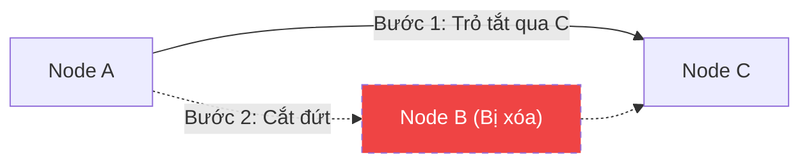

# Thao tác trên Linked List {#linked-list-operations}

:::info Mục tiêu bài học
- Học cách định nghĩa class `Node` đại diện cho một phần tử trong bộ nhớ.
- Hiểu và tự tay code 3 thao tác chèn: Chèn vào đầu, cuối, và vị trí bất kỳ.
- Nắm được kỹ năng gỡ rối (nối đứt dây) khi xóa phần tử.
:::

Trong bài này, chúng ta sẽ thực hành với **Danh sách liên kết Đơn (Singly Linked List)** vì nó là cơ sở để hiểu toàn bộ các loại danh sách khác.

## 1. Định nghĩa Cấu trúc Node {#define-node}

Trong C#, chúng ta sử dụng `class` để tạo cấu trúc dữ liệu lưu trên **Heap Memory**. Một Node sẽ bao gồm phần Dữ liệu (Data) và Con trỏ trỏ tới Node tiếp theo (Next).

```csharp
public class Node
{
    public int Data;
    public Node Next; // Trỏ đến một đối tượng Node khác

    public Node(int data)
    {
        Data = data;
        Next = null; // Mặc định khi tạo ra, Node chưa trỏ đi đâu cả
    }
}
```

Và một lớp `LinkedList` dùng để quản lý toàn bộ chuỗi các Node này, bằng cách giữ chặt lấy cái nút đầu tiên gọi là **Head**.

```csharp
public class SinglyLinkedList
{
    public Node Head; // Nắm được Head là nắm được toàn bộ danh sách
    
    public SinglyLinkedList()
    {
        Head = null;
    }
}
```

## 2. Chèn phần tử (Insertion) {#insertion}

Việc thêm phần tử vào Linked List không yêu cầu phải đẩy các phần tử khác ra xa như Mảng. Bạn chỉ cần điều chỉnh lại hướng trỏ của con trỏ (giống như rút phích cắm và cắm vào ổ khác).

### 2.1. Chèn vào đầu danh sách (Prepend)
**O(1) Time.** Rất đơn giản: Tạo Node mới $\rightarrow$ Trỏ `Next` của Node mới vào Head cũ $\rightarrow$ Cập nhật Head mới chính là Node này.

```csharp
public void InsertAtBeginning(int data)
{
    Node newNode = new Node(data);
    newNode.Next = Head;
    Head = newNode;
}
```

### 2.2. Chèn vào cuối danh sách (Append)
**O(N) Time.** Vì chúng ta chỉ giữ nút Head, muốn thêm vào cuối, ta phải duyệt từ Head tới khi nào gặp Node cuối cùng (có `Next == null`), rồi mới nối dây.

```csharp
public void InsertAtEnd(int data)
{
    Node newNode = new Node(data);
    
    if (Head == null)
    {
        Head = newNode;
        return;
    }

    Node current = Head;
    while (current.Next != null) // Đi tìm toa tàu cuối cùng
    {
        current = current.Next;
    }
    
    current.Next = newNode; // Móc toa tàu mới vào
}
```

## 3. Xóa phần tử (Deletion) {#deletion}

Xóa phần tử khỏi Linked List thực chất là thao tác "đi tắt". Nếu A trỏ tới B, và B trỏ tới C. Để xóa B, bạn chỉ cần gỡ con trỏ của A và bảo A trỏ thẳng tới C. 
Không có ai trỏ tới B nữa, B sẽ bị hệ thống dọn rác (Garbage Collector của C#) tự động tiêu hủy để thu hồi RAM.



**Mã nguồn xóa một giá trị bất kỳ:**
```csharp
public void DeleteValue(int key)
{
    Node current = Head;
    Node previous = null;

    // Trường hợp 1: Node cần xóa chính là Head
    if (current != null && current.Data == key)
    {
        Head = current.Next; // Dịch Head sang Node số 2
        return;
    }

    // Trường hợp 2: Duyệt tìm Node cần xóa, phải giữ lại con trỏ Previous
    while (current != null && current.Data != key)
    {
        previous = current;
        current = current.Next;
    }

    // Nếu không tìm thấy
    if (current == null) return;

    // Bỏ qua (Unlink) current node
    previous.Next = current.Next;
}
```

## 4. Duyệt danh sách (Traversal) {#traversal}

Để in ra các phần tử, chúng ta cũng bắt đầu từ Head và đi theo các con trỏ Next cho đến khi gặp ngõ cụt (`null`).

```csharp
public void PrintList()
{
    Node current = Head;
    while (current != null)
    {
        Console.Write(current.Data + " -> ");
        current = current.Next;
    }
    Console.WriteLine("null");
}
```

:::tip Tóm tắt nhanh (Key Takeaways)
- Việc thay đổi dữ liệu của Linked List bản chất là **cập nhật lại đường đi của các con trỏ (Pointers)**.
- Khi làm việc với Linked List, bạn luôn phải cẩn thận với lỗi **NullReferenceException**, hãy luôn kiểm tra xem Node hiện tại có bằng `null` hay không trước khi gọi `.Next`.
- Để chèn hoặc xóa ở cuối danh sách đơn nhanh trong thời gian **O(1)**, bạn có thể lưu thêm một biến phụ là **Tail (Đuôi)**.
:::
