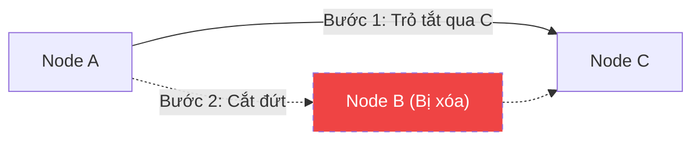
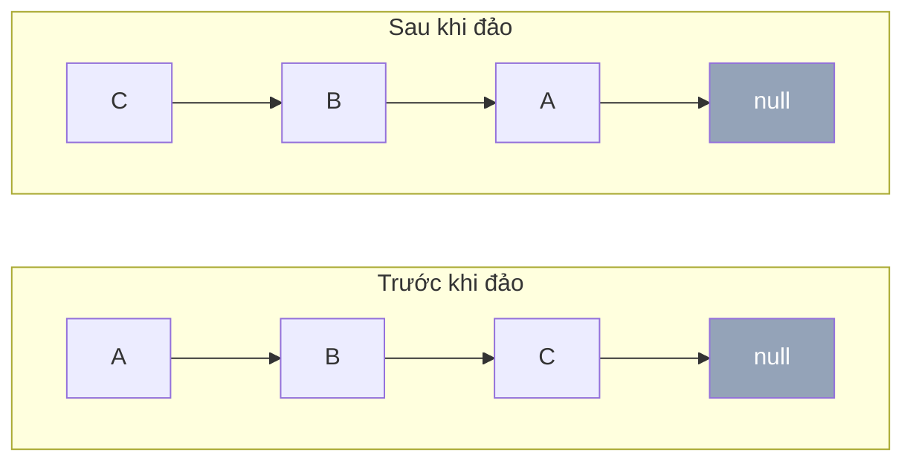
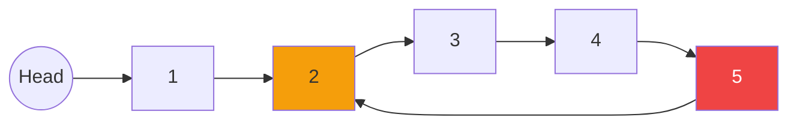

# Thao tác trên Linked List {#linked-list-operations}

:::info Mục tiêu bài học
- Học cách định nghĩa class `Node` đại diện cho một phần tử trong bộ nhớ.
- Hiểu và tự tay code 3 thao tác chèn: Chèn vào đầu, cuối, và vị trí bất kỳ.
- Nắm được kỹ năng gỡ rối (nối đứt dây) khi xóa phần tử.
:::

Trong bài này, chúng ta sẽ thực hành với **Danh sách liên kết Đơn (Singly Linked List)** vì nó là cơ sở để hiểu toàn bộ các loại danh sách khác.

## 1. Định nghĩa Cấu trúc Node {#define-node}

Trong C#, chúng ta sử dụng `class` để tạo cấu trúc dữ liệu lưu trên **Heap Memory**. Một Node sẽ bao gồm phần Dữ liệu (Data) và Con trỏ trỏ tới Node tiếp theo (Next).

```csharp
public class Node
{
    public int Data;
    public Node Next; // Trỏ đến một đối tượng Node khác

    public Node(int data)
    {
        Data = data;
        Next = null; // Mặc định khi tạo ra, Node chưa trỏ đi đâu cả
    }
}
```

Và một lớp `LinkedList` dùng để quản lý toàn bộ chuỗi các Node này, bằng cách giữ chặt lấy cái nút đầu tiên gọi là **Head**.

```csharp
public class SinglyLinkedList
{
    public Node Head; // Nắm được Head là nắm được toàn bộ danh sách
    
    public SinglyLinkedList()
    {
        Head = null;
    }
}
```

## 2. Chèn phần tử (Insertion) {#insertion}

Việc thêm phần tử vào Linked List không yêu cầu phải đẩy các phần tử khác ra xa như Mảng. Bạn chỉ cần điều chỉnh lại hướng trỏ của con trỏ (giống như rút phích cắm và cắm vào ổ khác).

### 2.1. Chèn vào đầu danh sách (Prepend)
**O(1) Time.** Rất đơn giản: Tạo Node mới $\rightarrow$ Trỏ `Next` của Node mới vào Head cũ $\rightarrow$ Cập nhật Head mới chính là Node này.

```csharp
public void InsertAtBeginning(int data)
{
    Node newNode = new Node(data);
    newNode.Next = Head;
    Head = newNode;
}
```

### 2.2. Chèn vào cuối danh sách (Append)
**O(N) Time.** Vì chúng ta chỉ giữ nút Head, muốn thêm vào cuối, ta phải duyệt từ Head tới khi nào gặp Node cuối cùng (có `Next == null`), rồi mới nối dây.

```csharp
public void InsertAtEnd(int data)
{
    Node newNode = new Node(data);
    
    if (Head == null)
    {
        Head = newNode;
        return;
    }

    Node current = Head;
    while (current.Next != null) // Đi tìm toa tàu cuối cùng
    {
        current = current.Next;
    }
    
    current.Next = newNode; // Móc toa tàu mới vào
}
```

### 2.3. Chèn vào vị trí bất kỳ (Insert At Position)
**O(N) Time.** Vì Linked List không truy cập ngẫu nhiên như Mảng, muốn chèn vào vị trí `position` (đếm từ 0), ta phải duyệt từ Head tới đúng node nằm ngay trước vị trí cần chèn rồi mới nối dây.

```csharp
public void InsertAt(int data, int position)
{
    Node newNode = new Node(data);

    // Chèn vào đầu (bao gồm cả trường hợp danh sách rỗng)
    if (position == 0 || Head == null)
    {
        newNode.Next = Head;
        Head = newNode;
        return;
    }

    // Duyệt tới node ngay trước vị trí cần chèn
    Node current = Head;
    for (int i = 0; current.Next != null && i < position - 1; i++)
    {
        current = current.Next;
    }

    // Nối dây: newNode nằm giữa current và current.Next
    newNode.Next = current.Next;
    current.Next = newNode;
}
```

## 3. Xóa phần tử (Deletion) {#deletion}

Xóa phần tử khỏi Linked List thực chất là thao tác "đi tắt". Nếu A trỏ tới B, và B trỏ tới C. Để xóa B, bạn chỉ cần gỡ con trỏ của A và bảo A trỏ thẳng tới C. 
Không có ai trỏ tới B nữa, B sẽ bị hệ thống dọn rác (Garbage Collector của C#) tự động tiêu hủy để thu hồi RAM.



**Mã nguồn xóa một giá trị bất kỳ:**
```csharp
public void DeleteValue(int key)
{
    Node current = Head;
    Node previous = null;

    // Trường hợp 1: Node cần xóa chính là Head
    if (current != null && current.Data == key)
    {
        Head = current.Next; // Dịch Head sang Node số 2
        return;
    }

    // Trường hợp 2: Duyệt tìm Node cần xóa, phải giữ lại con trỏ Previous
    while (current != null && current.Data != key)
    {
        previous = current;
        current = current.Next;
    }

    // Nếu không tìm thấy
    if (current == null) return;

    // Bỏ qua (Unlink) current node
    previous.Next = current.Next;
}
```

## 4. Duyệt danh sách (Traversal) {#traversal}

Để in ra các phần tử, chúng ta cũng bắt đầu từ Head và đi theo các con trỏ Next cho đến khi gặp ngõ cụt (`null`).

```csharp
public void PrintList()
{
    Node current = Head;
    while (current != null)
    {
        Console.Write(current.Data + " -> ");
        current = current.Next;
    }
    Console.WriteLine("null");
}
```

## 5. Đảo ngược danh sách (Reverse) {#reverse}

Đảo ngược một Singly Linked List là thao tác kinh điển trong phỏng vấn. Ý tưởng cốt lõi: duyệt từ Head, với mỗi node ta **lật hướng con trỏ `Next` về phía node phía trước**. Muốn vậy phải "nhớ" 3 biến: `previous` (node phía trước), `current` (node đang xét), và `next` (node phía sau, để không bị mất dấu danh sách khi đổi hướng).



```csharp
public void Reverse()
{
    Node previous = null;
    Node current = Head;

    while (current != null)
    {
        Node next = current.Next; // Nhớ node phía sau trước khi cắt dây
        current.Next = previous;  // Lật hướng con trỏ về phía trước
        previous = current;       // Dịch previous tiến lên
        current = next;           // Dịch current tiến lên
    }

    Head = previous; // Node cuối cùng cũ giờ trở thành Head mới
}
```

**O(N) Time, O(1) Space.** Chỉ cần duyệt đúng một lần, không tốn thêm Mảng hay Stack phụ.

## 6. Phát hiện vòng lặp (Cycle Detection) {#cycle-detection}

Một lỗi lập trình kinh điển: vô tình để con trỏ `Next` của node cuối trỏ ngược vào một node ở giữa danh sách, tạo thành **vòng lặp (cycle)**. Nếu vẫn duyệt bằng `while (current != null)` như ở phần Traversal, chương trình sẽ lặp vô hạn. Thuật toán **Floyd's Cycle Detection (Tortoise & Hare — Rùa và Thỏ)** giải quyết trong O(N) bằng hai con trỏ: `slow` tiến 1 bước, `fast` tiến 2 bước mỗi vòng lặp. Nếu có cycle, `fast` sẽ "chạy lòng vòng" và **bắt kịp `slow`**; nếu không có cycle, `fast` sẽ chạm `null` trước tiên.



```csharp
public bool HasCycle()
{
    if (Head == null || Head.Next == null) return false;

    Node slow = Head;
    Node fast = Head;

    while (fast != null && fast.Next != null)
    {
        slow = slow.Next;       // Rùa đi 1 bước
        fast = fast.Next.Next;  // Thỏ đi 2 bước

        if (slow == fast) return true; // Thỏ bắt kịp Rùa => có vòng lặp
    }

    return false; // Thỏ chạm null => danh sách kết thúc bình thường
}
```

**O(N) Time, O(1) Space.** Không cần HashSet để đánh dấu node đã ghé qua.

:::tip Tóm tắt nhanh (Key Takeaways)
- Việc thay đổi dữ liệu của Linked List bản chất là **cập nhật lại đường đi của các con trỏ (Pointers)**.
- Khi làm việc với Linked List, bạn luôn phải cẩn thận với lỗi **NullReferenceException**, hãy luôn kiểm tra xem Node hiện tại có bằng `null` hay không trước khi gọi `.Next`.
- Để chèn hoặc xóa ở cuối danh sách đơn nhanh trong thời gian **O(1)**, bạn có thể lưu thêm một biến phụ là **Tail (Đuôi)**.
:::

## Next Steps {#next-steps}

Bạn đã nắm trọn các thao tác lõi trên Linked List: chèn đầu/cuối/giữa, xóa node, duyệt, đảo ngược và phát hiện vòng lặp. Tiếp theo, hãy khám phá cấu trúc dữ liệu kế tiếp trong lộ trình, hoặc quay lại ôn tập khái niệm nếu cần củng cố nền tảng.

<div class="vt-box-container next-steps">
  <a class="vt-box" href="/docs/hash-table/hash-table-theory">
    <p class="next-steps-link">Lý thuyết Bảng Băm (Hash Table)</p>
    <p class="next-steps-caption">Cấu trúc dữ liệu tiếp theo sau Linked List: truy cập O(1) trung bình nhờ hàm băm, với Chaining dùng chính Linked List làm dây chuyền.</p>
  </a>
  <a class="vt-box" href="/docs/searching/two-pointers">
    <p class="next-steps-link">Kỹ thuật Hai con trỏ (Two Pointers)</p>
    <p class="next-steps-caption">Mẹo vặt giải các bài toán trên Linked List như tìm node giữa hay xử lý danh sách vòng.</p>
  </a>
  <a class="vt-box" href="/docs/linked-list/linked-list-basics">
    <p class="next-steps-link">Khái niệm & Phân loại Linked List</p>
    <p class="next-steps-caption">Ôn lại Singly / Doubly / Circular cùng so sánh sâu Linked List vs Array nếu cần bổ sung nền tảng.</p>
  </a>
</div>

## 📚 Tham khảo lý thuyết {#references}

Các kiến thức lý thuyết trong bài được tổng hợp và đối chiếu từ những nguồn học thuật sau:

- **Cấu trúc Node, các thao tác chèn/xóa/duyệt và phân tích độ phức tạp:** Cormen, T. H., Leiserson, C. E., Rivest, R. L., & Stein, C., *Introduction to Algorithms* (CLRS), 3rd Edition, MIT Press, 2009 — Chương 10.2 *Linked lists* (phân tích O(1) cho Insert/Delete khi đã có con trỏ, O(N) cho Search và Append không có Tail pointer).
- **Tổng quan Singly/Doubly/Circular Linked List và các phép toán cơ bản:** Wikipedia, *Linked list* — https://en.wikipedia.org/wiki/Linked_list
- **Phát hiện chu trình bằng Floyd's Cycle Detection (Tortoise & Hare):** Wikipedia, *Cycle detection* — https://en.wikipedia.org/wiki/Cycle_detection
- **Minh họa cài đặt và thuật toán Detecting Loop in a Linked List:** GeeksforGeeks, *Detect loop in a linked list* — https://www.geeksforgeeks.org/detect-loop-in-a-linked-list/
- **Tài liệu cấu trúc `LinkedList<T>` có sẵn trong .NET (Doubly Linked List):** Microsoft Learn — https://learn.microsoft.com/en-us/dotnet/api/system.collections.generic.linkedlist-1
