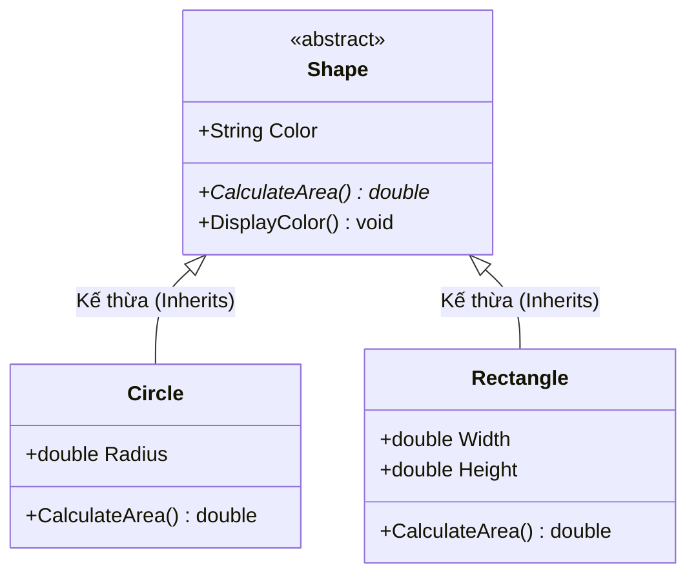

# Tính Trừu tượng (Abstraction) {#abstraction}

Trong thế giới thực, khi bạn lái một chiếc xe ô tô, bạn chỉ cần biết cách sử dụng vô lăng, chân ga và chân phanh. Bạn không cần phải hiểu chính xác cách động cơ đốt trong hoạt động, hệ thống phun xăng điện tử bơm nhiên liệu ra sao. Sự che giấu những chi tiết phức tạp đó và chỉ bộc lộ giao diện dễ sử dụng được gọi là **Tính Trừu tượng (Abstraction)**.

Trong Lập trình Hướng đối tượng (OOP), Trừu tượng hóa là quá trình **ẩn các chi tiết cài đặt bên trong** và chỉ hiển thị **những tính năng thiết yếu nhất** cho người dùng (hoặc các lớp khác).

## Đóng gói (Encapsulation) vs Trừu tượng (Abstraction) {#encapsulation-vs-abstraction}

Rất nhiều người mới học OOP nhầm lẫn giữa hai khái niệm này. Đây là cách phân biệt cốt lõi:
- **Đóng gói (Encapsulation):** Che giấu **Dữ liệu** và bảo vệ trạng thái nội bộ. Nó tập trung vào việc *"Ai có quyền truy cập và thay đổi biến này?"*.
- **Trừu tượng (Abstraction):** Che giấu **Sự phức tạp**. Nó tập trung vào việc *"Lớp này cung cấp những dịch vụ (hành vi) gì, mà không cần phơi bày cách nó làm điều đó"*.

**Tóm tắt ngắn gọn:**
- Encapsulation: Dấu dữ liệu (Hide Data).
- Abstraction: Dấu sự phức tạp (Hide Complexity).

## Cài đặt Trừu tượng bằng Abstract Class trong C# {#abstract-classes}

Trong C#, cách phổ biến nhất để thực hiện Tính Trừu tượng là sử dụng **lớp trừu tượng (abstract class)** và **phương thức trừu tượng (abstract method)**.

Lớp trừu tượng là một lớp không thể được khởi tạo (bạn không thể dùng từ khóa `new` với nó). Mục đích duy nhất của nó là đóng vai trò làm lớp cơ sở cho các lớp khác kế thừa.

### Ví dụ về Abstract Class

Giả sử chúng ta đang xây dựng phần mềm quản lý hình học:

```csharp
// Lớp trừu tượng: Không thể khởi tạo bằng 'new Shape()'
public abstract class Shape
{
    // Một thuộc tính bình thường, có thể kế thừa
    public string Color { get; set; }

    // Phương thức trừu tượng: KHÔNG CÓ THÂN HÀM!
    // Buộc TẤT CẢ các lớp con phải cung cấp chi tiết cài đặt
    public abstract double CalculateArea();

    // Phương thức thông thường: Lớp con có thể dùng ngay
    public void DisplayColor()
    {
        Console.WriteLine($"Hình này có màu {Color}");
    }
}
```

Ở ví dụ trên, phương thức `CalculateArea()` không có thân hàm (không có dấu `{}`). Lý do là: `Shape` là một khái niệm quá trừu tượng, chúng ta không thể biết công thức tính diện tích của một "hình" chung chung là gì.

### Triển khai (Implementation) bởi Lớp con



Các lớp con kế thừa từ lớp `Shape` **bắt buộc** phải ghi đè (`override`) phương thức trừu tượng:

```csharp
public class Circle : Shape
{
    public double Radius { get; set; }

    public Circle(double radius, string color)
    {
        Radius = radius;
        Color = color;
    }

    // BẮT BUỘC phải override CalculateArea()
    public override double CalculateArea()
    {
        return Math.PI * Radius * Radius;
    }
}

public class Rectangle : Shape
{
    public double Width { get; set; }
    public double Height { get; set; }

    // BẮT BUỘC phải override CalculateArea()
    public override double CalculateArea()
    {
        return Width * Height;
    }
}
```

### Sử dụng Lớp Trừu tượng

Nhờ có Tính Đa hình (Polymorphism) mà chúng ta học ở bài trước, chúng ta có thể sử dụng lớp trừu tượng `Shape` làm kiểu dữ liệu tham chiếu:

```csharp
// Shape s = new Shape(); // LỖI BIÊN DỊCH! Không thể khởi tạo abstract class

Shape myCircle = new Circle(5.0, "Đỏ");
Shape myRectangle = new Rectangle(4.0, 6.0, "Xanh");

// Sử dụng phương thức chung đã được code sẵn ở lớp cha
myCircle.DisplayColor(); // Output: Hình này có màu Đỏ

// Sử dụng phương thức trừu tượng, C# sẽ tự động gọi logic ở lớp con
Console.WriteLine($"Diện tích hình tròn: {myCircle.CalculateArea()}");
Console.WriteLine($"Diện tích hình chữ nhật: {myRectangle.CalculateArea()}");
```

## Khi nào nên dùng Abstract Class? {#when-to-use}

- Khi bạn muốn nhóm các hành vi chung (đã có code) và chia sẻ cho các lớp con.
- Khi bạn muốn thiết lập một "khuôn mẫu" bắt buộc các lớp con phải thực thi một số phương thức nhất định, nhưng không biết chi tiết lúc này.
- Khi có mối quan hệ "is-a" (là một) mạnh mẽ. (VD: `Dog` is an `Animal`).

## Next Steps {#next-steps}

Mặc dù `abstract class` rất mạnh mẽ, nhưng C# chỉ cho phép một lớp kế thừa từ **duy nhất một** lớp cha. Để vượt qua giới hạn này và đạt đến mức độ trừu tượng cao nhất (trừu tượng 100%), C# cung cấp khái niệm **Interface (Giao diện)**.

<div class="vt-box-container next-steps">
  <a class="vt-box" href="/docs/oop/interface">
    <p class="next-steps-link">Interface & Abstract Class</p>
    <p class="next-steps-caption">Sự khác biệt giữa Giao diện và Lớp trừu tượng, kỹ thuật đa kế thừa trong C#.</p>
  </a>
</div>
