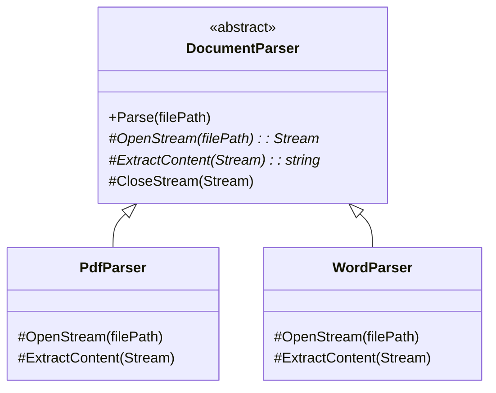

# Tính Trừu tượng (Abstraction) {#abstraction}

:::info Mục tiêu bài học
- Thấu hiểu khái niệm **Trừu tượng hóa** - Khả năng lọc bỏ các chi tiết thừa thãi và chỉ hiển thị những gì quan trọng nhất với người dùng.
- Trả lời câu hỏi kinh điển: Tại sao lại sinh ra một Lớp (Class) không cho phép ai khởi tạo nó (cấm dùng `new`)?
- Phân biệt giữa **Phương thức có sẵn (Concrete Methods)** và **Phương thức Trừu tượng (Abstract Methods)**.
- Áp dụng kỹ thuật Trừu tượng để xây dựng hệ thống `DocumentParser` (Trình đọc tài liệu).
- Khám phá sức mạnh cộng hưởng giữa Abstract Class và [Template Method Pattern](https://en.wikipedia.org/wiki/Template_method_pattern).
:::

## 1. Lời mở đầu: Nghệ thuật làm mờ chi tiết {#introduction}

Trong đời sống thực, bộ não con người không thể xử lý cùng lúc hàng tỷ thông tin. Để sinh tồn, chúng ta phải "Trừu tượng hóa" mọi thứ.

**Ví dụ thực tế (Real-world analogy):**
Khi bạn lái Xe hơi (Car), bạn chỉ cần biết 3 thứ: 
1. Vô lăng (Để rẽ).
2. Chân ga (Để chạy).
3. Chân phanh (Để dừng).

Bạn KHÔNG CẦN BIẾT bên trong cái vỏ sắt kia, bugi đánh lửa như thế nào, kim phun xăng hoạt động ra sao, tỉ số truyền của hộp số là bao nhiêu. Nếu nhà sản xuất bắt bạn phải hiểu hết đống đó mới cho khởi động xe, chắc chắn bạn sẽ phát điên.
Hành động nhà sản xuất giấu nhẹm đi buồng đốt động cơ và chỉ cung cấp cho bạn cái Chân ga, đó chính là **Tính Trừu tượng (Abstraction)**.

> *"Trong OOP, Tính trừu tượng là kỹ thuật chỉ phơi bày (Expose) những tính năng thiết yếu của một Đối tượng ra bên ngoài, và che giấu toàn bộ sự phức tạp (Implementation details) ở bên trong."*

---

## 2. Nghịch lý của Lớp Trừu tượng (Abstract Class) {#abstract-class}

Hãy tưởng tượng bạn đang viết một phần mềm Vẽ Hình Học (Paint).
Bạn tạo ra một Lớp cha là `Shape` (Hình học), và các Lớp con là `Circle` (Hình tròn), `Rectangle` (Hình chữ nhật).

Vấn đề nảy sinh:
- Khách hàng có thể vẽ một Hình Tròn (`new Circle()`). Rất hợp lý.
- Khách hàng có thể vẽ một Hình Chữ Nhật (`new Rectangle()`). Rất hợp lý.
- Nhưng, khách hàng CÓ NÊN được phép vẽ một "Hình Học" chung chung (`new Shape()`) không? Không! Bởi vì "Hình học" chỉ là một khái niệm trừu tượng. Không có cái hình nào trên đời tên là Hình Học mà vẽ ra được cả. Nó phải có hình thù cụ thể.

Vì vậy, Lớp `Shape` CHỈ NÊN TỒN TẠI ĐỂ LÀM KHUÔN MẪU cho các Lớp con kế thừa. Nó tuyệt đối **KHÔNG ĐƯỢC PHÉP** khởi tạo thành Đối tượng thật.

Để ngăn chặn các "Junior Coder" thiếu hiểu biết dùng từ khóa `new Shape()`, ngôn ngữ C# cung cấp từ khóa **`abstract`**.

### Khai báo Lớp Trừu tượng trong C#

```csharp
// Từ khóa 'abstract' cấm tuyệt đối việc gọi 'new Shape()'
public abstract class Shape
{
    public string Color { get; set; } // Vẫn chứa thuộc tính bình thường

    public void Move(int x, int y) 
    {
        Console.WriteLine($"Đang di chuyển hình tới tọa độ {x}, {y}");
    }
}
```

```csharp
// Thử nghiệm:
Shape myShape = new Shape(); // BÙM! LỖI COMPILER ĐỎ CHÓT! Không thể khởi tạo Lớp trừu tượng.
```

---

## 3. Cực hình bắt buộc: Abstract Methods {#abstract-methods}

Giờ đây, Lớp cha `Shape` muốn yêu cầu MỌI LỚP CON bắt buộc phải có tính năng Tính Diện Tích (Area).
- Nó không thể viết thân hàm (Body) cho tính năng này được, vì "Hình học chung chung" thì làm gì có công thức tính diện tích.
- Giải pháp: Nó chỉ định nghĩa **TÊN HÀM**, và bắt ép Lớp con **PHẢI TỰ VIẾT CODE**.

Đó gọi là Phương thức Trừu tượng (Abstract Method). Một phương thức Không-Có-Ruột (Chỉ có chữ ký hàm).

```csharp
public abstract class Shape
{
    // HÀM TRỪU TƯỢNG (Không có ngoặc nhọn { }, chỉ kết thúc bằng dấu ;)
    public abstract double CalculateArea(); 
}

public class Circle : Shape
{
    public double Radius { get; set; }

    // Nếu thằng Circle KHÔNG chịu viết lại hàm CalculateArea (bằng từ khóa override), 
    // Trình biên dịch sẽ báo lỗi đỏ sậm bắt nó phải viết. Nó không thể trốn tránh!
    public override double CalculateArea()
    {
        return Math.PI * Radius * Radius;
    }
}
```

Nhờ cơ chế tàn bạo này, Lớp cha `Shape` có thể yên tâm tuyệt đối 100% rằng: Bất kỳ đứa con nào sinh ra từ nó, cũng CHẮC CHẮN biết cách tính diện tích. Đây là tiền đề để [Tính Đa hình (Polymorphism)](/docs/oop/polymorphism) hoạt động trơn tru lúc Runtime.

---

## 4. Phẫu thuật thực tiễn: Hệ thống `DocumentParser` {#real-world-example}

Hãy ráp tất cả kiến thức lại. Chúng ta sẽ xây dựng một trình Đọc Tài Liệu, hỗ trợ PDF và Word.
Ở đây, chúng ta sẽ áp dụng mẫu **Template Method Pattern**: Lớp cha sẽ viết sẵn quy trình chung (Mở File, Đọc File, Đóng File), và chỉ nhường lại bước Đọc File (Logic riêng) cho các Lớp con.



**Mã nguồn C# tinh hoa:**

```csharp
// 1. KHUÔN MẪU TRỪU TƯỢNG CỦA KIẾN TRÚC SƯ
public abstract class DocumentParser
{
    // A. Hàm Concrete (Có ruột): Chứa thuật toán chung, Lớp con không cần viết lại.
    // Lớp cha dọn sẵn cỗ cho con ăn.
    public void ParseDocument(string filePath)
    {
        Console.WriteLine("\n[HỆ THỐNG] Đang nạp tài liệu...");
        OpenFile(filePath); // Hàm có sẵn
        
        // Gọi hàm Trừu tượng (Sẽ chạy code của lớp con lúc Runtime)
        string content = ExtractText(); 
        
        Console.WriteLine($"[NỘI DUNG]: {content}");
        CloseFile(); // Hàm có sẵn
    }

    private void OpenFile(string path) => Console.WriteLine($"Mở luồng đọc từ: {path}");
    private void CloseFile() => Console.WriteLine("Đóng luồng bộ nhớ. Giải phóng RAM.");

    // B. Hàm Abstract (Không ruột): BẮT BUỘC Lớp con phải tự vắt óc ra viết.
    protected abstract string ExtractText();
}

// 2. NHÀ PHÁT TRIỂN A (Viết thư viện đọc PDF)
public class PdfParser : DocumentParser
{
    // Bị ép phải tuân thủ hợp đồng
    protected override string ExtractText()
    {
        return "Bóc tách từng Pixel và Vector chữ từ file PDF...";
    }
}

// 3. NHÀ PHÁT TRIỂN B (Viết thư viện đọc Word)
public class WordParser : DocumentParser
{
    protected override string ExtractText()
    {
        return "Giải nén tệp .docx và phân tích cấu trúc XML bên trong...";
    }
}
```

### Chạy thử nghiệm hệ thống

Người dùng cuối (Client) sử dụng class của bạn sẽ cảm thấy vô cùng sướng. Họ chỉ cần gọi một hàm `ParseDocument()` duy nhất, còn lại Trình biên dịch và Tính Đa hình sẽ lo toàn bộ.

```csharp
// Ép kiểu Đa hình (Upcasting)
DocumentParser pdfDoc = new PdfParser();
pdfDoc.ParseDocument("BaoCaoTaiChinh.pdf");

// Kết quả Console in ra:
// [HỆ THỐNG] Đang nạp tài liệu...
// Mở luồng đọc từ: BaoCaoTaiChinh.pdf
// [NỘI DUNG]: Bóc tách từng Pixel và Vector chữ từ file PDF...
// Đóng luồng bộ nhớ. Giải phóng RAM.
```

Nhờ tính Trừu tượng, thằng `PdfParser` không phải viết lại logic Mở/Đóng file rườm rà (Thừa hưởng từ cha). Đồng thời, Kiến trúc sư cũng yên tâm tuyệt đối vì thằng `PdfParser` KHÔNG THỂ trốn tránh việc phải cung cấp hàm giải mã Text riêng cho nó. Một sự kết hợp hoàn hảo!

:::tip Tóm tắt nhanh (Key Takeaways)
- Tính Trừu tượng (Abstraction) là nghệ thuật che giấu độ phức tạp, chỉ hiển thị những cái râu ria cần thiết cho Client xài.
- Một Lớp được gắn mác `abstract` sẽ bị vĩnh viễn tước đi khả năng được khởi tạo (Cấm dùng `new`). Nó sinh ra chỉ để làm "Bản thiết kế" cho kẻ khác Kế thừa.
- Hàm `abstract` là hàm Không có nội dung (Không có ngoặc nhọn `{}`). Nó mang tính chất BẮT BUỘC (Ép các Lớp con phải `override` và tự viết ruột cho nó).
- Sự kết hợp giữa hàm có ruột (Concrete) và hàm rỗng (Abstract) bên trong cùng một Abstract Class tạo nên tuyệt kỹ [Template Method Pattern](https://en.wikipedia.org/wiki/Template_method_pattern) - nền tảng của mọi Framework.
:::

---

## Next Steps {#next-steps}

- [Tính Đa hình (Polymorphism)](/docs/oop/polymorphism): Vì sao Lớp cha có thể "gọi hộ" code của Lớp con lúc Runtime, biến Abstract Method thành vũ khí đa hình.
- [Interface](/docs/oop/interface): So sánh Abstract Class (gom nhóm theo huyết thống IS-A) và Interface (gom nhóm theo năng lực CAN-DO) để chọn đúng công cụ trừu tượng hóa.
- [Tính Kế thừa (Inheritance)](/docs/oop/inheritance): Ôn lại gốc rễ của chuỗi cha-con, nơi Abstract Class phát huy sức mạnh.
- [Dependency Inversion (DIP)](/docs/solid/dip): Khám phá cách trừu tượng hóa giúp Module cấp cao không còn phụ thuộc vào chi tiết cài đặt.

## 📚 Tham khảo lý thuyết

- Sách **Clean Code** (Robert C. Martin) — Triết lý ẩn giấu chi tiết cài đặt và phơi bày đúng những gì cần thiết cho client.
- Sách **Clean Architecture** (Robert C. Martin) — Trừu tượng hóa các chính sách nghiệp vụ để hệ thống bền vững trước sự thay đổi của công nghệ.
- Sách **Head First Object-Oriented Analysis and Design** (O'Reilly) — Phân tích và thiết kế hướng đối tượng trực quan, phân biệt rõ trừu tượng hóa hành vi.
- Microsoft Learn — [Tutorial: Object oriented programming in C#](https://learn.microsoft.com/en-us/dotnet/csharp/fundamentals/tutorials/oop) và `abstract` keyword.
- Wikipedia — [Abstraction (computer science)](https://en.wikipedia.org/wiki/Abstraction_(computer_science)).
- GeeksforGeeks — [Abstraction in C#](https://www.geeksforgeeks.org/abstraction-in-c-sharp/).
- MIT OpenCourseWare — 6.005 Software Construction (https://ocw.mit.edu).
