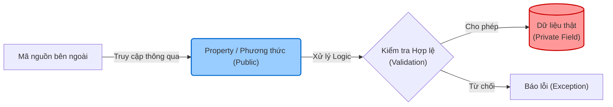

# Tính Đóng gói (Encapsulation) {#encapsulation}

Tính Đóng gói là một trong bốn trụ cột cơ bản của Lập trình Hướng đối tượng (OOP). Nó đề cập đến việc **đóng gói (gói gọn) dữ liệu (thuộc tính)** và **hành vi (phương thức)** hoạt động trên dữ liệu đó vào trong một đơn vị duy nhất (thường là một Class). 

Đồng thời, nó cũng dùng để **che giấu (hide)** trạng thái bên trong của đối tượng ra khỏi thế giới bên ngoài, ngăn chặn các đoạn code bên ngoài trực tiếp can thiệp và thay đổi dữ liệu một cách không hợp lệ.

## Tại sao chúng ta cần Đóng gói? {#why-encapsulation}

**Lợi ích chính của Đóng gói:**
- **Kiểm soát dữ liệu:** Bạn có thể thiết lập quy tắc hợp lệ (validation) trước khi cho phép thay đổi dữ liệu.
- **Che giấu thông tin (Information Hiding):** Các lớp bên ngoài không cần biết cấu trúc dữ liệu bên trong của bạn được cài đặt như thế nào.
- **Dễ bảo trì:** Bạn có thể thay đổi cấu trúc bên trong (ví dụ đổi từ mảng sang List) mà không làm ảnh hưởng đến mã nguồn sử dụng lớp này.

Hãy tưởng tượng một chiếc máy pha cà phê: Bạn chỉ cần nhấn nút (giao diện công khai), máy sẽ tự động đun nước, xay hạt, lọc bã (chi tiết triển khai bị che giấu). Bạn không thể (và không nên) tự tay thọc vào thanh gia nhiệt bên trong máy.



## Access Modifiers trong C# {#access-modifiers}

Để thực hiện Tính Đóng gói, C# cung cấp các **Access Modifiers** (Từ khóa chỉ định truy cập) nhằm điều khiển mức độ hiển thị của các thành viên trong class:

- `public`: Truy cập được từ bất kỳ đâu.
- `private`: **Chỉ** truy cập được từ bên trong chính class đó. Đây là mức bảo vệ mặc định.
- `protected`: Truy cập được từ class đó và các class kế thừa (derived classes).
- `internal`: Truy cập được từ bất kỳ đâu trong cùng một Assembly (Project).

:::warning Chú ý
Một thói quen lập trình tốt là luôn đặt các trường dữ liệu (fields) là `private` và chỉ cung cấp các cách truy cập chúng thông qua các phương thức `public` hoặc Properties.
:::

## Ví dụ: Không Đóng gói (Bad Practice) {#no-encapsulation}

Dưới đây là một ví dụ về một lớp không sử dụng tính đóng gói, nơi dữ liệu bị phơi bày hoàn toàn:

```csharp
public class BankAccount
{
    // Dữ liệu public, bất kỳ ai cũng có thể sửa đổi tùy ý
    public decimal Balance;
}

// Bất kỳ đoạn code nào cũng có thể làm phá sản bạn
BankAccount account = new BankAccount();
account.Balance = -1000000; // Hoàn toàn không hợp lệ, nhưng code vẫn chạy!
```

## Cài đặt Đóng gói với Properties {#encapsulation-with-properties}

C# có một tính năng vô cùng mạnh mẽ gọi là **Properties (Thuộc tính)**. Nó là sự kết hợp giữa một biến (field) và hai phương thức `get` (lấy giá trị) và `set` (gán giá trị), giúp việc đóng gói trở nên tự nhiên và ngắn gọn.

```csharp
public class BankAccount
{
    // 1. Dữ liệu private, che giấu khỏi bên ngoài
    private decimal _balance;

    // 2. Property public để truy cập có kiểm soát
    public decimal Balance
    {
        get 
        {
            return _balance;
        }
        private set 
        {
            // Ngăn chặn gán giá trị âm
            if (value >= 0)
            {
                _balance = value;
            }
        }
    }

    public BankAccount(decimal initialBalance)
    {
        Balance = initialBalance;
    }

    // 3. Phương thức public để thay đổi trạng thái một cách hợp lệ
    public void Deposit(decimal amount)
    {
        if (amount > 0)
        {
            Balance += amount;
            Console.WriteLine($"Đã nạp: {amount}");
        }
    }
}
```

**Auto-Implemented Properties:**
Nếu bạn không cần logic kiểm tra (validation), C# cho phép bạn viết Properties cực kỳ ngắn gọn:
```csharp
public string AccountHolder { get; set; }
```
C# compiler sẽ tự động tạo ra một biến `private` ngầm định ở dưới nền.

## Đóng gói hành vi (Behavior Encapsulation) {#behavior-encapsulation}

Không chỉ dữ liệu, những hành vi (logic tính toán phức tạp) cũng cần được đóng gói. Nếu một phương thức chỉ phục vụ mục đích tính toán trung gian nội bộ cho class, nó nên được đánh dấu là `private`.

```csharp
public class ShoppingCart
{
    private List<Item> _items = new List<Item>();

    public void AddItem(Item item)
    {
        _items.Add(item);
    }

    // Giao diện public đơn giản
    public decimal GetTotalAmount()
    {
        return CalculateSum() + CalculateTax();
    }

    // Các chi tiết tính toán phức tạp bị che giấu bên trong
    private decimal CalculateSum()
    {
        // Logic tính toán...
        return _items.Sum(i => i.Price);
    }

    private decimal CalculateTax()
    {
        // Logic thuế phức tạp...
        return CalculateSum() * 0.1m;
    }
}
```

Bằng cách ẩn đi `CalculateSum` và `CalculateTax`, lớp `ShoppingCart` của bạn đã giảm bớt sự rườm rà đối với lập trình viên sử dụng nó. Họ chỉ việc gọi `GetTotalAmount()` và nhận kết quả chính xác mà không cần bận tâm làm thế nào class đó tính ra được con số.

## Next Steps {#next-steps}

Giờ đây bạn đã hiểu cách bảo vệ trạng thái của đối tượng với Tính Đóng gói. Bước tiếp theo, hãy cùng khám phá cách tái sử dụng code thông qua Kế thừa.

<div class="vt-box-container next-steps">
  <a class="vt-box" href="/docs/oop/inheritance">
    <p class="next-steps-link">Kế thừa (Inheritance)</p>
    <p class="next-steps-caption">Tìm hiểu cách tái sử dụng cấu trúc và hành vi giữa các lớp.</p>
  </a>
</div>
