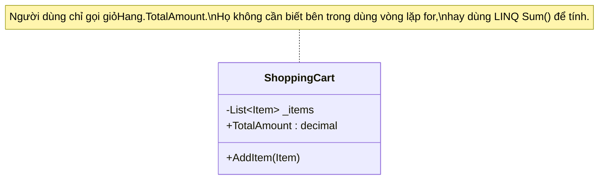

# Tính Đóng gói (Encapsulation) {#encapsulation}

:::info Mục tiêu bài học
- Thấu hiểu khái niệm **Đóng gói** - Lớp khiên bảo vệ sự toàn vẹn của dữ liệu trong một Đối tượng.
- Nhận diện Anti-pattern: Dữ liệu "trần truồng" (Naked Data) thông qua các biến `public`.
- Cài đặt hệ thống phòng ngự (Defensive Programming) để chống lại các thao tác vô tình hoặc cố ý phá hoại dữ liệu (Hack âm tiền Tài khoản).
- Khám phá đặc sản của ngôn ngữ C#: Từ **Properties (get/set)** cổ điển, **Backing Fields** cho đến từ khóa **`init`** siêu việt của C# 9.0 để tạo ra Immutability (Tính bất biến).
:::

## 1. Lời mở đầu: Viên thuốc con nhộng {#introduction}

Trong 4 trụ cột của Lập trình Hướng đối tượng (OOP), **Đóng gói (Encapsulation)** luôn được xếp ở vị trí đầu tiên, bởi nó là ranh giới định hình sự tồn tại của một Đối tượng (Object).

Thuật ngữ "Encapsulation" bắt nguồn từ chữ "Capsule" (Viên thuốc con nhộng). 
> *"Tính đóng gói là kỹ thuật gom nhóm dữ liệu (Variables/Fields) và các hành vi (Methods) hoạt động trên dữ liệu đó vào chung một lớp vỏ duy nhất (Class). Đồng thời, nó che giấu đi trạng thái bên trong, chỉ cho phép thế giới bên ngoài giao tiếp thông qua một cánh cửa do chính nó kiểm soát."*

**Ví dụ thực tế (Real-world analogy):**
Hãy tưởng tượng **Cái Tivi** nhà bạn. 
- **Dữ liệu bên trong (Private):** Hệ thống bo mạch, tụ điện, chip xử lý hình ảnh, bóng đèn LED.
- **Giao diện bên ngoài (Public):** Cái Remote điều khiển với các nút Bấm Kênh, Chỉnh Âm lượng.

Nhà sản xuất ĐÓNG GÓI toàn bộ đống bo mạch phức tạp vào trong một lớp vỏ nhựa. Bạn không được phép (và cũng không nên) thọc tay trực tiếp vào bo mạch để nối dây chỉnh âm lượng. Bạn chỉ được phép bấm nút Volume `+` trên Remote. Nếu bạn bấm quá 100, nút đó tự động chặn lại (Validation). Đó chính là sự bảo vệ dữ liệu!

---

## 2. Giải phẫu Anti-pattern: Dữ liệu "Trần truồng" (Naked Data) {#anti-pattern}

Một trong những tội ác lớn nhất của người mới học OOP là khai báo các biến (Fields) bằng từ khóa `public`. 
Hành động này tương đương với việc lột trần bộ bo mạch của Tivi ra cho thiên hạ tha hồ chọc phá.

Hãy xem một hệ thống Ngân hàng ngây thơ sau đây:

```csharp
// MÃ XẤU - VI PHẠM TÍNH ĐÓNG GÓI NGHIÊM TRỌNG
public class BankAccount
{
    // Dữ liệu "trần truồng", ai cũng có quyền sờ vào!
    public string AccountNumber;
    public decimal Balance; // Số dư tài khoản
}
```

Và đây là cách một Lập trình viên khác (hoặc Hacker) sử dụng Class của bạn:

```csharp
BankAccount myAccount = new BankAccount();
myAccount.AccountNumber = "123456";
myAccount.Balance = 50000; // Nạp 50k

// Hacker đột nhập:
myAccount.Balance = -9999999; // BÙM! Tài khoản bị âm 9 triệu!
```

**Tại sao lại xảy ra thảm họa này?**
Bởi vì biến `Balance` là `public`. Lớp `BankAccount` hoàn toàn bất lực, không có bất kỳ cơ chế nào để kiểm soát, ngăn chặn hay từ chối việc bị gán một con số âm. Dữ liệu của nó đã bị vấy bẩn (Corrupted State).

---

## 3. Khắc phục theo phong cách Java (Getters / Setters) {#java-style}

Để bảo vệ biến `Balance`, nguyên tắc số 1 của OOP ra đời:
> **Mọi biến (Fields) lưu trữ trạng thái bắt buộc phải là `private`.**

Nếu người ngoài muốn đọc hoặc sửa biến đó, họ phải đi qua cổng kiểm duyệt do chúng ta lập ra (Hàm Get/Set). Đây là cách mà các ngôn ngữ như Java hoặc C++ thường dùng:

```csharp
public class JavaStyleAccount
{
    // 1. Khóa kín dữ liệu lại
    private decimal _balance;

    // 2. Mở cổng ĐỌC (Getter)
    public decimal GetBalance() 
    {
        return _balance;
    }

    // 3. Mở cổng GHI (Setter) kèm theo Lính gác (Validation)
    public void SetBalance(decimal amount)
    {
        if (amount < 0)
        {
            throw new Exception("Hành vi gian lận! Số tiền không thể âm.");
        }
        _balance = amount; // Nếu hợp lệ mới cho phép gán
    }
}
```

Cách này rất an toàn, nhưng nhược điểm là cú pháp gọi hàm `myAccount.SetBalance(100)` trông khá thô kệch và không tự nhiên giống như phép gán dấu bằng (`=`).

---

## 4. Đặc sản của C#: Quyền năng của Properties {#csharp-properties}

Ngôn ngữ C# vô cùng thanh lịch, họ đã sáng chế ra **Properties (Thuộc tính)** để gộp chung Getter và Setter vào một khối duy nhất, cho phép lập trình viên xài dấu `= ` thoải mái nhưng vẫn bảo vệ được dữ liệu.

### 4.1. Full Property với Backing Field
```csharp
// MÃ ĐẸP - CHUẨN MỰC C#
public class CSharpAccount
{
    // Biến lưu trữ thực sự (Backing field) - Luôn luôn Private
    private decimal _balance;

    // Thuộc tính (Property) - Cái vỏ bọc Public
    public decimal Balance
    {
        get 
        { 
            // Có thể thêm logic ghi Log trước khi trả về dữ liệu
            return _balance; 
        }
        set 
        { 
            // Từ khóa 'value' đại diện cho giá trị mà người dùng truyền vào sau dấu =
            if (value < 0)
                throw new ArgumentException("Số tiền không hợp lệ!");
                
            _balance = value; 
        }
    }
}
```
Lúc này người dùng gọi: `myAccount.Balance = -100;`. Dấu `=` sẽ tự động kích hoạt khối `set`, và biến `value` sẽ mang giá trị `-100`. Lỗi sẽ lập tức bị ném ra!

### 4.2. Tự động hóa: Auto-Implemented Properties
Nếu bạn có một biến không cần thuật toán kiểm tra gì phức tạp (Ví dụ: `AccountNumber`), bạn không cần phải viết Backing Field rườm rà. Trình biên dịch C# sẽ tự động đẻ ra biến ẩn giùm bạn.

```csharp
public class User
{
    // C# tự động tạo ra một biến private ẩn ở phía sau
    public string FullName { get; set; }
}
```

### 4.3. Chỉ cho Đọc (Read-Only Property)
Rất nhiều dữ liệu sau khi tạo ra không bao giờ được phép thay đổi. Ví dụ: Ngày tạo tài khoản (CreatedDate). Bạn chỉ cần xóa bỏ chữ `set` (Hoặc biến nó thành `private set`).

```csharp
public class Order
{
    public DateTime CreatedDate { get; private set; }

    public Order()
    {
        // Bên trong class vẫn sửa được
        CreatedDate = DateTime.Now; 
    }
}

// Bên ngoài:
var ord = new Order();
// ord.CreatedDate = DateTime.Now; // LỖI COMPILER: Không cho phép sửa!
```

---

## 5. Tầm cao mới: Tính Bất biến (Immutability) với từ khóa `init` {#init-keyword}

Phiên bản C# 9.0 giới thiệu một cuộc cách mạng về Đóng gói với từ khóa `init` (Init-only setters).

Trước đây, nếu dùng `private set`, bạn chỉ có thể gán giá trị ở trong Constructor. Nếu class có 20 thuộc tính, bạn phải tạo một cái Constructor khổng lồ dài 20 tham số. Rất mệt mỏi!

Với `init`, bạn cho phép người dùng khởi tạo dữ liệu MỘT LẦN DUY NHẤT ngay lúc tạo Object bằng cú pháp Object Initializer (`{ }`). Sau giây phút đó, cánh cửa đóng sầm lại vĩnh viễn, Object trở thành **Bất biến (Immutable)**.

```csharp
public class Person
{
    public string IdCard { get; init; } // Chỉ được phép gán lúc khai sinh
    public string Name { get; set; }    // Có thể đổi tên sau này
}

// Client Code:
var p = new Person 
{ 
    IdCard = "0123456789", // HỢP LỆ (Lúc đang tạo đối tượng)
    Name = "John" 
};

p.Name = "David"; // HỢP LỆ (Dùng set)
// p.IdCard = "999"; // LỖI COMPILER ĐỎ CHÓT! Từ khóa init cấm thay đổi sau khi tạo xong!
```

Lập trình viên Senior cực kỳ cuồng tín tính **Immutability (Bất biến)**. Một đối tượng bất biến sẽ sống sót hoàn hảo trong môi trường Đa luồng (Multi-threading) vì không ai có thể sửa dữ liệu của nó được, từ đó không bao giờ xảy ra lỗi Race Condition.

---

## 6. Sức mạnh giấu kín (Information Hiding) {#information-hiding}

Lợi ích to lớn thứ hai của Đóng gói là **Giấu kín quy trình tính toán (Implementation Details)**.
Bạn hứa với người dùng một Kết Quả (Property), nhưng bạn không cho họ biết bạn tính ra nó như thế nào.



```csharp
public class ShoppingCart
{
    private List<Item> _items = new List<Item>();

    // Không có chữ 'set'. Đây là Computed Property (Thuộc tính tính toán động)
    public decimal TotalAmount
    {
        get 
        {
            // Logic tính toán bị GIẤU KÍN bên trong Class này
            return _items.Sum(x => x.Price * x.Quantity); 
        }
    }
}
```

Ngày mai, nếu giỏ hàng lên tới 1 triệu món, hàm `Sum()` của LINQ chạy quá chậm. Bạn âm thầm sửa lại đoạn code trong hàm `get` thành một thuật toán lưu Cache siêu tốc. **Kết quả:** Toàn bộ hệ thống bên ngoài gọi hàm `TotalAmount` không hề bị lỗi, cũng chẳng cần biên dịch lại, họ tự nhiên thấy tốc độ tăng lên 10 lần. Đó chính là sự ma thuật của Đóng gói!

:::tip Tóm tắt nhanh (Key Takeaways)
- Tính đóng gói bảo vệ Trạng thái (State) của đối tượng khỏi thế giới hỗn loạn bên ngoài.
- Quy tắc thép: Cấm tuyệt đối khai báo Field là `public`. Luôn dùng `private`.
- Mở cửa giao tiếp thông qua **Properties (get/set)**. Chèn logic xác thực (Validation) vào khối `set` để làm Lính gác.
- Tối ưu mã nguồn với Auto-properties (`{ get; set; }`).
- Cập nhật chuẩn hiện đại của C#: Dùng **`init`** thay cho `set` đối với các thuộc tính định danh để tạo ra Đối tượng Bất biến (Immutable Objects). An toàn tuyệt đối trong Đa luồng.
:::
