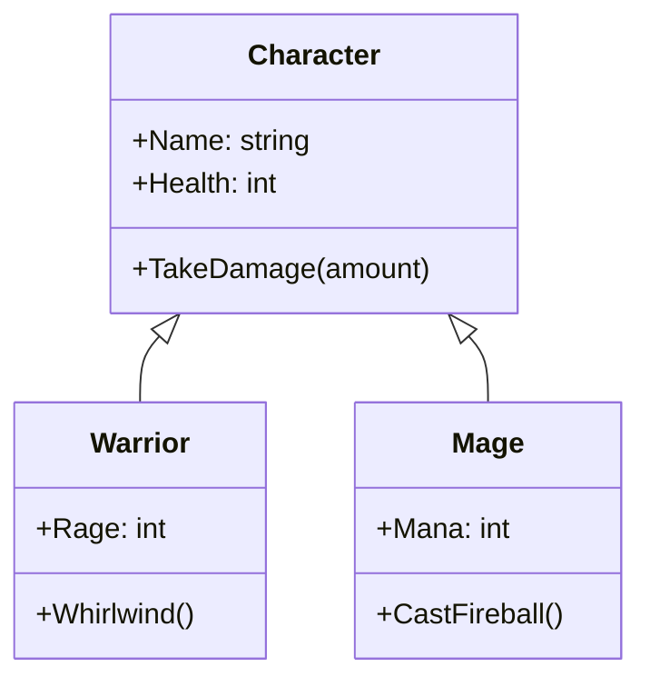

# Tính Kế thừa (Inheritance) {#inheritance}

:::info Mục tiêu bài học
- Xóa mù cơ chế vận hành của **Kế thừa (Inheritance)**: Định lý "IS-A" (Là một).
- Mổ xẻ bí mật khởi tạo trong bộ nhớ: Tại sao Lớp con ra đời lại phải nhờ đến Lớp cha (Từ khóa `base`)?
- Phân định ranh giới lãnh thổ bằng Access Modifiers: Sự khác biệt chí mạng giữa `private`, `protected`, và `internal`.
- Nhận diện Anti-pattern: Hội chứng **Lớp Cơ Sở Mỏng Manh (Fragile Base Class)**.
- Thấu hiểu câu thần chú của Kiến trúc sư: *"Prefer Composition over Inheritance"* (Ưu tiên Lớp bọc thay vì Kế thừa).
:::

## 1. Lời mở đầu: Sức mạnh của Phả hệ {#introduction}

Trong thế giới OOP, khi bạn thấy hai Class có những hành vi và dữ liệu giống hệt nhau, bản năng của một lập trình viên sẽ hét lên: *"Đừng Lặp Lại Code (DRY - Don't Repeat Yourself)!"*. Đó là lúc Kế thừa ra đời.

> *"Kế thừa cho phép một Lớp mới (Derived Class / Child Class) thừa hưởng toàn bộ dữ liệu và hành vi của một Lớp có sẵn (Base Class / Parent Class), đồng thời cho phép Lớp mới có quyền mở rộng hoặc thay đổi hành vi đó."*

**Định lý cốt lõi: Mối quan hệ "IS-A" (Là một)**
Để áp dụng Kế thừa, Lớp con bắt buộc phải thỏa mãn câu nói: **"Lớp Con LÀ MỘT Lớp Cha"**.
- Chó (Dog) **LÀ MỘT** Động vật (Animal). $\rightarrow$ Kế thừa đúng.
- Ô tô (Car) **LÀ MỘT** Phương tiện (Vehicle). $\rightarrow$ Kế thừa đúng.
- Hình Vuông **LÀ MỘT** Hình Chữ Nhật? $\rightarrow$ Toán học bảo đúng, nhưng OOP bảo sai (Hãy xem lại [Nguyên lý LSP](/docs/solid/lsp) để biết tại sao).

---

## 2. Giải phẫu Cơ chế Kế thừa trong C# {#csharp-inheritance}

C# (cũng như Java) sử dụng cú pháp dấu hai chấm (`:`) để kế thừa. **Lưu ý:** Một Lớp con chỉ có thể kế thừa từ ĐÚNG MỘT Lớp cha (Đơn kế thừa - Single Inheritance), tuyệt đối không được kế thừa từ nhiều Class để tránh hiện tượng [Diamond Problem](https://en.wikipedia.org/wiki/Multiple_inheritance#The_diamond_problem).



### 2.1. Mã nguồn cơ bản
```csharp
// LỚP CHA (BASE CLASS)
public class Character
{
    public string Name { get; set; }
    public int Health { get; set; }

    public void TakeDamage(int amount)
    {
        Health -= amount;
        Console.WriteLine($"{Name} bị mất {amount} máu! Còn {Health} HP.");
    }
}

// LỚP CON (DERIVED CLASS)
// Warrior sẽ TỰ ĐỘNG CÓ toàn bộ 2 biến (Name, Health) và hàm TakeDamage của Character
public class Warrior : Character
{
    public int Rage { get; set; } // Tính năng mở rộng riêng của con

    public void Whirlwind()
    {
        Console.WriteLine($"{Name} xoay kiếm gây sát thương diện rộng!");
    }
}
```

### 2.2. Bí mật của Từ khóa `base` (Chuỗi khởi tạo Constructor)

Khi bạn gõ lệnh `new Warrior()`, CPU sẽ cấp phát bộ nhớ. Nhưng khoan đã! Thằng `Warrior` chứa cái ruột của thằng `Character`. Vậy ai sẽ khởi tạo cái ruột đó?

**Quy tắc bất di bất dịch của OOP:** *"Lớp Cha phải ra đời trước Lớp Con"*.
Khi hàm tạo (Constructor) của Lớp Con được gọi, việc đầu tiên nó làm là ngầm chạy lên gọi hàm tạo của Lớp Cha (thông qua từ khóa `base`) để nhét đồ đạc của Cha vào bộ nhớ, rồi nó mới bắt đầu xây phần mở rộng của Lớp Con.

```csharp
public class Character
{
    public string Name { get; set; }

    // Nếu Lớp cha yêu cầu truyền Tên lúc sinh ra
    public Character(string name)
    {
        Name = name;
        Console.WriteLine("1. Lớp Cha (Character) ra đời!");
    }
}

public class Warrior : Character
{
    public int Rage { get; set; }

    // Lớp con BẮT BUỘC phải thỏa mãn yêu cầu của Lớp cha
    // Nó nhận tên từ người dùng, rồi "chuyền bóng" (gọi : base) ném cái tên đó lên cho Lớp cha xử lý!
    public Warrior(string name, int startingRage) : base(name)
    {
        Rage = startingRage;
        Console.WriteLine("2. Lớp Con (Warrior) ra đời!");
    }
}

// Chạy thử:
var garen = new Warrior("Garen", 100);
// Output trên Console sẽ in ra lần lượt:
// 1. Lớp Cha (Character) ra đời!
// 2. Lớp Con (Warrior) ra đời!
```

---

## 3. Ranh giới Lãnh thổ (Access Modifiers) {#access-modifiers}

Kế thừa sinh ra một cấp độ bảo mật mới. Hồi học tính [Đóng Gói (Encapsulation)](/docs/oop/encapsulation), bạn chỉ biết `private` (giấu kín) và `public` (mở toang). Giờ đây, khi có "Con cái" trong nhà, bạn cần một loại chìa khóa riêng chỉ cấp cho người trong gia tộc.

1. `private`: Tuyệt đối bí mật. Lớp con KẾ THỪA nó, nhưng KHÔNG ĐƯỢC PHÉP CHẠM VÀO NÓ. (Giống như Bố bạn có một sổ tiết kiệm mang tên Bố. Bạn biết nó tồn tại trong nhà, nhưng bạn không lấy tiền ra được).
2. **`protected`**: (Dành riêng cho Kế thừa). Thế giới bên ngoài nhìn vào thấy nó là `private`. Nhưng Lớp Con nhìn vào lại thấy nó là `public`! (Bố giao chìa khóa két sắt riêng cho bạn).
3. `internal`: Giới hạn nội bộ trong cùng một Project (Assembly/DLL). File nằm ở Project khác không xài được.

```csharp
public class BankSystem
{
    private string _adminPassword = "123"; // Con không được chạm
    
    // Con có quyền lấy Key này để kết nối hệ thống. Người ngoài không thấy.
    protected string DatabaseKey = "DB_SECRET"; 
}

public class LocalBank : BankSystem
{
    public void Connect()
    {
        // Console.WriteLine(_adminPassword); // LỖI COMPILER ĐỎ CHÓT!
        Console.WriteLine(DatabaseKey);       // HỢP LỆ! Nhờ từ khóa protected.
    }
}
```

---

## 4. Thanh gươm hai lưỡi: Hội chứng Lớp Cơ Sở Mỏng Manh {#fragile-base-class}

Người mới học OOP rất thích Kế thừa. Họ tạo ra những cây phả hệ sâu 5-7 tầng: `Animal` $\rightarrow$ `Mammal` $\rightarrow$ `Dog` $\rightarrow$ `Husky` $\rightarrow$ `AlaskaHusky`.

Đây là một Anti-pattern chết người mang tên **Fragile Base Class Problem (Lớp cơ sở mỏng manh)**.

Bởi vì Kế thừa tạo ra sự kết dính chặt chẽ nhất (Tightly Coupled) trong toàn bộ kiến trúc phần mềm. 
Giả sử bạn có 100 Class đang kế thừa từ `Animal`. Ngày mai, Sếp yêu cầu bạn vào Class `Animal` sửa lại hàm `Eat()` để thêm tham số `FoodType`. 
**BÙM!** Ngay lập tức, 100 File chứa 100 Lớp con của bạn đồng loạt báo lỗi Compiler đỏ rực màn hình vì không tương thích hàm. Bạn vừa phá hủy toàn bộ dự án chỉ bằng một dòng code ở Lớp cha.

### Câu Thần Chú: "Prefer Composition over Inheritance"

Đây là nguyên lý tối thượng trong [Design Patterns](/docs/patterns/singleton). 
> *"Hãy ưu tiên dùng Thành phần Bọc (Composition / Có-Một) thay vì Kế thừa (Inheritance / Là-Một)."*

Thay vì cho `Car` kế thừa `Engine` (Xe hơi **LÀ MỘT** Động cơ $\rightarrow$ Vô lý). 
Hãy cho `Car` CHỨA MỘT biến `Engine` bên trong bụng nó (Composition). Khi đó, bạn có thể dễ dàng rút cái Động cơ cũ ra, thay Động cơ mới vào (Kỹ thuật [Strategy Pattern](/docs/patterns/strategy) hoặc [Dependency Injection](/docs/di/basics)). Đừng lạm dụng Kế thừa nếu mối quan hệ không thực sự là "IS-A"!

:::tip Tóm tắt nhanh (Key Takeaways)
- Kế thừa (Inheritance) dùng để tái sử dụng mã nguồn và thể hiện quan hệ cha-con (IS-A).
- Lớp con thừa hưởng Data và Hành vi của Lớp cha, nhưng Lớp cha luôn phải được khởi tạo trước bằng cách gọi `base(...)` constructor.
- Để Lớp con được dùng biến của Lớp cha mà không sợ thiên hạ nhìn thấy, hãy dùng Access Modifier là **`protected`**.
- Hạn chế tối đa việc tạo cây phả hệ Kế thừa quá sâu (Quá 3 tầng). Sự thay đổi ở Lớp gốc sẽ tạo ra phản ứng dây chuyền làm sập toàn bộ các Lớp lá. 
- Ưu tiên sử dụng **Interface** và **Composition (Biến bọc)** thay cho Kế thừa Class thuần túy.
:::

## Next Steps {#next-steps}

- Khám phá cách Lớp con biến hóa thành vô số hình dạng khác nhau nhờ cùng một cách gọi trong [Tính Đa hình (Polymorphism)](/docs/oop/polymorphism).
- Tìm hiểu cách che giấu chi tiết phức tạp và chỉ phơi bày phần thiết yếu trong [Tính Trừu tượng (Abstraction)](/docs/oop/abstraction).
- Kiểm chứng mối quan hệ "IS-A" có thực sự an toàn khi thay thế lẫn nhau hay không qua [Nguyên lý Liskov Substitution (LSP)](/docs/solid/lsp).
- Hiểu rõ vì sao nên ưu tiên Interface và Composition thay vì Kế thừa Class trong bài [Cơ bản về DI & IoC](/docs/di/basics).

## 📚 Tham khảo lý thuyết

Nội dung bài viết được biên soạn dựa trên các nguồn tài liệu uy tín dưới đây:

- *"Clean Code: A Handbook of Agile Software Craftsmanship"* – Robert C. Martin.
- *"Clean Architecture: A Craftsman's Guide to Software Structure and Design"* – Robert C. Martin.
- *"Head First Object-Oriented Analysis and Design"* – Brett McLaughlin, Gary Pollice, David West.
- Microsoft Learn – [Inheritance (C# Programming Guide)](https://learn.microsoft.com/en-us/dotnet/csharp/fundamentals/object-oriented/inheritance) giải thích cơ chế kế thừa, từ khóa `base`, và các Access Modifier trong C#.
- Wikipedia – [Inheritance (object-oriented programming)](https://en.wikipedia.org/wiki/Inheritance_(object-oriented_programming)) mô tả khái niệm IS-A, đơn kế thừa và đa kế thừa.
- GeeksforGeeks – [Inheritance in C#](https://www.geeksforgeeks.org/inheritance-in-c-sharp/) trình bày cú pháp và ví dụ kế thừa thực tế.
- MIT OpenCourseWare – *6.031 Software Construction* (https://ocw.mit.edu/) cung cấp nền tảng về kỹ thuật xây dựng phần mềm an toàn và dễ bảo trì.
