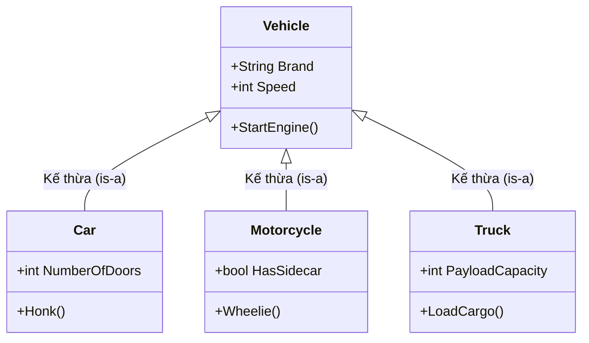

# Tính Kế thừa (Inheritance) {#inheritance}

Tính Kế thừa (Inheritance) cho phép chúng ta định nghĩa một lớp mới dựa trên một lớp đã tồn tại. Đây là một cơ chế mạnh mẽ để tái sử dụng mã nguồn và thiết lập mối quan hệ phân cấp **"is-a" (là một)** giữa các đối tượng.

Lớp mà có các thành viên được kế thừa được gọi là **Lớp cơ sở (Base class / Parent class)**, và lớp kế thừa các thành viên đó được gọi là **Lớp dẫn xuất (Derived class / Child class)**.

## Tại sao chúng ta cần Kế thừa? {#why-inheritance}

**Lợi ích chính:**
- **Tái sử dụng code (Code Reusability):** Bạn không cần phải viết lại các trường dữ liệu và phương thức đã có ở lớp cha.
- **Tính hệ thống:** Tổ chức các lớp theo một cấu trúc phân cấp logic từ tổng quát đến chi tiết.
- **Tiền đề cho Đa hình (Polymorphism):** Kế thừa là điều kiện bắt buộc để thực hiện tính đa hình (chúng ta sẽ tìm hiểu ở bài sau).

Ví dụ: Bạn có một hệ thống quản lý xe cộ. Tất cả các xe đều có thuộc tính `Speed` (Tốc độ) và phương thức `StartEngine()` (Khởi động). Thay vì viết lại những thứ này ở các lớp `Car` (Ô tô), `Motorcycle` (Xe máy), và `Truck` (Xe tải), bạn có thể tạo một lớp chung là `Vehicle` để các lớp kia kế thừa.



## Cú pháp Kế thừa trong C# {#syntax}

Trong C#, chúng ta sử dụng dấu hai chấm `:` để thể hiện sự kế thừa.

```csharp
// 1. Lớp cơ sở (Base class)
public class Vehicle
{
    public string Brand { get; set; }
    
    public void StartEngine()
    {
        Console.WriteLine("Động cơ đã khởi động. Vroom vroom!");
    }
}

// 2. Lớp dẫn xuất (Derived class)
// Car "kế thừa từ" Vehicle
public class Car : Vehicle 
{
    public int NumberOfDoors { get; set; }

    public void Honk()
    {
        Console.WriteLine("Beep! Beep!");
    }
}
```

Bây giờ, đối tượng của lớp `Car` không chỉ có thuộc tính `NumberOfDoors` mà còn tự động có thuộc tính `Brand` và phương thức `StartEngine` từ `Vehicle`.

```csharp
Car myCar = new Car();

// Kế thừa từ Vehicle
myCar.Brand = "Toyota";
myCar.StartEngine();

// Sở hữu riêng của Car
myCar.NumberOfDoors = 4;
myCar.Honk();
```

## Constructor trong Kế thừa {#constructors-in-inheritance}

Một quy tắc quan trọng cần nhớ: **Constructors (hàm khởi tạo) không được kế thừa**. Tuy nhiên, khi bạn khởi tạo một đối tượng của lớp con, constructor của lớp cha sẽ luôn được gọi **trước tiên**.

Nếu lớp cha có constructor nhận tham số, bạn phải gọi nó từ lớp con bằng từ khóa `base`:

```csharp
public class Animal
{
    public string Name { get; set; }

    // Constructor của lớp cha yêu cầu truyền Name
    public Animal(string name)
    {
        Name = name;
        Console.WriteLine("Animal Constructor called");
    }
}

public class Dog : Animal
{
    public string Breed { get; set; }

    // Dùng : base() để truyền dữ liệu lên lớp cha
    public Dog(string name, string breed) : base(name)
    {
        Breed = breed;
        Console.WriteLine("Dog Constructor called");
    }
}
```

:::warning Lưu ý về Đa Kế Thừa (Multiple Inheritance)
Khác với C++, C# **KHÔNG** hỗ trợ đa kế thừa đối với Class. Một lớp con chỉ có thể kế thừa từ **duy nhất một** lớp cha trực tiếp. Để giải quyết vấn đề cần đa kế thừa, C# sử dụng `Interfaces` (chúng ta sẽ thảo luận ở phần sau).
:::

## Từ khóa `sealed` (Niêm phong lớp) {#sealed-classes}

Đôi khi, bạn xây dựng một lớp hoàn chỉnh và không muốn bất kỳ ai khác kế thừa (và có thể phá vỡ logic) của lớp đó. Bạn có thể sử dụng từ khóa `sealed`.

```csharp
public sealed class SecuritySystem
{
    // Không một lớp nào có thể kế thừa từ SecuritySystem
}

// LỖI BIÊN DỊCH: 'AdvancedSecurity' cannot derive from sealed type 'SecuritySystem'
// public class AdvancedSecurity : SecuritySystem { }
```

Việc niêm phong class cũng giúp trình biên dịch của C# thực hiện một số tối ưu hóa hiệu suất vi mô (micro-optimizations).

## Next Steps {#next-steps}

Sau khi đã tạo được hệ thống phân cấp các lớp, sức mạnh thực sự của OOP nằm ở việc có thể tương tác với các đối tượng thuộc các lớp con khác nhau thông qua một giao diện chung. Đó chính là **Tính Đa hình**.

<div class="vt-box-container next-steps">
  <a class="vt-box" href="/docs/oop/polymorphism">
    <p class="next-steps-link">Đa hình (Polymorphism)</p>
    <p class="next-steps-caption">Cách các đối tượng con cư xử khác nhau dưới cùng một tên gọi hàm.</p>
  </a>
</div>
