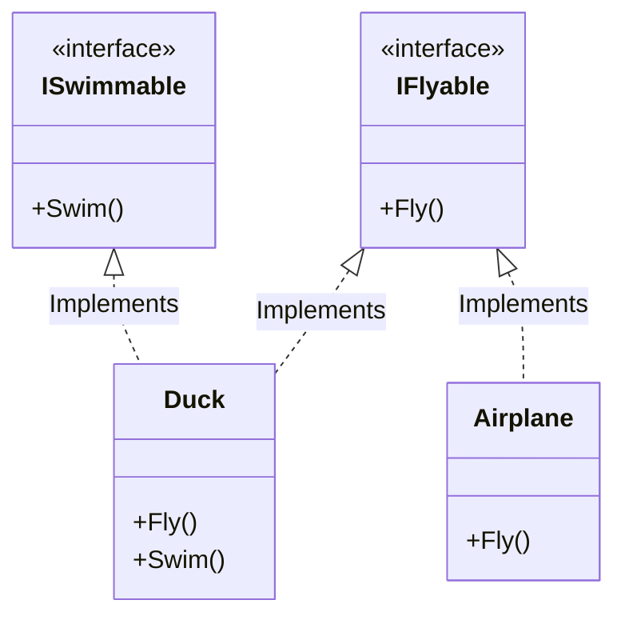

# Interface (Giao diện) {#interface}

:::info Mục tiêu bài học
- Thấu hiểu bản chất của **Interface** - Một bản hợp đồng thuần túy về Hành vi (Behavior).
- Phân biệt sự khác nhau chí mạng giữa Abstract Class (Kế thừa huyết thống) và Interface (Cam kết Hợp đồng).
- Sử dụng phép màu của Đa Kế Thừa Giao Diện (Multiple Interface Implementations) trong C#.
- Giải mã tính năng mới của C# 8.0: Default Interface Methods (Khi hợp đồng cũng có phần ruột).
- Giác ngộ phương châm tối thượng của Kiến trúc phần mềm: *"Program to an interface, not an implementation"*.
:::

## 1. Lời mở đầu: Bản Hợp Đồng Bắt Buộc {#introduction}

Trong bài học trước về [Tính Trừu tượng](/docs/oop/abstraction), chúng ta biết rằng Lớp Trừu Tượng (Abstract Class) có thể vừa chứa code xử lý (Concrete), vừa chứa hàm rỗng (Abstract). Nhưng đôi khi, Kiến trúc sư muốn đẩy tính Trừu tượng lên mức **Tối đa 100%**. Họ muốn tạo ra một thứ hoàn toàn trống rỗng, không chứa bất kỳ một logic nào, không chứa bất kỳ một biến dữ liệu nào. Thứ đó gọi là **Interface**.

**Ví dụ thực tế (Real-world analogy):**
Hãy tưởng tượng **Bản Hợp Đồng Cung Cấp Điện** giữa gia đình bạn và Công ty Điện lực.
- Bản hợp đồng (Interface) chỉ ghi rõ: "Nhà cung cấp phải truyền điện 220V vào ổ cắm này". 
- Bản hợp đồng KHÔNG HỀ QUAN TÂM việc Công ty Điện lực sản xuất dòng điện đó bằng Thủy điện, Nhiệt điện, Điện gió hay Năng lượng Mặt trời (Không chứa Code thực thi).
- Miễn là điện cung cấp đúng chuẩn 220V (Tuân thủ Hợp đồng), gia đình bạn sẽ dùng được.

Trong OOP, Interface chính là sự Cam Kết. Nó nói rằng: *"Bất kỳ ai ký vào hợp đồng này, ĐỀU PHẢI BIẾT LÀM NHỮNG VIỆC NÀY, tôi không quan tâm anh làm bằng cách nào!"*

---

## 2. Abstract Class vs Interface: Trận chiến kinh điển {#abstract-vs-interface}

Đây là câu hỏi phỏng vấn số 1 của mọi công ty công nghệ. Tại sao lại sinh ra Interface khi chúng ta đã có Abstract Class?

### Sự khác biệt 1: Huyết thống (IS-A) vs Hành vi (CAN-DO)
- **Abstract Class:** Thể hiện quan hệ Huyết thống. Một con `Dog` thì (LÀ MỘT) `Animal`. Việc một con chó bắt nguồn từ tổ tiên động vật là bản chất sinh học không thể chối cãi.
- **Interface:** Thể hiện Khả năng / Hành vi. Một con `Dog` có khả năng `ISwimmable` (Biết bơi). Một cái `Submarine` (Tàu ngầm) cũng có khả năng `ISwimmable` (Biết bơi).
Rõ ràng con Chó và Tàu ngầm chả có quan hệ huyết thống họ hàng gì với nhau, bạn không thể nhét chúng vào chung một Abstract Class được! Chúng chỉ chia sẻ chung một KHẢ NĂNG (CAN-DO). Đó là lúc Interface tỏa sáng!

### Sự khác biệt 2: Đơn Kế Thừa vs Đa Hợp Đồng
- Trong C# và Java, một Lớp (Class) chỉ được phép có đúng 1 Người Cha (Đơn kế thừa Abstract Class).
- Nhưng một Lớp có quyền ký vô số Bản Hợp Đồng (Đa kế thừa Interface). Một con Vịt vừa có thể ký hợp đồng `ISwimmable` (Bơi), vừa ký `IFlyable` (Bay), vừa ký `IQuackable` (Kêu).

---

## 3. Phẫu thuật Mã nguồn C# (Đa Kế Thừa Interface) {#csharp-interface}

Theo quy chuẩn đặt tên (Naming Convention) của C#, mọi Interface đều phải bắt đầu bằng chữ **`I`** viết hoa.



**Ký kết Hợp đồng trong Code:**

```csharp
// 1. Tạo các bản Hợp đồng. BÊN TRONG KHÔNG CÓ CODE (Body)!
public interface IFlyable
{
    void Fly(); // Mặc định là public và abstract, không cần ghi rườm rà.
}

public interface ISwimmable
{
    void Swim();
}

// 2. Con Vịt (Đa tài) - Ký 2 hợp đồng cùng lúc
public class Duck : IFlyable, ISwimmable
{
    // Bắt buộc phải thực hiện đủ 2 hàm, nếu không Compiler sẽ chửi ngay!
    public void Fly() => Console.WriteLine("Vịt đang bay lạch bạch...");
    public void Swim() => Console.WriteLine("Vịt đang bơi đạp nước...");
}

// 3. Máy Bay (Chỉ ký 1 hợp đồng)
public class Airplane : IFlyable
{
    public void Fly() => Console.WriteLine("Máy bay Boeing 747 cất cánh bằng động cơ phản lực!");
}
```

### Đa Hình với Interface
Bây giờ, tại Trạm Kiểm Soát Không Lưu (Radar). Họ chả thèm quan tâm trên trời là Con Vịt hay Máy Bay. Radar chỉ bắt những vật thể `IFlyable` (Biết bay).

```csharp
// Một mảng chứa Hỗn hợp mọi thứ trên đời, miễn là Từng-Ký-Hợp-Đồng IFlyable
List<IFlyable> flyingObjects = new List<IFlyable>
{
    new Duck(),
    new Airplane()
};

foreach (var obj in flyingObjects)
{
    obj.Fly(); 
    // Output:
    // Vịt đang bay lạch bạch...
    // Máy bay Boeing 747 cất cánh bằng động cơ phản lực!
}
```

Nhờ Interface, hai vật thể không cùng huyết thống đã được giao tiếp thông suốt qua một khe cắm chung (Tương tự cắm USB chuột và USB bàn phím vào máy tính).

---

## 4. Tính năng mới: Default Interface Methods (C# 8.0) {#default-interface-methods}

Trải qua hàng chục năm, luật chơi của OOP luôn là: *"Interface không được chứa ruột (Code)"*.
Nhưng đến năm 2019 (C# 8.0), Microsoft đã phá vỡ quy luật này để giải quyết một bài toán nhức nhối: **Khả năng tương thích ngược (Backward Compatibility)**.

Giả sử thư viện của bạn có Interface `ILogger` đang được hàng vạn người xài.
```csharp
public interface ILogger
{
    void LogInfo(string message);
    void LogError(string error);
}
```
Bây giờ, bạn muốn thêm tính năng `LogWarning()` vào `ILogger`. Nếu bạn ném nó vào, HÀNG VẠN ứng dụng của khách hàng sẽ lập tức Báo Lỗi Compiler (Bởi vì họ chưa Implement cái hàm mới này).

Để cứu khách hàng, C# 8.0 cho phép bạn viết **Mặc định (Default Method)** ngay bên trong Interface!

```csharp
public interface ILogger
{
    void LogInfo(string message);
    void LogError(string error);

    // TÍNH NĂNG MỚI: Interface ĐƯỢC PHÉP có ruột!
    // Nếu khách hàng lười không chịu Implement hàm này, nó sẽ tự chạy code mặc định ở dưới.
    void LogWarning(string warning) 
    {
        Console.WriteLine($"[CẢNH BÁO MẶC ĐỊNH]: {warning}");
    }
}
```
Khách hàng có thể bỏ qua nó (Không bị lỗi Compiler), hoặc họ có quyền Ghi đè (Override) nó ở trong Class của họ. Tính năng này giống hệt khái niệm Trait của ngôn ngữ PHP hoặc Scala.

---

## 5. Nguyên lý tối cao: "Program to an interface, not an implementation" {#program-to-interface}

Càng học sâu về Design Patterns, bạn sẽ càng thấy câu nói này xuất hiện ở mọi nơi.
> **Lập trình hướng Tới Giao Diện, Đừng hướng Tới Lớp Cụ Thể.**

Ý nghĩa của nó là: Ở các Module cấp cao (Ví dụ: Controller), khi bạn cần dùng một Service cấp thấp, hãy yêu cầu một **Bản Hợp Đồng (Interface)** thay vì yêu cầu **Con Người Cụ Thể (Concrete Class)**.

**Mã nguồn Xấu (Hướng tới Implementation):**
```csharp
public class CheckoutController
{
    // Bị trói buộc vào con người cụ thể là VnPay! Lỡ ngày mai VNPay sập thì sao?
    private VnPayService _payment; 
}
```

**Mã nguồn Chuẩn Kiến trúc sư (Hướng tới Interface):**
```csharp
public class CheckoutController
{
    // Controller nói: "Tôi chỉ cần một gã nào đó biết thanh toán tiền. Đưa ai vào đây cũng được!"
    private IPaymentService _payment; 
}
```
Cách thiết kế này chính là nền tảng cốt lõi của [Dependency Inversion (DIP)](/docs/solid/dip) và [Dependency Injection](/docs/di/basics) sẽ học ngay trong bài tiếp theo. Interface đã giải thoát hoàn toàn dự án của bạn khỏi sự dính chặt (Tightly Coupled)!

:::tip Tóm tắt nhanh (Key Takeaways)
- Interface là một bản hợp đồng 100% rỗng (Trừ C# 8.0 trở lên). Chuyên dùng để ép Lớp ký kết phải cài đặt các hàm quy định.
- Một Lớp được Đa Kế Thừa Giao Diện (Ký hàng ngàn Hợp đồng), tạo nên sự linh hoạt tuyệt đối.
- Nếu bạn gom nhóm theo Huyết thống họ hàng (IS-A) $\rightarrow$ Dùng **Abstract Class**.
- Nếu bạn gom nhóm theo Năng lực/Hành vi (CAN-DO) $\rightarrow$ Dùng **Interface**.
- Hãy dùng Interface làm cầu nối trung gian giữa các Tầng (Layers) trong phần mềm để dễ dàng tráo đổi công nghệ và thực hiện Unit Test giả lập (Mocking).
:::
