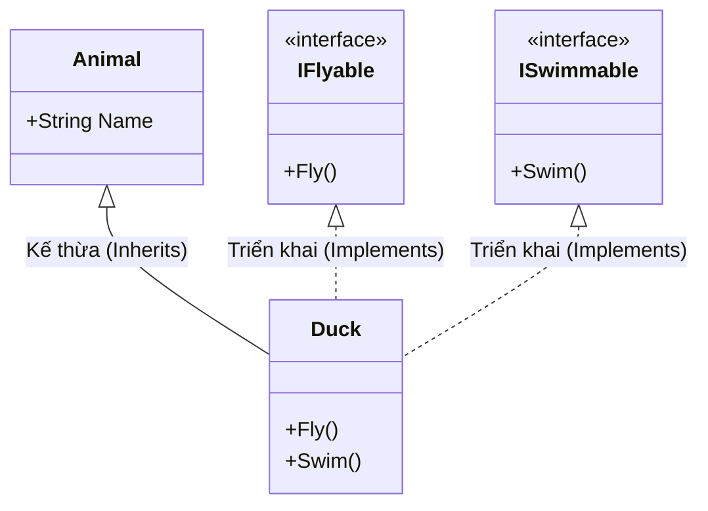

# Interface & Abstract Class {#interface}

Trong Lập trình Hướng đối tượng (OOP), nếu Abstract Class (Lớp trừu tượng) là một bản nháp chung cung cấp "Khuôn mẫu cốt lõi" (Core Identity) cho một đối tượng, thì **Interface (Giao diện)** lại là một "Bản hợp đồng" (Contract) cam kết những "Khả năng" (Capabilities) mà đối tượng đó có thể làm được.

Tính Trừu tượng (Abstraction) đạt được mức cao nhất (100% trừu tượng) thông qua Interface.

## Interface (Giao diện) là gì? {#what-is-interface}

Interface trong C# giống như một lớp hoàn toàn rỗng. Nó chỉ định nghĩa các **chữ ký phương thức (method signatures)**, thuộc tính (properties), và sự kiện (events), nhưng **tuyệt đối không chứa bất kỳ logic cài đặt nào** (trước C# 8.0).

Bất kỳ class hay struct nào "kế thừa" (trong C# gọi là triển khai - implement) interface đó thì BẮT BUỘC phải viết mã thực thi cho tất cả các phương thức mà interface đã định nghĩa.

### Cú pháp cơ bản của Interface

Theo quy ước đặt tên chuẩn trong C# (.NET), tên của Interface luôn bắt đầu bằng chữ `I` in hoa (ví dụ: `IAnimal`, `IMovable`, `IPlayable`).

```csharp
// Khai báo một Interface
public interface IMovable
{
    // Chỉ có khai báo, không có thân hàm
    // Mặc định các thành viên trong Interface là public
    void Move();
    double Speed { get; set; }
}

// Lớp Car triển khai (implements) IMovable
public class Car : IMovable
{
    public double Speed { get; set; } // Phải triển khai property

    public void Move() // Phải triển khai phương thức
    {
        Console.WriteLine("Ô tô đang di chuyển bằng 4 bánh trên đường bộ.");
    }
}

// Lớp Bird triển khai IMovable
public class Bird : IMovable
{
    public double Speed { get; set; }

    public void Move()
    {
        Console.WriteLine("Chim đang bay trên bầu trời.");
    }
}
```

## Giải quyết bài toán Đa Kế Thừa (Multiple Inheritance) {#multiple-inheritance}

Như đã đề cập ở bài [Kế thừa](/docs/oop/inheritance), C# không cho phép một class kế thừa từ nhiều class cha cùng lúc (để tránh vấn đề "Diamond Problem"). Tuy nhiên, một class có thể triển khai **vô số** Interfaces!

Điều này cho phép bạn cung cấp nhiều "khả năng" khác nhau cho một đối tượng mà không phá vỡ cây phân cấp kế thừa.

```csharp
public interface IFlyable
{
    void Fly();
}

public interface ISwimmable
{
    void Swim();
}

// Lớp Duck kế thừa từ lớp cha Animal (chỉ được 1)
// và triển khai cùng lúc 2 Interfaces (được nhiều)
public class Duck : Animal, IFlyable, ISwimmable
{
    public void Fly()
    {
        Console.WriteLine("Vịt đang bay là là mặt nước...");
    }

    public void Swim()
    {
        Console.WriteLine("Vịt đang bơi bằng chân màng...");
    }
}
```



**Lợi ích của Interface:** Nhờ việc duck-typing (nếu nó kêu như vịt, bơi như vịt thì nó là vịt), các hàm của bạn có thể chấp nhận tham số kiểu `IFlyable` mà không cần biết đối tượng truyền vào là con chim, con vịt, hay một chiếc máy bay!

## So sánh Interface và Abstract Class {#interface-vs-abstract-class}

Đây là câu hỏi phỏng vấn kinh điển nhất trong lập trình C#. Hiểu rõ sự khác biệt giữa hai khái niệm này sẽ giúp bạn thiết kế hệ thống phần mềm (System Design) tốt hơn rất nhiều.

| Tiêu chí | Abstract Class (Lớp trừu tượng) | Interface (Giao diện) |
| --- | --- | --- |
| **Bản chất** | Thiết lập quan hệ **"is-a"** (là một). Ví dụ: Chó *là một* Động vật. | Thiết lập quan hệ **"can-do"** (có thể làm). Ví dụ: Chó *có thể* Bơi (`ISwimmable`). |
| **Logic cài đặt** | Có thể chứa phương thức đã được code sẵn, biến, và constructor. | Chỉ chứa tên phương thức (trước C# 8.0, từ 8.0 có hỗ trợ Default Implementation nhưng ít dùng). Không có biến hay constructor. |
| **Đa kế thừa** | Một class chỉ kế thừa được **1** Abstract Class. | Một class có thể triển khai **nhiều** Interface. |
| **Access Modifiers** | Hỗ trợ `public`, `protected`, `private`, v.v. | Mặc định mọi thứ là `public`. |
| **Tốc độ thực thi** | Thường nhanh hơn một chút do tra cứu bảng ảo (v-table) trực tiếp hơn. | Thường chậm hơn một chút xíu do phải tra cứu bảng giao diện. (Gần như không đáng kể trong ứng dụng hiện đại). |

### Khi nào nên dùng cái nào?

- **Dùng Abstract Class khi:**
  1. Các lớp con chia sẻ nhiều mã nguồn chung. (Bạn viết code 1 lần ở lớp cha, các lớp con xài chung).
  2. Các lớp có mối quan hệ hệ thống chặt chẽ từ trên xuống (Hierarchical relationship).
  
- **Dùng Interface khi:**
  1. Bạn muốn định nghĩa các "vai trò" (roles) hoặc "khả năng" (capabilities) mà nhiều đối tượng khác nhau (thậm chí không liên quan gì tới nhau) có thể thực hiện. (Ví dụ: `IComparable` để so sánh, `IEnumerable` để duyệt mảng, `IDisposable` để dọn rác).
  2. Bạn cần vượt qua giới hạn đa kế thừa.
  3. Xây dựng kiến trúc lỏng lẻo (Loosely Coupled), rất quan trọng cho Dependency Injection (DI) sau này.

## Next Steps {#next-steps}

Bây giờ bạn đã nắm vững 4 trụ cột của Lập trình Hướng đối tượng: Đóng gói, Kế thừa, Đa hình và Trừu tượng. Để viết ra những phần mềm cấp Doanh nghiệp dễ bảo trì và mở rộng, chúng ta cần tuân thủ các nguyên tắc thiết kế SOLID!

<div class="vt-box-container next-steps">
  <a class="vt-box" href="/docs/solid/srp">
    <p class="next-steps-link">Nguyên lý SOLID</p>
    <p class="next-steps-caption">Bắt đầu với Nguyên lý Đơn trách nhiệm (Single Responsibility Principle).</p>
  </a>
</div>
