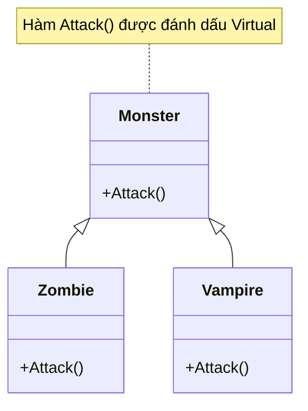

# Tính Đa hình (Polymorphism) {#polymorphism}

:::info Mục tiêu bài học
- Khám phá phép thuật cốt lõi giúp các Design Patterns (Mẫu thiết kế) hoạt động: **Đa hình (Polymorphism)**.
- Phân tách rạch ròi 2 cảnh giới: Đa hình lúc Biên dịch (Overloading) và Đa hình lúc Chạy (Overriding).
- Hiểu được cơ chế hoạt động của từ khóa `virtual` và `override`.
- Cảnh báo sát thủ phỏng vấn: Sự khác biệt chí mạng giữa từ khóa `override` (Ghi đè) và từ khóa `new` (Giấu hàm / Method Hiding).
- Khả năng gom nhóm hàng vạn Class con vào chung một mảng Class cha và điều khiển chúng bằng một vòng lặp duy nhất.
:::

## 1. Lời mở đầu: Phép thuật biến hình {#introduction}

Thuật ngữ **Polymorphism** xuất phát từ tiếng Hy Lạp: *Poly* (Nhiều) và *Morph* (Hình thái). 

> *"Tính đa hình cho phép bạn đối xử với các đối tượng thuộc các Lớp Con (Derived Class) khác nhau như thể chúng là đối tượng của chung một Lớp Cha (Base Class). Nhưng khi bạn ra lệnh cho chúng hành động, mỗi Lớp Con sẽ tự động thực thi hành vi theo cách riêng biệt của nó."*

**Ví dụ thực tế (Real-world analogy):**
Bạn là một Vị Tướng ra chiến trường. Trước mặt bạn là một đội quân thập cẩm gồm: Lính bắn tỉa, Pháo binh, và Lính thiết giáp.
Bạn không cần phải chạy đến từng người và ra lệnh: "Này anh bắn tỉa, hãy nhắm mắt trái và bóp cò súng", "Này anh pháo binh, hãy mồi lửa vào ngòi nổ".
Bạn chỉ cần rút gươm, hét lên một lệnh duy nhất: **"TẤN CÔNG!"**.
Ngay lập tức (Nhờ tính Đa hình), Lính bắn tỉa tự biết bóp cò, Pháo binh tự biết nã pháo, Thiết giáp tự biết húc. Bạn (Người gọi hàm) không cần biết chi tiết bên trong họ làm điều đó như thế nào.

---

## 2. Hai cảnh giới của Đa hình {#two-realms}

Có 2 cách để đạt được Đa hình trong ngôn ngữ lập trình C#:

### 2.1. Đa hình lúc Biên dịch (Compile-time / Method Overloading)
Còn gọi là **Nạp chồng phương thức**. Xảy ra khi bạn viết nhiều hàm có **CÙNG TÊN**, nhưng khác danh sách tham số (khác số lượng hoặc khác kiểu dữ liệu) trong CÙNG MỘT CLASS.

```csharp
public class MathHelper
{
    // Cùng tên Add, nhưng nhận 2 số nguyên
    public int Add(int a, int b) => a + b;

    // Cùng tên Add, nhưng nhận 3 số nguyên
    public int Add(int a, int b, int c) => a + b + c;

    // Cùng tên Add, nhưng nhận số thực (double)
    public double Add(double a, double b) => a + b;
}
```
Khi bạn gõ code `Add(1, 2)`, Visual Studio (Trình biên dịch) sẽ ngay lập tức soi vào biến `1` và `2`, thấy nó là `int`, nên lập tức "trói" lời gọi hàm đó vào hàm số 1. Mọi thứ được quyết định rành mạch ngay từ lúc bạn đang gõ phím (Lúc biên dịch). Rất nhanh và an toàn.

---

### 2.2. Đa hình lúc Chạy (Runtime / Method Overriding)
Đây mới là pháp thuật tối cao của OOP. Xảy ra khi Lớp Con **ghi đè** lại hành vi đã được định nghĩa ở Lớp Cha.

Trong C#, để làm được điều này, bạn cần sự phối hợp của 2 từ khóa:
- `virtual` (Ở Lớp Cha): "Tôi cho phép các con được quyền thay đổi cách chạy của hàm này."
- `override` (Ở Lớp Con): "Tôi quyết định vứt bỏ cách chạy của cha, tôi sẽ làm theo cách của tôi."



**Mã nguồn C#:**
```csharp
public class Monster
{
    // Bật đèn xanh cho phép ghi đè
    public virtual void Attack() 
    {
        Console.WriteLine("Quái vật tấn công cào cấu cơ bản...");
    }
}

public class Zombie : Monster
{
    // Ghi đè thực sự
    public override void Attack() 
    {
        Console.WriteLine("Zombie cắn và lây nhiễm Virus!");
    }
}

public class Vampire : Monster
{
    public override void Attack() 
    {
        Console.WriteLine("Vampire hút máu và hồi máu cho bản thân!");
    }
}
```

### Kỳ tích Runtime (Lúc chương trình đang chạy)

Bạn hãy tạo một danh sách (Mảng) gộp chung tất cả các loại quái vật lại bằng cái nhãn chung là `Monster`.

```csharp
// Một mảng chứa Hỗn hợp các loại quái vật, nhưng được "Ép kiểu ngầm định" (Upcasting) về nhãn Monster
List<Monster> enemies = new List<Monster>
{
    new Monster(),
    new Zombie(),
    new Vampire()
};

// Vị tướng ra lệnh TẤN CÔNG bằng 1 vòng lặp duy nhất
foreach (Monster m in enemies)
{
    // Biến 'm' có kiểu dữ liệu là Monster. 
    // Nhưng CLR (Môi trường ảo của C#) quá thông minh, nó không thèm nhìn cái vỏ bọc Monster.
    // Nó mò thẳng vào RAM, xem cái "Ruột" thực sự bên trong là con gì, và gọi ĐÚNG hàm của con đó!
    m.Attack();
}
```

**Kết quả Console in ra:**
```text
Quái vật tấn công cào cấu cơ bản...
Zombie cắn và lây nhiễm Virus!
Vampire hút máu và hồi máu cho bản thân!
```

Thử tưởng tượng nếu không có Đa hình, bạn sẽ phải viết code bằng một chuỗi `if (m is Zombie) ... else if (m is Vampire)`. Mã nguồn của bạn sẽ thối nát hệt như ví dụ Anti-pattern trong [Strategy Pattern](/docs/patterns/strategy). Nhờ Đa hình, tính năng OCP (Mở-Đóng) mới có thể tồn tại được!

---

## 3. Cú lừa tử thần: Từ khóa `override` vs từ khóa `new` {#method-hiding}

Đây là câu hỏi phỏng vấn kinh điển nhất để loại các ứng viên thiếu kiến thức nền tảng.

Chuyện gì xảy ra nếu Lớp con viết một hàm trùng tên hệt Lớp cha, nhưng Lớp cha lại **KHÔNG CÓ** chữ `virtual`? C# sẽ cho phép bạn dùng từ khóa `new` (Tên gọi: *Method Hiding* - Giấu hàm).

```csharp
public class BaseClass 
{
    public void Speak() => Console.WriteLine("Tiếng nói của CHA"); // Không có virtual
}

public class ChildClass : BaseClass 
{
    // Từ khóa new: "Tôi biết cha tôi có hàm Speak, nhưng tôi sẽ vạch ra một hàm Speak mới tinh của tôi, đè lên nó."
    public new void Speak() => Console.WriteLine("Tiếng nói của CON");
}
```

**Thảm họa xảy ra khi ép kiểu (Polymorphism bị phá vỡ):**

```csharp
// Trường hợp 1: Biến loại gì, trỏ vào Object loại đó
ChildClass obj1 = new ChildClass();
obj1.Speak(); // Output: "Tiếng nói của CON" (Bình thường)

// Trường hợp 2: Biến Lớp CHA, nhưng ruột trỏ vào Object Lớp CON (Upcasting)
BaseClass obj2 = new ChildClass();
obj2.Speak(); // Output: "Tiếng nói của CHA" !!! (WHAT???)
```

**Tại sao dòng code thứ 2 lại in ra "Tiếng nói của CHA" dù đối tượng thực sự trong RAM là thằng `ChildClass`?**
- Vì từ khóa `new` KHÔNG PHẢI là Đa hình (Ghi đè - Override). Nó chỉ là một trò lừa bịp **Che mắt (Hiding)**. 
- Khi dùng `override` (Đa hình thật), chương trình sẽ mò vào ruột trong RAM để chạy.
- Khi dùng `new` (Đa hình giả), chương trình BỊ MÙ. Nó chỉ nhìn vào cái VỎ BỌC bên ngoài (cái nhãn `BaseClass` của biến `obj2`), và nó gọi thẳng luôn cái hàm của Lớp Cha, mặc kệ cái ruột bên trong là Lớp Con!

**Bài học xương máu:** Tuyệt đối tránh xa việc dùng từ khóa `new` để đè hàm (Method Hiding) trừ phi bạn thực sự (rất rất thực sự) hiểu rõ mình đang làm gì. Luôn luôn dùng bộ đôi `virtual` + `override` để tận dụng sức mạnh Đa hình đích thực.

:::tip Tóm tắt nhanh (Key Takeaways)
- Tính đa hình cho phép gọi cùng một hàm nhưng trả về các kết quả khác nhau tùy thuộc vào Object thực sự trong bộ nhớ.
- **Overloading (Nạp chồng):** Đa hình lúc gõ code (Biên dịch). Cùng tên hàm nhưng khác tham số.
- **Overriding (Ghi đè):** Đa hình lúc phần mềm đang chạy (Runtime). Lớp con dẫm nát hàm của Lớp cha để làm theo cách của mình thông qua bộ đôi `virtual` và `override`.
- Cẩn thận với từ khóa `new` (Method Hiding) ở lớp con. Nó sẽ giết chết tính Đa hình nếu bạn cố tình gán (Upcasting) đối tượng con vào một biến tham chiếu kiểu cha.
:::
