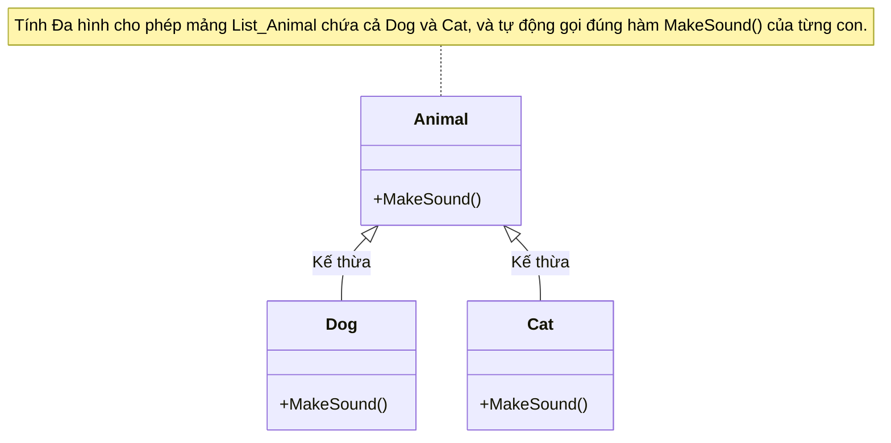

---
title: Tính Đa hình (Polymorphism)
description: Khám phá cách các đối tượng khác nhau có thể thực thi các hành vi riêng biệt thông qua cùng một giao diện trong C#.
---

# Tính Đa hình (Polymorphism) {#polymorphism}

Thuật ngữ **Polymorphism** xuất phát từ tiếng Hy Lạp, có nghĩa là "nhiều hình thái" (poly = nhiều, morph = hình thái). Trong OOP, Tính Đa hình cho phép bạn đối xử với các đối tượng thuộc các lớp dẫn xuất (con) khác nhau như thể chúng là đối tượng của lớp cơ sở (cha) chung, nhưng khi gọi phương thức, hành vi cụ thể của từng lớp con sẽ được thực thi.

Đa hình giúp mã nguồn của bạn linh hoạt, dễ mở rộng và tuân thủ nguyên tắc "Open-Closed" (Mở để mở rộng, Đóng để sửa đổi).

## Hai loại Đa hình trong C# {#types-of-polymorphism}

Tính đa hình thường được chia thành 2 loại chính:
1. **Compile-time Polymorphism (Đa hình lúc biên dịch):** Đạt được thông qua Method Overloading (Nạp chồng phương thức).
2. **Runtime Polymorphism (Đa hình lúc chạy):** Đạt được thông qua Method Overriding (Ghi đè phương thức) kết hợp với Kế thừa.

---

## 1. Nạp chồng phương thức (Method Overloading) {#method-overloading}

Nạp chồng phương thức xảy ra khi bạn có **nhiều phương thức cùng tên nhưng khác tham số** (khác số lượng hoặc khác kiểu dữ liệu) trong cùng một lớp. Trình biên dịch sẽ quyết định gọi hàm nào dựa trên danh sách đối số được truyền vào lúc viết code.

```csharp
public class MathOperations
{
    // Cùng tên Add, nhưng nhận 2 số nguyên
    public int Add(int a, int b)
    {
        return a + b;
    }

    // Cùng tên Add, nhưng nhận 3 số nguyên
    public int Add(int a, int b, int c)
    {
        return a + b + c;
    }

    // Cùng tên Add, nhưng nhận 2 số thực
    public double Add(double a, double b)
    {
        return a + b;
    }
}
```

**Lợi ích:**
Overloading giúp tên hàm nhất quán và dễ nhớ. Bạn không cần phải tạo ra các hàm như `AddTwoInts()`, `AddThreeInts()`, `AddDoubles()` một cách rườm rà.

---

## 2. Ghi đè phương thức (Method Overriding) {#method-overriding}

Đây là hình thái đa hình mạnh mẽ nhất. Nó xảy ra khi lớp con định nghĩa lại (cung cấp một bản triển khai mới) cho một phương thức đã có ở lớp cha. 

Để làm được điều này trong C#, lớp cha phải đánh dấu phương thức bằng từ khóa `virtual` (nghĩa là cho phép lớp con ghi đè), và lớp con phải dùng từ khóa `override`.

### Bước 1: Khai báo lớp cha với từ khóa `virtual`

```csharp
public class Animal
{
    // Từ khóa virtual báo hiệu: "Các lớp con CÓ THỂ thay đổi cách chạy của hàm này"
    public virtual void MakeSound()
    {
        Console.WriteLine("Con vật tạo ra một âm thanh chung...");
    }
}
```

### Bước 2: Ghi đè ở lớp con với từ khóa `override`

```csharp
public class Dog : Animal
{
    // Ghi đè (thay thế) hành vi của lớp cha
    public override void MakeSound()
    {
        Console.WriteLine("Gâu! Gâu! Gâu!");
    }
}

public class Cat : Animal
{
    public override void MakeSound()
    {
        Console.WriteLine("Meo meo meo...");
    }
}
```



### Bước 3: Phép thuật Đa hình lúc Runtime

Đa hình thực sự tỏa sáng khi bạn sử dụng một danh sách các đối tượng thuộc kiểu của lớp cha, nhưng chứa các instance của lớp con:

```csharp
// Mảng kiểu Animal (Lớp cha)
List_Animal myPets = new List_Animal 
{
    new Animal(),
    new Dog(),
    new Cat()
};

foreach (Animal pet in myPets)
{
    // ĐA HÌNH: Cùng là gọi hàm MakeSound() trên biến kiểu Animal, 
    // nhưng kết quả in ra sẽ khác nhau tùy thuộc vào đối tượng thực sự trong bộ nhớ lúc chạy!
    pet.MakeSound();
}

// Kết quả Output:
// Con vật tạo ra một âm thanh chung...
// Gâu! Gâu! Gâu!
// Meo meo meo...
```

**Nguyên tắc hoạt động:**
Khi chương trình chạy (Runtime), CLR (Môi trường thực thi của C#) sẽ nhìn vào kiểu đối tượng **thực sự** nằm trong bộ nhớ (ví dụ `Dog`), chứ không phải kiểu của biến tham chiếu (`Animal`). CLR sau đó sẽ tìm hàm `MakeSound()` được `override` gần nhất để gọi.

## Sức mạnh của Đa hình trong thực tế {#real-world-power}

Giả sử bạn đang làm game, bạn có danh sách hàng ngàn thực thể (Enemies, NPCs, Players). Thay vì phải viết hàng ngàn câu lệnh `if (entity is Zombie) { ... } else if (entity is Vampire) { ... }`, bạn chỉ cần gọi `entity.Render()` và `entity.Attack()`. Mỗi con quái vật sẽ tự biết cách vẽ nó lên màn hình và cách tấn công người chơi nhờ Đa hình!

## Next Steps {#next-steps}

Đôi khi, lớp cha không biết (và không nên biết) cách thực thi một hành vi, nó chỉ muốn **bắt buộc** các lớp con phải thực thi hành vi đó. Đó là lúc chúng ta cần đến **Tính Trừu tượng**.

<div class="vt-box-container next-steps">
  <a class="vt-box" href="/docs/oop/abstraction">
    <p class="next-steps-link">Trừu tượng (Abstraction)</p>
    <p class="next-steps-caption">Abstract Classes và Interfaces trong C#.</p>
  </a>
</div>


