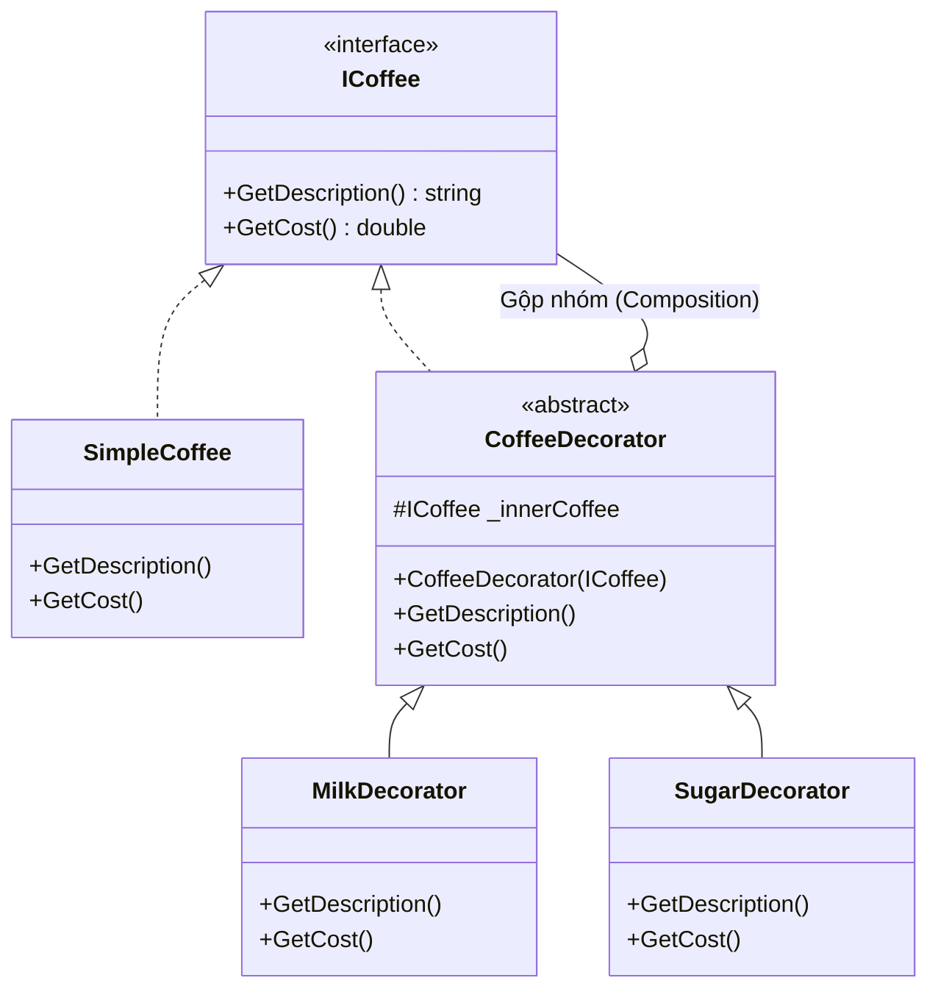

# Decorator Pattern {#decorator}

**Decorator Pattern** (Mẫu thiết kế Trang trí) là một trong những mẫu thiết kế Cấu trúc (Structural) phổ biến nhất, giúp bạn thêm hành vi hoặc trạng thái mới vào một đối tượng **tại thời điểm chạy (Runtime)** một cách linh hoạt, mà không cần sử dụng tính kế thừa (Inheritance).

Nguyên lý của Decorator chính là tôn chỉ của **Open-Closed Principle (OCP)**: Mở để mở rộng, nhưng đóng để sửa đổi.

## Tại sao Kế thừa (Inheritance) lại có hại? {#why-not-inheritance}

Giả sử bạn đang làm một ứng dụng quán Cà phê. Bạn có lớp `Coffee` cơ bản. 
Khách hàng muốn thêm Sữa -> Bạn tạo lớp `MilkCoffee : Coffee`.
Khách hàng muốn thêm Đường -> Bạn tạo lớp `SugarCoffee : Coffee`.

Điều gì xảy ra nếu khách muốn Cà phê + Sữa + Đường? Bạn lại phải tạo `MilkSugarCoffee`. Nếu menu có 10 loại topping, bạn sẽ phải tạo ra hàng trăm lớp con để bao phủ mọi sự kết hợp! Sự bùng nổ lớp (Class Explosion) này là cơn ác mộng bảo trì.

## Giải pháp của Decorator {#solution}

Thay vì dùng kế thừa để sinh ra một giống loài mới, Decorator sử dụng nguyên lý **Composition (Gộp nhóm)**. Bạn sẽ tạo ra một lớp "Vỏ bọc" (Decorator). Lớp Vỏ bọc này có cùng Interface với lõi Cà phê, và nó "nuốt" cái lõi Cà phê vào trong bụng nó.

**Cấu trúc kinh điển:**
1. **Component:** Giao diện chung (`ICoffee`).
2. **ConcreteComponent:** Lõi cơ bản (`SimpleCoffee`).
3. **Decorator:** Lớp vỏ bọc trừu tượng (kế thừa `ICoffee` và chứa một đối tượng `ICoffee` bên trong).
4. **ConcreteDecorator:** Các lớp vỏ bọc cụ thể (`MilkDecorator`, `SugarDecorator`).



## Cài đặt bằng C# {#code-example}

```csharp
// 1. Interface chung
public interface ICoffee
{
    string GetDescription();
    double GetCost();
}

// 2. Lõi Cà phê đen cơ bản (ConcreteComponent)
public class SimpleCoffee : ICoffee
{
    public string GetDescription() => "Cà phê đen";
    public double GetCost() => 10.0;
}

// 3. Lớp Vỏ bọc trừu tượng (Decorator)
public abstract class CoffeeDecorator : ICoffee
{
    protected readonly ICoffee _innerCoffee;

    public CoffeeDecorator(ICoffee innerCoffee)
    {
        _innerCoffee = innerCoffee;
    }

    public virtual string GetDescription() => _innerCoffee.GetDescription();
    public virtual double GetCost() => _innerCoffee.GetCost();
}

// 4. Topping Sữa (ConcreteDecorator)
public class MilkDecorator : CoffeeDecorator
{
    public MilkDecorator(ICoffee innerCoffee) : base(innerCoffee) { }

    public override string GetDescription() => $"{base.GetDescription()} + Sữa tươi";
    public override double GetCost() => base.GetCost() + 5.0; // Phụ thu 5k
}

// 5. Topping Đường (ConcreteDecorator)
public class SugarDecorator : CoffeeDecorator
{
    public SugarDecorator(ICoffee innerCoffee) : base(innerCoffee) { }

    public override string GetDescription() => $"{base.GetDescription()} + Đường";
    public override double GetCost() => base.GetCost() + 2.0; // Phụ thu 2k
}
```

### Cách sử dụng (Xếp hình Lego)

```csharp
// 1. Khách gọi 1 ly cà phê đen (10k)
ICoffee myCoffee = new SimpleCoffee();

// 2. Khách đổi ý, muốn thêm Sữa (10k + 5k = 15k)
// Ta lấy Vỏ Sữa bọc ra ngoài Lõi Cà phê
myCoffee = new MilkDecorator(myCoffee); 

// 3. Khách lại đổi ý, muốn thêm Đường (15k + 2k = 17k)
// Ta lấy Vỏ Đường bọc ra ngoài (Vỏ Sữa + Lõi Cà phê)
myCoffee = new SugarDecorator(myCoffee);

Console.WriteLine(myCoffee.GetDescription()); // Cà phê đen + Sữa tươi + Đường
Console.WriteLine($"Tổng tiền: {myCoffee.GetCost()}k"); // Tổng tiền: 17k
```

Bạn có thể bọc bao nhiêu lớp vỏ tùy thích, theo bất kỳ thứ tự nào lúc Runtime!

## Decorator trong thế giới .NET (Thực tế) {#dotnet-reality}

Bạn có thể không nhận ra, nhưng bạn đang dùng Decorator mỗi ngày khi code C#.

**1. Streams trong C# (System.IO)**
`FileStream`, `MemoryStream`, `NetworkStream` đều kế thừa từ `Stream` (Component).
Khi bạn muốn nén một file, bạn không tìm lớp `CompressedFileStream`. Bạn bọc `GZipStream` (Decorator) ra ngoài `FileStream`!
```csharp
using var fileStream = new FileStream("data.txt", FileMode.Open);
// GZipStream nuốt fileStream vào bụng nó
using var gzipStream = new GZipStream(fileStream, CompressionMode.Compress); 
```

**2. Middleware trong ASP.NET Core**
Pipeline của ASP.NET Core chính là mô hình Russian Doll (Búp bê Nga) của Decorator Pattern. Mỗi Middleware (ví dụ: Logging, Authentication) bọc lấy `RequestDelegate` (Lõi), thực hiện công việc của nó, rồi gọi `next()` để nhường quyền cho lớp vỏ bên trong.

## Next Steps {#next-steps}

Decorator giải quyết bài toán thêm hành vi lúc Runtime cực kỳ thanh lịch. Kế tiếp, hãy tìm hiểu một mẫu thiết kế giúp bạn đóng gói các thuật toán khác nhau (ví dụ: thuật toán giảm giá, thuật toán thanh toán) và hoán đổi chúng một cách mượt mà: **Strategy Pattern**.

<div class="vt-box-container next-steps">
  <a class="vt-box" href="/docs/patterns/strategy">
    <p class="next-steps-link">Strategy Pattern</p>
    <p class="next-steps-caption">Thay đổi chiến thuật thuật toán tại Runtime.</p>
  </a>
</div>
