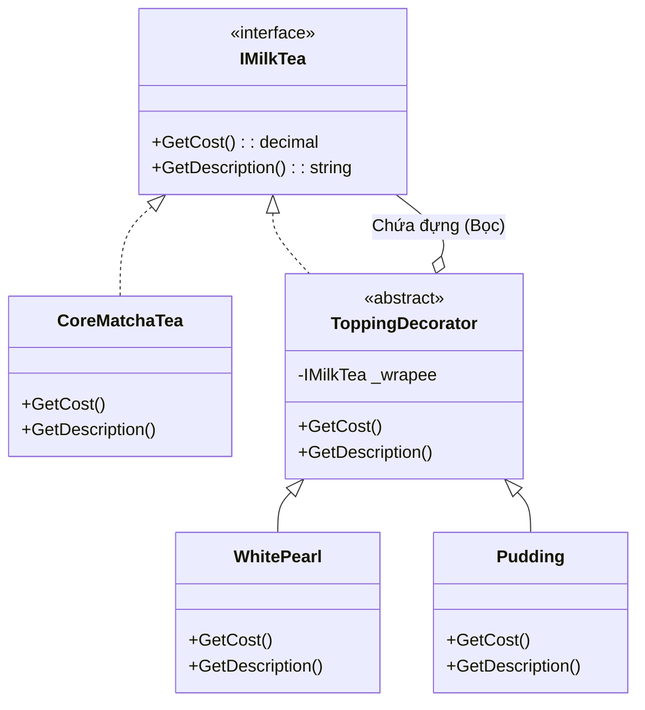

# Decorator Pattern (Mẫu Trang Trí) {#decorator}

:::info Mục tiêu bài học
- Khám phá sức mạnh của **Thành phần Bọc (Wrapper)**. Học cách dính thêm chức năng mới vào đối tượng mà không cần sửa đổi mã nguồn gốc.
- Nhận diện thảm họa **Class Explosion (Bùng nổ Kế thừa)** khi cố gắng dùng Subclass để bao quát mọi trường hợp.
- Mổ xẻ bài toán thực tế: Hệ thống tính tiền Cửa hàng Trà Sữa (Topping trân châu, pudding, phô mai dồn cục).
- Vẽ sơ đồ UML củ hành tây nhiều lớp cực trực quan.
- Hiểu được tại sao Decorator lại là lõi của hệ thống `Stream` (File, Network, Crypto) trong Java và C#.
:::

## 1. Lời mở đầu: Nghệ thuật mặc áo giáp {#introduction}

Nằm trong nhóm **Structural Patterns (Mẫu Cấu Trúc)**, Decorator mang đến một năng lực dị thường: Nó cho phép bạn đính kèm ĐỘNG (Dynamic) các tính năng mới vào một Đối tượng bằng cách đặt đối tượng đó vào trong một lớp Vỏ bọc (Wrapper).

> *"Hãy ưu tiên dùng Thành phần Bọc (Composition) thay vì Kế thừa (Inheritance)."*

**Ví dụ thực tế (Real-world analogy):**
Mùa đông, bạn đang mặc một chiếc áo phông (Đối tượng gốc). 
- Ra ngoài đường thấy hơi lạnh, bạn khoác thêm một chiếc **Áo Len** (Decorator 1). Lúc này, bạn ấm hơn một chút. 
- Trời lại lất phất mưa, bạn mặc đè thêm một chiếc **Áo Mưa** ra ngoài cùng (Decorator 2). Bây giờ bạn vừa ấm, vừa chống nước.
- Dù bọc mấy lớp áo đi chăng nữa, thì "Bản chất" bên trong của bạn vẫn là một Con Người (Interface). Áo Len và Áo Mưa chỉ là "Trang trí" thêm tính năng cho bạn. Bạn có thể lột áo ra, hoặc mặc thêm một tỷ cái áo khác mà không cần phải đẻ ra một giống loài (Class) đột biến mới như "Người-ÁoLen-ÁoMưa".

---

## 2. Giải phẫu Anti-pattern: Bùng nổ Kế thừa {#anti-pattern}

Hãy mở Cửa hàng Trà Sữa (MilkTea). Ban đầu menu của bạn rất đơn giản.
Bạn tạo Interface `IMilkTea` và 2 class: `BlackSugarMilkTea` (Sữa tươi trân châu đường đen) và `MatchaMilkTea` (Trà sữa Matcha). Mọi thứ rất êm đẹp.

Nhưng Khách hàng rất thích mix topping! Khách gọi: *"Cho em ly Trà sữa Matcha thêm Trân châu trắng"*.
Theo tư duy lập trình Kế thừa (Inheritance) cũ rích, bạn sẽ tạo ra các Lớp Con để tính giá:

```csharp
// MÃ XẤU - BÙNG NỔ KẾ THỪA (CLASS EXPLOSION)
public class MatchaMilkTea : IMilkTea { }

// Khách muốn thêm Trân châu trắng? Ok, kế thừa!
public class MatchaWithWhitePearl : MatchaMilkTea { }

// Khách muốn thêm Pudding?
public class MatchaWithPudding : MatchaMilkTea { }

// Khách muốn cả hai? (Tới công chuyện luôn)
public class MatchaWithWhitePearlAndPudding : MatchaMilkTea { }

// Vậy nếu Menu bạn có 10 loại Trà, và 10 loại Topping?
// Số lượng Class bạn phải tạo ra là: 10 * 10 * 10... = HÀNG NGÀN CLASS!
```

Đây chính là **Class Explosion**. Mã nguồn của bạn phình to không thể kiểm soát.

---

## 3. Quá trình Phẫu thuật: Bóc tách Củ hành tây {#refactoring}

Bí quyết của Decorator nằm ở chỗ: **Cái Áo Khoác (Wrapper) cũng có cùng một Loại Hợp Đồng (Interface) y hệt như Đối Tượng Gốc (Core Object).**

Bằng cách này, Áo Khoác có thể giả dạng làm Đối tượng gốc. Người ngoài nhìn vào không thể biết đó là Đối tượng thật, hay chỉ là Áo Khoác.



1. Mọi thứ đều thỏa mãn chuẩn `IMilkTea`.
2. Lớp `ToppingDecorator` là Lớp Bọc. Bên trong bụng nó chứa MỘT cái `IMilkTea` khác (Có thể là Trà gốc, hoặc lại là một cái Áo Khoác Topping khác).
3. Khi gọi hàm `GetCost()`, Lớp bọc ngoài cùng sẽ tính tiền Topping của nó, rồi MÓC TÚI (gọi hàm GetCost) của lớp bọc bên trong, cộng dồn lại!

---

## 4. Mã nguồn chuẩn mực Decorator (C#) {#clean-code}

Hãy xem sức mạnh của sự bọc lót.

**Bước 1: Thành phần cốt lõi**
```csharp
// Giao diện chung cho cả TRÀ GỐC và TOPPING (Áo khoác)
public interface IMilkTea
{
    string GetDescription();
    decimal GetCost();
}

// Đối tượng cốt lõi (Core Component)
public class MatchaTea : IMilkTea
{
    public string GetDescription() => "Trà sữa Matcha";
    public decimal GetCost() => 30000;
}
```

**Bước 2: Xây dựng Khuôn mẫu Lớp bọc (Decorator Base)**
```csharp
// Lớp trừu tượng này là "Áo Khoác". Nó vừa "LÀ" Trà Sữa, lại vừa "CHỨA" Trà Sữa.
public abstract class ToppingDecorator : IMilkTea
{
    // Đối tượng bị bọc bên trong (Lõi)
    protected IMilkTea _wrapee;

    public ToppingDecorator(IMilkTea wrapee)
    {
        _wrapee = wrapee; // Bọc nó lại!
    }

    // Mặc định, nó đẩy công việc cho lõi bên trong tính
    public virtual string GetDescription() => _wrapee.GetDescription();
    public virtual decimal GetCost() => _wrapee.GetCost();
}
```

**Bước 3: Chế tạo các loại Áo Giáp (Topping cụ thể)**
```csharp
// Lớp bọc Trân Châu Trắng
public class WhitePearlTopping : ToppingDecorator
{
    public WhitePearlTopping(IMilkTea wrapee) : base(wrapee) { }

    public override string GetDescription() 
        => _wrapee.GetDescription() + ", Trân châu trắng";

    // Cộng dồn 10k vào giá của Lõi bên trong
    public override decimal GetCost() 
        => _wrapee.GetCost() + 10000;
}

// Lớp bọc Pudding
public class PuddingTopping : ToppingDecorator
{
    public PuddingTopping(IMilkTea wrapee) : base(wrapee) { }

    public override string GetDescription() 
        => _wrapee.GetDescription() + ", Pudding trứng";

    // Cộng dồn 15k vào giá của Lõi
    public override decimal GetCost() 
        => _wrapee.GetCost() + 15000;
}
```

### Kỳ tích khi ghép nối Củ Hành Tây (Client Code)

Khách hàng Order: *"1 Matcha, 2 lần Trân Châu Trắng, 1 lần Pudding"*. (Điều này là BẤT KHẢ THI nếu dùng cách Kế Thừa cũ).

```csharp
// 1. Tạo lõi Trà Matcha (30k)
IMilkTea myCup = new MatchaTea(); 

// 2. Bọc Lớp 1: Trân châu trắng (+10k)
myCup = new WhitePearlTopping(myCup);

// 3. Bọc Lớp 2: Thêm 1 vá Trân châu trắng nữa! (+10k)
myCup = new WhitePearlTopping(myCup);

// 4. Bọc Lớp 3 ngoài cùng: Pudding (+15k)
myCup = new PuddingTopping(myCup);

// TÍNH TIỀN! 
// Dòng chảy từ ngoài vào trong: 
// Pudding -> WhitePearl 2 -> WhitePearl 1 -> Matcha Core
Console.WriteLine(myCup.GetDescription());
// Kết quả: "Trà sữa Matcha, Trân châu trắng, Trân châu trắng, Pudding trứng"

Console.WriteLine($"Tổng tiền: {myCup.GetCost()} VNĐ");
// Kết quả: 30000 + 10000 + 10000 + 15000 = 65000 VNĐ
```
Thật điên rồ! Bạn có thể dồn 100 cái topping vào nhau một cách thoải mái. Bạn đã giải cứu dự án khỏi hàng ngàn Lớp kế thừa rác rưởi.

---

## 5. Crossover: Hệ thống I/O Stream (Java & C#) {#real-world}

Bạn có bao giờ thắc mắc tại sao khi đọc/ghi File trong C# hay Java, code thường trông rất dài dòng theo kiểu lồng nhau như thế này không?

```csharp
// Đọc File -> Giải nén GZip -> Chuyển byte thành chuỗi Text
using (var fs = new FileStream("data.txt", FileMode.Open))
{
    using (var gzip = new GZipStream(fs, CompressionMode.Decompress))
    {
        using (var reader = new StreamReader(gzip))
        {
            string content = reader.ReadToEnd();
        }
    }
}
```

Vâng, thư viện IO `Stream` của cả Java và .NET chính là ví dụ kinh điển vĩ đại nhất của **Decorator Pattern**! 
- `FileStream` là Lõi nguyên thủy (Lấy byte thô từ Ổ cứng).
- `GZipStream` là Áo khoác (Nhận byte thô, xử lý giải nén, rồi ói ra cho tầng trên).
- `StreamReader` là Áo khoác ngoài cùng (Biến byte thành String chữ có ý nghĩa).

Bằng thiết kế này, Microsoft không cần phải tạo ra hàng vạn Class dạng `ZipEncryptedNetworkStreamReader`. Họ chỉ cần tạo các Decorator độc lập và cho phép Dev tự bọc củ hành tây theo ý muốn!

:::tip Tóm tắt nhanh (Key Takeaways)
- Decorator giải quyết triệt để nạn **Class Explosion** (Bùng nổ kế thừa) bằng nguyên lý bọc đối tượng (Composition).
- Bí kíp: Lớp Bọc (Decorator) vừa **kế thừa Interface** của đối tượng, lại vừa chứa một **biến tham chiếu (Instance)** trỏ vào ruột của đối tượng đó.
- Mối liên hệ với **Chain of Responsibility:** Cả hai mẫu đều "rót" lời gọi sang một đối tượng khác (gọi là *chained handler* / vỏ bọc bên trong). Nhưng chuỗi trong Chain of Responsibility dừng sớm tại handler đầu tiên xử lý được, còn Decorator luôn chạy qua **tất cả** các lớp vỏ từ ngoài vào trong rồi cộng dồn hoặc biến đổi lần lượt.
- Điểm yếu: hệ thống sinh ra nhiều Object lồng ghép (Instantiating Layers), khiến việc gỡ lỗi (Debug) trace code phải chui qua hàng chục tầng bọc. Vì vậy hạn chế Bọc quá sâu, và không nên lạm dụng tạo một mê cung Wrapper dày đặc làm khó đọc mã.
- **Decorator vs Inheritance:** Render code nhẹ nhàng (Composition-first) — bạn chỉ bọc khi cần đúng đối tượng đó, còn Inheritance buộc tạo ra một Class tĩnh từ trước và nhân bản vô số lớp con khi số tổ hợp tăng.
:::

## Next Steps {#next-steps}

- Đang học các Structural Patterns? Bắt đầu từ [Singleton](/docs/patterns/singleton) — mẫu đảm bảo một đối tượng duy nhất trong toàn hệ thống, rất khác tư duy "đẻ vô số lớp vỏ" của Decorator.
- Đang code theo kiểu bọc đối tượng? Khám phá [Strategy](/docs/patterns/strategy) để tách thuật toán khỏi class khi bạn cần **nhổ** hành vi ra thay vì **bọc thêm**.
- Hiểu cách Decorator tôn trọng giao ước [Open-Closed (OCP)](/docs/solid/ocp) để mở rộng chức năng mà không cần sửa mã đối tượng gốc.
- Ôn lại nền tảng **Tính Đa hình ([Polymorphism](/docs/oop/polymorphism))** — thứ mà Decorator dựa vào để lớp vỏ "giả danh" được đối tượng gốc.

## 📚 Tham khảo lý thuyết

- *Design Patterns: Elements of Reusable Object-Oriented Software* — Erich Gamma, Richard Helm, Ralph Johnson, John Vlissides (Gang of Four), Addison-Wesley, 1994.
- *Head First Design Patterns* — Eric Freeman & Elisabeth Robson, O'Reilly Media.
- Wikipedia — Decorator pattern (định nghĩa tổng quan và ví dụ).
- Microsoft Learn — "Decorator" trong loạt bài về Design Pattern trên nền tảng .NET.
- Refactoring.Guru — "Decorator" (giải thích kèm sơ đồ và mã so sánh Inheritance/Composition).
- SourceMaking — "Decorator" (anti-pattern kèm ví dụ thuộc Application).
