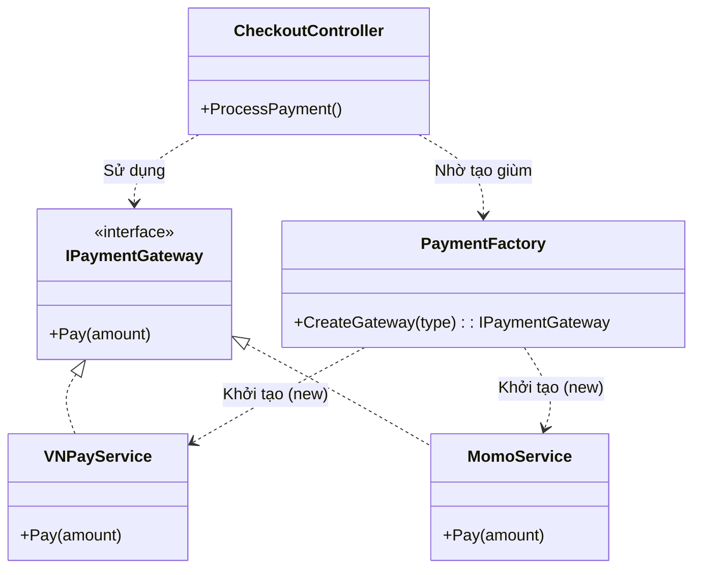
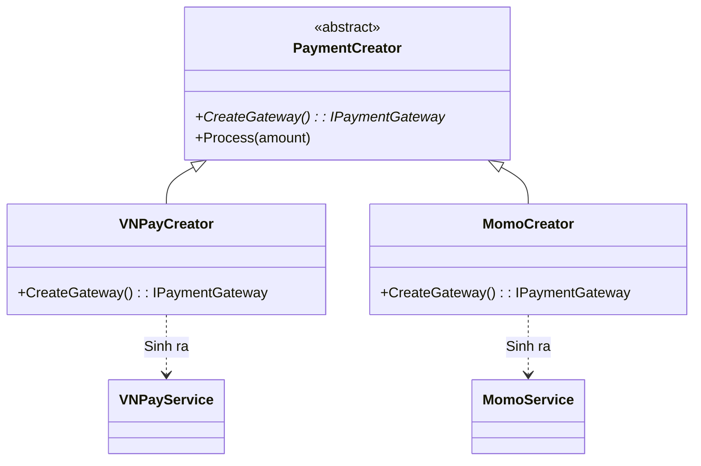

# Factory Method Pattern (Nhà máy chế tạo) {#factory}

:::info Mục tiêu bài học
- Thấu hiểu rủi ro của việc rải rác từ khóa `new` khắp nơi trong mã nguồn.
- Mổ xẻ bài toán thực tế: Tích hợp nhiều Cổng thanh toán (Momo, VNPay, ZaloPay).
- Giải pháp: Chuyển giao trách nhiệm Khởi tạo đối tượng (Creation) sang một "Nhà máy" chuyên biệt.
- Khám phá sức mạnh cộng hưởng giữa Factory Method và nguyên lý **Open-Closed (OCP)**.
- Phân biệt giữa *Simple Factory* (Nhà máy đơn giản) và *Factory Method Pattern* (Mẫu thiết kế chuẩn Gof).
:::

## 1. Lời mở đầu: Bản án tử hình cho từ khóa "new" {#introduction}

Nằm trong nhóm **Creational Patterns (Mẫu Khởi tạo)**, Factory Method được sinh ra để giải quyết một vấn đề nhức nhối: Sự phụ thuộc dính chặt (Tightly Coupled).

Mỗi khi bạn gõ từ khóa `new` (ví dụ: `new MomoPayment()`), bạn đang lấy keo siêu dính 502 hàn chặt Class hiện tại của bạn vào Class `MomoPayment`. Nếu Class `MomoPayment` cần thay đổi hàm khởi tạo (ví dụ đòi thêm truyền tham số `API_Key`), bạn sẽ phải đi quét toàn bộ dự án, tìm xem có bao nhiêu chữ `new MomoPayment()` để sửa lại. Đó là một cơn ác mộng bảo trì!

> *"Thay vì tự tay chế tạo đồ đạc (Dùng `new`), hãy gọi điện cho một Nhà máy (Factory) và yêu cầu họ gửi đồ đạc (Object) tới cho bạn. Việc chế tạo ra sao là chuyện của Nhà máy, bạn không cần quan tâm!"*

**Ví dụ thực tế (Real-world analogy):**
Bạn mở một xưởng đóng gói Logistics. Ban đầu, công ty chỉ có xe tải (`Truck`). Nhân viên của bạn cứ thấy đơn hàng là tự tay chạy đi kiếm một chiếc Xe tải (`new Truck()`) để chở hàng.
Sau này, công ty mở rộng đường biển (Dùng `Ship`), đường không (Dùng `Airplane`). Nhân viên bây giờ phải suy nghĩ (dùng `if/else`) xem gói hàng này thì đi kiếm xe tải, gói kia thì kiếm Tàu thủy. Nhân viên đang ôm quá nhiều trách nhiệm (Vi phạm SRP).
**Giải pháp:** Xây dựng một Phòng ban Điều phối (Factory). Nhân viên chỉ cần ném đơn hàng cho phòng đó, phòng đó sẽ tự động điều động phương tiện phù hợp nhất. Nhân viên chỉ việc lấy phương tiện đó đi giao (Dùng qua Interface `ITransport`).

---

## 2. Giải phẫu Anti-pattern: Rẽ nhánh khởi tạo mù quáng {#anti-pattern}

Hãy xem xét hệ thống E-commerce đang cần thanh toán tiền bằng 2 cổng: VNPay và Momo.

```csharp
// MÃ XẤU - KẾT DÍNH KHỞI TẠO VÀ LOGIC NGHIỆP VỤ
public class CheckoutController
{
    public void ProcessPayment(string paymentType, decimal amount)
    {
        // Controller đang phải TỰ TAY đi tạo ra các Đối tượng
        if (paymentType == "VNPay")
        {
            var vnpay = new VNPayService(); // Tightly coupled!
            vnpay.Initialize("VNPAY_SECRET_KEY");
            vnpay.Pay(amount);
        }
        else if (paymentType == "Momo")
        {
            var momo = new MomoService(); // Tightly coupled!
            momo.SetupKey("MOMO_RSA_KEY");
            momo.Pay(amount);
        }
        // Tuần sau sếp đòi thêm ZaloPay, ShopeePay... thì cái hàm này dài dằng dặc!
    }
}
```

**Tại sao nó Vi phạm Nguyên lý Thiết kế?**
1. **Vi phạm OCP (Open-Closed):** Thêm cổng thanh toán mới bắt buộc phải mở file Controller ra sửa hàm `ProcessPayment`.
2. **Vi phạm SRP (Single Responsibility):** Controller sinh ra là để tiếp nhận Request (Request Handling), không phải là công xưởng chế tạo Đối tượng. Việc khởi tạo và truyền API Key là nhiệm vụ nằm ngoài chuyên môn của nó.

---

## 3. Quá trình Phẫu thuật: Xây dựng Nhà máy (Simple Factory) {#refactoring-simple}

Bước đầu tiên để giải cứu Controller, ta cần một Interface chung (Để tuân thủ OCP) và một Nhà máy đơn giản (Simple Factory) để tống hết đống `if/else` ra khỏi Controller.



**Mã nguồn (Simple Factory):**

```csharp
// 1. Tiêu chuẩn chung (Interface)
public interface IPaymentGateway
{
    void Pay(decimal amount);
}

// 2. Các thiết bị cụ thể
public class VNPayService : IPaymentGateway { 
    public void Pay(decimal amount) => Console.WriteLine($"Thanh toán VNPay: {amount}"); 
}
public class MomoService : IPaymentGateway { 
    public void Pay(decimal amount) => Console.WriteLine($"Thanh toán Momo: {amount}"); 
}

// 3. NHÀ MÁY SẢN XUẤT CHÍNH (SIMPLE FACTORY)
public static class PaymentFactory
{
    // Hàm này giấu đi toàn bộ logic khởi tạo phức tạp
    public static IPaymentGateway Create(string type)
    {
        switch (type)
        {
            case "VNPay":
                var vnpay = new VNPayService();
                // (Giả sử có logic load API key phức tạp ở đây)
                return vnpay;
                
            case "Momo":
                return new MomoService();
                
            default:
                throw new ArgumentException("Cổng thanh toán không hỗ trợ!");
        }
    }
}
```

Bây giờ, Controller của bạn đã được giải thoát hoàn toàn, cực kỳ trong sạch:

```csharp
public class CheckoutController
{
    public void ProcessPayment(string paymentType, decimal amount)
    {
        // 1. Nhờ Nhà máy chế tạo (KHÔNG CẦN DÙNG 'new')
        IPaymentGateway gateway = PaymentFactory.Create(paymentType);
        
        // 2. Sử dụng sản phẩm một cách đa hình
        gateway.Pay(amount);
    }
}
```

*(Lưu ý: "Simple Factory" rất tiện, nhưng nó vẫn vi phạm chữ "O" ở file Factory. Vì mỗi lần thêm ZaloPay, bạn vẫn phải vào hàm `Create` thêm `case "ZaloPay"`. Để đạt đẳng cấp tối cao, ta phải dùng **Factory Method** chuẩn GoF).*

---

## 4. Đẳng cấp tối cao: Factory Method Pattern (Chuẩn GoF) {#factory-method-gof}

Nguyên lý GoF phát biểu: 
> *"Hãy định nghĩa một Interface cho việc tạo đối tượng, nhưng để Lớp con (Subclass) quyết định Lớp nào (Class) sẽ được khởi tạo. Factory Method giao phó việc khởi tạo cho các Lớp con."*

Thay vì dùng 1 Nhà máy vĩ đại ôm đồm cái lệnh `switch/case` khổng lồ, ta sẽ chia ra thành **Nhiều Nhà Máy Con**, mỗi nhà máy chỉ chuyên rèn ra 1 món đồ duy nhất!



### Mã nguồn C# (Chuẩn Factory Method)

```csharp
// 1. Lớp Trừu tượng Đóng vai trò làm "Xưởng" chung
public abstract class PaymentCreator
{
    // Cốt lõi của Pattern: Hàm Factory Method là dạng Abstract!
    // Trách nhiệm khởi tạo (Dùng chữ new) bị đẩy xuống cho bọn Lớp Con.
    protected abstract IPaymentGateway CreateGateway();

    // Hàm nghiệp vụ chung (Dùng lại cái đồ vật do Lớp con tạo ra)
    public void Process(decimal amount)
    {
        IPaymentGateway gateway = CreateGateway(); // Gọi hàm abstract
        gateway.Pay(amount);
    }
}

// 2. Xưởng sản xuất VNPay (Chỉ biết đẻ ra VNPay)
public class VNPayCreator : PaymentCreator
{
    protected override IPaymentGateway CreateGateway()
    {
        return new VNPayService(); // Dùng 'new' ở tận cùng của nhánh
    }
}

// 3. Xưởng sản xuất Momo (Chỉ biết đẻ ra Momo)
public class MomoCreator : PaymentCreator
{
    protected override IPaymentGateway CreateGateway()
    {
        return new MomoService();
    }
}
```

**Sức mạnh lật đổ của Factory Method:**
Hệ thống lúc này đã trở thành một **Ổ Cắm Điện hoàn hảo**.
Tuần sau Sếp yêu cầu thêm `ZaloPay`. Cực kỳ đơn giản! Bạn ĐÓNG hoàn toàn toàn bộ code hiện tại lại (Không sửa một dòng nào). Bạn chỉ việc tạo thêm một file mới `ZaloPayCreator.cs` kế thừa `PaymentCreator`. Mở rộng tính năng vô hạn (OCP tuyệt đối 100%).

---

## 5. Ứng dụng thực tế: Factory + Dictionary C# (Bonus) {#modern-factory}

Trong dự án C# thực tế (Ví dụ ASP.NET Core), viết một đống Creator Class như GoF đôi khi quá rườm rà (Over-engineering). Các Senior Dev thường kết hợp Simple Factory + Dictionary hoặc Reflection (Hoặc IoC Container) để diệt trừ `switch/case` mà không phải đẻ ra hàng tá Class thừa.

```csharp
public class ModernPaymentFactory
{
    // Đăng ký các hàm khởi tạo (Delegates Func) vào một Cuốn từ điển
    private readonly Dictionary<string, Func<IPaymentGateway>> _factories 
        = new Dictionary<string, Func<IPaymentGateway>>();

    public ModernPaymentFactory()
    {
        // Lúc khởi động App, cấu hình sẵn từ điển
        _factories.Add("VNPay", () => new VNPayService());
        _factories.Add("Momo", () => new MomoService());
    }

    public void RegisterNewGateway(string name, Func<IPaymentGateway> factoryFunc)
    {
        _factories[name] = factoryFunc; // Chìa khóa mở rộng OCP không cần sửa code cũ
    }

    public IPaymentGateway Create(string name)
    {
        if (_factories.TryGetValue(name, out var factoryFunc))
        {
            return factoryFunc(); // Khởi động hàm tạo
        }
        throw new NotSupportedException($"Không hỗ trợ {name}");
    }
}
```

:::tip Tóm tắt nhanh (Key Takeaways)
- Từ khóa `new` là kẻ thù của sự linh hoạt (Tightly Coupled). Factory Pattern sinh ra để giấu chữ `new` đó đi.
- **Simple Factory:** Gom logic `if/else` vào một Class duy nhất. Giải phóng được Controller nhưng file Factory vẫn vi phạm OCP.
- **Factory Method (GoF):** Dùng tính Kế Thừa (Inheritance) để ép Lớp con phải tự xây dựng hàm `Create()`. Đạt chuẩn OCP tuyệt đối.
- Ở các dự án hiện đại, Dependency Injection Container (như `IServiceProvider` của .NET) chính là một hệ thống Abstract Factory cực kỳ siêu việt, lo liệu toàn bộ việc "new" đối tượng cho bạn.
:::

## Next Steps {#next-steps}

Bạn đã tháo gỡ gông cùm của từ khóa `new` và đưa trách nhiệm Khởi tạo về đúng "Nhà máy" chuyên trách. Tiếp theo, hãy khám phá các mẫu thiết kế đồng minh cùng đại gia đình GoF và cơ chế Dependency Injection — cấp độ cao hơn của việc "giao phó chữ `new` cho người khác lo liệu":

<div class="vt-box-container next-steps">
  <a class="vt-box" href="/docs/patterns/strategy">
    <p class="next-steps-link">Strategy Pattern</p>
    <p class="next-steps-caption">Đóng gói từng thuật toán thành đối tượng hoán đổi linh hoạt — người anh em cùng nhà với Factory Method trong đại gia đình Creational/Behavioral.</p>
  </a>
  <a class="vt-box" href="/docs/patterns/observer">
    <p class="next-steps-link">Observer Pattern</p>
    <p class="next-steps-caption">Thiết lập quan hệ Một - Nhiều giữa các đối tượng để thông báo thay đổi trạng thái tự động.</p>
  </a>
  <a class="vt-box" href="/docs/di/basics">
    <p class="next-steps-link">Dependency Injection & IoC</p>
    <p class="next-steps-caption">Đưa "nhà máy tạo object" lên đẳng cấp mới với IoC Container — hệ thống Abstract Factory siêu việt của .NET.</p>
  </a>
</div>

## 📚 Tham khảo lý thuyết {#references}

Các kiến thức lý thuyết trong bài được tổng hợp và đối chiếu từ những nguồn học thuật sau:

- **Định nghĩa chuẩn về Factory Method, Abstract Factory và phân loại Creational Patterns:** Erich Gamma, Richard Helm, Ralph Johnson & John Vlissides (Gang of Four), *Design Patterns: Elements of Reusable Object-Oriented Software* (Addison-Wesley, 1994) — Chương 3 *Creational Patterns*.
- **Giải thích dễ hiểu kèm ví dụ trực quan về Factory Method và Abstract Factory:** Eric Freeman & Elisabeth Robson, *Head First Design Patterns* (O'Reilly Media) — Chương 4 *The Factory Pattern*.
- **Factory Method Pattern:** Wikipedia — https://en.wikipedia.org/wiki/Factory_method_pattern
- **Abstract Factory Pattern:** Wikipedia — https://en.wikipedia.org/wiki/Abstract_factory_pattern
- **Hướng dẫn Factory Method và Abstract Factory với mã nguồn đầy đủ (C++, C#, Java, Python):** Refactoring.Guru — https://refactoring.guru/design-patterns/factory-method và https://refactoring.guru/design-patterns/abstract-factory
- **Tổng quan Design Patterns trong .NET và cơ chế Dependency Injection:** Microsoft Learn — *Design patterns in .NET* và *Dependency injection in ASP.NET Core*.
- **Giới thiệu Simple Factory, Factory Method và cách phân biệt:** SourceMaking — *Factory Method Design Pattern* — https://sourcemaking.com/design_patterns/factory_method
