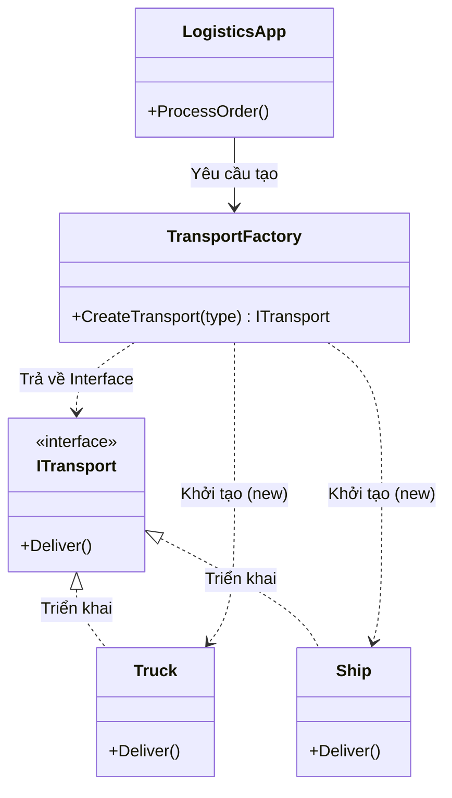

# Factory Method Pattern {#factory}

Bạn đã bao giờ nghe câu châm ngôn: *"Từ khóa `new` là nguồn gốc của mọi tội lỗi"* trong lập trình Hướng đối tượng chưa?

Mỗi khi bạn viết `var obj = new ConcreteClass()`, bạn đang trực tiếp **buộc chặt (Tightly Coupled)** lớp hiện tại vào một lớp cụ thể. Nếu sau này logic khởi tạo thay đổi, hoặc bạn muốn thay đổi loại đối tượng được tạo ra dựa trên điều kiện, bạn sẽ phải lùng sục khắp nơi trong mã nguồn để sửa từng chữ `new`.

**Factory Method** (Mẫu thiết kế Nhà máy) ra đời để giải quyết vấn đề đó. Nó thuộc nhóm **Creational Patterns** (Mẫu khởi tạo), đóng vai trò như một phân xưởng: Bạn chỉ cần đưa yêu cầu, xưởng sẽ tự động lắp ráp và trả về đối tượng hoàn chỉnh.

## Nguyên lý hoạt động {#how-it-works}

Thay vì gọi trực tiếp lệnh `new`, bạn giao nhiệm vụ đó cho một phương thức đặc biệt (Factory Method). 

**Cấu trúc cốt lõi:**
1. **Product Interface:** Một giao diện chung (hoặc Abstract Class) cho tất cả các đối tượng mà nhà máy sẽ sản xuất.
2. **Concrete Products:** Các sản phẩm cụ thể triển khai giao diện trên.
3. **Creator (Factory):** Lớp chứa phương thức Factory để sinh ra Product. Lớp gọi (Client) chỉ giao tiếp với Factory và Product Interface, hoàn toàn không biết đến sự tồn tại của Concrete Products.



## Cài đặt bằng C# (Code Example) {#code-example}

Hãy tưởng tượng bạn đang viết một ứng dụng Logistics vận chuyển hàng hóa. Ban đầu, công ty chỉ có vận chuyển bằng Xe tải (Truck).

```csharp
// Giao diện chung cho mọi phương tiện
public interface ITransport
{
    void Deliver();
}

// Sản phẩm cụ thể: Xe tải
public class Truck : ITransport
{
    public void Deliver() => Console.WriteLine("Giao hàng bằng Đường bộ trong thùng xe tải.");
}
```

Hôm sau, công ty mở rộng sang Vận tải biển (Ship). Nếu code cũ của bạn đầy rẫy lệnh `new Truck()`, bạn sẽ phải sửa rất mệt mỏi. Hãy áp dụng **Factory Method**:

```csharp
// Thêm sản phẩm mới dễ dàng
public class Ship : ITransport
{
    public void Deliver() => Console.WriteLine("Giao hàng bằng Đường thủy trong container chở hàng.");
}

// Nhà máy sản xuất phương tiện
public class TransportFactory
{
    // Đây chính là Factory Method!
    // Trả về Interface, ẩn giấu hoàn toàn các Class cụ thể.
    public ITransport CreateTransport(string type)
    {
        if (type.ToLower() == "road")
        {
            return new Truck();
        }
        else if (type.ToLower() == "sea")
        {
            return new Ship();
        }
        
        throw new ArgumentException("Loại vận chuyển không hợp lệ");
    }
}
```

**Cách Client sử dụng:**

```csharp
public class LogisticsApp
{
    public void ProcessOrder(string transportType)
    {
        TransportFactory factory = new TransportFactory();
        
        // Client không hề có chữ "new Truck()" hay "new Ship()" nào!
        ITransport transport = factory.CreateTransport(transportType);
        
        // Đa hình phát huy sức mạnh
        transport.Deliver();
    }
}
```

## Lợi ích vô giá của Factory {#benefits}

1. **Che giấu sự phức tạp:** Đôi khi việc khởi tạo một đối tượng cần tới 10 bước cài đặt (kết nối mạng, đọc file config...). Factory sẽ gom tất cả logic rác rưởi đó vào một chỗ, giữ cho code của Client sạch sẽ.
2. **Tuân thủ OCP (Open-Closed):** Khi công ty mở thêm dịch vụ Hàng không (`Airplane`), bạn chỉ việc tạo Class `Airplane` và thêm 1 dòng vào Factory. Lớp `LogisticsApp` (Client) **không cần sửa một dòng nào!**
3. **Tuân thủ DIP (Dependency Inversion):** Client giờ đây chỉ phụ thuộc vào sự trừu tượng (`ITransport`), không còn dính líu đến các Class chi tiết cấp thấp.

:::tip Simple Factory vs Factory Method
Ví dụ ở trên thực chất là **Simple Factory** (Nhà máy đơn giản) - dùng mệnh đề `if/switch` để quyết định loại đối tượng. 
**Factory Method** thực thụ theo chuẩn GoF sẽ nâng cấp thành một Abstract Class `Logistics` chứa hàm ảo `CreateTransport()`. Sau đó tạo ra `RoadLogistics` và `SeaLogistics` ghi đè hàm đó. 
Tuy nhiên, trong 90% dự án thực tế, Simple Factory là quá đủ để giải quyết vấn đề và giữ cho kiến trúc không bị phình to (Over-engineering).
:::

## Next Steps {#next-steps}

Singleton và Factory là những kỹ thuật liên quan đến việc *Sinh ra đối tượng* (Creational). 
Phần tiếp theo, chúng ta sẽ bước sang nhóm *Hành vi (Behavioral)*, nơi các đối tượng giao tiếp với nhau. Làm thế nào để hàng ngàn người dùng YouTube nhận được thông báo ngay lập tức khi Idol của họ đăng video mới? 

Chào mừng bạn đến với Mẫu thiết kế nổi tiếng bậc nhất thế giới Frontend: **Observer Pattern**.

<div class="vt-box-container next-steps">
  <a class="vt-box" href="/docs/patterns/observer">
    <p class="next-steps-link">Observer Pattern</p>
    <p class="next-steps-caption">Sự kỳ diệu của cơ chế Lắng nghe và Phát sự kiện (Event-driven).</p>
  </a>
</div>
