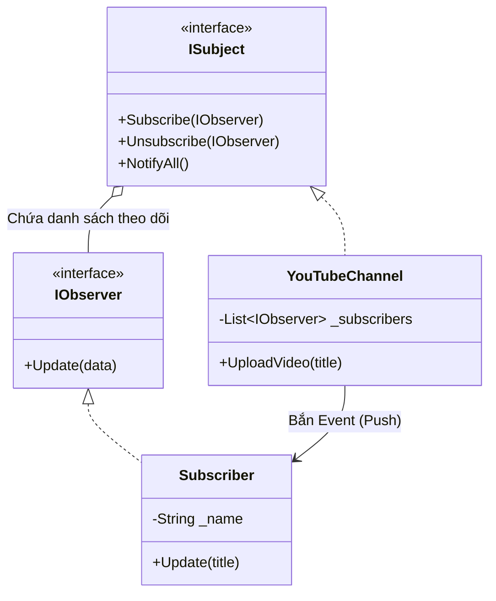

# Observer Pattern {#observer}

Nếu có một Mẫu thiết kế (Design Pattern) nào thống trị toàn bộ thế giới Frontend (như Vue, React, Angular) và các hệ thống thời gian thực, thì đó chắc chắn là **Observer Pattern** (Mẫu Quan sát viên).

Thuộc nhóm **Behavioral Patterns** (Mẫu Hành vi), Observer Pattern định nghĩa một mối quan hệ **Một-Nhiều (One-to-Many)** giữa các đối tượng. Khi một đối tượng (Subject) thay đổi trạng thái, tất cả những kẻ phụ thuộc vào nó (Observers) sẽ tự động được thông báo và cập nhật.

## Hình ảnh thực tế {#real-world}

Cách dễ hiểu nhất về Observer chính là **Nút Đăng ký (Subscribe)** trên YouTube!
1. Kênh YouTube (Channel) đóng vai trò là **Subject** (Nguồn phát).
2. Người xem (Viewer) đóng vai trò là **Observer** (Người quan sát).
3. Hàng vạn Viewer bấm nút *Subscribe* vào Channel đó.
4. Khi Channel đăng Video mới, nó không cần phải chạy đến gõ cửa từng nhà người xem để báo tin. Nó chỉ cần phát ra một "Sự kiện" (Event). Hệ thống sẽ tự động quét danh sách những ai đã Subscribe và đẩy thông báo (Notify) về điện thoại của họ.

Bạn cũng có thể thấy mô hình này ở các bài đăng Facebook, Cảm biến nhiệt độ nhà thông minh, hay hệ thống gửi Email Newsletter.

## Tại sao phải dùng Observer? {#why-observer}

Nếu không có Observer, để biết Channel có Video mới hay không, người xem sẽ phải liên tục mở kênh YouTube lên kiểm tra mỗi phút một lần. Kỹ thuật này gọi là **Polling** (Hỏi vòng liên tục). Nó làm sập Server vì hàng tỷ request Vô nghĩa!

Observer biến mô hình **Kéo (Pull)** tốn kém thành mô hình **Đẩy (Push)** thanh lịch. Người xem cứ đi ngủ, khi nào có Video thì Subject sẽ tự đánh thức bạn.

## Cài đặt bằng C# (Code Example) {#code-example}

Dưới đây là mô hình Observer truyền thống kinh điển.



**Bước 1: Định nghĩa Giao diện (Interfaces)**

```csharp
// Giao diện cho người quan sát
public interface IObserver
{
    void Update(string videoTitle);
}

// Giao diện cho Kênh phát
public interface ISubject
{
    void Subscribe(IObserver observer);
    void Unsubscribe(IObserver observer);
    void NotifyAll(string videoTitle);
}
```

**Bước 2: Xây dựng Kênh YouTube (Subject)**

```csharp
using System.Collections.Generic;

public class YouTubeChannel : ISubject
{
    // Danh sách những người đã Đăng ký kênh
    private List<IObserver> _subscribers = new List<IObserver>();

    public void Subscribe(IObserver observer)
    {
        _subscribers.Add(observer);
    }

    public void Unsubscribe(IObserver observer)
    {
        _subscribers.Remove(observer);
    }

    // Đẩy thông báo cho toàn bộ danh sách
    public void NotifyAll(string videoTitle)
    {
        foreach (var sub in _subscribers)
        {
            sub.Update(videoTitle);
        }
    }

    // Hành động kích hoạt sự kiện
    public void UploadVideo(string title)
    {
        Console.WriteLine($"\n[KÊNH] Đã upload video: {title}");
        NotifyAll(title); // Gửi thông báo!
    }
}
```

**Bước 3: Xây dựng Người xem (Observer)**

```csharp
public class Subscriber : IObserver
{
    private string _name;

    public Subscriber(string name)
    {
        _name = name;
    }

    // Hành động xảy ra khi nhận được thông báo
    public void Update(string videoTitle)
    {
        Console.WriteLine($"- {_name} nhận được thông báo: Video mới '{videoTitle}'!");
    }
}
```

**Bước 4: Chạy thử**

```csharp
YouTubeChannel channel = new YouTubeChannel();

Subscriber alice = new Subscriber("Alice");
Subscriber bob = new Subscriber("Bob");

// Đăng ký nhận thông báo
channel.Subscribe(alice);
channel.Subscribe(bob);

// Upload video 1
channel.UploadVideo("Học C# trong 10 phút"); 
// Output: Alice nhận thông báo, Bob nhận thông báo

// Bob hủy đăng ký
channel.Unsubscribe(bob);

// Upload video 2
channel.UploadVideo("Design Patterns nâng cao");
// Output: Chỉ còn Alice nhận thông báo
```

:::info Observer trong C# và Frontend hiện đại
Trong C# hiện đại, người ta hiếm khi viết Interface thủ công như trên. Ngôn ngữ C# hỗ trợ sẵn từ khóa **`event`** và **`delegate`** (hoặc `Action`, `Func`) để làm Observer trong đúng 1 dòng code!
Ở mảng Frontend (Vue, React), Observer Pattern biến hình thành khái niệm **Reactivity** (Phản ứng). Khi biến số Data (Subject) thay đổi, Giao diện UI (Observer) tự động render lại mà không cần bạn phải viết code cập nhật màn hình.
:::

## Next Steps {#next-steps}

Observer lo liệu việc báo tin. Nhưng khi hệ thống có rất nhiều cách khác nhau để thực thi cùng một công việc (Ví dụ: Thanh toán bằng Momo, ZaloPay, Thẻ tín dụng, PayPal...), và bạn muốn đổi cách thanh toán một cách linh hoạt lúc chương trình đang chạy, bạn sẽ làm thế nào để tránh viết hàng chục câu lệnh `if-else`?

Chìa khóa nằm ở Mẫu Hành vi vĩ đại nhất: **Strategy Pattern**.

<div class="vt-box-container next-steps">
  <a class="vt-box" href="/docs/patterns/strategy">
    <p class="next-steps-link">Strategy Pattern</p>
    <p class="next-steps-caption">Sự kỳ diệu của Đa hình: Đổi thuật toán linh hoạt lúc Runtime.</p>
  </a>
</div>
