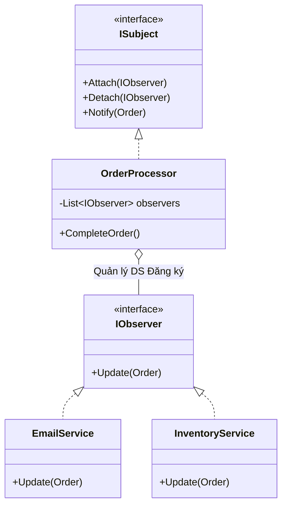

# Observer Pattern (Mẫu Lắng Nghe - Đăng Ký) {#observer}

:::info Mục tiêu bài học
- Xây dựng tư duy **Publisher - Subscriber (Kênh phát sóng - Người theo dõi)**.
- Hiểu được sự tồi tệ của cơ chế Polling (Liên tục hỏi "Tới chưa? Tới chưa?").
- Mổ xẻ bài toán thực tế: Thông báo thanh toán đơn hàng thành công (Gửi Email, Trừ kho, Tặng điểm thưởng).
- Cài đặt mẫu Observer chuẩn mực theo nhóm Gang of Four (GoF) bằng Interface.
- Trải nghiệm cú pháp tối thượng của ngôn ngữ C# với `event` và `Action<T>` (Rút ngắn code 10 lần).
:::

## 1. Lời mở đầu: Nút "Đăng Ký Kênh" Youtube {#introduction}

Nằm trong nhóm **Behavioral Patterns (Mẫu Hành Vi)**, Observer là một trong những mẫu thiết kế phổ biến và quyền lực bậc nhất. Nó là nền tảng cốt lõi của hàng loạt kiến trúc phần mềm hiện đại như: Event-Driven Architecture, Reactive Programming (RxJS), và Data Binding (Vue, React).

**Ví dụ thực tế (Real-world analogy):**
Bạn rất thích một Kênh YouTube dạy lập trình. Bạn muốn biết ngay khi họ ra video mới. Bạn có 2 cách để làm việc này:
1. **Cách tồi tệ (Polling):** Cứ 5 phút một lần, bạn cầm điện thoại lên, mở trang YouTube của họ, quét từ trên xuống dưới xem có video mới không. Cả ngày bạn sẽ phải mở điện thoại hàng trăm lần (Tốn pin, tốn băng thông, tốn sức).
2. **Cách tuyệt vời (Observer Pattern):** Bạn bấm nút **"Đăng ký kênh" (Subscribe)** và nhấn cái Chuông. Sau đó bạn đi ngủ. Bất cứ khi nào kênh đó đăng video, hệ thống (Publisher) sẽ tự động đẩy một cái tin nhắn Ting Ting (Notify) vào điện thoại của bạn (Subscriber). Bạn hoàn toàn rảnh rỗi chờ đợi!

Trong Lập trình, nếu bạn để các Class liên tục chạy vòng lặp `while(true)` để hỏi xem dữ liệu đã thay đổi chưa, máy chủ của bạn sẽ sập nguồn trong 3 nốt nhạc.

---

## 2. Giải phẫu Anti-pattern: Sự kết dính đa tầng {#anti-pattern}

Hãy quay lại hệ thống E-commerce. Bạn có một Class `OrderProcessor` chuyên xử lý Đơn hàng. Khi Khách thanh toán thành công, nó phải làm 3 việc: Gửi Email cho khách, Báo Kho trừ số lượng, và Báo cho Hệ thống Điểm để cộng điểm VIP.

```csharp
// MÃ XẤU - KẾT DÍNH ĐA TẦNG (TIGHTLY COUPLED)
public class OrderProcessor
{
    private readonly EmailService _emailService = new EmailService();
    private readonly InventoryService _inventoryService = new InventoryService();
    private readonly LoyaltyService _loyaltyService = new LoyaltyService();

    public void ProcessOrder(Order order)
    {
        // 1. Core Logic: Thanh toán tiền
        Console.WriteLine("Thanh toán thành công!");

        // 2. TẠI SAO NGƯỜI XỬ LÝ ĐƠN HÀNG LẠI PHẢI ĐI SAI VẶT NHỮNG NGƯỜI NÀY?
        _emailService.SendEmail(order.CustomerEmail);
        _inventoryService.UpdateStock(order.Id);
        _loyaltyService.AddPoints(order.CustomerId, 100);
    }
}
```

**Tại sao đây là Cơn Ác Mộng?**
- **Vi phạm SRP (Đơn trách nhiệm):** Hàm tính tiền nay phải kiêm luôn làm Người điều phối các phòng ban khác.
- **Vi phạm OCP (Mở đóng):** Tháng sau, Sếp yêu cầu: "Gửi thêm tin nhắn Zalo thông báo đơn hàng". Bạn BẮT BUỘC phải mở file `OrderProcessor` ra, thêm `ZaloService`, và sửa hàm `ProcessOrder`. Mỗi lần sửa file này, nguy cơ đánh sập module Thanh Toán càng cao.

---

## 3. Cấu trúc chuẩn GoF: Tách biệt Publisher và Subscriber {#gof-structure}

Để cứu `OrderProcessor`, ta biến nó thành một Đài phát thanh (**Publisher / Subject**). Nó không cần biết ai đang nghe nó cả. Nó chỉ cần cầm loa hét lên: *"Ê, có người vừa mua xong đơn hàng XYZ nha!"*.
Bên kia đường, các phòng ban như Kho, Email, Điểm thưởng đóng vai trò là Người nghe đài (**Subscribers / Observers**). Ai quan tâm thì bật đài lên nghe.



### Mã nguồn C# (Chuẩn Interface Cổ điển)

```csharp
// 1. HỢP ĐỒNG CHO NGƯỜI NGHE ĐÀI
public interface IOrderObserver
{
    // Hàm này sẽ bị Đài phát thanh "Gọi ngược" (Callback) khi có tin mới
    void Update(Order order);
}

// 2. CÁC PHÒNG BAN ĐĂNG KÝ NGHE ĐÀI
public class EmailService : IOrderObserver
{
    public void Update(Order order) => Console.WriteLine($"Gửi Mail cho: {order.Customer}");
}
public class InventoryService : IOrderObserver
{
    public void Update(Order order) => Console.WriteLine($"Trừ kho hàng: {order.Id}");
}

// 3. ĐÀI PHÁT THANH (PUBLISHER)
public class OrderProcessor
{
    // Cuốn sổ ghi chép danh sách những ai đã Bấm Nút Đăng ký Kênh
    private readonly List<IOrderObserver> _observers = new List<IOrderObserver>();

    public void Subscribe(IOrderObserver observer) => _observers.Add(observer);
    public void Unsubscribe(IOrderObserver observer) => _observers.Remove(observer);

    public void CompleteOrder(Order order)
    {
        Console.WriteLine("\n[XỬ LÝ ĐƠN HÀNG THÀNH CÔNG!]");
        
        // Hét lên cho tất cả những người trong sổ biết (Notify)
        foreach (var observer in _observers)
        {
            observer.Update(order);
        }
    }
}
```

Hãy nhìn vào `OrderProcessor`. Nó vô cùng sạch sẽ. Không hề có bóng dáng của chữ `EmailService` hay `InventoryService`.
Tuần sau Sếp bắt thêm tin nhắn Zalo? Bạn tạo class `ZaloService : IOrderObserver` rồi đẩy nó vào danh sách `Subscribe()`. File `OrderProcessor` không cần sửa DÙ CHỈ MỘT DẤU CHẤM PHẨY (Tuân thủ OCP tuyệt đối!).

---

## 4. Đặc sản của C#: Sử dụng `event` và `Action<T>` {#csharp-events}

Cách code GoF cổ điển ở trên rất chuẩn mực, nhưng nhược điểm là phải đẻ ra quá nhiều Interface `IOrderObserver` và danh sách mảng rườm rà.
Kỹ sư Microsoft đã biến tấu Observer Pattern thành một tính năng cấp bậc ngôn ngữ (First-class citizen) mang tên **Event (Sự kiện)**.

```csharp
// MÃ ĐẸP - CÚ PHÁP C# HIỆN ĐẠI (Rút gọn 90% Code)
public class ModernOrderProcessor
{
    // Chỉ 1 dòng duy nhất! 'Action<Order>' là một cái phễu (Delegate) 
    // cho phép nhận bất kỳ hàm nào trả về void và có 1 tham số Order.
    public event Action<Order> OnOrderCompleted; 

    public void CompleteOrder(Order order)
    {
        Console.WriteLine("\n[XỬ LÝ ĐƠN HÀNG THÀNH CÔNG!]");
        
        // Kích hoạt sự kiện (Invoke). Dấu '?' để chống lỗi Null nếu chưa có ai Subscribe.
        OnOrderCompleted?.Invoke(order);
    }
}
```

Sử dụng nó cực kỳ thanh lịch với dấu `+=` (Subscribe) và `-=` (Unsubscribe):

```csharp
var processor = new ModernOrderProcessor();
var emailSvc = new EmailService(); // Bỏ Interface IObserver đi, viết Class bình thường
var inventorySvc = new InventoryService();

// Các phòng ban Bấm nút Đăng ký (Gắn hàm vào Phễu Event)
processor.OnOrderCompleted += emailSvc.SendEmail;
processor.OnOrderCompleted += inventorySvc.UpdateStock;
// Có thể gắn trực tiếp cả một Lambda Anonymous Function (Hàm vô danh)
processor.OnOrderCompleted += (order) => Console.WriteLine("Báo sếp có tiền vào!"); 

// Thanh toán! (Hệ thống sẽ tự động gọi 3 hàm trên)
processor.CompleteOrder(new Order { Id = "ORD01", Customer = "Messi" });
```

:::tip Tóm tắt nhanh (Key Takeaways)
- Observer Pattern gồm 2 phía: **Publisher** (Nguồn phát sinh dữ liệu) và **Subscriber** (Kẻ háo hức chờ dữ liệu).
- Giải quyết triệt để tính trạng Tightly Coupled. Publisher KHÔNG CẦN BIẾT Subscriber là thằng nào, làm chức năng gì. 
- Cơ chế GoF Cổ điển: Dùng Interface `IObserver` và mảng `List<IObserver>`.
- Cơ chế C# Hiện đại: Dùng `event` và `Action<T>` để Subscribe bằng toán tử `+=`.
- **Cẩn thận rò rỉ bộ nhớ (Memory Leak):** Nếu một Đối tượng đăng ký `+=` vào Event của hệ thống toàn cục, nhưng quên gỡ ra `-=` khi nó bị phá hủy (Dispose), bộ thu gom rác (Garbage Collector) sẽ không thể xóa nó được! (Lỗi *Lapsed Listener Problem*).
:::
