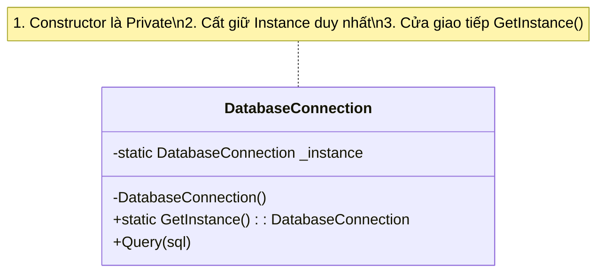

# Singleton Pattern (Mẫu Đơn Độc) {#singleton}

:::info Mục tiêu bài học
- Thấu hiểu khái niệm **Singleton** - Kẻ độc tài kiểm soát sự sống còn của tài nguyên hệ thống.
- Xây dựng cấu trúc Singleton từ con số không: Khóa Constructor và Cung cấp cổng truy cập toàn cục.
- Nhận diện thảm họa **Đa luồng (Multi-threading)** có thể phá vỡ Singleton như thế nào.
- Trở thành chuyên gia C# với kỹ thuật **Double-Check Locking** và cấu trúc **`Lazy<T>`** hiện đại.
- Hiểu được ranh giới mong manh giữa một Mẫu thiết kế (Design Pattern) và một Anti-pattern.
:::

## 1. Lời mở đầu: Triết lý của sự Độc tôn {#introduction}

Nằm trong nhóm **Creational Patterns (Mẫu Khởi tạo)** của tổ chức Gang of Four, Singleton ra đời với một nhiệm vụ duy nhất: 

> *"Đảm bảo rằng một Lớp (Class) chỉ có **DUY NHẤT MỘT** thể hiện (Instance) tồn tại trong suốt vòng đời của ứng dụng, đồng thời cung cấp một điểm truy cập toàn cục để lấy thể hiện đó."*

**Ví dụ thực tế (Real-world analogy):**
- **Tổng thống một Quốc gia:** Nước Mỹ có hơn 300 triệu dân, nhưng chỉ có đúng 1 vị Tổng thống đương nhiệm. Dù bạn gọi "Ngài Tổng thống" từ bang New York hay bang Texas, bạn đều đang tham chiếu đến ĐÚNG MỘT người. Sẽ là thảm họa nếu hệ thống lỡ tay `new` ra thêm một Tổng thống thứ hai.
- **Trong lập trình:** Những tài nguyên đắt đỏ (Tốn nhiều RAM, tốn thời gian khởi động) như: Hệ thống kết nối Cơ sở dữ liệu (Database Connection Pool), Hệ thống ghi log file (File Logger), hay Bộ nhớ đệm chung (Global Cache). Nếu mỗi lần ghi Log, bạn lại tạo mới (`new`) một đối tượng `Logger`, ứng dụng của bạn sẽ bị rò rỉ bộ nhớ (Memory Leak) và cạn kiệt tài nguyên (Out of Memory) chỉ trong vài phút.

---

## 2. Giải phẫu cấu trúc Singleton (Căn bản) {#basic-structure}

Để ngăn chặn thiên hạ tùy tiện dùng từ khóa `new` tạo ra đối tượng, Singleton áp dụng 3 quy tắc "Thiết quân luật":

1. **Khóa cửa:** Đổi hàm tạo (Constructor) thành `private`. Bất kỳ ai dùng lệnh `new Singleton()` bên ngoài Class sẽ bị trình biên dịch vả ngay lập tức!
2. **Lưu trữ bí mật:** Tạo một biến `private static` để cất giấu thể hiện duy nhất (Instance) ở bên trong chính Class đó. (Static có nghĩa là biến này thuộc về Class, chứ không thuộc về Object).
3. **Mở một cánh cửa duy nhất:** Tạo một hàm `public static GetInstance()` để người ngoài "xin" cấp phát thể hiện. Nếu thể hiện chưa tồn tại, hàm sẽ tự tạo nó. Nếu đã có, hàm trả về đồ cũ.



### Mã nguồn C# (Naïve Singleton)

Đây là cách viết Singleton kinh điển mà 90% sách giáo khoa dạy bạn:

```csharp
public class Logger
{
    // Biến cất giữ Instance duy nhất (Ban đầu là null)
    private static Logger _instance;

    // 1. Khóa Constructor (Không cho ai gọi 'new Logger()')
    private Logger()
    {
        Console.WriteLine("Đang khởi tạo Logger... Tốn 500MB RAM!");
    }

    // 2. Cổng truy cập toàn cục
    public static Logger GetInstance()
    {
        // 3. Khởi tạo trễ (Lazy Initialization): 
        // Chỉ khi nào ai đó thực sự cần thì mới tạo ra để tiết kiệm RAM.
        if (_instance == null)
        {
            _instance = new Logger();
        }
        return _instance;
    }

    public void Log(string message)
    {
        Console.WriteLine($"[LOG]: {message}");
    }
}
```

Hãy thử gọi nó:
```csharp
var log1 = Logger.GetInstance(); // In ra: Đang khởi tạo Logger...
var log2 = Logger.GetInstance(); // Chả in ra gì cả, vì nó trả về đồ cũ.

Console.WriteLine(log1 == log2); // Kết quả: TRUE. Cả 2 biến đều trỏ vào CÙNG MỘT bộ nhớ!
```

Thoạt nhìn có vẻ hoàn hảo. Nhưng nếu ứng dụng của bạn là một Website (Web Server), đoạn code trên là một quả bom nổ chậm!

---

## 3. Thảm họa Đa luồng (The Multithreading Nightmare) {#multithreading-issue}

Hãy tưởng tượng một trang Web e-commerce. Vào ngày Black Friday, có 2 luồng (Thread A và Thread B) truy cập vào hàm `GetInstance()` ở CÙNG MỘT MILI-GIÂY.

**Kịch bản tử thần (Race Condition):**
1. **Thread A** chạy tới lệnh `if (_instance == null)` -> Kết quả: `true`. Thread A chuẩn bị chạy lệnh `new`.
2. Đột nhiên CPU tạm dừng Thread A để nhường quyền cho Thread B.
3. **Thread B** nhảy vào, chạy lệnh `if (_instance == null)`. Vì Thread A hồi nãy CHƯA KỊP chạy lệnh `new`, nên lúc này `_instance` VẪN LÀ `NULL`! -> Kết quả: `true`.
4. **Thread B** chạy lệnh `new Logger()`. Nó tạo ra Tổng thống thứ 1.
5. CPU nhường quyền lại cho **Thread A**. Thread A tiếp tục công việc bị dang dở lúc nãy (nó không rảnh để check `if` lại). Thế là nó hì hục chạy lệnh `new Logger()`. Nó tạo ra Tổng thống thứ 2.

**BÙM!** Nguyên tắc độc tôn bị phá vỡ. Có tới 2 thể hiện `Logger` tồn tại trên RAM! (Tốn gấp đôi RAM, và có thể ghi đè file log của nhau gây sập chương trình).

---

## 4. Cách chữa trị 1: Double-Check Locking {#thread-safe-lock}

Để ngăn chặn Race Condition, chúng ta phải dùng một cây gậy bảo vệ gọi là `lock` (trong C#) hoặc `synchronized` (trong Java).
Lệnh `lock` hoạt động giống như việc bạn đi vào một buồng vệ sinh công cộng và **chốt cửa lại**. Nếu Thread A đã chốt cửa, Thread B phải đứng ngoài cửa đợi cho đến khi Thread A làm xong và mở chốt.

Tuy nhiên, nếu chốt cửa ở ngay đầu hàm, hệ thống sẽ chạy RẤT CHẬM (vì hàng vạn luồng phải xếp hàng tuần tự dù Instance đã được tạo từ 10 kiếp trước). Giải pháp hoàn hảo là: **Kiểm tra 2 lần (Double-Check Locking)**.

```csharp
public class SafeLogger
{
    private static SafeLogger _instance;
    
    // Tạo một cái ổ khóa bằng object rỗng
    private static readonly object _padlock = new object();

    private SafeLogger() { }

    public static SafeLogger GetInstance()
    {
        // Kiểm tra Lần 1: Nếu có rồi thì trả về luôn, KHÔNG BẮT AI PHẢI XẾP HÀNG (Cực nhanh)
        if (_instance == null)
        {
            // Nếu chưa có, mới bắt đầu vào buồng khóa cửa
            lock (_padlock)
            {
                // Kiểm tra Lần 2 (Bảo vệ tử huyệt): Đề phòng có ai đó (Thread B) 
                // vừa đứng xếp hàng sau lưng Thread A, chờ Thread A tạo xong là lao vào định tạo tiếp!
                if (_instance == null)
                {
                    _instance = new SafeLogger();
                }
            }
        }
        return _instance;
    }
}
```
Code này bảo vệ hệ thống tuyệt đối an toàn 100%, mà vẫn giữ được tốc độ bàn thờ nhờ lệnh `if` kiểm tra vòng ngoài.

---

## 5. Cách chữa trị 2: Nghệ thuật Hiện đại với `Lazy<T>` (C# 4.0+) {#lazy-initialization}

Việc gõ nguyên cái cấu trúc Double-Check Locking ở trên quá rườm rà. Các kỹ sư Microsoft đã nhìn thấy nỗi khổ này và tặng cho chúng ta một cấu trúc siêu việt: `Lazy<T>`.

`Lazy<T>` sinh ra để đảm đương việc "Khởi tạo trễ" và nó **Mặc định bảo vệ Đa Luồng (Thread-Safe 100%)** ở tầng thấp nhất của bộ biên dịch.

```csharp
// MÃ ĐẸP - CHUẨN MỰC SINGLETON C# HIỆN ĐẠI
public class ModernLogger
{
    // Lazy sẽ giữ giùm hàm khởi tạo (() => new ModernLogger()), 
    // và chỉ chạy ĐÚNG 1 LẦN DUY NHẤT dẫu cho hàng vạn Thread gọi cùng lúc.
    private static readonly Lazy<ModernLogger> _lazy = 
        new Lazy<ModernLogger>(() => new ModernLogger());

    private ModernLogger() { }

    // Rút ngắn cổng truy cập thành Property thay vì Method (Theo chuẩn C#)
    public static ModernLogger Instance => _lazy.Value;

    public void Log(string message) => Console.WriteLine(message);
}
```

Hãy nhìn xem, từ 20 dòng code rườm rà `lock`, chúng ta chỉ còn đúng 1 dòng khai báo `Lazy<T>`. Đây là cách mà mọi Senior C# Developer dùng để khai báo Singleton!

---

## 6. Góc khuất tử thần: Khi Singleton biến thành Anti-Pattern {#anti-pattern-warning}

Nhiều lập trình viên (đặc biệt là dân Game Dev dùng Unity) nghiện Singleton. Cái gì họ cũng nhét vào Singleton (Player, Inventory, GameManager). Sự lạm dụng này biến Singleton thành **Anti-Pattern** kinh tởm nhất:

1. **Nó là Biến Toàn Cục (Global State) ngụy trang:** Bất kỳ file nào trong dự án cũng có thể gọi `ModernLogger.Instance.Log()`. Khi dự án to lên, bạn hoàn toàn mất dấu không biết đoạn code nào đang lén lút sửa đổi dữ liệu bên trong Singleton. Điều này vi phạm nghiêm trọng tính Đóng Gói (Encapsulation).
2. **Kẻ thù của Unit Test:** Bạn không thể nào Test giả lập (Mock) một cái Singleton được. Hàm `Instance` bị gắn cứng (Static) vào Class. Nếu Singleton đó có kết nối Database, mỗi lần chạy Test bạn bắt buộc phải cắm cáp mạng vào Database thật.
3. **Giấu nhẹm sự phụ thuộc (Hidden Dependency):** Class `Store` gọi lén `Logger.Instance` ở dòng thứ 500. Lập trình viên khác nhìn vào khai báo Class `Store` sẽ hoàn toàn không biết nó cần dùng đến `Logger`. 

**Vậy có nên dùng `static class` (Class tĩnh) để thay thế không?** Cả hai đều chỉ tồn tại một bản duy nhất trong bộ nhớ, nhưng Static Class còn cứng nhắc hơn: nó không thể triển khai Interface, không thể truyền như một đối số, không thể tham gia Kế thừa, và cũng khó Unit Test chẳng kém Singleton. Điểm lợi duy nhất của Singleton (qua Property `Instance`) là nó vẫn là một đối tượng thật sự — có thể implement Interface và được đưa vào hệ thống Dependency Injection để quản lý vòng đời, mở đường cho việc thay thế bằng Mock khi Test.

**Giải pháp của Kiến trúc hiện đại (Modern Architecture):**
Đừng tự viết Class Singleton nữa! Hãy viết các Class bình thường, sau đó sử dụng **Dependency Injection (DI) Container** (như trong ASP.NET Core). 

Bạn chỉ việc ra lệnh: `builder.Services.AddSingleton<ILogger, Logger>();`
Framework sẽ tự động quản lý vòng đời duy nhất của nó và Tiêm (Inject) nó vào hàm tạo (Constructor) của những Class cần dùng. Code của bạn sẽ vừa tuân thủ DIP (SOLID), vừa có thể dễ dàng Unit Test!

:::tip Tóm tắt nhanh (Key Takeaways)
- Singleton đảm bảo **Một Thể Hiện Duy Nhất** và cung cấp một **Cổng truy cập Toàn Cục**.
- Cơ chế cốt lõi: `Private Constructor` + `Static Instance` + `Static GetInstance()`.
- Tuyệt đối không dùng Naïve Singleton trong Web/App vì sẽ dính chưởng Đa luồng (Race Condition).
- Để chống Đa luồng: Dùng **Double-Check Locking** hoặc cách tốt nhất ở C# là dùng **`Lazy<T>`**.
- Lạm dụng Singleton sẽ biến nó thành Biến toàn cục (Global Variable), gây nát Unit Test. Hãy ưu tiên quản lý vòng đời Singleton bằng **Dependency Injection**.
:::

## Next Steps {#next-steps}

Bạn đã chinh phục xong vị "Tổng thống duy nhất" của thế giới lập trình và hiểu rõ tại sao mẫu này cần được đưa vào tầm kiểm soát của các Container hiện đại. Tiếp theo, hãy khám phá các mẫu thiết kế đồng minh trong đại gia đình GoF cùng cơ chế Dependency Injection — nơi vòng đời của Singleton được quản lý một cách khoa học thay vì tự dựng trâu:

<div class="vt-box-container next-steps">
  <a class="vt-box" href="/docs/patterns/factory">
    <p class="next-steps-link">Factory Method</p>
    <p class="next-steps-caption">Chuyển giao trách nhiệm "new" đối tượng cho Nhà máy chuyên trách — cặp bài trùng Creational với Singleton.</p>
  </a>
  <a class="vt-box" href="/docs/patterns/observer">
    <p class="next-steps-link">Observer Pattern</p>
    <p class="next-steps-caption">Thiết lập quan hệ Một - Nhiều để các đối tượng phụ thuộc tự động cập nhật khi trạng thái thay đổi.</p>
  </a>
  <a class="vt-box" href="/docs/di/basics">
    <p class="next-steps-link">Dependency Injection & IoC</p>
    <p class="next-steps-caption">Đưa vòng đời Singleton vào tay DI Container — giải pháp hiện đại thay cho việc tự viết Singleton bằng tay.</p>
  </a>
</div>

## 📚 Tham khảo lý thuyết {#references}

Các kiến thức lý thuyết trong bài được tổng hợp và đối chiếu từ những nguồn học thuật sau:

- **Định nghĩa chuẩn về Singleton và phân loại Creational Patterns:** Erich Gamma, Richard Helm, Ralph Johnson & John Vlissides (Gang of Four), *Design Patterns: Elements of Reusable Object-Oriented Software* (Addison-Wesley, 1994) — Chương 3 *Creational Patterns*.
- **Giải thích dễ hiểu kèm ví dụ trực quan về Singleton, sự khác biệt với Static Class và các kỹ thuật Thread-Safe:** Eric Freeman & Elisabeth Robson, *Head First Design Patterns* (O'Reilly Media) — Chương 5 *The Singleton Pattern*.
- **Singleton Pattern:** Wikipedia — https://en.wikipedia.org/wiki/Singleton_pattern
- **Hướng dẫn Singleton với mã nguồn đầy đủ (C++, C#, Java, Python) và tranh luận về Anti-pattern:** Refactoring.Guru — https://refactoring.guru/design-patterns/singleton
- **Tổng quan Design Patterns trong .NET và cơ chế Dependency Injection:** Microsoft Learn — *Design patterns in .NET* và *Dependency injection in ASP.NET Core*.
- **Giới thiệu Singleton Pattern và những vấn đề tiềm ẩn:** SourceMaking — *Singleton Design Pattern* — https://sourcemaking.com/design_patterns/singleton
