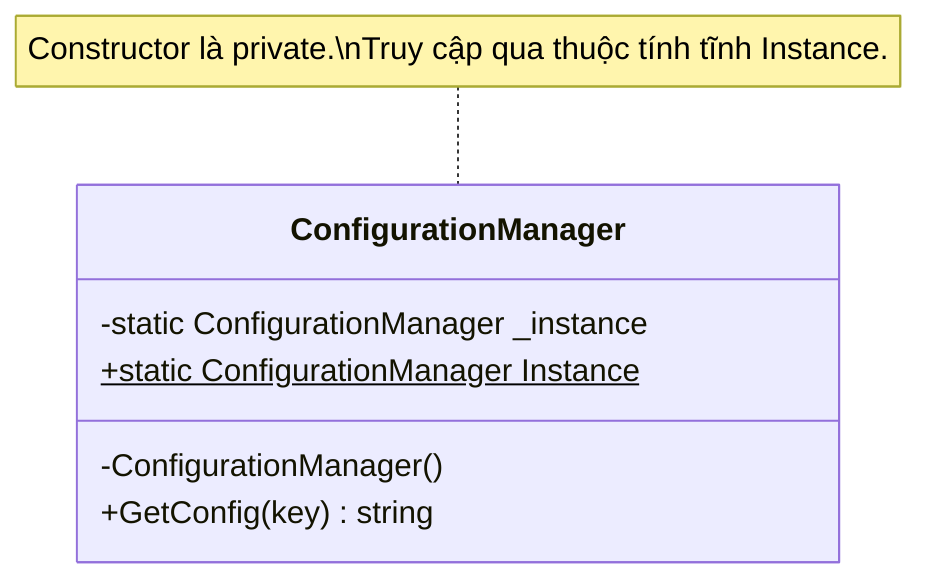

# Singleton Pattern {#singleton}

Trong thế giới thực, có những thứ mà sự tồn tại của nó là **duy nhất**. Một đất nước chỉ có một Tổng thống. Hệ thống máy tính của bạn chỉ có một File System (Hệ thống tập tin).

Trong lập trình, có những đối tượng mà nếu bạn tạo ra nhiều hơn một bản sao (Instance) của nó, hệ thống sẽ gặp rắc rối lớn. Ví dụ:
- Kết nối tới Cơ sở dữ liệu (Database Connection Pool).
- File ghi Log lỗi hệ thống.
- Cấu hình (Configuration) của toàn bộ ứng dụng.

Để ngăn chặn việc các lập trình viên khác trong team gọi lệnh `new Database()` bừa bãi, chúng ta sử dụng **Singleton Pattern**.

## Nguyên lý hoạt động {#how-it-works}

Singleton thuộc nhóm **Creational Patterns** (Mẫu khởi tạo). Ý tưởng của nó rất đơn giản:
1. **Khóa chặt Constructor:** Biến hàm khởi tạo (Constructor) thành `private`, không cho phép bên ngoài dùng từ khóa `new`.
2. **Lưu trữ tĩnh (Static):** Khai báo một biến tĩnh bên trong chính Class đó để chứa bản sao duy nhất.
3. **Mở cửa sau:** Viết một hàm (hoặc Property) `public static` để trả về bản sao duy nhất đó. Nếu chưa có thì khởi tạo, nếu có rồi thì trả về đồ cũ.



## Cài đặt bằng C# (Code Example) {#code-example}

### 1. Phiên bản Cơ bản (Dành cho Ứng dụng Đơn luồng)

```csharp
public class ConfigurationManager
{
    // 1. Biến tĩnh lưu giữ thực thể duy nhất
    private static ConfigurationManager _instance;

    // 2. Chặn không cho ai gọi new ConfigurationManager()
    private ConfigurationManager()
    {
        Console.WriteLine("Đang load file cấu hình từ ổ cứng...");
    }

    // 3. Cung cấp cổng truy cập toàn cầu
    public static ConfigurationManager Instance
    {
        get
        {
            // Kỹ thuật Lazy Loading (Khởi tạo lười biếng)
            // Chỉ khi nào ai đó gọi tới, mới thực sự tạo mới
            if (_instance == null)
            {
                _instance = new ConfigurationManager();
            }
            return _instance;
        }
    }
    
    public string GetConfig(string key) => "DummyValue";
}
```

### 2. Thảm họa Đa luồng (Multi-threading) và Cách khắc phục

Phiên bản cơ bản trên sẽ sụp đổ trong môi trường Đa luồng (Web API). Giả sử hai luồng (Thread A và Thread B) cùng nhảy vào lệnh `if (_instance == null)` cùng một lúc milli-giây. Cả hai đều thấy `null`, và cả hai sẽ gọi lệnh `new` tạo ra tận 2 đối tượng!

Để giải quyết, ta dùng **Lock (Khóa luồng)** hoặc dùng công cụ mạnh mẽ của C# là `Lazy<T>`.

**Cài đặt Singleton an toàn tuyệt đối (Thread-safe) trong C#:**

```csharp
public sealed class ConfigurationManager
{
    // Sử dụng Lazy<T> của .NET để tự động xử lý khóa đa luồng
    private static readonly Lazy<ConfigurationManager> _lazyInstance =
        new Lazy<ConfigurationManager>(() => new ConfigurationManager());

    private ConfigurationManager()
    {
        // Khởi tạo
    }

    public static ConfigurationManager Instance => _lazyInstance.Value;
}
```

## Mặt tối của Singleton (Anti-pattern?) {#anti-pattern}

Dù rất phổ biến, Singleton ngày nay thường bị nhiều kỹ sư kỳ cựu gọi là một **Anti-pattern (Mẫu phản diện)** vì hai lý do chính:
1. **Nó là Biến Toàn Cục (Global Variable) ngụy trang:** Bất cứ class nào, ở bất cứ đâu cũng có thể gọi `ConfigurationManager.Instance`. Điều này tạo ra sự phụ thuộc ngầm (Hidden Dependency), trái ngược hoàn toàn với nguyên lý **Dependency Inversion (DIP)**.
2. **Cực kỳ khó viết Unit Test:** Vì nó là một đối tượng tĩnh tồn tại suốt vòng đời ứng dụng, các Test Case sẽ bị chia sẻ trạng thái chung, dẫn đến việc test A chạy đúng nhưng test B lại chạy sai.

:::tip Giải pháp thời hiện đại: Dependency Injection (DI)
Trong các dự án C# / ASP.NET Core hiện đại, người ta KHÔNG TỰ VIẾT Singleton bằng tay nữa.
Thay vào đó, họ khai báo một Class bình thường (`public constructor`), sau đó nhường quyền sinh sát cho **DI Container**.
Chỉ cần gọi lệnh: `services.AddSingleton<ConfigurationManager>();`
Hệ thống sẽ tự động đảm bảo chỉ có 1 instance duy nhất được truyền đi khắp nơi. Việc test lại vô cùng dễ dàng!
:::

## Next Steps {#next-steps}

Singleton sinh ra khi ta chỉ muốn tạo ĐÚNG MỘT đối tượng. Nhưng nếu ta muốn tạo ra rất nhiều đối tượng, nhưng quá trình tạo ra chúng lại rất phức tạp (ví dụ: Tùy vào loại file mà khởi tạo đối tượng PdfReader hay ExcelReader), ta sẽ làm thế nào?

Hãy trao công việc nặng nhọc đó cho một nhà máy chuyên sản xuất đối tượng: **Factory Method**.

<div class="vt-box-container next-steps">
  <a class="vt-box" href="/docs/patterns/factory">
    <p class="next-steps-link">Factory Method</p>
    <p class="next-steps-caption">Nhà máy sản xuất đối tượng - Kỹ thuật ẩn giấu logic khởi tạo (new).</p>
  </a>
</div>
