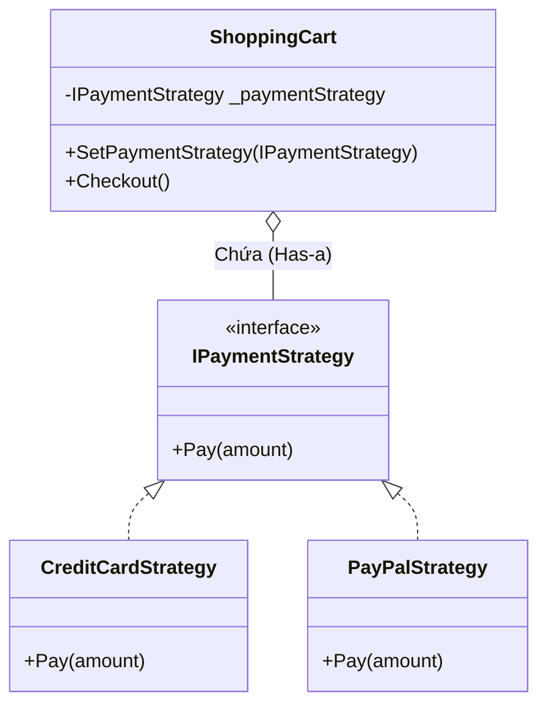

# Strategy Pattern {#strategy}

Strategy Pattern (Mẫu thiết kế Chiến lược) có lẽ là mẫu thiết kế được sử dụng nhiều nhất, hữu ích nhất và trực quan nhất trong nhóm **Behavioral Patterns** (Mẫu Hành vi). 

Nếu bạn thấy mã nguồn của mình bắt đầu xuất hiện những khối lệnh `if - else if - else` khổng lồ kéo dài hàng chục dòng để kiểm tra xem "Nên áp dụng thuật toán/logic nào cho dữ liệu này?", thì đã đến lúc bạn phải gọi Strategy ra ứng cứu.

Nguyên lý của Strategy cực kỳ đơn giản: **Đóng gói mỗi một Thuật toán (hoặc logic xử lý) vào một Class riêng biệt (gọi là một Chiến lược). Các Class này phải triển khai chung một Interface. Nhờ đó, bạn có thể dễ dàng hoán đổi các thuật toán này vào thời điểm chạy (Runtime) mà không ảnh hưởng đến Class chính đang sử dụng chúng.**

## Hình ảnh thực tế {#real-world}

Tưởng tượng bạn đang thiết kế một Ứng dụng Bản đồ (như Google Maps). Người dùng nhập điểm A và điểm B để tìm đường.
- Nếu người dùng đi xe máy $\rightarrow$ Tính đường theo Lộ trình Xe máy.
- Nếu người dùng đi ô tô $\rightarrow$ Tránh đường cấm ô tô, đường hẹp.
- Nếu người dùng đi bộ $\rightarrow$ Cho phép đi vào ngõ ngách, đường ngược chiều.

Thuật toán tìm đường của 3 phương tiện trên hoàn toàn khác nhau. Nếu nhét tất cả vào một Class `Navigator`, Class này sẽ phình to ra hàng nghìn dòng code và trở thành một bãi rác không thể bảo trì.

Strategy Pattern sẽ tách 3 thuật toán tìm đường đó ra thành 3 Class riêng biệt: `MotorbikeStrategy`, `CarStrategy`, `WalkingStrategy`. Cái điện thoại (Navigator) chỉ làm nhiệm vụ duy nhất: Gắn Chiến lược người dùng chọn vào và bấm nút "Run"!



## Cài đặt bằng C# (Code Example) {#code-example}

Hãy lấy một ví dụ kinh điển trong lập trình Web: **Hệ thống thanh toán (Payment System)**.

**Bước 1: Định nghĩa Interface Chiến lược chung**

```csharp
// Mọi chiến lược thanh toán đều phải có hàm Pay
public interface IPaymentStrategy
{
    void Pay(double amount);
}
```

**Bước 2: Xây dựng các Chiến lược cụ thể (Concrete Strategies)**

```csharp
// Thanh toán bằng Thẻ tín dụng
public class CreditCardStrategy : IPaymentStrategy
{
    private string _cardNumber;
    public CreditCardStrategy(string cardNumber) { _cardNumber = cardNumber; }

    public void Pay(double amount)
    {
        Console.WriteLine($"Đã thanh toán {amount}$ bằng Thẻ tín dụng xxxx-{_cardNumber.Substring(12)}");
    }
}

// Thanh toán bằng PayPal
public class PayPalStrategy : IPaymentStrategy
{
    private string _email;
    public PayPalStrategy(string email) { _email = email; }

    public void Pay(double amount)
    {
        Console.WriteLine($"Đã thanh toán {amount}$ thông qua tài khoản PayPal: {_email}");
    }
}
```

**Bước 3: Class Context (Người sử dụng Chiến lược)**

Lớp Giỏ hàng (`ShoppingCart`) không hề biết đến Thẻ tín dụng hay PayPal. Nó chỉ chứa một biến kiểu `IPaymentStrategy` và gọi hàm `Pay()` một cách mù quáng. (Đỉnh cao của Kế thừa và Đa hình).

```csharp
using System.Collections.Generic;

public class ShoppingCart
{
    private List<double> _items = new List<double>();
    
    // Biến lưu giữ Chiến lược hiện tại
    private IPaymentStrategy _paymentStrategy;

    public void AddItem(double price) => _items.Add(price);

    // Cho phép "thay đạn" (đổi chiến lược) linh hoạt
    public void SetPaymentStrategy(IPaymentStrategy strategy)
    {
        _paymentStrategy = strategy;
    }

    public void Checkout()
    {
        double total = 0;
        foreach (var item in _items) total += item;

        // Nếu chưa chọn phương thức thanh toán
        if (_paymentStrategy == null)
            throw new Exception("Vui lòng chọn phương thức thanh toán!");

        // Gọi chiến lược thực thi
        _paymentStrategy.Pay(total);
    }
}
```

**Bước 4: Sử dụng linh hoạt ở phía Client**

```csharp
ShoppingCart cart = new ShoppingCart();
cart.AddItem(15.5);
cart.AddItem(30.0);

// Khách chọn trả bằng Thẻ
cart.SetPaymentStrategy(new CreditCardStrategy("1234567890123456"));
cart.Checkout(); // Output: Đã thanh toán 45.5$ bằng Thẻ...

// Khách đổi ý, chuyển sang xài PayPal
cart.SetPaymentStrategy(new PayPalStrategy("teo@email.com"));
cart.Checkout(); // Output: Đã thanh toán 45.5$ thông qua PayPal...
```

:::tip OCP + Strategy = Sức mạnh tuyệt đối
Hãy nhìn lại lớp `ShoppingCart`. Nếu ngày mai công ty bổ sung thanh toán bằng Ví MoMo, bạn có phải sửa code của `ShoppingCart` không? **Hoàn toàn không!**
Bạn chỉ việc tạo lớp `MoMoStrategy`, truyền nó vào hàm `SetPaymentStrategy`. Đây chính là minh chứng sống động nhất cho nguyên lý **Mở-Đóng (Open-Closed Principle - OCP)**. Design Patterns thực chất chính là những công cụ để hiện thực hóa các nguyên lý SOLID.
:::

## Next Steps {#next-steps}

Chúc mừng bạn đã hoàn thành chương về **Design Patterns**! Những mẫu thiết kế này (Singleton, Factory, Observer, Strategy) là bộ xương sống của nền công nghiệp phần mềm.

Đến đây, bạn có thắc mắc: Các Class Cấp thấp (`Strategies`) được lắp ráp vào các Class Cấp cao (`ShoppingCart`) bằng cách nào trong một dự án siêu lớn với hàng vạn Class? Không lẽ ta cứ phải tự tay gõ lệnh `new` để lắp ráp chúng lại?

Chào mừng bạn đến với chương cuối cùng, chương quan trọng nhất đưa bạn từ một Coder bình thường lên tầm Kiến trúc sư (Architect): **Dependency Injection & IoC**.

<div class="vt-box-container next-steps">
  <a class="vt-box" href="/docs/di/basics">
    <p class="next-steps-link">Bắt đầu Chương DI: Cơ bản về Dependency Injection</p>
    <p class="next-steps-caption">Nghệ thuật tiêm chích các thành phần phụ thuộc tự động.</p>
  </a>
</div>
