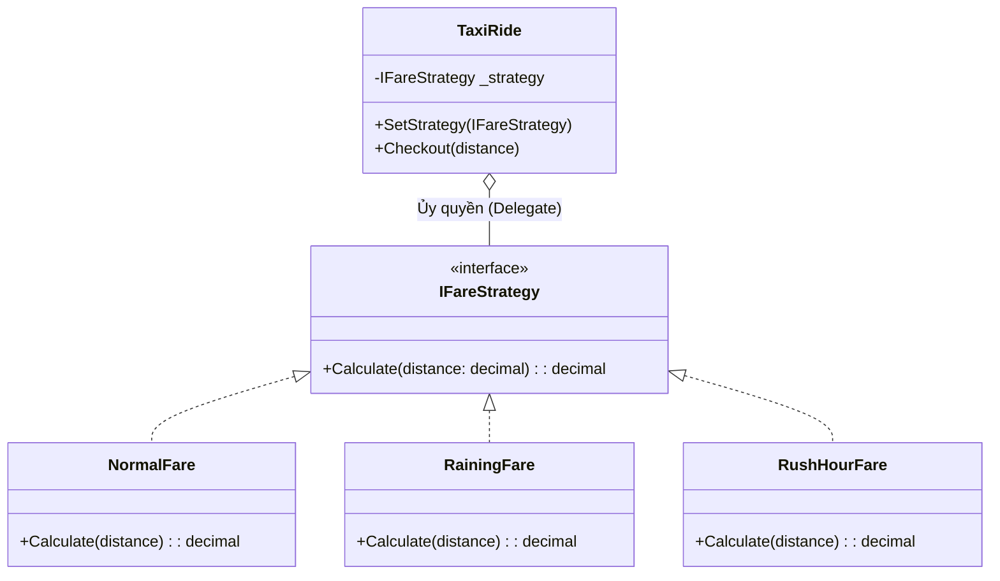

# Strategy Pattern (Mẫu Chiến Lược) {#strategy}

:::info Mục tiêu bài học
- Thấu hiểu mối liên hệ huyết thống giữa **Strategy Pattern** và nguyên lý **Open-Closed (OCP)**.
- Phá vỡ tư duy lập trình cấu trúc (if/else lồng nhau) để chuyển sang tư duy Hướng Hành Vi (Behavioral).
- Mổ xẻ bài toán: Hệ thống tính cước Taxi (Grab/Uber) biến đổi linh hoạt theo Thời tiết và Lưu lượng giao thông.
- Kỹ năng thượng thừa: Thay thế ruột (Thuật toán) của đối tượng ngay trong lúc hệ thống đang chạy (Runtime) mà không cần khởi động lại.
- Phân biệt sự khác nhau giữa Strategy, State và Factory Pattern.
:::

## 1. Lời mở đầu: Cỗ máy thay đổi não bộ {#introduction}

Nằm trong nhóm **Behavioral Patterns (Mẫu Hành Vi)** của GoF, Strategy Pattern được mệnh danh là hình thái thực tiễn và phổ biến nhất của nguyên lý [Open-Closed (OCP)](/docs/solid/ocp). 

> *"Hãy định nghĩa một tập hợp các thuật toán (chiến lược), đóng gói từng cái một vào các Class riêng biệt, và làm cho chúng có thể thay thế lẫn nhau. Strategy cho phép thuật toán biến đổi một cách độc lập với Client (Người sử dụng nó)."*

**Ví dụ thực tế (Real-world analogy):**
Bạn đang chơi một tựa game nhập vai (RPG). Nhân vật của bạn có một nút "Tấn công" (Attack). 
- Khi bạn cầm **Kiếm**, bấm Attack $\rightarrow$ Chém cận chiến.
- Bấm phím số 2, nhân vật đổi sang **Cung tên**. Bấm Attack $\rightarrow$ Bắn xa.
- Bấm phím số 3, đổi sang **Gậy phép**. Bấm Attack $\rightarrow$ Phóng quả cầu lửa.

Bạn không hề đẻ ra 3 Class nhân vật khác nhau (Kiếm Sĩ, Cung Thủ, Pháp Sư). Vẫn chỉ là ĐÚNG MỘT nhân vật đó, nhưng "Hành vi Tấn công" (Thuật toán) đã bị tráo đổi linh hoạt ngay trong lúc game đang chạy (Runtime). Đó chính là Strategy!

---

## 2. Giải phẫu Anti-pattern: Đầm lầy if/else {#anti-pattern}

Hãy tưởng tượng bạn code ứng dụng tính tiền cước cho Grab/Uber. Ban đầu mọi thứ rất đơn giản: Số Kilomet x Đơn giá.
Nhưng sau đó, bộ phận Business liên tục thêm các luật mới: Trờ mưa thu thêm tiền, Giờ cao điểm nhân đôi tiền, Ngày lễ giảm giá...

```csharp
// MÃ XẤU - NỖI KINH HOÀNG KHI MAINTAIN
public class TaxiFareCalculator
{
    public decimal CalculateFare(decimal distanceKm, string condition)
    {
        decimal baseFare = distanceKm * 10000; // 10k / 1km

        // Cơn ác mộng bắt đầu
        if (condition == "Normal")
        {
            return baseFare;
        }
        else if (condition == "Raining")
        {
            return baseFare + 20000; // Phụ thu mưa 20k
        }
        else if (condition == "RushHour")
        {
            return baseFare * 1.5m; // Giờ cao điểm x 1.5
        }
        else if (condition == "Weekend")
        {
            return baseFare * 0.9m; // Cuối tuần giảm 10%
        }
        
        throw new Exception("Điều kiện không hợp lệ!");
    }
}
```

**Tại sao nó Vi phạm Nguyên lý Thiết kế?**
- **Vi phạm OCP:** Mỗi lần có chiến dịch giá mới, bạn BẮT BUỘC phải mở hàm `CalculateFare` ra và nhét thêm lệnh `if`. 
- **Chết đuối trong tham số:** Nếu giá cước Ngày Lễ cần thêm tham số `int numberOfDays`, bạn sẽ phải nhét nó vào hàm `CalculateFare`, khiến những cái `if` khác như "Raining" bị thừa thãi tham số đó. Hàm sẽ phình to thành một con Quái vật (God Function).

---

## 3. Cấu trúc chuẩn GoF: Tách rời Chiến lược {#gof-structure}

Để áp dụng Strategy Pattern, ta chia hệ thống làm 3 thành phần:
1. **Tiêu chuẩn (IStrategy):** Bản hợp đồng quy định mọi chiến lược tính tiền đều phải tuân theo một khuôn mẫu (Trả về số tiền).
2. **Các Chiến Lược (Concrete Strategies):** Tách từng khối `if` ra thành một Class Độc lập (Kiếm, Cung, Gậy phép).
3. **Người sử dụng (Context):** Class Taxi. Nó chứa một cái "Khe cắm" (Biến Interface). Nó không tự tính tiền, mà ủy quyền (Delegate) cho Chiến lược đang cắm trong khe đó.



---

## 4. Phẫu thuật Mã nguồn C# (Chuẩn Strategy) {#clean-code}

**Bước 1: Chế tạo Bản Hợp Đồng (Interface)**
```csharp
public interface IFareStrategy
{
    decimal Calculate(decimal distanceKm);
}
```

**Bước 2: Cô lập từng thuật toán vào từng File riêng**
Nhờ việc cô lập, nếu hàm tính giá Mưa bị lỗi, thì giá Normal và giá Giờ cao điểm vẫn hoạt động bình thường, không hề bị ảnh hưởng!

```csharp
public class NormalFare : IFareStrategy
{
    public decimal Calculate(decimal distanceKm) => distanceKm * 10000;
}

public class RainingFare : IFareStrategy
{
    public decimal Calculate(decimal distanceKm) => (distanceKm * 10000) + 20000; // Phụ thu
}

public class RushHourFare : IFareStrategy
{
    public decimal Calculate(decimal distanceKm) => (distanceKm * 10000) * 1.5m; // X 1.5
}
```

**Bước 3: Lắp ráp Cỗ Máy Thay Đổi Não Bộ (Context)**
```csharp
public class TaxiRide
{
    private IFareStrategy _currentStrategy;

    // Yêu cầu truyền Chiến lược mặc định khi khởi tạo
    public TaxiRide(IFareStrategy initialStrategy)
    {
        _currentStrategy = initialStrategy;
    }

    // ĐÂY CHÍNH LÀ QUYỀN NĂNG CỦA STRATEGY!
    // Tráo đổi thuật toán NGAY TRONG LÚC ĐANG CHẠY (Runtime)
    public void ChangeStrategy(IFareStrategy newStrategy)
    {
        Console.WriteLine("\n[HỆ THỐNG] Đang chuyển đổi biểu giá...");
        _currentStrategy = newStrategy;
    }

    public void Checkout(decimal distanceKm)
    {
        // Nhắm mắt ủy quyền, không cần biết đang dùng giá gì
        decimal total = _currentStrategy.Calculate(distanceKm);
        Console.WriteLine($"-> Quãng đường {distanceKm}km. Tổng tiền: {total} VNĐ");
    }
}
```

### Chạy thử nghiệm (Client Code)

Hãy xem cách hệ thống "Biến hình" linh hoạt như thế nào khi trời đột ngột đổ mưa:

```csharp
// 1. Khách lên xe lúc trời nắng đẹp
var ride = new TaxiRide(new NormalFare());
ride.Checkout(10); // Kết quả: 100,000 VNĐ

// 2. Bất chợt trời đổ mưa to! Tổng đài ra lệnh đổi giá NGAY LẬP TỨC
ride.ChangeStrategy(new RainingFare());
ride.Checkout(10); // Kết quả: 120,000 VNĐ (Tự động cộng thêm 20k phụ thu)

// 3. Tới ngã tư kẹt xe sấp mặt (Giờ cao điểm)
ride.ChangeStrategy(new RushHourFare());
ride.Checkout(10); // Kết quả: 150,000 VNĐ (Tự động nhân hệ số 1.5)
```

Bạn thấy đấy, không có một dòng `if/else` nào, không cần phải Khởi động lại (Restart) ứng dụng, chiếc Taxi (Context) tự động thay đổi bản chất của nó bằng cách nhổ bỏ "Não bộ" (Strategy) cũ và cắm cái "Não bộ" mới vào. Thật kỳ diệu!

---

## 5. Góc Phân Biệt (Interview Questions) {#differences}

Trong các buổi phỏng vấn Senior, bạn sẽ hay bị hỏi 2 câu này:

**1. Strategy khác gì State Pattern?**
- **Strategy:** Client (Người dùng) LÀ NGƯỜI QUYẾT ĐỊNH khi nào đổi thuật toán. (Ví dụ: Tổng đài lệnh cho xe Taxi đổi qua giá Mưa).
- **State:** Tự bản thân Đối tượng BÊN TRONG sẽ đổi trạng thái dựa vào điều kiện. (Ví dụ: Xe Taxi tự đổi trạng thái từ "Đang bảo trì" sang "Sẵn sàng" khi sửa xong). Các State tự biết về sự tồn tại của nhau, còn các Strategy hoàn toàn độc lập và không biết nhau.

**2. Strategy khác gì Factory Pattern?**
- **Factory:** Là mẫu **Khởi tạo (Creational)**. Nhiệm vụ của nó là DÙNG TỪ KHÓA `new` đẻ ra một Đối tượng cụ thể rồi ném cho bạn xài. Xong việc là nó nghỉ.
- **Strategy:** Là mẫu **Hành vi (Behavioral)**. Trọng tâm của nó là cách Đối tượng CƯ XỬ như thế nào thông qua việc ủy quyền hàm xử lý.

:::tip Tóm tắt nhanh (Key Takeaways)
- Strategy Pattern sinh ra để đập tan các khối `if/else` khổng lồ chuyên dùng để chọn Thuật toán.
- Nó bóc tách từng thuật toán ra các Class riêng biệt và giao tiếp qua Interface chung.
- Điểm đắt giá nhất của Strategy là khả năng dùng Setter (Hàm `ChangeStrategy`) để tráo đổi hành vi của đối tượng lúc Runtime mà không làm hỏng tính toàn vẹn của ứng dụng.
- Trong C# hiện đại, người ta hay rút gọn Strategy Pattern bằng cách truyền trực tiếp các biểu thức Lambda (Delegates `Func<T>`) thay vì đẻ ra hàng đống Class, giúp mã nguồn cô đọng và linh hoạt hơn rất nhiều.
:::

---

## Next Steps {#next-steps}

- [Nguyên lý Open-Closed (OCP)](/docs/solid/ocp): Strategy Pattern được khai sinh từ chính OCP — đào sâu triết lý "Mở cho mở rộng, Đóng cho sửa đổi" để thấy lý do vì sao mẫu này là hình thái hoàn mỹ nhất của nguyên lý.
- [Nguyên lý Dependency Inversion (DIP)](/docs/solid/dip): Class `TaxiRide` chỉ phụ thuộc vào Interface `IFareStrategy` thay vì các Class chiến lược cụ thể — biểu hiện rõ nét của DIP trong thực chiến.
- [Factory Method](/docs/patterns/factory): Phân biệt mẫu Khởi tạo (nhà máy dùng `new` đẻ ra đối tượng) với mẫu Hành vi (hoán đổi thuật toán) khi thiết kế hệ thống.
- [Observer Pattern](/docs/patterns/observer): Một mẫu Hành vi khác trong bộ GoF — thay vì hoán đổi thuật toán, Observer phân phối sự kiện tới nhiều Subscriber cùng lúc.

## 📚 Tham khảo lý thuyết {#references}

Các kiến thức lý thuyết trong bài được tổng hợp và đối chiếu từ những nguồn học thuật sau:

- Erich Gamma, Richard Helm, Ralph Johnson, John Vlissides (Gang of Four), *Design Patterns: Elements of Reusable Object-Oriented Software* (Addison-Wesley, 1994) — Mẫu **Strategy** thuộc nhóm Behavioral Patterns.
- Eric Freeman, Elisabeth Robson, *Head First Design Patterns* (O'Reilly) — Chương về Strategy Pattern và nguyên lý "Favor composition over inheritance".
- Wikipedia — [Strategy pattern](https://en.wikipedia.org/wiki/Strategy_pattern).
- Microsoft Learn — *Design patterns in .NET* (tài liệu giới thiệu Strategy Pattern và nhóm Behavioral Patterns).
- Refactoring.Guru — [Strategy](https://refactoring.guru/design-patterns/strategy).
- SourceMaking — [Strategy Design Pattern](https://sourcemaking.com/design_patterns/strategy).
