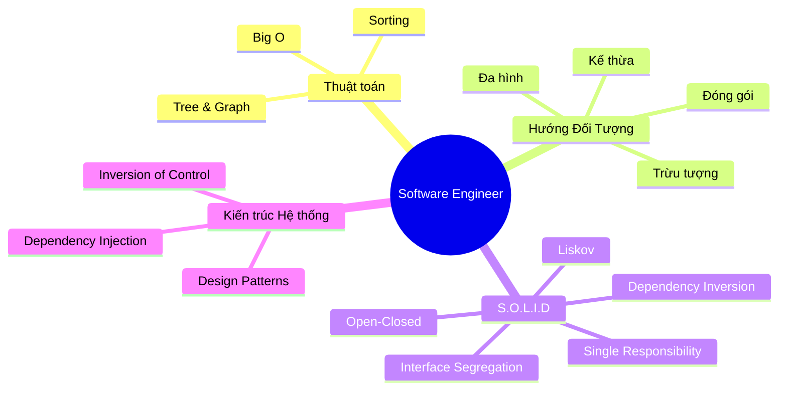
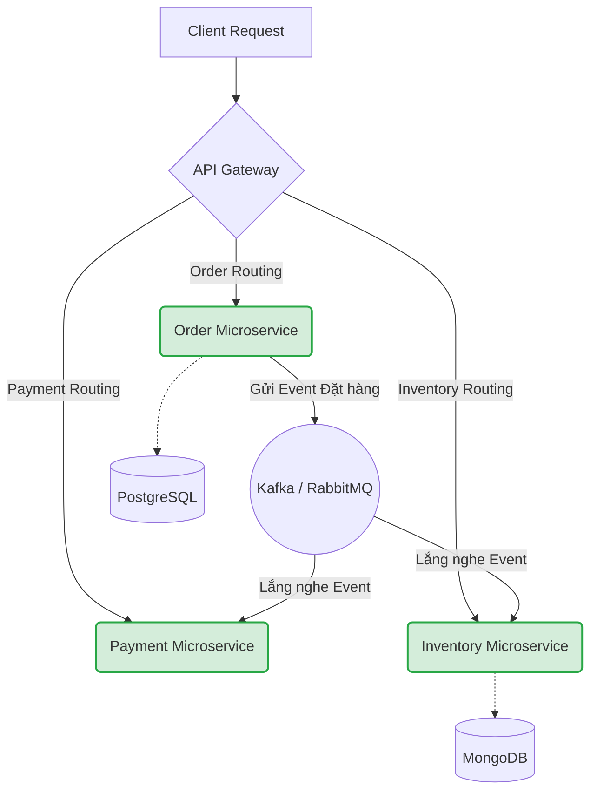

# Lời Kết & Lộ trình trở thành Software Engineer {#final-roadmap}

Chúc mừng bạn! Việc đọc, hiểu và thẩm thấu đến tận những dòng chữ cuối cùng này chứng tỏ bạn đã có một sự kiên trì vô cùng đáng nể. Bạn đã chính thức đi hết một chặng đường gian khổ nhất mà bất kỳ Lập trình viên nào cũng phải trải qua để chuyển mình từ "Thợ Code" (Coder) thành **Kỹ sư Phần mềm (Software Engineer)**.

---

## 1. Nhìn lại những gì đã học: Tứ Trụ Cốt Lõi {#recap}

Hãy tự hào về những hành trang đồ sộ bạn đang mang trên vai. Đây không phải là các mánh khóe học thuộc lòng, mà là **Nguyên lý bất biến** - thứ sẽ đi theo bạn suốt cả thập kỷ tới, bất chấp sự thay đổi chóng mặt của các Framework:

1. **Tư duy Thuật toán & Big O:** Không còn sợ hãi trước những bài toán xử lý hàng triệu dữ liệu. Nắm vững nghệ thuật chia để trị ([Merge Sort](/docs/sorting/merge-sort)), và kỹ năng duyệt phi tuyến tính ([Binary Tree](/docs/tree-graph/bst), [Graph & DFS](/docs/tree-graph/dfs), [Dijkstra](/docs/tree-graph/dijkstra)).
2. **Linh hồn Hướng đối tượng (OOP):** Hiểu rõ giá trị của việc [Đóng gói](/docs/oop/encapsulation), tái sử dụng qua [Kế thừa](/docs/oop/inheritance), linh hoạt với [Đa hình](/docs/oop/polymorphism) và định hình bằng [Trừu tượng hóa](/docs/oop/abstraction).
3. **Tiêu chuẩn Thiết kế (SOLID):** Không còn viết ra những đoạn mã dính chặt vào nhau (Tightly Coupled). Bạn đã biết cách thiết kế các Module rời rạc, dễ bảo trì, dễ mở rộng ([Open-Closed](/docs/solid/ocp)) mà không làm sụp đổ hệ thống cũ.
4. **Giải pháp Hệ thống (Design Patterns & DI):** Nắm trong tay quyền lực tối cao của [Dependency Injection](/docs/di/basics), IoC Container, [Factory](/docs/patterns/factory), và [Strategy Pattern](/docs/patterns/strategy) để tự tay xây dựng những kiến trúc Enterprise khổng lồ.

---

## 2. Bản đồ kho báu (The Next Steps) {#what-is-next}

Học xong bộ tài liệu này không có nghĩa là bạn đã biết mọi thứ. Ngược lại, nó có nghĩa là **bạn đã có đủ Nội công để tự học mọi thứ**. 

Dưới đây là Lộ trình Bậc thang để bạn vươn tới cấp độ **Senior / System Architect**.

### Giai đoạn 1: Master Nền tảng Công nghệ (C# & .NET Core)
Trước khi vươn ra biển lớn, hãy làm chủ tuyệt đối thanh gươm bạn đang cầm trên tay:
- Đọc cuốn sách kinh điển: **"C# in Depth"** của Jon Skeet.
- Nắm vững lập trình Bất đồng bộ (Asynchronous): Hiểu rõ bản chất của `async/await`, Thread Pool, Task, và Deadlock.
- Khám phá sức mạnh của **Entity Framework Core**: Viết truy vấn LINQ tốc độ cao, xử lý bài toán N+1 Query.
- Tìm hiểu **Memory Management**: Phân biệt Heap/Stack, Garbage Collector, và cách dùng `Span<T>` để vắt kiệt hiệu năng.

### Giai đoạn 2: Nghệ thuật Clean Architecture
Khi code đã chạy đúng, bạn cần làm cho nó Đẹp và Sạch:
- Đọc 2 quyển sách gối đầu giường của mọi kỹ sư: **"Clean Code"** và **"Clean Architecture"** của Robert C. Martin (Uncle Bob).
- Tìm hiểu về **Domain-Driven Design (DDD)**: Biến nghiệp vụ kinh doanh phức tạp ngoài đời thực thành các Domain Entity cốt lõi.
- Xây dựng hệ thống tự động kiểm thử (Unit Test, Integration Test) bằng xUnit/NUnit kết hợp thư viện giả lập Moq/NSubstitute. TDD (Test-Driven Development) phải là phản xạ tự nhiên.

### Giai đoạn 3: Hệ thống phân tán (Distributed Systems)
Làm sao để hệ thống của bạn chịu được 1 triệu người truy cập cùng lúc (Concurrency)?
- Khái niệm **Microservices**: Chia nhỏ khối Monolith khổng lồ thành các dịch vụ độc lập.
- Sử dụng **Docker** và **Kubernetes (K8s)** để đóng gói và điều phối các Container.
- Giao tiếp bất đồng bộ qua **Message Broker**: RabbitMQ, Apache Kafka. Mọi thứ không gọi API trực tiếp nữa mà thông báo qua Event (Event Sourcing).
- Caching đa tầng: Tích hợp Redis để giảm tải hàng triệu truy vấn vào Database.

Đừng quên tìm đọc tuyệt tác **"Designing Data-Intensive Applications"** (DDIA) của Martin Kleppmann để khai mở toàn bộ tầm nhìn về Database và Hệ thống phân tán.

---

## 3. Lời kêu gọi đóng góp (Contribute) {#contribute}

Dự án **VisualizationDSA** được sinh ra từ mồ hôi và tâm huyết, với sứ mệnh **Dân chủ hóa kiến thức Khoa học Máy tính** thông qua sức mạnh của **Trực quan hóa (Visualization)**.

Tài liệu bạn đang đọc, và cả những Animation sinh động bạn thấy trên màn hình, tất cả đều là mã nguồn mở (Open Source).
Nếu bạn:
- Phát hiện một lỗi chính tả nhỏ giọt.
- Có một phép ẩn dụ, một cách giải thích đỉnh cao hơn.
- Muốn bổ sung trực quan hóa cho một thuật toán mới (A*, Bellman-Ford, Trie...).

**Chúng tôi luôn rộng cửa chào đón bạn!**

Hãy truy cập kho lưu trữ GitHub của dự án (hoặc mã nguồn trên máy của bạn), tạo một nhánh mới (Branch), viết mã, và gửi Pull Request. Việc có tên trên bảng vàng đóng góp cho mã nguồn mở không chỉ là niềm tự hào, mà còn là một điểm cộng khổng lồ trong mắt các tập đoàn công nghệ toàn cầu.

---

## Next Steps {#next-steps}

Hành trình 12 chặng đường đã khép lại, nhưng trước khi bước sang chặng mới (Clean Architecture, DDD, Microservices), hãy dành chút thời gian ôn lại nhanh những trụ cột cốt lõi:

  <a class="vt-box" href="/docs/sorting/sorting-summary">
    
Tổng hợp thuật toán Sắp xếp

    
So sánh độ phức tạp và khi nào nên dùng thuật toán nào.

  </a>
  <a class="vt-box" href="/docs/tree-graph/tree-graph-summary">
    
Tổng hợp Cây & Đồ thị

    
Ôn lại BFS, DFS, Dijkstra và các ứng dụng điển hình.

  </a>
  <a class="vt-box" href="/docs/di/basics">
    
Dependency Injection & IoC

    
Nền tảng vững chắc cho những kiến trúc Enterprise khổng lồ.

  </a>
  <a class="vt-box" href="/docs/system-design/system-design-intro">
    
Thiết kế Hệ thống

    
Khởi đầu cho lộ trình trở thành System Architect.

  </a>

## 📚 Tham khảo lý thuyết {#references}

Dưới đây là các nguồn tài liệu kinh điển và chính thống đã định hình toàn bộ chương trình, giúp bạn tự nghiên cứu sâu hơn trong lộ trình phía trước:

- **Thuật toán, Độ phức tạp & Cấu trúc dữ liệu:** Cormen, Leiserson, Rivest & Stein, *Introduction to Algorithms* (CLRS), 3rd Edition (MIT Press); Gayle Laakmann McDowell, *Cracking the Coding Interview*, 6th Edition — mục "Big O" và "Trees and Graphs".
- **Ký hiệu O lớn:** [Wikipedia - Big O notation](https://en.wikipedia.org/wiki/Big_O_notation).
- **SOLID & Clean Code:** Robert C. Martin, *Clean Code* và *Clean Architecture*; [Wikipedia - SOLID](https://en.wikipedia.org/wiki/SOLID).
- **Design Patterns:** Erich Gamma et al. (Gang of Four), *Design Patterns: Elements of Reusable Object-Oriented Software*; [Wikipedia - Design Patterns](https://en.wikipedia.org/wiki/Design_Patterns).
- **Dependency Injection trong .NET:** [Microsoft Learn - Dependency injection in .NET](https://learn.microsoft.com/dotnet/core/extensions/dependency-injection).
- **Thiết kế Hệ thống & Hệ thống phân tán:** Alex Xu, *System Design Interview – An Insider's Guide* (Volume 1 & 2); Martin Kleppmann, *Designing Data-Intensive Applications* (DDIA).
- **Microservices & Kiến trúc phần mềm:** Sam Newman, *Building Microservices*; [Wikipedia - Domain-driven design](https://en.wikipedia.org/wiki/Domain-driven_design).
- **Nghề Kỹ sư Phần mềm:** Andrew Hunt & David Thomas, *The Pragmatic Programmer*, 20th Anniversary Edition.

---

> *"Programs must be written for people to read, and only incidentally for machines to execute."*  
> (Chương trình phải được viết cho con người đọc, và chỉ tiện thể để cho máy móc chạy)  
> — **Hal Abelson, MIT**

Cảm ơn bạn đã lựa chọn **VisualizationDSA** làm người bạn đồng hành. Hệ thống kiến thức đã được trao truyền trọn vẹn. Ngọn lửa đã được thắp lên.  
Chúc bạn vạn dặm bình an, và gặt hái thành công vang dội trên con đường trở thành một **Software Engineer xuất chúng!** 🚀

***— HẾT —***
