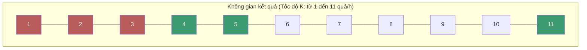

# Tìm kiếm Nhị phân (Binary Search) {#binary-search}

:::info Mục tiêu bài học
- Vượt qua ranh giới cơ bản: Binary Search không chỉ dùng để tìm một số trong mảng, mà dùng để **chặt nhị phân không gian kết quả**.
- Phân tích 3 Template (Mẫu code) kinh điển: Khi nào dùng `while (L <= R)`, khi nào dùng `while (L < R)`.
- Hiểu rõ rủi ro tràn số nguyên (Overflow) khi tính `Mid` và cách phòng tránh.
- Giải phẫu bài toán thực tế cực hay: *Koko Eating Bananas* (LeetCode 875).
:::

## 1. Lời mở đầu: Sức mạnh của O(log N) {#introduction}

Tìm kiếm nhị phân là kỹ thuật lợi dụng tính chất **Đã sắp xếp** của dữ liệu để vứt bỏ đi một nửa số lượng phần tử cần xem xét sau mỗi bước.

**Ví dụ thực tế (Real-world analogy):**
Chơi trò đoán số từ 1 đến 100. Người quản trò chỉ trả lời "Cao hơn" hoặc "Thấp hơn".
- Nếu đoán ngẫu nhiên hoặc đoán từ 1, 2, 3... (Linear Search), bạn mất tối đa 100 lần đoán (Mất $O(N)$).
- Nếu dùng Binary Search, bạn luôn đoán ở giữa. 
  - Đoán 50 -> Quản trò bảo "Thấp hơn". Bạn lập tức gạch bỏ từ 50 trở lên. Phạm vi chỉ còn 1-49!
  - Đoán 25 -> Quản trò bảo "Cao hơn". Bạn gạch bỏ 1-25. Phạm vi còn 26-49.
Bằng cách này, dù là 100 số, bạn chỉ mất tối đa $\approx 7$ lần đoán. Dù là 1 Tỷ số, bạn cũng chỉ mất đúng $\mathbf{30}$ lần đoán. Đó là phép màu của $O(\log N)$!

---

## 2. Rủi ro Tử huyệt: Tràn Số (Integer Overflow) {#overflow}

Để tìm điểm giữa `Mid` của hai con trỏ `L` và `R`, công thức phổ thông ai cũng nghĩ tới là:
```csharp
int mid = (L + R) / 2;
```
**Đây là một trong những lỗi kinh điển nhất lịch sử!** Lỗi này từng tồn tại trong thư viện chuẩn của Java suốt 9 năm trời trước khi bị Google phát hiện (Năm 2006).

**Tại sao sai?** Nếu `L` và `R` là những chỉ số mảng cực lớn (ví dụ gần chạm ngưỡng 2.14 tỷ của số `int` trong C#). Việc tính `(L + R)` sẽ vượt qua 2.14 tỷ, làm tràn giới hạn (Overflow), kết quả bị lộn thành số âm. Lấy số âm chia 2 sẽ ra một cái `mid` âm -> Văng lỗi `IndexOutOfRangeException`!

**Giải pháp an toàn 100%:**
Thay vì tính tổng, ta tính Khoảng cách, rồi lấy `L` cộng thêm một nửa khoảng cách đó:
```csharp
// Đảm bảo không bao giờ tràn bộ nhớ
int mid = L + (R - L) / 2; 
```

---

## 3. Ba Template (Mẫu code) của Binary Search {#templates}

Có hàng chục cách cài đặt Binary Search, nhưng chung quy lại sẽ rơi vào 1 trong 3 Template sau. Hiểu rõ chúng giúp bạn không bao giờ bị dính vòng lặp vô hạn (Infinite Loop).

### Template 1: Tìm chính xác 1 giá trị (Standard)
Dùng khi bạn cần tìm chính xác chỉ số của số `target` trong mảng.

```csharp
public int BinarySearch_Template1(int[] nums, int target) 
{
    int left = 0;
    int right = nums.Length - 1;

    while (left <= right) // QUAN TRỌNG: Dấu <=
    {
        int mid = left + (right - left) / 2;

        if (nums[mid] == target) 
            return mid; // Tìm thấy!
        else if (nums[mid] < target) 
            left = mid + 1; // Vứt bỏ nửa bên trái (bao gồm cả mid)
        else 
            right = mid - 1; // Vứt bỏ nửa bên phải (bao gồm cả mid)
    }

    return -1; // Không tìm thấy
}
```
**Đặc điểm:** Khi kết thúc vòng lặp, `left` sẽ vượt qua `right` (`left = right + 1`).

### Template 2: Tìm phần tử đầu tiên thỏa mãn điều kiện (Lower Bound)
Rất thường gặp! Tìm phần tử đầu tiên $\ge target$. Ví dụ: Mảng có nhiều số 5, tìm số 5 đầu tiên.

```csharp
public int BinarySearch_Template2(int[] nums, int target) 
{
    int left = 0;
    int right = nums.Length - 1;

    while (left < right) // QUAN TRỌNG: Không có dấu =
    {
        int mid = left + (right - left) / 2;

        if (nums[mid] < target) 
            left = mid + 1; // Vứt bỏ hẳn mid
        else 
            right = mid; // Có thể mid là kết quả, giữ lại! Không trừ 1!
    }

    // Khi thoát vòng lặp, left == right, chỉ vào phần tử duy nhất còn lại
    if (nums[left] == target) return left;
    return -1;
}
```
**Đặc điểm:** Không vứt bỏ `mid` khi rẽ phải (`right = mid`). Nhờ vòng lặp `left < right` nên không bao giờ bị vòng lặp vô hạn.

---

## 4. Tầm cao mới: Tìm kiếm trên Không gian Kết quả (Search on Answer Space) {#answer-space}

Trong các buổi phỏng vấn FAANG, đề bài Binary Search thường được giấu đi. Bạn không hề được cho một mảng nào cả!
Thay vào đó, bạn phải tự nhận ra rằng: **Phạm vi kết quả có thể có** đang được sắp xếp tăng dần, và mình có thể dùng Binary Search để đoán kết quả.

### Bài toán kinh điển: Koko Eating Bananas (LeetCode 875)
**Đề bài:** Khỉ Koko có $N$ nải chuối, nải thứ $i$ có $piles[i]$ quả. Bảo vệ đi vắng trong $H$ giờ. Koko muốn ăn chậm nhất có thể (chọn tốc độ ăn $K$ quả/giờ) sao cho vẫn ăn hết sạch chuối trước khi bảo vệ về. Tìm tốc độ $K$ nhỏ nhất.
*(Lưu ý: Nếu nải có 7 quả mà tốc độ là 5, Koko ăn 5 quả giờ đầu, giờ thứ 2 ăn 2 quả rồi nghỉ, coi như tốn 2 giờ cho nải đó).*

**Phân tích tư duy thông thường:**
Tốc độ $K$ nhỏ nhất Koko có thể ăn là 1 quả/giờ.
Tốc độ $K$ lớn nhất Koko cần là `Max(piles)` (Ăn phát hết nải to nhất trong 1 tiếng).
=> **Không gian kết quả** là các số nguyên từ $1$ đến `Max(piles)`. Không gian này ĐÃ ĐƯỢC SẮP XẾP!

**Áp dụng Binary Search (Template 2):**
1. Chọn `L = 1`, `R = Max`.
2. Lấy `Mid = L + (R - L) / 2` (công thức chống tràn số như Mục 2) làm tốc độ ăn thử nghiệm.
3. Viết hàm giả lập `CanFinish(mid)` để xem với tốc độ đó, Koko có ăn xong trong $H$ giờ không.
4. Nếu Ăn xong: Tốc độ này xài được, nhưng ta muốn tìm chậm hơn nữa -> Ép `R = mid`.
5. Nếu Không xong: Chậm quá rồi! Phải tăng tốc lên -> Ép `L = mid + 1`.


*(Với K = 1,2,3 là sai. K từ 4 trở lên là đúng. Ta cần tìm ranh giới chuyển tiếp này bằng Binary Search! Kết quả là K = 4).*

```csharp
public int MinEatingSpeed(int[] piles, int H) 
{
    int left = 1;
    int right = 1000000000; // Hoặc tìm Max thực tế của mảng
    
    while (left < right) 
    {
        int mid = left + (right - left) / 2;
        
        if (CanFinish(piles, H, mid)) 
        {
            right = mid; // Có thể làm được, thử chậm hơn xem (thu hẹp xuống dưới)
        } 
        else 
        {
            left = mid + 1; // Quá chậm! Bắt buộc phải ăn nhanh hơn
        }
    }
    
    return left; // left == right
}

// Hàm giả lập (Helper function)
private bool CanFinish(int[] piles, int H, int speed) 
{
    long hoursNeeded = 0; // Đề phòng cộng nhiều quá tràn int
    foreach (int p in piles) 
    {
        hoursNeeded += (p + speed - 1) / speed; // Mẹo làm tròn lên (Ceiling) của phép chia nguyên
    }
    return hoursNeeded <= H;
}
```

:::tip Tóm tắt nhanh (Key Takeaways)
- Luôn cẩn thận với lỗi tràn số `(L + R) / 2`. Hãy tập thói quen dùng `L + (R - L) / 2`.
- Binary Search cực kỳ linh hoạt với 3 Template tùy vào yêu cầu tìm chính xác hay tìm biên (Lower/Upper Bound).
- Hãy áp dụng linh hoạt vào **Không gian kết quả** thay vì chỉ tìm kiếm trên Mảng. Nếu bạn có thể xây dựng hàm `Điều kiện` trả về dạng mảng `[Sai, Sai, Sai, Đúng, Đúng, Đúng]`, bạn hoàn toàn có thể dùng Binary Search để tìm ra điểm ranh giới đó!
:::

## Next Steps {#next-steps}

Bạn đã nắm được bộ não chia-để-trị của Binary Search rồi! Nhưng Binary Search thường chỉ mới là "bước đệm" để bạn nhận ra mảng đã được sắp xếp sẵn. Với các bài toán phức tạp hơn, bạn sẽ cần tới hai kỹ thuật quét mảng kinh điển tiếp theo, và cuối cùng là bức tranh tổng hợp toàn bộ nhóm Tìm kiếm.

<div class="vt-box-container next-steps">
  <a class="vt-box" href="/docs/searching/two-pointers">
    <p class="next-steps-link">Kỹ thuật Hai con trỏ (Two Pointers)</p>
    <p class="next-steps-caption">Dùng hai con trỏ quét từ hai đầu để giải bài toán trên mảng đã sắp xếp.</p>
  </a>
  <a class="vt-box" href="/docs/searching/sliding-window">
    <p class="next-steps-link">Kỹ thuật Cửa sổ trượt (Sliding Window)</p>
    <p class="next-steps-caption">Trượt một cửa sổ qua dãy con để tối ưu các bài toán tìm kiếm trên đoạn liên tiếp.</p>
  </a>
  <a class="vt-box" href="/docs/searching/searching-summary">
    <p class="next-steps-link">Tổng hợp ứng dụng Tìm kiếm</p>
    <p class="next-steps-caption">Bức tranh toàn cảnh: khi nào dùng thuật toán tìm kiếm nào.</p>
  </a>
</div>

## 📚 Tham khảo lý thuyết {#references}

Nguồn lý thuyết chính được dùng để biên soạn bài viết này:

- **Cormen, Leiserson, Rivest & Stein (CLRS) – *Introduction to Algorithms*, 3rd Edition (MIT Press):** Chương 2.3 *Designing Algorithms* phân tích kỹ thuật tìm kiếm nhị phân và độ phức tạp O(log N).
- **Wikipedia – [Binary search algorithm](https://en.wikipedia.org/wiki/Binary_search_algorithm):** Giải thích cơ chế hoạt động, phân tích độ phức tạp và các biến thể Lower Bound/Upper Bound.
- **Joshua Bloch – *Extra, Extra – Read All About It: Nearly All Binary Searches and Mergesorts are Broken* (Google AI Blog, 2006):** Bài viết gốc công bố lỗi tràn số `(L + R) / 2` tồn tại trong thư viện chuẩn Java suốt 9 năm, khởi nguồn cho câu chuyện ở Mục 2.
- **GeeksforGeeks – [Binary Search](https://www.geeksforgeeks.org/binary-search/):** Tổng hợp 3 mẫu cài đặt (Template) phổ biến dùng để phân tích trong Mục 3.
- **LeetCode – [Problem 875: Koko Eating Bananas](https://leetcode.com/problems/koko-eating-bananas/):** Bài toán kinh điển minh họa kỹ thuật Tìm kiếm trên Không gian Kết quả ở Mục 4.
- **Microsoft Learn – [Array.BinarySearch Method](https://learn.microsoft.com/en-us/dotnet/api/system.array.binarysearch):** Tài liệu chính thức của .NET về phương thức tìm kiếm nhị phân có sẵn trong BCL.
