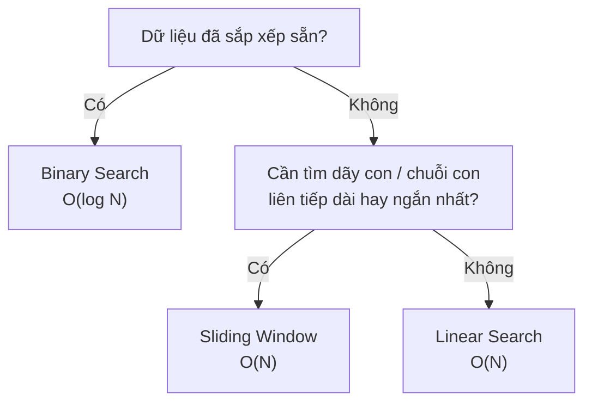

# Tổng hợp: Ứng dụng Tìm kiếm {#searching-summary}

Nhóm thuật toán Tìm kiếm (Searching) thường bị xem nhẹ vì chúng ta đã quá quen với các hàm có sẵn như `.IndexOf()` hay `.Find()` trong C#. Tuy nhiên, hiểu thấu đáo bản chất của chúng là chìa khóa để giải quyết các bài toán thao tác trên mảng phức tạp và nâng cao hiệu năng hệ thống.

Dưới đây là bức tranh tổng thể về 3 kỹ thuật Tìm kiếm và Duyệt mảng mà chúng ta vừa đi qua.

## Bảng So sánh Tổng hợp {#comparison-table}

| Thuật toán | Big O Thời gian | Big O Không gian | Yêu cầu Dữ liệu | Khi nào nên dùng? |
| :--- | :--- | :--- | :--- | :--- |
| **Linear Search** (Tìm kiếm Tuần tự) | O(N) | O(1) | Bất kỳ (Không cần sắp xếp) | Mảng dữ liệu ngẫu nhiên, danh sách nhỏ, hoặc khi bạn lười viết code. C# dùng nó cho hàm `.Contains()`. |
| **Binary Search** (Tìm kiếm Nhị phân) | O(log N) | O(1) | **Bắt buộc Đã sắp xếp** | Mảng dữ liệu cực lớn, mảng tĩnh (ít biến động), tìm kiếm trong cơ sở dữ liệu có Index (Chỉ mục). |
| **Sliding Window** (Cửa sổ trượt) | O(N) | O(1) | Mảng số nguyên, chuỗi (String) | Các bài toán tìm "Dãy con", "Chuỗi con" (Sub-array/Substring) liên tiếp nhau. |

## Sơ đồ Lựa chọn Thuật toán {#decision-tree}

Khi gặp một bài toán tìm kiếm, hãy lần lượt hỏi ngược lại 3 câu hỏi theo thứ tự sau:



## Ví dụ Minh họa bằng Code {#code-example}

Binary Search trên mảng đã sắp xếp trong C#:

```csharp
// Tìm kiếm nhị phân trên mảng đã sắp xếp — O(log N), O(1) không gian
public static int BinarySearch(int[] sortedArray, int target)
{
    int left = 0, right = sortedArray.Length - 1;

    while (left <= right)
    {
        int mid = left + (right - left) / 2; // tránh tràn số khi left + right quá lớn
        if (sortedArray[mid] == target) return mid;
        if (sortedArray[mid] < target) left = mid + 1;
        else right = mid - 1;
    }

    return -1; // không tìm thấy
}
```

## Nhận diện "Mùi" bài toán (Pattern Matching) {#pattern-matching}

Để trở thành một lập trình viên nhạy bén, bạn cần phải có khả năng "ngửi" thấy mùi của thuật toán đằng sau những câu chữ yêu cầu. 

Dưới đây là một số dấu hiệu (red flags) giúp bạn chọn đúng vũ khí:

### 1. Dấu hiệu gọi tên "Binary Search"
Nếu trong mô tả bài toán có xuất hiện một trong hai cụm từ sau:
- *"Cho một mảng **đã sắp xếp**..."* (Sorted array)
- *"Yêu cầu giải bài toán với độ phức tạp thời gian là **O(log N)**"*
👉 **99% khả năng bạn phải dùng Binary Search.** Đừng cố nghĩ giải pháp nào khác. Thậm chí nếu dữ liệu chưa sắp xếp nhưng bài toán bắt buộc O(log N), đôi khi bạn cũng phải Binary Search trên kết quả (Binary Search on Answer).

### 2. Dấu hiệu gọi tên "Sliding Window"
Nếu bài toán yêu cầu tìm:
- *"Chuỗi con (Substring) / Mảng con (Subarray) **liền kề** / **liên tiếp**..."*
- Đi kèm với từ khóa: *"Dài nhất" (Longest)*, *"Ngắn nhất" (Shortest)*, *"Lớn nhất" (Maximum)*, *"Tổng bằng X"*
👉 **Hãy vẽ ngay một cái cửa sổ (Window) trong đầu.** Việc duy trì một khung nhìn 2 con trỏ (Trái/Phải) và kéo giãn nó sẽ dẹp tan O(N²) thành O(N).

### 3. Dấu hiệu gọi tên "Two Pointers" (Hai con trỏ)
Khá giống Sliding Window, nhưng Two Pointers linh hoạt hơn (có thể 1 con trỏ ở đầu, 1 con trỏ ở đuôi đi ngược chiều nhau).
Dấu hiệu:
- *"Tìm 2 phần tử trong mảng (đã sắp xếp) có tổng bằng X."*
- *"Đảo ngược chuỗi."*
- *"Palindrome (Chuỗi đối xứng)."*

## Ứng dụng trong Thực tế (Real-world Use Cases) {#real-world}

1. **Database Indexing:** Khi bạn tạo một `Index` trên cột `Email` trong cơ sở dữ liệu SQL, DB Engine sẽ ngầm sắp xếp cột `Email` đó (thường bằng cấu trúc B-Tree) để từ đó về sau, mọi thao tác tìm kiếm tài khoản theo Email sẽ được diễn ra bằng tốc độ chớp nhoáng của Binary Search (O(log N)), thay vì Full Table Scan (Linear Search O(N)).
2. **Streaming Data:** Giao thức mạng TCP phân tích các gói tin (packets) đến và đi liên tục. Việc duy trì một "Cửa sổ" (Window) để theo dõi các gói tin nào đã nhận/chưa nhận là xương sống của luồng truyền dẫn TCP. Kỹ thuật này chính xác là Sliding Window!

## Next Steps {#next-steps}

Chúc mừng bạn! Chúng ta vừa xử lý xong hai nền tảng thuật toán lớn nhất và cơ bản nhất: Sắp xếp (Sorting) và Tìm kiếm (Searching) trên cấu trúc mảng 1 chiều đơn giản.

Nhưng thế giới lập trình không chỉ có mảng một chiều nằm ngang. 
Tiếp theo, chúng ta sẽ bẻ cong cấu trúc dữ liệu, xếp chúng đè lên nhau, và liên kết chúng lại trong nhóm bài học về **Cấu trúc dữ liệu tuyến tính**: **Ngăn xếp (Stack) & Hàng đợi (Queue)**.

<div class="vt-box-container next-steps">
  <a class="vt-box" href="/docs/stack-queue/stack">
    <p class="next-steps-link">Ngăn xếp (Stack) – Nguyên lý LIFO</p>
    <p class="next-steps-caption">Cấu trúc vào sau ra trước, chìa khóa của bộ nhớ thực thi và lệnh Undo.</p>
  </a>
</div>

## 📚 Tham khảo lý thuyết {#references}

Dưới đây là các nguồn tài liệu kinh điển và chính thống được dùng để biên soạn bài viết này, giúp bạn tự nghiên cứu sâu hơn nếu muốn:

- **Phân tích độ phức tạp Big O của Linear Search, Binary Search và Sliding Window:** Cormen, Leiserson, Rivest & Stein, *Introduction to Algorithms* (CLRS), 3rd Edition (MIT Press) - Chương 2 (Getting Started) và Chương 12 về Binary Search Trees.
- **Khái niệm tìm kiếm tuần tự (Linear Search) và nhị phân (Binary Search), độ phức tạp O(N) / O(log N):** [Wikipedia - Linear search](https://en.wikipedia.org/wiki/Linear_search) và [Wikipedia - Binary search algorithm](https://en.wikipedia.org/wiki/Binary_search_algorithm).
- **Kỹ thuật Sliding Window áp dụng cho dãy con / chuỗi con liên tiếp:** [GeeksforGeeks - Sliding Window Technique](https://www.geeksforgeeks.org/window-sliding-technique/).
- **Kỹ thuật Two Pointers (Hai con trỏ) cho mảng đã sắp xếp:** [GeeksforGeeks - Two Pointers Technique](https://www.geeksforgeeks.org/two-pointers-technique/).
- **Database Indexing dùng B-Tree và Binary Search để truy vấn O(log N):** [Wikipedia - B-tree](https://en.wikipedia.org/wiki/B-tree).
- **TCP Sliding Window trong giao thức truyền mạng:** [Wikipedia - Transmission Control Protocol](https://en.wikipedia.org/wiki/Transmission_Control_Protocol#Flow_control).


