# Kỹ thuật Cửa Sổ Trượt (Sliding Window) {#sliding-window}

:::info Mục tiêu bài học
- Thấu hiểu triết lý "Tái sử dụng thay vì Tính lại" để giảm thiểu tối đa các phép toán dư thừa.
- Phân biệt rõ ràng 2 biến thể: Cửa sổ kích thước Cố định (Fixed Window) và Cửa sổ Kích thước Động (Dynamic Window).
- Sử dụng bảng mô phỏng (Trace Table) và hình ảnh (Mermaid) để theo dõi cách cửa sổ trượt qua dữ liệu.
- Nhận diện các Cạm bẫy (Edge cases) liên quan đến chỉ số mảng và số âm.
:::

## 1. Lời mở đầu: Vì sao phải "Trượt"? {#introduction}

Trong các bài toán mảng, đôi khi bạn được yêu cầu tìm một mảng con (subarray) liên tiếp thỏa mãn một điều kiện nào đó (Ví dụ: Tìm mảng con 3 phần tử có tổng lớn nhất).

**Ví dụ thực tế (Real-world analogy):**
Hãy tưởng tượng bạn là một kế toán viên phải tính tổng doanh thu của công ty trong **mỗi 3 ngày liên tiếp** để báo cáo.
- **Cách ngây thơ (Brute Force):** Ngày 1 đến ngày 3, bạn mở sổ ra cộng 3 con số. Tiếp theo, tính từ ngày 2 đến ngày 4, bạn lại cộng 3 con số. Nếu công ty yêu cầu báo cáo mỗi 30 ngày thay vì 3 ngày, mỗi lần bạn sẽ phải thực hiện 30 phép cộng. Với $N$ ngày, bạn sẽ tốn thời gian $O(N \times K)$. Rất mệt mỏi!
- **Cách Cửa Sổ Trượt:** Bạn tạo một "khung cửa sổ" ôm trọn 3 ngày đầu và tính tổng (ví dụ được 100$). Khi bước sang ngày tiếp theo, bạn chỉ việc **trượt** khung cửa sổ sang phải 1 ô. Để có tổng mới, bạn không cần cộng lại 3 ngày, mà chỉ việc lấy tổng cũ (100$), **trừ đi** doanh thu của ngày vừa bị rơi ra khỏi cửa sổ bên trái, và **cộng thêm** doanh thu của ngày mới vừa lọt vào cửa sổ bên phải. Bạn chỉ mất 2 phép tính! Thời gian giảm xuống $O(N)$.

Kỹ thuật này cực kỳ hiệu quả khi xử lý dữ liệu truyền phát (Streaming data), chuỗi (Strings), và mảng liên tiếp (Contiguous arrays).

---

## 2. Biến thể 1: Cửa sổ Kích thước Cố định (Fixed Window) {#fixed-window}

Trong biến thể này, kích thước của cửa sổ (ví dụ $K = 3$) được cố định trong suốt quá trình chạy.

### Bài toán kinh điển: Maximum Sum Subarray of Size K
**Đề bài:** Cho mảng `arr = [2, 1, 5, 1, 3, 2]` và số `k = 3`. Tìm tổng lớn nhất của 3 phần tử nằm cạnh nhau.

**Minh họa từng bước (Step-by-step Visualizer)**

**Bước Khởi tạo:** Tính tổng của Cửa sổ đầu tiên (K = 3).
`Sum = 2 + 1 + 5 = 8`. Kỷ lục hiện tại (Max) = 8.

```mermaid
flowchart LR
    subgraph Window [Khung cửa sổ: Tổng = 8]
        0[2] --- 1[1] --- 2[5]
    end
    Window ~~~ 3[1] ~~~ 4[3] ~~~ 5[2]
    
    style Window fill:#252b27,stroke:#5ab88a,stroke-width:2px,stroke-dasharray:5 5
    style 0 fill:#3d9970,color:#fff
    style 1 fill:#3d9970,color:#fff
    style 2 fill:#3d9970,color:#fff
```



**Bước 2:** Trượt cửa sổ sang phải 1 ô.
Ta loại bỏ số `2` (bên trái) và thêm số `1` (bên phải).
`Sum mới = 8 - 2 + 1 = 7`. Kỷ lục vẫn là 8.

```mermaid
flowchart LR
    0[2] ~~~ Window
    subgraph Window [Khung cửa sổ: Tổng = 7]
        1[1] --- 2[5] --- 3[1]
    end
    Window ~~~ 4[3] ~~~ 5[2]
    
    style Window fill:#252b27,stroke:#5ab88a,stroke-width:2px,stroke-dasharray:5 5
    style 0 opacity:0.3
    style 1 fill:#3d9970,color:#fff
    style 2 fill:#3d9970,color:#fff
    style 3 fill:#3d9970,color:#fff
```



**Bước 3:** Trượt tiếp. Loại bỏ `1`, thêm `3`.
`Sum mới = 7 - 1 + 3 = 9`. Kỷ lục bị phá! Max = 9.

```mermaid
flowchart LR
    0[2] ~~~ 1[1] ~~~ Window
    subgraph Window [Khung cửa sổ: Tổng = 9]
        2[5] --- 3[1] --- 4[3]
    end
    Window ~~~ 5[2]
    
    style Window fill:#252b27,stroke:#5ab88a,stroke-width:2px,stroke-dasharray:5 5
    style 0 opacity:0.3
    style 1 opacity:0.3
    style 2 fill:#3d9970,color:#fff
    style 3 fill:#3d9970,color:#fff
    style 4 fill:#3d9970,color:#fff
```



### Phân tích Mã nguồn

Xem thuật toán Sliding Window chạy thực tế trên Playground bên dưới.

```playground:sliding-window
```

```dual:sliding-window
public int MaxSumSubarrayOfSizeK(int[] arr, int k) 
{
    if (arr.Length < k) return 0; // Edge case
    
    int maxSum = 0;
    int currentSum = 0;

    // Bước 1: Tính tổng của cửa sổ đầu tiên
    for (int i = 0; i < k; i++) 
    {
        currentSum += arr[i];
    }
    maxSum = currentSum;

    // Bước 2: Trượt cửa sổ từ từ cho đến hết mảng
    for (int i = k; i < arr.Length; i++) 
    {
        // currentSum = Tổng cũ - Phần tử rớt lại phía sau + Phần tử mới vào
        currentSum = currentSum - arr[i - k] + arr[i];
        
        // Cập nhật kỷ lục
        maxSum = Math.Max(maxSum, currentSum);
    }

    return maxSum;
}
```

---

## 3. Biến thể 2: Cửa sổ Kích thước Động (Dynamic Window) {#dynamic-window}

Ở biến thể này, kích thước cửa sổ không cố định. Nó giống như một con sâu bướm: Cái đầu (Right) vươn lên phía trước để ăn dữ liệu, khi ăn quá no (vi phạm điều kiện bài toán), cái đuôi (Left) sẽ co lại để xả bớt dữ liệu ra cho đến khi hợp lệ trở lại.

### Bài toán kinh điển: Smallest Subarray with a given sum
**Đề bài:** Cho mảng các số nguyên dương và số `S = 7`. Tìm mảng con (liên tiếp) **ngắn nhất** có tổng $\ge S$. Trả về độ dài của nó. Ví dụ mảng `[2, 1, 5, 2, 3, 2]`.

**Thuật toán (Sâu đo):**
1. Cho đầu cửa sổ (`windowEnd`) vươn dần sang phải, cộng dồn giá trị vào `currentSum`.
2. Khi `currentSum >= S`, cửa sổ này đã hợp lệ! Ta lưu lại chiều dài kỷ lục hiện tại.
3. Vì muốn tìm cửa sổ **ngắn nhất**, ta bắt đầu co cái đuôi (`windowStart`) lại (trừ bớt giá trị ở đuôi đi) để xem cửa sổ hẹp hơn có còn thỏa mãn `>= S` không. Cứ co đuôi cho đến khi `currentSum < S` thì dừng lại và tiếp tục vươn đầu lên trước.

### Bảng Mô phỏng (Trace Table)

Mảng: `[2, 1, 5, 2, 3, 2]`, `S = 7`.

| Bước | `windowEnd` (Đầu sâu) | `currentSum` | So sánh `>= 7` | Hành động Co đuôi (`windowStart`) | Độ dài Min Kỷ lục |
| :---: | :---: | :---: | :---: | :--- | :---: |
| 1 | `0` (Giá trị 2) | 2 | Sai | - | $\infty$ |
| 2 | `1` (Giá trị 1) | 3 | Sai | - | $\infty$ |
| 3 | `2` (Giá trị 5) | **8** | **ĐÚNG** | Cửa sổ `[2,1,5]` dài 3. Lưu `min=3`. <br>Co đuôi: Bỏ 2. Tổng còn 6. (Sai) | **3** |
| 4 | `3` (Giá trị 2) | **8** | **ĐÚNG** | Cửa sổ `[1,5,2]` dài 3. Vẫn `min=3`. <br>Co đuôi: Bỏ 1. Tổng còn 7. **(Vẫn đúng!)**<br> Cửa sổ `[5,2]` dài 2! Lưu `min=2`. <br>Co đuôi: Bỏ 5. Tổng còn 2. (Sai) | **2** |
| ... | ... | ... | ... | ... | 2 |

### Mã nguồn C#

```csharp
public int MinSubArrayLen(int target, int[] nums) 
{
    int minLength = int.MaxValue;
    int currentSum = 0;
    int windowStart = 0; // Đuôi cửa sổ

    for (int windowEnd = 0; windowEnd < nums.Length; windowEnd++) 
    {
        currentSum += nums[windowEnd]; // Vươn đầu ra ăn

        // Khi đã no (>= target), cố gắng co đuôi lại để tìm cửa sổ ngắn nhất
        while (currentSum >= target) 
        {
            int currentLength = windowEnd - windowStart + 1;
            minLength = Math.Min(minLength, currentLength);
            
            // Xả bớt ở đuôi
            currentSum -= nums[windowStart];
            windowStart++; 
        }
    }

    return minLength == int.MaxValue ? 0 : minLength;
}
```

---

## 4. Cạm bẫy & Góc khuất (Edge Cases) {#edge-cases}

1. **Gặp Số Âm (Negative Numbers):**
   Trong bài toán Dynamic Window tìm tổng (như bài 3), điều kiện tiên quyết là **các số phải dương**. Tại sao? Vì khi ta vươn đầu ra (cộng số dương), tổng chắc chắn TĂNG lên. Nhờ thế ta mới biết lúc nào đủ no (`>= S`) để bắt đầu co đuôi. 
   Nếu có số âm, việc vươn đầu có thể làm tổng GIẢM đi! Toàn bộ logic "sâu đo" sẽ sụp đổ. (Nếu gặp số âm, bạn phải dùng kỹ thuật Prefix Sum kết hợp Hash Map).

2. **Lỗi Off-by-one (Lệch 1 đơn vị):**
   Rất dễ nhầm lẫn khi tính độ dài cửa sổ. Hãy luôn nhớ công thức: `Length = windowEnd - windowStart + 1`. Nếu không có `+1`, bạn sẽ luôn tính ra kết quả sai lệch 1.

3. **Mảng ngắn hơn Kích thước Cửa sổ:**
   Trong bài Fixed Window, nếu đề bài yêu cầu tìm cửa sổ 3 ngày, nhưng mảng chỉ có 2 ngày, thuật toán sẽ văng lỗi `IndexOutOfRangeException` nếu bạn không check kỹ. Luôn kiểm tra `if (arr.Length < k) return 0;`.

---

## 5. Tổng kết {#summary}

| Tiêu chí | Cửa sổ Cố định (Fixed) | Cửa sổ Động (Dynamic) |
| :--- | :--- | :--- |
| **Dấu hiệu nhận biết** | Tìm chuỗi liên tiếp có kích thước bằng $K$ ... | Tìm chuỗi liên tiếp ngắn nhất/dài nhất sao cho ... |
| **Cách trượt** | Đẩy cùng lúc 1 trái, 1 phải. | Vươn phải liên tục, khi đạt điều kiện thì co trái lại. |
| **Độ phức tạp (Thời gian)** | **O(N)** | **O(N)** (Dù có vòng lặp `while` lồng trong `for`, nhưng mỗi phần tử chỉ bị thêm vào 1 lần và lấy ra 1 lần) |
| **Không gian** | **O(1)** | **O(1)** |

:::tip Lời khuyên thực chiến
Mọi bài toán chuỗi liên tiếp (Contiguous Subarray/Substring) đều có khả năng cao là Cửa sổ trượt. Đừng bao giờ lôi vòng lặp lồng nhau ra sử dụng trừ khi đó là lối thoát duy nhất!
:::

---

## Next Steps {#next-steps}

Bạn đã làm chủ kỹ thuật Cửa sổ Trượt — bộ đôi trượt-điều-chỉnh giúp xử lý dãy con liên tiếp chỉ trong một lượt quét O(N). Kỹ thuật này có họ hàng gần với Two Pointers: đều là những con trỏ lướt trên mảng, chỉ khác là cửa sổ trượt bao giờ cũng quản lý một **đoạn liên tiếp**. Nếu muốn gom toàn bộ nhóm Tìm kiếm lại để ôn thi, hãy ghé qua bài tổng hợp.

<div class="vt-box-container next-steps">
  <a class="vt-box" href="/docs/searching/two-pointers">
    <p class="next-steps-link">Kỹ thuật Hai con trỏ (Two Pointers)</p>
    <p class="next-steps-caption">Dùng hai con trỏ quét từ hai đầu để giải bài toán trên mảng đã sắp xếp.</p>
  </a>
  <a class="vt-box" href="/docs/searching/searching-summary">
    <p class="next-steps-link">Tổng hợp ứng dụng Tìm kiếm</p>
    <p class="next-steps-caption">Bức tranh toàn cảnh: khi nào dùng thuật toán tìm kiếm nào.</p>
  </a>
</div>

## 📚 Tham khảo lý thuyết {#references}

Nguồn lý thuyết chính được dùng để biên soạn bài viết này:

- **GeeksforGeeks – [Window Sliding Technique](https://www.geeksforgeeks.org/window-sliding-technique/):** Nguồn chính về kỹ thuật cửa sổ trượt, phân biệt Fixed Window và Variable Window, kèm phân tích độ phức tạp O(N).
- **GeeksforGeeks – [Find maximum (or minimum) sum of a subarray of size k](https://www.geeksforgeeks.org/find-maximum-minimum-sum-subarray-size-k/):** Bài toán Fixed Window kinh điển được phân tích trong Mục 2 (Maximum Sum Subarray of Size K).
- **Wikipedia – [Maximum subarray problem](https://en.wikipedia.org/wiki/Maximum_subarray_problem):** Nền tảng lý thuyết cho họ bài toán tổng mảng con (subarray sum).
- **LeetCode – [Problem 209: Minimum Size Subarray Sum](https://leetcode.com/problems/minimum-size-subarray-sum/):** Bài toán Dynamic Window kinh điển được phân tích trong Mục 3 (Smallest Subarray with a given sum).
- **Cormen, T. H., Leiserson, C. E., Rivest, R. L., & Stein, C. (2009). *Introduction to Algorithms* (CLRS), 3rd Edition, MIT Press:** Nền tảng phân tích thuật toán và độ phức tạp thời gian dùng xuyên suốt bài viết.
