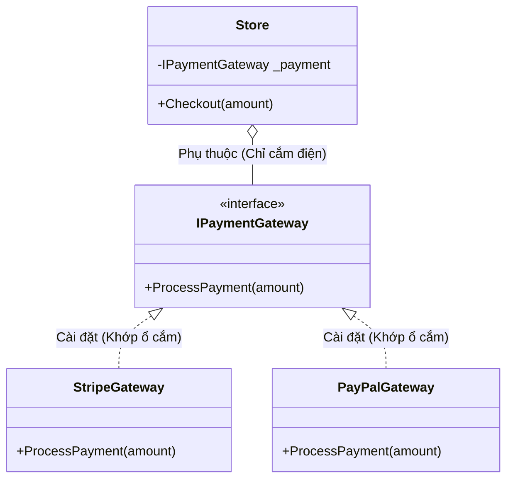

# Nguyên lý Đảo ngược Phụ thuộc (Dependency Inversion Principle) {#dip}

:::info Mục tiêu bài học
- Thấu hiểu chữ "D" cuối cùng - Nguyên lý định hình toàn bộ tư duy Kiến trúc Phần mềm (Software Architecture).
- Nhận diện sự phụ thuộc Tightly Coupled (Gắn chặt) khi sử dụng từ khóa `new`.
- Nắm vững 2 quy tắc cốt lõi: Module cấp cao và Cấp thấp đều phải phụ thuộc vào Trừu tượng (Abstractions).
- Dẫn dắt vào thế giới của **Dependency Injection (DI)** và **Inversion of Control (IoC)**.
:::

## 1. Lời mở đầu: Dây điện và Ổ cắm {#introduction}

Chữ **"D"** trong SOLID đại diện cho **Dependency Inversion Principle (DIP)**. Đây là nguyên lý khó hiểu nhất, nhưng khi đã giác ngộ, nó sẽ thay đổi hoàn toàn cách bạn viết Code mãi mãi.
Uncle Bob định nghĩa DIP qua 2 phát biểu:

> 1. Các module cấp cao (High-level) KHÔNG ĐƯỢC phụ thuộc vào các module cấp thấp (Low-level). Cả hai nên phụ thuộc vào sự Trừu tượng (Abstractions/Interfaces).
> 2. Sự Trừu tượng (Abstractions) không nên phụ thuộc vào Chi tiết (Details). Mà Chi tiết phải phụ thuộc vào Trừu tượng.

Nghe như đọc thần chú phải không? Hãy xem ví dụ đời thực!

**Ví dụ thực tế (Real-world analogy):**
Hãy tưởng tượng cái Đèn Bàn (Module cấp cao) và Nguồn Điện 220V trong tường (Module cấp thấp).
- **Mã nguồn Xấu (Tightly Coupled):** Người thợ điện hàn chết dây điện của cái đèn vào mạch điện trong tường. Lúc này cái Đèn **phụ thuộc chặt chẽ** vào Mạch điện đó. Bạn muốn mang đèn sang phòng khác? Bạn phải đập tường cắt dây điện.
- **Mã nguồn Tốt (DIP):** Người thợ điện lắp một cái **Ổ Cắm (Interface)** lên tường. Cái đèn được gắn một cái **Phích Cắm (Implementation)**. 
Cái Đèn lúc này KHÔNG CÒN phụ thuộc vào Mạch điện trong tường nữa, nó chỉ phụ thuộc vào cái Ổ Cắm. Và Mạch điện cũng chỉ phụ thuộc vào cái Ổ cắm. **Sự phụ thuộc đã bị đảo ngược!** Giờ đây bạn có thể cắm đèn vào tường, cắm vào Ắc quy xe máy, hay Máy phát điện, miễn là chỗ đó có Ổ Cắm tương thích.

---

## 2. Giải phẫu Anti-pattern: Từ khóa "new" là Keo dán {#anti-pattern}

Hãy xây dựng một Cửa hàng (Store) cần thanh toán tiền (Payment). Cửa hàng là Module cấp cao (Business Logic), còn Cổng thanh toán Stripe là Module cấp thấp (Cơ sở hạ tầng mạng).

```csharp
// MÃ XẤU - VI PHẠM DIP
public class StripeGateway
{
    public void ProcessPayment(decimal amount) 
    {
        Console.WriteLine($"Thanh toán {amount}$ qua Stripe.");
    }
}

public class Store
{
    private StripeGateway _stripe; // Cửa hàng bị hàn chết với Stripe

    public Store()
    {
        // TỘI ÁC BẮT ĐẦU TỪ TỪ KHÓA 'new'
        _stripe = new StripeGateway(); 
    }

    public void Checkout(decimal amount)
    {
        _stripe.ProcessPayment(amount);
    }
}
```

**Tại sao đây là Thảm họa?**
Ngày mai, Stripe tăng phí giao dịch. Sếp yêu cầu chuyển sang dùng **PayPal**.
Bạn tạo class `PayPalGateway`. Nhưng cái `Store` của bạn đã bị **Hàn chết (Tightly Coupled)** với `StripeGateway` thông qua từ khóa `new`. Bạn bắt buộc phải mở file `Store.cs` ra, xóa mọi chữ Stripe, và sửa lại thành PayPal. (Điều này cũng đồng thời vi phạm luôn nguyên lý [Mở-Đóng OCP](/docs/solid/ocp)).

Nghiêm trọng hơn, nếu bạn muốn Unit Test lớp `Store` xem hàm `Checkout` có tính đúng tổng tiền hay không, mỗi lần chạy Test nó sẽ chọc thẳng ra mạng Internet gọi API của Stripe, làm thẻ tín dụng của bạn bị trừ tiền thật!

---

## 3. Phẫu thuật Đảo ngược Phụ thuộc (Inversion) {#refactoring}

Để giải cứu `Store`, ta nhét vào giữa nó và `Stripe` một cái "Ổ Cắm" (Interface).



Bạn có thấy mũi tên đã bị ĐẢO NGƯỢC không? 
- Trước đây: `Store` $\rightarrow$ `Stripe`
- Bây giờ: `Store` $\rightarrow$ `Interface` $\leftarrow$ `Stripe`

Cả Cấp cao (Store) và Cấp thấp (Stripe) đều đang nhìn về một hướng là `Interface`.

---

## 4. Mã nguồn chuẩn mực DIP (Dependency Injection) {#clean-code}

**Bước 1: Chế tạo Ổ cắm (Interface)**
```csharp
public interface IPaymentGateway
{
    void ProcessPayment(decimal amount);
}
```

**Bước 2: Cài đặt các Cổng thanh toán thực tế (Low-level modules)**
```csharp
public class StripeGateway : IPaymentGateway
{
    public void ProcessPayment(decimal amount) 
        => Console.WriteLine($"Đã trừ {amount}$ trên Stripe.");
}

public class PayPalGateway : IPaymentGateway
{
    public void ProcessPayment(decimal amount) 
        => Console.WriteLine($"Đã trừ {amount}$ trên PayPal.");
}

// Giả lập ổ cắm để chạy Unit Test (Mocking)
public class MockPaymentGateway : IPaymentGateway
{
    public void ProcessPayment(decimal amount) 
        => Console.WriteLine($"TEST PASS: Đã nhận được lệnh trừ {amount}$ nhưng KHÔNG trừ tiền thật.");
}
```

**Bước 3: Giải thoát Module cấp cao (High-level module)**
Class `Store` giờ đây không bao giờ sử dụng từ khóa `new` để tạo thiết bị nữa. Nó yêu cầu ai đó khởi tạo thiết bị rồi **"Tiêm" (Inject)** qua cho nó.

```csharp
// MÃ ĐẸP - CHUẨN DIP VÀ SẴN SÀNG CHO DI
public class Store
{
    // Chỉ biết đến Ổ Cắm, không quan tâm thiết bị thật là gì
    private readonly IPaymentGateway _paymentGateway;

    // Yêu cầu truyền thiết bị vào qua Constructor (Constructor Injection)
    public Store(IPaymentGateway paymentGateway)
    {
        _paymentGateway = paymentGateway;
    }

    public void Checkout(decimal amount)
    {
        _paymentGateway.ProcessPayment(amount);
    }
}
```

### Kỳ tích khi sử dụng:
Khi chương trình khởi chạy, ta đóng vai trò là "Người điều phối" (IoC Container) cắm phích vào ổ điện:

```csharp
// 1. Chạy thật (Production)
IPaymentGateway stripe = new StripeGateway();
Store myStore = new Store(stripe); 
myStore.Checkout(100);

// 2. Chuyển sang PayPal không cần sửa code Store
IPaymentGateway paypal = new PayPalGateway();
Store myStore2 = new Store(paypal);

// 3. Chạy Unit Test an toàn không mất tiền
IPaymentGateway mock = new MockPaymentGateway();
Store testStore = new Store(mock);
```

---

## 5. Tầm nhìn kiến trúc hệ thống (The Big Picture) {#big-picture}

DIP chính là lý do ra đời của khái niệm **Inversion of Control (IoC) Containers** có mặt trong ASP.NET Core (`IServiceCollection`), Java Spring, hay NestJS.

Trong các Framework hiện đại, bạn không cần phải tự tay gõ `new StripeGateway()` rồi nhét vào `Store` thủ công nữa. Hệ thống sẽ tự động đăng ký và tự động tiêm (Inject) toàn bộ các Interface này cho bạn trong lúc khởi động ứng dụng (Startup).

```csharp
// Trong ASP.NET Core Program.cs
builder.Services.AddScoped<IPaymentGateway, StripeGateway>(); // Đăng ký
builder.Services.AddScoped<Store>();

// Khi Controller gọi Store, Framework tự động "new" StripeGateway và tiêm vào Store!
```

:::tip Tóm tắt nhanh (Key Takeaways)
- DIP (Dependency Inversion) cấm tuyệt đối việc Lớp cấp cao (Business) khởi tạo (Dùng từ khóa `new`) các Lớp cấp thấp (Database, API, Mail).
- Cả hai phải giao tiếp qua Hợp đồng (Interface). Điều này đảo ngược chiều phụ thuộc truyền thống.
- DIP là tiền đề để thực hiện **Dependency Injection (DI)**, giúp hệ thống lỏng lẻo (Loosely Coupled) và dễ dàng Unit Test nhờ khả năng dùng Mock Objects.
- Hoàn tất 5 chữ cái SOLID: SRP giúp Class chuyên biệt, OCP giúp dễ mở rộng, LSP đảm bảo an toàn kế thừa, ISP cắt nhỏ giao diện, và DIP kết nối tất cả chúng lại bằng tiêm sự phụ thuộc!
:::
