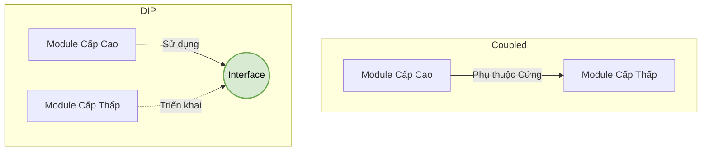

---
title: Dependency Inversion Principle (DIP)
description: Khám phá chữ D cuối cùng trong SOLID - Nguyên lý Đảo ngược Phụ thuộc. Cách để giải phóng các Class cấp cao khỏi sự trói buộc của các Class cấp thấp.
---

# Dependency Inversion Principle (DIP) {#dip}

Chúng ta đã đến với chữ cái cuối cùng và cũng là nguyên lý có tầm ảnh hưởng sâu rộng nhất đến kiến trúc phần mềm hiện đại: **D - Dependency Inversion Principle** (Nguyên lý Đảo ngược Phụ thuộc).

Nguyên lý này được chia làm hai mệnh đề sắc bén:
> 1. *"High-level modules should not depend on low-level modules. Both should depend on abstractions."* (Các module cấp cao không nên phụ thuộc vào các module cấp thấp. Cả hai nên phụ thuộc vào sự trừu tượng - Interface/Abstract Class).
> 2. *"Abstractions should not depend on details. Details should depend on abstractions."* (Sự trừu tượng không nên phụ thuộc vào chi tiết. Các chi tiết nên phụ thuộc vào sự trừu tượng).

## Tại sao phải "Đảo ngược"? {#why-dip}

Trong lập trình kiểu cũ (Truyền thống), một Class chứa logic nghiệp vụ quan trọng (Cấp cao) thường sẽ tự tay khởi tạo (`new`) và gọi trực tiếp các Class phụ trợ như Ghi file, Kết nối Database (Cấp thấp). 

Mô hình truyền thống:
`Module Cấp cao` $\rightarrow$ phụ thuộc vào $\rightarrow$ `Module Cấp thấp`

**Hậu quả:** Khi Module Cấp thấp thay đổi (ví dụ: Đổi từ lưu SQL Server sang MongoDB), Module Cấp cao cũng bị hỏng theo và phải sửa code. Chúng bị "cột chặt" vào nhau (Tightly Coupled).

DIP đảo ngược luồng phụ thuộc đó. Nó nhét một cái Interface vào giữa:
`Module Cấp cao` $\rightarrow$ phụ thuộc vào $\rightarrow$ `Interface` $\leftarrow$ phụ thuộc vào $\leftarrow$ `Module Cấp thấp`

Lúc này, Module Cấp cao là người đặt ra "Luật chơi" (Interface), còn Module Cấp thấp chỉ là kẻ phải tuân theo luật đó. Cấp cao không còn thèm bận tâm Cấp thấp là ai nữa!



## Ví dụ vi phạm DIP (Bóng Đèn và Công Tắc) {#bad-code}

Hãy xem xét một ví dụ thực tế. Bạn có một cái Công tắc (`Switch`) và một Bóng đèn (`LightBulb`). 

```csharp
// Module Cấp thấp (Chi tiết thiết bị)
public class LightBulb 
{
    public void TurnOn() => Console.WriteLine("Bóng đèn Sáng!");
    public void TurnOff() => Console.WriteLine("Bóng đèn Tắt!");
}

// Module Cấp cao (Logic điều khiển)
public class Switch 
{
    private LightBulb _bulb; // Cấp cao phụ thuộc CỨNG vào Cấp thấp!

    public Switch()
    {
        // Tự tay khởi tạo (Cực kỳ nguy hiểm)
        _bulb = new LightBulb(); 
    }

    public void Toggle(bool on) 
    {
        if (on) _bulb.TurnOn();
        else _bulb.TurnOff();
    }
}
```

Đoạn code trên **vi phạm DIP**. Tại sao?
Chiếc công tắc (`Switch`) đang bị hàn chết cứng vào chiếc Bóng đèn (`LightBulb`). Điều gì sẽ xảy ra nếu ngày mai bạn muốn dùng cái công tắc này để bật Quạt trần (`Fan`) hoặc Điều hòa (`AC`)? Bạn sẽ phải đập nát code của `Switch` để sửa `LightBulb` thành `Fan`. Một cái công tắc tốt ngoài đời thực có thể nối vào bất cứ thiết bị điện nào, chứ không phải chỉ một cái bóng đèn!

## Cách khắc phục tuân thủ DIP (Good Code) {#good-code}

Chúng ta sẽ nhét một Abstraction (Interface) vào giữa có tên là `ISwitchable` (Thiết bị có thể Bật/Tắt).

**Bước 1: Tạo Interface (Sự trừu tượng)**
```csharp
public interface ISwitchable 
{
    void TurnOn();
    void TurnOff();
}
```

**Bước 2: Các Module Cấp thấp phụ thuộc vào Interface**
```csharp
// Bóng đèn tuân theo luật ISwitchable
public class LightBulb : ISwitchable 
{
    public void TurnOn() => Console.WriteLine("Bóng đèn Sáng!");
    public void TurnOff() => Console.WriteLine("Bóng đèn Tắt!");
}

// Quạt trần cũng tuân theo luật ISwitchable
public class Fan : ISwitchable 
{
    public void TurnOn() => Console.WriteLine("Quạt trần Quay!");
    public void TurnOff() => Console.WriteLine("Quạt trần Dừng!");
}
```

**Bước 3: Module Cấp cao cũng phụ thuộc vào Interface, KHÔNG `new` đối tượng**
```csharp
public class Switch 
{
    // Chỉ nói chuyện qua Interface! Không quan tâm ruột nó là Bóng Đèn hay Quạt.
    private readonly ISwitchable _device; 

    // Constructor Injection: Ai đó bên ngoài sẽ nhét thiết bị vào đây!
    public Switch(ISwitchable device)
    {
        _device = device; 
    }

    public void Toggle(bool on) 
    {
        if (on) _device.TurnOn();
        else _device.TurnOff();
    }
}
```

**Bước 4: Nối dây ở ngoài cùng (Composition Root)**
```csharp
// Bây giờ công tắc có thể bật bất cứ thứ gì!
ISwitchable myBulb = new LightBulb();
Switch switch1 = new Switch(myBulb);
switch1.Toggle(true); // Bóng đèn Sáng!

ISwitchable myFan = new Fan();
Switch switch2 = new Switch(myFan);
switch2.Toggle(true); // Quạt trần Quay!
```

:::tip Mối liên hệ giữa DIP và DI (Dependency Injection)
- **DIP (Dependency Inversion Principle)** là một **Nguyên lý** (Theory) nói rằng "Hãy đảo ngược luồng phụ thuộc đi".
- **DI (Dependency Injection)** là **Hành động/Kỹ thuật** (Practice) để hiện thực hóa nguyên lý đó. Việc ta truyền đối tượng `ISwitchable device` qua ngoặc tròn `Switch(ISwitchable device)` chính là kỹ thuật "Tiêm sự phụ thuộc" (DI).
Dự án VisualizationDSA của chúng ta sống sót được nhờ áp dụng DI triệt để cho mọi Backend Services!
:::

## Next Steps {#next-steps}

Tuyệt vời! Bạn đã hoàn tất hành trình khai phá 5 nguyên lý **SOLID**:
- **S**RP: Mỗi class chỉ làm 1 việc.
- **O**CP: Đóng code cũ, Mở rộng qua interface mới.
- **L**SP: Con thay thế cha không được lỗi.
- **I**SP: Interface chẻ nhỏ, đừng làm cái đa năng.
- **D**IP: Dùng Interface để các class không bị dính chặt vào nhau.

Kiến thức này đủ để bạn kiến trúc mọi hệ thống phần mềm lớn. Và để chứng minh sức mạnh của những nguyên lý này, chúng ta sẽ bắt đầu tìm hiểu về **Mẫu Thiết kế (Design Patterns)** - những "bài văn mẫu" cực hay mà các kỹ sư thế hệ trước đã dùng SOLID để sáng tạo ra.

<div class="vt-box-container next-steps">
  <a class="vt-box" href="/docs/patterns/singleton">
    <p class="next-steps-link">Bắt đầu Chương Design Patterns: Singleton</p>
    <p class="next-steps-caption">Mẫu thiết kế tạo ra một và chỉ một thực thể duy nhất trên toàn cầu.</p>
  </a>
</div>

