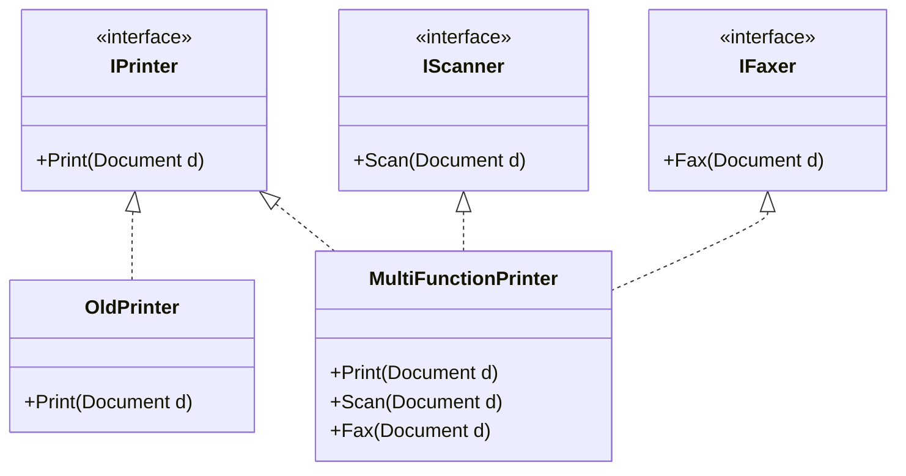

# Nguyên lý Phân tách Giao diện (Interface Segregation Principle) {#isp}

:::info Mục tiêu bài học
- Nhận diện Anti-pattern **Fat Interface (Giao diện béo phì)** – cội nguồn của những đoạn code rác `NotImplementedException`.
- Khám phá phép ẩn dụ về Cỗ máy in đa năng (Multi-function Printer).
- Áp dụng kỹ thuật băm nhỏ Interface (Segregation) để giải phóng các Lớp (Classes) khỏi sự ràng buộc vô lý.
- Học cách sử dụng **Đa kế thừa Giao diện (Multiple Interface Implementation)** trong C#.
:::

## 1. Lời mở đầu: Bản hợp đồng vô lý {#introduction}

Chữ **"I"** trong SOLID đại diện cho **Interface Segregation Principle (ISP)**. Nguyên lý này khá dễ hiểu và có mối liên hệ mật thiết với [SRP (Đơn Trách Nhiệm)](/docs/solid/srp) và [LSP (Thay thế Liskov)](/docs/solid/lsp). Nó được phát biểu như sau:

> *"Client (Bên gọi hàm) không nên bị ép buộc phải phụ thuộc vào những phương thức (Interface) mà nó không sử dụng."*

**Ví dụ thực tế (Real-world analogy):**
Hãy tưởng tượng bạn đi xin việc làm Nhân viên Thu ngân tại một siêu thị. Nhưng trong Bản Hợp Đồng (Interface) mà công ty bắt bạn ký, ngoài mô tả công việc tính tiền, lại có thêm các điều khoản: "Phải biết lái xe nâng hàng", "Phải biết sửa chữa hệ thống điện", "Phải biết trực tổng đài điện thoại". 

Nếu bạn ký hợp đồng đó, bạn sẽ phải đối mặt với 2 rắc rối:
1. Bạn phải từ chối làm các công việc kia (Tương đương với việc ném ra `NotImplementedException`).
2. Bất cứ khi nào phòng Nhân sự thay đổi quy trình "Sửa chữa hệ thống điện", họ lại gửi bản hợp đồng mới yêu cầu bạn... ký lại từ đầu! (Trong khi công việc của bạn chả liên quan gì đến thợ điện).

Trong lập trình OOP, điều tương tự thường xuyên xảy ra khi chúng ta tạo ra một cái Interface quá to (Fat Interface).

---

## 2. Giải phẫu Anti-pattern: Cỗ máy in Đa năng (Fat Interface) {#anti-pattern}

Đây là một ví dụ kinh điển được chính tác giả Robert C. Martin (Uncle Bob) sử dụng để mô tả ISP.

Bạn nhận yêu cầu lập trình cho một hệ thống Máy in Đa Năng hiện đại (Multi-function Machine) ở văn phòng. Nó vừa biết In ấn (Print), vừa biết Quét tài liệu (Scan), vừa biết Gửi Fax. Bạn tạo ra một Interface siêu to khổng lồ `IMachine`.

```csharp
// MÃ XẤU - GIAO DIỆN BÉO PHÌ (FAT INTERFACE)
public interface IMachine
{
    void Print(Document d);
    void Scan(Document d);
    void Fax(Document d);
}

// Cỗ máy xịn xò (MultiFunctionPrinter) cài đặt Interface này rất mượt mà
public class MultiFunctionPrinter : IMachine
{
    public void Print(Document d) { /* In laser màu siêu nét */ }
    public void Scan(Document d) { /* Scan 3D */ }
    public void Fax(Document d) { /* Gửi qua đường truyền quốc tế */ }
}
```

Mọi thứ trông rất hoàn hảo, cho đến khi sếp yêu cầu bạn lập trình thêm cho chiếc **Máy in đen trắng đời cũ (OldPrinter)**. Nó chỉ có khả năng In, không thể Scan và Fax. Nhưng vì luật của OOP, nếu nó `implements IMachine`, nó BẮT BUỘC phải viết code cho cả 3 hàm đó.

```csharp
public class OldPrinter : IMachine
{
    public void Print(Document d) 
    { 
        Console.WriteLine("Đang in rẹt rẹt..."); 
    }

    // Bi kịch bắt đầu từ đây:
    public void Scan(Document d) 
    {
        throw new NotSupportedException("Máy in cùi bắp này làm gì có mắt đọc mà Scan?");
    }

    public void Fax(Document d) 
    {
        throw new NotSupportedException("Máy in không cắm đường dây điện thoại!");
    }
}
```

**Tại sao đây là Thảm họa Kiến trúc?**
- **Vi phạm LSP:** Lớp `OldPrinter` ném ra lỗi `NotSupportedException`, phá vỡ niềm tin của phần mềm y hệt vụ [Đà điểu không biết bay](/docs/solid/lsp).
- **Trói buộc vô nghĩa (Coupling):** Ngày mai, công ty nâng cấp tính năng `Scan` (thêm tham số độ phân giải `int dpi`). Bạn sẽ phải sửa hàm `Scan(Document d, int dpi)` trong Interface `IMachine`. Ngay lập tức, file `OldPrinter.cs` sẽ báo lỗi biên dịch màu đỏ chóe, mặc dù cái máy in cũ đó **KHÔNG BAO GIỜ DÙNG TỚI** tính năng Scan! Bạn bị ép phải sửa code ở một nơi hoàn toàn không liên quan.

---

## 3. Quá trình Phẫu thuật Phân rã (Interface Segregation) {#refactoring}

Nguyên tắc giải quyết rất đơn giản: **Băm nhỏ cái Hợp đồng (Interface) đó ra!**
Thay vì tạo ra một hợp đồng ôm đồm, hãy chia nó thành những bản thỏa thuận nhỏ lẻ, theo từng nhóm chức năng cụ thể (Role Interfaces).



---

## 4. Mã nguồn chuẩn mực ISP (Multiple Interfaces) {#clean-code}

C# (cũng như Java, TypeScript) không cho phép Đa Kế Thừa Lớp (Một Class không thể kế thừa từ 2 Class cha). **NHƯNG**, nó cho phép Đa Kế Thừa Giao Diện vô số kể! (Một Class có thể ký hàng chục bản Hợp đồng Interface).

**Bước 1: Chẻ nhỏ Giao diện (Role Interfaces)**
```csharp
public interface IPrinter
{
    void Print(Document d);
}

public interface IScanner
{
    void Scan(Document d);
}

public interface IFaxer
{
    void Fax(Document d);
}
```

**Bước 2: Cỗ máy đời cũ chỉ cần Ký đúng 1 hợp đồng**
```csharp
// MÃ ĐẸP - OLD PRINTER ĐƯỢC GIẢI THOÁT
public class OldPrinter : IPrinter
{
    public void Print(Document d)
    {
        Console.WriteLine("Đang in trắng đen...");
    }
    // Không còn dòng code RÁC throw Exception nào nữa! Hoàn hảo!
}
```

**Bước 3: Cỗ máy Đa năng sẽ "Đa Kế Thừa" Interface**
Nó có khả năng làm cả 3, nên nó tự nguyện ký cả 3 hợp đồng.
```csharp
public class MultiFunctionPrinter : IPrinter, IScanner, IFaxer
{
    public void Print(Document d) { /* In */ }
    public void Scan(Document d) { /* Scan */ }
    public void Fax(Document d) { /* Fax */ }
}
```

**Sự kỳ diệu ở phía Client (Người dùng hàm):**
Nếu hệ thống của bạn có một Module tên là `PhotoCopier` (Máy Photocopy), nó chỉ cần tính năng In và Scan. Module này sẽ yêu cầu như sau:

```csharp
public class PhotoCopier
{
    // Bắt buộc đầu vào phải hỗ trợ cả In và Scan
    public void Copy(IScanner scanner, IPrinter printer, Document d)
    {
        scanner.Scan(d);
        printer.Print(d);
    }
}
```
Lúc này, bạn có thể truyền cái `MultiFunctionPrinter` vào cả 2 tham số trên. Nhưng nếu ai đó cố tình truyền cái `OldPrinter` vào tham số `scanner`, trình biên dịch C# sẽ vả thẳng mặt và báo lỗi ngay lập tức, bảo vệ hệ thống khỏi một pha sập nguồn!

---

## 5. ISP trong các Framework thực tế (Entity Framework Core) {#real-world}

Bạn không cần phải tự chế ra máy in mới thấy ISP. Hãy nhìn vào những thư viện nổi tiếng nhất thế giới như .NET Core.

Ví dụ, Microsoft có 2 Interface riêng biệt cho Collections:
- `IEnumerable<T>`: Chỉ có 1 chức năng duy nhất là Lặp (Duyệt qua các phần tử bằng `foreach`). Dành cho dữ liệu chỉ đọc.
- `ICollection<T>`: Kế thừa từ `IEnumerable<T>`, nhưng thêm các hàm Thao tác dữ liệu: `Add()`, `Remove()`, `Clear()`.

Tại sao Microsoft không gộp chung `Add()` vào `IEnumerable`?
Bởi vì nếu họ gộp lại, các mảng Tĩnh (Array) như `int[] arr = new int[5]` sẽ bị ép phải cài đặt hàm `Add()`. Nhưng Array tĩnh thì không thể mở rộng kích thước! Khi đó Array sẽ phải `throw NotSupportedException()`. Việc chẻ đôi Interface đã giúp hệ thống an toàn và trong sạch 100%.

:::tip Tóm tắt nhanh (Key Takeaways)
- Interface Segregation Principle (ISP) chống lại các "Fat Interface". Yêu cầu chia nhỏ Giao diện theo từng nhóm hành vi riêng biệt (Role Interfaces).
- Dấu hiệu vi phạm: Lớp con phải viết các hàm rỗng (Dummy) hoặc ném lỗi `NotImplementedException` chỉ để chiều lòng Compiler.
- Lợi ích: Lớp nào cần cái gì thì `implement` cái đó (Đa kế thừa). Sửa đổi một Interface nhỏ sẽ không bao giờ làm vỡ Code của các Lớp không liên quan.
- ISP là hệ quả trực tiếp của LSP: Nhờ có ISP, Lớp con không bao giờ hứa hẹn những thứ nó không làm được, do đó không bao giờ vi phạm LSP.
:::
