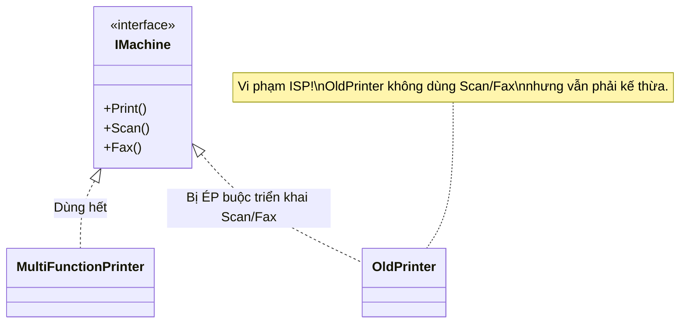

# Interface Segregation Principle (ISP) {#isp}

Nguyên lý thứ tư trong SOLID là chữ **I - Interface Segregation Principle** (Nguyên lý Phân tách Giao diện). 

Được phát biểu bởi Robert C. Martin, nguyên lý này cảnh báo chúng ta về sự nguy hiểm của những Interface khổng lồ (Fat Interfaces). Nó tuyên bố rằng:

> *"Clients should not be forced to depend upon interfaces that they do not use."*
> (Khách hàng không bao giờ bị ép buộc phải phụ thuộc vào các giao diện mà họ không sử dụng.)

Hình dung bạn vào một nhà hàng để ăn phở, nhưng nhà hàng lại ép bạn phải cầm theo một cái menu dày 50 trang chứa đủ các món từ nướng, lẩu, đồ Tây, sushi... Việc phải lật tìm tô phở giữa hàng trăm món bạn không bao giờ gọi thực sự là một sự phiền toái. ISP khuyên nhà hàng nên xé nhỏ menu ra: Menu ăn sáng, Menu đồ uống, Menu ăn tối.



## Ví dụ vi phạm ISP (Máy in Đa năng) {#bad-code}

Giả sử công ty bạn sản xuất các thiết bị văn phòng. Bạn thiết kế một Interface `IMachine` đại diện cho mọi cái máy in.

```csharp
public interface IMachine
{
    void Print(Document d);
    void Scan(Document d);
    void Fax(Document d);
}
```

Với chiếc máy in Đa năng đời mới (Multi-Function Printer), việc cài đặt Interface này hoàn toàn hợp lý:

```csharp
public class MultiFunctionPrinter : IMachine
{
    public void Print(Document d) { /* In tài liệu */ }
    public void Scan(Document d)  { /* Quét tài liệu */ }
    public void Fax(Document d)   { /* Gửi Fax */ }
}
```

Tuy nhiên, hôm sau công ty quyết định sản xuất thêm một dòng **Máy in Cũ kỹ giá rẻ (OldPrinter)**. Nó chỉ có độc một chức năng là In trắng đen. Vì hệ thống bắt buộc các loại máy đều phải dùng `IMachine`, bạn cắn răng cài đặt nó:

```csharp
public class OldPrinter : IMachine
{
    public void Print(Document d) 
    { 
        Console.WriteLine("Đang in trắng đen..."); 
    }

    public void Scan(Document d)  
    { 
        // Máy này không có Scan, phải làm sao? 
        throw new NotImplementedException("Máy này không hỗ trợ Scan!"); 
    }

    public void Fax(Document d)   
    { 
        throw new NotImplementedException("Máy này không hỗ trợ Fax!"); 
    }
}
```

Bạn đã **vi phạm ISP**! (Và hệ lụy kéo theo là vi phạm luôn cả nguyên lý Liskov - LSP vì quăng Exception bừa bãi). Lớp `OldPrinter` đã bị ép phải mang trên lưng những hàm mà nó không bao giờ dùng tới (`Scan`, `Fax`).

## Cách khắc phục tuân thủ ISP (Good Code) {#good-code}

Giải pháp của ISP cực kỳ đơn giản: **Chẻ nhỏ các Interface mập mạp thành nhiều Interface nhỏ, chuyên biệt theo từng vai trò (Role-based Interfaces).**

```csharp
// Tách riêng chức năng In
public interface IPrinter
{
    void Print(Document d);
}

// Tách riêng chức năng Quét
public interface IScanner
{
    void Scan(Document d);
}

// Tách riêng chức năng Fax
public interface IFaxer
{
    void Fax(Document d);
}
```

Bây giờ, sự lắp ghép trở nên linh hoạt như trò chơi Lego:

```csharp
// Máy in đa năng sẽ Kế thừa (Implement) nhiều Interface cùng lúc
public class MultiFunctionPrinter : IPrinter, IScanner, IFaxer
{
    public void Print(Document d) { /* In tài liệu */ }
    public void Scan(Document d)  { /* Quét tài liệu */ }
    public void Fax(Document d)   { /* Gửi Fax */ }
}

// Máy in cũ kỹ chỉ cần Implement đúng thứ nó cần! Không dư thừa 1 dòng code nào.
public class OldPrinter : IPrinter
{
    public void Print(Document d) 
    { 
        Console.WriteLine("Đang in trắng đen..."); 
    }
}
```

## Role Interface (Giao diện theo vai trò) trong Thực tế {#role-interface}

Khái niệm chia nhỏ Interface của ISP dẫn đến một nguyên lý rất nổi tiếng trong **Domain-Driven Design (DDD)** gọi là **Role Interface**.

Thay vì tạo Interface dựa trên *Bản chất của đối tượng* (ví dụ `IUser`, `IVehicle`), hãy tạo Interface dựa trên *Vai trò mà đối tượng đó đang đóng* trong một ngữ cảnh cụ thể (ví dụ `IAuthenticatable`, `IDrivable`).

- Một đối tượng `User` có thể đóng vai trò `IAuthenticatable` khi nó đi qua module Đăng nhập.
- Cùng đối tượng `User` đó có thể đóng vai trò `IOrderCreator` khi nó đi qua module Đặt hàng.

Việc thiết kế theo Role Interface giúp các hàm (hệ thống) chỉ cần đòi hỏi đúng thứ nó cần. Hàm Đăng nhập chỉ cần một thứ "có thể xác thực được", nó không thèm quan tâm thứ đó có chứa thuộc tính `Address` hay `PurchaseHistory` hay không!

:::info ISP trong thế giới .NET
Microsoft là bậc thầy về ISP. Nếu bạn để ý các thư viện của C#, họ thiết kế Interface rất nhỏ gọn. 
Ví dụ: Thay vì tạo một Interface `ICollection` khổng lồ chứa đủ trò `Add, Remove, Sort, Count, Iterate`, họ tách ra thành:
- `IEnumerable` (Chỉ để duyệt qua phần tử bằng `foreach`)
- `ICollection` (Kế thừa IEnumerable, có thêm thuộc tính Count)
- `IList` (Có thêm Indexer `[i]` để truy cập ngẫu nhiên)

Nhờ vậy, khi bạn viết một mảng chỉ-đọc (Read-only list), bạn chỉ cần triển khai `IEnumerable`, không bị ép phải viết các hàm `Add` hay `Remove` vô nghĩa!
:::

## Next Steps {#next-steps}

ISP giúp chúng ta tạo ra các giao diện thanh thoát, vừa vặn như may đo cho từng đối tượng. Nhưng việc các Lớp (Classes) giao tiếp với nhau qua các Interface thay vì nói chuyện trực tiếp với nhau mang lại một lợi ích vĩ đại hơn nhiều. 

Đó là nền tảng của kiến trúc lỏng lẻo (Loosely Coupled), được định nghĩa bởi chữ D cuối cùng trong SOLID: **Dependency Inversion Principle (DIP)**.

<div class="vt-box-container next-steps">
  <a class="vt-box" href="/docs/solid/dip">
    <p class="next-steps-link">Dependency Inversion Principle (DIP)</p>
    <p class="next-steps-caption">Nguyên lý Đảo ngược Phụ thuộc: Đỉnh cao của nghệ thuật lập trình linh hoạt.</p>
  </a>
</div>
