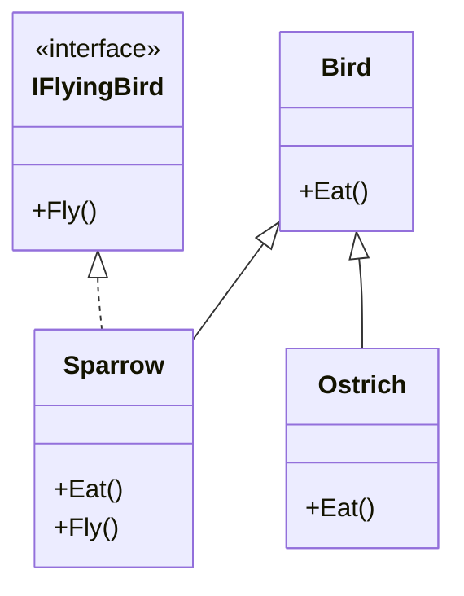
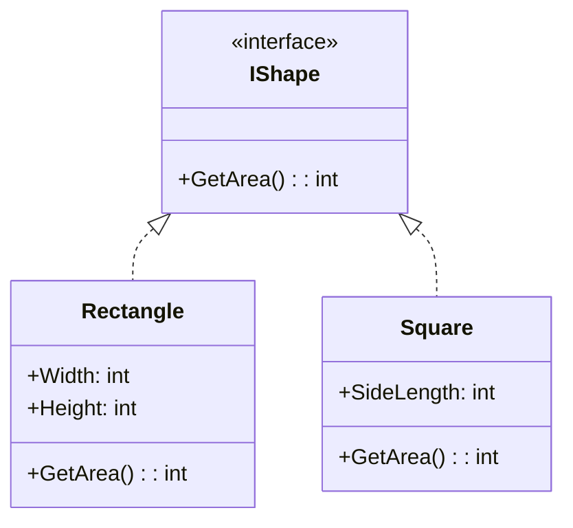

# Nguyên lý Thay thế Liskov (Liskov Substitution Principle) {#lsp}

:::info Mục tiêu bài học
- Phá vỡ định kiến "Đời thực thế nào thì Code thế đó". Hiểu được tại sao Toán học đúng nhưng OOP lại sai.
- Nhận diện Anti-pattern kinh điển: Quăng lỗi `NotImplementedException` một cách vô tội vạ.
- Bóc trần "Cú lừa lịch sử": Bài toán Kế thừa Hình Vuông và Hình Chữ Nhật.
- Nắm vững giải pháp: Cấu trúc lại cây phả hệ (Inheritance Tree) bằng Interface và Abstract Class chuẩn mực.
:::

## 1. Lời mở đầu: Bản hợp đồng của sự Tin tưởng {#introduction}

Chữ **"L"** trong SOLID đại diện cho **Liskov Substitution Principle (LSP)**. Nó được vinh danh theo tên của Giáo sư Barbara Liskov, người đã giới thiệu khái niệm này vào năm 1987. Lời phát biểu gốc toán học của bà khá phức tạp, nhưng Uncle Bob đã dịch nó sang ngôn ngữ lập trình như sau:

> *"Nếu Class B kế thừa từ Class A, thì bạn phải có khả năng sử dụng B để thay thế hoàn toàn cho A ở MỌI NƠI trong chương trình, mà không làm hỏng tính đúng đắn của phần mềm."*

**Nói cách khác:**
Lớp con (Child Class) phải tuân thủ nghiêm ngặt những lời hứa (Hành vi) mà Lớp cha (Parent Class) đã cam kết với thế giới bên ngoài. Lớp con không được phép làm thay đổi ngữ nghĩa, không được phép bóp méo logic, và đặc biệt KHÔNG ĐƯỢC PHÉP từ chối thực hiện một hành động mà Lớp cha nói là làm được.

---

## 2. Giải phẫu Anti-pattern 1: Chim Đà Điểu (The Ostrich Problem) {#anti-pattern-ostrich}

Chúng ta hãy xem xét một ví dụ rất bản năng mà ai mới học OOP cũng hay mắc phải.

Theo sinh học, **Đà Điểu (Ostrich)** chắc chắn là một loài **Chim (Bird)**. Nên ta cho `Ostrich` kế thừa `Bird`. Nghe rất hợp lý đúng không?

```csharp
// MÃ XẤU - VI PHẠM LSP
public class Bird
{
    public virtual void Fly()
    {
        Console.WriteLine("Tôi đang bay lượn trên bầu trời!");
    }
}

public class Ostrich : Bird
{
    // Đà điểu thì không biết bay. Vậy ta đành phải quăng lỗi!
    public override void Fly()
    {
        throw new NotImplementedException("Đà điểu không biết bay đâu pa!");
    }
}
```

Hãy nhìn vào đoạn code sử dụng (Client Code) dưới đây:

```csharp
public void MakeAllBirdsFly(List<Bird> flock)
{
    foreach (var bird in flock)
    {
        // Lập trình viên gọi hàm này tin tưởng tuyệt đối rằng: 
        // "Vì mảng này chứa toàn Bird, mà Bird thì có hàm Fly(), nên chắc chắn gọi sẽ thành công".
        bird.Fly(); 
    }
}

// Khi chương trình chạy:
var birds = new List<Bird> { new Bird(), new Ostrich() };
MakeAllBirdsFly(birds); // BÙM! Ứng dụng CRASH (Sập) ngay lập tức khi vòng lặp chạy tới con Đà điểu.
```

**Tại sao nó Vi phạm LSP?**
Bởi vì `Ostrich` (Lớp con) ĐÃ KHÔNG THỂ THAY THẾ an toàn cho `Bird` (Lớp cha). Lớp cha hứa với thiên hạ là nó biết bay, nhưng Lớp con lại lật lọng và quăng lỗi (Exception). Nó phá vỡ hoàn toàn niềm tin của hàm `MakeAllBirdsFly`.

### Cách chữa trị (Refactoring)
Chúng ta phải thiết kế lại cây phả hệ. Việc "Biết bay" không phải là đặc tính của MỌI loài chim.



```csharp
// MÃ ĐẸP - CHUẨN LSP
public class Bird {
    public void Eat() { Console.WriteLine("Đang ăn..."); }
}

public interface IFlyingBird {
    void Fly();
}

public class Sparrow : Bird, IFlyingBird {
    public void Fly() { Console.WriteLine("Chim sẻ đang bay..."); }
}

public class Ostrich : Bird {
    // Không cài đặt IFlyingBird. Không ai ép nó phải Fly() nữa.
}
```
Bây giờ, hàm của bạn sẽ yêu cầu nhận vào một `List<IFlyingBird>`. Không ai có thể nhét một con Đà điểu vào cái List đó được nữa. Trình biên dịch (Compiler) sẽ chặn lại ngay từ lúc gõ code. Ứng dụng an toàn tuyệt đối!

---

## 3. Cú lừa Lịch sử: Hình Vuông và Hình Chữ Nhật {#square-rectangle}

Đây là bài toán phỏng vấn kinh điển nhất để kiểm tra kiến thức về LSP.

**Trong Toán học:** "Hình Vuông là một trường hợp đặc biệt của Hình Chữ Nhật (khi Chiều dài = Chiều rộng)".
Vậy nên, ta cho `Square` kế thừa từ `Rectangle`. (Có vẻ cực kỳ hợp lý!).

```csharp
// MÃ XẤU - VI PHẠM LSP NGẦM
public class Rectangle
{
    public virtual int Width { get; set; }
    public virtual int Height { get; set; }

    public int GetArea() => Width * Height;
}

public class Square : Rectangle
{
    // Hình vuông bắt buộc cạnh phải bằng nhau. 
    // Nên nếu ai đó cố tình set Width, ta phải ngầm ép Height giống hệt Width.
    public override int Width
    {
        get => base.Width;
        set { base.Width = value; base.Height = value; }
    }

    public override int Height
    {
        get => base.Height;
        set { base.Width = value; base.Height = value; }
    }
}
```

Thoạt nhìn, Class `Square` viết rất thông minh để bảo vệ tính toàn vẹn của Hình Vuông. 
Nhưng hãy xem chuyện gì xảy ra khi một lập trình viên (người không biết gì về Class Square) sử dụng Lớp cha `Rectangle` của bạn:

```csharp
public void TestArea(Rectangle rect)
{
    rect.Width = 5;
    rect.Height = 10;
    
    // Lập trình viên kỳ vọng: Diện tích hình chữ nhật là 5 * 10 = 50.
    int expectedArea = 50; 
    
    // Khẳng định (Assert) kiểm tra tính đúng đắn
    if (rect.GetArea() != expectedArea) 
    {
        throw new Exception($"CÓ LỖI XẢY RA! Diện tích tính ra là {rect.GetArea()} thay vì 50");
    }
}

// Bắt đầu gọi hàm:
Rectangle normalRect = new Rectangle();
TestArea(normalRect); // Chạy bình thường (5 * 10 = 50)

Rectangle squareRect = new Square(); // Đa hình (Polymorphism)
TestArea(squareRect); // BÙM! CRASH CHƯƠNG TRÌNH!
```

**Tại sao lại Crash?**
Hãy dò lại từng dòng của hàm `TestArea` khi truyền `Square` vào:
1. `rect.Width = 5;` $\rightarrow$ Class `Square` âm thầm gán cả `Width = 5` và `Height = 5`.
2. `rect.Height = 10;` $\rightarrow$ Class `Square` lại âm thầm gán cả `Width = 10` và `Height = 10`.
3. Khi gọi `rect.GetArea()`, kết quả trả về là `10 * 10 = 100` (Chứ không phải 50).
4. Chương trình văng lỗi.

**Bài học cốt lõi:** Lớp `Square` đã phá vỡ hành vi kỳ vọng của Lớp `Rectangle`. Đối với một Hình Chữ Nhật chuẩn mực, việc thay đổi Chiều Rộng KHÔNG BAO GIỜ được phép làm thay đổi Chiều Cao. Nhưng Hình Vuông đã lén lút phá vỡ quy tắc này. Do đó, **Trong OOP, Hình Vuông KHÔNG PHẢI LÀ Hình Chữ Nhật!**

### Cách chữa trị bài toán Hình học

Hình Vuông và Hình Chữ Nhật không nên kế thừa lẫn nhau. Chúng chỉ nên là những người anh em họ cùng kế thừa một Hợp đồng (Interface) chung.



```csharp
// MÃ ĐẸP - CHUẨN LSP
public interface IShape
{
    int GetArea();
}

public class Rectangle : IShape
{
    public int Width { get; set; }
    public int Height { get; set; }
    public int GetArea() => Width * Height;
}

public class Square : IShape
{
    public int SideLength { get; set; } // Khái niệm Cạnh thay cho Dài/Rộng
    public int GetArea() => SideLength * SideLength;
}
```

Bây giờ, nếu ai đó cần tính diện tích của một mảng các hình, họ sẽ gọi `List<IShape>`. Họ chỉ quan tâm tới kết quả của hàm `GetArea()`. Sẽ không còn hàm nào bị nhầm lẫn giữa việc gán Width/Height nữa.

---

## 4. Kiểm tra mã nguồn của bạn có vi phạm LSP không? {#check-lsp}

Bạn không cần phải có bằng Tiến sĩ mới biết code của mình có vi phạm LSP hay không. Hãy quét qua source code của bạn, nếu bạn thấy 2 dấu hiệu (Code Smells) sau, 99% bạn đã vi phạm LSP:

1. **Dấu hiệu 1: Quăng lỗi từ chối hỗ trợ**
   Nếu Lớp con Override một hàm của Lớp cha và bên trong chỉ có mỗi dòng:
   `throw new NotImplementedException();` hoặc `throw new NotSupportedException();`
   $\rightarrow$ Lớp con đang kêu gào: *"Tôi không làm được cái mà bố tôi hứa!"*.

2. **Dấu hiệu 2: Dùng lệnh ép kiểu `is` hoặc `as` liên tục**
   Nếu bạn viết một hàm nhận vào Lớp cha, nhưng bên trong lại phải check xem nó có đích thị là Lớp con cụ thể nào không để né lỗi.
   ```csharp
   public void Process(Animal animal)
   {
       // Đáng lẽ chỉ cần animal.Speak() là đủ.
       // Nhưng vì thiết kế sai, phải rẽ nhánh để né lỗi:
       if (animal is Fish) {
           // Bỏ qua, vì cá không biết sủa
       } else {
           animal.Speak();
       }
   }
   ```

:::tip Tóm tắt nhanh (Key Takeaways)
- Liskov Substitution Principle (LSP) yêu cầu Lớp con phải bảo toàn 100% ngữ nghĩa và hành vi đã được định nghĩa ở Lớp cha.
- Đừng để ngôn ngữ tự nhiên (hoặc Toán học) đánh lừa bạn trong OOP. Một "Đà điểu" là "Chim" trong sinh học, nhưng không nên kế thừa trong Code nếu "Chim" mặc định phải biết Bay.
- Đừng bao giờ tạo ra một cây phả hệ (Inheritance Tree) quá sâu. Hãy ưu tiên dùng Interface (Trừu tượng hóa Hành vi) thay vì Kế thừa Class (Trừu tượng hóa Trạng thái).
:::
