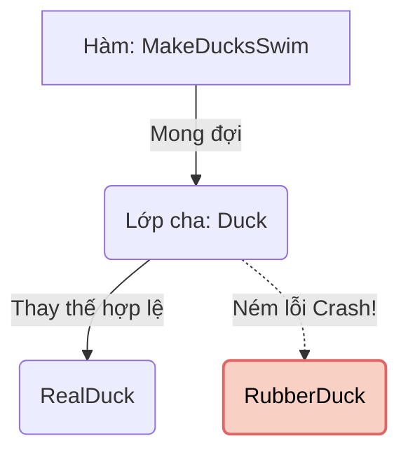

# Liskov Substitution Principle (LSP) {#lsp}

Liskov Substitution Principle (Nguyên lý thay thế Liskov) là chữ **L** trong SOLID, được đặt theo tên của nhà khoa học máy tính Barbara Liskov. Nguyên lý này phát biểu rằng:

> *"If S is a subtype of T, then objects of type T may be replaced with objects of type S without altering any of the desirable properties of the program."*
> (Nếu S là lớp con của T, thì các đối tượng kiểu T có thể được thay thế bằng các đối tượng kiểu S mà không làm thay đổi tính đúng đắn của chương trình.)

Nói một cách dân dã: **Lớp con phải có thể đứng vào chỗ của Lớp cha và hoạt động bình thường, mà người gọi không cần biết (hoặc không cần quan tâm) đó là cha hay con.**

Nếu bạn truyền một đối tượng Lớp con vào hàm đang mong đợi Lớp cha, và chương trình bị Crash hoặc trả ra kết quả sai lệch hoàn toàn, bạn đã vi phạm LSP!



## Ví dụ vi phạm LSP (Vịt Cao Su) {#bad-code}

Hãy xem một ví dụ kinh điển về việc "Cố đấm ăn xôi" khi dùng tính Kế thừa (Inheritance).

Giả sử bạn thiết kế lớp `Duck` (Con Vịt) có khả năng kêu "Quạc quạc" và biết bơi.

```csharp
public class Duck
{
    public virtual void Quack() => Console.WriteLine("Quạc quạc!");
    public virtual void Swim() => Console.WriteLine("Vịt đang bơi...");
}
```

Hệ thống hoạt động tốt. Hôm sau, sếp yêu cầu bạn lập trình thêm một con Vịt Cao Su (`RubberDuck`) để bán đồ chơi. Vì Vịt Cao Su cũng là một loại Vịt, bạn quyết định cho nó kế thừa từ `Duck` để tái sử dụng code. Tuy nhiên, Vịt cao su kêu "Chíp chíp" chứ không kêu "Quạc quạc", và nó không biết tự bơi (Nó nổi).

```csharp
public class RubberDuck : Duck
{
    public override void Quack() => Console.WriteLine("Chíp chíp!");
    
    // Vịt cao su không biết tự bơi, nên bạn quyết định ném lỗi!
    public override void Swim() 
    {
        throw new NotSupportedException("Vịt cao su không biết bơi!");
    }
}
```

Đến đây, bạn đã chính thức **vi phạm nguyên lý Liskov!** Tại sao?
Hãy nhìn vào đoạn code sử dụng các con vịt:

```csharp
public void MakeDucksSwim(List<Duck> ducks)
{
    foreach (var duck in ducks)
    {
        // Chương trình sẽ CRASH ngay lập tức khi vòng lặp chạm tới con Vịt Cao Su!
        duck.Swim(); 
    }
}
```
Hàm `MakeDucksSwim` mong đợi một danh sách những con vịt `Duck` (Lớp cha). Theo nguyên lý LSP, nó phải có quyền giả định rằng mọi con vịt đều có thể gọi hàm `Swim()` một cách an toàn. Nhưng `RubberDuck` (Lớp con) lại tự ý phá vỡ khế ước này bằng cách ném ra lỗi `NotSupportedException`. Lớp con đã không thể thay thế được lớp cha!

## Cách khắc phục tuân thủ LSP (Good Code) {#good-code}

Lỗi vi phạm LSP thường bắt nguồn từ việc **Kế thừa sai bản chất**. Vịt cao su không phải là Vịt thật, nó chỉ giống Vịt thôi. 

Để khắc phục, ta nên tách các hành vi (Behavior) ra thành các **Interface** riêng biệt, thay vì dồn tất cả vào một Lớp cha ép các Lớp con phải kế thừa.

```csharp
// Tách hành vi ra
public interface IQuackable
{
    void Quack();
}

public interface ISwimmable
{
    void Swim();
}

// Vịt thật: Biết cả kêu và bơi
public class RealDuck : IQuackable, ISwimmable
{
    public void Quack() => Console.WriteLine("Quạc quạc!");
    public void Swim() => Console.WriteLine("Vịt đang bơi...");
}

// Vịt đồ chơi: Chỉ biết kêu, KHÔNG triển khai ISwimmable
public class RubberDuck : IQuackable
{
    public void Quack() => Console.WriteLine("Chíp chíp!");
}
```

Bây giờ, nếu một hàm bắt buộc các con vật phải bơi, hàm đó sẽ nhận tham số là `ISwimmable`.

```csharp
public void MakeDucksSwim(List<ISwimmable> ducks)
{
    foreach (var duck in ducks)
    {
        duck.Swim(); // An toàn tuyệt đối 100%
    }
}
```
Bạn sẽ không bao giờ có thể truyền nhầm `RubberDuck` vào hàm này được nữa, vì trình biên dịch C# sẽ báo lỗi ngay từ lúc gõ code!

## Thiết kế theo Khế ước (Design by Contract) {#design-by-contract}

Để hiểu sâu hơn về LSP ở góc độ học thuật, Bertrand Meyer đã định nghĩa nguyên lý này thông qua **Khế ước (Contract)**. Khi lớp con kế thừa lớp cha, nó phải tuân thủ 3 điều kiện khắt khe:

1. **Preconditions (Điều kiện tiên quyết) không được thắt chặt hơn:** 
   Nếu lớp cha yêu cầu tham số đầu vào `(int age)` chỉ cần `age > 0`, thì lớp con không được phép ném lỗi khi `age < 18`. Lớp con bắt buộc phải chấp nhận tất cả những gì lớp cha chấp nhận.
2. **Postconditions (Điều kiện hậu quả) không được nới lỏng hơn:**
   Nếu lớp cha cam kết trả về một số dương `> 0`, lớp con không được phép trả về `0` hoặc `-1`. Nó phải tuân thủ cam kết kết quả đầu ra của cha.
3. **Invariants (Bất biến) phải được giữ nguyên:**
   Nếu lớp cha có một thuộc tính luôn đúng (ví dụ: `Balance >= 0` trong tài khoản ngân hàng), lớp con không được phép thực hiện bất cứ hành động nào làm cho `Balance` bị âm.

LSP không chỉ là việc gọi hàm không bị lỗi, mà còn là việc **Logic nghiệp vụ** phải được giữ nguyên vẹn!

:::tip LSP và Hình vuông/Hình chữ nhật
Một ví dụ vi phạm LSP cực kỳ nổi tiếng khác trong giới học thuật là việc cho lớp `Square` (Hình vuông) kế thừa lớp `Rectangle` (Hình chữ nhật).
Trong toán học, hình vuông là một hình chữ nhật đặc biệt. Nhưng trong lập trình, nếu `Rectangle` có `SetWidth()` và `SetHeight()` độc lập, thì `Square` không thể kế thừa chúng (vì đổi Width của hình vuông thì Height cũng phải đổi theo, phá vỡ logic tính diện tích của Rectangle).
**Bài học:** Thế giới thực (Toán học) không phải lúc nào cũng map 1:1 sang thiết kế Hướng đối tượng!
:::

## Next Steps {#next-steps}

Việc ép một lớp con phải thừa kế những phương thức mà nó không bao giờ xài tới (như hàm `Swim()` của Vịt cao su) không chỉ vi phạm LSP mà còn vi phạm một nguyên lý khác của SOLID.

Nguyên lý tiếp theo sẽ dạy bạn nghệ thuật "chia nhỏ" các Interface khổng lồ để không làm nghẹn các Lớp triển khai nó. Chào mừng đến với chữ I: **Interface Segregation Principle (ISP)**.

<div class="vt-box-container next-steps">
  <a class="vt-box" href="/docs/solid/isp">
    <p class="next-steps-link">Interface Segregation (ISP)</p>
    <p class="next-steps-caption">Nguyên lý Phân tách Giao diện: Đừng ép khách hàng ăn món họ không gọi.</p>
  </a>
</div>
