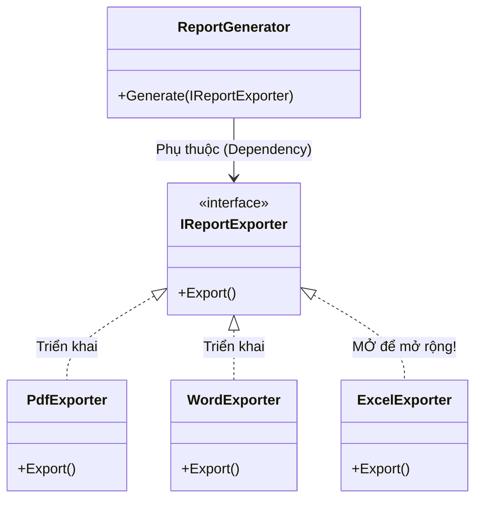

# Open-Closed Principle (OCP) {#ocp}

Nguyên lý thứ hai trong bộ 5 nguyên lý SOLID là chữ **O - Open-Closed Principle** (Nguyên lý Đóng - Mở). 

Được phát biểu bởi Bertrand Meyer vào năm 1988, nguyên lý này khẳng định:
> *"Software entities (classes, modules, functions, etc.) should be open for extension, but closed for modification."*
> (Các thực thể phần mềm nên được MỞ để mở rộng, nhưng ĐÓNG đối với việc sửa đổi).

Nghe có vẻ mâu thuẫn? Làm sao bạn có thể thêm một tính năng mới vào hệ thống mà không động vào dòng code cũ nào? Bí quyết nằm ở tính Đa hình (Polymorphism) và Kế thừa (Inheritance).

## Tại sao phải Đóng - Mở? {#why-ocp}

Mỗi khi bạn sửa đổi một đoạn code cũ đã hoạt động ổn định trên Production (để thêm tính năng mới), bạn đang đánh cược với số phận! Việc sửa code cũ có thể vô tình gây ra lỗi (bug) ảnh hưởng dây chuyền đến những tính năng khác đang sử dụng đoạn code đó.

Với OCP, khi có yêu cầu thêm tính năng mới:
- **Mở (Open):** Bạn tha hồ viết thêm các Class mới, Interface mới để phục vụ tính năng đó.
- **Đóng (Closed):** Bạn không được phép sửa mã nguồn của các Class cũ (ngoại trừ sửa bug).

## Ví dụ vi phạm OCP (Bad Code) {#bad-code}

Giả sử bạn đang viết tính năng kết xuất báo cáo (Export Report). Ban đầu, công ty chỉ yêu cầu xuất ra file `PDF` và `Word`.

```csharp
public class ReportGenerator
{
    public void Export(string reportType)
    {
        if (reportType == "PDF")
        {
            Console.WriteLine("Đang xuất báo cáo ra file PDF...");
        }
        else if (reportType == "Word")
        {
            Console.WriteLine("Đang xuất báo cáo ra file Word...");
        }
    }
}
```

Đoạn code trên hoạt động hoàn hảo. Tuy nhiên, sếp đột nhiên yêu cầu: *"Tuần sau, hệ thống phải hỗ trợ xuất ra file Excel và CSV nhé!"*.

Bạn sẽ làm gì? Thêm 2 cái `else if` vào class `ReportGenerator`?
Nếu làm vậy, bạn đã **vi phạm OCP**! Bạn đang phải mổ xẻ một Class cũ ra để thêm code mới. Ngày mai sếp đòi thêm 10 định dạng nữa, hàm `Export` của bạn sẽ biến thành một đống rác ngập ngụa câu lệnh `if-else`.

## Cách khắc phục tuân thủ OCP (Good Code) {#good-code}

Để giải quyết, chúng ta hãy áp dụng **Tính Đa hình (Polymorphism)**. *(Nếu bạn chưa nắm vững Đa hình, hãy xem bài [Tính Đa hình](/docs/oop/polymorphism) trước khi tiếp tục)*. 

Chúng ta sẽ "đóng" class xử lý chung lại, và "mở" không gian để tạo ra các class định dạng mới.



**Bước 1: Tạo một Abstraction (Giao diện chung)**

```csharp
// Đóng gói hành vi xuất báo cáo vào một Interface
public interface IReportExporter
{
    void Export();
}
```

**Bước 2: Tạo các Class cụ thể triển khai (Mở để mở rộng)**

```csharp
public class PdfExporter : IReportExporter
{
    public void Export() => Console.WriteLine("Đang xuất báo cáo ra file PDF...");
}

public class WordExporter : IReportExporter
{
    public void Export() => Console.WriteLine("Đang xuất báo cáo ra file Word...");
}
```

**Bước 3: Class chính chỉ phụ thuộc vào Abstraction**

```csharp
public class ReportGenerator
{
    // Class này giờ đã được ĐÓNG. Nó không quan tâm có bao nhiêu loại báo cáo.
    public void Generate(IReportExporter exporter)
    {
        // Chạy đa hình
        exporter.Export();
    }
}
```

Bây giờ, khi sếp yêu cầu thêm định dạng `Excel`:
Bạn **KHÔNG CẦN** đụng vào `ReportGenerator`. Bạn chỉ việc tạo một class mới tinh:

```csharp
// MỞ rộng dễ dàng
public class ExcelExporter : IReportExporter
{
    public void Export() => Console.WriteLine("Đang xuất báo cáo ra file Excel...");
}
```

Và sử dụng:
```csharp
ReportGenerator generator = new ReportGenerator();
generator.Generate(new ExcelExporter()); // Chạy hoàn hảo!
```

:::tip OCP trong thực tế
Trong dự án **VisualizationDSA** của chúng ta, mỗi thuật toán sắp xếp (Bubble, Quick, Merge) là một Class riêng biệt kế thừa chung một Interface `ISortingAlgorithm`.
Mỗi khi thêm một thuật toán mới, chúng ta chỉ việc tạo Class mới, hoàn toàn không đụng vào `AnimationEngine` (động cơ vẽ hình gốc). Đó chính là OCP!
:::

## Next Steps {#next-steps}

OCP giúp hệ thống mở rộng dễ dàng thông qua Kế thừa và Interface. Tuy nhiên, việc Kế thừa một cách vô tội vạ lại sinh ra một loại lỗi cực kỳ ức chế: Lớp con kế thừa lớp cha nhưng lại "phá hỏng" quy tắc của cha.

Đó là lý do chúng ta cần đến chữ L trong SOLID. Hãy cùng chuyển sang **Liskov Substitution Principle (LSP)**.

<div class="vt-box-container next-steps">
  <a class="vt-box" href="/docs/solid/lsp">
    <p class="next-steps-link">Liskov Substitution Principle (LSP)</p>
    <p class="next-steps-caption">Kế thừa sao cho đúng: Con phải có thể thay thế hoàn toàn cho Cha.</p>
  </a>
</div>
