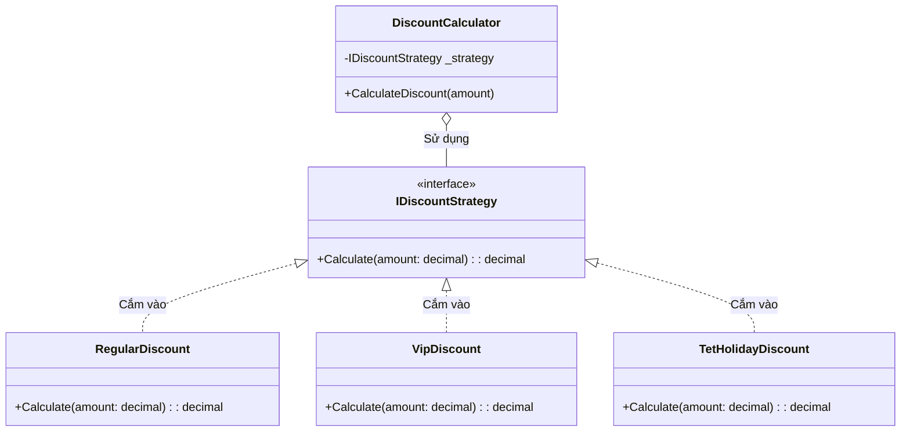

# Nguyên lý Đóng Mở (Open-Closed Principle) {#ocp}

:::info Mục tiêu bài học
- Thấu hiểu triết lý mâu thuẫn nhưng kỳ diệu: **"Đóng cho việc sửa đổi, nhưng Mở cho việc mở rộng"**.
- Bóc trần Anti-pattern nguy hiểm nhất mọi thời đại: Những khối `if/else` hoặc `switch/case` vô tận.
- Ứng dụng Thiết kế hướng Giao diện (Interface) và Đa hình (Polymorphism) để bẻ gãy mã nguồn cứng nhắc.
- Crossover kiến thức: Khám phá cách OCP khai sinh ra mẫu thiết kế (Design Pattern) nổi tiếng nhất thế giới: **Strategy Pattern**.
:::

## 1. Lời mở đầu: Cơn ác mộng if/else {#introduction}

Chữ **"O"** trong SOLID đại diện cho **Open-Closed Principle (OCP)** do Bertrand Meyer giới thiệu năm 1988:

> *"Một thực thể phần mềm (Class, Module, Function) nên được MỞ (Open) để thêm mới tính năng, nhưng phải ĐÓNG (Closed) trước việc bị sửa đổi (Modify)."*

Nghe có vẻ vô lý phải không? Làm sao bạn có thể thêm một tính năng mới (Ví dụ: Thêm một loại giảm giá mới) mà không cần phải mở file tính tiền ra sửa code?

**Câu trả lời nằm ở Phích cắm điện:**
Ổ điện trong nhà bạn tuân thủ hoàn hảo OCP.
- Nó **Đóng**: Bạn không cần đập tường, lôi dây đồng ra nối mỗi khi mua một cái Quạt mới hay một cái TV mới.
- Nó **Mở**: Chỉ cần thiết bị của bạn có cái phích cắm 2 chấu chuẩn (Interface), bạn có thể thoải mái cắm thêm tủ lạnh, nồi cơm điện, máy sấy... mà Ổ điện không cần biết đó là cái gì.

Trong lập trình, OCP yêu cầu mã nguồn của chúng ta phải hoạt động hệt như cái Ổ điện đó.

---

## 2. Giải phẫu Anti-pattern: Rẽ nhánh mù quáng {#anti-pattern}

Đây là đoạn code tính chiết khấu (Discount) phổ biến nhất của các thực tập sinh.

```csharp
// MÃ XẤU - VI PHẠM OCP
public class DiscountCalculator
{
    public decimal Calculate(decimal totalAmount, string customerType)
    {
        // Mỗi lần công ty có chương trình khuyến mãi mới, 
        // bạn PHẢI MỞ FILE NÀY RA SỬA (Vi phạm Đóng)
        if (customerType == "KhachThuong")
        {
            return totalAmount; // Không giảm
        }
        else if (customerType == "VIP")
        {
            return totalAmount * 0.9m; // Giảm 10%
        }
        else if (customerType == "SuperVIP")
        {
            return totalAmount * 0.8m; // Giảm 20%
        }
        else if (customerType == "DịpTết") // Vừa sếp bắt thêm vào
        {
            return totalAmount - 50000; // Trừ thẳng 50k
        }
        
        return totalAmount;
    }
}
```

**Tại sao nó tồi tệ?**
- Tuần sau, Sếp đòi thêm hạng "Khách Vàng", "Khách Bạc". Bạn lại mở khối `if` ra sửa.
- Một rủi ro khủng khiếp luôn thường trực: Mỗi lần bạn đụng vào khối `if` này, bạn có thể vô tình gõ nhầm một dấu phẩy hoặc ngoặc nhọn, và đánh sập hoàn toàn logic tính toán của các khách VIP đang chạy ổn định.
- File sẽ phình to ra hàng ngàn dòng (Spaghetti Code).

---

## 3. Liều thuốc đặc trị: Abstraction & Polymorphism {#refactoring}

Để làm cái "Phích cắm điện" trong Lập trình, ta dùng **Interface (Tính Trừu tượng)**. 

Thay vì bắt `DiscountCalculator` phải biết mọi công thức toán học, ta định nghĩa một tiêu chuẩn chung: *"Tôi không cần biết anh là khuyến mãi gì, miễn là anh cung cấp cho tôi một hàm tính tiền."*



Nhìn vào sơ đồ trên, `DiscountCalculator` (Ổ điện) chỉ phụ thuộc vào `IDiscountStrategy` (Tiêu chuẩn phích cắm 2 chấu). Nó không hề quan tâm dưới đó có bao nhiêu cục sạc (Concrete Class) đang nối vào.

---

## 4. Mã nguồn chuẩn mực OCP (Strategy Pattern) {#clean-code}

Hãy xem sức mạnh của việc chia tách kiến trúc.

**Bước 1: Chế tạo ổ điện (Interface)**
```csharp
public interface IDiscountStrategy
{
    decimal ApplyDiscount(decimal totalAmount);
}
```

**Bước 2: Chế tạo các thiết bị (Các class rời rạc)**
Mỗi một chiến lược giảm giá sẽ nằm độc lập trong một file riêng biệt. 
*(Nếu hàm giảm giá VIP có lỗi, Khách Thường hoàn toàn không bị ảnh hưởng, vì chúng nằm ở 2 file khác nhau!)*

```csharp
public class RegularDiscount : IDiscountStrategy
{
    public decimal ApplyDiscount(decimal totalAmount) => totalAmount;
}

public class VipDiscount : IDiscountStrategy
{
    public decimal ApplyDiscount(decimal totalAmount) => totalAmount * 0.9m; // Giảm 10%
}

public class TetHolidayDiscount : IDiscountStrategy
{
    public decimal ApplyDiscount(decimal totalAmount) => totalAmount - 50000; // Trừ thẳng 50k
}
```

**Bước 3: Người tiêu thụ (Discount Calculator)**
```csharp
// MÃ ĐẸP - CHUẨN OCP VÀ STRATEGY PATTERN
public class DiscountCalculator
{
    private readonly IDiscountStrategy _discountStrategy;

    // Yêu cầu "Cắm phích" thông qua Constructor (Dependency Injection)
    public DiscountCalculator(IDiscountStrategy discountStrategy)
    {
        _discountStrategy = discountStrategy;
    }

    public decimal CalculateFinalPrice(decimal totalAmount)
    {
        // Nó ĐÓNG hoàn toàn. Không bao giờ cần sửa lại hàm này nữa!
        return _discountStrategy.ApplyDiscount(totalAmount);
    }
}
```

### Kỳ tích xảy ra khi mở rộng (MỞ)
Tuần tới, sếp yêu cầu thêm chương trình **"Sinh Nhật Khách Hàng (Giảm 50%)"**.
Bạn sẽ làm gì? 
1. Mở file `DiscountCalculator.cs` ra thêm lệnh `if`? -> **KHÔNG!**
2. Bạn chỉ việc tạo một File MỚI TINH mang tên `BirthdayDiscount.cs` cài đặt `IDiscountStrategy`. 
3. Sau đó, ở tầng gọi hàm (Controller), bạn tiêm (Inject) cái Class mới này vào `DiscountCalculator`. 

Bạn đã thêm được tính năng mới mà không phải chạm vào bất kỳ dòng mã cũ nào. Đó chính là cảnh giới tối thượng của **Open-Closed Principle**.

---

## 5. Đừng cực đoan (Edge Cases) {#edge-cases}

OCP là tuyệt vời, nhưng hãy cẩn trọng với việc Tối ưu hóa Sớm (Premature Optimization).
- Nếu ứng dụng của bạn CHẮC CHẮN chỉ có đúng 2 loại Khách hàng (Member và Guest) và không bao giờ có ý định sinh thêm loại thứ 3. Việc dùng `if/else` lại tốt hơn vì nó quá nhanh và dễ đọc. Việc ép buộc đẻ ra 1 đống Interface và Factory Pattern lúc này sẽ làm dự án trở nên cồng kềnh, phức tạp hóa không cần thiết.
- Quy tắc số 3 (Rule of Three): Nếu bạn thấy một khối `if/else` hoặc `switch` lặp đi lặp lại **lần thứ 3** khi yêu cầu thay đổi, ĐÓ LÀ LÚC BẠN PHẢI REFACTOR sang OCP.

:::tip Tóm tắt nhanh (Key Takeaways)
- OCP là nguyên lý chống lại sự suy thoái của mã nguồn: Thêm tính năng mới bằng cách tạo File mới, thay vì đi sửa đổi File cũ.
- Dấu hiệu vi phạm: Hàm chứa các khối `if/else`, `switch/case` phân nhánh theo "Loại" (Type).
- Cách khắc phục: Trích xuất các logic phân nhánh ra thành các Class độc lập tuân theo chung một `Interface` (Tính Đa Hình). 
- OCP chính là nền tảng cốt lõi của hàng loạt Design Patterns nổi tiếng như Strategy, Factory Method, và State Pattern.
:::

## Next Steps {#next-steps}

Bạn đã nắm vững cách dùng Interface và Tính Đa hình để "Mở cho mở rộng, Đóng cho sửa đổi". Tiếp theo, hãy khám phá các nguyên lý liền kề và mẫu thiết kế được khai sinh từ chính tư duy OCP.

<div class="vt-box-container next-steps">
  <a class="vt-box" href="/docs/solid/lsp">
    <p class="next-steps-link">Nguyên lý Thay thế Liskov (LSP)</p>
    <p class="next-steps-caption">Đảm bảo lớp con có thể thay thế an toàn cho lớp cha mà không phá vỡ hành vi hệ thống.</p>
  </a>
  <a class="vt-box" href="/docs/solid/dip">
    <p class="next-steps-link">Nguyên lý Đảo ngược Phụ thuộc (DIP)</p>
    <p class="next-steps-caption">Đưa tư duy trừu tượng hóa lên đỉnh cao: phụ thuộc vào Interface thay vì chi tiết triển khai.</p>
  </a>
  <a class="vt-box" href="/docs/patterns/strategy">
    <p class="next-steps-link">Strategy Pattern</p>
    <p class="next-steps-caption">Mẫu thiết kế được khai sinh từ OCP — đóng gói từng thuật toán thành đối tượng có thể hoán đổi linh hoạt.</p>
  </a>
</div>

## 📚 Tham khảo lý thuyết {#references}

Các kiến thức lý thuyết trong bài được tổng hợp và đối chiếu từ những nguồn học thuật sau:

- **Nguyên lý Open-Closed (OCP) và triết lý "Mở cho mở rộng, Đóng cho sửa đổi":** Robert C. Martin (Uncle Bob), *Clean Code: A Handbook of Agile Software Craftsmanship* (Prentice Hall, 2008) và *Clean Architecture: A Craftsman's Guide to Software Structure and Design* (Prentice Hall, 2017) — Chương 8 *The Open-Closed Principle (OCP)*.
- **Khái niệm gốc do Bertrand Meyer giới thiệu năm 1988:** Bertrand Meyer, *Object-Oriented Software Construction* (Prentice Hall, 1988); Wikipedia, *Open–closed principle* — https://en.wikipedia.org/wiki/Open%E2%80%93closed_principle
- **Bộ nguyên lý SOLID nói chung:** Wikipedia, *SOLID* — https://en.wikipedia.org/wiki/SOLID và Microsoft Learn — *SOLID Design Principles* (hướng dẫn kiến trúc .NET).
- **Strategy Pattern và cách áp dụng OCP vào các mẫu thiết kế:** Microsoft Learn — *Design patterns in .NET* và GeeksforGeeks, *Open Closed Principle* (chuyên mục Design Pattern).
