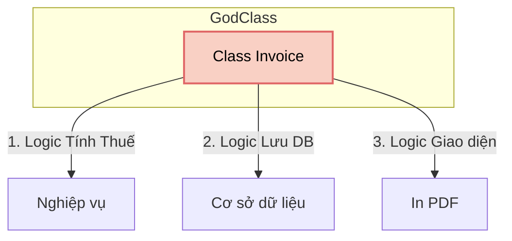

---
title: Nguyên lý Đơn trách nhiệm (SRP)
description: Khám phá Single Responsibility Principle - nguyên lý nền tảng nhất để viết mã nguồn dễ đọc, dễ bảo trì và dễ test trong C#.
---

# Nguyên lý Đơn trách nhiệm (SRP) {#srp}

**Single Responsibility Principle (SRP)** là chữ cái **S** trong cụm từ viết tắt **S.O.L.I.D** do Robert C. Martin (Uncle Bob) giới thiệu. 

Nguyên lý này phát biểu rằng:
> *"Một class (lớp) chỉ nên có **duy nhất một lý do để thay đổi**."*
> (A class should have one, and only one, reason to change.)

## Diễn giải thực tế {#explanation}

Hãy hiểu đơn giản: Mỗi class chỉ nên chịu trách nhiệm cho **một công việc duy nhất**. 

Nếu một class đảm nhiệm quá nhiều chức năng (Ví dụ: Vừa tính toán logic nghiệp vụ, vừa kết nối database, vừa in dữ liệu ra file PDF), thì nó được gọi là một **"God Class" (Lớp Chúa tể)**. Khi đó, nếu yêu cầu định dạng PDF thay đổi, hoặc database đổi từ SQL Server sang MongoDB, bạn đều phải vào sửa cùng một class. Sự phụ thuộc chéo này khiến code của bạn cực kỳ mỏng manh (fragile) và dễ sinh lỗi (bugs).



## Ví dụ vi phạm SRP (Bad Practice) {#bad-practice}

Dưới đây là một class `Invoice` ôm đồm quá nhiều việc:

```csharp
public class Invoice
{
    public decimal Amount { get; set; }
    public string CustomerName { get; set; }

    public Invoice(decimal amount, string customerName)
    {
        Amount = amount;
        CustomerName = customerName;
    }

    // 1. Trách nhiệm: Tính toán nghiệp vụ
    public decimal CalculateTax()
    {
        return Amount * 0.1m;
    }

    // 2. Trách nhiệm: Lưu trữ dữ liệu (Database)
    public void SaveToDatabase()
    {
        Console.WriteLine($"Đang kết nối SQL Server và lưu hóa đơn của {CustomerName}...");
    }

    // 3. Trách nhiệm: Định dạng báo cáo (UI/Export)
    public void PrintInvoice()
    {
        Console.WriteLine($"--- HÓA ĐƠN ---");
        Console.WriteLine($"Khách hàng: {CustomerName}");
        Console.WriteLine($"Tổng tiền: {Amount + CalculateTax()}");
    }
}
```

:::warning Vấn đề ở đây là gì?
Lớp `Invoice` trên có tới **3 lý do để thay đổi**:
1. Thuế suất thay đổi (Logic nghiệp vụ).
2. Sếp yêu cầu lưu vào File thay vì SQL (Logic lưu trữ).
3. Đội Marketing muốn đổi màu sắc và thiết kế của hóa đơn in ra (Logic hiển thị).
:::

## Refactor tuân thủ SRP (Good Practice) {#good-practice}

Để tuân thủ SRP, chúng ta sẽ tách 3 trách nhiệm đó ra thành 3 class độc lập. Class `Invoice` giờ đây chỉ làm đúng 1 việc: chứa dữ liệu và tính toán logic thuộc về hóa đơn.

```csharp
// 1. Chỉ chứa dữ liệu và logic cốt lõi của Hóa đơn
public class Invoice
{
    public decimal Amount { get; set; }
    public string CustomerName { get; set; }

    public Invoice(decimal amount, string customerName)
    {
        Amount = amount;
        CustomerName = customerName;
    }

    public decimal CalculateTax()
    {
        return Amount * 0.1m;
    }
}

// 2. Chỉ chịu trách nhiệm lưu trữ (Repository)
public class InvoiceRepository
{
    public void Save(Invoice invoice)
    {
        // Code kết nối DB và lưu trữ...
        Console.WriteLine($"Đã lưu hóa đơn của {invoice.CustomerName} vào DB.");
    }
}

// 3. Chỉ chịu trách nhiệm in ấn/hiển thị (Printer)
public class InvoicePrinter
{
    public void Print(Invoice invoice)
    {
        // Code xuất ra máy in, PDF, hoặc HTML...
        Console.WriteLine($"--- HÓA ĐƠN ---");
        Console.WriteLine($"Khách: {invoice.CustomerName}");
        Console.WriteLine($"Thuế: {invoice.CalculateTax()}");
    }
}
```

**Cách kiểm tra nhanh SRP:**
Hãy thử miêu tả class của bạn bằng lời nói. Nếu trong câu miêu tả có chứa chữ **"VÀ"** (ví dụ: "Lớp này dùng để quản lý User **VÀ** gửi email"), thì 99% class của bạn đang vi phạm SRP.

## Ưu điểm của SRP {#benefits}

- **Dễ đọc, dễ hiểu:** Mỗi class rất ngắn gọn và tập trung vào một việc.
- **Dễ bảo trì:** Lỗi ở chức năng gửi email thì vào tìm class `EmailSender`, lỗi ở DB thì tìm class `Repository`. Không phải mò mẫm trong 1 class hàng ngàn dòng code.
- **Dễ Unit Test:** Test một chức năng duy nhất luôn dễ dàng hơn test một cục code rối rắm trộn lẫn nhiều thứ.

:::tip Mẹo phỏng vấn
Khi được yêu cầu review một đoạn code trong buổi phỏng vấn, dấu hiệu đầu tiên để bạn chỉ trích đoạn code đó là độ dài của Class. Nếu một Class dài hơn 500 dòng, hãy mạnh dạn tuyên bố: *"Class này có vẻ đang vi phạm nguyên lý Single Responsibility. Tôi đề xuất chúng ta nên tách nó ra..."*
:::

<details class="vt-quiz">
<summary>📝 Kiểm tra nhanh: `UserController` có được phép kết nối Database không?</summary>

**Đáp án:** KHÔNG! Trách nhiệm của `Controller` chỉ là nhận Request từ HTTP và trả về Response. Việc kết nối Database là trách nhiệm của `Repository` hoặc `DbContext`. Nếu nhét chung vào Controller, bạn đang vi phạm SRP trầm trọng!
</details>

## Next Steps {#next-steps}

Sau khi đã chia nhỏ các class thành từng chức năng riêng biệt, làm sao để thêm tính năng mới vào ứng dụng mà không cần phải "mổ xẻ" các class cũ ra sửa? Hãy tìm hiểu nguyên lý thứ 2: **Open-Closed Principle (OCP)**.

<div class="vt-box-container next-steps">
  <a class="vt-box" href="/docs/solid/ocp">
    <p class="next-steps-link">Open-Closed Principle</p>
    <p class="next-steps-caption">Mở để mở rộng, Đóng để sửa đổi.</p>
  </a>
</div>

