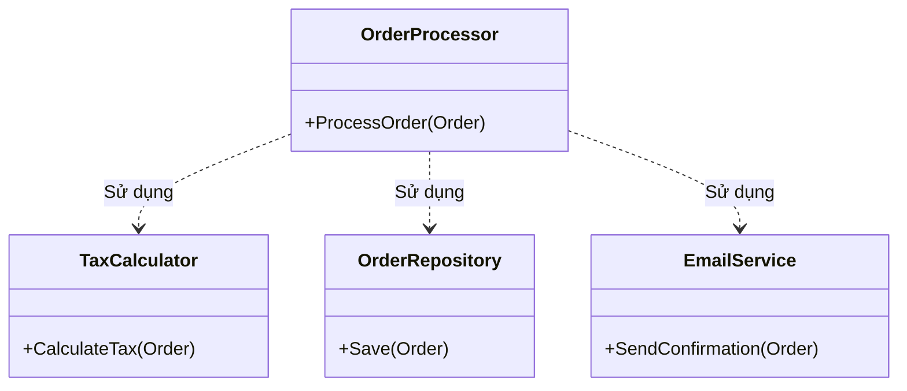

# Nguyên lý Đơn Trách Nhiệm (Single Responsibility Principle) {#srp}

:::info Mục tiêu bài học
- Định nghĩa lại chữ "Trách nhiệm" (Responsibility) dưới góc nhìn chuẩn mực của thiết kế hệ thống.
- Nhận diện **"Lớp Thượng Đế" (God Class) / Anti-pattern** - Căn bệnh ung thư lây lan sự phụ thuộc (Coupling) khắp mã nguồn.
- Mổ xẻ dự án thực tế: Phân rã luồng Thanh toán Đơn hàng (E-commerce Order Processing) thành các Component độc lập.
- Nắm được cách thiết kế Dependency Injection cơ bản ngay từ bước phân rã lớp.
:::

## 1. Lời mở đầu: Thế nào là "Một Trách nhiệm"? {#introduction}

Chữ **"S"** trong **SOLID** đại diện cho **Single Responsibility Principle (SRP)**. Nguyên lý này được phát biểu bởi Robert C. Martin (Uncle Bob) như sau:

> *"Một Lớp (Class) chỉ nên có duy nhất **MỘT LÝ DO ĐỂ THAY ĐỔI** (A class should have one, and only one, reason to change)."*

Khoan đã, "Lý do để thay đổi" nghĩa là gì?
Hãy tưởng tượng bạn đang viết một hệ thống Thương mại điện tử (E-commerce). Bạn tạo ra một lớp tên là `OrderProcessor`. Lớp này nhận vào thông tin đơn hàng, tính toán thuế (Tax), kết nối tới CSDL (Database) để lưu trữ, và cuối cùng gửi một Email xác nhận cho khách.

Một ngày nọ, sếp yêu cầu bạn:
1. *"Pháp luật vừa thay đổi, từ nay Thuế VAT phải tính thêm 2%."* -> Bạn mở file `OrderProcessor` ra sửa logic tính Thuế.
2. *"Công ty vừa chuyển từ SQL Server sang MongoDB."* -> Bạn lại mở file `OrderProcessor` ra sửa câu lệnh Query.
3. *"Marketing muốn đổi template Email sang giao diện HTML mới."* -> Lại tiếp tục mở file `OrderProcessor` ra để sửa chữ.

**Hậu quả:** File `OrderProcessor` của bạn có tới **3 lý do để thay đổi**. Nó đã ôm đồm quá nhiều trách nhiệm, biến thành một **"Lớp Thượng Đế" (God Class)**. Mỗi lần bạn đụng tay vào file này để sửa Database, bạn hoàn toàn có nguy cơ đánh sập nhầm chức năng Gửi Email! (Bởi vì chúng nằm chung một chỗ và có thể đang dùng chung biến toàn cục).

---

## 2. Giải phẫu Anti-pattern: God Class (Mã nguồn xấu) {#anti-pattern}

Đây là một ví dụ C# điển hình của những Lập trình viên mới vào nghề. Mọi thứ hoạt động bình thường, nhưng kiến trúc thì bốc mùi (Code Smell).

```csharp
// MÃ XẤU - VI PHẠM SRP NGHIÊM TRỌNG
public class OrderProcessor
{
    public void ProcessOrder(Order order)
    {
        // TRÁCH NHIỆM 1: Xử lý Business Logic
        if (order.Items.Count == 0)
        {
            throw new Exception("Đơn hàng rỗng!");
        }

        // TRÁCH NHIỆM 2: Tính toán Thuế (Tax Calculation)
        decimal taxRate = 0.08m; // Thuế mặc định
        if (order.Country == "VN") 
        {
            taxRate = 0.1m; // 10% VAT
        }
        order.TotalAmount = order.SubTotal + (order.SubTotal * taxRate);

        // TRÁCH NHIỆM 3: Giao tiếp Database (Data Access Layer)
        using (var connection = new SqlConnection("Server=myServerAddress;Database=myDataBase;"))
        {
            connection.Open();
            var command = new SqlCommand("INSERT INTO Orders...", connection);
            command.ExecuteNonQuery();
        }

        // TRÁCH NHIỆM 4: Giao tiếp mạng (Notification)
        var smtpClient = new SmtpClient("smtp.gmail.com");
        var mail = new MailMessage("no-reply@shop.com", order.CustomerEmail)
        {
            Subject = "Xác nhận đơn hàng",
            Body = $"Cảm ơn bạn đã mua hàng. Tổng tiền: {order.TotalAmount}"
        };
        smtpClient.Send(mail);
    }
}
```

### Tại sao đoạn code trên lại là "Thảm họa"?
1. **Khó bảo trì:** File dài hàng ngàn dòng, logic đan xen chằng chịt.
2. **Không thể Test tự động (Unit Test):** Muốn Test thử hàm tính tiền xem đúng chưa, bạn bị ép buộc phải có kết nối Internet (để gửi Email) và có CSDL SQL (để insert). Nếu rớt mạng, bài Test tính tiền lập tức Báo lỗi FAILED!
3. **Khó tái sử dụng:** Ở một nơi khác trong hệ thống cũng cần gửi Email cho khách (Ví dụ: Chúc mừng sinh nhật). Bạn không thể gọi hàm `ProcessOrder` ra dùng được vì nó đính kèm cả việc trừ tiền và lưu Database! Bạn đành phải Copy-Paste đoạn code gửi Email ra chỗ mới -> Vi phạm nguyên tắc **DRY (Don't Repeat Yourself)**.

---

## 3. Quá trình Phẫu thuật Phân rã (Refactoring) {#refactoring}

Để chữa căn bệnh này, ta sẽ cầm dao mổ, cắt lớp `OrderProcessor` thành 4 Component nhỏ, mỗi Component quản lý một nghiệp vụ (Domain) duy nhất.



Nhìn vào sơ đồ trên, `OrderProcessor` giờ đây không còn tự tay làm mọi việc nữa. Nhiệm vụ của nó bây giờ chỉ là **Người điều phối (Orchestrator)** – gọi các phòng ban khác (Lớp khác) vào làm việc.

---

## 4. Mã nguồn chuẩn mực SRP (C#) {#clean-code}

Hãy xem cách chúng ta chia nhỏ file khổng lồ ban đầu thành các file Class gọn gàng, sắc nét.

**File 1: Chuyên gia tính thuế (Chỉ đổi khi Thuế thay đổi)**
```csharp
public class TaxCalculator
{
    public void ApplyTax(Order order)
    {
        decimal taxRate = order.Country == "VN" ? 0.1m : 0.08m;
        order.TotalAmount = order.SubTotal + (order.SubTotal * taxRate);
    }
}
```

**File 2: Chuyên gia Database (Chỉ đổi khi DB thay đổi)**
```csharp
public class OrderRepository
{
    public void SaveToDatabase(Order order)
    {
        using (var connection = new SqlConnection("Server=myServerAddress;..."))
        {
            connection.Open();
            // Logic Insert SQL...
            Console.WriteLine("Đã lưu đơn hàng vào DB.");
        }
    }
}
```

**File 3: Chuyên gia Mạng/Thông báo (Chỉ đổi khi SMTP/Giao diện thay đổi)**
```csharp
public class EmailService
{
    public void SendConfirmation(Order order)
    {
        // Logic SMTP SmtpClient...
        Console.WriteLine($"Đã gửi Email tới {order.CustomerEmail}");
    }
}
```

**Cuối cùng: Trả lại sự trong sạch cho Người điều phối**
Tại lớp `OrderProcessor`, chúng ta không tự `new EmailService()` ở bên trong hàm nữa (Bởi vì `new` là keo dán dính chặt - Tightly Coupled). Thay vào đó, ta yêu cầu ai đó khởi tạo sẵn các chuyên gia này rồi **"Tiêm" (Inject)** chúng vào qua Hàm tạo (Constructor). Kỹ thuật này gọi là **Dependency Injection (DI)**.

```csharp
// MÃ ĐẸP - CHUẨN SRP & DI CƠ BẢN
public class OrderProcessor
{
    private readonly TaxCalculator _taxCalculator;
    private readonly OrderRepository _repository;
    private readonly EmailService _emailService;

    // Yêu cầu tiêm (Inject) các phòng ban vào khi tạo Lớp này
    public OrderProcessor(
        TaxCalculator taxCalculator, 
        OrderRepository repository, 
        EmailService emailService)
    {
        _taxCalculator = taxCalculator;
        _repository = repository;
        _emailService = emailService;
    }

    public void ProcessOrder(Order order)
    {
        // Điều kiện kinh doanh cốt lõi (Core Business)
        if (order.Items.Count == 0) throw new Exception("Đơn hàng rỗng!");

        // Giao việc cho các chuyên gia (Delegation)
        _taxCalculator.ApplyTax(order);
        _repository.SaveToDatabase(order);
        _emailService.SendConfirmation(order);
    }
}
```

---

## 5. Khi nào thì nên dừng chia nhỏ? (Edge Cases) {#edge-cases}

Dù SRP rất tuyệt vời, nhưng nếu lạm dụng (Over-engineering), bạn sẽ tạo ra hàng trăm file Class tí hon chỉ có 1 dòng code. Điều này khiến việc theo dõi luồng chạy của chương trình trở thành cơn ác mộng (Spaghetti of files).

**Tiêu chí quyết định:**
Sự kết dính (Cohesion) là thước đo. Nếu 2 chức năng luôn LUÔN thay đổi CÙNG LÚC với nhau, chúng nên nằm trong CÙNG MỘT CLASS.
Ví dụ: `CalculateTax()` và `CalculateDiscount()` đều là nghiệp vụ tính giá tiền (Pricing). Bạn hoàn toàn có thể gom chúng vào một class `PricingService` thay vì phải chẻ nhỏ ra thành `TaxService` và `DiscountService`.

:::tip Tóm tắt nhanh (Key Takeaways)
- Một Class chỉ nên có **Một Lý do duy nhất để bị sửa đổi**.
- Dấu hiệu vi phạm (Code Smell): Class quá dài (vượt quá 500 dòng), chứa nhiều thư viện ngoại lai (`using System.Data.SqlClient`, `using System.Net.Mail` đứng cạnh nhau).
- Việc chia nhỏ giúp Code có khả năng Unit Test tuyệt vời (Bạn có thể Mock/Giả lập cái EmailService để test riêng phần Tính thuế).
- Hãy bắt đầu phân tách thành 3 Lớp tiêu chuẩn: **Logic Toán học (Business)**, **Lưu trữ (Data/Repository)**, và **Giao tiếp ngoại vi (Email/API/Logger)**.
:::

---

## 📚 Tham khảo lý thuyết

- **Robert C. Martin (Uncle Bob)** - *Clean Code: A Handbook of Agile Software Craftsmanship* (Chương 2 & Chương 3 về Functions và SOLID), *Clean Architecture: A Craftsman's Guide to Software Structure and Design*.
- **Robert C. Martin** - Bài viết gốc [*The Single Responsibility Principle*](https://blog.cleancoder.com/uncle-bob/2014/05/08/SingleReponsibilityPrinciple.html).
- **Wikipedia** - [SOLID](https://en.wikipedia.org/wiki/SOLID), mục [Single-responsibility principle](https://en.wikipedia.org/wiki/Single-responsibility_principle).
- **Microsoft Learn** - [Architectural Principles](https://learn.microsoft.com/en-us/dotnet/architecture/modern-web-apps-azure/architectural-principles).
- **GeeksforGeeks** - *Single Responsibility Principle in Java with Examples*.

---

## Next Steps {#next-steps}

Bạn đã nắm vững nguyên lý đầu tiên của bộ SOLID. Để tiếp tục hành trình, hãy khám phá:

<div class="vt-box-container next-steps">
  <a class="vt-box" href="/docs/solid/ocp">
    <p class="next-steps-link">Open-Closed Principle (OCP)</p>
    <p class="next-steps-caption">Nguyên lý thứ hai của SOLID — mở rộng hành vi mà không sửa đổi mã nguồn đã tồn tại.</p>
  </a>
  <a class="vt-box" href="/docs/di/basics">
    <p class="next-steps-link">Cơ bản về DI & IoC</p>
    <p class="next-steps-caption">Đi sâu vào Dependency Injection — kỹ thuật tiêm phụ thuộc vừa được áp dụng trong bài.</p>
  </a>
</div>
